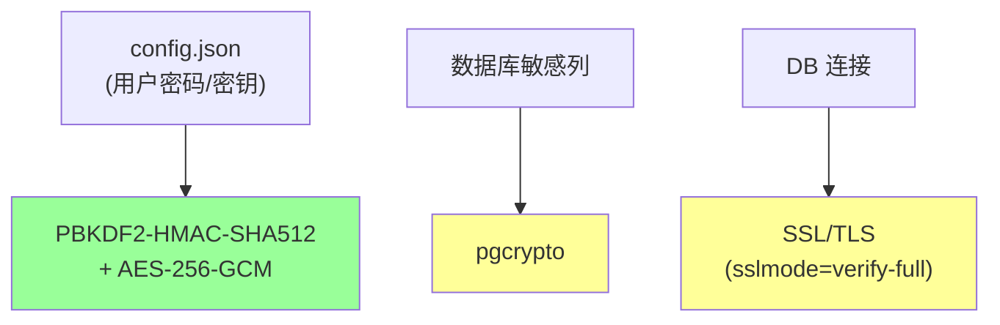
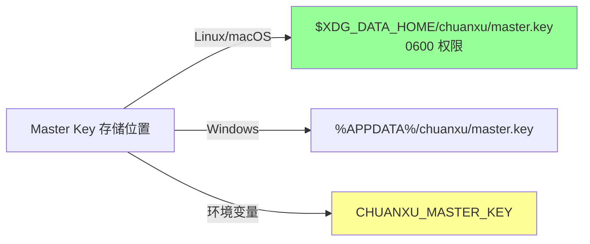

# §43 加密机制与密钥管理

> 🏛️ 架构师 · 👤 用户 · 🧑‍💻 开发者
>
> **一句话定位**:三层加密 — config.json(AES-256-GCM + PBKDF2)、数据库列(pgcrypto)、连接(SSL/TLS)。

---

## 1. 三层加密



---

## 2. config.json 加密

来源:[`lib/connection_crypto.py`](../../scripts/lib/connection_crypto.py)、[`scripts/tools/encrypt_config.py`](../../scripts/tools/encrypt_config.py)

### 2.1 加密的字段

| 字段 | 原因 |
|---|---|
| `database.password` | 数据库密码 |
| `security.session_secret` | Session 签名密钥 |
| `llm.api_key` | LLM API Key |
| `model_routing.*.api_key` | 多模型路由的 Key |

### 2.2 加密方式

```python
# lib/connection_crypto.py
from cryptography.hazmat.primitives.kdf.pbkdf2 import PBKDF2HMAC
from cryptography.hazmat.primitives.ciphers.aead import AESGCM
import os, base64

def encrypt_field(plaintext: str, master_key: bytes) -> str:
    # 1: PBKDF2 派生
    salt = os.urandom(16)
    kdf = PBKDF2HMAC(
        algorithm=hashes.SHA512(),
        length=32,
        salt=salt,
        iterations=100_000
    )
    derived = kdf.derive(master_key)

    # 2: AES-256-GCM 加密
    aes = AESGCM(derived)
    nonce = os.urandom(12)
    ciphertext = aes.encrypt(nonce, plaintext.encode(), None)

    # 3: 拼接 salt + nonce + ciphertext
    return base64.b64encode(salt + nonce + ciphertext).decode()
```

### 2.3 解密

```python
def decrypt_field(encrypted: str, master_key: bytes) -> str:
    raw = base64.b64decode(encrypted)
    salt, nonce, ciphertext = raw[:16], raw[16:28], raw[28:]

    kdf = PBKDF2HMAC(
        algorithm=hashes.SHA512(),
        length=32,
        salt=salt,
        iterations=100_000
    )
    derived = kdf.derive(master_key)

    aes = AESGCM(derived)
    plaintext = aes.decrypt(nonce, ciphertext, None)
    return plaintext.decode()
```

### 2.4 Master Key 管理

来源:[`lib/connection_crypto.py:get_master_key`](../../scripts/lib/connection_crypto.py)



### 2.5 自动加密触发

```python
# web_app.py 启动时
def auto_encrypt_config(config_path):
    config = load_config(config_path)
    changed = False
    for path in ["database.password", "security.session_secret", "llm.api_key"]:
        value = traverse(config, path)
        if value and not value.startswith("_encrypted:"):
            encrypted = encrypt_field(value, master_key)
            traverse_and_set(config, path, f"_encrypted:{encrypted}")
            changed = True
    if changed:
        save_config(config_path, config)
        os.chmod(config_path, 0o600)
```

> 🔐 **首次启动后**,明文**不再保留**。

---

## 3. 数据库列加密(pgcrypto)

来源:[`scripts/deploy/1_schema.sql` + pgcrypto 扩展](../../scripts/deploy/1_schema.sql)

### 3.1 加密列

| 表.列 | 加密方式 |
|---|---|
| `cx_agent_credentials.public_key` | pgcrypto |
| `cx_mfa_factors.secret` | pgcrypto |
| `cx_memory_versions.content_digest` | SHA-256(明文 + salt) |
| `cx_memory_ingestion_findings` | 加密内容 |

### 3.2 pgcrypto 用法

```sql
-- 加密
SELECT pgp_sym_encrypt('plaintext', 'encryption_key');

-- 解密
SELECT pgp_sym_decrypt(column, 'encryption_key');
```

### 3.3 密钥存储

> ⚠️ pgcrypto 的对称密钥(`encryption_key`)**也是** secret。需要外部管理:
> - 环境变量
> - 密钥管理服务(KMS) ⚠️企业版
> - Vault

---

## 4. 连接加密(SSL/TLS)

来源:[`lib/connection.py`](../../scripts/lib/connection.py)

### 4.1 psycopg2 SSL

```python
connection = psycopg2.connect(
    host="localhost",
    port=5432,
    user="ai_agent_runtime",
    password="...",
    dbname="chuanxu",
    sslmode="verify-full",   # 必须
    sslcert="/path/to/client.crt",
    sslkey="/path/to/client.key",
    sslrootcert="/path/to/ca.crt"
)
```

### 4.2 推荐配置

| 部署类型 | sslmode |
|---|---|
| 本地开发 | `disable`(仅) |
| 内网 | `require` 或 `verify-ca` |
| 生产 | **必须** `verify-full` |

---

## 5. 密码哈希

### 5.1 Argon2id(默认)

```python
from lib.identity_api import hash_password_argon2id, verify_password_hash

# 哈希
hash = hash_password_argon2id("user_password")
# 输出格式: $argon2id$v=19$m=65536,t=3,p=1$<salt>$<hash>

# 验证
ok = verify_password_hash("user_password", hash)
```

### 5.2 参数

| 参数 | 默认值 | 含义 |
|---|---|---|
| `time_cost` | 3 | 迭代次数 |
| `memory_cost` | 65536 | 内存(KB,64 MiB) |
| `parallelism` | 1 | 线程数 |
| `hash_len` | 32 | 输出长度 |
| `salt_len` | 16 | salt 长度 |

### 5.3 PBKDF2(兼容旧版本)

```python
# scripts/lib/security.py
hash_password(password, algorithm="pbkdf2_sha256", iterations=100_000)
```

> 默认 PBKDF2-HMAC-SHA256,100k 迭代。

---

## 6. Token 加密

### 6.1 Enrollment Token

```python
# 一次性 token
token = secrets.token_urlsafe(32)
# 存哈希到数据库,原始 token 只返回一次
hash = pbkdf2_hmac("sha256", token.encode(), salt, 100_000)
```

### 6.2 Access Token

```python
# JWT
import jwt

token = jwt.encode(
    payload={
        "principal_id": principal.principal_id,
        "permission_version": principal.permission_version,
        "exp": datetime.now() + timedelta(seconds=300)
    },
    key=SESSION_SECRET,
    algorithm="HS256"
)
```

### 6.3 Session ID

- 256 位随机数
- 存储为 hash
- Cookie 中带 httpOnly + secure

---

## 7. 数据库 SSL 部署

```bash
# PostgreSQL 服务端
# postgresql.conf
ssl = on
ssl_cert_file = '/path/to/server.crt'
ssl_key_file = '/path/to/server.key'
ssl_ca_file = '/path/to/ca.crt'

# pg_hba.conf
hostssl all all 0.0.0.0/0 md5 clientcert=verify-full
```

---

## 8. 主密钥备份

```bash
# Linux/macOS:主密钥在
$XDG_DATA_HOME/chuanxu/master.key
# 默认 ~/.local/share/chuanxu/master.key

# 备份到安全位置(密码管理器 / HSM)
cp ~/.local/share/chuanxu/master.key /secure/backup/location/
chmod 400 /secure/backup/location/master.key
```

> 🔐 **丢失主密钥 = 无法解密 config.json + 数据库连接失败**

---

## 9. 密钥轮换

```bash
# 1. 生成新主密钥
python -c "from cryptography.fernet import Fernet; print(Fernet.generate_key().decode())" > new_master.key

# 2. 用旧密钥解密 + 新密钥加密
"$PYTHON_BIN" scripts/tools/encrypt_config.py rotate \
  --old-master-key ~/.local/share/chuanxu/master.key \
  --new-master-key ./new_master.key

# 3. 替换主密钥文件
mv ./new_master.key ~/.local/share/chuanxu/master.key
chmod 600 ~/.local/share/chuanxu/master.key
```

### 9.1 数据库凭据轮换

```bash
psql -U postgres -c "ALTER USER ai_agent_runtime PASSWORD 'new_strong_password';"

# 更新 config.json(自动加密)
"$PYTHON_BIN" scripts/tools/encrypt_config.py encrypt config.json
```

---

## 10. 故障排查

| 问题 | 排查 |
|---|---|
| 解密失败 | 检查主密钥是否丢失或被替换 |
| 数据库连接 SSL 失败 | 检查 `sslmode` 与证书 |
| 密码哈希不匹配 | 检查算法升级路径 |
| Token 验证失败 | 检查 `permission_version` |

---

## 11. 交叉引用

- 配置:[§30 首次部署与初始化](30-首次部署与初始化.md)
- 身份:[§12 身份与 Principal 控制面](12-身份与Principal控制面.md)
- 离线:[§28 离线部署与 wheel 验证](28-离线部署与wheel验证.md)

> 📌 **下一章**:[§44 应急控制与紧急停用](44-应急控制与紧急停用.md) — 多步应急操作与节点回收。