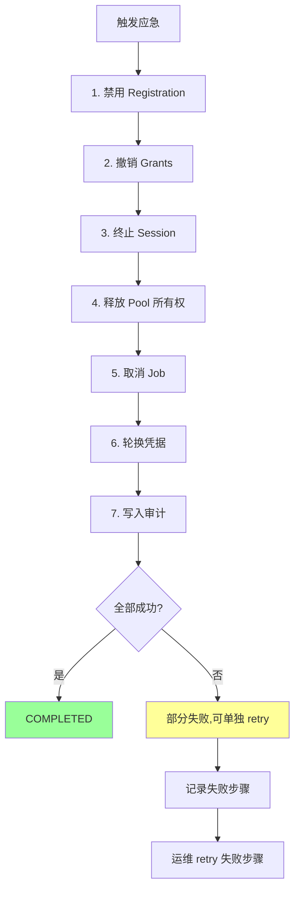
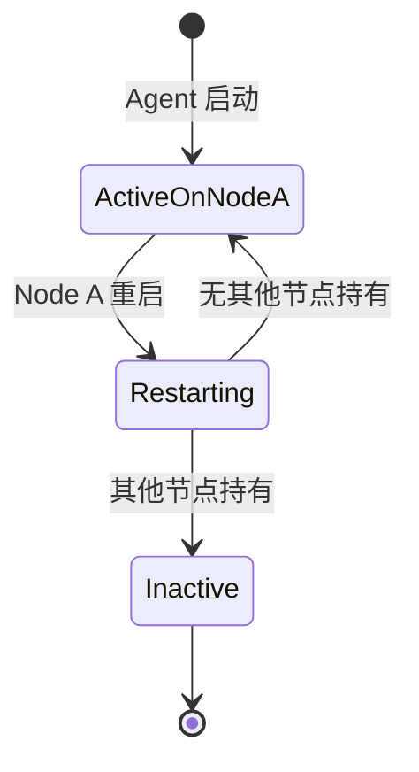
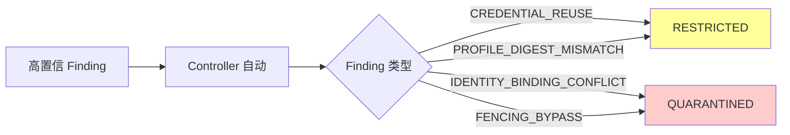
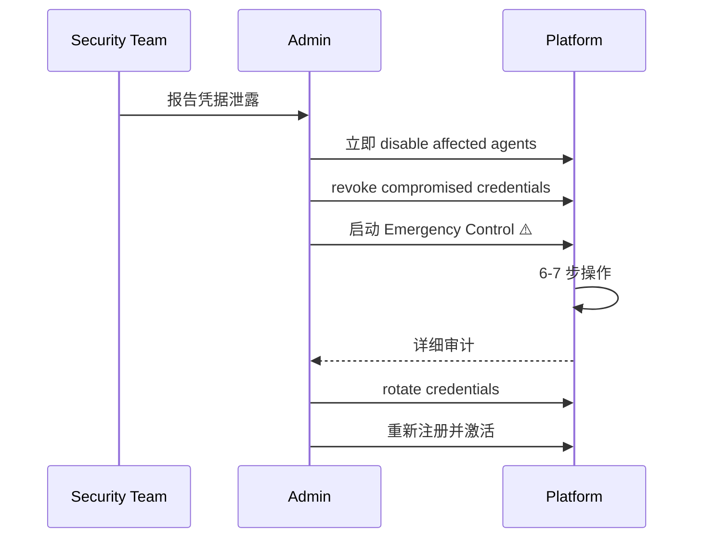
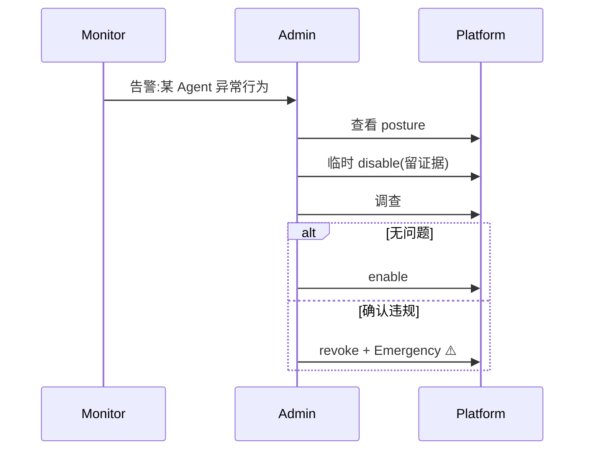
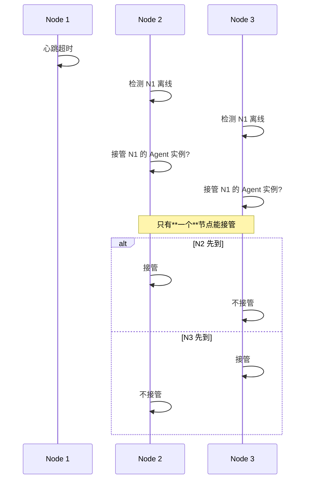

# §44 应急控制与紧急停用 ⚠️ 企业版(部分)

> 🏛️ 架构师 · 👤 用户 · 🧑‍💻 开发者
>
> **一句话定位**:紧急停用是**多步可重试**的数据库操作,涉及禁用/撤销/终止/释放/取消/轮换;Community 版提供基础禁用,Enterprise 才有完整应急控制面。

---

## 1. 应急控制全景



来源:[`docs/architecture.md:80-87`](architecture.md)、[`docs/security.md:50-58`](../security.md)

---

## 2. 紧急停用 vs 普通禁用

| 维度 | 普通禁用 | 紧急停用 |
|---|---|---|
| 触发者 | Admin | Admin / 自动 |
| 范围 | 单 Agent | Agent + Grants + Sessions |
| 可逆性 | ✅ Admin 可重新启用 | ⚠️ 需要手动恢复 |
| 步骤数 | 1 | 6-7 |
| 失败处理 | 简单 | 单独 retry |
| 审计 | 单条 | 完整 multi-step audit |

---

## 3. Community 版基础操作

即使没有完整 Enterprise 应急控制面,Community 版也支持:

| 操作 | API |
|---|---|
| 禁用 Agent | `POST /api/admin/agent/disable` |
| 启用 Agent | `POST /api/admin/agent/enable` |
| 撤销 | `POST /api/admin/agent/revoke` |
| 凭据轮换 | `agent_bootstrap.py rotate` |

---

## 4. Enterprise 应急控制 API ⚠️

来源:[`docs/api-reference.md` v4.3.0 治理面](../../docs/api-reference.md)

### 4.1 启动应急控制

```bash
POST /api/governance/emergency
{
  "target_principal_id": "agent_x",
  "reason": "Detected credential compromise",
  "steps": [
    "disable_registration",
    "revoke_grants",
    "terminate_sessions",
    "release_pool_ownership",
    "cancel_jobs",
    "rotate_credentials"
  ]
}
```

返回:

```json
{
  "emergency_id": "EMRG_xxx",
  "status": "IN_PROGRESS",
  "step_results": [
    {"step": "disable_registration", "status": "SUCCESS", "at": "..."},
    {"step": "revoke_grants", "status": "SUCCESS", "at": "..."},
    {"step": "terminate_sessions", "status": "FAILED", "error": "..."},
    ...
  ]
}
```

### 4.2 查询状态

```bash
GET /api/governance/emergency/{id}
```

### 4.3 重试失败步骤

```bash
POST /api/governance/emergency/{id}/retry
{
  "failed_step": "terminate_sessions",
  "reason": "..."
}
```

> 🔐 只重试失败的步骤,**不**重复成功的步骤。

---

## 5. 节点隔离与恢复

来源:[`docs/security.md:50-58`](../security.md)、[`scripts/deploy/8_portal_node_ownership.sql`](../../scripts/deploy/8_portal_node_ownership.sql)

### 5.1 Portal Agent 节点所有权



### 5.2 启动时回收

```python
# web_app.py: 启动时执行
def reclaim_portal_agents(local_node_id):
    """回收本节点的 Portal Agent 实例"""
    with connection.get_connection() as conn:
        with conn.cursor() as cur:
            cur.execute("""
                UPDATE cx_agent_instances
                SET node_id = %s, fencing_token = gen_random_uuid()
                WHERE node_id = %s
            """, (local_node_id, local_node_id))
```

> 🔐 **不**回收其他节点的实例 — 这是多节点部署的核心安全保证。

---

## 6. Agent 状态变更操作

### 6.1 禁用

```bash
POST /api/admin/agent/disable
{
  "agent_id": "agent_x",
  "reason": "Maintenance window"
}
```

| 字段 | 必填 |
|---|---|
| `agent_id` | ✅ |
| `reason` | ✅(必填原因) |

### 6.2 启用

```bash
POST /api/admin/agent/enable
{
  "agent_id": "agent_x",
  "reason": "Maintenance complete"
}
```

### 6.3 撤销(更强)

```bash
POST /api/admin/agent/revoke
{
  "agent_id": "agent_x",
  "reason": "Security incident"
}
```

> 撤销 vs 禁用:
> - 禁用:`status='DISABLED'`,可重新启用
> - 撤销:`status='REVOKED'`,需要新凭据

---

## 7. Compliance 触发的自动处置 ⚠️企业版



详见 [§41 合规控制面 v4.3.4](41-合规控制面v4.3.4.md)。

---

## 8. 应急响应剧本

### 8.1 检测到凭据泄露



### 8.2 发现异常行为



### 8.3 多节点故障



> 🔐 **节点竞争由 fencing_token 保证唯一胜出**。

---

## 9. 应急后恢复


### 9.1 重新激活

```bash
POST /api/gateway/activate
{
  "enrollment_token": "new_token",
  "agent_id": "agent_x",
  "public_key": "new_public_key",
  "signature": "new_signature"
}
```

### 9.2 Profile 重新分配

```bash
POST /api/agents/{agent_id}/compliance-profile
{
  "profile_version_id": "...",
  "reason": "Reactivation after incident resolution"
}
```

---

## 10. 关键 API

| 端点 | 方法 | 说明 |
|---|---|---|
| `/api/admin/agent/disable` | POST | 禁用 |
| `/api/admin/agent/enable` | POST | 启用 |
| `/api/admin/agent/revoke` | POST | 撤销 |
| `/api/admin/agent/rotate` | POST | 凭据轮换 |
| `/api/governance/emergency` | POST | 应急启动 ⚠️企业版 |
| `/api/governance/emergency/{id}` | GET | 查询 |
| `/api/governance/emergency/{id}/retry` | POST | 重试 ⚠️企业版 |

---

## 11. 故障排查

| 问题 | 排查 |
|---|---|
| disable 失败 | 检查 Agent 状态(可能已禁用) |
| 重新启用失败 | 检查凭据是否过期 |
| 应急操作卡在某步 | 查看 `step_results`,单独 retry 失败步骤 |
| 节点接管失败 | 检查 fencing_token 与 instance 状态 |

---

## 12. 交叉引用

- 注册 Agent:[§13 注册 Agent 治理平面](13-注册Agent治理平面.md)
- 合规:[§41 合规控制面 v4.3.4](41-合规控制面v4.3.4.md)
- 审计:[§42 审计与证据导出](42-审计与证据导出.md)
- 现有文档:[`docs/security.md:50-58`](../security.md)、[`docs/architecture.md:80-87`](architecture.md)

> 📌 **下一章**:[§45 高可用与恢复](45-高可用与恢复.md) — v4.3.3 Runtime Recovery 与数据库 HA 边界。