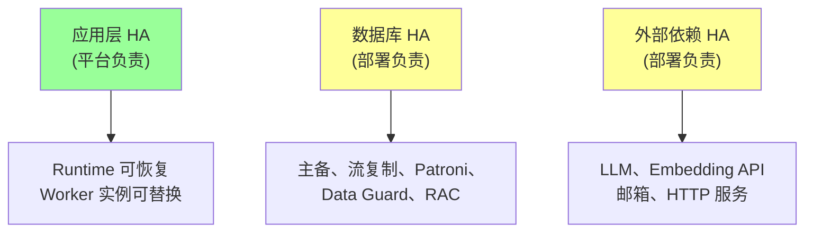
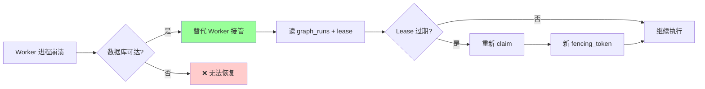
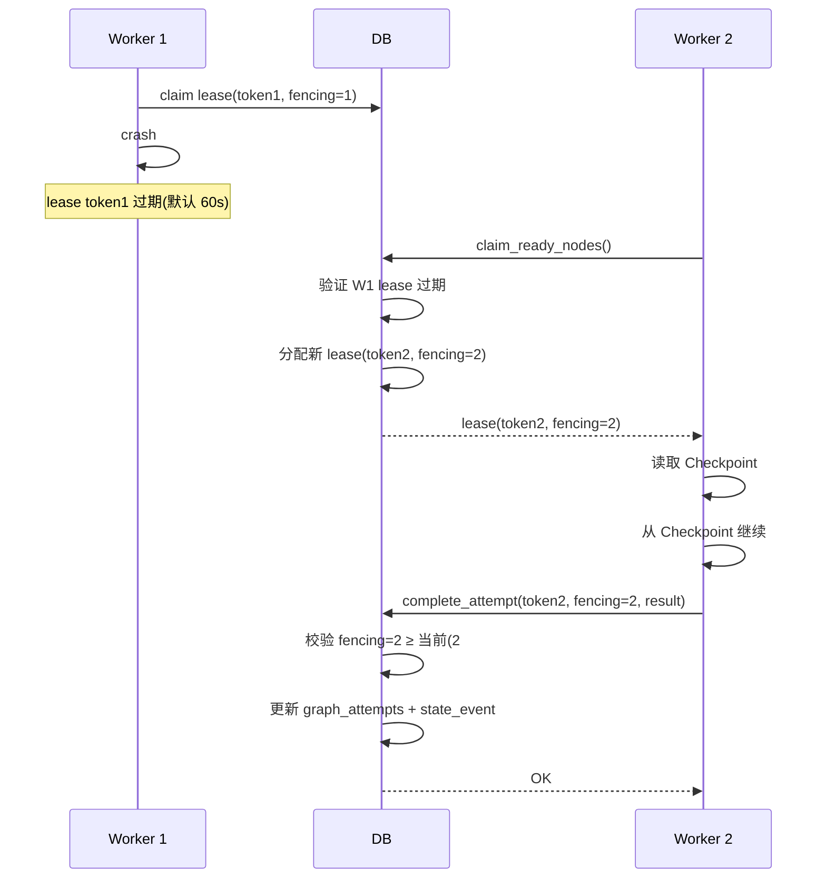
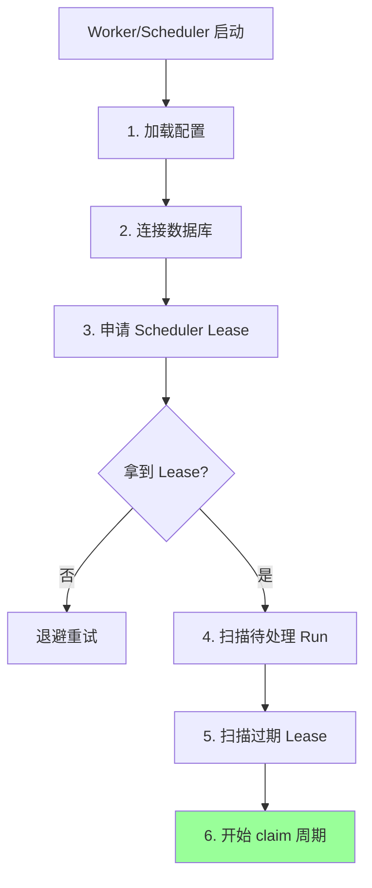
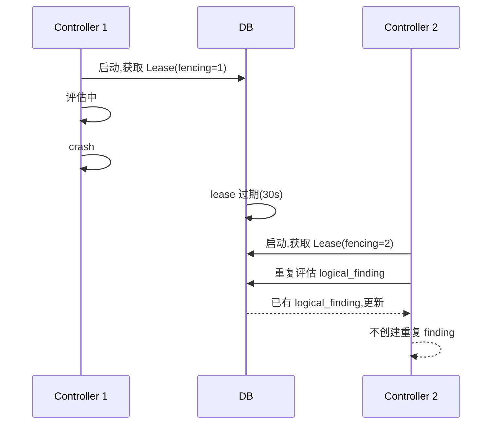
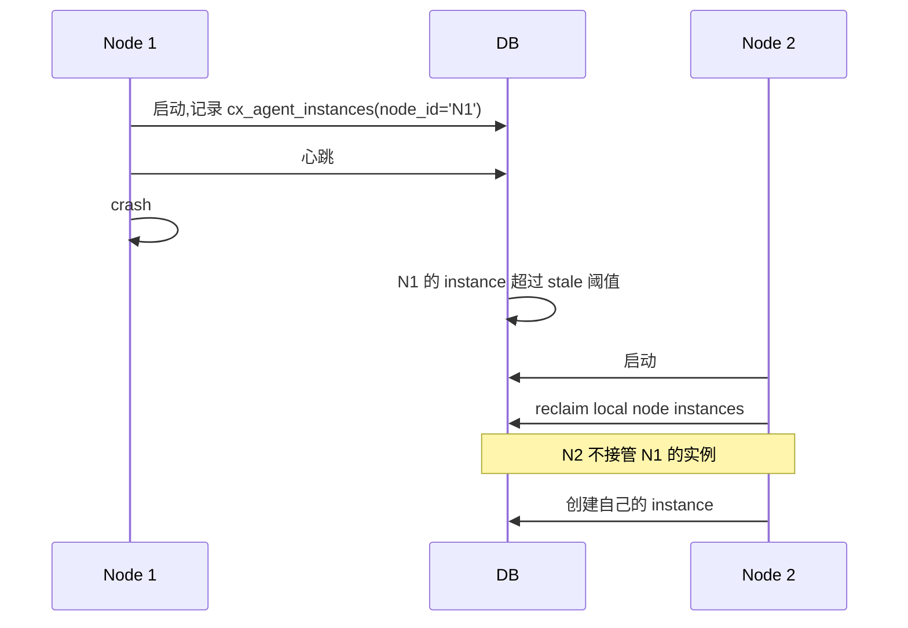
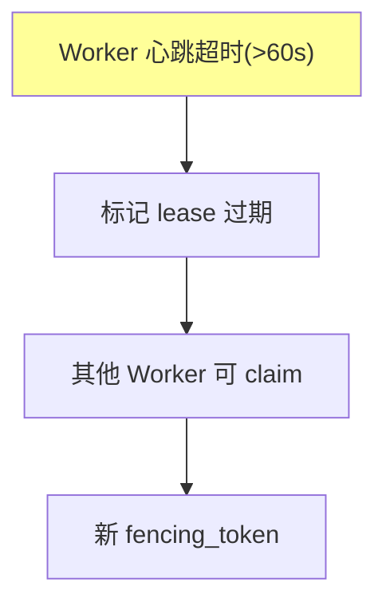
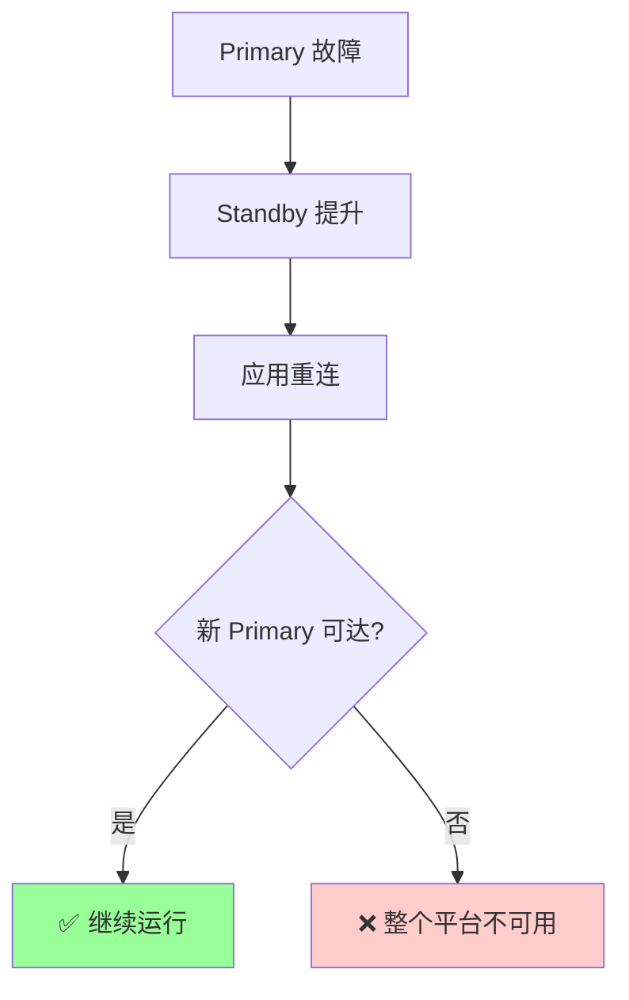
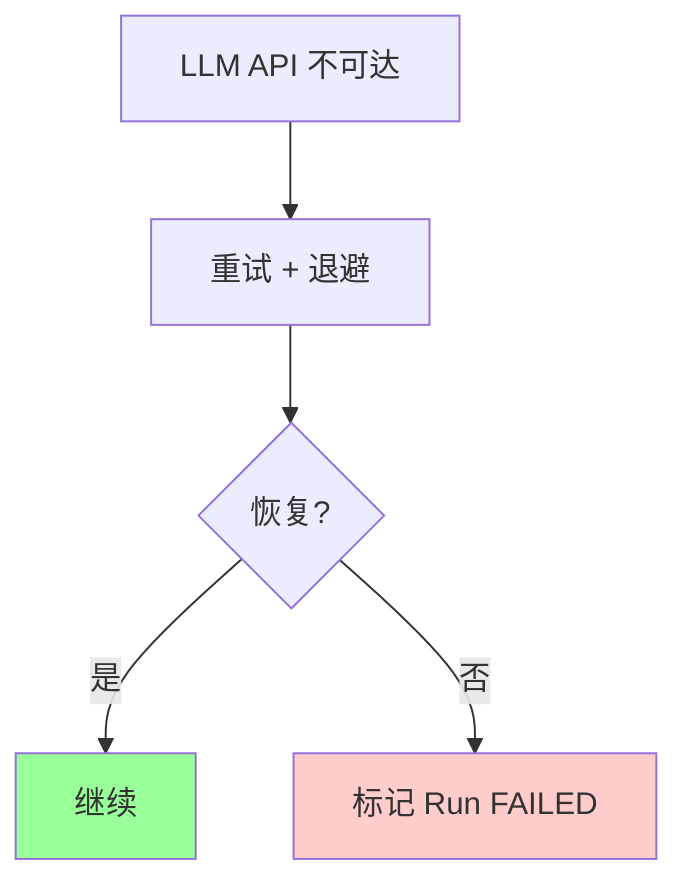

# §45 高可用与恢复

> 🏛️ 架构师 · 👤 用户 · 🧑‍💻 开发者
>
> **一句话定位**:v4.3.3 起,应用层 Runtime 可从数据库恢复(Lease + Fencing),**但**这**不**等于数据库 HA — 数据库 HA 是部署责任。

---

## 1. 边界声明(必读)

来源:[`SKILL.md:65-73`](../SKILL.md)、[`docs/recovery.md`](../recovery.md)、[`CHANGELOG.md:31-43`](../CHANGELOG.md)

> **本仓库 v4.3.5 不宣称**:
> - ❌ 数据库集群故障切换
> - ❌ 数据库 RPO / RTO
> - ❌ A2A 1.0.1 独立一致性
> - ❌ 真实 OTLP Collector 投递

> **本仓库 v4.3.5 确实提供**:
> - ✅ Worker 进程被替代实例恢复
> - ✅ 数据库是 Run/Checkpoint/Lease/Fencing 权威
> - ✅ 节点级 Agent 实例回收(本节点)
> - ✅ Compliance Controller 重新评估

---

## 2. 三层 HA 责任划分



| 层 | 平台负责 | 部署负责 |
|---|---|---|
| 应用进程 | ✅ Worker 替换、节点回收 | - |
| 数据库 | ✅ 表结构、PL/pgSQL | 主备、复制、备份 |
| 外部依赖 | - | LLM、Email、HTTP |

---

## 3. Runtime Recovery(v4.3.3)

来源:[`docs/recovery.md`](../recovery.md)

### 3.1 恢复边界



### 3.2 Worker 替换流程



### 3.3 Checkpoint 数据

```sql
-- graph_checkpoints 表
CREATE TABLE graph_checkpoints (
    checkpoint_id VARCHAR PRIMARY KEY,
    run_id VARCHAR,
    node_run_id VARCHAR,
    state JSONB,
    state_hash VARCHAR,
    created_at TIMESTAMP
);
```

---

## 4. Worker/Scheduler 重启流程

来源:[`docs/recovery.md:6-step`](../recovery.md)



### 4.1 Scheduler Lease

```sql
-- graph_scheduler_lease 表
CREATE TABLE graph_scheduler_lease (
    node_id VARCHAR PRIMARY KEY,
    acquired_at TIMESTAMP,
    expires_at TIMESTAMP,
    fencing_token BIGINT
);
```

> 🔐 只有**一个** Scheduler 能拿到 Lease;其他退避。

---

## 5. Compliance Controller Recovery

来源:[`docs/recovery.md`](../recovery.md)



> 🔐 Controller 用**logical_finding 唯一键**,不会因为重启创建重复记录。

---

## 6. Portal Agent 节点回收



> **本地节点实例回收**只针对**本节点**,不跨节点。详见 [`scripts/deploy/8_portal_node_ownership.sql`](../../scripts/deploy/8_portal_node_ownership.sql)。

---

## 7. 数据库 HA 责任

来源:[`docs/recovery.md`](../recovery.md)

> 数据库 HA **是部署责任**,**不是** v4.3.3 测试证据。

| 数据库 | 推荐 HA 方案 |
|---|---|
| Oracle | Data Guard / RAC |
| PostgreSQL | Streaming Replication / Patroni |
| YashanDB | Primary/Standby |

### 7.1 PostgreSQL HA 示例

```yaml
# docker-compose.yml (示例)
services:
  primary:
    image: postgres:18
    environment:
      POSTGRES_REPLICATION_MODE: master
      POSTGRES_REPLICATION_USER: replicator
      POSTGRES_REPLICATION_PASSWORD: ...

  replica:
    image: postgres:18
    environment:
      POSTGRES_REPLICATION_MODE: slave
      POSTGRES_REPLICATION_USER: replicator
      POSTGRES_REPLICATION_PASSWORD: ...
      POSTGRES_MASTER_SERVICE: primary
```

### 7.2 备份策略

```bash
# 每日全量
pg_dump chuanxu > /backup/chuanxu_$(date +%Y%m%d).sql

# 每周基础备份
pg_basebackup -D /backup/base_$(date +%Y%m%d) -Fp -Xs -P

# PITR
# 在 postgresql.conf 中开启
wal_level = replica
archive_mode = on
archive_command = 'cp %p /archive/%f'
```

---

## 8. 故障检测与恢复

### 8.1 应用层



### 8.2 数据库层



### 8.3 外部依赖



---

## 9. Recovery 测试

```bash
# 1. Worker 进程崩溃
kill -9 <worker_pid>
# 替代 Worker 自动接管

# 2. 节点重启
sudo reboot
# 应用启动后 reclaim 本节点 instance

# 3. 数据库连接断开
iptables -A OUTPUT -p tcp --dport 5432 -j DROP
# 应用重连 + 重试

# 4. Compliance Controller 重复评估
kill -9 <controller_pid>
# 重新启动后不会创建重复 finding
```

---

## 10. 监控 HA 状态

```sql
-- 活跃 Worker
SELECT * FROM graph_workers WHERE last_heartbeat_at > now() - interval '5 minutes';

-- 过期 Lease
SELECT * FROM graph_attempts WHERE lease_expires_at < now();

-- Standby 延迟(若用流复制)
SELECT now() - pg_last_xact_replay_timestamp() AS replication_lag;
```

---

## 11. 故障排查

| 问题 | 排查 |
|---|---|
| Worker 不接管 | 检查 lease 过期时间 + fencing |
| Scheduler 重复启动 | 检查 Scheduler Lease 是否被多节点获取 |
| Controller 创建重复 finding | 检查 logical_finding 唯一键 |
| 数据库连接断开 | 应用重连 + 验证 SSL 证书 |

---

## 12. 交叉引用

- 应急:[§44 应急控制与紧急停用](44-应急控制与紧急停用.md)
- Graph Runtime:[§14 Graph Runtime 架构](14-Graph-Runtime架构.md)
- 现有文档:[`docs/recovery.md`](../recovery.md)

> 📌 **下一章**:[§46 POC 验收与支持包](46-POC验收与支持包.md) — 四周 POC 工作流与证据组装。