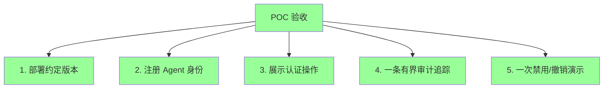

# §46 POC 验收与支持包

> 👤 用户/运维 · 🧑‍💻 开发者
>
> **一句话定位**:四周 POC 的"验收契约" + 证据组装 + 支持包生成 — 让客户在交付时有客观依据。

---

## 1. POC 验收契约

来源:[`docs/poc-readiness.md`](../poc-readiness.md)

### 1.1 必备验收项



| 项 | 验证 |
|---|---|
| 部署 | 应用 Community v4.3.5 到客户环境 |
| 注册 Agent | 通过 `agent_bootstrap.py` 注册至少一个 Business Agent |
| 认证操作 | Agent 调用受 Principal-aware 中间件保护的 API |
| 有界审计 | 一条完整的 access_log 链 |
| 禁用/撤销 | 演示 `disable` 或 `revoke` 的完整流程 |

### 1.2 排除项(不验证)

来源:[`docs/poc-readiness.md:exclusions`](../poc-readiness.md)

| 排除 | 原因 |
|---|---|
| 公开网络暴露 | 安全风险 |
| 多租户隔离 | 企业版特性 |
| 模型质量声明 | 不评估 |
| exactly-once 副作用 | 不可能保证 |
| 数据库 HA | 部署责任 |

---

## 2. poc_readiness.py

来源:[`scripts/poc_readiness.py`](../../scripts/poc_readiness.py)

### 2.1 用途

非破坏性的 POC 就绪检查,**不**写入任何数据。

```bash
"$PYTHON_BIN" scripts/poc_readiness.py
```

### 2.2 输出

```json
{
  "deployment": {
    "version": "4.3.5",
    "edition": "community",
    "database": "PostgreSQL 18.3",
    "ready": true
  },
  "agents": {
    "registered": 3,
    "active": 2,
    "ready": true
  },
  "capabilities": {
    "monitor": {"enabled": true, "mandatory": true},
    "agents": {"enabled": true, "mandatory": true},
    "memory": {"enabled": true, "mandatory": false},
    ...
  },
  "security": {
    "config_encrypted": true,
    "rls_enforced": true,
    "audit_logging": true
  },
  "drivers": {
    "psycopg2": "2.9.x",
    "cryptography": "49.0.0",
    "argon2-cffi": "25.1.0"
  },
  "exceptions": []
}
```

---

## 3. poc_evidence.py

来源:[`scripts/poc_evidence.py`](../../scripts/poc_evidence.py)

### 3.1 用途

组装四周 POC 验收证据。

```bash
"$PYTHON_BIN" scripts/poc_evidence.py --output ./evidence/
```

### 3.2 输出结构

```text
evidence/
├── manifest.json          # 元数据(SHA-256 哈希)
├── deployments/           # 部署报告
├── mode_matrix/           # capability 矩阵
├── governance_live/       # 治理证据
├── readiness/             # 就绪检查
├── skill.md               # Skill 信息
└── sha256sum.txt          # 完整性校验
```

### 3.3 证据原则

> "Do not infer customer success. Only record what exists."

工具**只**记录已存在的事实,**不**推断客户是否成功。

---

## 4. live_db_validator.py(再次强调)

来源:[`scripts/live_db_validator.py`](../../scripts/live_db_validator.py)

```bash
"$PYTHON_BIN" scripts/live_db_validator.py --version 4.3.5
```

验证目标数据库符合 v4.3.5 静态契约。**只读**,不改数据。

---

## 5. support_bundle.py

来源:[`scripts/support_bundle.py`](../../scripts/support_bundle.py)

### 5.1 用途

为支持工单生成**脱敏**支持包。

```bash
"$PYTHON_BIN" scripts/support_bundle.py --output ./support.zip
```

### 5.2 包含内容

| 内容 | 脱敏 |
|---|---|
| `config.json`(摘要) | 密码/API Key/Token 替换 |
| 最近日志(1 MiB 上限) | 敏感字段替换 |
| 版本信息 | 不变 |
| 健康检查输出 | 不变 |
| `verify_deps.py` 输出 | 不变 |

### 5.3 脱敏规则

```python
REDACT_PATTERNS = [
    r'password[\'"]?\s*[:=]\s*[\'"]\S+[\'"]',
    r'api_key[\'"]?\s*[:=]\s*[\'"]\S+[\'"]',
    r'token[\'"]?\s*[:=]\s*[\'"]\S+[\'"]',
    r'secret[\'"]?\s*[:=]\s*[\'"]\S+[\'"]',
]
```

### 5.4 不包含的内容

- ❌ 整个数据库 dump
- ❌ 原始日志
- ❌ 内存中的密钥
- ❌ 用户的具体业务数据

---

## 6. release_closure.py

来源:[`scripts/release_closure.py`](../../scripts/release_closure.py)

### 6.1 用途

集成 v4.3.0 发布门禁,验证所有依赖都已就绪。

```bash
"$PYTHON_BIN" scripts/release_closure.py
```

### 6.2 依赖顺序

```python
DEPENDENCY_ORDER = [
    "contracts",           # API 契约
    "dependencies",        # 依赖图
    "compiler",            # 编译器
    "executor",            # 执行器
    "runtime_state_events", # Runtime + State Events
    "compatibility",       # 兼容桥
    "governance_evidence", # 治理证据
    "database_migrations", # 数据库迁移
    "browser",             # Web UI
    "failure_recovery",    # 故障恢复
    "capacity",            # 容量测试
    "packages_docs"        # 包与文档
]
```

每个依赖都必须通过,才能整体发布。

---

## 7. POC 四周时间表

```mermaid
gantt
    title POC 四周时间表
    dateFormat  X
    axisFormat %s
    Week1 第1周:部署 + 就绪检查     :a1, 0, 7
    Week2 第2周:注册 Agent + 功能演示 :a2, 7, 14
    Week3 第3周:治理操作 + 审计演示   :a3, 14, 21
    Week4 第4周:验收 + 证据打包       :a4, 21, 28
```



---

## 8. POC 验收清单

```markdown
- [ ] 第 1 周
  - [ ] 数据库 v4.3.5 schema 已部署
  - [ ] `live_db_validator.py` 通过
  - [ ] `poc_readiness.py` 通过
  - [ ] `verify_deps.py` 通过
- [ ] 第 2 周
  - [ ] 至少 1 个 Business Agent 注册
  - [ ] 至少 1 个外部 Agent 注册
  - [ ] 演示 Memory CRUD + 5 信号搜索
  - [ ] 演示 Graph Runtime + Checkpoint
- [ ] 第 3 周
  - [ ] 演示 Principal-aware 路由
  - [ ] 演示禁用/重新启用 Agent
  - [ ] 演示 Capability 启用/禁用
  - [ ] 演示审计日志导出
- [ ] 第 4 周
  - [ ] 验收脚本运行成功
  - [ ] 证据包生成
  - [ ] 支持包生成
  - [ ] 客户签字
```

---

## 9. 故障排查

| 问题 | 排查 |
|---|---|
| readiness 报告错误 | 检查 Python 版本 + 依赖 |
| evidence 包过大 | 检查 evidence 来源 + 是否包含大文件 |
| 支持包泄漏敏感信息 | 检查 redact 规则 |
| live_db_validator 失败 | 漏应用某 SQL 迁移 |

---

## 10. 交叉引用

- 部署:[§30 首次部署与初始化](30-首次部署与初始化.md)
- 现有文档:[`docs/poc-readiness.md`](../poc-readiness.md)

> 📌 **下一章**:[§47 数据库迁移运维](47-数据库迁移运维.md) — migration_runner.py + 版本对齐 + 回滚。