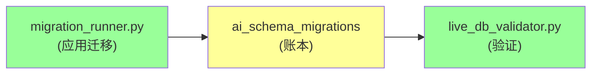
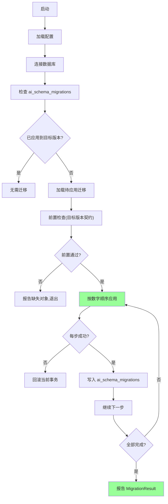
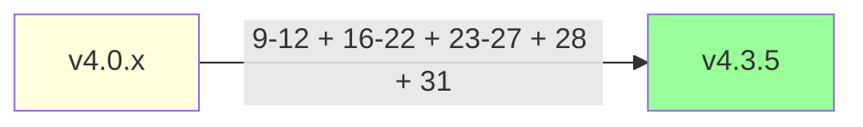
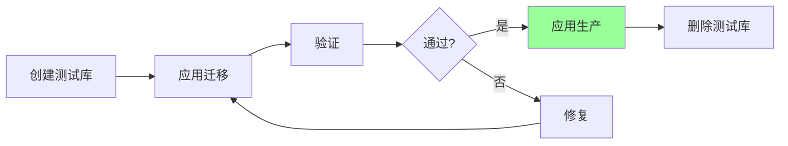

# §47 数据库迁移运维

> 🧑‍💻 开发者 · 👤 用户/运维
>
> **一句话定位**:`migration_runner.py` 是一键升级工具,`live_db_validator.py` 是目标验证工具;两者配合完成数据库迁移运维。

---

## 1. 迁移三件套



---

## 2. migration_runner.py

来源:[`scripts/migration_runner.py`](../../scripts/migration_runner.py)

### 2.1 启动

```bash
"$PYTHON_BIN" scripts/migration_runner.py --version 4.3.5
```

### 2.2 参数

| 参数 | 说明 |
|---|---|
| `--version` | 目标版本(如 `4.3.5`) |
| `--database-url` | 自定义 DB URL(可选) |
| `--dry-run` | 只检查,不应用 |
| `--force` | 跳过已应用检查(慎用) |
| `--rollback` | 回滚到指定版本(谨慎) |

### 2.3 流程



### 2.4 输出

```text
[v4.3.5] Migration Runner
  → Target version: 4.3.5
  → Detected current: 4.3.4
  → Migrations to apply: 1

[1/1] Applying 31_v4_3_5_platform_capabilities.sql...
      ✓ Tables created: cx_platform_capabilities, cx_platform_capability_dependencies, cx_platform_capability_history
      ✓ Seed data inserted
      ✓ Ledger updated

Migration completed successfully!
  → Time: 2.3s
  → Applied: 1
  → Skipped: 0
  → Failed: 0
```

---

## 3. ai_schema_migrations(账本)

来源:[`scripts/deploy/7_v4_0_1_migration.sql`](../../scripts/deploy/7_v4_0_1_migration.sql)

| 字段 | 含义 |
|---|---|
| `migration_id` | PK |
| `version` | 目标版本 |
| `migration_file` | 文件名 |
| `applied_at` | 时间 |
| `duration_ms` | 耗时 |
| `checksum` | 文件 SHA-256 |
| `success` | 成功标志 |

```sql
-- 查询已应用的迁移
SELECT * FROM ai_schema_migrations
ORDER BY applied_at DESC;
```

---

## 4. live_db_validator.py

来源:[`scripts/live_db_validator.py`](../../scripts/live_db_validator.py)

### 4.1 启动

```bash
"$PYTHON_BIN" scripts/live_db_validator.py --version 4.3.5
```

### 4.2 检查类别

```python
# live_db_validator.py: 简化
def validate_v435_static_contract(conn):
    checks = [
        # 基础对象
        has_table(conn, "cx_principals"),
        has_table(conn, "agent_registrations"),
        has_table(conn, "cx_platform_capabilities"),
        has_column(conn, "cx_platform_capabilities", "mandatory"),
        has_column(conn, "cx_platform_capabilities", "edition_available"),
        # v4.3.5 新增
        has_function(conn, "platform_capabilities.is_enabled"),
        # PL/pgSQL 函数
        has_function(conn, "memory_lifecycle.create_family"),
        has_function(conn, "memory_lifecycle.create_successor"),
    ]
    return all(checks), checks
```

### 4.3 输出

```text
[v4.3.5] Validating database contract...

Tables:
  ✓ cx_principals
  ✓ cx_platform_capabilities
  ✓ cx_platform_capability_history
  ✓ agent_registrations
  ...

Columns:
  ✓ cx_platform_capabilities.mandatory
  ✓ cx_platform_capabilities.edition_available
  ...

Functions:
  ✓ memory_lifecycle.create_family
  ✓ memory_lifecycle.create_successor
  ...

Result: PASSED (42/42 checks)
```

---

## 5. 升级路径

### 5.1 从 v4.0.x 到 v4.3.5

```bash
# 1. 备份
pg_dump chuanxu > backup_v4_0_$(date +%Y%m%d).sql

# 2. 拉取新代码
# (解压新版本覆盖,保留 config.json + vendor/)

# 3. 安装新依赖
./scripts/install_offline.sh

# 4. 应用迁移
"$PYTHON_BIN" scripts/migration_runner.py --version 4.3.5

# 5. 验证
"$PYTHON_BIN" scripts/live_db_validator.py --version 4.3.5

# 6. 重启
./start_web_server.sh restart
```

### 5.2 跨大版本升级



> 💡 **加性升级**:`migration_runner.py` 自动按数字顺序应用缺失的迁移。

---

## 6. 回滚策略

来源:[`docs/migration.md`](../migration.md)

### 6.1 平台**不推荐**自动回滚

> "平台不支持自动回滚;推荐应用下一版本修复"。

### 6.2 手动回滚(谨慎)

```sql
-- 回滚 v4.3.5(谨慎)
DROP TABLE IF EXISTS cx_platform_capability_history;
DROP TABLE IF EXISTS cx_platform_capability_dependencies;
DROP TABLE IF EXISTS cx_platform_capabilities;

-- 同时清理账本
DELETE FROM ai_schema_migrations
WHERE migration_file = '31_v4_3_5_platform_capabilities.sql';
```

> ⚠️ **回滚会丢失数据**(本次升级新增的 capability 配置)。

### 6.3 推荐方案:备份 → 升级 → 失败 → 从备份恢复

```bash
# 1. 升级前
pg_dump chuanxu > /backup/before_upgrade.sql

# 2. 升级
"$PYTHON_BIN" scripts/migration_runner.py --version 4.3.5

# 3. 验证失败?
"$PYTHON_BIN" scripts/live_db_validator.py --version 4.3.5
# exit 1?

# 4. 从备份恢复
psql -U postgres -d chuanxu < /backup/before_upgrade.sql

# 5. 重启
./start_web_server.sh restart
```

---

## 7. 测试库策略

来源:[`docs/migration.md:临时 Test Database Lifecycle`](../migration.md)



```bash
# 1. 创建测试库
createdb chuanxu_test_upgrade

# 2. 从生产备份恢复
pg_restore -d chuanxu_test_upgrade /backup/production.sql

# 3. 应用迁移
"$PYTHON_BIN" scripts/migration_runner.py --version 4.3.5 --database-url postgresql://localhost/chuanxu_test_upgrade

# 4. 验证
"$PYTHON_BIN" scripts/live_db_validator.py --version 4.3.5

# 5. 清理
dropdb chuanxu_test_upgrade
```

---

## 8. 跨数据库差异

| 数据库 | 迁移工具 | 特殊处理 |
|---|---|---|
| PostgreSQL | `psql -f` | 无 |
| Oracle | `sqlplus` / SQLcl | 注意 VARCHAR2/CLOB |
| YashanDB | 内置工具 | 类似 Oracle |

> 本仓库(Community Edition)只关注 PostgreSQL;Enterprise 包包含跨数据库迁移逻辑。

---

## 9. 常见迁移问题

| 问题 | 排查 |
|---|---|
| 迁移脚本失败 | 检查数据库权限(SCHEMA_OWNER) |
| 验证失败 | 漏应用某迁移 |
| 升级慢 | 检查索引 + 磁盘 |
| 回滚困难 | 从备份恢复 |
| 测试库连接失败 | 检查 PostgreSQL 端口 + 防火墙 |

---

## 10. 升级后清单

```markdown
- [ ] 迁移日志无错误
- [ ] live_db_validator 通过
- [ ] 服务正常启动
- [ ] `/api/health` 返回 200
- [ ] 业务 Agent 心跳正常
- [ ] 关键功能冒烟(Memory CRUD)
- [ ] 审计日志写入正常
- [ ] 备份已就绪
```

---

## 11. 交叉引用

- SQL 迁移清单:[§22 SQL 迁移脚本导览](22-SQL迁移脚本导览.md)
- 部署:[§30 首次部署与初始化](30-首次部署与初始化.md)
- 现有文档:[`docs/migration.md`](../migration.md)

> 📌 **下一章**:[§48 外部框架 Gateway 接入](48-外部框架Gateway接入.md) — OpenClaw / Hermes Agent 接入。