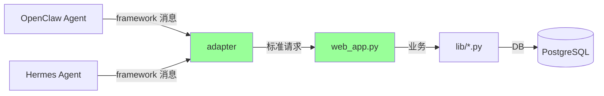
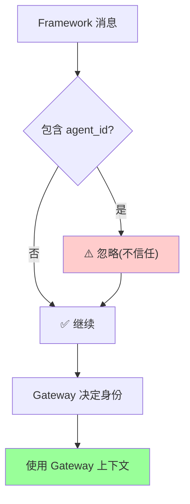
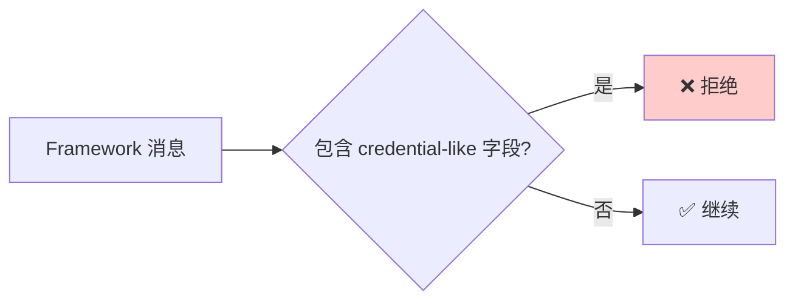
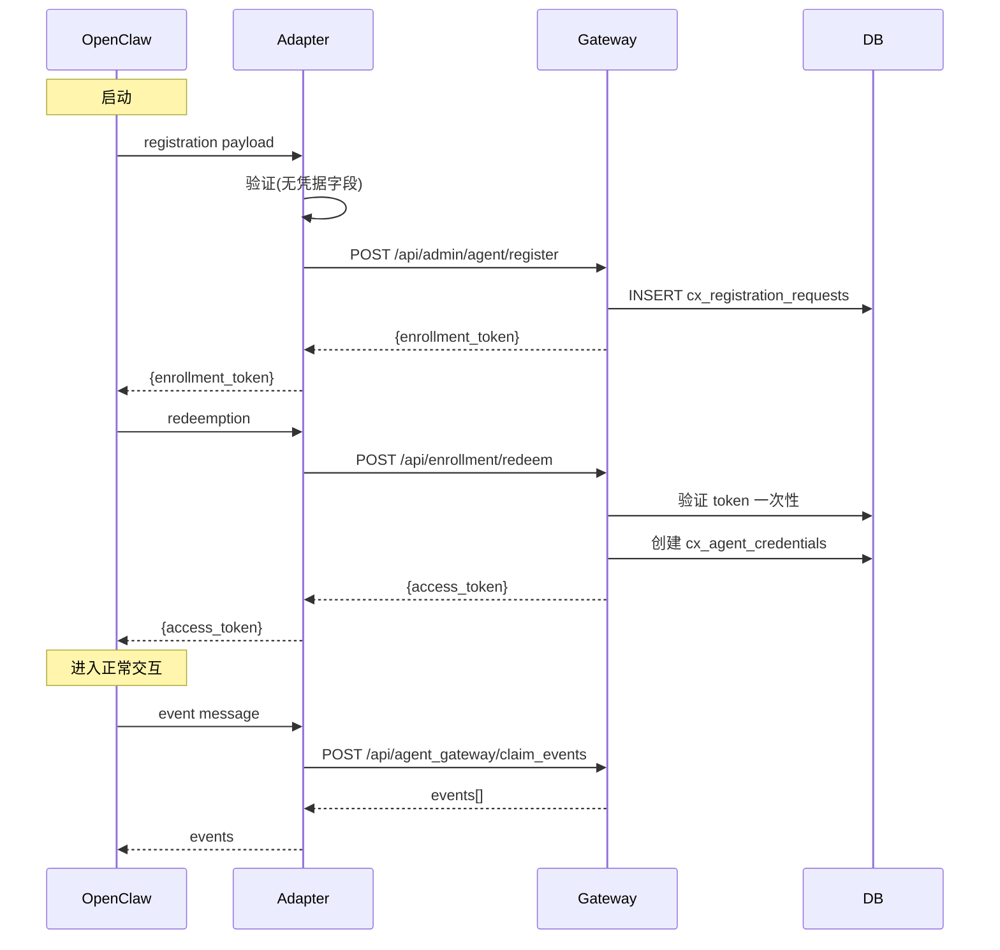

# §48 外部框架 Gateway 接入

> 🧑‍💻 开发者
>
> **一句话定位**:`agent_framework_adapters.py` 是框架中立的 Gateway 适配层,OpenClaw/Hermes Agent 通过它接入,平台**不**创建第二执行引擎。

---

## 1. 核心命题

来源:[`docs/framework-agent-gateway.md`](../framework-agent-gateway.md)、[`SKILL.md:18-22`](../SKILL.md)

> **Adapter 是无状态的格式转换层**,**不**是第二执行引擎。Gateway(平台)才是权威;request body 不携带 `agent_id`;身份字段即便存在也被丢弃。

---

## 2. 适配模型



> 🔐 **Adapter 不持久化任何数据**,只转换。

---

## 3. 信任边界



来源:[`docs/framework-agent-gateway.md`](../framework-agent-gateway.md)

---

## 4. 适配器操作

来源:[`lib/agent_framework_adapters.py`](../../scripts/lib/agent_framework_adapters.py)

### 4.1 6 个核心操作

| 操作 | 用途 | 对应平台 API |
|---|---|---|
| `build_registration_request` | 注册请求 | `POST /api/admin/agent/register` |
| `build_instance_request` | 实例请求 | `POST /api/agent_gateway/create_instance` |
| `build_pull_request` | 拉取事件 | `POST /api/agent_gateway/claim_events` |
| `build_ack_request` | 确认事件 | `POST /api/agent_gateway/acknowledge_event` |
| `build_arrival_request` | 报到(Bridge) | `POST /api/channels/arrival` |
| `build_action_request` | 动作(Approval) | `POST /api/channels/action` |

### 4.2 注册请求示例

```python
# adapter 转换 OpenClaw 注册消息
def build_registration_request(framework_payload: dict) -> dict:
    """OpenClaw 的 framework payload → 平台标准"""
    return {
        "agent_id": framework_payload["bot_id"],  # 适配字段名
        "display_name": framework_payload["name"],
        "runtime": "openclaw",
        "environment": framework_payload.get("env", "production"),
        "capabilities": framework_payload.get("capabilities", []),
        # ⚠️ 忽略 framework_payload 中的 "sponsor_id"(平台自己决定)
    }
```

---

## 5. 凭据处理

来源:[`docs/framework-agent-gateway.md`](../framework-agent-gateway.md)



### 5.1 拒绝的字段类型

| 字段 | 原因 |
|---|---|
| `api_key` | 不应来自 framework |
| `token` | 平台自己签发 |
| `password` | 平台自己生成 |
| `private_key` | 永远不应来自 framework |
| `client_secret` | 平台存储 |

### 5.2 异常类

```python
# agent_framework_adapters.py
class FrameworkAdapterError(Exception):
    """Adapter 拒绝的请求"""
    pass

# 抛错示例
if "api_key" in framework_payload:
    raise FrameworkAdapterError(
        "Credential-like fields not allowed in framework payload"
    )
```

---

## 6. 已确认的框架

来源:[`SKILL.md:18-22`](../SKILL.md)、[`docs/framework-agent-gateway.md`](../framework-agent-gateway.md)

| 框架 | 状态 | 说明 |
|---|---|---|
| **OpenClaw** | ✅ 已确认 | 通过 adapter 接入 |
| **Hermes Agent** | ✅ 已确认 | 通过 adapter 接入 |
| 自研框架 | ✅ 可适配 | 按标准实现 adapter |

---

## 7. 完整集成流程



---

## 8. Channel/Bridge 集成

```python
# adapter 转换 Channel 消息
def build_arrival_request(framework_message: dict) -> dict:
    """OpenClaw 的 channel 报到 → 平台 Bridge 报到"""
    return {
        "bridge_id": framework_message["bridge"],
        "payload": {
            "content": framework_message["text"],
            "metadata": framework_message.get("metadata", {})
            # ⚠️ 不包含 framework 自定义的 "sender_id"(用 Gateway 上下文)
        }
    }
```

---

## 9. 单元测试

来源:[`scripts/tests/test_agent_framework_adapters.py`](../../scripts/tests/test_agent_framework_adapters.py)

```python
def test_credential_field_rejection():
    payload = {
        "bot_id": "agent_x",
        "api_key": "leaked"  # ❌ 应被拒绝
    }
    with pytest.raises(FrameworkAdapterError):
        build_registration_request(payload)

def test_agent_id_not_trusted():
    payload = {
        "bot_id": "agent_x",
        "sponsor_id": "user_y"  # ❌ 应被忽略
    }
    result = build_registration_request(payload)
    assert "sponsor_id" not in result
    # sponsor 由 Gateway 自己决定
```

---

## 10. 框架开发者指南

### 10.1 实现 adapter

```python
# your_framework_adapter.py
from lib.agent_framework_adapters import (
    build_registration_request,
    build_instance_request,
    # ... 6 个核心函数
)

class YourFrameworkAdapter:
    def on_registration(self, framework_msg):
        return build_registration_request(framework_msg)

    def on_event(self, framework_msg):
        return build_pull_request(framework_msg)
```

### 10.2 部署 adapter

```bash
# 作为单独的服务部署
PYTHONPATH=scripts "$PYTHON_BIN" your_framework_adapter.py
```

### 10.3 注册到平台

```bash
# adapter 自己注册(通过 Admin Token)
"$PYTHON_BIN" scripts/agent_bootstrap.py register \
  --agent-id my_framework_adapter \
  --admin-token AT_xxxxx \
  --runtime custom \
  --display-name "My Framework Adapter"
```

---

## 11. 故障排查

| 问题 | 排查 |
|---|---|
| Adapter 拒绝请求 | 检查 framework payload 是否含 credential 字段 |
| Gateway 401 | 检查 framework 是否正确处理 access_token |
| 事件拉取失败 | 检查 Channel/Bridge 状态 |
| Adapter 重复事件 | 检查 idempotency_key 处理 |

---

## 12. 交叉引用

- 身份认证:[§12 身份与 Principal 控制面](12-身份与Principal控制面.md)
- MCP:[§25 MCP Server 与 SKILL 契约](25-MCP-Server与SKILL契约.md)
- 现有文档:[`docs/framework-agent-gateway.md`](../framework-agent-gateway.md)

> 📌 **下一章**:[§49 常见故障排查](49-常见故障排查.md) — 9 类症状与处理流程。