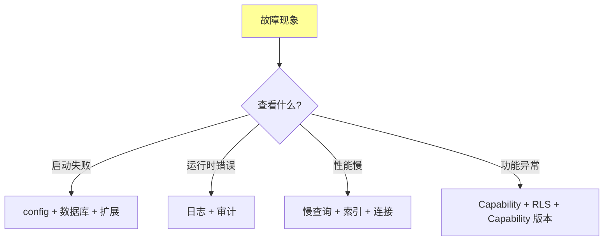
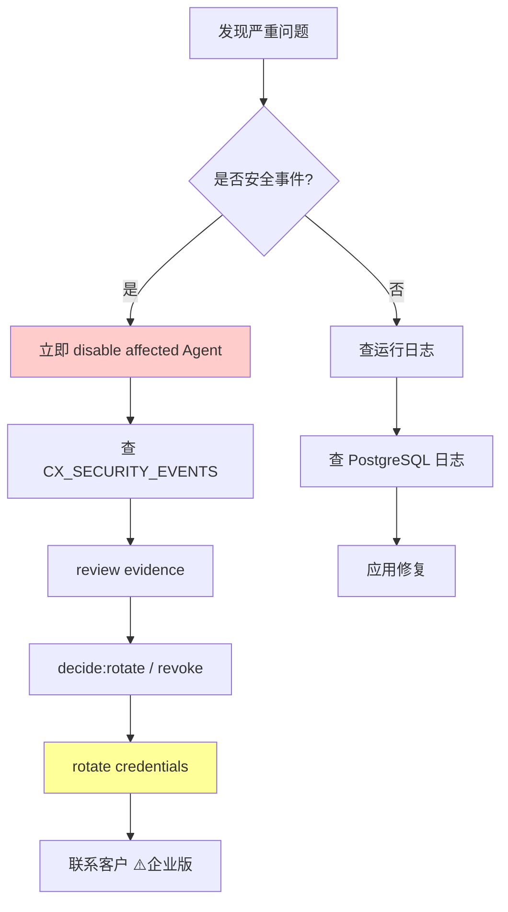

# §49 常见故障排查

> 👤 用户/运维 · 🧑‍💻 开发者
>
> **一句话定位**:把 SKILL.md §12 的 9 类症状 + 实际运维中常见的 20+ 故障,按"现象 → 原因 → 排查 → 修复"四列整理。

---

## 1. 排查工作流



---

## 2. 启动类

| 症状 | 原因 | 排查 | 修复 |
|---|---|---|---|
| 启动失败:连接数据库 | 配置错误 | 检查 `config.json:database` | 修正密码/host/port |
| 启动失败:扩展未找到 | 未 `CREATE EXTENSION` | `\dx` | 应用所有扩展 |
| 启动失败:Schema Owner 权限不足 | 角色缺权限 | `\du ai_agent_runtime` | 授予 `CREATEROLE` |
| 启动失败:端口占用 | 18080 被占 | `lsof -i :18080` | 改 `--port` |
| 启动失败:`cryptography` 错误 | glibc 不兼容 | `ldd --version` | 重建 manylinux wheel |
| 启动失败:Python 版本不对 | < 3.14 | `python --version` | 切换 Python |

---

## 3. 登录与认证类

| 症状 | 原因 | 排查 | 修复 |
|---|---|---|---|
| 登录失败:用户不存在 | 没创建 bootstrap | 看是否有 admin | 调用 `/api/auth/bootstrap` |
| 登录失败:密码错 | 哈希不匹配 | 检查 config 中 password_hash_algorithm | 重置密码 |
| 登录失败:CSRF 失败 | Cookie 未带 | 检查浏览器 | 用 HTTPS |
| 登录失败:Session 过期 | 默认 300s | 检查 `last_activity_at` | 调整 session_timeout |
| MFA 强制启用 | 平台策略 | 检查 Principal | 注册 MFA |

---

## 4. Agent 注册类

| 症状 | 原因 | 排查 | 修复 |
|---|---|---|---|
| 注册失败:agent_id 已存在 | 重复 | `agent_registrations` | 用 `update` 或换 ID |
| 注册失败:无权限 | Admin Token 错 | 检查 `X-Admin-Token` | 重新获取 |
| 凭据激活失败 | Ed25519 签名错 | 检查 public_key + signature | 重新签名 |
| 心跳 401 | Token 过期 | 检查 `cx_agent_access_tokens` | 重新兑换 |
| 心跳 200 但 status 不变 | last_seen_at 未更新 | 检查 `current_agent_id` GUC | 检查 RLS |

---

## 5. Capability 类

| 症状 | 原因 | 排查 | 修复 |
|---|---|---|---|
| API 返回 409 `CAPABILITY_DISABLED` | 数据库注册表未启用 | Admin → Platform 页 | 启用对应能力 |
| API 返回 403 `FORBIDDEN` | Principal 缺权限 | 检查 `cx_user_roles` | 分配权限 |
| 强制能力无法禁用 | mandatory=true | 检查 `cx_platform_capabilities.mandatory` | 这是设计 |
| Capability 变更失败:乐观锁 | expected_version 错 | 重新读取后重试 | 重新获取 version |
| 依赖能力无法启用 | 父能力未启用 | 检查依赖关系 | 先启用父能力 |

---

## 6. RLS 与数据隔离

| 症状 | 原因 | 排查 | 修复 |
|---|---|---|---|
| Agent 看不到自己创建的 Memory | 没设 `current_agent_id` | 检查 `lib/connection.py` | 调用 `set_agent_context()` |
| Agent 看到他人 Memory | RLS 未生效 | 检查 policy 创建 | `CREATE POLICY` + `ENABLE ROW LEVEL SECURITY` |
| 共享 Memory 看不到 | visibility 设置错 | 检查 entity 的 visibility | 改为 SHARED/PUBLIC |
| Workspace 隔离失败 | `workspace_id` 未设 | 检查 entity 列 | 创建时带 `workspace_id` |

---

## 7. Memory 与 Graph 类

| 症状 | 原因 | 排查 | 修复 |
|---|---|---|---|
| Memory 搜索无结果 | 嵌入维度不匹配 | 检查 `embedding.dimension` | 重新生成嵌入 |
| Memory 链断裂 | `parent_context_id` 错 | 检查 `cx_memory_versions` | 修复关系 |
| Memory 物理删除失败 | 需要 Compliance | 这是设计 | 走合规流程 |
| Graph Run 不开始 | Worker 未运行 | 检查 `graph_workers` | 启动 Worker |
| Graph Run 卡住 | Lease 过期但没重试 | 检查 `graph_attempts.lease_expires_at` | 等待替代 Worker 接管 |
| Graph Checkpoint 失败 | 数据库不可写 | 检查磁盘 + WAL | 修复存储 |

---

## 8. 性能类

| 症状 | 原因 | 排查 | 修复 |
|---|---|---|---|
| API 慢 | 慢查询 | `pg_stat_activity` | 加索引 |
| 搜索慢 | 嵌入生成慢 | 检查 LLM/Embedding API | 升级 API 配额 |
| Memory 列表慢 | 太多 row | 分页 + 索引 | `OFFSET/LIMIT` + `created_at` 索引 |
| 图遍历慢 | 跳数过多 | 限制 `max_hops` | 加过滤 |
| 并发连接耗尽 | `max_connections` 限制 | `pg_stat_activity` count | 调高或加连接池 |

---

## 9. 部署升级类

| 症状 | 原因 | 排查 | 修复 |
|---|---|---|---|
| 升级失败:迁移脚本错误 | 数据库状态不符 | `live_db_validator.py` | 修复后重试 |
| 升级失败:依赖缺失 | vendor/ 不完整 | `verify_deps.py` | 补充 vendor/ |
| 升级后启动失败 | 配置兼容 | 检查 config | 重新生成 |
| 回滚困难 | 缺备份 | 没有从备份恢复 | 备份优先 |
| 测试库连接失败 | 端口/防火墙 | `psql` 测试 | 修网络 |

---

## 10. MCP / 外部 Agent

| 症状 | 原因 | 排查 | 修复 |
|---|---|---|---|
| MCP 工具调用 401 | Token 过期 | 检查 `cx_agent_access_tokens` | 重新兑换 |
| MCP 调用 409 | Capability 禁用 | Admin 检查 | 启用 |
| MCP 调用超时 | 网络或服务端 | 增加 timeout | 网络优化 |
| MCP 工具未列出 | adapter 加载失败 | 检查 `_load_dynamic_tools()` | 重启服务 |
| Skill acquire 404 | 资源不存在 | 检查 `cx_skill_tokens` | 重新授权 |

---

## 11. 数据库连接

| 症状 | 原因 | 排查 | 修复 |
|---|---|---|---|
| 频繁断开 | 网络不稳定 | `ping` | 加重试 |
| SSL 失败 | 证书不匹配 | `openssl verify` | 修正证书 |
| 连接数耗尽 | max_connections | `pg_stat_activity` | 调高 |
| 连接慢 | DNS 反查 | 关闭 reverse DNS | 配置 `skip-name-resolve` |
| 锁等待 | 长事务 | `pg_locks` | 优化事务 |

---

## 12. 备份与恢复

| 症状 | 原因 | 排查 | 修复 |
|---|---|---|---|
| pg_dump 慢 | 数据库大 | 启用并行 `--jobs=4` | 分时段备份 |
| pg_dump 失败 | 锁竞争 | `--no-lock` 或用 snapshot | 离线快照 |
| 恢复后数据不一致 | 没停止写入 | restore 时禁用访问 | 维护窗口 |
| PITR 失败 | WAL 缺失 | 检查 `archive_command` | 修复归档 |
| backup 太旧 | 备份策略不足 | 检查 schedule | 提高频率 |

---

## 13. 审计与合规

| 症状 | 原因 | 排查 | 修复 |
|---|---|---|---|
| 审计查询慢 | 表过大 | 分区 + 索引 | `access_time` 索引 |
| Evidence Export 超时 | scope 太大 | 缩小范围 | 分批导出 |
| Legal Hold 误删 | 脚本错误 | 检查 retention 逻辑 | 修正脚本 |
| Capability 变更审计丢失 | 不同事务 | 检查 migration_runner | 应用修复 |

---

## 14. 紧急处置流程



---

## 15. 常用诊断命令

```bash
# 1. 服务状态
curl http://localhost:18080/api/health

# 2. 数据库连接
psql -U ai_agent_runtime -d chuanxu -c "SELECT 1"

# 3. 活跃会话
psql -U ai_agent_runtime -d chuanxu -c "SELECT * FROM cx_web_sessions WHERE expires_at > now()"

# 4. 最近错误
tail -100 /var/log/chuanxu/web_app.log

# 5. 慢查询
psql -U ai_agent_runtime -d chuanxu -c "SELECT * FROM pg_stat_activity WHERE state = 'active' ORDER BY query_start LIMIT 20"

# 6. 锁等待
psql -U ai_agent_runtime -d chuanxu -c "SELECT * FROM pg_locks WHERE NOT granted"

# 7. 关键表大小
psql -U ai_agent_runtime -d chuanxu -c "SELECT relname, pg_size_pretty(pg_total_relation_size(relid)) FROM pg_stat_user_tables ORDER BY pg_total_relation_size(relid) DESC LIMIT 10"

# 8. 检查能力配置
psql -U ai_agent_runtime -d chuanxu -c "SELECT capability_key, enabled, mandatory FROM cx_platform_capabilities ORDER BY capability_key"
```

---

## 16. 故障排查记录模板

```markdown
**时间**: 2026-08-05 13:45
**故障现象**: /api/memory 返回 500
**影响范围**: 所有 Memory 操作
**触发**: 用户点击 Memory 列表
**错误日志**:
```
[ERROR] 500 Internal Server Error
  File "lib/memory_lifecycle.py", line 235, in create_family
    cur.execute("INSERT INTO cx_memory_families ...")
psycopg2.errors.UndefinedColumn: column "principal_id" does not exist
```
**根因**: 漏应用 23_v4_3_2_memory_lifecycle.sql
**修复**: psql -f scripts/deploy/23_v4_3_2_memory_lifecycle.sql
**验证**: live_db_validator.py 通过,/api/memory 正常
**后续**: 加入升级检查清单
```

---

## 17. 交叉引用

- SKILL.md §12:9 类症状
- 应急:[§44 应急控制与紧急停用](44-应急控制与紧急停用.md)
- 审计:[§42 审计与证据导出](42-审计与证据导出.md)
- 监控:[§31 监控仪表板](31-监控仪表板Monitor.md)

> 📌 **Part V 完**。下一章开始 [Part VI 附录 §50 版本演进历史](50-版本演进历史.md)。