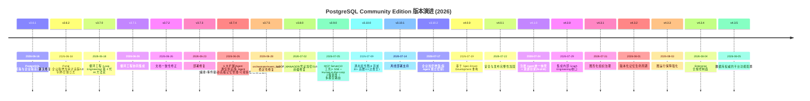
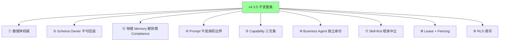

# §50 版本演进历史

> 🏛️ 架构师 · 👤 用户 · 🧑‍💻 开发者
>
> **一句话定位**:从 v3.6.1 首次独立发布到 v4.3.5 的全部版本里程碑,理解每个版本解决了什么、改变了什么。

---

## 1. PostgreSQL Edition 时间线

---

## 2. 重大版本里程碑

### 2.1 v3.6.1 (2026-06-16) — 首次独立发布

> **PostgreSQL 社区版与企业版首次独立发布**,与 Oracle 版本功能全面对齐。

**关键变化**:
- PostgreSQL 成为独立技术发行线
- Apache 2.0(Community)/ BSL 1.1(Enterprise)双许可
- 全功能首次在 PG 上可用

---

### 2.2 v3.7.0 (2026-06-18) — 循环工程(Loop Engineering)

> **第 4 代 AI 方法论**:Prompt → Context → Harness → Loop

**关键特性**:
- 4-5 张循环表
- `LOOP_MANAGER` 包
- `loop_loop_api.py`
- 4 种评估类型(后续扩到 6 种)
- 生命周期钩子
- 3 个调度作业

---

### 2.3 v3.7.4 (2026-06-26) — 6 大扩展

> 一次性引入 6 大能力,平台走向成熟

| 扩展 | 内容 |
|---|---|
| Agent 通信协议 | `COLLAB_MESSAGES` |
| 多 Agent 编排 | DAG 引擎 / fan-out / fan-in |
| 事件驱动 | publish/subscribe + `LOOP_HOOKS` |
| 高级记忆管理 | consolidation/merge/reindex |
| 可观察性 | `TRACE_ID` / health dashboard / drift detection |
| 工具生态 | OpenAPI 导入 / `TOOL_REGISTRY` |

---

### 2.4 v3.9.0 (2026-07-05) — MCP Server

> **MCP Server(10 工具/stdio+SSE)+ SSE 流式输出 + Human-in-the-Loop 三级审批**

| 新增 | 说明 |
|---|---|
| `mcp_server.py` | MCP 协议实现 |
| SSE streaming | Server-Sent Events |
| Human-in-the-Loop | 步骤/循环/工具三级审批 |
| Agent Protocol | 兼容 |
| 多模型路由 | 灵活 LLM 选择 |

---

### 2.5 v3.10.0 (2026-07-09) — 通用属性图

> **8 领域 30+ 函数 / 23 边类型**

| 领域 | 函数 |
|---|---|
| 知识因果 | find_causes |
| Agent 协作 | collab_graph |
| 任务编排 | task_dag |
| Skill 依赖 | skill_chain |
| 审批传播 | approval_flow |
| 数据流 | data_lineage |
| 记忆演化 | memory_evolution |
| Loop 迭代 | loop_iteration |

**企业版**特有:orchestrator 审批门控

---

### 2.6 v3.10.1 (2026-07-14) — 离线部署

> **离线部署支持** — 平台可在完全离线的环境运行

| 新增 | 说明 |
|---|---|
| `vendor/` | 内置所有依赖 wheel |
| `install_offline.sh` | 离线安装脚本 |
| `verify_deps.py` | 完整性验证 |
| 纯 Python `deploy_oracle.py` | 替代 SQLcl |

---

### 2.7 v4.0.0 (2026-07-19) — Spec-Driven 重构

> **基于 Spec-Driven Development 重构构建与规格守护流程**

| 新增 | 说明 |
|---|---|
| MCP 动态工具加载 | 运行时工具发现 |
| Spec 版本管理 | 多版本规范 |
| Harness 继承 | 模板可继承 |
| DAG 可视化 | 图运行时可视化 |
| 审批 SLA | 超时处理 |
| 事件死信队列 | DLQ |
| 搜索解释 | 结果可解释 |
| 图算法 | 内置算法库 |
| 批量嵌入 | 性能优化 |
| Agent 自动恢复 | 失败恢复 |

---

### 2.8 v4.0.1 (2026-07-22) — 安全加固

> **Business Agent 独立数据库身份 + Schema Owner 不可回退**

| 加固 | 说明 |
|---|---|
| Business Agent 独立身份 | 独立 LOGIN 角色 |
| 禁止 Schema Owner 回退 | 即使 AIADMIN 不可用 |
| config.json 四类敏感字段 AES-256-GCM | database |
| 持久执行控制面 |  |
| 无损 Skill 包 | 完整性校验 |
| 严格社区/企业边界 | 物理隔离 |
| Portal Agent 按节点回收 | 多节点 |

---

### 2.9 v4.1.0 (2026-07-24) — 注册 Agent 统一纳管

> **注册 Agent 统一纳管**,企业版增加资源目录/N-of-M 审批

| 变化 | |
|---|---|
| 资源目录 | DATABASE_DATA/API/SKILL/TOOL/KNOWLEDGE/WORKSPACE/DATA_EXTRACT |
| 资源策略 | ALLOW/DENY/APPROVAL_REQUIRED |
| 限时授权 | 带有效期的 grant |
| N-of-M 审批 | 多人决策 |
| 职责分离 | 角色分离规则 |
| 应急控制 | 多步可重试 |
| 风险型审计 | scope/retention |
| 证据导出 | hashed/redacted |
| 每 Agent 加密密钥 | ⚠️企业版 |
| LDAP | ⚠️企业版 |
| 合规日志 | ⚠️企业版 |
| Skill 令牌 | ⚠️企业版 |
| Orchestrator 审批 | ⚠️企业版 |

---

### 2.10 v4.3.0 (2026-07-29) — 集成收口

> **集成内部 Graph Engineering 收口**(v4.2.1 是内部 milestone)

| 集成 | |
|---|---|
| Human/Agent Principal | 统一数据库身份 |
| 用户注册审批 | 强制 |
| 一次性 Agent Enrollment | 用户赞助 |
| Security Domain | 强制安全域 |
| Channel | 协调面 |
| Barrier | 等待点 |
| Gateway | 实例围栏 |
| 数据库会话 | session 持久化 |
| 节点级回收 | 本节点实例 |
| 生产 profile 门禁 | v4.3.0 通过 |

> v4.2.1 是内部 closure,**不**单独发布,作为 v4.3.0 的内部组件。

---

### 2.11 v4.3.1 (2026-07-31) — 图形化组织治理

> **数据库权威的图形化组织治理**

| 特性 | |
|---|---|
| 规范成员关系 | primary/secondary organization |
| 汇报关系 | DIRECT/DOTTED/PROJECT |
| 组织版本与历史 | cx_organization_versions |
| 语义变更草稿 | cx_org_changesets |
| 目录同步 | CSV/JSON/LDAP |
| 闭包范围授权 | 闭包表 |
| Organization Dashboard | 可视化 |

---

### 2.12 v4.3.2 (2026-08-01) — 版本化记忆生命周期

> **版本化 Memory:Family + Version + Current Pointer**

| 特性 | |
|---|---|
| 稳定 Family | `cx_memory_families` |
| 不可变 Version | `cx_memory_versions` |
| 当前指针 | `cx_memory_current` |
| 表示与关系 | `cx_memory_representations` + `cx_memory_relations` |
| 快照 | `cx_memory_snapshots`(带 Subject Fencing) |
| 候选与复核 | `cx_memory_candidates` + `cx_memory_reviews` |
| 持久作业 | `cx_memory_jobs` + `cx_memory_job_items` |
| 使用事件 | `cx_memory_usage_events` |
| 投影 outbox | `cx_memory_projection_outbox` |
| **逻辑不可用替代物理删除** | 重要安全不变量 |

---

### 2.13 v4.3.3 (2026-08-03) — 图运行保障

> **强化数据库权威 Graph Runtime 的恢复与证据**

| 特性 | |
|---|---|
| 恢复证据 | `graph_assurance_evidence` |
| 测试用 failpoint | bounded |
| 不变量扫描 | 局部 |
| 定义供应链 | 签名/依赖锁 |
| 不可信 Draft 门 | UNTRUSTED_DRAFT |
| Dynamic Graph | 预览(默认关闭) |
| A2A 1.0.1 | 预览 |
| OpenTelemetry GenAI | 预览 |

> ⚠️ **本版本不宣称**:数据库 HA、RPO/RTO、A2A 一致性、OTLP Collector 投递。

---

### 2.14 v4.3.4 (2026-08-04) — Enterprise 合规控制面

> **Enterprise Agent Compliance Posture + 凭据激活 + Profile + Controller** ⚠️企业版

| 特性 | |
|---|---|
| Gateway 激活证明 | `POST /api/gateway/activate` |
| Governed Profile 模板 | 5 个内置 family |
| 不可变 Profile 版本 | published |
| Compliance Posture | 独立数据库事实 |
| 验证证据 | bounded |
| 确定性 Finding | 4 种高置信 |
| 整改 | remediatable |
| 限时例外 | exception + compensating_controls |
| Controller | 确定性,30s 周期 |

> "Prompt 文本不是授权边界"v4.3.4 显式化。

---

### 2.15 v4.3.5 (2026-08-05) — 平台功能配置 ⭐ 当前

> **数据库权威的平台功能配置**

| 特性 | |
|---|---|
| `cx_platform_capabilities` | 能力注册表 |
| `cx_platform_capability_dependencies` | 依赖图 |
| `cx_platform_capability_history` | 不可变历史 |
| 强制受保护 | mandatory=true 不能禁用 |
| 乐观锁 | expected_version |
| 原因必填 | reason |
| 同事务审计 | CX_SECURITY_EVENTS |
| 后端强制 | enforce_platform_capability |

---

## 3. 跨版本主题

### 3.1 主题:数据库权威(贯穿)

| 版本 | 数据库权威边界 |
|---|---|
| v3.6.1 | 单库内核概念成立 |
| v3.10.0 | 属性图作为投影 |
| v4.0.1 | Schema Owner 不可回退 |
| v4.3.0 | Principal 全部数据库事实 |
| v4.3.3 | Graph Runtime 数据库权威 |
| v4.3.5 | Capability 数据库权威 |

### 3.2 主题:Skill-first / 框架中立

| 版本 | 进展 |
|---|---|
| v3.6.x | 框架内耦合 |
| v3.9.0 | MCP 标准化 |
| v4.0.0 | Spec-Driven 重构 |
| v4.1.0 | 注册 Agent 标准化 |
| v4.3.5 | 平台能力配置标准化 |

### 3.3 主题:Enterprise 边界

| 版本 | Enterprise 增强 |
|---|---|
| v3.6.2 | 审计/LDAP |
| v3.7.0 | LOOP_AUDIT |
| v3.10.2 | 每 Agent 加密密钥 |
| v4.1.0 | Resource Catalog + N-of-M |
| v4.3.4 | Compliance Controller |

---

## 4. 重要"内部"里程碑

| 版本 | 性质 |
|---|---|
| v4.2.1 | 内部 Graph Engineering closure,集成到 v4.3.0 |
| v4.2.0 | Graph Engineering 集成 |
| v4.0.0 | Spec-Driven 重构 |

---

## 5. 关键不变量回顾

---

## 6. 交叉引用

- 详细变更:[`CHANGELOG.md`](../CHANGELOG.md)
- 发布说明:[`RELEASE_NOTES_v4.3.5.md`](../RELEASE_NOTES_v4.3.5.md)
- v4.3.x 边界:[§03 v4.3.5 新特性矩阵](03-v4.3.5新特性矩阵.md)

> 📌 **下一章**:[§51 SQL 迁移索引](51-SQL迁移索引.md) — 31 个 SQL 文件的索引与适用版本。