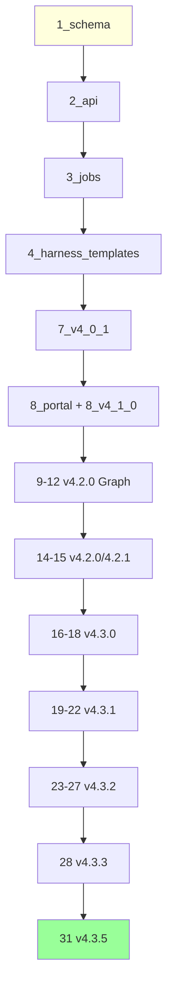

# §51 SQL 迁移索引

> 🧑‍💻 开发者 · 🏛️ 架构师
>
> **一句话定位**:31 个 SQL 文件的完整索引,标注每个文件的版本号、表数、关键对象、依赖关系。

---

## 1. 索引总表

| # | 文件 | 大小 | 表数 | 版本 | 主题 |
|---|---|---|---|---|---|
| 1 | `1_schema.sql` | ~400 KB | 71 | v1.0.0+ | 核心 schema |
| 2 | `2_api.sql` | ~88 KB | 0 | v1.0.0+ | PL/pgSQL API |
| 3 | `3_jobs.sql` | - | 0 | v1.0.0+ | pg_cron 任务 |
| 4 | `4_harness_templates.sql` | - | 0 | v1.0.0+ | Harness 模板 |
| 5 | (跳过) | - | - | - | - |
| 6 | (跳过) | - | - | - | - |
| 7 | `7_v4_0_1_migration.sql` | - | 11 | v4.0.1 | baseline + Schema Owner |
| 8a | `8_portal_node_ownership.sql` | - | 0 | v4.0.1+ | Portal 实例所有权 |
| 8b | `8_v4_1_0_registration.sql` | - | 1 | v4.1.0 | 注册边界 |
| 9 | `9_v4_2_0_graph_engineering.sql` | - | 7 | v4.2.0 | Graph Definition |
| 10 | `10_v4_2_0_graph_runtime.sql` | - | 14 | v4.2.0 | Graph Runtime |
| 11 | `11_v4_2_0_graph_control.sql` | - | 6 | v4.2.0 | Graph Control |
| 12 | `12_v4_2_0_graph_edge_scope.sql` | - | 0 (ALTER) | v4.2.0 | 边作用域 |
| 13 | `13_v4_2_0_scheduler_ha.sql` | - | - | v4.2.0 | ⚠️ Enterprise only |
| 14 | `14_v4_2_0_graph_triggers.sql` | - | 1 | v4.2.0 | Graph 触发器 |
| 15 | `15_v4_2_1_executor_registry.sql` | - | 2 | v4.2.1 | Executor 注册 |
| 16 | `16_v4_3_0_identity_channels.sql` | - | 31 | v4.3.0 | Identity + Channel + Barrier |
| 17 | `17_v4_3_0_governance_lifecycle.sql` | - | 3 | v4.3.0 | 治理生命周期 |
| 18 | `18_v4_3_0_security_lifecycle.sql` | - | 12 | v4.3.0 | 安全生命周期 |
| 19 | `19_v4_3_1_organization_governance.sql` | - | 13 | v4.3.1 | 组织治理 |
| 20 | `20_v4_3_1_human_display_name.sql` | - | 0 | v4.3.1 | 显示名 |
| 21 | `21_v4_3_1_entry_access.sql` | - | 0 | v4.3.1 | 入口访问 |
| 22 | `22_v4_3_1_identity_organization_alignment.sql` | - | 0 | v4.3.1 | 对齐约束 |
| 23 | `23_v4_3_2_memory_lifecycle.sql` | - | 13 | v4.3.2 | Memory 生命周期 |
| 24 | `24_v4_3_2_memory_digest_alignment.sql` | - | 0 | v4.3.2 | 摘要对齐 |
| 25 | `25_v4_3_2_disable_legacy_memory_fusion.sql` | - | 0 | v4.3.2 | 关闭旧融合 |
| 26 | `26_v4_3_2_snapshot_subject_fencing.sql` | - | 0 (ALTER) | v4.3.2 | 快照围栏 |
| 27 | `27_v4_3_2_memory_governance_completion.sql` | - | 3 | v4.3.2 | 治理补全 |
| 28 | `28_v4_3_3_graph_assurance.sql` | - | 8 | v4.3.3 | Graph Assurance |
| 29 | `29_v4_3_4_compliance.sql` | - | - | v4.3.4 | ⚠️ Enterprise only |
| 30 | `30_v4_3_4_compliance_hardening.sql` | - | - | v4.3.4 | ⚠️ Enterprise only |
| 31 | `31_v4_3_5_platform_capabilities.sql` | - | 3 | v4.3.5 | Platform Capabilities |
| - | `seed_data.sql` | ~93 KB | 0 | - | 演示数据 |

**总表数(Community):199**

---

## 2. 关键表速查

### 2.1 身份与认证

| 表 | 来源文件 | 用途 |
|---|---|---|
| `cx_principals` | 16 | Principal 根表 |
| `cx_human_identities` | 16 | Human 身份 |
| `agent_registrations` | 8 | Agent 注册 |
| `cx_agent_credentials` | 16 | 凭据 |
| `cx_agent_access_tokens` | 16 | Access Token |
| `cx_enrollment_grants` | 16 | 一次性 Enrollment |
| `cx_web_sessions` | 16 | Web Session |
| `cx_user_roles` | 16 | 用户角色 |
| `cx_security_events` | 16 | 安全审计 |
| `cx_mfa_factors` | 18 | MFA 因子 |
| `cx_security_domains` | 16 | 安全域 |

### 2.2 Agent 生命周期

| 表 | 来源文件 | 用途 |
|---|---|---|
| `agent_registry` | 1 | Agent 主表 |
| `agent_session` | 1 | 会话 |
| `agent_session_active/_inactive` | 1 | 分区 |
| `agent_collaboration` | 1 | 协作 |
| `agent_credentials` | 1 | 旧凭据 |
| `agent_permission_log` | 1 | 权限日志 |
| `cx_agent_instances` | 16 | 实例 |
| `cx_agent_ownership_reviews` | 18 | 所有权审查 |

### 2.3 Memory 域

| 表 | 来源文件 | 用途 |
|---|---|---|
| `entities` | 1 | 多态实体 |
| `entities_default/_memory/_knowledge/_skill/_spec/_experience/_harness_template/_task_output/_other` | 1 | 分区 |
| `entity_edges` | 1 | 关系 |
| `entity_embeddings` | 1 | 向量 |
| `entity_tags` | 1 | 标签 |
| `entity_access_log` | 1 | 访问日志(分区) |
| `entity_access_audit` | 1 | 访问审计 |
| `cx_memory_families` | 23 | Memory Family |
| `cx_memory_versions` | 23 | Memory Version(10 状态) |
| `cx_memory_current` | 23 | 当前指针 |
| `cx_memory_representations` | 23 | 表示 |
| `cx_memory_relations` | 23 | 关系链 |
| `cx_memory_snapshots` | 23 | 快照(Subject Fencing) |
| `cx_memory_snapshot_members` | 23 | 快照成员 |
| `cx_memory_policies` | 23 | 策略 |
| `cx_memory_jobs` | 23 | 长期任务 |
| `cx_memory_job_items` | 23 | 任务项 |
| `cx_memory_usage_events` | 23 | 使用事件 |
| `cx_memory_candidates` | 23 | 候选 |
| `cx_memory_reviews` | 23 | 复核 |
| `cx_memory_projection_outbox` | 23 | 投影 outbox |
| `cx_memory_version_artifacts` | 27 | 版本 artifact |
| `cx_memory_ingestion_findings` | 27 | 摄取 Finding |
| `cx_memory_worker_results` | 27 | Worker 结果 |

### 2.4 Knowledge & Search

| 表 | 来源文件 | 用途 |
|---|---|---|
| `knowledge_meta` | 1 | Knowledge 元数据 |
| `tags` | 1 | 标签字典 |
| `entity_access_log` | 1 | 含全文检索向量 |

### 2.5 Graph Runtime

| 表 | 来源文件 | 用途 |
|---|---|---|
| `graph_definitions` | 9 | Graph 定义 |
| `graph_versions` | 9 | Graph 版本 |
| `graph_nodes` | 9 | 节点 |
| `graph_edges` | 9/12 | 边(版本化 PK) |
| `graph_artifacts` | 9 | 产物 |
| `graph_evaluators` | 9 | 评估器 |
| `graph_evaluator_results` | 9 | 评估结果 |
| `graph_budgets` | 9 | 预算 |
| `graph_run_steps` | 9 | 步骤 |
| `graph_aliases` | 9 | 别名 |
| `graph_type_registry` | 9 | 类型注册 |
| `graph_compile_plans` | 9 | 编译计划 |
| `graph_runs` | 10 | Run |
| `graph_node_runs` | 10 | Node Run |
| `graph_ready_nodes` | 10 | 就绪节点 |
| `graph_attempts` | 10 | Attempt(Lease + Fencing) |
| `graph_state_events` | 10 | State Event |
| `graph_checkpoints` | 10 | Checkpoint |
| `graph_transitions` | 10 | Transition |
| `graph_workers` | 10 | Worker |
| `graph_lease_tokens` | 10 | Lease Token |
| `graph_inbox` | 10 | Inbox |
| `graph_outbox` | 10 | Outbox |
| `graph_evaluations` | 10 | 评估 |
| `graph_interventions` | 10 | 干预 |
| `graph_join_states` | 11 | Join 状态 |
| `graph_run_branches` | 11 | Run 分支 |
| `graph_wait_subscriptions` | 11 | 等待订阅 |
| `graph_traces` | 11 | Trace |
| `graph_run_migrations` | 11 | Run 迁移 |
| `graph_compat_bindings` | 11 | 兼容绑定 |
| `graph_triggers` | 14 | 触发器 |
| `graph_executor_registry` | 15 | Executor 注册 |
| `graph_governance_events` | 15 | 治理事件 |
| `graph_assurance_evidence` | 28 | 保障证据 |
| `graph_definition_provenance` | 28 | 定义 provenance |
| `graph_definition_dependencies` | 28 | 定义依赖 |
| `graph_definition_signatures` | 28 | 定义签名 |
| `graph_definition_scans` | 28 | 定义扫描 |
| `graph_dynamic_proposals` | 28 | Dynamic Graph 提案 |
| `graph_protocol_tasks` | 28 | 协议任务(A2A) |
| `graph_telemetry_deliveries` | 28 | 遥测投递 |

### 2.6 Workspace & Task

| 表 | 来源文件 | 用途 |
|---|---|---|
| `workspaces` | 1 | Workspace 主表 |
| `workspace_context` | 1 | Context |
| `workspace_context_audit` | 1 | Context 审计 |
| `workspace_tasks` | 1 | Workspace 任务 |
| `task_plans` | 1 | Plan |
| `task_plans_*` (分区) | 1 | 状态分区 |
| `task_steps` | 1 | Step |
| `task_tool_calls` | 1 | 工具调用 |
| `task_dependencies` | 1 | 依赖 |
| `task_context_snapshots` | 1 | 快照 |
| `context_branches` | 1 | 分支 |
| `branch_merge_log` | 1 | 合并日志 |

### 2.7 Skill & Spec & Harness

| 表 | 来源文件 | 用途 |
|---|---|---|
| `skill_meta` | 1 | Skill 元数据 |
| `skill_access_token` | 1 | Skill Token |
| `spec_meta` | 1 | Spec 元数据 |
| `spec_plan_links` | 1 | Spec-Plan 链接 |
| `harness_meta` | 1 | Harness 元数据 |

### 2.8 Collaboration & Message

| 表 | 来源文件 | 用途 |
|---|---|---|
| `collab_groups` | 1 | 协作组 |
| `collab_group_members` | 1 | 成员 |
| `compliance_log` | 1 | 合规日志 |

### 2.9 Channel & Barrier

| 表 | 来源文件 | 用途 |
|---|---|---|
| `cx_channels` | 16 | Channel |
| `cx_channel_members` | 16 | 成员 |
| `cx_channel_messages` | 16 | 消息 |
| `cx_channel_threads` | 17 | 主题 |
| `cx_channel_thread_members` | 17 | 主题成员 |
| `cx_barriers` | 16 | Barrier |
| `cx_barrier_reports` | 16 | Barrier 报到 |
| `cx_action_cards` | 16 | 动作卡片 |
| `cx_bridges` | 16 | Bridge |
| `cx_bridge_transfers` | 16 | Bridge 转移 |
| `cx_notifications` | 16 | 通知 |

### 2.10 Organization

| 表 | 来源文件 | 用途 |
|---|---|---|
| `cx_organizations` | 16/19 | 组织 |
| `cx_organization_members` | 16/19 | 成员 |
| `cx_reporting_relationships` | 19 | 汇报关系 |
| `cx_organization_closure` | 19 | 闭包 |
| `cx_organization_versions` | 19 | 组织版本 |
| `cx_org_changesets` | 19 | 变更草稿 |
| `cx_org_changeset_ops` | 19 | 变更操作 |
| `cx_org_directory_batches` | 19 | 目录批次 |
| `cx_org_directory_records` | 19 | 目录记录 |
| `cx_org_directory_conflicts` | 19 | 目录冲突 |
| `cx_org_lifecycle_cases` | 19 | 生命周期 case |
| `cx_org_lifecycle_dispositions` | 19 | 处置 |
| `cx_responsible_groups` | 16 | 责任组 |
| `cx_agent_relationships` | 16 | Agent 关系 |

### 2.11 Platform Capability

| 表 | 来源文件 | 用途 |
|---|---|---|
| `cx_platform_capabilities` | 31 | 能力 |
| `cx_platform_capability_dependencies` | 31 | 依赖 |
| `cx_platform_capability_history` | 31 | 历史 |

### 2.12 审计与日志

| 表 | 来源文件 | 用途 |
|---|---|---|
| `entity_access_log` | 1 | Entity 访问(分区) |
| `entity_access_audit` | 1 | Entity 审计 |
| `agent_permission_log` | 1 | Agent 权限日志 |
| `CX_SECURITY_EVENTS` | 16 | 安全事件 |
| `cx_audit_*` | 18 | 各类审计 |
| `ai_schema_migrations` | 7 | 迁移账本 |

### 2.13 System Config

| 表 | 来源文件 | 用途 |
|---|---|---|
| `system_users` | 1 | 系统用户 |
| `system_config` | 1 | 系统配置 |
| `ldap_config` | 1 | LDAP 配置 |

---

## 3. 加性迁移顺序



---

## 4. Enterprise 专属迁移

| # | 文件 | 内容 |
|---|---|---|
| 13 | `13_v4_2_0_scheduler_ha.sql` | Scheduler HA |
| 29 | `29_v4_3_4_compliance.sql` | Compliance 基础 |
| 30 | `30_v4_3_4_compliance_hardening.sql` | Compliance 加固 |

> ⚠️ Community 包**不**包含这些文件;Enterprise 包才有。

---

## 5. ALTER 列表

仅有两处 ALTER(其余都是 CREATE):

| # | 文件 | 操作 |
|---|---|---|
| 12 | `12_v4_2_0_graph_edge_scope.sql` | PK 改为 `(graph_version_id, edge_id)` |
| 26 | `26_v4_3_2_snapshot_subject_fencing.sql` | 加 `principal_id/permission_version/agent_instance_id/fencing_token` |

> 💡 **这是"加性"原则的体现** — 不修改已有表结构。

---

## 6. PL/pgSQL 函数索引

来源:[`scripts/deploy/2_api.sql`](../../scripts/deploy/2_api.sql)

| Schema | 函数示例 | 用途 |
|---|---|---|
| `memory_fusion` | `fuse_similar` | 旧 Memory 融合 |
| `knowledge_api` | `schedule_review` | 复习调度 |
| `agent_perm` | `check_entity_access` | 权限检查 |
| `session_cleanup` | `purge_access_logs` | 清理 |
| `workspace_manager` | `create` / `save_context` | Workspace |
| `spec_manager` | `create` / `validate` | Spec |
| `collab_group_manager` | `create` / `add_member` | 协作组 |
| `embedding_manager` | `generate_embedding` | 嵌入生成 |
| `db_crypto` | `encrypt` / `decrypt` | 数据库加密 |
| `branch_manager` | `fork` / `merge` | Branch |
| `skill_manager` | `register` | Skill |
| `user_manager` | `authenticate` | 用户 |
| `deploy_api` | `check_deployment` | 部署检查 |
| `audit_api` | `log_access_event` | 审计 |
| `skill_token_api` | `verify_token` | Skill Token |
| `ldap_auth` | `configure` | LDAP ⚠️企业版 |
| `loop_manager` | `check_stop_conditions` | Loop |
| `task_plan_manager` | `create` | Task Plan |
| `harness_manager` | `create` | Harness |

> 💡 **设计原则**:业务逻辑优先放在 Python;只在需要"近数据"计算时用 PL/pgSQL。

---

## 7. 跨数据库差异

| 特性 | Oracle 26ai | PostgreSQL 18 | YashanDB 23.5.4 |
|---|---|---|---|
| VARCHAR2/VARCHAR/NUMBER | ✓/✗/✓ | ✗/✓/✗ | ✓/✗/✓ |
| CLOB/TEXT | ✓/✗ | ✗/✓ | ✓/✗ |
| SEQUENCE | ✓ | ✓ | ✓ |
| 分区 LIST+RANGE | ✓ | ✓ | ✓ |
| pgvector / Native VECTOR | Native | pgvector | Native |
| Apache AGE | ✗ | ✓ | ✗ |
| pg_cron | ✗ | ✓ | ✗ |

> 本仓库(Community)只关注 PostgreSQL。

---

## 8. 完整文件路径

所有 SQL 迁移位于:[`scripts/deploy/`](../../scripts/deploy/)

```bash
ls scripts/deploy/*.sql | wc -l
# 30+ 个
```

---

## 9. 交叉引用

- 迁移运维:[§47 数据库迁移运维](47-数据库迁移运维.md)
- SQL 导览:[§22 SQL 迁移脚本导览](22-SQL迁移脚本导览.md)
- 现有文档:[`docs/migration.md`](../migration.md)

> 📌 **下一章**:[§52 Python 模块索引](52-Python模块索引.md) — `scripts/lib/` 60+ 模块速查。