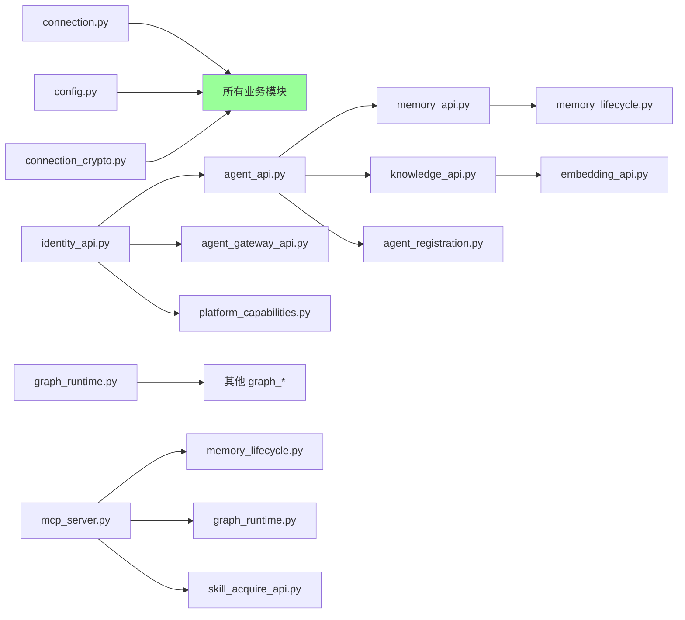
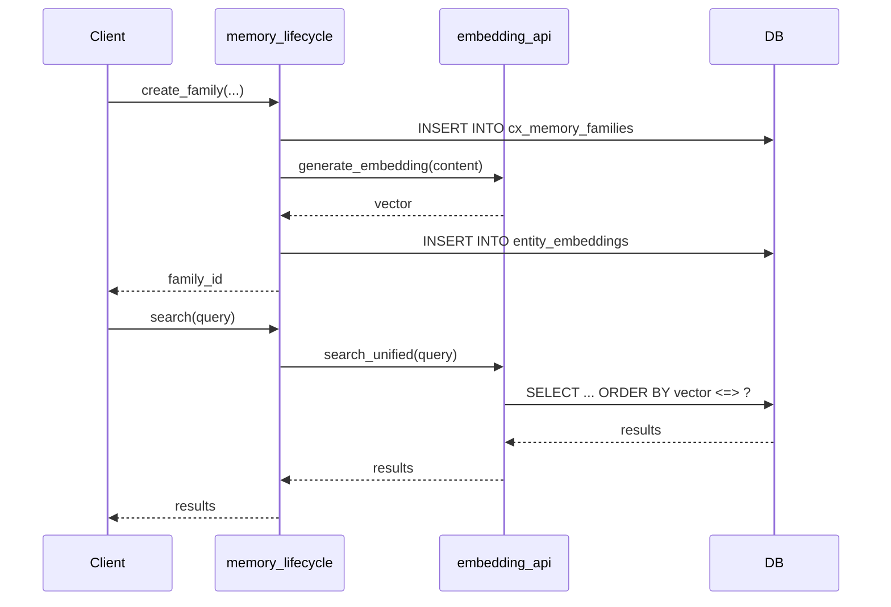
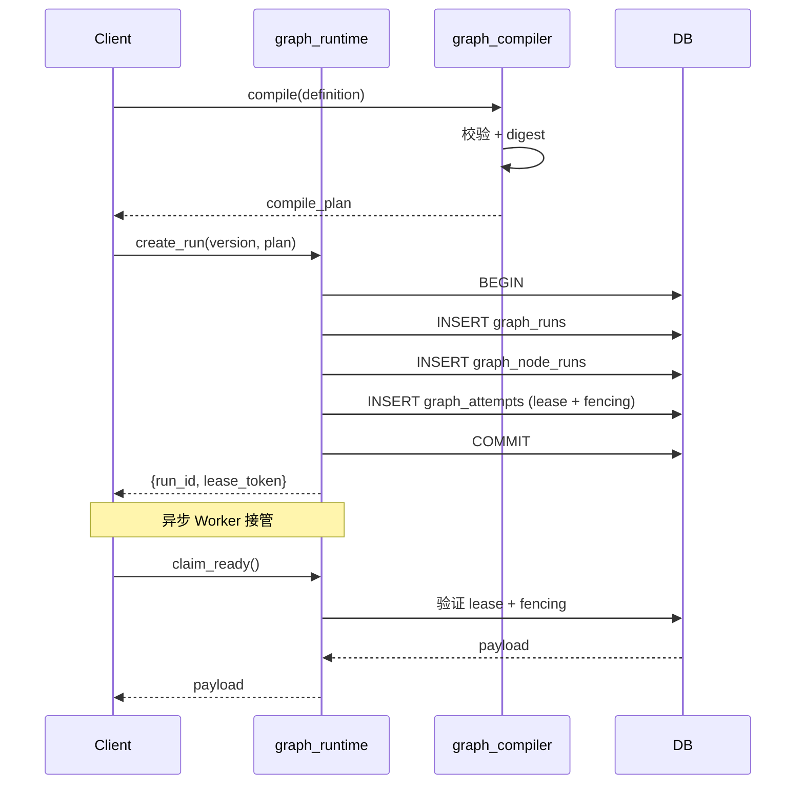

# §52 Python 模块索引

> 🧑‍💻 开发者 · 🏛️ 架构师
>
> **一句话定位**:`scripts/lib/` 下 60+ Python 模块的完整索引,按领域分组,标注关键 API。

---

## 1. 总览

来源:[`scripts/lib/`](../../scripts/lib/)

| 领域 | 文件数 | 代表模块 |
|---|---|---|
| 基础设施 | 6 | `connection.py`、`config.py`、`security.py` |
| 身份/认证 | 7 | `identity_api.py`、`agent_api.py` |
| 领域 API | 15+ | `memory_api.py`、`knowledge_api.py`、`loop_api.py` |
| Graph 工程 | 20 | `graph_runtime.py`、`graph_compiler.py` |
| 可观测性 | 3 | `monitor_api.py`、`trace_api.py`、`event_bus.py` |
| Skill/工具 | 5 | `skill_api.py`、`tool_registry.py` |
| MCP Server | 1 | `mcp_server.py` |
| 执行控制 | 3 | `execution_control.py`、`message_api.py` |
| 配置/契约 | 3 | `connection_crypto.py`、`governed_contracts.py`、`agent_framework_adapters.py` |
| **总计** | **60+** | |

---

## 2. 基础设施

| 模块 | 行数 | 关键 API | 用途 |
|---|---|---|---|
| `connection.py` | ~500 | `get_pool()`, `get_connection()`, `get_connection_for_agent()`, `execute()` | psycopg2 连接池 |
| `config.py` | ~300 | `load_config()`, `get_config()` | 配置 dataclass |
| `connection_crypto.py` | ~400 | `encrypt_section()`, `decrypt_section()` | PBKDF2 + AES-256-GCM |
| `security.py` | ~200 | `DataMaskingService`, `hash_password()` | 数据脱敏 |
| `edition_features.py` | ~50 | `has_feature()` | Community/Enterprise 边界 |
| `governed_contracts.py` | ~600 | `channel_lifecycle_decision()` 等 | 纯函数决策 |

---

## 3. 身份/认证

| 模块 | 行数 | 关键 API | 用途 |
|---|---|---|---|
| `identity_api.py` | ~1000 | `principal_summary()`, `hash_password_argon2id()` | Human Principal |
| `agent_api.py` | ~1500 | `register_agent()`, `heartbeat()`, `recover_agent_via_admin()` | Agent 生命周期 |
| `agent_registration.py` | ~600 | `register_agent()`, `authenticate_agent()` | v4.1+ 注册 |
| `agent_gateway_api.py` | ~800 | `authenticate_client_secret()`, `issue_access_token()` | Gateway |
| `security_lifecycle.py` | ~700 | `enroll_totp()`, `verify_totp_secret()` | MFA + 生命周期 |
| `user_api.py` | ~300 | `register_user()`, `get_user_profile()` | 用户 CRUD |
| `platform_capabilities.py` | ~500 | `is_enabled()`, `page_states()` | v4.3.5 能力 |

---

## 4. 领域 API

| 模块 | 行数 | 关键 API | 用途 |
|---|---|---|---|
| `memory_api.py` | ~1500 | `create_memory()`, `search_memories()` | 旧版 Memory |
| `memory_lifecycle.py` | ~2500 | `create_family()`, `create_successor()`, `quarantine_family()` | v4.3.2 版本化 |
| `knowledge_api.py` | ~1200 | `create_knowledge()`, `search_knowledge()` | Knowledge |
| `embedding_api.py` | ~1000 | `search_unified()`, `search_unified_sql()` | 向量 + 全文 |
| `search_api.py` | ~800 | `search()`, `list_search_strategies()` | 统一搜索 |
| `loop_api.py` | ~2000 | `create_loop()`, `evaluate_iteration()` | Loop Engineering |
| `task_plan_api.py` | ~1000 | `create_plan()`, `add_step()`, `log_tool_call()` | Task Plan |
| `workspace_api.py` | ~1000 | `save_context()`, `recover_workspace()` | Workspace + Context |
| `branch_api.py` | ~1000 | `fork_branch()`, `merge_branch()` | Branch |
| `spec_api.py` | ~600 | `create_spec()`, `validate_plan_against_spec()` | Spec-Driven |
| `harness_api.py` | ~600 | `instantiate_harness_template()` | Harness |
| `collab_api.py` | ~600 | `create_collab_group()`, `share_memory_to_group()` | 协作组 |
| `organization_api.py` | ~2000 | `list_roots()`, `assemble_graph()` | v4.3.1 组织 |
| `graph_api.py` | ~1700 | `get_neighbors()`, `find_communities()` | 关系图算法 |
| `profile_api.py` | ~400 | `current_profile()`, `preflight()` | 当前 Profile |
| `compliance_api.py` | ~1200 | `_validate_profile_publication_tx()` | ⚠️企业版 Profile |

---

## 5. Graph 工程(最大)

| 模块 | 行数 | 关键 API | 用途 |
|---|---|---|---|
| `graph_runtime.py` | ~3500 | `create_run()`, `claim_ready()`, `_verify_lease()` | 运行时内核 |
| `graph_compiler.py` | ~1200 | `canonical()`, `digest()`, `_diag()` | 编译 |
| `graph_executor.py` | ~800 | `builtin_executor_manifests()` | 执行器清单 |
| `graph_contracts.py` | ~600 | `is_valid_status_transition()` | 契约 |
| `graph_state.py` | ~400 | `encode_secret_state()` | 密钥信封 |
| `graph_governance.py` | ~600 | `budget_decision()` | 治理事件 |
| `graph_dynamic.py` | ~800 | `require_preview()`, `apply_operations()` | Dynamic Graph(预览) |
| `graph_predicate.py` | ~250 | `compile_safe_predicate()` | 安全谓词 |
| `graph_assurance.py` | ~800 | `arm_failpoint_for_test()`, `record_evidence_tx()` | v4.3.3 保障 |
| `graph_supply_chain.py` | ~600 | `verify_document()` | 供应链签名 |
| `graph_compat.py` | ~300 | `graph_status()`, `task_plan_definition()` | v4.1 兼容 |
| `graph_evaluators.py` | ~700 | `builtin_evaluator_manifests()` | 评估器 |
| `graph_adapter.py` | ~400 | `projection_statements()` | Apache AGE 适配 |
| `graph_event_api.py` | ~700 | `receive()`, `replay_dead_letter()` | 事件 Inbox/Outbox |
| `graph_event_contract.py` | ~400 | `sign_event()`, `verify_event_auth()` | 事件契约 |
| `graph_scheduler.py` | ~600 | `acquire_scheduler_lease()` | 调度策略 |
| `graph_telemetry.py` | ~400 | `enabled()`, `redact_metadata()` | 遥测(预览) |
| `graph_worker.py` | ~100 | `advertise()`, `complete()` | Worker 客户端 |
| `graph_definition_api.py` | ~800 | `create_version()`, `digest_json()` | Graph/Version CRUD |
| `a2a_gateway.py` | ~400 | `negotiate()`, `agent_card()` | A2A 1.0.1(预览) |

---

## 6. 可观测性

| 模块 | 行数 | 关键 API | 用途 |
|---|---|---|---|
| `monitor_api.py` | ~800 | `get_agent_health()`, `detect_run_drift()` | 系统总览 + 漂移 |
| `trace_api.py` | ~400 | `init_trace()`, `get_trace_tree()` | 调用链 |
| `event_bus.py` | ~1000 | `publish_event()`, `subscribe_agent()` | Pub/Sub + Webhook |

---

## 7. Skill / 工具

| 模块 | 行数 | 关键 API | 用途 |
|---|---|---|---|
| `skill_api.py` | ~1000 | `register_skill()`, `validate_skill()` | Skill CRUD |
| `skill_acquire_api.py` | ~600 | `discover_skills()`, `materialize_skill()` | 外部 Agent 获取 |
| `skill_parser.py` | ~400 | `parse_skill_md()` | SKILL.md 解析 |
| `skill_storage.py` | ~300 | `save_resource()`, `get_resource_path()` | 文件系统存储 |
| `tool_registry.py` | ~600 | `import_openapi()`, `create_tool_chain()` | OpenAPI → Tool |

---

## 8. MCP / 执行控制

| 模块 | 行数 | 关键 API | 用途 |
|---|---|---|---|
| `mcp_server.py` | ~1500 | `_get_exposed_tools()`, 10+ 工具 | MCP 协议 |
| `execution_control.py` | ~500 | `enqueue_job()`, `claim_job()` | 有界执行 |
| `message_api.py` | ~600 | `send_message()`, `reply_message()` | 消息 |

---

## 9. 配置/契约

| 模块 | 行数 | 关键 API | 用途 |
|---|---|---|---|
| `connection_crypto.py` | ~400 | `encrypt_section()`, `decrypt_section()` | 配置加密 |
| `governed_contracts.py` | ~600 | 纯函数决策 | 可移植 Python + PL/pgSQL |
| `agent_framework_adapters.py` | ~600 | 6 个 build 函数 | OpenClaw/Hermes |

---

## 10. 模块依赖图

---

## 11. 关键调用路径(典型场景)

### 11.1 创建 Memory 并搜索

### 11.2 启动 Graph Run

---

## 12. 测试覆盖

| 模块 | 测试文件 | 覆盖 |
|---|---|---|
| `connection.py` | `tests/test_connection.py` | RLS 上下文 + 事务 |
| `memory_lifecycle.py` | `tests/test_memory_lifecycle.py` | Family/Version 状态机 |
| `graph_runtime.py` | `tests/test_graph_runtime.py` | Lease/Fencing + Checkpoint |
| `mcp_server.py` | `tests/test_mcp_server.py` | 工具暴露 + 认证 |
| `identity_api.py` | `tests/test_identity_api.py` | Argon2id + Session |
| `agent_framework_adapters.py` | `tests/test_agent_framework_adapters.py` | 凭据拒绝 |

---

## 13. 命名约定

| 类型 | 命名 | 例 |
|---|---|---|
| 业务 API | `<domain>_api.py` | `notification_api.py` |
| 生命周期 | `<domain>_lifecycle.py` | `memory_lifecycle.py` |
| 运行时 | `<domain>_runtime.py` | `graph_runtime.py` |
| 编译/校验 | `<domain>_compiler.py` | `graph_compiler.py` |
| 契约 | `<domain>_contracts.py` | `graph_contracts.py` |
| 适配 | `<domain>_adapter.py` | `graph_adapter.py` |

---

## 14. 交叉引用

- 模块导览:[§23 Python 业务模块导览](23-Python业务模块导览.md)
- 测试:[§27 测试体系与 pytest 实践](27-测试体系与pytest实践.md)
- 扩展开发:[§29 扩展开发指南](29-扩展开发指南.md)

> 📌 **下一章**:[§53 REST API 索引](53-REST-API索引.md) — 按类别列出 `/api/*` 路由。