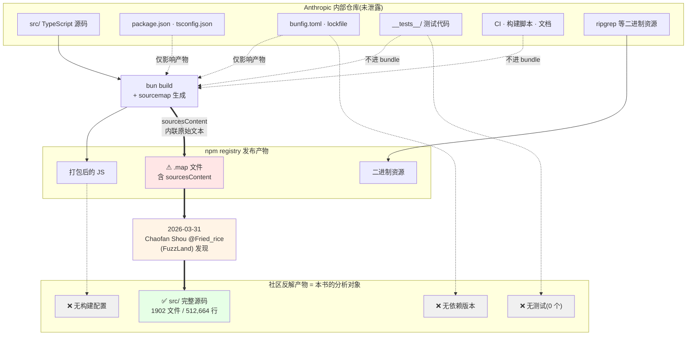

# 第 1 章 泄露背景与源码边界

## 摘要

2026 年 3 月 31 日,Claude Code CLI 的完整 TypeScript 源码经由 npm registry 中未剥离的 source map(`.map`)文件流出,规模为 **1902 个文件 / 512,664 行**。本 handbook 的全部分析都建立在这份源码之上。但泄露物**只有 `src/` 目录**:没有 `package.json`、没有 `tsconfig.json`、没有 `bunfig.toml`、没有一行测试代码。这意味着依赖版本、构建参数、打包目标全部只能从代码内部**推断**而非读取。本章交代这个事实边界,以及由此产生的、贯穿全书的引用纪律。

## 速赢

- **泄露的是 source map,不是仓库**。`.map` 文件里嵌的是 `sourcesContent` —— 打包器为调试保留的原始文本。所以我们拿到的是"进入打包器之前的 `src/`",而不是 Anthropic 的 git 仓库。
- **缺失的比拿到的更能说明问题**。0 个 `__tests__` 目录、0 个 `*.test.ts`,不是因为 Anthropic 不写测试,而是因为测试文件根本不进 bundle,自然不进 source map。
- **运行时是 Bun,这一点无需猜测**。代码里直接调用了 `Bun.YAML`、`Bun.JSONL`、`Bun.indexOfFirstDifference` 这类 **Bun 独占、Node 无对应物**的 API —— 见 §1.3。
- **`feature()` 没有源文件**。`import { feature } from 'bun:bundle'` 遍布全码库,但 `src/utils/feature.ts` 不存在 —— 它是 Bun 的内置构建宏。这是"构建配置缺失"最直观的一次现形。
- **本书不是官方文档**。任何与 `docs.claude.com` 冲突的地方,以官方为准;本书的价值在于官方文档不写的那一层。

## 关键图:泄露链路与边界



> 这张图解释了本书全部"已知限制"的来源:**凡是不进 bundle 的东西,都不在 source map 里**。测试、CI、构建配置的缺失不是偶然,是打包机制的必然结果。

---

## 1.1 事件经过

| 时间 | 事件 |
|---|---|
| 2026-03-31 | FuzzLand 研究员 Chaofan Shou(X: `@Fried_rice`)公开指出:`@anthropic-ai/claude-code` 的 npm 包中带有未剥离的 `.map` 文件,其中 `sourcesContent` 字段完整保留了 TypeScript 原文 |
| 2026-03-31 ~ 04-01 | 社区从 `.map` 反解出 `src/` 目录树,压缩包在多处流传,GitHub 出现镜像备份(如 `MikeGu721/claude-code`、`0PeterAdel/ClaudeCode-Leak`) |
| 2026-04-01 | 中文技术媒体以"51 万行代码全曝光"为题扩散,`1900 文件 / 512K 行`成为流传最广的规模数字 |

技术上这不是入侵,而是一次**发布流程疏漏**:打包时生成了 source map 并连同产物一起发布到公共 registry。`sourcesContent` 是 source map 规范里的可选内联字段,它的存在让"下载 npm 包"等价于"下载源码"。

> **对读者的含义**:这份源码的**真实性**很高(它就是构建输入),但**完整性**受限于"什么会被打进 bundle"。下一节展开这个边界。

---

## 1.2 源码边界:拿到了什么,没拿到什么

### 实测规模

```
src/ 总文件数     1902
  .ts             1332
  .tsx             552
  .js               18
总行数          512,664
```

按顶层目录分布(行数降序,实测):

| 目录 | 文件数 | 行数 | 占比 |
|---|---:|---:|---:|
| `utils/` | 564 | 180,472 | 35.2% |
| `components/` | 389 | 81,546 | 15.9% |
| `services/` | 130 | 53,680 | 10.5% |
| `tools/` | 184 | 50,828 | 9.9% |
| `commands/` | 207 | 26,428 | 5.2% |
| `ink/` | 96 | 19,842 | 3.9% |
| `hooks/` | 104 | 19,204 | 3.7% |
| 其余 27 个目录 | 228 | ~80,664 | 15.7% |

完整的目录职责表见 `01-foundation/04-codebase-tour.md`。

### 确认缺失的东西

以下文件在泄露物中**实测不存在**:

| 缺失项 | 后果 |
|---|---|
| `package.json` | 无依赖版本号、无 npm scripts、无 `bin` 声明。所有第三方库版本只能从 import 路径推断 |
| `tsconfig.json` | 无 `target` / `module` / `strict` / `paths` 配置。代码里的 `src/...` 绝对导入说明配了 `baseUrl` 或 `paths`,但具体值未知 |
| `bunfig.toml` | 无 Bun 构建配置,`feature()` 的构建期取值表无法直接读取 |
| `__tests__/` `*.test.ts` `*.spec.ts` | **0 个**。无法从测试反推预期行为、边界条件、契约 |
| lockfile(`bun.lockb` / `package-lock.json`) | 无精确依赖树 |
| `.eslintrc` / 格式化配置 | 无法确认代码风格约束 |
| 构建脚本 / CI 配置 | 无法确认 external vs. ant 两套构建的具体产出差异 |
| 二进制资源(ripgrep 等) | 打包进最终产物但不在 source map 中 |

> **一条重要推论**:`01-foundation/03-feature-flags.md` 中列出的 90 个构建期开关,其"某个构建里到底是 true 还是 false"**无法从源码确定**。我们只能从 `feature('X') ? A : B` 的两个分支推断出"这个开关控制什么",不能推断"它开着还是关着"。全书凡涉及构建期开关状态的论断,都应读作条件句。

---

## 1.3 运行时推断:为什么可以断定是 Bun

这是全书唯一一处需要"推断"却能给出**近乎确定性**结论的地方,值得单列。

### 证据一:Bun 独占 API 的直接调用

全码库对 `Bun.*` 全局对象的调用统计(实测):

| API | 调用次数 | Node 是否有等价物 |
|---|---:|---|
| `Bun.hash` | 12 | 无(需 `crypto`) |
| `Bun.semver` | 8 | 无(需 `semver` 包) |
| `Bun.which` | 5 | 无 |
| `Bun.stringWidth` | 5 | 无(需 `string-width` 包) |
| `Bun.gc` | 3 | 无(需 `--expose-gc`) |
| `Bun.YAML` | 2 | **无,且无标准库对应** |
| `Bun.JSONL` | 2 | **无,且无标准库对应** |
| `Bun.wrapAnsi` | 2 | 无 |
| `Bun.spawn` | 2 | 语义不同于 `child_process.spawn` |
| `Bun.listen` | 2 | 语义不同于 `net.createServer` |
| `Bun.embeddedFiles` | 2 | **无,编译期单文件产物专属** |
| `Bun.indexOfFirstDifference` | 1 | **无** |

`Bun.YAML`、`Bun.JSONL`、`Bun.indexOfFirstDifference` 这三个是决定性的:它们是 Bun 独有的运行时能力,在 Node 上无论装什么包都不会挂到全局 `Bun` 上。

### 证据二:运行时自检代码

`src/utils/bundledMode.ts` 只有 22 行,却把运行时假设写得非常明确:

```typescript
// src/utils/bundledMode.ts:7-10
export function isRunningWithBun(): boolean {
  // https://bun.com/guides/util/detect-bun
  return process.versions.bun !== undefined
}

// src/utils/bundledMode.ts:16-22
export function isInBundledMode(): boolean {
  return (
    typeof Bun !== 'undefined' &&
    Array.isArray(Bun.embeddedFiles) &&
    Bun.embeddedFiles.length > 0
  )
}
```

`isInBundledMode()` 检测的是 **Bun 编译型单文件可执行产物**(`bun build --compile`)。`Bun.embeddedFiles` 只在这种产物里非空。这说明 Claude Code 的分发形态至少包含"Bun 编译的独立二进制",而不只是 npm 上的 JS。

该函数的实际用途之一是定位内嵌的 ripgrep 二进制 —— `src/utils/ripgrep.ts:8` 导入了它,并在 `getRipgrepConfig()` 中区分 `'system' | 'builtin' | 'embedded'` 三种模式。

### 证据三:`bun:bundle` 构建宏

```typescript
// src/QueryEngine.ts:1
import { feature } from 'bun:bundle'
```

`bun:bundle` 是 Bun 的虚拟模块命名空间。全码库大量文件从它导入 `feature`,而 **`src/utils/feature.ts` 在泄露物中不存在** —— 因为它根本不是源文件,是构建器提供的宏。`feature('X')` 在打包时被替换为字面量 `true`/`false`,随后死代码消除掉整个分支。

这也解释了为什么本书能列出 188 个开关名却无法列出它们的值:名字在 `feature('...')` 的调用点上,值在缺失的构建配置里。详见 `01-foundation/03-feature-flags.md`。

> **保留的不确定性**:Bun 是**构建与运行时**这一点确定;但 npm 分发的那份 JS 是否也强制 Bun 运行、是否有 Node 兼容降级路径,源码里没有给出完整答案。`isRunningWithBun()` 这个函数的存在本身暗示了"可能不在 Bun 下运行"的分支是存在的。

---

## 1.4 本 handbook 的已知限制

请把下面这五条当作阅读全书时始终生效的脚注。

### L1 —— 版本漂移

源码快照对应 2026 年 3 月底的某个构建。Claude Code 迭代很快,**你今天 `npm install` 得到的版本几乎必然与本书描述不同**。行为差异优先信任你手上的二进制。

### L2 —— 行号会失效

本书每个代码引用都带 `file:line`。行号对**这份快照**准确(全部经过实测校验),但对官方后续版本无效。当行号对不上时,用符号名(函数名/类型名)去搜,而不是跳到行号。

### L3 —— 无法区分"已上线"与"开发中"

源码里存在大量 `feature('KAIROS')`、`feature('SSH_REMOTE')`、`feature('BG_SESSIONS')` 之类的守卫。这些代码**存在**不等于**可用**。本书在描述这类功能时会显式标注其开关名,读者需自行验证在自己的版本里是否生效。

### L4 —— 无测试可参照

缺少测试意味着本书对边界条件的描述来自**代码阅读**,而非**契约声明**。凡涉及"当输入为 X 时会发生 Y"的论断,若源码中没有显式分支,本书会标注为推测。

### L5 —— 个别文件可能与官方 build 不一致

source map 反解依赖 `sourcesContent` 的忠实度。打包器在某些情况下会对源码做预处理(如 JSX 转换前的插桩),导致极少数文件与仓库原文有出入。实测中未发现明显异常,但无法排除。

---

## 反模式

以下是围绕这份源码最常见的五种误读,本书会反复回到它们。

1. **"源码里有,所以能用"** —— 忽略 `feature()` 守卫。一半以上的"新发现功能"实际被构建期开关关掉了。
2. **"没有测试,所以质量差"** —— 测试不进 bundle 是打包器的常规行为,与工程质量无关。
3. **"这是 Anthropic 的 git 仓库"** —— 不是。目录树是打包器视角的 `src/`,不含 CI、脚本、文档、资源。
4. **"依赖版本可以从 import 推断"** —— 只能推断出**大版本**。例如 `from 'zod/v4'`(125 处)能确定是 Zod v4 的子路径导出,但确定不了 `4.x` 的具体小版本。
5. **"泄露源码 = 可以照抄"** —— 本书的定位是**技术分析与学习**。源码的著作权属于 Anthropic;阅读、研究、借鉴设计思想与直接复制代码是两回事。

---

## 引用

**前置**
- `00-front/03-glossary.md` —— 50 个核心术语的标准中英对照。本章出现的 `feature flag`、`Tool`、`QueryEngine` 等术语均以该表为准。

**平行**
- `00-front/02-three-perspectives.md` —— 确认边界后,选择你的阅读路径。
- `01-foundation/03-feature-flags.md` —— 188 个开关(90 构建期 + 98 运行期)的完整矩阵,是 §1.4/L3 的展开。

**后继**
- `01-foundation/02-tech-stack.md` —— 把 §1.3 的运行时推断扩展为完整技术栈。
- `01-foundation/04-codebase-tour.md` —— 把 §1.2 的规模表扩展为完整目录导览。
- `04-architect/25-layered-arch.md` —— 五层架构模型,本书结构性分析的主干。

**源码定位**
- `src/utils/bundledMode.ts:7-22` —— `isRunningWithBun()` / `isInBundledMode()`,运行时推断的直接证据
- `src/QueryEngine.ts:1` —— `import { feature } from 'bun:bundle'`,构建宏的典型引入点
- `src/utils/ripgrep.ts:8` —— `isInBundledMode()` 的实际消费者,`'system' | 'builtin' | 'embedded'` 三态
- `src/main.tsx:585` —— `main()` 入口,全书的"第 0 行"
- `src/commands.ts:258` —— `COMMANDS` 注册表,泄露源码信息密度的一个缩影
