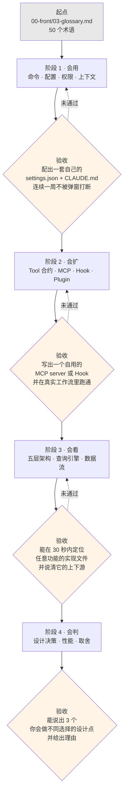

# 第 2 章 三视角阅读指引

## 摘要

512,664 行源码没有"从头读到尾"这个选项。本书为三类读者各铺了一条主干路径:**用户**关心"怎么把这个工具用到极致",**开发者**关心"怎么在它上面扩展或 fork",**架构师**关心"它为什么长成这样"。三条路径共享同一套术语(`00-front/03-glossary.md`)和同一份源码坐标,但入口、密度、跳过的内容完全不同。本章给出读者画像、每个视角的必读清单、以及一张概念×视角的交叉引用地图 —— 用来回答"我关心的这个概念,在哪几章被讲到,分别讲到什么深度"。

## 速赢

- **先选路径,再读章节**。三条路径不是"初级/中级/高级",是**三种不同的问题**。架构师路径不比用户路径"更高级",它只是不回答"怎么配置权限"。
- **术语表是唯一的强制前置**。`00-front/03-glossary.md` 的 50 个术语在全书被反复引用且不再重新定义。跳过它,后面每一章都会卡。
- **同一个概念在三个视角下讲三遍,不是重复**。以"权限"为例:用户视角讲 `settings.json` 怎么写,开发者视角讲 `checkPermissions()` 怎么实现,架构师视角讲五层判定链为什么要有 `passthrough` 中间态。
- **遇到 `feature('X')` 就去查开关表**。`01-foundation/03-feature-flags.md` 是三个视角共同的"这功能到底存不存在"仲裁者。
- **行号是快照坐标,不是永久地址**。对不上时用符号名搜索(见 `00-front/01-leak-context.md` §1.4/L2)。

---

## 2.1 三类读者画像

### 用户(User)

**你是谁**:每天用 Claude Code 写代码,已经会用基本命令,但感觉"没用到它一半的能力"。你可能不写 TypeScript,也不打算读源码。

**你的痛点**:权限老是弹窗 / 上下文老是爆 / 不知道 `/compact` 和自动压缩的区别 / 插件和 Skill 到底怎么选 / MCP 配了但不生效。

**你需要从源码里得到什么**:官方文档没写的**默认值、优先级、触发条件**。比如自动压缩的阈值是多少、权限规则的匹配顺序是什么、`settings.json` 五层加载谁覆盖谁。这些都在源码里是硬编码常量,但文档里往往是一句"自动"。

**建议密度**:读结论表和配置示例,跳过所有代码块。

### 开发者(Developer)

**你是谁**:想写一个 MCP server、一个插件、一组 Hook,或者干脆 fork 一份自己改。你读 TypeScript,想知道扩展点的**准确契约**。

**你的痛点**:文档给的 Hook 输入输出 schema 不全 / 不知道自定义工具能拿到哪些上下文 / 不确定 MCP 工具和内建工具的权限路径是否一致 / 想知道 `isConcurrencySafe` 到底影响什么。

**你需要从源码里得到什么**:类型定义原文 + 调用点。`Tool` 接口有约 40 个可选方法,官方文档只讲其中几个;`buildTool` 的默认值填充规则决定了你不实现某个方法时会发生什么。

**建议密度**:重点读类型定义和调用链,配置章节可跳。

### 架构师(Architect)

**你是谁**:在设计自己的 Agent 系统 / CLI 工具 / LLM 应用,想看一个真实的、512K 行规模的生产级实现是怎么组织的。

**你的痛点**:自己的 Agent 循环写着写着变成一团面条 / 工具并发怎么调度 / 上下文管理有哪些层次 / 流式响应和工具执行怎么交错 / 权限系统怎么做才不失控。

**你需要从源码里得到什么**:**决策及其代价**。比如为什么用 async generator 而不是事件发射器,为什么权限判定要设计成五层带 `passthrough` 的链,为什么上下文压缩要分五种(手动/自动/微/被动/记忆)。

**建议密度**:读架构图和决策讨论,跳过 API 签名细节。

---

## 2.2 每个视角的"5 章必读"

### 用户路径

| 序 | 章节 | 为什么必读 | 读完你能 |
|---|---|---|---|
| 1 | `00-front/03-glossary.md` | 术语基线。全书不再重复定义 | 看懂后续所有章节的名词 |
| 2 | `01-foundation/01-background.md` | 能力矩阵与适用边界 | 判断哪些任务该交给它、哪些不该 |
| 3 | `02-user/` — 命令与 CLI 参数 | `COMMANDS` 注册表有 60+ 条目,文档只讲了一部分 | 用上冷门但高价值的命令 |
| 4 | `02-user/` — 配置与权限 | `settings.json` 五层加载 + 权限规则匹配 | 一次配好,不再被弹窗打断 |
| 5 | `02-user/` — 上下文与压缩 | 五种压缩机制的触发条件与阈值 | 理解"上下文爆了"到底发生了什么 |

> **加餐**:`01-foundation/03-feature-flags.md` 的运行期开关部分 —— 解释了"为什么同事有这个功能我没有"。

### 开发者路径

| 序 | 章节 | 为什么必读 | 读完你能 |
|---|---|---|---|
| 1 | `00-front/03-glossary.md` | 同上 | 同上 |
| 2 | `01-foundation/02-tech-stack.md` | 依赖清单 + 各子系统的技术选型 | 知道扩展时能复用哪些既有能力 |
| 3 | `01-foundation/04-codebase-tour.md` | 1902 文件的地图 | 快速定位任何功能的实现位置 |
| 4 | `03-developer/` — Tool 合约 | `Tool<Input, Output, P>` 约 40 个方法的语义 | 写出行为正确的自定义工具 |
| 5 | `03-developer/` — 扩展点(MCP / Hook / Plugin / Skill) | 四种扩展方式的能力边界与选型 | 选对扩展形态,不做无用功 |

> **加餐**:`01-foundation/03-feature-flags.md` 的构建期开关部分 —— fork 时你需要知道哪些代码路径默认是死的。

### 架构师路径

| 序 | 章节 | 为什么必读 | 读完你能 |
|---|---|---|---|
| 1 | `00-front/03-glossary.md` | 同上 | 同上 |
| 2 | `04-architect/25-layered-arch.md` | 五层架构 + 依赖方向规则 | 建立全局心智模型 |
| 3 | `04-architect/` — 查询引擎与数据流 | `submitMessage` → `query` → `StreamingToolExecutor` 主管线 | 看懂 Agent 循环的工业级写法 |
| 4 | `04-architect/` — 权限与安全模型 | 五层判定链 + sandbox + classifier | 设计自己的能力约束系统 |
| 5 | `04-architect/` — 上下文管理与压缩策略 | 五种压缩的分工与 circuit breaker | 解决自己系统的上下文膨胀 |

> **加餐**:`00-front/01-leak-context.md` §1.4 —— 知道哪些结论是推断,避免把猜测当成事实引用。

---

## 2.3 交叉引用地图:一个概念,三种深度

下表是本书的"概念索引"。左列是核心概念,中间三列说明该概念在各视角下被讲到什么深度,最右列给出源码锚点 —— 当章节还没写到、或你想直接看原文时,从锚点切入。

| 概念 | 👤 用户视角 | 🔧 开发者视角 | 🏛 架构师视角 | 源码锚点 |
|---|---|---|---|---|
| **Tool** | 有哪些工具、各自能干什么 | `Tool` 接口约 40 个方法的契约;`buildTool` 默认值 | 为什么把工具建模成"能力 + 谓词"而非纯函数 | `src/Tool.ts:362`、`src/Tool.ts:783` |
| **Permission** | `settings.json` 的 `allow/deny/ask` 怎么写 | `checkPermissions()` 返回值语义、`passthrough` 何时用 | 五层判定链;`decisionReason` 为什么要 11 种 | `src/types/permissions.ts:44`、`src/utils/permissions/PermissionResult.ts:251` |
| **PermissionMode** | 五种模式怎么切、各自什么行为 | 内部两个隐藏态(`auto`/`bubble`)的用途 | 为什么把"安全策略"显式建模成模式而非布尔开关 | `src/types/permissions.ts:14-40` |
| **QueryEngine** | — (不可见) | 会话级可变状态有哪些、如何跨 turn 共享 | 为什么用类持有可变状态,而不是纯函数 + 参数透传 | `src/QueryEngine.ts:184` |
| **submitMessage** | — | `AsyncGenerator<SDKMessage>` 的消费方式 | Agent 循环的分层:轮次 / LLM 调用 / 工具执行三级生成器 | `src/QueryEngine.ts:209` |
| **StreamingToolExecutor** | 为什么有些工具能并行、有些不能 | `isConcurrencySafe` 的实际影响、中断级联规则 | 流式调度器设计:进度立即 yield、结果按序 yield | `src/services/tools/StreamingToolExecutor.ts:40` |
| **Command** | 60+ 个 `/` 命令清单与用法 | 三种命令类型(`prompt`/`local`/`local-jsx`)如何注册 | 命令为什么懒加载、`memoize` 的时机约束 | `src/commands.ts:258-346` |
| **Hook** | 怎么配一个 PreToolUse 钩子 | 各事件的 JSON schema、阻断语义、退出码 | 扩展点为什么放在工具生命周期而非消息生命周期 | `src/utils/hooks/hookEvents.ts:51-91` |
| **MCP** | `.mcp.json` 怎么配、怎么启用 | 六种 transport、工具命名空间 `mcp__<server>__<tool>` | 外部工具与内建工具如何统一到同一合约 | `src/services/mcp/client.ts`、`src/services/tools/toolExecution.ts:283` |
| **Plugin / Skill** | 装什么、怎么装、两者怎么选 | `manifest.json` 结构、变量替换、热重载 | 插件与技能为什么共用代码路径 | `src/utils/plugins/loadPluginCommands.ts:218` |
| **Compact** | 上下文爆了怎么办、阈值是多少 | 五种压缩的 API 与触发条件 | 为什么需要五种而不是一种;circuit breaker 设计 | `src/services/compact/autoCompact.ts:160` |
| **settings.json** | 五层来源、谁覆盖谁 | `SettingsJson` 完整字段表 | 分层配置为什么要引入 `allowedSettingSources` 白名单 | `src/utils/settings/types.ts:1104` |
| **transcript** | `--resume` 恢复了什么 | JSONL 每行结构、写入串行化 | fire-and-forget 写入策略的一致性权衡 | `src/utils/sessionStorage.ts:1408` |
| **REPL / Ink** | 快捷键、Vim 模式、状态栏 | 自定义 hooks、组件结构 | 为什么自建 reconciler 而非直接用 Ink 上游 | `src/screens/REPL.tsx:572`、`src/ink/reconciler.ts:4` |
| **feature flag** | 为什么我没有某功能 | fork 时哪些路径是死代码 | 构建期 DCE + 运行期 GrowthBook 双层机制 | `01-foundation/03-feature-flags.md` |
| **Sandbox** | 什么时候被沙箱拦 | `sandboxOverride` 的两种 reason | 沙箱与权限系统的职责划分 | `src/utils/sandbox/sandbox-adapter.ts` |
| **Coordinator / Agent** | 子 Agent 什么时候值得用 | `AgentTool` 输入契约、scratchpad 共享 | 多 Agent 上下文隔离与状态回收 | `src/coordinator/`、`src/tools/AgentTool/` |

**怎么用这张表**:确定你的视角(选一列)→ 找到你关心的概念(选一行)→ 交叉格告诉你"这一章会讲到什么程度"→ 如果不够,用最右列的锚点直接读源码。

---

## 2.4 渐进路径:从用户到架构师

三个视角不是互斥的。如果你打算完整读完本书,推荐下面这条螺旋上升的路线 —— 每一层都以"能动手做出东西"为验收标准,而不是"读完了"。

### 关于跳级

**可以跳的**:如果你已经是 Claude Code 重度用户,阶段 1 只需读"配置与权限"一章补齐默认值知识,其余可跳。

**不建议跳的**:阶段 2 → 阶段 4。不理解扩展点的实际约束就去评价架构决策,很容易得出"这里过度设计了"的错误结论 —— 而这些设计往往正是为了支撑那些你没读到的扩展点。典型例子:`PermissionResult` 的 `passthrough` 中间态,单看权限模块像是冗余,读过 MCP + Hook + classifier 三个扩展点后才会明白它是必需的。

### 每个阶段的时间预期

| 阶段 | 章节数 | 预计投入 | 主要形式 |
|---|---:|---|---|
| 1 · 会用 | ~5 | 3-5 小时 | 读表 + 改配置 |
| 2 · 会扩 | ~6 | 8-12 小时 | 读类型 + 写代码 |
| 3 · 会看 | ~5 | 6-10 小时 | 读图 + 追调用链 |
| 4 · 会判 | ~8 | 10-15 小时 | 读决策 + 对照自己的系统 |

---

## 反模式

1. **"我全都想要,所以从第 1 章顺读到最后一章"** —— 512K 行源码的分析文本,顺读的结果通常是在第 8 章失去动力。选一条路径,读完,再回头补另一条。
2. **"跳过术语表,遇到不懂的再查"** —— 术语表不只是词典,它同时是一份**分类学**:七大类的划分本身就是理解代码组织的第一把钥匙。跳过它会导致后续章节的分类叙述失去参照。
3. **"用户视角 = 简单版,架构师视角 = 完整版"** —— 错。用户视角包含大量架构师视角**完全不涉及**的内容(具体配置项、默认值、命令用法)。它们是正交的,不是嵌套的。
4. **"看到源码引用就跳过"** —— 本书的每个论断都带 `file:line`,是为了让你能验证而非炫技。至少在遇到反直觉的结论时,去看一眼原文。
5. **"读完就等于会了"** —— 每个阶段都有验收标准,而且都是"做出东西",不是"读完章节"。跳过验收直接进下一阶段,是本书最常见的失败模式。

---

## 引用

**前置**
- `00-front/01-leak-context.md` —— 源码边界与已知限制。选择路径前先知道哪些结论是推断。
- `00-front/03-glossary.md` —— 50 个术语,三条路径的共同强制前置。

**平行**
- `01-foundation/03-feature-flags.md` —— 188 个开关。三个视角共同的"这功能存不存在"仲裁者。

**后继**
- `01-foundation/01-background.md` —— 用户路径第 2 站。
- `01-foundation/02-tech-stack.md` —— 开发者路径第 2 站。
- `01-foundation/04-codebase-tour.md` —— 开发者路径第 3 站,也是架构师路径的地图底图。
- `04-architect/25-layered-arch.md` —— 架构师路径第 2 站。

**源码定位**
- `src/main.tsx:585` —— `main()`,三条路径最终都会回到的进程入口
- `src/commands.ts:258-346` —— `COMMANDS` 注册表,用户视角的能力清单源头
- `src/Tool.ts:362` —— `Tool<Input, Output, P>`,开发者视角的核心合约
- `src/QueryEngine.ts:184` —— `QueryEngine` 类,架构师视角的主状态容器
- `src/services/tools/StreamingToolExecutor.ts:40` —— 三视角交汇处:用户感知并发、开发者实现谓词、架构师看调度
