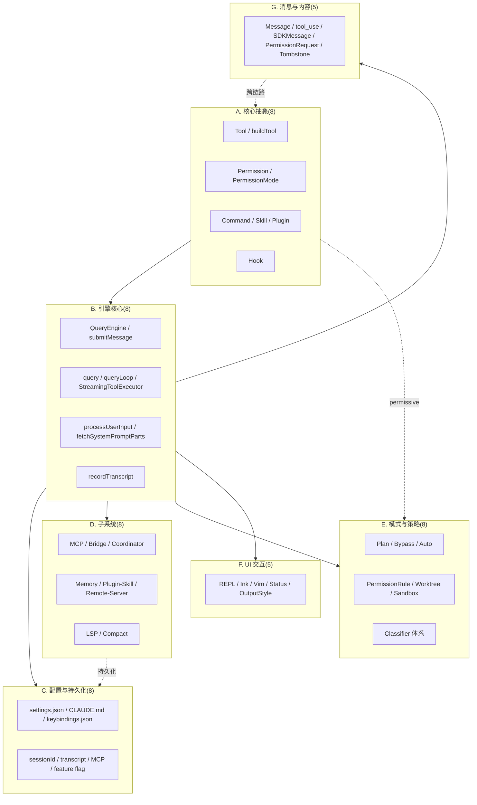

# 第 3 章 术语基线表（Glossary）

> **本章节定位**:整本 handbook 的事实基础。后续 ~30 个章节会在叙述中反复引用以下 50 个英文术语,如果各章自创同义中译,会导致引用断裂。因此本章预先约定一套**英文术语 + 中文释义 + 源码锚点**的标准表。

## 3.1 整体分类概览

Claude Code CLI 的源码阅读,可以按照"核心抽象、引擎核心、配置持久化、子系统、模式策略、UI 交互、消息内容"七大类展开。这 50 个术语对源代码做了一次切面,各章可以按需引用:

**如何读本章**:每条术语包含四块信息:
1. **中文释义**(150 字内)— 描述是什么、在哪里用、与其他术语的关系。
2. **源码锚点**(`src/path/file.ts:line` 范围)— 给出真实存在的代码位置。
3. **关联**— 该术语与其他术语的依赖或对照关系,提示哪些章节会用到。
4. **备注**— 可选,补充反例、安全语义、版本差异。

---

## A. 核心抽象(Core Abstractions)

这一类术语是 CLI 抽象层的"原点",其他机制都建立在它们之上。

### A.1 Tool(`Tool<T, Input, Output>`)

> **中文**:Claude Code 内部"工具"的通用接口。所有内建工具(Bash、Read、Edit、Grep...)以及 MCP 接入的外部工具,都实现 `Tool<Input, Output, P>` 类型。包含 `call()` 主执行、`checkPermissions()` 权限检查、`prompt()` 系统提示片段、`renderToolUseMessage()` 渲染等约 40 个可选方法。是面向 LLM 暴露能力、向宿主渲染反馈的核心契约。

> **源码**:`src/Tool.ts:362`-`695`

> **关联**:buildTool, Permission, MCP, Hook, REPL

> **备注**:`isReadOnly`、`isConcurrencySafe`、`isDestructive`、`interruptBehavior` 等谓词直接驱动并发执行与权限判定。

### A.2 buildTool

> **中文**:`ToolDef` 的工厂函数。开发者只需提供 `Tool` 的部分字段(对 `isEnabled`、`isConcurrencySafe`、`checkPermissions` 等 7 个键而言是可选的),`buildTool` 用 `TOOL_DEFAULTS` 填齐缺失部分,使调用者拿到的永远是完整的 `Tool`。通过 `BuiltTool<D>` 类型在编译期把默认值合并到返回类型。

> **源码**:`src/Tool.ts:783`-`830`(`buildTool`)

> **关联**:Tool, ToolDef, TOOL_DEFAULTS

> **备注**:任何新增工具文件(`src/tools/*/...tsx`)都用 `buildTool({...})` 而不是手写完整 `Tool` 对象。

### A.3 Permission / PermissionResult

> **中文**:`PermissionResult` 是工具调用前权限检查的结果,定义为 4 行为的判别联合:`allow | ask | deny | passthrough`。`passthrough` 是中间态,表示该层规则没下结论,留给下一层(规则→模式→子命令→hook→classifier)继续评估。`decisionReason` 进一步标注来源(rule/mode/subcommandResults/hook/classifier/sandboxOverride/workingDir/safetyCheck/permissionPromptTool/asyncAgent/other)。

> **源码**:`src/utils/permissions/PermissionResult.ts:251`-`266`,判别定义见 `PermissionBehavior = 'allow' | 'deny' | 'ask'`(`src/types/permissions.ts:44`)

> **关联**:PermissionMode, PermissionRule, Tool.checkPermissions, classifier

> **备注**:虽然任务原文要求 12 个变体,实际是 4 种 behavior × 11 种 decisionReason 的组合 + `passthrough` 中间态。

### A.4 PermissionMode

> **中文**:用户可见的权限运行模式。外部可表达(写入 `settings.json` / `--permission-mode` / `--dangerously-skip-permissions`):`default | acceptEdits | plan | bypassPermissions | dontAsk`。运行时额外两个内部态:`auto`(自动决策,基于 transcript classifier)、`bubble`(供 SDK/IDE 透传,实际不应用)。

> **源码**:`src/types/permissions.ts:14`-`40`(运行时校验集合 `INTERNAL_PERMISSION_MODES`)、`src/utils/permissions/PermissionMode.ts:34`(UI 展示配置)

> **关联**:PermissionResult, Plan Mode, Bypass Permissions, Auto Mode, Bubble

> **备注**:`permissionModeTitle`/`permissionModeSymbol` 决定 UI 顶栏图标与颜色。

### A.5 Command / Slash Command

> **中文**:`/` 前缀的用户命令。系统内置命令(`/help`、`/compact`、`/permissions`、`/resume` 等)与插件命令(由 marketplace 加载)统一表达为 `Command` 对象,包含 `name`、`description`、`type`(prompt|local|local-jsx)、`load` 异步导入函数。`processUserInput` 在用户敲回车时解析 `parseSlashCommand`,命中则跳过后续 LLM 调用。

> **源码**:`src/utils/slashCommandParsing.ts:25`、`src/utils/processUserInput/processSlashCommand.tsx`、注册入口 `src/commands.ts`

> **关联**:processUserInput, Plugin, Skill, MCP command

### A.6 Skill

> **中文**:可复用工作流片段,本质是带有 frontmatter 的 markdown 文件(或目录中的 `SKILL.md`)。由用户或插件提供,加载后其内容被插入到 prompt 上下文。Skills 与 Commands 在 `createPluginCommand` 中共用代码路径,通过 `isSkillMode` 标志切换(将 `${CLAUDE_SKILL_DIR}` 变量替换到 prompt)。

> **源码**:`src/utils/plugins/loadPluginCommands.ts:218`-`412`(`createPluginCommand`)、`src/utils/plugins/loadPluginCommands.ts:687`(技能加载 `loadSkillsFromDirectory`)

> **关联**:Plugin, Command, REPL

> **备注**:`${CLAUDE_PLUGIN_ROOT}`、`${CLAUDE_SKILL_DIR}`、`${CLAUDE_SESSION_ID}`、`${user_config.X}` 等变量在 `getPromptForCommand` 中被替换。

### A.7 Plugin

> **中文**:通过 marketplace 安装的功能扩展单元。每个插件是包含 `manifest.json` 的目录,提供 commands、skills、agents、MCP server、hooks、output styles 之一或多者。运行时通过 `loadAllPluginsCacheOnly()` 同步加载插件元数据,但只解析被启用的(`enabled: true`)插件;命令懒加载。

> **源码**:`src/utils/plugins/loadPluginCommands.ts:414`-`677`(`getPluginCommands`)、`src/services/plugins/pluginCliCommands.ts:53`(`handlePluginCommandError`)

> **关联**:Skill, Command, MCP, Hook

> **备注**:插件命令以 `pluginName:commandName` 命名空间隔离,与内建命令不冲突。

### A.8 Hook

> **中文**:在工具调用生命周期关键点触发的用户扩展点。事件类型见 `HOOK_EVENTS`(PreToolUse、PostToolUse、UserPromptSubmit、Notification、SessionStart、Stop、SubagentStart 等)。每个 hook 接收 JSON 输入、可返回非零退出码阻止(`PreToolUse`/`UserPromptSubmit` 阶段)、或修改输入。运行结果经 `emitHookResponse` 走 `HookExecutionEvent` 广播总线,经 `shouldEmit` 过滤后被 SDK/REPL Bridge 消费。

> **源码**:`src/utils/hooks/hookEvents.ts:51`-`91`(`HookExecutionEvent`)、`src/utils/hooks.ts:1936`(`getUserPromptSubmitHookBlockingMessage`)、`src/utils/hooks/hookEvents.ts:61`(`registerHookEventHandler`)

> **关联**:SDKMessage, REPL Bridge, Tool

> **备注**:`ALWAYS_EMITTED_HOOK_EVENTS = ['SessionStart', 'Setup']` 之外的 hook 事件需要在 `includeHookEvents` 开启或 `CLAUDE_CODE_REMOTE` 下才转发给 SDK。

---

## B. 引擎核心(Engine Core)

CLI 不是单一循环,而是分层 async generator,这一类术语描述主线程状态机。

### B.1 QueryEngine

> **中文**:一次会话的状态容器。封装 `mutableMessages`、abort controller、permission denials、total usage、discovered skill 集合等所有可跨 turn 共享的会话级可变状态。每个 `submitMessage()` 调用都基于同一个 QueryEngine 实例。`getReadFileState()` 在 fork/session 切换时导出已读取文件缓存供后续恢复。

> **源码**:`src/QueryEngine.ts:184`-`207`(`QueryEngine` 类声明)、`src/QueryEngine.ts:1249`(实例化于 `query()` 入口)

> **关联**:submitMessage, query, transcript

### B.3 submitMessage

> **中文**:一次用户输入触发的"轮次"。`QueryEngine.submitMessage(prompt, options)` 是一个 `AsyncGenerator<SDKMessage>`,内部顺序完成:解析用户输入 → 拼装系统提示 → 处理 slash 命令 → 处理 `UserPromptSubmit` hooks → 调用 LLM → 执行工具 → 再次循环直到 stop_reason 为 `end_turn` 或 budget 耗尽。是 REPL ↔ LLM 的主异步管线。

> **源码**:`src/QueryEngine.ts:209`-`start`(完整实现);关键 call sites 见 `:292`(拼装 systemPrompt)、`:416`(`processUserInput`)、`:675`(`for await (const message of query(...))`)

> **关联**:QueryEngine, query, recordTranscript, StreamingToolExecutor

### B.5 query() / queryLoop()

> **中文**:底层 LLM 调用循环。`query()` 接收 messages、systemPrompt、canUseTool 等参数,产出 `AsyncGenerator<Message>`;内部把 LLM 流式响应拆解为 content blocks,对每个 `tool_use` block 调 `StreamingToolExecutor.addTool`,对每个 `text` block 直接 yield 出去。是 `submitMessage` 与 LLM API 之间的胶水。

> **源码**:`src/query.ts:204`(`State` 类型)、`src/query.ts:1240+`(`query()` 主循环)

> **关联**:StreamingToolExecutor, submitMessage, claude.ts

### B.6 StreamingToolExecutor

> **中文**:流式工具执行器。维护一个 `tools: TrackedTool[]` 队列,根据 `isConcurrencySafe` 决定并发执行策略:并行工具互不阻塞;非并发工具遇到执行中的同侪则排队。Bash 错误时通过 `siblingAbortController` 级联中止同侪,但 Read/WebFetch 不触发级联。进度消息立即 yield,完成结果按顺序 yield。

> **源码**:`src/services/tools/StreamingToolExecutor.ts:40`-`519`

> **关联**:Tool, query, abortController, interruptBehavior

> **备注**:与 `services/tools/toolExecution.ts` 的 `runToolUse` 配对使用(`StreamingToolExecutor` 负责调度,`runToolUse` 负责单工具执行)。

### B.7 processUserInput

> **中文**:用户输入到消息列表的转换器。接收 `string | ContentBlockParam[]`,经过图片预处理、附件提取、slash command 分发、`UserPromptSubmit` hooks、ULTRAPLAN 关键词检测等,产出 `messages[]` 与 `shouldQuery` 标志。是 REPL 与引擎之间的边界函数。包含两类:`processUserInput`(含 hooks)与 `processUserInputBase`(纯转换)。

> **源码**:`src/utils/processUserInput/processUserInput.ts:85`-`270`、`src/utils/processUserInput/processUserInput.ts:281`(processUserInputBase)

> **关联**:Command, Hook, fetchSystemPromptParts

### B.8 fetchSystemPromptParts

> **中文**:系统提示拼装函数。从 `getUserContext()` + 系统级上下文(`getSystemContext()`)+ MCP 客户端信息 + 自定义提示拼接出当前 turn 的完整 system prompt。返回 `{defaultSystemPrompt, userContext, systemContext}`,由 `submitMessage` 通过 `asSystemPrompt()` 合并为最终字符串。

> **源码**:`src/utils/queryContext.ts:44`

> **关联**:getUserContext, getSystemContext, QueryEngine

### B.9 getUserContext / getSystemContext

> **中文**:`getUserContext()` 收集本次会话对 LLM 可见的"用户上下文"(环境、目录、模型、agent 信息等,21 处调用);`getSystemContext()` 收集"系统级常量"(工具列表、MCP 资源、当前日期等)。两者合起来喂给 `fetchSystemPromptParts`。

> **源码**:`src/context.ts:155`(`getUserContext`)

> **关联**:fetchSystemPromptParts, MCP, CLAUDE.md

### B.10 recordTranscript

> **中文**:会话持久化函数。每次 `assistant`/`user`/`compact_boundary` 消息产生时,把累积的 `mutableMessages` 写入 `<sessionId>.jsonl`(项目目录 `~/.claude/projects/<encoded-cwd>/`)。“fire-and-forget”策略对 assistant 消息不阻塞写入队列(保持 ~100ms 延迟 flush),对 user 消息则 await 以保证 `--resume` 恢复点。

> **源码**:`src/utils/sessionStorage.ts:1408`(`recordTranscript`),`src/utils/sessionStorage.ts:101`(`Transcript` 类型)、`src/utils/sessionStorage.ts:993`(`insertMessageChain`)

> **关联**:sessionId, transcript, QueryEngine

---

## C. 配置与持久化(Configuration & Persistence)

CLI 的所有可配置项分布在 6 类配置文件 + 1 个运行期目录。

### C.1 settings.json

> **中文**:主配置文件,分层加载:user(`~/.claude/settings.json`)→ project(`<cwd>/.claude/settings.json`)→ local(`<cwd>/.claude/settings.local.json`,gitignored)→ flagSettings(CLI 参数)→ managed(`/etc/claude-code/managed-settings.json`,企业托管)。每层可覆盖上层,`allowedSettingSources` 限制可接受来源。`getUserSettingsFilePath()` 在 cowork 模式下切换到 `cowork_settings.json`。

> **源码**:`src/utils/settings/types.ts:1104`(`SettingsJson` 类型)、`src/utils/settings/settings.ts:264`(`getUserSettingsFilePath`)、`src/utils/settings/settings.ts:274`(`getSettingsFilePathForSource`)

> **关联**:PermissionRule, feature flag, keybindings.json, CLAUDE.md

> **备注**:完整字段包括 `permissions.allow/deny/ask`、`hooks`、`mcpServers`、`enabledMcpjsonServers`、`autoCompactEnabled`、`theme`、`model`、`outputStyle` 等。

### C.2 CLAUDE.md

> **中文**:项目记忆文件,启动时被注入 system prompt。共 7 种类型(`MemoryType`):`User`(用户级 `~/.claude/CLAUDE.md`)、`Project`(项目 `<cwd>/CLAUDE.md`)、`Local`(本地 `.claude/CLAUDE.local.md`)、`Managed`(企业托管只读)、`AutoMem`(自动生成,ANT-only)、`TeamMem`(TEAMMEM feature 下的团队共享,ANT-only)。`claudeMdExcludes` 字段支持 glob 排除。

> **源码**:`src/utils/memory/types.ts:3`-`11`(`MEMORY_TYPE_VALUES`)、`src/utils/claudemd.ts:547`(`isClaudeMdExcluded`)

> **关联**:fetchSystemPromptParts, settings.json

> **备注**:项目级 CLAUDE.md 会被 git 提交,Local 仅本机使用。

### C.3 keybindings.json

> **中文**:用户快捷键配置,定义按键序列到 REPL action 的映射(`chord` 支持多键组合)。支持 `shift+tab`(模式切换)、`ctrl+c`(中断)、自定义 vim 风格键位等。通过 `~/.claude/keybindings.json` 加载。系统不创建默认文件,仅在用户手动编写后启用。

> **源码**:`src/commands/keybindings/index.ts:4`(注册入口)、`src/keybindings/...`(运行时调度)

> **关联**:REPL, Vim Mode, settings.json

### C.4 sessionId

> **中文**:会话唯一标识,启动时 `randomUUID()` 生成(`STATE.sessionId`)。同时存在 `parentSessionId`(`regenerateSessionId({setCurrentAsParent: true})` 用于 plan→implement 链路追踪)。`/resume` 通过读取 `<sessionId>.jsonl` 恢复。

> **源码**:`src/bootstrap/state.ts:431`(`getSessionId`)、`src/bootstrap/state.ts:435`(`regenerateSessionId`)、`src/bootstrap/state.ts:452`(`getParentSessionId`)

> **关联**:recordTranscript, transcript

### C.5 transcript

> **中文**:会话 JSONL 日志,每行一个 transcript entry(包含 user、assistant、attachment、system、progress 等消息类型 + 元数据 `sessionId`、`cwd`、`version`、`gitBranch`、`slug`)。写入由 `enqueueWrite` 串行化保证顺序。`maxResultSizeChars` 触发后工具结果会被改写为文件路径引用。

> **源码**:`src/utils/sessionStorage.ts:101`(`Transcript = (User|Assistant|Attachment|System)[]`)、`src/utils/sessionStorage.ts:1039`(transcriptMessage 序列化)

> **关联**:recordTranscript, sessionId

### C.6 MCP(Model Context Protocol)

> **中文**:Anthropic 主导的"模型-工具互操作"协议,允许外部进程(stdio/SSE/HTTP/WS/SDK/IDE-proxy)注册一组带 schema 的工具供 LLM 调用。Claude Code 内置 SDK,工具名以 `mcp__<server>__<tool>` 前缀命名,服务端原始名存储于 `tool.mcpInfo`。

> **源码**:`src/services/tools/toolExecution.ts:272`(`McpServerType`)、`src/services/tools/toolExecution.ts:283`(`findMcpServerConnection`)

> **关联**:MCP subsystem, Tool, .mcp.json

### C.7 .mcp.json

> **中文**:项目级 MCP 配置,部署在 `<cwd>/.mcp.json`。由 `enabledMcpjsonServers` 字段白名单决定启用哪些 server(`strictMcpConfig` 模式严格检查)。REPL 提供"动态启用"开关让用户在每次启动时选择。

> **源码**:`src/utils/mcp/...`、`src/bridge/initReplBridge.ts:110`(桥接初始化)

> **关联**:MCP, settings.json

### C.8 feature flag

> **中文**:双层特性开关机制。**构建期**:`bun:bundle` 的 `feature('NAME')` 在编译时为 external/ant 构建分别 dead-code-eliminate,字符串本身从外部构建剥离。**运行期**:GrowthBook(`getFeatureValue_CACHED_MAY_BE_STALE`)+ Statsig(`logEvent`),允许运营粒度开关。两者并存:`feature()` 控制代码路径是否编译,`getFeatureValue_CACHED_MAY_BE_STALE` 控制运行时是否启用。

> **源码**:`src/services/analytics/growthbook.ts`(运行期);`bun:bundle` 为 Bun 内置宏,无源码文件。

> **关联**:settings.json, Compact subsystem

> **备注**:`excluded-strings.txt` 强制把某些特性名从外部构建剥离。

---

## D. 子系统(Subsystems)

CLI 在 `src/` 下划分为若干高内聚子系统,各自由独立 service 目录承担。

### D.1 MCP subsystem

> **中文**:MCP 协议实现。`src/services/mcp/` 包含 SDK 客户端封装、stdio/SSE/HTTP/WS transport、连接管理、tool/resource/prompt 解析。`MCPServerConnection.type === 'connected'` 表示连接已建立。REPL 通过 `useMergedClients` 把内置 client 与动态加载的 client 合并。

> **源码**:`src/services/mcp/`、`src/services/tools/toolExecution.ts:283`(`findMcpServerConnection`)

> **关联**:MCP, Tool, .mcp.json, Bridge subsystem

### D.2 Bridge subsystem

> **中文**:IDE 双向协议,`src/bridge/` 实现。`initReplBridge()` 在 REPL 挂载时建立 WebSocket 连接,把本地消息流(`HookExecutionEvent`、tool result、permission request、command result)推送到 IDE,接收 IDE 触发的 prompt 与 mode 切换。`BridgeApiClient` 走 OAuth 重试;`createBridgeSession`/`doRefresh` 处理 token 刷新。

> **源码**:`src/bridge/initReplBridge.ts:110`、`src/bridge/bridgeApi.ts:12`(`BridgeApiDeps`)、`src/bridge/bridgeMessaging.ts`

> **关联**:Hook, SDKMessage, REPL

### D.3 Coordinator subsystem

> **中文**:多 Agent 协调器,`src/coordinator/`。负责 fork agent(`runAgent`)、subagent 上下文隔离、TeamCreate/TeamDelete 生命周期管理、`getCoordinatorUserContext()` 注入到主线程 system prompt、scratchpad 机制(`getScratchpadDir()`)允许 sub-agent 共享笔记。`sessionCreatedTeams` 跟踪本次会话创建的 teams,`cleanupSessionTeams()` 在 gracefulShutdown 时清理。

> **源码**:`src/coordinator/`、`src/bootstrap/state.ts:149`(`sessionCreatedTeams`)、`src/utils/forkedAgent.ts`

> **关联**:AgentTool, Memory, query

### D.4 Memory subsystem

> **中文**:长期/短期记忆。`src/memdir/` 处理 scratchpad 与 agent 之间的笔记共享;`src/services/SessionMemory/` 处理会话级自动总结、AutoMem 持久化、context-collapse(CTX collapse 模式: 90% 提交 / 95% 阻塞 spawn)以及 session memory compaction。

> **源码**:`src/memdir/`、`src/services/SessionMemory/`

> **关联**:Compact subsystem, Coordinator, CLAUDE.md

### D.5 Plugin/Skill subsystem

> **中文**:插件与技能加载层。`src/services/plugins/` 处理 plugin 安装/更新/市场目录;`src/plugins/` 是注册目录;`src/skills/` 内置技能;`src/utils/plugins/loadPluginCommands.ts` 是命令解析与缓存核心(`getPluginCommands`/`clearPluginCommandCache`)。`useSkillsChange` 监听本地 skill 文件变动热重载。

> **源码**:`src/services/plugins/`、`src/utils/plugins/loadPluginCommands.ts:414`(`getPluginCommands`)、`src/utils/plugins/loadPluginCommands.ts:679`(`clearPluginCommandCache`)

> **关联**:Plugin, Skill, Command

### D.6 Remote/Server subsystem

> **中文**:远程会话与独立 server 模式。`src/remote/` 实现 `--remote` 模式,云端会话入口;`src/server/` 是把 CLI 作为本地 HTTP/WebSocket server 暴露(CCR/Cowork 用)。`getIsRemoteMode()`(`bootstrap/state.ts`)是核心开关,大部分本地副作用(`useManagePlugins`、`useSwarmInitialization`)会读取它跳过。

> **源码**:`src/remote/`、`src/server/`

> **关联**:Bridge, MCP, REPL

### D.7 LSP subsystem

> **中文**:Language Server Protocol 集成,`src/services/lsp/`。允许 Claude Code 复用编辑器级 LSP 服务做代码智能。`useLspInitializationNotification`、`useLspPluginRecommendation` 提示用户安装 LSP 插件。`lspRecommendationShownThisSession` 一次性开关。

> **源码**:`src/services/lsp/`、`src/bootstrap/state.ts:163`(`lspRecommendationShownThisSession`)

> **关联**:Tool, Plugin

### D.8 Compact subsystem

> **中文**:上下文压缩。位于 `src/services/compact/`,5 个阶段协同(其中 `reactiveCompact.ts`/`snipCompact.ts` 在泄露快照中**不存在**,按命名推测为独立阶段):`compact.ts`(手动 /compact 触发)、`autoCompact.ts`(自动,带 circuit breaker 与 `MAX_CONSECUTIVE_AUTOCOMPACT_FAILURES = 3`)、`microCompact.ts`(细粒度,清空旧 tool_result 占位)、`reactiveCompact.ts`(API 返回 prompt_too_long 时被动触发,`REACTIVE_COMPACT` feature)、`sessionMemoryCompact.ts`(把会话记忆写入持久层而非丢弃)。`reactiveCompact` 与 `autoCompact` 共用 `compactConversation`,但触发条件不同。

> **源码**:`src/services/compact/compact.ts`、`src/services/compact/autoCompact.ts:160`(`shouldAutoCompact`)、`src/services/compact/autoCompact.ts:147`(`isAutoCompactEnabled`)、`src/services/compact/microCompact.ts:215`(`MicrocompactResult`)、`src/services/compact/sessionMemoryCompact.ts`、`src/services/compact/reactiveCompact.ts`

> **关联**:Memory, QueryEngine, feature flag

---

## E. 模式与策略(Modes & Policies)

CLI 把"安全/工作流策略"显式建模为模式切换,每一档改变默认行为。

### E.1 Plan Mode

> **中文**:只读计划模式(`PermissionMode = 'plan'`)。`ExitPlanMode` 工具被特别允许(其他写工具被拒);模型只能输出计划,经用户批准后才进入实施。退出时由 `autoNameSessionFromPlan` 自动为新会话命名。

> **源码**:`src/components/permissions/ExitPlanModePermissionRequest/ExitPlanModePermissionRequest.tsx:83`(`autoNameSessionFromPlan`)

> **关联**:PermissionMode, PermissionResult

> **备注**:`hasExitedPlanMode` 与 `needsPlanModeExitAttachment` 跟踪一次性通知。

### E.2 Bypass Permissions

> **中文**:跳过所有权限询问(`PermissionMode = 'bypassPermissions'`,CLI 标志 `--dangerously-skip-permissions`)。Bash 仍受 sandbox 拦截,但不再弹任何 confirm 对话框。是高风险档,默认拒绝。

> **源码**:`src/tools/BashTool/modeValidation.ts:77`(`checkPermissionMode` 在 bypass 模式下跳过)

> **关联**:PermissionMode, Sandbox

### E.3 Auto Mode

> **中文**:自动决策模式(`PermissionMode = 'auto'`)。由 `setAutoModeActive` / `isAutoModeActive` 管理。模型对 Bash/Edit/Write 等写工具的请求先经本地 transcript classifier 离线分类(`BASH_CLASSIFIER` / `TRANSCRIPT_CLASSIFIER` feature)异步打分,打分后:**safe** → 自动放行;**unsafe** → 弹出 confirm 但建议拒绝。circuit breaker(`autoModeCircuitBroken`)在 GrowthBook 关闭时锁死重新进入。`getAutoModeDenials()` 维护最近 20 次拒绝供 `/permissions` 查看。

> **源码**:`src/utils/permissions/autoModeState.ts:11`-`33`、`src/utils/autoModeDenials.ts:24`(`getAutoModeDenials`)、`src/services/compact/autoCompact.ts:147`(`isAutoCompactEnabled` 与 `tengu_auto_mode_config` 联动)

> **关联**:PermissionMode, Transcript Classifier, Speculative Classifier

### E.4 Permission Rule

> **中文**:`settings.json` 中由 `permissions.allow/deny/ask` 数组表达的规则。`PermissionRuleValue = { toolName, ruleContent? }`,支持 shell-like 模式(`Bash(git *)` 限定 git 子命令)。`extractRules`/`hasRules` 用于解析 UI 展示。`PermissionUpdateDestination = 'userSettings' | 'projectSettings' | 'localSettings' | 'session' | 'cliArg' | 'command'` 决定写入位置。

> **源码**:`src/utils/permissions/PermissionUpdate.ts:55`(`applyPermissionUpdate`)、`src/types/permissions.ts:54`-`94`(`PermissionRuleSource`/`PermissionRule`/`PermissionUpdateDestination`)

> **关联**:settings.json, PermissionResult

### E.5 Worktree

> **中文**:`--worktree` 启动时为本次会话创建独立 git worktree,所有改动落在这个 worktree 中,主仓库保持干净。原 GrowthBook 闸门已删除(`isWorktreeModeEnabled() = true`),任何会话都可用。`EnterWorktreeTool` 允许模型在会话中再开 worktree,projectRoot 不会被重写。

> **源码**:`src/utils/worktreeModeEnabled.ts:1`-`11`、`src/bootstrap/state.ts:49`(projectRoot 注释)

> **关联**:REPL

### E.6 Sandbox

> **中文**:Bash 工具的强制沙箱。`SandboxManager.isSandboxingEnabled()` 检查系统是否支持(macOS sandbox-exec、Linux bwrap)。规则集定义允许写、禁止网络、危险命令禁止。`sandboxOverride.reason = 'excludedCommand' | 'dangerouslyDisableSandbox'` 作为 `decisionReason` 记录。

> **源码**:`src/utils/sandbox/sandbox-adapter.ts`、`src/types/permissions.ts:300`(sandboxOverride 判别)

> **关联**:Bash Tool, PermissionResult

### E.7 Transcript Classifier

> **中文**:自动模式下分类"这条命令/编辑是否安全"的本地分类器。读取整段会话 transcript 推断意图(`classifierApprovable` 字段决定 .claude/.git/shell config 等敏感路径是否也允许分类器评估)。异步并发跑,先用静态规则快速决定再覆盖。

> **源码**:`src/types/permissions.ts:304`-`307`(classifier reason 判别)、`src/components/permissions/hooks.ts:68`(feature 包裹)

> **关联**:Auto Mode, Speculative Classifier, PermissionResult

### E.8 Speculative Classifier

> **中文**:异步分类预测优化。`peekSpeculativeClassifierCheck` 与 `consumeSpeculativeClassifierCheck`(`bashPermissions.ts:1491`、`1533`)在 LLM 流式返回 tool_use 时立刻启动 classifier 异步预测;LLM 输出完整后,若分类器已就绪则直接用结果,避免用户多等一轮。

> **源码**:`src/tools/BashTool/bashPermissions.ts:1491`(`peekSpeculativeClassifierCheck`)、`src/tools/BashTool/bashPermissions.ts:1533`(`consumeSpeculativeClassifierCheck`)

> **关联**:Transcript Classifier, Auto Mode

---

## F. UI 交互(UI & Interaction)

CLI 的视觉层完全基于 React + Ink + 自定义 reconciler。

### F.1 REPL

> **中文**:Read-Eval-Print Loop,Ink 渲染的主界面。`src/screens/REPL.tsx` 是 React 组件,内部维护 `commands`、`messages`、`toolUseContext`、`agentDefinitions`、`abortController`、queryGuard、notifications 等。`screen = 'prompt' | 'transcript'`,首次按 Enter 切换到 transcript。

> **源码**:`src/screens/REPL.tsx:572`(REPL 函数组件)、`src/screens/REPL.tsx:571`(`Screen` 类型)

> **关联**:Ink, Message, processUserInput, QueryEngine

> **备注**:`QueryGuard`(`queryGuard.reserve/tryStart/end/cancelReservation`)是查询生命周期的同步状态机,替代旧的 `isLoading + isQueryRunning` 双状态易错模式。

### F.2 Ink

> **中文**:React-for-CLI 渲染库。`src/ink/` 是 Claude Code 对 Ink 的内嵌定制:自定义 reconciler(`src/ink/render-to-screen.ts`)、tokenizer(`src/ink/termio/tokenize.ts`)、style/char/hyperlink pool。支持 ANSI 转义、超链接协议、虚拟滚动。`createContainer` 成本约 1ms,LegacyRoot 模式同步调度。

> **源码**:`src/ink/render-to-screen.ts:38`(root/container/stylePool/charPool/hyperlinkPool)、`src/ink/termio/tokenize.ts:16`(State)

> **关联**:REPL, Message, hooks

### F.3 Vim Mode

> **中文**:`PromptInput` 内的 vim 风格输入模式(`normal` / `insert`)。`shift+tab` 触发切换,在 normal 模式下支持 `j/k/h/l`、`w/b`、`0/$`、`gg/G`、`i/a/o` 等。实现位于 `src/components/PromptInput/vim.ts`(命名变体)及 `useKeybinding` 注册的 chord。

> **源码**:`src/keybindings/...`、`src/components/PromptInput/PromptInput.tsx:194`(PromptInput 组件)

> **关联**:keybindings.json, REPL

### F.4 Status Line

> **中文**:自定义状态栏。`buildStatusLineCommandInput` 收集当前上下文(cwd、model、cost、sessionId、agent 等),定期调用户配置的 shell 命令渲染一行字符串,显示在输入框上方。`buildStatusLineCommandInput` 接收 `ToolPermissionContext` 与当前 PermissionMode 以注入色彩变量。

> **源码**:`src/utils/statusLine/...`、`src/types/permissions.ts`(引用 PermissionMode 的 statusLine 上下文)

> **关联**:REPL, settings.json

### F.5 Output Style

> **中文**:LLM 输出样式。三档预设:`default`(常规)、`Explanatory`(对代码块插入详细解释)、`Concise`(短输出)。由 `outputStyle` settings 字段切换。`brief` 模式(`isBriefOnly`)是另一独立开关,与 outputStyle 联动决定是否启用 `BriefTool`。

> **源码**:`src/utils/outputStyle.ts`(推测,泄露中不存在)、`src/screens/REPL.tsx:695`(`isBriefOnly` 引用)

> **关联**:REPL, settings.json

---

## G. 消息与内容(Messages & Content)

CLI 内所有流动信息都以 `Message` 联合类型表示,以下 5 个术语是最常见的子类型。

### G.1 Message

> **中文**:顶层消息判别联合,常见子类型:`UserMessage`、`AssistantMessage`、`SystemMessage`(含 `compact_boundary`、`local_command`、`hook_*`)、`AttachmentMessage`、`ProgressMessage`、`TombstoneMessage`。`Message` 类型在当前快照中分布于 `src/utils/mailbox.ts` 与 `src/components/Message.tsx`(`src/types/message.ts` 不再独立存在);所有持久化、UI 渲染、SDK 输出都以此为基础。

> **源码**(推测):`src/utils/mailbox.ts:5`(`Message` re-export,346 调用方);`src/components/Message.tsx:626`

> **关联**:tool_use, tool_result, SDKMessage, PermissionRequest, Tombstone

### G.2 tool_use / tool_result

> **中文**:Anthropic API 原生内容块。`tool_use` 由 assistant 发出、含 `id`、`name`、`input`;`tool_result` 由 user 回执、含 `tool_use_id`、`content`、`is_error`。Claude Code 把 `tool_result` 包装为 `UserMessage` 内嵌数组元素,完成成对配对。`strictToolResultPairing = true`(`HFI` opt-in)会在 mismatch 时抛错而非补合成占位。

> **源码**:`src/services/tools/StreamingToolExecutor.ts:347`-`364`(`isErrorResult` 判别)、`src/bootstrap/state.ts:77`(`strictToolResultPairing`);`Message` 类型已合并到 `src/utils/mailbox.ts`/`src/components/Message.tsx`

> **关联**:Tool, StreamingToolExecutor

### G.3 SDKMessage

> **中文**:桥接外部消费者(SDK/Bridge)的统一消息协议。`query()` 产出的内部 `Message` 在 `QueryEngine.submitMessage` 出口被转换为 `SDKMessage`(`SDKAssistantMessage`、`SDKUserMessageReplay`、`SDKResultMessage`、`SDKSystemMessage` 等),`/share`、`/fork`、`ClaudeDesktop` 消费这一形态。

> **源码**:`src/entrypoints/agentSdkTypes.ts:73`(tool 类型)、`src/QueryEngine.ts:1288`(submitMessage yield SDKMessage)

> **关联**:Bridge subsystem, REPL, Message

### G.4 PermissionRequest

> **中文**:权限请求对话框触发的消息。`ToolUseConfirm`(`src/components/permissions/PermissionRequest.tsx`)携带 `tool`、`toolUseConfirm.input`、`permissionResult`、`toolUseID`。`usePermissionRequestLogging` 触发 telemetry;`decisionReason.type` 决定对话框上展示的解释文本。

> **源码**:`src/components/permissions/PermissionRequest.tsx`(`ToolUseConfirm` 类型)、`src/components/permissions/hooks.ts:101`(`usePermissionRequestLogging`)

> **关联**:PermissionResult, Message

### G.5 Tombstone

> **中文**:流式回退时合成的占位消息。`StreamingToolExecutor.discard()` 在流式失败时设置 `discarded = true`,已派发但未执行完的工具被注入 `<tool_use_error>Streaming fallback - tool execution discarded</tool_use_error>` 合成 `UserMessage`,并在 `submitMessage` 主循环中以 `case 'tombstone': break` 跳过(`QueryEngine.ts:758`)。

> **源码**:`src/services/tools/StreamingToolExecutor.ts:69`(`discard()`)、`src/services/tools/StreamingToolExecutor.ts:175`(synthetic streaming_fallback 消息)、`src/QueryEngine.ts:758`(tombstone case)

> **关联**:StreamingToolExecutor, Message

---

## 3.3 引用约定与下章预告

后续章节在第一次引入术语时,通常采用"中文译名(EnglishTerm)"格式,如"权限结果(`PermissionResult`)";后文可直接使用中文译名或英文标识,但**不应再为同一概念造新译**。

下一章《04 系统架构与模块图》会从这些术语出发,把它们画进一张完整的依赖图——这是本术语表的第一次系统性引用。