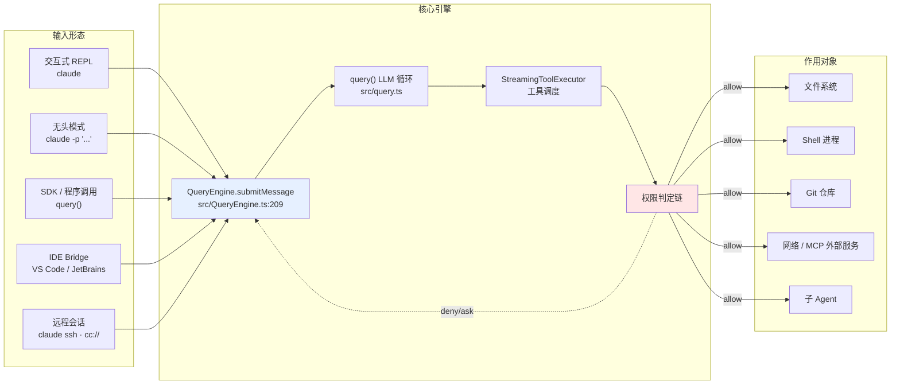
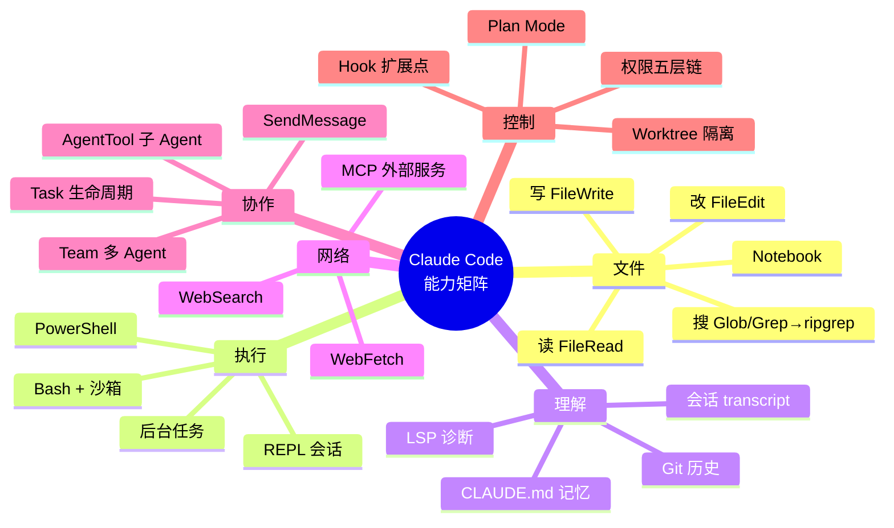

# 1. Claude Code 是什么

## 摘要

Claude Code 是 Anthropic 官方的终端 AI 编码工具:你用自然语言描述意图,它读代码、改文件、跑命令、提交 PR。与"聊天窗口里的代码助手"不同,它**直接在你的工作目录里执行动作** —— 这个差别决定了它的全部设计:约 40 个内建工具、五层权限判定、沙箱、Hook 扩展点、多 Agent 协调。本章交代它的产品定义、可执行的能力矩阵(全部来自 `src/tools.ts` 的真实注册表)、在 AI 编码工具生态中的坐标,以及一个常被忽略的问题:**哪些任务不该交给它**。

## 速赢

- **它是"执行体"而不是"建议体"**。Copilot 建议你写什么,Claude Code 直接把文件改了。所有复杂度都源于此。
- **能力边界写在 `src/tools.ts` 里**,不在文档里。约 40 个工具,其中十余个受 `feature()` 或运行时条件控制,不是每个人都有。
- **两种运行形态**:交互式 REPL(`claude`)和无头模式(`claude -p`)。后者是 CI/脚本集成的入口,`--output-format stream-json` 让它可以被程序消费。
- **多 Agent 不是噱头**。`AgentTool` + `TaskCreateTool` + `TeamCreateTool` 构成一套真实的子 Agent 派发体系,主 Agent 的上下文不会被子任务污染。
- **最不适合它的场景是"你自己都说不清要什么"**。它擅长执行明确意图,不擅长替你做产品决策。

---

## 4.1 产品定义

一句话:**在终端里,把自然语言意图翻译成对代码库的实际操作,并对每个操作做权限裁决。**

拆开看是三件事:

| 组成 | 含义 | 实现位置 |
|---|---|---|
| **理解** | 读懂代码库 —— 文件内容、目录结构、git 历史、LSP 诊断、项目记忆(`CLAUDE.md`) | `src/context.ts:155`、`src/services/lsp/` |
| **执行** | 调用工具改变世界 —— 编辑文件、跑 shell、发 HTTP、创建子 Agent | `src/tools/`(42 个目录) |
| **裁决** | 每次执行前判定是否允许 —— 规则、模式、沙箱、分类器、Hook | `src/utils/permissions/`、`src/services/tools/toolExecution.ts` |

第三件事是 Claude Code 与"能调工具的聊天机器人"最本质的区别。一个能 `rm -rf` 的 Agent 必须先解决"什么时候不该 `rm -rf`",这就是为什么权限系统在源码里的体量(`src/utils/permissions/` 24 个文件 + `src/components/permissions/` 51 个文件)接近工具系统本身。

### 交互形态



五种输入形态最终都汇聚到同一个 `QueryEngine.submitMessage()`。这是一个重要的架构事实:**没有"简化版路径"** —— 无头模式和 IDE 模式走的是同一条权限链、同一套工具。差异只在 UI 层和部分默认值(例如 `--print` 会跳过工作区信任对话框,`--bare` 会关掉 Hook / LSP / 插件同步 / keychain 读取等一系列副作用,见 `src/main.tsx:976` 的选项说明)。

---

## 4.2 能力矩阵

下表来自 `src/tools/` 的实际目录与 `src/tools.ts:195-246` 的注册顺序。标注"条件"的工具不是所有用户都能看到。

### 文件操作

| 工具 | 能力 | 条件 |
|---|---|---|
| `FileReadTool` | 读文件(含图片、PDF、Jupyter notebook) | always |
| `FileEditTool` | 精确字符串替换 | always |
| `FileWriteTool` | 整文件写入/覆盖 | always |
| `NotebookEditTool` | Jupyter 单元格增删改 | always |
| `GlobTool` | 文件名模式匹配 | `hasEmbeddedSearchTools()` 为假时注册(`src/tools.ts:201`) |
| `GrepTool` | 内容搜索,底层是 ripgrep | 同上 |

> **注意 `src/tools.ts:201`**:`...(hasEmbeddedSearchTools() ? [] : [GlobTool, GrepTool])`。存在一条"内嵌搜索"路径会把这两个工具**替换**掉。这是"能力矩阵不能照抄文档"的一个具体例证。

### Shell 与执行

| 工具 | 能力 | 条件 |
|---|---|---|
| `BashTool` | 执行 shell 命令,支持后台运行、沙箱 | always |
| `PowerShellTool` | Windows PowerShell | 平台相关 |
| `REPLTool` | 交互式 REPL 会话 | 条件 |
| `SleepTool` | 等待 | 条件 |

`BashTool` 是整个工具集里最复杂的一个 —— `src/utils/bash/bashParser.ts` 有 4436 行,`src/utils/bash/ast.ts` 有 2679 行。为什么需要一个完整的 shell 语法解析器?因为权限规则 `Bash(git *)` 要求系统能**理解**命令结构,而不是做字符串前缀匹配。这是本书中"安全需求驱动实现复杂度"最典型的案例。

### 网络

| 工具 | 能力 |
|---|---|
| `WebFetchTool` | 抓取 URL,转 markdown,用小模型对内容回答 prompt |
| `WebSearchTool` | 网页搜索 |

### 任务与多 Agent

| 工具 | 能力 | 条件 |
|---|---|---|
| `AgentTool` | 派发子 Agent 执行独立任务 | always |
| `TaskCreateTool` / `TaskGetTool` / `TaskUpdateTool` / `TaskListTool` | 任务生命周期管理 | 条件(`src/tools.ts:219`) |
| `TaskStopTool` / `TaskOutputTool` | 停止 / 取结果 | always |
| `TeamCreateTool` / `TeamDeleteTool` | 多 Agent 团队 | 条件 |
| `SendMessageTool` | Agent 间通信 | 条件 |
| `TodoWriteTool` | 任务清单 | always |

### 模式与工作流

| 工具 | 能力 | 条件 |
|---|---|---|
| `EnterPlanModeTool` / `ExitPlanModeTool` | 进入/退出只读计划模式 | always |
| `EnterWorktreeTool` / `ExitWorktreeTool` | git worktree 隔离 | `isWorktreeModeEnabled()`(`src/tools.ts:225`) |
| `SkillTool` | 调用可复用工作流片段 | always |
| `AskUserQuestionTool` | 向用户提问 | always |

### 外部集成

| 工具 | 能力 |
|---|---|
| `MCPTool` | MCP 协议工具的统一包装 |
| `ListMcpResourcesTool` / `ReadMcpResourceTool` | MCP 资源访问 |
| `McpAuthTool` | MCP 服务认证 |
| `LSPTool` | 语言服务器能力(定义跳转、诊断等) |
| `ToolSearchTool` | 在工具过多时按关键词检索工具 |

`ToolSearchTool` 的存在值得单独说:当 MCP 接入大量外部工具后,把全部工具定义塞进 system prompt 会挤占上下文。于是设计了"延迟加载 + 关键词检索"机制 —— `Tool` 接口里的 `searchHint` 字段(`src/Tool.ts:378`)正是为它服务的:

```typescript
// src/Tool.ts:373-378
/**
 * One-line capability phrase used by ToolSearch for keyword matching.
 * Helps the model find this tool via keyword search when it's deferred.
 * 3–10 words, no trailing period.
 */
searchHint?: string
```

### 能力总览图



---

## 4.3 生态坐标

把 Claude Code 放进 AI 编码工具的坐标系,两个维度最能区分:**自主度**(它自己决定做多少)和**载体**(在哪里运行)。

| 工具 | 载体 | 自主度 | 上下文来源 | 能否执行命令 |
|---|---|---|---|---|
| **GitHub Copilot** | 编辑器内联 | 低 —— 补全当前光标处 | 当前文件 + 少量邻近文件 | 否 |
| **ChatGPT / Claude 网页版** | 浏览器 | 无 —— 你复制粘贴 | 你手动提供的片段 | 否(沙箱内除外) |
| **Cursor** | 编辑器(fork VS Code) | 中 —— Composer 可多文件编辑 | 索引整个仓库 | 有限(需确认) |
| **Claude Code** | **终端** | **高 —— 自主多轮循环调用工具** | 按需读取 + 记忆 + LSP + git | **是,含权限系统** |

### 三个关键差异

**1. 上下文策略:按需 vs 预索引**

Cursor 类工具倾向于**预先索引**整个仓库(向量检索)。Claude Code 走的是**按需读取**:模型决定读哪个文件,然后调 `FileReadTool`。代价是多几轮往返,收益是不需要维护索引、不会因为索引过时而给出错误答案,并且读取行为对用户完全透明(你能在 transcript 里看到它读了什么)。

这个选择也解释了为什么上下文压缩子系统如此复杂 —— 按需读取意味着上下文会持续膨胀,必须有五种压缩机制(`src/services/compact/`)来兜底。

**2. 执行权:有 vs 无**

这是**唯一真正的分水岭**。一旦工具能执行命令,你就需要:

- 权限模型(谁可以做什么)→ `src/utils/permissions/`,24 个文件
- 沙箱(即使允许了,能造成多大破坏)→ `src/utils/sandbox/`
- 审计(做了什么)→ `src/utils/sessionStorage.ts`,transcript 持久化
- 撤销(做错了怎么办)→ `--rewind-files`(`src/main.tsx:991`)

Copilot 不需要这四样中的任何一样。这就是为什么 Claude Code 的源码有 512K 行,而一个补全插件只需要几千行。

**3. 载体:终端的隐含优势**

终端不是"更简陋的编辑器",而是**已经具备完整执行环境**的地方 —— 你的 git、你的包管理器、你的测试命令、你的部署脚本、你的 SSH 配置,全都在那里。选择终端作为载体,意味着不需要为每种工具链写集成,直接复用用户已有的一切。代价是没有编辑器的可视化能力,于是有了 `src/ink/`(19,842 行)来在终端里重建一套渲染层。

### 核心价值主张

| 主张 | 兑现方式 |
|---|---|
| **端到端完成任务,而非片段建议** | 多轮 Agent 循环 + 约 40 个工具 + 子 Agent 派发 |
| **在你已有的环境里工作** | 终端载体,复用现有工具链,无需迁移 |
| **可控** | 五层权限判定 + 沙箱 + Plan Mode + Hook 拦截 |
| **可审计、可回退** | transcript JSONL 全量持久化 + `--resume` + `--rewind-files` |
| **可扩展** | MCP / Plugin / Skill / Hook 四类扩展点 |
| **可编程** | `-p` 无头模式 + `--output-format stream-json` + SDK |

---

## 4.4 适用与不适用

诚实地划边界,比罗列能力更有用。

### 适合

| 场景 | 为什么合适 |
|---|---|
| **明确意图的多文件改动** | "把所有 `foo()` 调用换成 `bar()` 并更新测试" —— 意图清晰,步骤机械,跨文件 |
| **探索陌生代码库** | 按需读取 + git 历史 + LSP,比自己 grep 快 |
| **重复性工程任务** | 补测试、写迁移脚本、批量重命名、依赖升级 |
| **可验证的 bug 修复** | 有复现步骤或失败测试时,它能循环到测试通过 |
| **CI / 自动化集成** | `-p` + `stream-json` 可被程序消费 |
| **代码理解与文档** | 读懂并解释,不需要执行权 |

### 不适合

| 场景 | 为什么不合适 | 更好的做法 |
|---|---|---|
| **你自己也说不清要什么** | 它执行意图,不产生意图。模糊需求 → 它猜 → 你不满意 → 反复 | 先把需求想清楚,或用它做**讨论**而非执行 |
| **需要产品/业务判断的决策** | 它没有你的业务上下文、用户数据、组织约束 | 自己决策,让它执行 |
| **超大规模机械重构** | 上下文有限,几百个文件的纯机械改动会不断压缩、丢失一致性 | 用 codemod / AST 工具(`jscodeshift` 等) |
| **不可验证的正确性** | 没有测试、没有类型、没有编译检查时,它的产出无法自我验证 | 先补验证手段 |
| **性能敏感的底层优化** | 需要 profile 数据和硬件知识,它拿不到 | 人主导,它辅助读代码 |
| **高风险生产操作** | 数据库迁移、生产部署、密钥轮换 —— 错误代价极高 | 让它写脚本,你自己执行 |

### 一条实用判据

> **如果你能写出这个任务的验收标准(尤其是"跑这条命令应该通过"),它大概率能做好;如果你写不出,先别交给它。**

这不是限制,而是这个工具的设计假设 —— `CLAUDE.md` 里 "Goal-Driven Execution" 那一节说的就是这件事。有明确成功判据时,它可以自己循环到完成;没有判据时,它每一轮都需要你来仲裁,反而比手写慢。

---

## 反模式

1. **"它能执行命令,所以我可以放心让它自动跑"** —— 执行权是能力,不是保证。权限系统的存在恰恰说明设计者认为需要人来把关。`bypassPermissions` 是给隔离沙箱用的,不是给日常开发用的。
2. **"工具越多越强"** —— 工具定义占用上下文。`ToolSearchTool` 和 `searchHint`(`src/Tool.ts:378`)的存在就是为了对抗工具膨胀。接入 20 个 MCP server 可能让它变笨。
3. **"它读了整个仓库"** —— 没有。它按需读取,只读它决定读的文件。你可以在 transcript 里核对。这既是优点(透明)也是限制(可能漏读关键文件)。
4. **"和 Cursor 是同类产品,选一个就行"** —— 载体不同导致适用场景不同。编辑器内的精细编辑和终端里的批量执行是互补的,很多人两个都用。
5. **"源码里有 `TeamCreateTool`,所以多 Agent 团队功能可用"** —— 该工具受条件注册控制(`src/tools.ts`)。见 `01-foundation/03-feature-flags.md`。

---

## 引用

**前置**
- `00-front/03-glossary.md` —— `Tool`、`PermissionMode`、`QueryEngine`、`MCP` 等术语定义。
- `00-front/01-leak-context.md` —— 本章能力矩阵基于泄露快照,条件注册的工具在你的版本里未必存在。
- `00-front/02-three-perspectives.md` —— 本章是用户路径的第 2 站。

**平行**
- `01-foundation/02-tech-stack.md` —— 这些能力用什么技术实现。
- `01-foundation/03-feature-flags.md` —— 表中"条件"列的开关依据。

**后继**
- `01-foundation/04-codebase-tour.md` —— 从能力到代码位置的地图。
- `02-user/` —— 命令、配置、权限的具体用法。
- `03-developer/` —— `Tool` 合约与四类扩展点。
- `04-architect/25-layered-arch.md` —— 这些能力如何被组织成五层。

**源码定位**
- `src/tools.ts:195-246` —— 工具注册表,能力矩阵的唯一事实来源
- `src/tools.ts:201` —— `hasEmbeddedSearchTools()` 条件注册,"文档≠实现"的例证
- `src/Tool.ts:362-378` —— `Tool` 接口与 `searchHint`,工具延迟加载机制
- `src/main.tsx:976` —— CLI 选项全集,`-p` / `--bare` / `--output-format` 等运行形态
- `src/QueryEngine.ts:209` —— `submitMessage()`,五种输入形态的共同汇聚点
