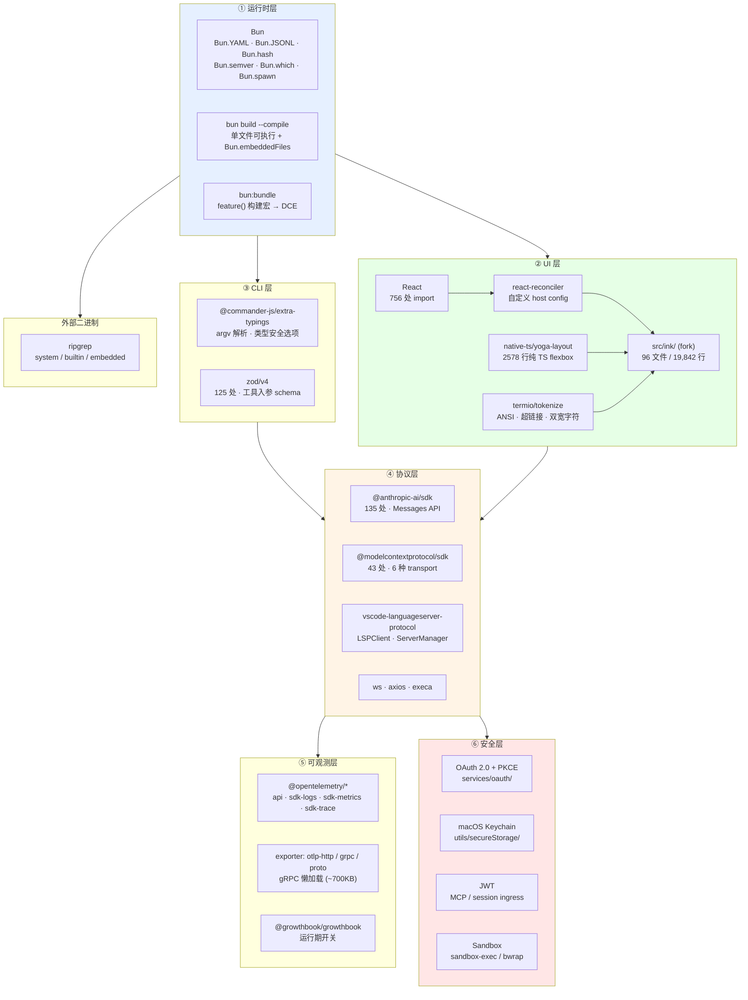

# 2. 技术栈

## 摘要

Claude Code 的技术栈有一条清晰的主线:**尽一切可能消除原生依赖与启动开销**。运行时选 Bun(编译为单文件可执行、内嵌 ripgrep 二进制),UI 用 React + 自定义 Ink 分支,连 Meta 的 yoga-layout 都被**重写成 2578 行纯 TypeScript**以摆脱 WASM/native 绑定。本章按"运行时 → UI → CLI → 协议 → 可观测 → 安全"六层拆解技术选型,每一项都给出源码锚点。需要提醒的是:泄露物中没有 `package.json`(见 `00-front/01-leak-context.md` §1.2),所有依赖**版本**均为从 import 路径推断,而非读取。

## 速赢

- **Bun 是确定的,版本是未知的**。`Bun.YAML` / `Bun.JSONL` / `Bun.embeddedFiles` 这类独占 API 排除了 Node,但没有 lockfile 就没有版本号。
- **Ink 是 fork 不是依赖**。`src/ink/` 有 96 文件 / 19,842 行,自带 reconciler、tokenizer、yoga 移植 —— 这已经是一个独立项目的规模。
- **yoga-layout 被纯 TS 重写**。`src/native-ts/yoga-layout/index.ts` 2578 行,注释里明说是"Meta flexbox 引擎的 TypeScript 移植"。动机:干掉 native/WASM 依赖。
- **Zod 用的是 `zod/v4` 子路径**。125 处 `from 'zod/v4'` vs 3 处 `from 'zod'` —— 迁移基本完成但没扫干净。
- **OpenTelemetry 的 gRPC exporter 是懒加载的**,注释直接写了原因:`@grpc/grpc-js` 约 700KB,不能进主 chunk。启动体积是这个项目的一等约束。

---

## 5.1 技术栈全景



---

## 5.2 ① 运行时:Bun

### 判定依据

`00-front/01-leak-context.md` §1.3 已给出完整证据链,这里只重述结论表:

| Bun API | 次数 | 用途 | Node 等价物 |
|---|---:|---|---|
| `Bun.hash` | 12 | 快速非加密哈希(缓存 key) | 需 `crypto` |
| `Bun.semver` | 8 | 版本比较 | 需 `semver` 包 |
| `Bun.which` | 5 | 查找可执行文件 | 无 |
| `Bun.stringWidth` | 5 | 终端字符宽度(CJK/emoji) | 需 `string-width` 包 |
| `Bun.YAML` | 2 | YAML 解析(frontmatter) | **无** |
| `Bun.JSONL` | 2 | JSONL 解析(transcript) | **无** |
| `Bun.embeddedFiles` | 2 | 编译产物内嵌资源 | **无** |
| `Bun.indexOfFirstDifference` | 1 | 字符串 diff 优化 | **无** |

后四项无法在 Node 上通过任何包获得。**结论确定**。

注意后四项的用途分布很说明问题:`Bun.YAML` 用于解析 Skill/Plugin 的 frontmatter,`Bun.JSONL` 用于读 transcript,`Bun.stringWidth` 用于终端渲染。这些都是**热路径** —— 选 Bun 的一部分动机是让这些高频操作走原生实现而不是 JS 包。

### 编译型分发

```typescript
// src/utils/bundledMode.ts:16-22
export function isInBundledMode(): boolean {
  return (
    typeof Bun !== 'undefined' &&
    Array.isArray(Bun.embeddedFiles) &&
    Bun.embeddedFiles.length > 0
  )
}
```

`Bun.embeddedFiles` 非空 ⟺ 运行在 `bun build --compile` 产出的单文件可执行里。这个判断的下游消费者之一是 ripgrep 定位逻辑(见 §5.7)。

### 构建宏 `bun:bundle`

```typescript
// src/QueryEngine.ts:1
import { feature } from 'bun:bundle'
```

`bun:bundle` 是 Bun 的虚拟模块。`feature('X')` 在打包期被求值为字面量,随后整个 `if (false) { ... }` 分支被死代码消除。**`src/utils/feature.ts` 不存在** —— 这是构建时能力,不是运行时函数。

这一机制支撑了 90 个构建期开关,以及"external 构建 / ant 内部构建"两套产物的分化。完整矩阵见 `01-foundation/03-feature-flags.md`。

---

## 5.3 ② UI:React + 自建 Ink

### React 是最重的依赖

756 处 `from 'react'`,是全码库第一。整个 TUI 是 React 组件树:`src/components/` 389 文件 / 81,546 行,`src/hooks/` 104 文件 / 19,204 行。

### `src/ink/` 是 fork,不是依赖

| 事实 | 数据 |
|---|---|
| 文件数 | 96 |
| 行数 | 19,842 |
| 是否有 `from 'ink'` 导入 | **否** —— 全部内联 |
| 依赖的上游包 | 只有 `react-reconciler`(5 处)和 `@alcalzone/ansi-tokenize`(5 处) |

内部结构:

| 模块 | 职责 |
|---|---|
| `ink/reconciler.ts` | `createReconciler()` host config —— 把 React fiber 映射到自定义 DOM 节点 |
| `ink/ink.tsx` | `FiberRoot` 管理、渲染循环 |
| `ink/dom.ts` | 虚拟 DOM 节点(`DOMElement`)与增删改 |
| `ink/layout/yoga.ts` | 布局引擎适配层 |
| `ink/termio/tokenize.ts` | ANSI 转义序列词法分析 |
| `ink/render-to-screen.ts` | 最终输出:stylePool / charPool / hyperlinkPool |
| `ink/hit-test.ts` | 鼠标坐标 → 组件命中 |
| `ink/bidi.ts` | 双向文本(阿拉伯语/希伯来语) |

`hit-test.ts` 和 `bidi.ts` 的存在说明这个 fork 走得很远 —— 上游 Ink 没有这些。

### yoga-layout 的纯 TS 移植

这是本章最值得注意的一处工程决策:

```typescript
// src/native-ts/yoga-layout/index.ts:1-8
/**
 * Pure-TypeScript port of yoga-layout (Meta's flexbox engine).
 *
 * This matches the `yoga-layout/load` API surface used by src/ink/layout/yoga.ts.
 * The upstream C++ source is ~2500 lines in CalculateLayout.cpp alone; this port
 * is a simplified single-pass flexbox implementation that covers the subset of
 * features Ink actually uses:
 */
```

**为什么值得做**:上游 `yoga-layout` 是 C++ 编译的 WASM 或 native 模块。对一个要 `bun build --compile` 成单文件、要在 macOS/Linux/Windows 三平台分发、要控制冷启动时间的 CLI 来说,native 依赖是三重麻烦:体积、跨平台构建、加载延迟。

**代价**:注释坦承是"简化的单趟 flexbox 实现",只覆盖 Ink 实际用到的子集。这是一个**明确的、有意识的取舍** —— 用功能子集换掉一整类工程复杂度。

`src/native-ts/` 下还有两处同类替换:

| 文件 | 行数 | 替代了什么 |
|---|---:|---|
| `native-ts/yoga-layout/index.ts` | 2578 | yoga-layout(C++/WASM) |
| `native-ts/color-diff/index.ts` | 999 | 颜色距离计算(通常是 native 包) |
| `native-ts/file-index/index.ts` | 370 | 文件索引 |

目录名 `native-ts` 本身就是这条策略的声明:**"本该是 native 的东西,我们用 TS 写"**。

### 其他 UI 依赖

| 包 | 次数 | 用途 |
|---|---:|---|
| `figures` | 89 | 跨平台 Unicode 符号(✔ ✖ ⚠) |
| `chalk` | 47 | 终端着色 |
| `strip-ansi` | 12 | 移除 ANSI 序列(宽度计算、日志) |
| `@alcalzone/ansi-tokenize` | 5 | ANSI 词法分析 |
| `marked` | 5 | Markdown 解析(渲染模型输出) |
| `qrcode` | 5 | 终端二维码(OAuth 设备流) |

---

## 5.4 ③ CLI 层

### Commander.js

```typescript
// src/main.tsx:22
import { Command as CommanderCommand, InvalidArgumentError, Option } from '@commander-js/extra-typings';
```

用的是 `extra-typings` 变体 —— 它让 `.option()` 的返回类型携带已声明选项的信息,`program.opts()` 因此是精确类型而非 `Record<string, any>`。代价是长链式调用,`src/main.tsx:968-991` 那段是全书最长的单行表达式之一。

`src/main.tsx:888` 有一条注释记录了这个选择的摩擦:

> `Commander supports compareOptions at runtime but @commander-js/extra-typings ...`

—— 类型层没跟上运行时能力,需要绕。这是"过度类型化"的典型代价。

### Zod v4

| 导入形式 | 次数 |
|---|---:|
| `from 'zod/v4'` | 125 |
| `from 'zod'` | 3 |

`zod/v4` 是 Zod 4 提供的子路径导出。97.7% 已迁移,3 处残留。

Zod 在这里承担两个职责:

1. **工具入参 schema** —— `Tool.inputSchema` 是 `z.ZodType`,`call()` 的第一个参数类型是 `z.infer<Input>`:

```typescript
// src/Tool.ts:379-394
call(
  args: z.infer<Input>,
  context: ToolUseContext,
  ...
): Promise<ToolResult<Output>>
...
readonly inputSchema: Input
// Type for MCP tools that can specify their input schema directly in JSON Schema format
// rather than converting from Zod schema
readonly inputJSONSchema?: ToolInputJSONSchema
```

注意 `inputJSONSchema` 这个逃生舱:MCP 工具的 schema 来自外部服务器,已经是 JSON Schema 格式,强行转成 Zod 再转回去是无谓损耗。于是合约允许两条路径 —— **这是"内建工具与外部工具统一到同一接口"时必须付的一笔税**。

2. **配置校验** —— `settings.json`、`manifest.json`、MCP 配置的运行时解析。

---

## 5.5 ④ 协议层

### Anthropic SDK(135 处)

```typescript
// src/services/api/claude.ts:19-21
} from '@anthropic-ai/sdk/resources/beta/messages/messages.mjs'
import type { TextBlockParam } from '@anthropic-ai/sdk/resources/index.mjs'
import type { Stream } from '@anthropic-ai/sdk/streaming.mjs'
```

用的是 **beta messages** 端点。`src/services/api/claude.ts` 3419 行,处理流式解析、重试、错误归一化、多 provider(Anthropic / Bedrock / Vertex / Foundry)。

### MCP SDK(43 处)

`src/services/mcp/` 23 个文件。transport 实现:

| 文件 | transport |
|---|---|
| `InProcessTransport.ts` | 进程内(内建 MCP server) |
| `SdkControlTransport.ts` | SDK 控制通道 |
| `vscodeSdkMcp.ts` | VS Code IDE 代理 |
| `client.ts`(3348 行) | stdio / SSE / HTTP / WebSocket 通用客户端 |

配套设施:`auth.ts`(OAuth)、`oauthPort.ts`、`elicitationHandler.ts`(服务端向用户索取输入)、`channelPermissions.ts`、`envExpansion.ts`(配置里的环境变量展开)、`officialRegistry.ts`(官方 server 目录)。

MCP 工具在权限系统里不走捷径 —— 工具名以 `mcp__<server>__<tool>` 命名空间隔离,`findMcpServerConnection`(`src/services/tools/toolExecution.ts:283`)负责路由。

### LSP

`vscode-languageserver-protocol`(3 处)。`src/services/lsp/` 7 个文件:

| 文件 | 职责 |
|---|---|
| `LSPClient.ts` | 协议客户端 |
| `LSPServerManager.ts` / `LSPServerInstance.ts` | 语言服务器进程生命周期 |
| `LSPDiagnosticRegistry.ts` | 诊断信息聚合 |
| `passiveFeedback.ts` | 被动诊断注入(改完文件后自动带上编译错误) |

`passiveFeedback.ts` 是这个子系统的价值所在:模型改完代码,LSP 的错误被自动附加到下一轮上下文,形成"改 → 编译反馈 → 修"的闭环,不需要模型自己想起来跑 `tsc`。

### 网络与进程

| 包 | 次数 | 用途 |
|---|---:|---|
| `axios` | 57 | HTTP 客户端 |
| `execa` | 16 | 子进程(比 `child_process` 友好) |
| `ws` | 3 | WebSocket(Bridge / MCP) |
| `shell-quote` | 3 | shell 参数转义 |
| `chokidar` | 5 | 文件监听(Skill/Plugin 热重载) |

---

## 5.6 ⑤ 可观测层

### OpenTelemetry

| 包 | 次数 |
|---|---:|
| `@opentelemetry/api` | 11 |
| `@opentelemetry/sdk-logs` | 4 |
| `@opentelemetry/sdk-metrics` | 3 |
| `@opentelemetry/api-logs` | 3 |
| `@opentelemetry/sdk-trace-base` | 2 |
| `@opentelemetry/exporter-trace-otlp-http` | 2 |
| `@opentelemetry/exporter-logs-otlp-http` | 2 |
| `@opentelemetry/semantic-conventions` | 2 |
| `@opentelemetry/resources` / `core` | 2 / 2 |

`src/utils/telemetry/` 9 个文件。exporter 支持三种传输,**gRPC 是懒加载的**:

```typescript
// src/utils/telemetry/instrumentation.ts:166-170
case 'grpc': {
  // Lazy-import to keep @grpc/grpc-js (~700KB) out of the telemetry chunk
  ... await import(
    '@opentelemetry/exporter-metrics-otlp-grpc'
  )
```

这条注释是理解整个技术栈的一把钥匙:**700KB 被认为是不可接受的常驻体积**。同样的思路解释了 yoga 移植、`bun build --compile`、以及 `feature()` 的激进 DCE —— 启动体积和冷启动时间是这个项目的一等约束,不是事后优化。

`src/utils/telemetry/` 还有 `perfettoTracing.ts`(Chrome trace 格式)和 `bigqueryExporter.ts`,以及 `src/main.tsx:586` 的 `profileCheckpoint('main_function_start')` —— 启动路径上散布着大量检查点,说明冷启动性能是被持续测量的。

### GrowthBook(运行期开关)

```typescript
// src/services/analytics/growthbook.ts:1
import { GrowthBook } from '@growthbook/growthbook'
```

`src/services/analytics/` 9 个文件,含 `datadog.ts`、`firstPartyEventLogger.ts`、`sink.ts`、`sinkKillswitch.ts`。

**与 `bun:bundle` 的分工**:

| | 构建期 `feature()` | 运行期 GrowthBook |
|---|---|---|
| 决定时机 | 打包时 | 每次启动/查询时 |
| 关掉的后果 | 代码不存在(DCE) | 代码存在但不执行 |
| 能否运营调整 | 否,需重新发版 | 是 |
| 数量 | 90 | 98 |

两层是**串联**的:`feature('X')` 关掉时,GrowthBook 里的同名开关毫无意义,因为代码已经被剥离。详见 `01-foundation/03-feature-flags.md`。

---

## 5.7 ⑥ 安全层

### OAuth 2.0

`src/services/oauth/` 5 个文件:

| 文件 | 职责 |
|---|---|
| `client.ts` | OAuth 客户端 |
| `auth-code-listener.ts` | 本地回调监听(授权码流) |
| `crypto.ts` | PKCE code verifier / challenge |
| `getOauthProfile.ts` | 用户档案获取 |

配合 `qrcode`(5 处)支持无浏览器环境的设备流。

### macOS Keychain

`src/utils/secureStorage/` 6 个文件:

| 文件 | 职责 |
|---|---|
| `macOsKeychainStorage.ts` / `macOsKeychainHelpers.ts` | Keychain 读写 |
| `keychainPrefetch.ts` | **预取** —— Keychain 访问有延迟,启动时提前发起 |
| `fallbackStorage.ts` / `plainTextStorage.ts` | 非 macOS 或 Keychain 不可用时的降级 |

`keychainPrefetch.ts` 又是一处启动性能优化。而 `--bare` 模式(`src/main.tsx:976`)明确列出"skip ... keychain reads"作为提速手段之一。

### JWT

用于 MCP 认证(`services/mcp/auth.ts`、`xaa.ts`、`xaaIdpLogin.ts`)和会话入口认证(`utils/sessionIngressAuth.ts`)。

### 沙箱

`src/utils/sandbox/sandbox-adapter.ts` —— macOS `sandbox-exec`、Linux `bwrap`。与权限系统职责分离:权限决定**是否允许**,沙箱限制**允许之后能造成多大破坏**。

---

## 5.8 外部二进制:ripgrep

`src/utils/ripgrep.ts` 定义了三种定位模式:

```typescript
// src/utils/ripgrep.ts:24-29
type RipgrepConfig = {
  mode: 'system' | 'builtin' | 'embedded'
  command: string
  args: string[]
  argv0?: string
}
```

| 模式 | 含义 | 触发条件 |
|---|---|---|
| `system` | 用 `PATH` 里的 `rg` | `USE_BUILTIN_RIPGREP` 为假值 |
| `builtin` | 用随包分发的 `rg` | 默认(npm 安装形态) |
| `embedded` | 从 `Bun.embeddedFiles` 提取 | `isInBundledMode()` 为真(编译型产物) |

`embedded` 模式正是 `isInBundledMode()`(`src/utils/bundledMode.ts:16`)的主要消费场景 —— 单文件可执行里没有 `node_modules`,ripgrep 必须内嵌。

源码里有一处安全注释值得注意:

```typescript
// src/utils/ripgrep.ts:39-40 附近
// SECURITY: Use command name 'rg' instead of systemPath to prevent PATH hijacking
```

—— 找到了绝对路径,却故意用命令名调用。这与 `src/main.tsx:591` 的 `process.env.NoDefaultCurrentDirectoryInExePath = '1'` 是同一类防御。

---

## 5.9 依赖清单速查

按 import 次数排序(实测,已排除 Node 内置模块与相对导入):

| 包 | 次数 | 层 |
|---|---:|---|
| `react` | 756 | UI |
| `@anthropic-ai/sdk` | 135 | 协议 |
| `zod`(含 `zod/v4`) | 128 | CLI/校验 |
| `lodash-es` | 94 | 工具 |
| `figures` | 89 | UI |
| `axios` | 57 | 网络 |
| `chalk` | 47 | UI |
| `@modelcontextprotocol/sdk` | 43 | 协议 |
| `diff` | 19 | 工具 |
| `execa` | 16 | 进程 |
| `usehooks-ts` | 14 | UI |
| `strip-ansi` | 12 | UI |
| `@opentelemetry/api` | 10 | 可观测 |
| `@ant/computer-use-mcp` | 9 | 内部(ant 构建) |
| `react-reconciler` | 5 | UI |
| `qrcode` / `marked` / `lru-cache` / `ignore` / `chokidar` | 各 5 | 混合 |
| `@alcalzone/ansi-tokenize` | 5 | UI |
| `type-fest` / `semver` | 各 4 | 类型/工具 |
| `ws` / `vscode-languageserver-protocol` / `shell-quote` | 各 3 | 协议 |
| `@growthbook/growthbook` | — | 可观测 |
| `@commander-js/extra-typings` | — | CLI |

> `@ant/computer-use-mcp` 是 `@ant/` 私有 scope,只在 Anthropic 内部构建中可解析。外部构建靠 `feature()` 剥离整条路径。

---

## 反模式

1. **"从 import 能推出依赖版本"** —— 只能推出大版本。`from 'zod/v4'` 确定是 Zod 4 的子路径导出,但 `4.0.1` 还是 `4.9.3` 无从知晓。没有 lockfile 就没有版本。
2. **"`src/ink/` 是 Ink 的一个薄封装"** —— 19,842 行、自带 reconciler + yoga 移植 + bidi + hit-test。把它当依赖读,会漏掉大量实现细节。
3. **"yoga 移植是为了性能"** —— 注释说的是"简化的单趟实现",覆盖子集。动机是**消除 native/WASM 依赖**,性能不是主要目标,甚至可能有所损失。
4. **"OpenTelemetry 装了就全量上报"** —— exporter 是条件构造的,gRPC 传输还是懒加载的。默认路径上遥测开销被刻意压低。
5. **"技术选型是品味问题"** —— 这个栈的每一处非常规选择(Bun、fork Ink、移植 yoga、懒加载 gRPC、预取 Keychain)都指向同一个约束:**冷启动时间与分发体积**。理解了这个约束,选型就不再显得奇怪。

---

## 引用

**前置**
- `00-front/01-leak-context.md` §1.2-1.3 —— 无 `package.json` 的后果、Bun 推断的完整证据链。
- `00-front/03-glossary.md` —— `MCP`、`LSP`、`feature flag`、`Ink` 等术语。

**平行**
- `01-foundation/01-background.md` —— 这些技术支撑的产品能力。
- `01-foundation/03-feature-flags.md` —— `bun:bundle` + GrowthBook 双层机制的完整 188 项矩阵。

**后继**
- `01-foundation/04-codebase-tour.md` —— 技术栈到目录结构的映射。
- `03-developer/` —— `Tool` 合约中 Zod schema 与 JSON Schema 双路径的实践含义。
- `04-architect/25-layered-arch.md` —— 技术选型如何落到五层架构。

**源码定位**
- `src/utils/bundledMode.ts:16-22` —— `isInBundledMode()`,Bun 编译产物判定
- `src/native-ts/yoga-layout/index.ts:1-8` —— yoga 纯 TS 移植的动机声明
- `src/main.tsx:22` —— `@commander-js/extra-typings` 引入点
- `src/Tool.ts:379-397` —— Zod schema 与 `inputJSONSchema` 双路径
- `src/utils/telemetry/instrumentation.ts:166-170` —— gRPC 懒加载与 700KB 注释
- `src/utils/ripgrep.ts:24-29` —— ripgrep 三态定位(`system`/`builtin`/`embedded`)
