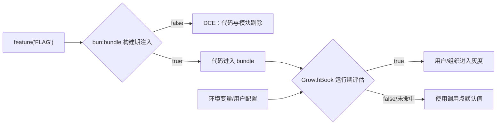
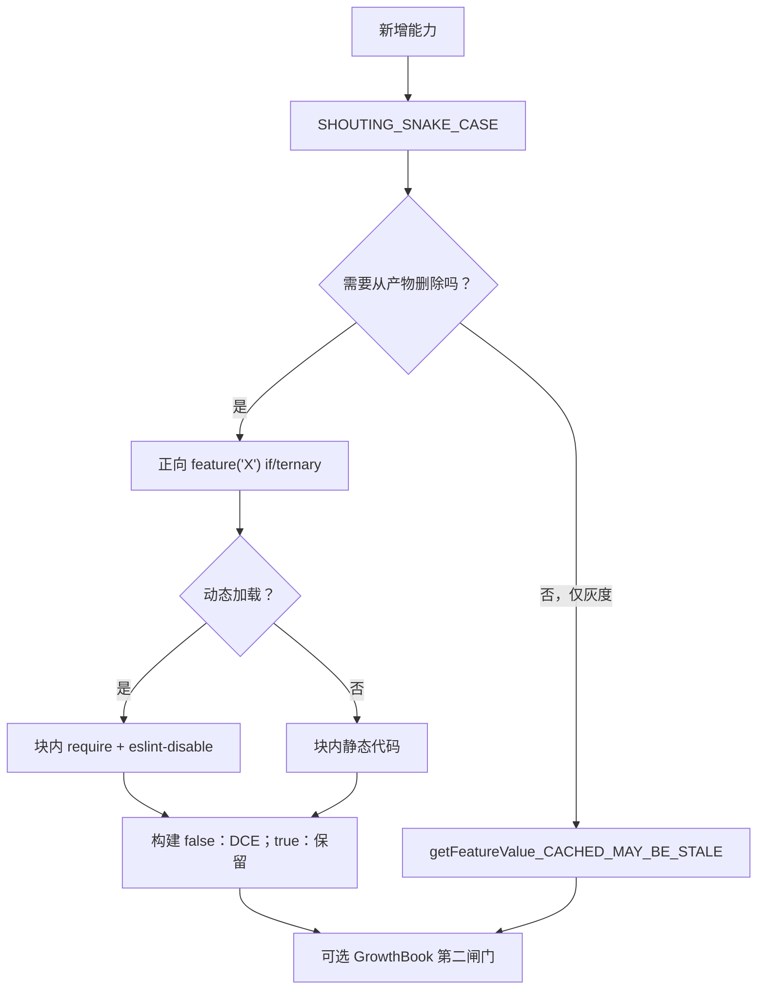
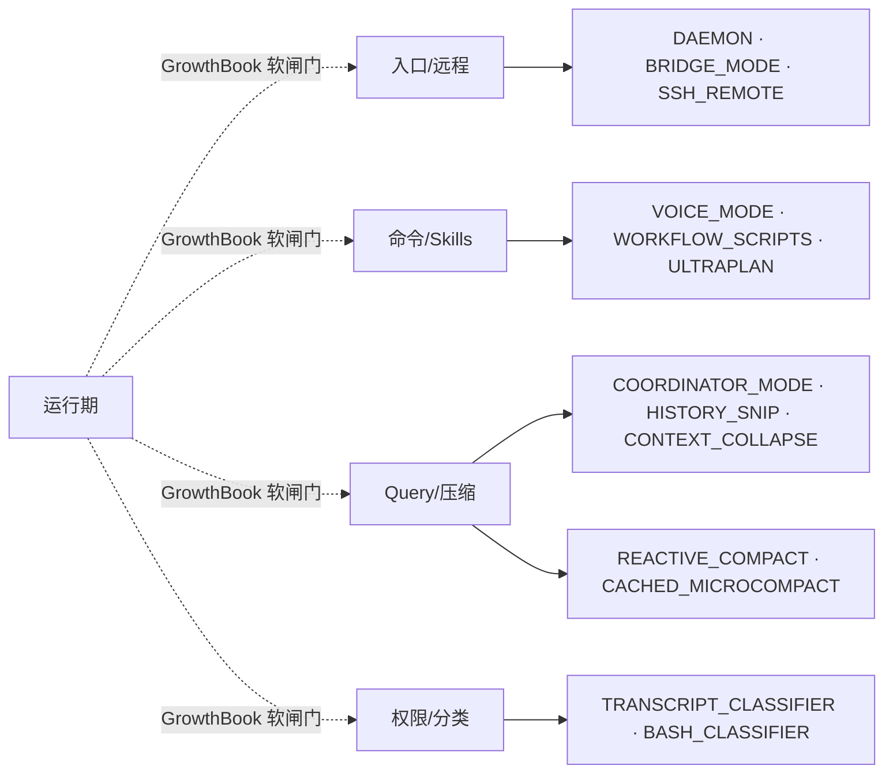

# Claude Code CLI 特性开关矩阵

> **定位**：特性开关是 CLI 的“地形图”：它们决定命令、skills、子模块是否进入发布包，以及进入后对哪些用户开放。
>
> **扫描口径**：对 `src/` 执行用户指定的 `grep -rE "feature\(['"][A-Z_]+['"]\)"`，得到 90 个实际大写 `feature()` 名称；另发现 98 个 GrowthBook 缓存键。`CLAUDE_IN_CHROME` 是用户要求保留的能力族标签，但源码没有同名 `feature()` 调用，已单独标注。源码快照缺少 `package.json`、build script 和 feature profile，因此发行版的具体开启组合不能从现有证据推出。

## 1. 两层机制：硬闸门 + 软闸门

`feature()` 来自 `bun:bundle`，在构建期被折叠成常量；未启用分支及其动态模块可被 DCE（Dead Code Elimination）剔除。GrowthBook 则在运行期通过 `getFeatureValue_CACHED_MAY_BE_STALE()` 读取环境变量、配置、内存 payload 或磁盘缓存，允许灰度、实验和回滚。运行期键的第二个参数就是调用点默认值。



典型的双闸门写法如下：

```typescript
if (feature('ULTRATHINK')) {
  if (getFeatureValue_CACHED_MAY_BE_STALE('tengu_turtle_carbon', true)) {
    // ... ultrathink 行为
  }
}
```

外层决定“代码存在不存在”，内层决定“存在的代码对谁开放”。GrowthBook 不能复活被 DCE 的命令；构建期为 true 也不代表每位用户都能看到行为。

## 2. DCE 的三条不可违反规则

1. **只用正向 if/ternary**：`if (feature('X')) { ... }` 或 `feature('X') ? require(...) : null` 才能让 Bun 可靠 tree-shake。源码 `src/QueryEngine.ts:120-128` 的注释要求正向模式；`src/hooks/useReplBridge.tsx:96-99` 明确说明负向早返回不会消除动态 import。
2. **require 必须在 feature 块内并禁用 lint**：使用 `// eslint-disable @typescript-eslint/no-require-imports` 包住 require；不要把动态 require 提到守卫外，否则模块重新进入所有构建。
3. **名称使用 `SHOUTING_SNAKE_CASE`**：通常是功能名或内部代号；GrowthBook 的 `tengu_*` 键是另一命名空间，不要混写。



## 3. 构建期开关矩阵

每个 H3 是一个实际扫描到的构建开关；类型、用途、影响范围、默认、锚点和启用条件统一压缩在三条字段中。默认描述是证据边界：没有 build profile 的源码快照只能确认“未注入时关闭”，不能确认内部发行构建的 profile。

**A. 核心运行模式**

### `COORDINATOR_MODE` — 构建期（`bun:bundle`）
- **用途与影响范围**：多 Agent 协调器；影响 QueryEngine、AgentTool、工具池、权限与 coordinator 会话。
- **默认状态与源码锚点**：未注入发行 profile 时关闭；本快照没有 profile 文件。 **锚点**：`src/QueryEngine.ts:115`。
- **启用条件/相关 build 配置**：构建时注入该 flag 为 true 才保留；需要灰度时再叠加 GrowthBook 软闸门。

### `BRIDGE_MODE` — 构建期（`bun:bundle`）
- **用途与影响范围**：IDE/CCR Bridge 反向通道；影响 bridge 命令、REPL hook、WebSocket 与远程安全命令。
- **默认状态与源码锚点**：未注入发行 profile 时关闭；本快照没有 profile 文件。 **锚点**：`src/hooks/useReplBridge.tsx:79；src/bridge/bridgeEnabled.ts:25`。
- **启用条件/相关 build 配置**：构建时注入该 flag 为 true 才保留；需要灰度时再叠加 GrowthBook 软闸门。

### `CCR_AUTO_CONNECT` — 构建期（`bun:bundle`）
- **用途与影响范围**：内部能力或平台分支；影响 `ccr_auto_connect` 相关命令、模块或诊断调用方。
- **默认状态与源码锚点**：未注入发行 profile 时关闭；本快照没有 profile 文件。 **锚点**：`src/bridge/bridgeEnabled.ts:186`。
- **启用条件/相关 build 配置**：构建时注入该 flag 为 true 才保留；需要灰度时再叠加 GrowthBook 软闸门。

### `CCR_MIRROR` — 构建期（`bun:bundle`）
- **用途与影响范围**：内部能力或平台分支；影响 `ccr_mirror` 相关命令、模块或诊断调用方。
- **默认状态与源码锚点**：未注入发行 profile 时关闭；本快照没有 profile 文件。 **锚点**：`src/bridge/bridgeEnabled.ts:198`。
- **启用条件/相关 build 配置**：构建时注入该 flag 为 true 才保留；需要灰度时再叠加 GrowthBook 软闸门。

### `KAIROS` — 构建期（`bun:bundle`）
- **用途与影响范围**：Assistant 模式；影响云端会话复用、bridge、提示词、命令和 UI。
- **默认状态与源码锚点**：未注入发行 profile 时关闭；本快照没有 profile 文件。 **锚点**：`src/bridge/bridgeMain.ts:1523`。
- **启用条件/相关 build 配置**：构建时注入该 flag 为 true 才保留；需要灰度时再叠加 GrowthBook 软闸门。

### `PROACTIVE` — 构建期（`bun:bundle`）
- **用途与影响范围**：主动触发模式；影响 proactive 命令、提示词、消息和会话存储。
- **默认状态与源码锚点**：未注入发行 profile 时关闭；本快照没有 profile 文件。 **锚点**：`src/cli/print.ts:362`。
- **启用条件/相关 build 配置**：构建时注入该 flag 为 true 才保留；需要灰度时再叠加 GrowthBook 软闸门。

### `AGENT_TRIGGERS` — 构建期（`bun:bundle`）
- **用途与影响范围**：内部能力或平台分支；影响 `agent_triggers` 相关命令、模块或诊断调用方。
- **默认状态与源码锚点**：未注入发行 profile 时关闭；本快照没有 profile 文件。 **锚点**：`src/cli/print.ts:365`。
- **启用条件/相关 build 配置**：构建时注入该 flag 为 true 才保留；需要灰度时再叠加 GrowthBook 软闸门。

### `KAIROS_CHANNELS` — 构建期（`bun:bundle`）
- **用途与影响范围**：内部能力或平台分支；影响 `kairos_channels` 相关命令、模块或诊断调用方。
- **默认状态与源码锚点**：未注入发行 profile 时关闭；本快照没有 profile 文件。 **锚点**：`src/cli/print.ts:1673`。
- **启用条件/相关 build 配置**：构建时注入该 flag 为 true 才保留；需要灰度时再叠加 GrowthBook 软闸门。

### `KAIROS_BRIEF` — 构建期（`bun:bundle`）
- **用途与影响范围**：内部能力或平台分支；影响 `kairos_brief` 相关命令、模块或诊断调用方。
- **默认状态与源码锚点**：未注入发行 profile 时关闭；本快照没有 profile 文件。 **锚点**：`src/commands/brief.ts:52`。
- **启用条件/相关 build 配置**：构建时注入该 flag 为 true 才保留；需要灰度时再叠加 GrowthBook 软闸门。

### `BG_SESSIONS` — 构建期（`bun:bundle`）
- **用途与影响范围**：内部能力或平台分支；影响 `bg_sessions` 相关命令、模块或诊断调用方。
- **默认状态与源码锚点**：未注入发行 profile 时关闭；本快照没有 profile 文件。 **锚点**：`src/commands/exit/exit.tsx:18`。
- **启用条件/相关 build 配置**：构建时注入该 flag 为 true 才保留；需要灰度时再叠加 GrowthBook 软闸门。

### `DAEMON` — 构建期（`bun:bundle`）
- **用途与影响范围**：后台守护进程模式；影响 daemon 命令和 CLI 入口生命周期。
- **默认状态与源码锚点**：未注入发行 profile 时关闭；本快照没有 profile 文件。 **锚点**：`src/commands.ts:77`。
- **启用条件/相关 build 配置**：构建时注入该 flag 为 true 才保留；需要灰度时再叠加 GrowthBook 软闸门。

### `KAIROS_PUSH_NOTIFICATION` — 构建期（`bun:bundle`）
- **用途与影响范围**：内部能力或平台分支；影响 `kairos_push_notification` 相关命令、模块或诊断调用方。
- **默认状态与源码锚点**：未注入发行 profile 时关闭；本快照没有 profile 文件。 **锚点**：`src/components/Settings/Config.tsx:658`。
- **启用条件/相关 build 配置**：构建时注入该 flag 为 true 才保留；需要灰度时再叠加 GrowthBook 软闸门。

### `BYOC_ENVIRONMENT_RUNNER` — 构建期（`bun:bundle`）
- **用途与影响范围**：内部能力或平台分支；影响 `byoc_environment_runner` 相关命令、模块或诊断调用方。
- **默认状态与源码锚点**：未注入发行 profile 时关闭；本快照没有 profile 文件。 **锚点**：`src/entrypoints/cli.tsx:226`。
- **启用条件/相关 build 配置**：构建时注入该 flag 为 true 才保留；需要灰度时再叠加 GrowthBook 软闸门。

### `SELF_HOSTED_RUNNER` — 构建期（`bun:bundle`）
- **用途与影响范围**：内部能力或平台分支；影响 `self_hosted_runner` 相关命令、模块或诊断调用方。
- **默认状态与源码锚点**：未注入发行 profile 时关闭；本快照没有 profile 文件。 **锚点**：`src/entrypoints/cli.tsx:238`。
- **启用条件/相关 build 配置**：构建时注入该 flag 为 true 才保留；需要灰度时再叠加 GrowthBook 软闸门。

### `DIRECT_CONNECT` — 构建期（`bun:bundle`）
- **用途与影响范围**：内部能力或平台分支；影响 `direct_connect` 相关命令、模块或诊断调用方。
- **默认状态与源码锚点**：未注入发行 profile 时关闭；本快照没有 profile 文件。 **锚点**：`src/main.tsx:548`。
- **启用条件/相关 build 配置**：构建时注入该 flag 为 true 才保留；需要灰度时再叠加 GrowthBook 软闸门。

### `SSH_REMOTE` — 构建期（`bun:bundle`）
- **用途与影响范围**：SSH 远程会话；影响 main.tsx 的远程启动与清理。
- **默认状态与源码锚点**：未注入发行 profile 时关闭；本快照没有 profile 文件。 **锚点**：`src/main.tsx:577`。
- **启用条件/相关 build 配置**：构建时注入该 flag 为 true 才保留；需要灰度时再叠加 GrowthBook 软闸门。

### `KAIROS_DREAM` — 构建期（`bun:bundle`）
- **用途与影响范围**：内部能力或平台分支；影响 `kairos_dream` 相关命令、模块或诊断调用方。
- **默认状态与源码锚点**：未注入发行 profile 时关闭；本快照没有 profile 文件。 **锚点**：`src/skills/bundled/index.ts:35`。
- **启用条件/相关 build 配置**：构建时注入该 flag 为 true 才保留；需要灰度时再叠加 GrowthBook 软闸门。

**B. 上下文与会话压缩**

### `HISTORY_SNIP` — 构建期（`bun:bundle`）
- **用途与影响范围**：历史 snip 压缩；影响 QueryEngine、/compact、消息展示与 token 估算。
- **默认状态与源码锚点**：未注入发行 profile 时关闭；本快照没有 profile 文件。 **锚点**：`src/QueryEngine.ts:122`。
- **启用条件/相关 build 配置**：构建时注入该 flag 为 true 才保留；需要灰度时再叠加 GrowthBook 软闸门。

### `EXTRACT_MEMORIES` — 构建期（`bun:bundle`）
- **用途与影响范围**：内部能力或平台分支；影响 `extract_memories` 相关命令、模块或诊断调用方。
- **默认状态与源码锚点**：未注入发行 profile 时关闭；本快照没有 profile 文件。 **锚点**：`src/cli/print.ts:374`。
- **启用条件/相关 build 配置**：构建时注入该 flag 为 true 才保留；需要灰度时再叠加 GrowthBook 软闸门。

### `FILE_PERSISTENCE` — 构建期（`bun:bundle`）
- **用途与影响范围**：内部能力或平台分支；影响 `file_persistence` 相关命令、模块或诊断调用方。
- **默认状态与源码锚点**：未注入发行 profile 时关闭；本快照没有 profile 文件。 **锚点**：`src/cli/print.ts:2134`。
- **启用条件/相关 build 配置**：构建时注入该 flag 为 true 才保留；需要灰度时再叠加 GrowthBook 软闸门。

### `REACTIVE_COMPACT` — 构建期（`bun:bundle`）
- **用途与影响范围**：响应式压缩；影响 token warning、query 和 auto-compact 策略。
- **默认状态与源码锚点**：未注入发行 profile 时关闭；本快照没有 profile 文件。 **锚点**：`src/services/compact/autoCompact.ts:195；src/query.ts:15`。
- **启用条件/相关 build 配置**：构建时注入该 flag 为 true 才保留；需要灰度时再叠加 GrowthBook 软闸门。

### `PROMPT_CACHE_BREAK_DETECTION` — 构建期（`bun:bundle`）
- **用途与影响范围**：内部能力或平台分支；影响 `prompt_cache_break_detection` 相关命令、模块或诊断调用方。
- **默认状态与源码锚点**：未注入发行 profile 时关闭；本快照没有 profile 文件。 **锚点**：`src/commands/compact/compact.ts:67`。
- **启用条件/相关 build 配置**：构建时注入该 flag 为 true 才保留；需要灰度时再叠加 GrowthBook 软闸门。

### `CONTEXT_COLLAPSE` — 构建期（`bun:bundle`）
- **用途与影响范围**：上下文折叠；影响 context 命令、可视化、恢复和 auto-compact 抑制。
- **默认状态与源码锚点**：未注入发行 profile 时关闭；本快照没有 profile 文件。 **锚点**：`src/commands/context/context-noninteractive.ts:50`。
- **启用条件/相关 build 配置**：构建时注入该 flag 为 true 才保留；需要灰度时再叠加 GrowthBook 软闸门。

### `TOKEN_BUDGET` — 构建期（`bun:bundle`）
- **用途与影响范围**：内部能力或平台分支；影响 `token_budget` 相关命令、模块或诊断调用方。
- **默认状态与源码锚点**：未注入发行 profile 时关闭；本快照没有 profile 文件。 **锚点**：`src/components/PromptInput/PromptInput.tsx:534`。
- **启用条件/相关 build 配置**：构建时注入该 flag 为 true 才保留；需要灰度时再叠加 GrowthBook 软闸门。

### `TEAMMEM` — 构建期（`bun:bundle`）
- **用途与影响范围**：内部能力或平台分支；影响 `teammem` 相关命令、模块或诊断调用方。
- **默认状态与源码锚点**：未注入发行 profile 时关闭；本快照没有 profile 文件。 **锚点**：`src/components/memory/MemoryFileSelector.tsx:29`。
- **启用条件/相关 build 配置**：构建时注入该 flag 为 true 才保留；需要灰度时再叠加 GrowthBook 软闸门。

### `CACHED_MICROCOMPACT` — 构建期（`bun:bundle`）
- **用途与影响范围**：缓存感知 microcompact；影响 query、API prompt 构建和 cache-break 日志。
- **默认状态与源码锚点**：未注入发行 profile 时关闭；本快照没有 profile 文件。 **锚点**：`src/services/compact/microCompact.ts；src/query.ts:423`。
- **启用条件/相关 build 配置**：构建时注入该 flag 为 true 才保留；需要灰度时再叠加 GrowthBook 软闸门。

### `AWAY_SUMMARY` — 构建期（`bun:bundle`）
- **用途与影响范围**：内部能力或平台分支；影响 `away_summary` 相关命令、模块或诊断调用方。
- **默认状态与源码锚点**：未注入发行 profile 时关闭；本快照没有 profile 文件。 **锚点**：`src/hooks/useAwaySummary.ts:54`。
- **启用条件/相关 build 配置**：构建时注入该 flag 为 true 才保留；需要灰度时再叠加 GrowthBook 软闸门。

### `AGENT_MEMORY_SNAPSHOT` — 构建期（`bun:bundle`）
- **用途与影响范围**：内部能力或平台分支；影响 `agent_memory_snapshot` 相关命令、模块或诊断调用方。
- **默认状态与源码锚点**：未注入发行 profile 时关闭；本快照没有 profile 文件。 **锚点**：`src/main.tsx:2258`。
- **启用条件/相关 build 配置**：构建时注入该 flag 为 true 才保留；需要灰度时再叠加 GrowthBook 软闸门。

### `MEMORY_SHAPE_TELEMETRY` — 构建期（`bun:bundle`）
- **用途与影响范围**：内部能力或平台分支；影响 `memory_shape_telemetry` 相关命令、模块或诊断调用方。
- **默认状态与源码锚点**：未注入发行 profile 时关闭；本快照没有 profile 文件。 **锚点**：`src/memdir/findRelevantMemories.ts:66`。
- **启用条件/相关 build 配置**：构建时注入该 flag 为 true 才保留；需要灰度时再叠加 GrowthBook 软闸门。

### `COMPACTION_REMINDERS` — 构建期（`bun:bundle`）
- **用途与影响范围**：内部能力或平台分支；影响 `compaction_reminders` 相关命令、模块或诊断调用方。
- **默认状态与源码锚点**：未注入发行 profile 时关闭；本快照没有 profile 文件。 **锚点**：`src/utils/attachments.ts:922`。
- **启用条件/相关 build 配置**：构建时注入该 flag 为 true 才保留；需要灰度时再叠加 GrowthBook 软闸门。

**C. 远程、协作与同步**

### `DOWNLOAD_USER_SETTINGS` — 构建期（`bun:bundle`）
- **用途与影响范围**：内部能力或平台分支；影响 `download_user_settings` 相关命令、模块或诊断调用方。
- **默认状态与源码锚点**：未注入发行 profile 时关闭；本快照没有 profile 文件。 **锚点**：`src/cli/print.ts:511`。
- **启用条件/相关 build 配置**：构建时注入该 flag 为 true 才保留；需要灰度时再叠加 GrowthBook 软闸门。

### `COMMIT_ATTRIBUTION` — 构建期（`bun:bundle`）
- **用途与影响范围**：内部能力或平台分支；影响 `commit_attribution` 相关命令、模块或诊断调用方。
- **默认状态与源码锚点**：未注入发行 profile 时关闭；本快照没有 profile 文件。 **锚点**：`src/cli/print.ts:809`。
- **启用条件/相关 build 配置**：构建时注入该 flag 为 true 才保留；需要灰度时再叠加 GrowthBook 软闸门。

### `UDS_INBOX` — 构建期（`bun:bundle`）
- **用途与影响范围**：Unix Domain Socket inbox；影响 peer/SendMessage、并发会话与本地消息队列。
- **默认状态与源码锚点**：未注入发行 profile 时关闭；本快照没有 profile 文件。 **锚点**：`src/cli/print.ts:2685`。
- **启用条件/相关 build 配置**：构建时注入该 flag 为 true 才保留；需要灰度时再叠加 GrowthBook 软闸门。

### `CCR_REMOTE_SETUP` — 构建期（`bun:bundle`）
- **用途与影响范围**：Claude Code Remote 安装；影响 remote-setup 命令。
- **默认状态与源码锚点**：未注入发行 profile 时关闭；本快照没有 profile 文件。 **锚点**：`src/commands.ts:91`。
- **启用条件/相关 build 配置**：构建时注入该 flag 为 true 才保留；需要灰度时再叠加 GrowthBook 软闸门。

### `KAIROS_GITHUB_WEBHOOKS` — 构建期（`bun:bundle`）
- **用途与影响范围**：GitHub webhook 触发；影响 subscribe-pr、入站消息清洗和远程工具。
- **默认状态与源码锚点**：未注入发行 profile 时关闭；本快照没有 profile 文件。 **锚点**：`src/commands.ts:101`。
- **启用条件/相关 build 配置**：构建时注入该 flag 为 true 才保留；需要灰度时再叠加 GrowthBook 软闸门。

### `NATIVE_CLIENT_ATTESTATION` — 构建期（`bun:bundle`）
- **用途与影响范围**：内部能力或平台分支；影响 `native_client_attestation` 相关命令、模块或诊断调用方。
- **默认状态与源码锚点**：未注入发行 profile 时关闭；本快照没有 profile 文件。 **锚点**：`src/constants/system.ts:82`。
- **启用条件/相关 build 配置**：构建时注入该 flag 为 true 才保留；需要灰度时再叠加 GrowthBook 软闸门。

### `UPLOAD_USER_SETTINGS` — 构建期（`bun:bundle`）
- **用途与影响范围**：内部能力或平台分支；影响 `upload_user_settings` 相关命令、模块或诊断调用方。
- **默认状态与源码锚点**：未注入发行 profile 时关闭；本快照没有 profile 文件。 **锚点**：`src/main.tsx:963`。
- **启用条件/相关 build 配置**：构建时注入该 flag 为 true 才保留；需要灰度时再叠加 GrowthBook 软闸门。

### `HOOK_PROMPTS` — 构建期（`bun:bundle`）
- **用途与影响范围**：内部能力或平台分支；影响 `hook_prompts` 相关命令、模块或诊断调用方。
- **默认状态与源码锚点**：未注入发行 profile 时关闭；本快照没有 profile 文件。 **锚点**：`src/screens/REPL.tsx:2520`。
- **启用条件/相关 build 配置**：构建时注入该 flag 为 true 才保留；需要灰度时再叠加 GrowthBook 软闸门。

### `AGENT_TRIGGERS_REMOTE` — 构建期（`bun:bundle`）
- **用途与影响范围**：远程 Agent 触发；影响 schedule remote agents skill 与 RemoteTriggerTool。
- **默认状态与源码锚点**：未注入发行 profile 时关闭；本快照没有 profile 文件。 **锚点**：`src/skills/bundled/index.ts:56`。
- **启用条件/相关 build 配置**：构建时注入该 flag 为 true 才保留；需要灰度时再叠加 GrowthBook 软闸门。

**D. 能力扩展与实验**

### `BUDDY` — 构建期（`bun:bundle`）
- **用途与影响范围**：Buddy 彩蛋子系统；影响 CompanionSprite、提示词和通知。
- **默认状态与源码锚点**：未注入发行 profile 时关闭；本快照没有 profile 文件。 **锚点**：`src/buddy/CompanionSprite.tsx:168`。
- **启用条件/相关 build 配置**：构建时注入该 flag 为 true 才保留；需要灰度时再叠加 GrowthBook 软闸门。

### `FORK_SUBAGENT` — 构建期（`bun:bundle`）
- **用途与影响范围**：子代理 fork；影响 fork 命令、AgentTool 和消息标记。
- **默认状态与源码锚点**：未注入发行 profile 时关闭；本快照没有 profile 文件。 **锚点**：`src/commands/branch/index.ts:8`。
- **启用条件/相关 build 配置**：构建时注入该 flag 为 true 才保留；需要灰度时再叠加 GrowthBook 软闸门。

### `NEW_INIT` — 构建期（`bun:bundle`）
- **用途与影响范围**：内部能力或平台分支；影响 `new_init` 相关命令、模块或诊断调用方。
- **默认状态与源码锚点**：未注入发行 profile 时关闭；本快照没有 profile 文件。 **锚点**：`src/commands/init.ts:230`。
- **启用条件/相关 build 配置**：构建时注入该 flag 为 true 才保留；需要灰度时再叠加 GrowthBook 软闸门。

### `VOICE_MODE` — 构建期（`bun:bundle`）
- **用途与影响范围**：语音输入；影响 STT、VoiceIndicator、配置和输入组件。
- **默认状态与源码锚点**：未注入发行 profile 时关闭；本快照没有 profile 文件。 **锚点**：`src/commands.ts:80`。
- **启用条件/相关 build 配置**：构建时注入该 flag 为 true 才保留；需要灰度时再叠加 GrowthBook 软闸门。

### `WORKFLOW_SCRIPTS` — 构建期（`bun:bundle`）
- **用途与影响范围**：工作流脚本；影响 workflow 命令、task 与权限提示。
- **默认状态与源码锚点**：未注入发行 profile 时关闭；本快照没有 profile 文件。 **锚点**：`src/commands.ts:86`。
- **启用条件/相关 build 配置**：构建时注入该 flag 为 true 才保留；需要灰度时再叠加 GrowthBook 软闸门。

### `ULTRAPLAN` — 构建期（`bun:bundle`）
- **用途与影响范围**：ultraplan 工具；影响命令注册、关键词触发和模型配置。
- **默认状态与源码锚点**：未注入发行 profile 时关闭；本快照没有 profile 文件。 **锚点**：`src/commands.ts:104`。
- **启用条件/相关 build 配置**：构建时注入该 flag 为 true 才保留；需要灰度时再叠加 GrowthBook 软闸门。

### `TORCH` — 构建期（`bun:bundle`）
- **用途与影响范围**：实验性 Torch 命令；影响 commands.ts 的懒加载入口。
- **默认状态与源码锚点**：未注入发行 profile 时关闭；本快照没有 profile 文件。 **锚点**：`src/commands.ts:107`。
- **启用条件/相关 build 配置**：构建时注入该 flag 为 true 才保留；需要灰度时再叠加 GrowthBook 软闸门。

### `MCP_SKILLS` — 构建期（`bun:bundle`）
- **用途与影响范围**：内部能力或平台分支；影响 `mcp_skills` 相关命令、模块或诊断调用方。
- **默认状态与源码锚点**：未注入发行 profile 时关闭；本快照没有 profile 文件。 **锚点**：`src/commands.ts:550`。
- **启用条件/相关 build 配置**：构建时注入该 flag 为 true 才保留；需要灰度时再叠加 GrowthBook 软闸门。

### `QUICK_SEARCH` — 构建期（`bun:bundle`）
- **用途与影响范围**：内部能力或平台分支；影响 `quick_search` 相关命令、模块或诊断调用方。
- **默认状态与源码锚点**：未注入发行 profile 时关闭；本快照没有 profile 文件。 **锚点**：`src/components/PromptInput/PromptInput.tsx:1701`。
- **启用条件/相关 build 配置**：构建时注入该 flag 为 true 才保留；需要灰度时再叠加 GrowthBook 软闸门。

### `HISTORY_PICKER` — 构建期（`bun:bundle`）
- **用途与影响范围**：内部能力或平台分支；影响 `history_picker` 相关命令、模块或诊断调用方。
- **默认状态与源码锚点**：未注入发行 profile 时关闭；本快照没有 profile 文件。 **锚点**：`src/components/PromptInput/PromptInput.tsx:1721`。
- **启用条件/相关 build 配置**：构建时注入该 flag 为 true 才保留；需要灰度时再叠加 GrowthBook 软闸门。

### `TERMINAL_PANEL` — 构建期（`bun:bundle`）
- **用途与影响范围**：内部能力或平台分支；影响 `terminal_panel` 相关命令、模块或诊断调用方。
- **默认状态与源码锚点**：未注入发行 profile 时关闭；本快照没有 profile 文件。 **锚点**：`src/components/PromptInput/PromptInputHelpMenu.tsx:132`。
- **启用条件/相关 build 配置**：构建时注入该 flag 为 true 才保留；需要灰度时再叠加 GrowthBook 软闸门。

### `AUTO_THEME` — 构建期（`bun:bundle`）
- **用途与影响范围**：内部能力或平台分支；影响 `auto_theme` 相关命令、模块或诊断调用方。
- **默认状态与源码锚点**：未注入发行 profile 时关闭；本快照没有 profile 文件。 **锚点**：`src/components/ThemePicker.tsx:113`。
- **启用条件/相关 build 配置**：构建时注入该 flag 为 true 才保留；需要灰度时再叠加 GrowthBook 软闸门。

### `MONITOR_TOOL` — 构建期（`bun:bundle`）
- **用途与影响范围**：内部能力或平台分支；影响 `monitor_tool` 相关命令、模块或诊断调用方。
- **默认状态与源码锚点**：未注入发行 profile 时关闭；本快照没有 profile 文件。 **锚点**：`src/components/permissions/PermissionRequest.tsx:40`。
- **启用条件/相关 build 配置**：构建时注入该 flag 为 true 才保留；需要灰度时再叠加 GrowthBook 软闸门。

### `VERIFICATION_AGENT` — 构建期（`bun:bundle`）
- **用途与影响范围**：内部能力或平台分支；影响 `verification_agent` 相关命令、模块或诊断调用方。
- **默认状态与源码锚点**：未注入发行 profile 时关闭；本快照没有 profile 文件。 **锚点**：`src/constants/prompts.ts:391`。
- **启用条件/相关 build 配置**：构建时注入该 flag 为 true 才保留；需要灰度时再叠加 GrowthBook 软闸门。

### `TEMPLATES` — 构建期（`bun:bundle`）
- **用途与影响范围**：内部能力或平台分支；影响 `templates` 相关命令、模块或诊断调用方。
- **默认状态与源码锚点**：未注入发行 profile 时关闭；本快照没有 profile 文件。 **锚点**：`src/entrypoints/cli.tsx:212`。
- **启用条件/相关 build 配置**：构建时注入该 flag 为 true 才保留；需要灰度时再叠加 GrowthBook 软闸门。

### `MESSAGE_ACTIONS` — 构建期（`bun:bundle`）
- **用途与影响范围**：内部能力或平台分支；影响 `message_actions` 相关命令、模块或诊断调用方。
- **默认状态与源码锚点**：未注入发行 profile 时关闭；本快照没有 profile 文件。 **锚点**：`src/keybindings/defaultBindings.ts:88`。
- **启用条件/相关 build 配置**：构建时注入该 flag 为 true 才保留；需要灰度时再叠加 GrowthBook 软闸门。

### `WEB_BROWSER_TOOL` — 构建期（`bun:bundle`）
- **用途与影响范围**：内部能力或平台分支；影响 `web_browser_tool` 相关命令、模块或诊断调用方。
- **默认状态与源码锚点**：未注入发行 profile 时关闭；本快照没有 profile 文件。 **锚点**：`src/main.tsx:1571`。
- **启用条件/相关 build 配置**：构建时注入该 flag 为 true 才保留；需要灰度时再叠加 GrowthBook 软闸门。

### `BUILTIN_EXPLORE_PLAN_AGENTS` — 构建期（`bun:bundle`）
- **用途与影响范围**：内部能力或平台分支；影响 `builtin_explore_plan_agents` 相关命令、模块或诊断调用方。
- **默认状态与源码锚点**：未注入发行 profile 时关闭；本快照没有 profile 文件。 **锚点**：`src/tools/AgentTool/builtInAgents.ts:14`。
- **启用条件/相关 build 配置**：构建时注入该 flag 为 true 才保留；需要灰度时再叠加 GrowthBook 软闸门。

### `MCP_RICH_OUTPUT` — 构建期（`bun:bundle`）
- **用途与影响范围**：内部能力或平台分支；影响 `mcp_rich_output` 相关命令、模块或诊断调用方。
- **默认状态与源码锚点**：未注入发行 profile 时关闭；本快照没有 profile 文件。 **锚点**：`src/tools/MCPTool/UI.tsx:51`。
- **启用条件/相关 build 配置**：构建时注入该 flag 为 true 才保留；需要灰度时再叠加 GrowthBook 软闸门。

### `OVERFLOW_TEST_TOOL` — 构建期（`bun:bundle`）
- **用途与影响范围**：内部能力或平台分支；影响 `overflow_test_tool` 相关命令、模块或诊断调用方。
- **默认状态与源码锚点**：未注入发行 profile 时关闭；本快照没有 profile 文件。 **锚点**：`src/tools.ts:107`。
- **启用条件/相关 build 配置**：构建时注入该 flag 为 true 才保留；需要灰度时再叠加 GrowthBook 软闸门。

### `ULTRATHINK` — 构建期（`bun:bundle`）
- **用途与影响范围**：内部能力或平台分支；影响 `ultrathink` 相关命令、模块或诊断调用方。
- **默认状态与源码锚点**：未注入发行 profile 时关闭；本快照没有 profile 文件。 **锚点**：`src/utils/thinking.ts:20`。
- **启用条件/相关 build 配置**：构建时注入该 flag 为 true 才保留；需要灰度时再叠加 GrowthBook 软闸门。

**E. Skills、Plugins 与开发者工具**

### `STREAMLINED_OUTPUT` — 构建期（`bun:bundle`）
- **用途与影响范围**：内部能力或平台分支；影响 `streamlined_output` 相关命令、模块或诊断调用方。
- **默认状态与源码锚点**：未注入发行 profile 时关闭；本快照没有 profile 文件。 **锚点**：`src/cli/print.ts:857`。
- **启用条件/相关 build 配置**：构建时注入该 flag 为 true 才保留；需要灰度时再叠加 GrowthBook 软闸门。

### `EXPERIMENTAL_SKILL_SEARCH` — 构建期（`bun:bundle`）
- **用途与影响范围**：实验性 skill 搜索；影响 skill 索引、附件、SkillTool 与 compact。
- **默认状态与源码锚点**：未注入发行 profile 时关闭；本快照没有 profile 文件。 **锚点**：`src/commands.ts:96`。
- **启用条件/相关 build 配置**：构建时注入该 flag 为 true 才保留；需要灰度时再叠加 GrowthBook 软闸门。

### `CONNECTOR_TEXT` — 构建期（`bun:bundle`）
- **用途与影响范围**：内部能力或平台分支；影响 `connector_text` 相关命令、模块或诊断调用方。
- **默认状态与源码锚点**：未注入发行 profile 时关闭；本快照没有 profile 文件。 **锚点**：`src/components/Message.tsx:454`。
- **启用条件/相关 build 配置**：构建时注入该 flag 为 true 才保留；需要灰度时再叠加 GrowthBook 软闸门。

### `BUILDING_CLAUDE_APPS` — 构建期（`bun:bundle`）
- **用途与影响范围**：Claude 应用构建；影响 Claude API bundled skill 注册。
- **默认状态与源码锚点**：未注入发行 profile 时关闭；本快照没有 profile 文件。 **锚点**：`src/skills/bundled/index.ts:64`。
- **启用条件/相关 build 配置**：构建时注入该 flag 为 true 才保留；需要灰度时再叠加 GrowthBook 软闸门。

### `RUN_SKILL_GENERATOR` — 构建期（`bun:bundle`）
- **用途与影响范围**：skill 生成器；影响 bundled skill 注册。
- **默认状态与源码锚点**：未注入发行 profile 时关闭；本快照没有 profile 文件。 **锚点**：`src/skills/bundled/index.ts:73`。
- **启用条件/相关 build 配置**：构建时注入该 flag 为 true 才保留；需要灰度时再叠加 GrowthBook 软闸门。

### `SKILL_IMPROVEMENT` — 构建期（`bun:bundle`）
- **用途与影响范围**：内部能力或平台分支；影响 `skill_improvement` 相关命令、模块或诊断调用方。
- **默认状态与源码锚点**：未注入发行 profile 时关闭；本快照没有 profile 文件。 **锚点**：`src/utils/hooks/skillImprovement.ts:177`。
- **启用条件/相关 build 配置**：构建时注入该 flag 为 true 才保留；需要灰度时再叠加 GrowthBook 软闸门。

### `ALLOW_TEST_VERSIONS` — 构建期（`bun:bundle`）
- **用途与影响范围**：内部能力或平台分支；影响 `allow_test_versions` 相关命令、模块或诊断调用方。
- **默认状态与源码锚点**：未注入发行 profile 时关闭；本快照没有 profile 文件。 **锚点**：`src/utils/nativeInstaller/download.ts:124`。
- **启用条件/相关 build 配置**：构建时注入该 flag 为 true 才保留；需要灰度时再叠加 GrowthBook 软闸门。

**F. 诊断、遥测与测试**

### `SKIP_DETECTION_WHEN_AUTOUPDATES_DISABLED` — 构建期（`bun:bundle`）
- **用途与影响范围**：内部能力或平台分支；影响 `skip_detection_when_autoupdates_disabled` 相关命令、模块或诊断调用方。
- **默认状态与源码锚点**：未注入发行 profile 时关闭；本快照没有 profile 文件。 **锚点**：`src/components/AutoUpdaterWrapper.tsx:36`。
- **启用条件/相关 build 配置**：构建时注入该 flag 为 true 才保留；需要灰度时再叠加 GrowthBook 软闸门。

### `SHOT_STATS` — 构建期（`bun:bundle`）
- **用途与影响范围**：内部能力或平台分支；影响 `shot_stats` 相关命令、模块或诊断调用方。
- **默认状态与源码锚点**：未注入发行 profile 时关闭；本快照没有 profile 文件。 **锚点**：`src/components/Stats.tsx:391`。
- **启用条件/相关 build 配置**：构建时注入该 flag 为 true 才保留；需要灰度时再叠加 GrowthBook 软闸门。

### `REVIEW_ARTIFACT` — 构建期（`bun:bundle`）
- **用途与影响范围**：review 工件；影响权限提示和 hunter bundled skill。
- **默认状态与源码锚点**：未注入发行 profile 时关闭；本快照没有 profile 文件。 **锚点**：`src/components/permissions/PermissionRequest.tsx:36`。
- **启用条件/相关 build 配置**：构建时注入该 flag 为 true 才保留；需要灰度时再叠加 GrowthBook 软闸门。

### `ABLATION_BASELINE` — 构建期（`bun:bundle`）
- **用途与影响范围**：消融实验基线；影响 entrypoints/cli.tsx 的实验路径。
- **默认状态与源码锚点**：未注入发行 profile 时关闭；本快照没有 profile 文件。 **锚点**：`src/entrypoints/cli.tsx:21`。
- **启用条件/相关 build 配置**：构建时注入该 flag 为 true 才保留；需要灰度时再叠加 GrowthBook 软闸门。

### `DUMP_SYSTEM_PROMPT` — 构建期（`bun:bundle`）
- **用途与影响范围**：内部能力或平台分支；影响 `dump_system_prompt` 相关命令、模块或诊断调用方。
- **默认状态与源码锚点**：未注入发行 profile 时关闭；本快照没有 profile 文件。 **锚点**：`src/entrypoints/cli.tsx:53`。
- **启用条件/相关 build 配置**：构建时注入该 flag 为 true 才保留；需要灰度时再叠加 GrowthBook 软闸门。

### `HARD_FAIL` — 构建期（`bun:bundle`）
- **用途与影响范围**：崩溃测试模式；影响 utils/log.ts 的故意失败路径。
- **默认状态与源码锚点**：未注入发行 profile 时关闭；本快照没有 profile 文件。 **锚点**：`src/utils/log.ts:160；src/main.tsx:3870`。
- **启用条件/相关 build 配置**：构建时注入该 flag 为 true 才保留；需要灰度时再叠加 GrowthBook 软闸门。

### `COWORKER_TYPE_TELEMETRY` — 构建期（`bun:bundle`）
- **用途与影响范围**：内部能力或平台分支；影响 `coworker_type_telemetry` 相关命令、模块或诊断调用方。
- **默认状态与源码锚点**：未注入发行 profile 时关闭；本快照没有 profile 文件。 **锚点**：`src/services/analytics/metadata.ts:603`。
- **启用条件/相关 build 配置**：构建时注入该 flag 为 true 才保留；需要灰度时再叠加 GrowthBook 软闸门。

### `ANTI_DISTILLATION_CC` — 构建期（`bun:bundle`）
- **用途与影响范围**：内部能力或平台分支；影响 `anti_distillation_cc` 相关命令、模块或诊断调用方。
- **默认状态与源码锚点**：未注入发行 profile 时关闭；本快照没有 profile 文件。 **锚点**：`src/services/api/claude.ts:303`。
- **启用条件/相关 build 配置**：构建时注入该 flag 为 true 才保留；需要灰度时再叠加 GrowthBook 软闸门。

### `UNATTENDED_RETRY` — 构建期（`bun:bundle`）
- **用途与影响范围**：内部能力或平台分支；影响 `unattended_retry` 相关命令、模块或诊断调用方。
- **默认状态与源码锚点**：未注入发行 profile 时关闭；本快照没有 profile 文件。 **锚点**：`src/services/api/withRetry.ts:101`。
- **启用条件/相关 build 配置**：构建时注入该 flag 为 true 才保留；需要灰度时再叠加 GrowthBook 软闸门。

### `SLOW_OPERATION_LOGGING` — 构建期（`bun:bundle`）
- **用途与影响范围**：内部能力或平台分支；影响 `slow_operation_logging` 相关命令、模块或诊断调用方。
- **默认状态与源码锚点**：未注入发行 profile 时关闭；本快照没有 profile 文件。 **锚点**：`src/utils/slowOperations.ts:157`。
- **启用条件/相关 build 配置**：构建时注入该 flag 为 true 才保留；需要灰度时再叠加 GrowthBook 软闸门。

### `PERFETTO_TRACING` — 构建期（`bun:bundle`）
- **用途与影响范围**：内部能力或平台分支；影响 `perfetto_tracing` 相关命令、模块或诊断调用方。
- **默认状态与源码锚点**：未注入发行 profile 时关闭；本快照没有 profile 文件。 **锚点**：`src/utils/telemetry/perfettoTracing.ts:260`。
- **启用条件/相关 build 配置**：构建时注入该 flag 为 true 才保留；需要灰度时再叠加 GrowthBook 软闸门。

### `ENHANCED_TELEMETRY_BETA` — 构建期（`bun:bundle`）
- **用途与影响范围**：内部能力或平台分支；影响 `enhanced_telemetry_beta` 相关命令、模块或诊断调用方。
- **默认状态与源码锚点**：未注入发行 profile 时关闭；本快照没有 profile 文件。 **锚点**：`src/utils/telemetry/sessionTracing.ts:9`。
- **启用条件/相关 build 配置**：构建时注入该 flag 为 true 才保留；需要灰度时再叠加 GrowthBook 软闸门。

**G. 平台、浏览器与运行环境**

### `CHICAGO_MCP` — 构建期（`bun:bundle`）
- **用途与影响范围**：Computer-use 沙箱；影响 CLI 入口、MCP client/config 与 stop hooks。
- **默认状态与源码锚点**：未注入发行 profile 时关闭；本快照没有 profile 文件。 **锚点**：`src/entrypoints/cli.tsx:86；src/query/stopHooks.ts:164`。
- **启用条件/相关 build 配置**：构建时注入该 flag 为 true 才保留；需要灰度时再叠加 GrowthBook 软闸门。

### `LODESTONE` — 构建期（`bun:bundle`）
- **用途与影响范围**：内部能力或平台分支；影响 `lodestone` 相关命令、模块或诊断调用方。
- **默认状态与源码锚点**：未注入发行 profile 时关闭；本快照没有 profile 文件。 **锚点**：`src/interactiveHelpers.tsx:176`。
- **启用条件/相关 build 配置**：构建时注入该 flag 为 true 才保留；需要灰度时再叠加 GrowthBook 软闸门。

### `TREE_SITTER_BASH_SHADOW` — 构建期（`bun:bundle`）
- **用途与影响范围**：内部能力或平台分支；影响 `tree_sitter_bash_shadow` 相关命令、模块或诊断调用方。
- **默认状态与源码锚点**：未注入发行 profile 时关闭；本快照没有 profile 文件。 **锚点**：`src/tools/BashTool/bashPermissions.ts:1683`。
- **启用条件/相关 build 配置**：构建时注入该 flag 为 true 才保留；需要灰度时再叠加 GrowthBook 软闸门。

### `TREE_SITTER_BASH` — 构建期（`bun:bundle`）
- **用途与影响范围**：内部能力或平台分支；影响 `tree_sitter_bash` 相关命令、模块或诊断调用方。
- **默认状态与源码锚点**：未注入发行 profile 时关闭；本快照没有 profile 文件。 **锚点**：`src/utils/bash/parser.ts:51`。
- **启用条件/相关 build 配置**：构建时注入该 flag 为 true 才保留；需要灰度时再叠加 GrowthBook 软闸门。

### `IS_LIBC_MUSL` — 构建期（`bun:bundle`）
- **用途与影响范围**：内部能力或平台分支；影响 `is_libc_musl` 相关命令、模块或诊断调用方。
- **默认状态与源码锚点**：未注入发行 profile 时关闭；本快照没有 profile 文件。 **锚点**：`src/utils/envDynamic.ts:53`。
- **启用条件/相关 build 配置**：构建时注入该 flag 为 true 才保留；需要灰度时再叠加 GrowthBook 软闸门。

### `IS_LIBC_GLIBC` — 构建期（`bun:bundle`）
- **用途与影响范围**：内部能力或平台分支；影响 `is_libc_glibc` 相关命令、模块或诊断调用方。
- **默认状态与源码锚点**：未注入发行 profile 时关闭；本快照没有 profile 文件。 **锚点**：`src/utils/envDynamic.ts:54`。
- **启用条件/相关 build 配置**：构建时注入该 flag 为 true 才保留；需要灰度时再叠加 GrowthBook 软闸门。

### `NATIVE_CLIPBOARD_IMAGE` — 构建期（`bun:bundle`）
- **用途与影响范围**：内部能力或平台分支；影响 `native_clipboard_image` 相关命令、模块或诊断调用方。
- **默认状态与源码锚点**：未注入发行 profile 时关闭；本快照没有 profile 文件。 **锚点**：`src/utils/imagePaste.ts:101`。
- **启用条件/相关 build 配置**：构建时注入该 flag 为 true 才保留；需要灰度时再叠加 GrowthBook 软闸门。

### `POWERSHELL_AUTO_MODE` — 构建期（`bun:bundle`）
- **用途与影响范围**：内部能力或平台分支；影响 `powershell_auto_mode` 相关命令、模块或诊断调用方。
- **默认状态与源码锚点**：未注入发行 profile 时关闭；本快照没有 profile 文件。 **锚点**：`src/utils/permissions/permissions.ts:574`。
- **启用条件/相关 build 配置**：构建时注入该 flag 为 true 才保留；需要灰度时再叠加 GrowthBook 软闸门。

### `CLAUDE_IN_CHROME` — 运行期能力族（非 `feature()`）
- **用途与影响范围**：Chrome 集成能力族；由 Chrome MCP/skill 与 GrowthBook 自动启用键控制，当前没有同名 feature() 调用。
- **默认状态与源码锚点**：GrowthBook `tengu_chrome_auto_enable` 默认 `false`；源码无同名 Bun flag。 **锚点**：`src/utils/claudeInChrome/setup.ts:81；src/skills/bundled/claudeInChrome.ts`。
- **启用条件/相关 build 配置**：由 Chrome MCP/skill 注册和 `shouldAutoEnableClaudeInChrome()` 决定；不要把它计入实际 90 个 feature() 命中。

**H. 安全、分类器与权限**

### `TRANSCRIPT_CLASSIFIER` — 构建期（`bun:bundle`）
- **用途与影响范围**：transcript auto 分类器；影响 auto 权限、工具结果和 bridge guard。
- **默认状态与源码锚点**：未注入发行 profile 时关闭；本快照没有 profile 文件。 **锚点**：`src/cli/print.ts:1067`。
- **启用条件/相关 build 配置**：构建时注入该 flag 为 true 才保留；需要灰度时再叠加 GrowthBook 软闸门。

### `BASH_CLASSIFIER` — 构建期（`bun:bundle`）
- **用途与影响范围**：Bash 命令分类器；影响 shell 解析、审批、权限与日志。
- **默认状态与源码锚点**：未注入发行 profile 时关闭；本快照没有 profile 文件。 **锚点**：`src/cli/structuredIO.ts:72`。
- **启用条件/相关 build 配置**：构建时注入该 flag 为 true 才保留；需要灰度时再叠加 GrowthBook 软闸门。

**I. 其他内部开关**

### `BREAK_CACHE_COMMAND` — 构建期（`bun:bundle`）
- **用途与影响范围**：内部能力或平台分支；影响 `break_cache_command` 相关命令、模块或诊断调用方。
- **默认状态与源码锚点**：未注入发行 profile 时关闭；本快照没有 profile 文件。 **锚点**：`src/context.ts:131`。
- **启用条件/相关 build 配置**：构建时注入该 flag 为 true 才保留；需要灰度时再叠加 GrowthBook 软闸门。

## 4. GrowthBook 远程键索引（98 个）

`src/services/analytics/growthbook.ts:734-775` 的读取顺序是：环境变量覆盖 → 用户配置覆盖 → GrowthBook 是否启用 → 内存 payload → 磁盘缓存 → 调用点默认值。以下逐个列出当前源码调用到的远程键；它们是软开关，能灰度但不能替代 DCE。

| 键 | 默认值 | 影响范围与源码锚点 |
|---|---:|---|
| `tengu_ccr_bridge` | `false` | 远端评估；`src/bridge/bridgeEnabled.ts:34` |
| `tengu_bridge_repl_v2` | `false` | 远端评估；`src/bridge/bridgeEnabled.ts:128` |
| `tengu_bridge_repl_v2_cse_shim_enabled` | `true` | 远端评估；`src/bridge/bridgeEnabled.ts:143` |
| `tengu_cobalt_harbor` | `false` | 远端评估；`src/bridge/bridgeEnabled.ts:187` |
| `tengu_ccr_mirror` | `false` | 远端评估；`src/bridge/bridgeEnabled.ts:200` |
| `tengu_slate_prism` | `true` | 远端评估；`src/cli/print.ts:2906` |
| `tengu_kairos_brief_config` | `DEFAULT_BRIEF_CONFIG` | 远端评估；`src/commands/brief.ts:39` |
| `tengu_jade_anvil_4` | `false` | 远端评估；`src/commands/rate-limit-options/rate-limit-options.tsx:52` |
| `tengu_cobalt_lantern` | `false` | 远端评估；`src/commands/remote-setup/index.ts:12` |
| `tengu_ultraplan_model` | `ALL_MODEL_CONFIGS.opus46.firstParty` | 远端评估；`src/commands/ultraplan.tsx:33` |
| `tengu_terminal_panel` | `false` | 远端评估；`src/components/PromptInput/PromptInputHelpMenu.tsx:132` |
| `tengu_chomp_inflection` | `false` | 远端评估；`src/components/Settings/Config.tsx:379` |
| `tengu_terminal_sidebar` | `false` | 远端评估；`src/components/Settings/Config.tsx:458` |
| `tengu_kairos_brief` | `false` | 远端评估；`src/components/Spinner.tsx:77` |
| `tengu_cobalt_raccoon` | `false` | 远端评估；`src/components/TokenWarning.tsx:131` |
| `tengu_destructive_command_warning` | `false` | 远端评估；`src/components/permissions/BashPermissionRequest/BashPermissionRequest.tsx:274` |
| `tengu_hive_evidence` | `false` | 远端评估；`src/constants/prompts.ts:393` |
| `tengu_attribution_header` | `true` | 远端评估；`src/constants/system.ts:56` |
| `tengu_sedge_lantern` | `false` | 远端评估；`src/hooks/useAwaySummary.ts:48` |
| `tengu_bridge_system_init` | `false` | 远端评估；`src/hooks/useReplBridge.tsx:291` |
| `tengu_keybinding_customization_release` | `false` | 远端评估；`src/keybindings/loadUserBindings.ts:42` |
| `tengu_cicada_nap_ms` | `0` | 远端评估；`src/main.tsx:2344` |
| `tengu_miraculo_the_bard` | `false` | 远端评估；`src/main.tsx:2357` |
| `tengu_remote_backend` | `false` | 远端评估；`src/main.tsx:3414` |
| `tengu_coral_fern` | `false` | 远端评估；`src/memdir/memdir.ts:376` |
| `tengu_moth_copse` | `false` | 远端评估；`src/memdir/memdir.ts:422` |
| `tengu_herring_clock` | `false` | 远端评估；`src/memdir/memdir.ts:503` |
| `tengu_passport_quail` | `false` | 远端评估；`src/memdir/paths.ts:70` |
| `tengu_slate_thimble` | `false` | 远端评估；`src/memdir/paths.ts:75` |
| `tengu_otk_slot_v1` | `false` | 远端评估；`src/query.ts:1195` |
| `tengu_willow_mode` | `'off'` | 远端评估；`src/screens/REPL.tsx:3293` |
| `tengu_session_memory` | `false` | 远端评估；`src/services/SessionMemory/sessionMemory.ts:81` |
| `tengu_anti_distill_fake_tool_injection` | `false` | 远端评估；`src/services/api/claude.ts:306` |
| `tengu_disable_streaming_to_non_streaming_fallback` | `false` | 远端评估；`src/services/api/claude.ts:2471` |
| `tengu_disable_keepalive_on_econnreset` | `false` | 远端评估；`src/services/api/withRetry.ts:221` |
| `tengu_onyx_plover` | `null` | 远端评估；`src/services/autoDream/autoDream.ts:75` |
| `tengu_compact_cache_prefix` | `true` | 远端评估；`src/services/compact/compact.ts:435` |
| `tengu_compact_streaming_retry` | `false` | 远端评估；`src/services/compact/compact.ts:1251` |
| `tengu_sm_compact` | `false` | 远端评估；`src/services/compact/sessionMemoryCompact.ts:416` |
| `tengu_slate_heron` | `TIME_BASED_MC_CONFIG_DEFAULTS` | 远端评估；`src/services/compact/timeBasedMCConfig.ts:39` |
| `tengu_bramble_lintel` | `null` | 远端评估；`src/services/extractMemories/extractMemories.ts:381` |
| `tengu_harbor_ledger` | `[]` | 远端评估；`src/services/mcp/channelAllowlist.ts:38` |
| `tengu_harbor` | `false` | 远端评估；`src/services/mcp/channelAllowlist.ts:52` |
| `tengu_harbor_permissions` | `false` | 远端评估；`src/services/mcp/channelPermissions.ts:37` |
| `tengu_auto_mode_config` | `{}` | 远端评估；`src/services/mcp/vscodeSdkMcp.ts:15` |
| `tengu_quiet_fern` | `false` | 远端评估；`src/services/mcp/vscodeSdkMcp.ts:91` |
| `tengu_vscode_cc_auth` | `false` | 远端评估；`src/services/mcp/vscodeSdkMcp.ts:96` |
| `tengu_enable_settings_sync_push` | `false` | 远端评估；`src/services/settingsSync/index.ts:64` |
| `tengu_strap_foyer` | `false` | 远端评估；`src/services/settingsSync/index.ts:163` |
| `tengu_tide_elm` | `'off'` | 远端评估；`src/services/tips/tipRegistry.ts:538` |
| `tengu_tern_alloy` | `'off'` | 远端评估；`src/services/tips/tipRegistry.ts:560` |
| `tengu_timber_lark` | `'off'` | 远端评估；`src/services/tips/tipRegistry.ts:583` |
| `tengu_cobalt_frost` | `false` | 远端评估；`src/services/voiceStreamSTT.ts:157` |
| `tengu_surreal_dali` | `false` | 远端评估；`src/skills/bundled/scheduleRemoteAgents.ts:333` |
| `tengu_auto_background_agents` | `false` | 远端评估；`src/tools/AgentTool/AgentTool.tsx:73` |
| `tengu_amber_stoat` | `true` | 远端评估；`src/tools/AgentTool/builtInAgents.ts:17` |
| `tengu_agent_list_attach` | `false` | 远端评估；`src/tools/AgentTool/prompt.ts:63` |
| `tengu_slim_subagent_claudemd` | `true` | 远端评估；`src/tools/AgentTool/runAgent.ts:393` |
| `tengu_birch_trellis` | `true` | 远端评估；`src/tools/BashTool/bashPermissions.ts:1684` |
| `tengu_quartz_lantern` | `false` | 远端评估；`src/tools/FileEditTool/FileEditTool.ts:548` |
| `tengu_read_dedup_killswitch` | `false` | 远端评估；`src/tools/FileReadTool/FileReadTool.ts:536` |
| `tengu_amber_wren` | `{}` | 远端评估；`src/tools/FileReadTool/limits.ts:55` |
| `tengu_glacier_2xr` | `false` | 远端评估；`src/tools/ToolSearchTool/prompt.ts:38` |
| `tengu_plum_vx3` | `false` | 远端评估；`src/tools/WebSearchTool/WebSearchTool.ts:262` |
| `tengu_sage_compass` | `{}` | 远端评估；`src/utils/advisor.ts:54` |
| `tengu_amber_flint` | `true` | 远端评估；`src/utils/agentSwarmsEnabled.ts:39` |
| `tengu_fgts` | `false` | 远端评估；`src/utils/api.ts:202` |
| `tengu_paper_halyard` | `false` | 远端评估；`src/utils/attachments.ts:1823` |
| `tengu_marble_fox` | `false` | 远端评估；`src/utils/attachments.ts:3935` |
| `tengu_amber_json_tools` | `false` | 远端评估；`src/utils/betas.ts:325` |
| `tengu_copper_bridge` | `false` | 远端评估；`src/utils/claudeInChrome/mcpServer.ts:54` |
| `tengu_chrome_auto_enable` | `false` | 远端评估；`src/utils/claudeInChrome/setup.ts:81` |
| `tengu_lodestone_enabled` | `false` | 远端评估；`src/utils/deepLink/registerProtocol.ts:302` |
| `tengu_grey_step2` | `OPUS_DEFAULT_EFFORT_CONFIG_DEFAULT` | 远端评估；`src/utils/effort.ts:268` |
| `tengu_penguins_off` | `null` | 远端评估；`src/utils/fastMode.ts:77` |
| `tengu_marble_sandcastle` | `false` | 远端评估；`src/utils/fastMode.ts:91` |
| `tengu_compact_line_prefix_killswitch` | `false` | 远端评估；`src/utils/file.ts:281` |
| `tengu_copper_panda` | `false` | 远端评估；`src/utils/hooks/skillImprovement.ts:178` |
| `tengu_collage_kaleidoscope` | `true` | 远端评估；`src/utils/imagePaste.ts:102` |
| `tengu_immediate_model_command` | `false` | 远端评估；`src/utils/immediateCommand.ts:13` |
| `tengu_basalt_3kr` | `false` | 远端评估；`src/utils/mcpInstructionsDelta.ts:42` |
| `tengu_amber_prism` | `false` | 远端评估；`src/utils/messages.ts:188` |
| `tengu_ant_model_override` | `null` | 远端评估；`src/utils/model/antModels.ts:38` |
| `tengu_pid_based_version_locking` | `false` | 远端评估；`src/utils/nativeInstaller/pidLock.ts:45` |
| `tengu_plan_mode_interview_phase` | `false` | 远端评估；`src/utils/planModeV2.ts:58` |
| `tengu_pewter_ledger` | `null` | 远端评估；`src/utils/planModeV2.ts:89` |
| `tengu_lapis_finch` | `false` | 远端评估；`src/utils/plugins/hintRecommendation.ts:66` |
| `tengu_plugin_official_mkt_git_fallback` | `true` | 远端评估；`src/utils/plugins/marketplaceManager.ts:2324` |
| `tengu_pebble_leaf_prune` | `false` | 远端评估；`src/utils/sessionStorage.ts:3731` |
| `tengu_cork_m4q` | `false` | 远端评估；`src/utils/shell/prefix.ts:215` |
| `tengu_trace_lantern` | `false` | 远端评估；`src/utils/telemetry/betaSessionTracing.ts:93` |
| `enhanced_telemetry_beta` | `false` | 远端评估；`src/utils/telemetry/sessionTracing.ts:139` |
| `tengu_ccr_bundle_max_bytes` | `null` | 远端评估；`src/utils/teleport/gitBundle.ts:220` |
| `tengu_turtle_carbon` | `true` | 远端评估；`src/utils/thinking.ts:23` |
| `tengu_hawthorn_window` | `null` | 远端评估；`src/utils/toolResultStorage.ts:422` |
| `tengu_hawthorn_steeple` | `false` | 远端评估；`src/utils/toolResultStorage.ts:451` |
| `tengu_tool_search_unsupported_models` | `null` | 远端评估；`src/utils/toolSearch.ts:213` |
| `tengu_amber_quartz_disabled` | `false` | 远端评估；`src/voice/voiceModeEnabled.ts:21` |

## 5. 影响范围热力图



| 热区 | 构建期代表 | GrowthBook 代表 | 读图提示 |
|---|---|---|---|
| 入口与远程 | `DAEMON`, `BRIDGE_MODE`, `SSH_REMOTE` | `tengu_ccr_bridge`, `tengu_remote_backend` | 命令可能不存在，或连接被软关闭 |
| Query 与压缩 | `HISTORY_SNIP`, `CONTEXT_COLLAPSE`, `CACHED_MICROCOMPACT` | `tengu_cobalt_raccoon`, `tengu_compact_cache_prefix` | 代码存在但策略按会话灰度 |
| Skills 与插件 | `EXPERIMENTAL_SKILL_SEARCH`, `BUILDING_CLAUDE_APPS` | `tengu_chrome_auto_enable`, `tengu_glacier_2xr` | skill 注册与索引策略分离 |
| 权限与分类 | `TRANSCRIPT_CLASSIFIER`, `BASH_CLASSIFIER` | `tengu_auto_mode_config`, `tengu_birch_trellis` | 失败通常回退到保守路径 |

## 6. 三类读者如何使用本章

- **用户**：先判断命令是否存在。不存在时，运行期环境变量通常无效，因为外层 Bun flag 可能已把模块 DCE；命令存在后再查 GrowthBook 键和账号/组织条件。
- **开发者**：先决定代码是否允许进入发行包。体积隔离用正向 `feature()`；只需灰度用 GrowthBook；两者都需要时采用外层硬闸门、内层软闸门。
- **架构师**：把发行 profile 当作“地形”，把 GrowthBook 当作“交通信号灯”。审计应同时看源码调用、最终 bundle 和远端 exposure/评估日志。

## 7. 维护与证据边界

- 本章的 90 个构建名称来自精确 grep；`CLAUDE_IN_CHROME` 是请求保留的能力族标签，源码没有同名 `feature()` 调用，故未伪装成构建开关。
- 个别用户预给行号与当前快照有漂移：`HARD_FAIL` 当前锚点为 `src/utils/log.ts:160`；`CHICAGO_MCP` 的实际命中在 `src/entrypoints/cli.tsx:86`、`src/query/stopHooks.ts:164`，未发现用户所给的 `QueryEngine.ts:1033` 同名命中。
- GrowthBook 远程键可由服务端新增、改名或下线；本章只记录当前源码调用点，不把 `tengu_*` 当成稳定公共 API。
- 新增开关时必须同时留下：正向 DCE 形态、源码锚点/测试、构建期或运行期归类；两层并用时注明外层和内层各自职责。
