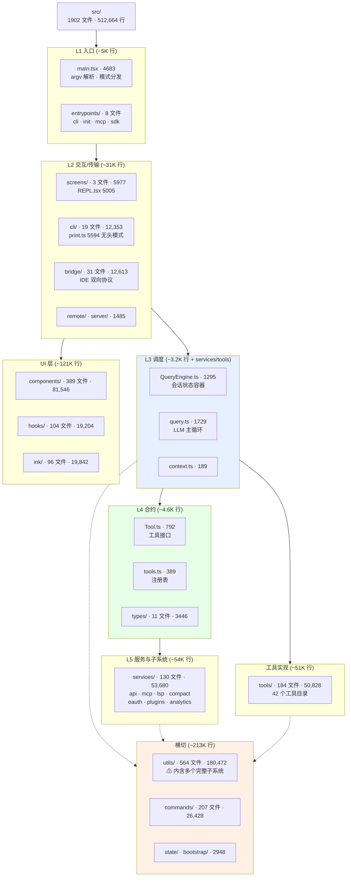
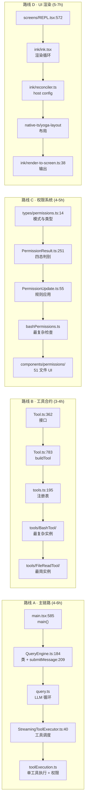

# 4. 代码库导览

## 摘要

1902 个文件、512,664 行、36 个顶层目录。本章是这片代码的地图:先给出目录树与规模热力图,再逐目录说清职责与关键文件,最后给出四条按目标裁剪的阅读路线和一份关键文件行号索引。核心结论只有一条:**`utils/` 占了 35% 的代码量,但它不是"杂物间"** —— `utils/permissions/`、`utils/bash/`、`utils/plugins/`、`utils/settings/`、`utils/hooks.ts` 是完整的子系统,只是被放在了这个名字下面。读懂这个目录的分层,就读懂了大半个 Claude Code。

## 速赢

- **`utils/` 是最大的误导**。564 文件 / 180K 行,其中 `utils/bash/`(23 文件,含 4436 行的 shell 解析器)和 `utils/permissions/`(24 文件)是货真价实的子系统。
- **10 个文件超过 2500 行**,合计约 4 万行,占全码库 8%。先啃这 10 个,收益最高。
- **`src/tools/` 42 个目录 ≈ 42 种能力**。想知道"它能做什么",`ls src/tools/` 比读任何文档都快。
- **`components/permissions/` 有 51 个文件** —— 比 `components/messages/`(41)还多。权限 UI 的复杂度是这个产品的一张名片。
- **入口只有一个**:`src/main.tsx:585` 的 `main()`。五种运行形态都从这里分叉。

---

## 7.1 全景图



> 分层归属沿用 `04-architect/25-layered-arch.md` 的五层模型。本章补充的是**规模**与**目录内部结构**两个维度。

---

## 7.2 规模热力图

按行数降序,实测数据:

| 排名 | 目录 | 文件 | 行数 | 占比 | 热度 |
|---:|---|---:|---:|---:|---|
| 1 | `utils/` | 564 | 180,472 | 35.2% | ██████████████████ |
| 2 | `components/` | 389 | 81,546 | 15.9% | ████████ |
| 3 | `services/` | 130 | 53,680 | 10.5% | █████ |
| 4 | `tools/` | 184 | 50,828 | 9.9% | █████ |
| 5 | `commands/` | 207 | 26,428 | 5.2% | ███ |
| 6 | `ink/` | 96 | 19,842 | 3.9% | ██ |
| 7 | `hooks/` | 104 | 19,204 | 3.7% | ██ |
| 8 | `bridge/` | 31 | 12,613 | 2.5% | █ |
| 9 | `cli/` | 19 | 12,353 | 2.4% | █ |
| 10 | `screens/` | 3 | 5,977 | 1.2% | ▌ |
| 11 | `native-ts/` | 4 | 4,081 | 0.8% | ▌ |
| 12 | `skills/` | 20 | 4,066 | 0.8% | ▌ |
| 13 | `entrypoints/` | 8 | 4,051 | 0.8% | ▌ |
| 14 | `types/` | 11 | 3,446 | 0.7% | ▌ |
| 15 | `tasks/` | 12 | 3,286 | 0.6% | ▌ |
| 16 | `keybindings/` | 14 | 3,159 | 0.6% | ▌ |
| 17 | `constants/` | 21 | 2,648 | 0.5% | ▌ |
| 18 | `bootstrap/` | 1 | 1,758 | 0.3% | ▏ |
| 19 | `memdir/` | 8 | 1,736 | 0.3% | ▏ |
| 20 | `vim/` | 5 | 1,513 | 0.3% | ▏ |
| — | 其余 16 个目录 | 74 | ~9,000 | 1.8% | ▏ |
| — | 顶层 `.ts`/`.tsx` 文件 | 18 | 16,079 | 3.1% | █ |

**三个立即可得的判断**:

1. **`utils/` 一家独大(35%)** —— 这不是坏味道,是命名问题。见 §7.4。
2. **UI 三件套(`components` + `hooks` + `ink`)合计 23.5%** —— 一个 CLI 工具把近四分之一代码花在终端渲染上,说明"终端 TUI 体验"是核心竞争力而非附属品。
3. **`tools/`(9.9%)小于 `components/`(15.9%)** —— 实现能力的代码比展示能力的代码少。反直觉,但符合"执行体"产品的现实:难的不是执行,是让人看懂并控制执行。

---

## 7.3 顶层文件

`src/` 根目录的 18 个文件,是全码库的骨架:

| 文件 | 行数 | 职责 | 层 |
|---|---:|---|---|
| `main.tsx` | 4683 | **总入口**。argv 解析、模式分发、Commander 定义 | L1 |
| `query.ts` | 1729 | **LLM 主循环**。流式消费、content block 拆解、工具分发 | L3 |
| `QueryEngine.ts` | 1295 | **会话状态容器**。`submitMessage` 生成器 | L3 |
| `Tool.ts` | 792 | **工具合约**。`Tool<Input,Output,P>` + `buildTool` | L4 |
| `commands.ts` | 754 | **命令注册表**。`COMMANDS` memoized 数组 | L4 |
| `setup.ts` | 477 | 首次运行引导 | L1 |
| `history.ts` | 464 | 输入历史 | L2 |
| `tools.ts` | 389 | **工具注册表**。条件组装 `Tools[]` | L4 |
| `interactiveHelpers.tsx` | 365 | 交互式辅助 | L2 |
| `cost-tracker.ts` | 323 | 成本累计 | 横切 |
| `context.ts` | 189 | 会话上下文(`getUserContext`) | L3 |
| `dialogLaunchers.tsx` | 132 | 对话框启动 | L2 |
| `Task.ts` | 125 | 任务类型 | L4 |
| `ink.ts` | 85 | Ink 导出聚合 | UI |
| `projectOnboardingState.ts` | 83 | 项目引导状态 | 横切 |
| `tasks.ts` | 39 | 任务注册 | L4 |
| `replLauncher.tsx` | 22 | REPL 启动器 | L1 |
| `costHook.ts` | 22 | 成本 hook | 横切 |

**读源码的第一站永远是这 18 个文件**。它们定义了所有核心抽象,其余 1884 个文件都是这些抽象的实现或消费者。

---

## 7.4 `utils/` 拆解 —— 最重要的一节

564 文件 / 180,472 行。如果把它当"杂物间"读,你会迷路。正确的读法是:**它是若干个子系统 + 一层真正的工具函数**。

### 内含的子系统(按文件数)

| 子目录 | 文件 | 实际身份 |
|---|---:|---|
| `utils/plugins/` | 44 | **插件子系统**。`loadPluginCommands.ts`、`pluginLoader.ts`(3302 行)、`marketplaceManager.ts`(2643 行) |
| `utils/permissions/` | 24 | **权限子系统**。`PermissionResult.ts`、`PermissionUpdate.ts`、`PermissionMode.ts`、`autoModeState.ts` |
| `utils/bash/` | 23 | **Shell 解析子系统**。`bashParser.ts`(4436 行)、`ast.ts`(2679 行) |
| `utils/swarm/` | 22 | 多 Agent 集群协调 |
| `utils/settings/` | 19 | **配置子系统**。五层加载、`SettingsJson` 类型(`types.ts:1104`) |
| `utils/hooks/` | 17 | **Hook 子系统**(事件定义;执行逻辑在 `utils/hooks.ts`,5022 行) |
| `utils/model/` | 16 | 模型选择、能力探测、fallback |
| `utils/computerUse/` | 15 | 计算机使用能力 |
| `utils/shell/` | 10 | Shell 环境探测与持久会话 |
| `utils/telemetry/` | 9 | **遥测子系统**(OTel) |
| `utils/claudeInChrome/` | 7 | 浏览器集成 |
| `utils/secureStorage/` | 6 | **凭据存储**(Keychain + 降级) |
| `utils/deepLink/` | 6 | 深链接(`cc://`) |
| `utils/task/` / `utils/suggestions/` / `utils/nativeInstaller/` | 各 5 | 任务 / 建议 / 安装器 |
| `utils/processUserInput/` | 4 | **输入处理管线**(`processUserInput.ts`) |
| `utils/teleport/` | 4 | 会话迁移 |
| `utils/git/` / `utils/powershell/` | 各 3 | Git / PowerShell |

### `utils/` 根目录的重量级文件

| 文件 | 行数 | 实际身份 |
|---|---:|---|
| `messages.ts` | 5512 | **消息处理核心**。序列化、归一化、内容块操作 |
| `sessionStorage.ts` | 5105 | **持久化子系统**。transcript JSONL 读写(`recordTranscript` 在 `:1408`) |
| `hooks.ts` | 5022 | **Hook 执行引擎** |
| `attachments.ts` | 3997 | 附件处理(图片、文件、粘贴内容) |
| `auth.ts` | 2002 | 认证流程编排 |
| `config.ts` | 1817 | 配置读写 |
| `Cursor.ts` | 1530 | 文本光标模型(供 PromptInput) |
| `worktree.ts` | 1519 | git worktree 管理 |
| `ide.ts` | 1494 | IDE 检测与集成 |
| `claudemd.ts` | 1479 | `CLAUDE.md` 加载与排除规则 |
| `analyzeContext.ts` | 1382 | 上下文分析(`/context` 命令) |
| `teammateMailbox.ts` | 1183 | Agent 间消息队列 |
| `fileHistory.ts` | 1115 | 文件修改历史(供 `--rewind-files`) |
| `ripgrep.ts` | — | ripgrep 三态定位 |

> **给 fork 者的建议**:如果你要重构这份代码,`utils/` 的拆分是第一优先级。把 `utils/bash/`、`utils/permissions/`、`utils/plugins/`、`utils/settings/` 提到与 `services/` 同级,目录结构会立刻反映真实架构。当前的命名让新人误以为这些是辅助函数。

---

## 7.5 其余目录职责表

### `tools/` — 42 个能力目录

```
AgentTool          AskUserQuestionTool  BashTool           BriefTool
ConfigTool         EnterPlanModeTool    EnterWorktreeTool  ExitPlanModeTool
ExitWorktreeTool   FileEditTool         FileReadTool       FileWriteTool
GlobTool           GrepTool             ListMcpResourcesTool  LSPTool
McpAuthTool        MCPTool              NotebookEditTool   PowerShellTool
ReadMcpResourceTool  RemoteTriggerTool  REPLTool           ScheduleCronTool
SendMessageTool    SkillTool            SleepTool          SyntheticOutputTool
TaskCreateTool     TaskGetTool          TaskListTool       TaskOutputTool
TaskStopTool       TaskUpdateTool       TeamCreateTool     TeamDeleteTool
TodoWriteTool      ToolSearchTool       WebFetchTool       WebSearchTool
shared/            testing/             utils.ts
```

每个目录的典型结构:`<Name>Tool.tsx`(`buildTool({...})` 定义)、`prompt.ts`(系统提示片段)、`<Name>ToolMessage.tsx`(渲染)、可选的 `permissions.ts`。

**`BashTool` 是最大的一个**,它的权限逻辑(`bashPermissions.ts`)与 `utils/bash/` 的 4436 行解析器耦合 —— 见 `01-foundation/01-background.md` §4.2 对"为什么需要 shell 解析器"的说明。

### `services/` — 33 个服务

| 子目录/文件 | 职责 | 规模提示 |
|---|---|---|
| `api/` | Anthropic Messages API 客户端 | `claude.ts` 3419 行 |
| `mcp/` | MCP 协议实现,6 种 transport | 23 文件,`client.ts` 3348 行 |
| `compact/` | 五种上下文压缩 | `compact` / `autoCompact` / `microCompact` / `reactiveCompact` / `sessionMemoryCompact` |
| `lsp/` | 语言服务器集成 | 7 文件,含 `passiveFeedback.ts` |
| `plugins/` | 插件安装/市场 | — |
| `oauth/` | OAuth 2.0 + PKCE | 5 文件 |
| `analytics/` | GrowthBook / Datadog / 事件上报 | 9 文件 |
| `tools/` | **工具执行调度**(不是工具实现) | `StreamingToolExecutor.ts`、`toolExecution.ts` 1745 行 |
| `SessionMemory/` | 会话记忆与自动总结 | — |
| `extractMemories/` | 记忆抽取 | — |
| `teamMemorySync/` | 团队记忆同步 | — |
| `policyLimits/` | 速率/配额 | — |
| `remoteManagedSettings/` | 企业托管配置 | — |
| `AgentSummary/` `toolUseSummary/` `PromptSuggestion/` `tips/` | 辅助生成 | — |
| `voice*.ts` `autoDream/` `MagicDocs/` `awaySummary.ts` | 实验性功能 | 多受 `feature()` 控制 |

> **注意 `services/tools/`**:它是**调度层**(L3),不是工具实现(`src/tools/` 才是)。这个命名冲突是初读时最常见的困惑点。

### `components/` — UI 组件

| 子目录 | 文件 | 说明 |
|---|---:|---|
| `permissions/` | 51 | **最大**。各类权限对话框、模式切换、规则编辑 |
| `messages/` | 41 | 消息渲染(user/assistant/tool_use/tool_result/system) |
| `agents/` | 26 | 子 Agent 视图 |
| `PromptInput/` | 21 | 输入框(含 Vim 模式) |
| `design-system/` | 16 | 基础组件 |
| `LogoV2/` | 15 | 启动 logo 动画 |
| `mcp/` | 13 | MCP 连接管理 UI |
| `tasks/` / `Spinner/` | 各 12 | 任务视图 / 加载动画 |
| `CustomSelect/` | 10 | 选择器 |
| `FeedbackSurvey/` | 9 | 反馈问卷 |

### 其余目录一览

| 目录 | 文件 | 职责 |
|---|---:|---|
| `commands/` | 207 | 60+ 个 `/` 命令的实现,每个一目录或一文件 |
| `hooks/` | 104 | React hooks(注意:**不是** Hook 扩展点,那是 `utils/hooks.ts`) |
| `ink/` | 96 | 自建 Ink(reconciler / dom / termio / layout / hit-test / bidi) |
| `bridge/` | 31 | IDE 双向协议,`bridgeMain.ts` 2999 行 |
| `cli/` | 19 | 无头模式(`print.ts` 5594)、传输、退出处理 |
| `constants/` | 21 | 常量、密钥、产品字符串 |
| `skills/` | 20 | 内建 Skill |
| `keybindings/` | 14 | 快捷键调度 |
| `tasks/` | 12 | 后台任务 |
| `types/` | 11 | 共享类型:`command` / `hooks` / `permissions` / `plugin` / `ids` / `logs` |
| `migrations/` | 11 | 配置迁移 |
| `context/` | 9 | React context |
| `memdir/` | 8 | 记忆目录与 scratchpad |
| `entrypoints/` | 8 | `cli.tsx` / `init.ts` / `mcp.ts` / `sdk/` / `agentSdkTypes.ts` |
| `state/` | 6 | `AppState.tsx` 跨层状态总线 + store |
| `buddy/` | 6 | 实验性协作功能 |
| `vim/` | 5 | Vim 模式实现 |
| `native-ts/` | 4 | yoga-layout / color-diff / file-index 纯 TS 移植 |
| `remote/` | 4 | 远程会话 |
| `query/` | 4 | 查询辅助 |
| `screens/` | 3 | `REPL.tsx` / `ResumeConversation.tsx` / `Doctor.tsx` |
| `server/` | 3 | 本地 HTTP/WS server 模式 |
| `bootstrap/` | 1 | `state.ts` 1758 行,全局运行时状态 |
| `upstreamproxy/` `schemas/` `plugins/` `outputStyles/` `assistant/` `voice/` `moreright/` | 1-2 | 小型辅助 |

### 两组危险的同名目录

| 名字 | 位置 A | 位置 B | 区别 |
|---|---|---|---|
| `hooks` | `src/hooks/`(104 文件) | `src/utils/hooks.ts` + `src/utils/hooks/` | A 是 **React hooks**;B 是 **Hook 扩展点**(PreToolUse 等) |
| `tools` | `src/tools/`(184 文件) | `src/services/tools/` | A 是**工具实现**;B 是**工具执行调度** |
| `plugins` | `src/plugins/`(2 文件) | `src/utils/plugins/`(44) + `src/services/plugins/` | A 是注册目录;B 是加载逻辑;C 是安装/市场 |

初读时至少有一半的"我找不到这个功能"源于这三组混淆。

---

## 7.6 推荐阅读顺序

四条路线,按目标裁剪。每条都给出终点验收标准。



### 路线 A:主链路(推荐所有人先走一遍)

| 步 | 文件 | 看什么 |
|---|---|---|
| 1 | `src/main.tsx:585` | `main()` 如何分发到五种运行形态 |
| 2 | `src/QueryEngine.ts:184` | 会话级可变状态有哪些 |
| 3 | `src/QueryEngine.ts:209` | `submitMessage` 一轮的完整顺序 |
| 4 | `src/query.ts` | 流式响应如何拆成 content block |
| 5 | `src/services/tools/StreamingToolExecutor.ts:40` | 并发调度策略 |
| 6 | `src/services/tools/toolExecution.ts` | 权限闸门在哪里插入 |

**验收**:能画出"用户敲回车 → 文件被修改"的完整调用链,并说出权限检查发生在第几步。

### 路线 B:工具合约(想写工具/MCP server)

**验收**:能不看文档写出一个新工具的骨架,并说清不实现 `isConcurrencySafe` 会发生什么。

### 路线 C:权限系统(想理解安全模型)

**验收**:能说出 `passthrough` 为什么必须存在,以及五层判定链的顺序。

### 路线 D:UI 渲染(想理解 TUI)

**验收**:能说出一次 React state 变更到终端字符输出经过了哪些转换。

### 通用技巧

- **从类型定义进入,不从实现进入**。`Tool.ts`、`types/permissions.ts`、`types/message.ts` 三个文件的信息密度远高于任何实现文件。
- **看到 `feature('X')` 先查开关表**,否则你会花时间读一段在你的构建里根本不存在的代码。
- **`src/bootstrap/state.ts`(1758 行)是全局状态字典**。任何"这个值从哪来"的问题,先在这里搜。
- **注释密度高的地方是设计决策点**。源码里的长注释(如 `native-ts/yoga-layout/index.ts:1-8`、`telemetry/instrumentation.ts:167`)几乎都在解释"为什么这样做",信息价值极高。

---

## 7.7 关键文件行号索引

全部经过实测校验(对应本快照,见 `00-front/01-leak-context.md` §1.4/L2 关于行号失效的说明)。

### 入口与主链路

| 锚点 | 内容 |
|---|---|
| `src/main.tsx:585` | `export async function main()` —— 总入口 |
| `src/main.tsx:591` | `NoDefaultCurrentDirectoryInExePath = '1'` —— Windows PATH 劫持防御 |
| `src/main.tsx:598` | SIGINT 处理(print 模式特判) |
| `src/main.tsx:612` | `feature('DIRECT_CONNECT')` —— `cc://` 深链接 |
| `src/main.tsx:968` | `program.name('claude')` —— Commander 定义起点 |
| `src/main.tsx:976` | `-p` / `--bare` / `--output-format` 等核心选项 |
| `src/QueryEngine.ts:1` | `import { feature } from 'bun:bundle'` |
| `src/QueryEngine.ts:184` | `class QueryEngine` |
| `src/QueryEngine.ts:200` | 构造函数 |
| `src/QueryEngine.ts:209` | `async *submitMessage()` |

### 工具合约

| 锚点 | 内容 |
|---|---|
| `src/Tool.ts:358` | `findToolByName()` |
| `src/Tool.ts:362` | `export type Tool<Input, Output, P>` |
| `src/Tool.ts:378` | `searchHint?` —— ToolSearch 延迟加载 |
| `src/Tool.ts:379` | `call()` 签名 |
| `src/Tool.ts:394-397` | `inputSchema` / `inputJSONSchema` 双路径 |
| `src/Tool.ts:402-406` | `isConcurrencySafe` / `isEnabled` / `isReadOnly` / `isDestructive` |
| `src/Tool.ts:407-414` | `interruptBehavior` 注释(`cancel` vs `block`) |
| `src/Tool.ts:783` | `buildTool()` |
| `src/tools.ts:195` | 工具注册数组起点 |
| `src/tools.ts:201` | `hasEmbeddedSearchTools()` 条件注册 Glob/Grep |
| `src/tools.ts:225` | `isWorktreeModeEnabled()` 条件注册 Worktree 工具 |

### 命令

| 锚点 | 内容 |
|---|---|
| `src/commands.ts:59` | `import { feature } from 'bun:bundle'` |
| `src/commands.ts:254` | `INTERNAL_ONLY_COMMANDS` 数组收尾 |
| `src/commands.ts:258` | `const COMMANDS = memoize(...)` —— 注册表 |
| `src/commands.ts:343` | `USER_TYPE === 'ant'` 内部命令闸门 |
| `src/commands.ts:348` | `builtInCommandNames` |

### 运行时与技术栈

| 锚点 | 内容 |
|---|---|
| `src/utils/bundledMode.ts:7` | `isRunningWithBun()` |
| `src/utils/bundledMode.ts:16` | `isInBundledMode()` |
| `src/utils/ripgrep.ts:24` | `RipgrepConfig` 三态 |
| `src/native-ts/yoga-layout/index.ts:1` | yoga 移植动机注释 |
| `src/ink/reconciler.ts:4` | `createReconciler` |
| `src/utils/telemetry/instrumentation.ts:166` | gRPC 懒加载 |
| `src/services/analytics/growthbook.ts:1` | GrowthBook 引入 |

### 权限与安全

| 锚点 | 内容 |
|---|---|
| `src/types/permissions.ts:14-40` | `INTERNAL_PERMISSION_MODES` |
| `src/types/permissions.ts:44` | `PermissionBehavior` |
| `src/types/permissions.ts:54-94` | `PermissionRule` / `PermissionUpdateDestination` |
| `src/utils/permissions/PermissionResult.ts:251` | `PermissionResult` 判别联合 |
| `src/utils/permissions/PermissionUpdate.ts:55` | `applyPermissionUpdate()` |
| `src/utils/permissions/autoModeState.ts:11` | Auto Mode 状态 |
| `src/tools/BashTool/bashPermissions.ts:1491` | `peekSpeculativeClassifierCheck` |

### 状态与持久化

| 锚点 | 内容 |
|---|---|
| `src/bootstrap/state.ts:431` | `getSessionId()` |
| `src/bootstrap/state.ts:435` | `regenerateSessionId()` |
| `src/utils/sessionStorage.ts:101` | `Transcript` 类型 |
| `src/utils/sessionStorage.ts:1408` | `recordTranscript()` |
| `src/utils/settings/types.ts:1104` | `SettingsJson` |
| `src/state/AppState.tsx` | 跨层状态总线 |

### 执行与子系统

| 锚点 | 内容 |
|---|---|
| `src/services/tools/StreamingToolExecutor.ts:40` | 类定义 |
| `src/services/tools/StreamingToolExecutor.ts:69` | `discard()` —— tombstone 生成 |
| `src/services/tools/toolExecution.ts:283` | `findMcpServerConnection()` |
| `src/services/compact/autoCompact.ts:160` | `shouldAutoCompact()` |
| `src/utils/hooks/hookEvents.ts:51-91` | `HookExecutionEvent` |
| `src/utils/processUserInput/processUserInput.ts:85` | `processUserInput()` |
| `src/utils/queryContext.ts:44` | `fetchSystemPromptParts()` |
| `src/context.ts:155` | `getUserContext()` |
| `src/screens/REPL.tsx:572` | `REPL()` 组件 |
| `src/ink/render-to-screen.ts:38` | 渲染池 |

---

## 反模式

1. **"`utils/` 是杂物间,可以跳过"** —— 它含 35% 的代码和至少 6 个完整子系统。跳过它等于跳过权限、Shell 解析、插件、配置、持久化。
2. **"`src/hooks/` 是 Hook 扩展点"** —— 不是。那是 React hooks。扩展点在 `src/utils/hooks.ts`(5022 行)和 `src/utils/hooks/`。
3. **"`src/services/tools/` 是工具实现"** —— 不是。那是调度层。实现在 `src/tools/`。
4. **"按目录字母序读"** —— `assistant/` 排第一但只有 87 行且是实验性功能。按 §7.6 的路线读,不要按 `ls` 的顺序。
5. **"文件大 = 质量差"** —— `print.ts` 5594 行、`messages.ts` 5512 行确实偏大,但它们是**热路径的集中处**。在一个要控制模块加载开销的项目里,过度拆分文件本身也有代价。这是取舍,不是疏忽。

---

## 引用

**前置**
- `00-front/01-leak-context.md` —— 规模数据来源与行号有效期说明(§1.2、§1.4/L2)。
- `00-front/03-glossary.md` —— 目录职责表中出现的术语。
- `01-foundation/02-tech-stack.md` —— `ink/`、`native-ts/`、`services/` 的技术选型背景。

**平行**
- `01-foundation/01-background.md` —— `tools/` 42 个目录对应的能力矩阵。
- `01-foundation/03-feature-flags.md` —— 条件注册与 `feature()` 守卫的完整清单。

**后继**
- `02-user/` —— `commands/` 207 文件对应的用户可见命令。
- `03-developer/` —— `Tool.ts` 合约与 `tools/` 目录的实现范式。
- `04-architect/25-layered-arch.md` —— 本章的目录规模数据在那里被组织成五层依赖模型。

**源码定位**
- `src/main.tsx:585` —— `main()`,所有阅读路线的起点
- `src/QueryEngine.ts:184` —— `QueryEngine` 类,主链路核心
- `src/Tool.ts:362` —— `Tool` 接口,合约层原点
- `src/tools.ts:195-246` —— 工具注册表,能力清单
- `src/commands.ts:258-346` —— `COMMANDS` 注册表,命令清单
- `src/bootstrap/state.ts:431` —— 全局状态字典,"这个值从哪来"的第一站
