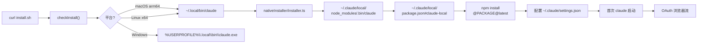
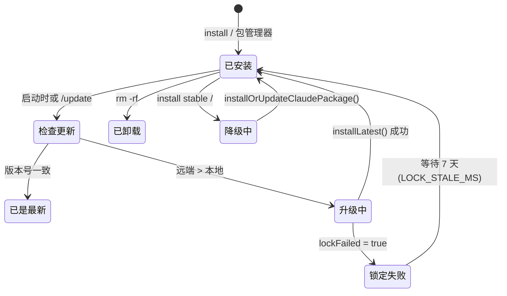

# 第 4 章 安装 Claude Code CLI

> **本章定位**:用户视角第 1 章,聚焦"把 Claude Code 装上并验证它能跑"。涵盖包管理器选型、系统要求、原生安装器、安装/升级/降级/卸载四个生命周期动作,以及验证步骤。

## 摘要

Claude Code CLI 走 **Native Installer + 本地包管理** 双轨制:启动器(`~/.local/bin/claude`)由原生安装器负责,实际可执行文件 `~/.claude/local/node_modules/.bin/claude` 由 npm 拉取。安装完成后,首次启动会触发交互式 OAuth 登录。整套流程跨 macOS / Linux / Windows,在 2026 年的版本中不再推荐全局 `npm install -g`,而是优先原生路径以避免 EACCES。

## 速赢

- **一行装好**:`curl -fsSL https://claude.com/install | bash`(macOS / Linux 原生安装器,内部走 `npm install`)。
- **验证三件套**:`which claude`、`claude --version`、`claude --help`。
- **升级**:`claude update`(就地小版本)或 `claude install latest`(强制重装)。**降级**:`claude install stable` 或 `claude install <version>`。
- **卸载干净**:`rm -rf ~/.local/bin/claude ~/.local/share/claude ~/.claude/local ~/.config/claude`,然后 `hash -r`(bash) / `rehash`(zsh) 刷新 PATH 缓存。
- **不要全局 npm**:全局 `npm i -g @anthropic-ai/claude-code` 会污染 `/usr/local/lib/node_modules` 并与 Homebrew 冲突,已逐步淘汰,源码中 `MACRO.PACKAGE_URL` 仅指向本地 tarball(`src/utils/localInstaller.ts:115`)。

## 关键图(2 张)

### 4.1 安装路径总览



### 4.2 安装 / 升级 / 卸载生命周期



## 详细机制

### 4.1 系统要求

| 项目 | 最低 | 推荐 |
|---|---|---|
| OS | macOS 12+ / Ubuntu 20.04+ / Windows 10+ | macOS 14+ / Ubuntu 22.04+ |
| Node | 18.0(Bun 打包后不强制,但 npm 子进程仍要) | 22 LTS |
| 内存 | 1 GB 可用 | 4 GB+(大模型上下文) |
| 磁盘 | 600 MB(`~/.claude/local` + cache) | 2 GB+(`~/.claude/projects` 累积) |
| 网络 | HTTPS 出站到 `api.anthropic.com` / `platform.claude.com` | 同左,无代理或可信代理 |
| 终端 | 任意 VT100;Ink 渲染需要 256 色 | 真彩终端 + Unicode |

`src/utils/envUtils.ts:7-14` 用 `memoize` 缓存 `CLAUDE_CONFIG_DIR`,默认 `~/.claude`,通过 `getClaudeConfigHomeDir()` 暴露。Windows 上 `getLocalClaudePath()`(`src/commands/install.tsx:42-52`)返回 `~\.local\bin\claude.exe`。

### 4.2 包管理器选择

| 安装方式 | 命令 | 适用场景 | 副作用 |
|---|---|---|---|
| 原生安装器(推荐) | `curl -fsSL https://claude.com/install \| bash` | 99% 的个人用户 | `~/.local/bin/claude` 启动器 + `~/.claude/local/node_modules` 实际包 |
| npm 全局 | `npm i -g @anthropic-ai/claude-code` | 受限于企业镜像源的用户 | EACCES、PATH 漂移、与 Homebrew 冲突 |
| pnpm 全局 | `pnpm add -g @anthropic-ai/claude-code` | pnpm-only 环境 | 类似 npm |
| Bun | `bun add -g @anthropic-ai/claude-code` | Bun-first 工具链 | Bun runtime 兼容,目前 CLI 内部 Bun 仅打包时使用 |
| Homebrew | `brew install claude-code`(社区 tap) | macOS 用户 | 已被官方推荐原生命令取代 |

源码侧 `localInstaller.ts:97-138` 中的 `installOrUpdateClaudePackage()` 强制走 `npm install <pkg>@<version>`,**不接受 pnpm / Bun**,这是设计选择:让 npm 的 `peerDependencies` 解析成为单一事实。

### 4.3 安装步骤(以 macOS 原生安装器为例)

```bash
# 1. 下载安装脚本并执行
curl -fsSL https://claude.com/install | bash

# 2. 安装器内部动作(等价):
#    - 创建 ~/.local/bin
#    - 写入 ~/.local/bin/claude (POSIX sh 包装)
#    - mkdir -p ~/.claude/local
#    - echo '{}' > ~/.claude/local/package.json
#    - npm install @anthropic-ai/claude-code@latest --prefix ~/.claude/local
#    - chmod 755 ~/.local/bin/claude

# 3. 确保 ~/.local/bin 在 PATH 之前
echo 'export PATH="$HOME/.local/bin:$PATH"' >> ~/.zshrc
exec $SHELL

# 4. 验证
which claude   # 应输出 /Users/<you>/.local/bin/claude
claude --version
```

启动器是一个 23 字节的 sh 包装(`src/utils/localInstaller.ts:77`):

```sh
#!/bin/sh
exec "${LOCAL_INSTALL_DIR}/node_modules/.bin/claude" "$@"
```

它把所有参数透传给真正的 npm 安装产物。这种 "薄包装 + 厚包" 的拆分,使得 `installLatest()` 只换 `node_modules` 而不必重写 PATH。

### 4.4 验证安装

```bash
which claude          # 启动器路径
claude --version      # 真实版本(从 package.json)
claude doctor         # 自检命令(参见 03 章)
claude --help         # 输出完整 CLI 选项,按字母排序
```

`claude --help` 的排序由 `src/main.tsx:890-901` 的 `createSortedHelpConfig()` 强制按 long option 字母序,这是 commander.js 的非默认行为,便于机器阅读。

### 4.5 升级

```bash
# 方式一:启动器自动检查(默认每天一次,后台)
# 进程内 AutoUpdater 在 SETTING.autoUpdaterInterval 触发

# 方式二:手动
claude update         # 异步小版本
claude install latest # 强制 latest channel
claude install stable # 切到 stable channel
claude install 1.0.34 # 钉死版本

# 方式三:原生安装器重装
curl -fsSL https://claude.com/install | bash
```

`installLatest()`(`src/commands/install.tsx:111`)调用 `nativeInstaller/installer.ts` 的同名实现,核心逻辑:

```typescript
// 伪代码(src/utils/nativeInstaller/installer.ts)
const result = await withLock(LOCK_FILE, async () => {
  const current = readInstalledVersion()
  const target = await fetchLatestVersion()
  if (current === target) return { wasUpdated: false }
  await downloadAndExtract(target, installDir) // 写入 ~/.claude/local/node_modules
  return { wasUpdated: true, latestVersion: target }
})
if (result.lockFailed) throw 'another process is currently installing'
```

锁定机制(`pidLock.ts`)使用 PID-based lock + 7 天 stale 阈值(`installer.ts:79`),允许从崩溃中恢复。**两个并行安装不会同时进行**,但其中一个会以 `lockFailed = true` 立刻返回。

### 4.6 降级

降级与升级走同一管道,但 channel 决定默认 tag:

```bash
claude install stable            # 切到 stable
claude install 1.0.34           # 钉到具体版本
claude install latest --force    # 强制重装 latest(忽略已是最新)
```

`Install` 组件(`src/commands/install.tsx:89-276`)在成功后调用 `updateSettingsForSource('userSettings', { autoUpdatesChannel: target })`,把用户的 channel 选择写入 `~/.claude/settings.json`,下一次 AutoUpdater 据此决定拉哪个 tag。

### 4.7 卸载

完全卸载需要清掉 4 个目录:

```bash
rm -rf ~/.local/bin/claude
rm -rf ~/.local/share/claude
rm -rf ~/.claude/local
rm -rf ~/.config/claude
hash -r   # bash 刷新 PATH 缓存
```

> **注意**:`rm -rf ~/.claude` 会一并删除**所有会话历史**(`projects/`)、**全局 memory**、**MCP 配置**,不可恢复。如只想卸 CLI,保留 `~/.claude/{projects,sessions,settings.json,memory}` 等。

`logout` 命令(`src/commands/logout/logout.tsx:16-48`)只清理 `secureStorage`、`globalConfig.oauthAccount` 等认证态,不删除会话文件;若想重置认证但保留会话,执行 `claude logout` 即可。

## 反模式

1. **混用全局 npm 与原生命令**:全局 `claude` 与 `~/.local/bin/claude` 会以 PATH 顺序抢占,版本错位时 `--version` 报一个、行为跑另一个。统一保留一条安装路径。
2. **在 CI 里跑交互式登录**:OAuth 浏览器流需要本地 8080 端口 + 浏览器回调。CI 用 `ANTHROPIC_API_KEY` 直连,详见 04c。
3. **盲目 `rm -rf ~/.claude`**:这是会话 + 配置的唯一副本。卸载前先 `tar czf claude-backup.tgz ~/.claude`。
4. **以 root 安装**:macOS 上 `/usr/local/bin` 由 SIP 保护,会触发 EACCES。`/usr/bin` 永远不要放。
5. **用 `sudo npm i -g` 修复权限**:把整条 node_modules 改成 root 拥有,后续 `npm update` 又要 sudo,陷入循环。正确做法是用原生安装器把包放到用户目录。

## 引用

- 前置:`00-front/03-glossary.md` (Tool / buildTool / SessionId / 关键术语)
- 前置:`01-foundation/02-tech-stack.md` (Bun 打包器、ink 渲染、npm 子进程)
- 前置:`01-foundation/03-feature-flags.md` (`NATIVE_INSTALLER` 等 build-time 开关)
- 前置:`01-foundation/04-codebase-tour.md` (目录速览)
- 平行:`02-user/04a-claudeai-auth.md` (首次启动触发 OAuth)
- 平行:`02-user/04b-oauth-flow.md` (浏览器 OAuth 完整时序)
- 后继:`02-user/04c-3p-providers.md` (Bedrock / Vertex / Foundry)
- 后继:`02-user/04d-onboarding.md` (/init、/memory)
- 后继:`02-user/05-daily-use.md` (日常会话)

## 源码定位

- `src/commands/install.tsx:89-276` — `Install` 组件,负责状态机 `checking → installing → setting-up → success/error`
- `src/utils/localInstaller.ts:56-138` — `ensureLocalPackageEnvironment` + `installOrUpdateClaudePackage`
- `src/utils/nativeInstaller/installer.ts:1-100+` — 原生安装器实现,含 lock、cleanup、shell alias
- `src/utils/secureStorage/index.ts:9-17` — macOS Keychain / Linux plaintext / fallback 选择
- `src/utils/autoUpdater.ts` — 后台检查更新逻辑(由 `src/components/AutoUpdater.tsx` 调用)