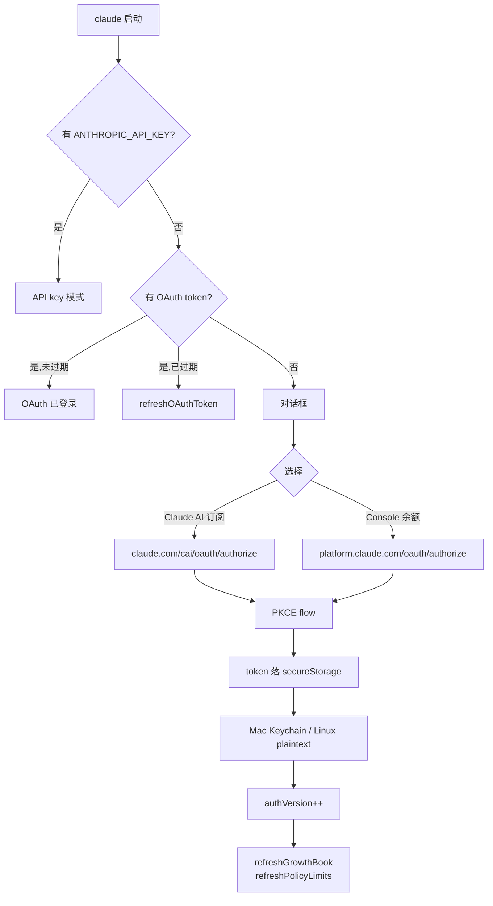
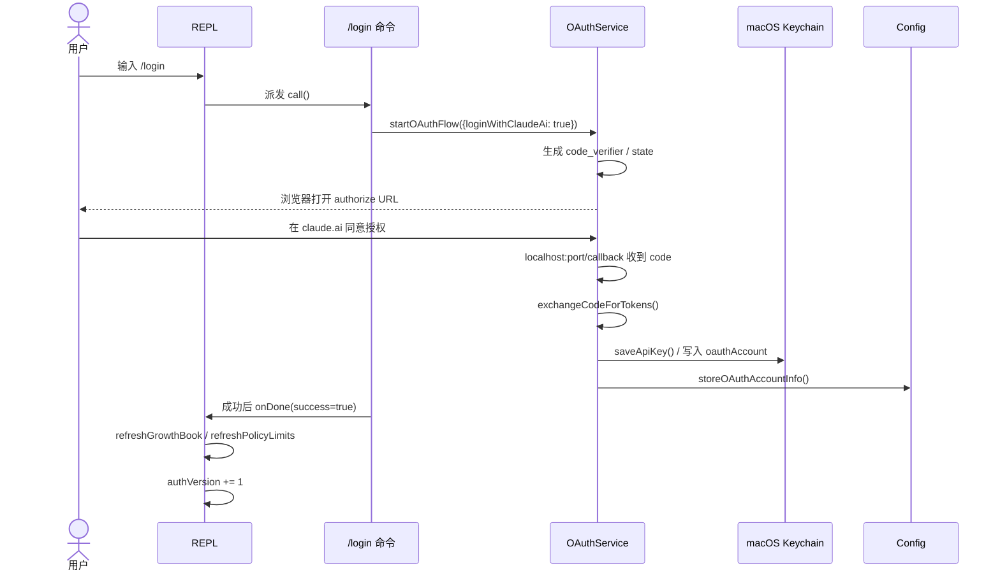

# 第 4a 章 Claude AI 订阅认证路径

> **本章定位**:`/login` 命令的人机交互面。把"启动 → 浏览器登录 → 落库"的整段体验讲透,**完整 OAuth 协议内幕放到 04b**;本章聚焦产品视角的开关、状态、故障处理。

## 摘要

Claude Code CLI 把"我有 claude.ai 订阅"或"我有 Anthropic Console 账户"这两类用户合并到同一个 `/login` 命令,UI 上区分 `Claude AI`(订阅,Pro/Max/Team/Enterprise)和 `Console`(API key 余额)。OAuth 2.0 + PKCE 是统一底座,token 落到 macOS Keychain(其他平台 plaintext),刷新周期 1 年(inference-only)。本章围绕"怎么登、怎么切、怎么查、怎么断"展开。

## 速赢

- **默认走 OAuth**:`claude`(无 token)首次启动弹 `<Login>` 对话框,走浏览器流;**不需要先开 Console 拿 API key**。
- **查看当前登录态**:`/status`(显示订阅类型、rate limit tier、过期时间);`/logout`(清除 token + 缓存,不删会话)。
- **多账户**:`login/logout/login` 顺序覆盖即可,Keychain 只存**单槽**(新 token 覆盖旧)。
- **Token 失败三件套**:① `/logout && claude` 重登;② 删除 `~/.claude/.credentials.json`;③ 网络受限换 `CLAUDE_CODE_USE_BEDROCK=1`(见 04c)。
- **`/login` 不出现在某些 build 里**:如果 `DISABLE_LOGIN_COMMAND=1`,命令直接 hidden(`src/commands/login/index.ts:12`);CI / 容器环境多用 API key 模式。

## 关键图(2 张)

### 4a.1 登录决策树



### 4a.2 状态切换时序



## 详细机制

### 4a.1 适用人群与触发条件

`/login` 命令由 `src/commands/login/index.ts:5-14` 注册:

```typescript
export default () =>
  ({
    type: 'local-jsx',
    name: 'login',
    description: hasAnthropicApiKeyAuth()
      ? 'Switch Anthropic accounts'
      : 'Sign in with your Anthropic account',
    isEnabled: () => !isEnvTruthy(process.env.DISABLE_LOGIN_COMMAND),
    load: () => import('./login.js'),
  }) satisfies Command
```

描述文案会根据当前是否已用 `ANTHROPIC_API_KEY` 自动切换。`DISABLE_LOGIN_COMMAND` 在企业镜像 / 容器中常见,直接关闭 `/login` 命令。

适用人群:

| 场景 | 推荐路径 | 是否需要 OAuth |
|---|---|---|
| claude.ai Pro/Max/Team/Enterprise 订阅 | `/login` → Claude AI | 是 |
| Anthropic Console PAYG 余额 | `/login` → Console | 是 |
| AWS Bedrock 用户 | `CLAUDE_CODE_USE_BEDROCK=1` | 否(走 SigV4) |
| GCP Vertex 用户 | `CLAUDE_CODE_USE_VERTEX=1` | 否(走 ADC) |
| CI / 自动化 | `ANTHROPIC_API_KEY` 环境变量 | 否 |
| 自带 proxy / Foundry | `CLAUDE_CODE_USE_FOUNDRY=1` | 否 |

### 4a.2 启动交互式登录

三种进入登录 UI 的方式:

1. **首次启动自动触发**:无任何 token 时,REPL 渲染 `<Onboarding>`(`src/components/Onboarding.tsx`,原推断 `components/Onboarding/index.tsx` 父目录在泄露中不存在),在初始 setup 屏中嵌入 `<Login>`。
2. **`/login` 命令**:slash 命令触发 `Login` 组件(`src/commands/login/login.tsx:60-100`)。
3. **`claude logout && claude`**:登出后下次启动自动进入登录流。

`Login` 组件的关键代码:

```tsx
function Login(props) {
  const mainLoopModel = useMainLoopModel()
  const t0 = () => props.onDone(false, mainLoopModel)   // Esc 取消
  const t1 = () => props.onDone(true, mainLoopModel)    // 成功
  const t2 = <ConsoleOAuthFlow onDone={t1}
                              startingMessage={props.startingMessage} />
  return (
    <Dialog title="Login" onCancel={t0} color="permission"
            inputGuide={_temp}>
      {t2}
    </Dialog>
  )
}
```

成功回调里(`login.tsx:25-55`)触发一连串刷新:

- `context.onChangeAPIKey()` — 让 REPL 重新解析当前 API key
- `context.setMessages(stripSignatureBlocks)` — 剥掉签名块(避免 token 切换后旧签名被拒)
- `resetCostState()` — 重置计费统计
- `refreshRemoteManagedSettings()` — 拉新企业配置
- `refreshPolicyLimits()` — 拉新策略限额
- `resetUserCache()` — 清空用户数据缓存(GrowthBook 重新读)
- `refreshGrowthBookAfterAuthChange()` — 重读特性开关
- `clearTrustedDeviceToken()` + `enrollTrustedDevice()` — 远程控制信任设备登记
- `resetBypassPermissionsCheck()` + `checkAndDisableBypassPermissionsIfNeeded()` — bypass 模式可能因 org 变更被自动关闭
- `context.setAppState(prev => ({ ...prev, authVersion: prev.authVersion + 1 }))` — 让所有 hook 重新拉数据(MCP server、policy limits 等)

### 4a.3 OAuth 浏览器流概述

OAuth 服务由 `src/services/oauth/index.ts:21-198` 实现,核心入口 `startOAuthFlow()` 行为:

1. 启动本地 `AuthCodeListener`,监听 `localhost:<port>/callback`(`auth-code-listener.ts`)。
2. 生成 PKCE 对:`code_verifier`(32 字节随机)→ `code_challenge = base64url(SHA256(code_verifier))`(`src/services/oauth/crypto.ts:11-19`)。
3. 生成 `state`(防 CSRF 随机串)。
5. 构造两个 URL:`automatic`(localhost callback)+ `manual`(用户复制粘贴 code),**全部参数同 PKCE**(见 `client.ts:46-105`)。
6. 同时打开浏览器(`openBrowser`)并等待 callback 或手动粘贴 code。
7. 拿到 `authorizationCode` 后,POST 到 `TOKEN_URL` 换 access_token + refresh_token。
8. 调用 `fetchProfileInfo(accessToken)` 拿到 `subscriptionType`(max/pro/team/enterprise)、`rateLimitTier`、组织信息。
9. 把 token 写到 `secureStorage`(macOS Keychain / Linux plaintext),把 profile 写到 `globalConfig.oauthAccount`。

> **协议详细内幕、token 生命周期、Keychain 槽位**见 04b,本章不重复。

### 4a.4 登录状态查看

| 命令 | 输出 | 源码 |
|---|---|---|
| `/status` | 当前账户、订阅、token 过期、region | `src/commands/status/` |
| `/logout` | 注销(不删会话) | `src/commands/logout/logout.tsx:16-48` |
| `/login` | 登录或切换账户 | `src/commands/login/login.tsx` |

`/status` 显示的实际字段由 `globalConfig.oauthAccount` + `getClaudeAIOAuthTokens()` 共同决定。token 本身不直接打印(`getClaudeAIOAuthTokens()` 返回结构体,但 UI 只读 `expiresAt`),避免泄漏。

也可以直接读配置文件查看:

```bash
# macOS
security find-generic-password -s "Claude Code-credentials" -w

# Linux / Windows
cat ~/.claude/.credentials.json
```

### 4a.5 多账户管理

Claude Code CLI 不支持"同时多账户登录",只有一个槽位。切换流程:

1. `/logout` — 清空 token + oauthAccount
2. `/login` — 选另一个账户走 OAuth

若你想保留 A 账户的会话历史但用 B 账户提问:

```bash
CLAUDE_CONFIG_DIR=~/.claude-b claude   # 完整独立环境
```

`CLAUDE_CONFIG_DIR` 切换后,所有配置 / 会话 / memory 都隔离(`src/utils/envUtils.ts:7-14`),可用于"工作账户 vs 个人账户"。

### 4a.6 常见问题

| 现象 | 原因 | 解决 |
|---|---|---|
| 浏览器打开后白屏 | 网络受限,`claude.com/cai/oauth/authorize` 不可达 | ① 挂代理 ② 切换 Console 路径 |
| `state mismatch` | 浏览器被中间人替换或本地时间偏移过大 | 检查系统时间;`/logout && claude` 重来 |
| token 频繁过期 | refresh_token 也过期或被服务端撤销 | `/logout && claude`,确认账户未被禁用 |
| `Cannot find module 'macos-keychain'` | 不支持的平台或 Node 版本 | 升级 Node ≥ 18;Linux 用 plaintext 兜底 |
| `/login` 命令被禁用 | `DISABLE_LOGIN_COMMAND=1` | `unset DISABLE_LOGIN_COMMAND` |
| 想用 API key 而不是 OAuth | 容器 / CI 场景 | `export ANTHROPIC_API_KEY=sk-ant-...` |

### 4a.7 自动化场景的"无浏览器"路径

虽然本章讲 OAuth,但企业用户经常需要"无头登录"。CLI 提供 `CLAUDE_CODE_OAUTH_TOKEN` 环境变量直接覆盖:

```bash
export CLAUDE_CODE_OAUTH_TOKEN=<refresh_token_or_access_token>
claude
```

`installOAuthTokens()`(`src/utils/auth.ts`)会优先消费这个 env var 而不读 Keychain,适合:

- 远程开发服务器(SSH 跳板机)
- Docker 镜像构建(预注入 token)
- 临时复用一个别人的账户(慎用)

> 注意:`CLAUDE_CODE_OAUTH_TOKEN` 是**完整 token 字符串**而非 API key。Anthropic Console 路径下,OAuth 完成后会自动调用 `createAndStoreApiKey()`(`src/services/oauth/client.ts:311-342`)生成 `sk-ant-...` 形式的 API key 并写盘,后续请求走该 key 而非 OAuth token,简化刷新逻辑。

## 反模式

1. **CI 里用 OAuth**:容器无浏览器,PKCE 流会卡在等待 callback。改用 `ANTHROPIC_API_KEY`。
2. **多账户同时登录**:CLI 设计上只支持单槽。多个 `CLAUDE_CONFIG_DIR` 实例才是正解。
3. **用同一账户跨设备登录不做 device 信任**:Bridge / Remote Control 每次都重新 enroll,浪费 10 分钟 fresh-session window。
4. **把 token commit 到 settings.json**:Keychain 是设计选择,只为 secret 而生。`oauthAccount`(非 secret)确实进 `~/.claude/settings.json`,但 token 永远不落盘到 plaintext(`secureStorage.delete()` 兜底)。
5. **频繁 `/logout && /login`**:每次会触发 GrowthBook / policy limits 全量重拉,1-2 秒延迟。如果只是切 model,用 `/model`。

## 引用

- 前置:`00-front/03-glossary.md` (OAuth / Keychain / scope / PKCE)
- 前置:`01-foundation/03-feature-flags.md` (`DISABLE_LOGIN_COMMAND` 等开关)
- 平行:`02-user/04-install.md` (安装即触发 OAuth)
- 平行:`02-user/04b-oauth-flow.md` (OAuth 时序图、token 类型、Keychain 细节)
- 平行:`02-user/04c-3p-providers.md` (不走 OAuth 的 3P 路径)
- 后继:`02-user/04d-onboarding.md` (登录后建议的 5 件事)
- 后继:`02-user/05-daily-use.md` (登录后日常命令)

## 源码定位

- `src/commands/login/index.ts:5-14` — 命令注册(描述随 auth 状态切换)
- `src/commands/login/login.tsx:60-100` — `<Login>` 组件,挂入 Dialog
- `src/commands/login/login.tsx:25-55` — 成功后的 13 个刷新动作
- `src/services/oauth/index.ts:32-132` — `OAuthService.startOAuthFlow`
- `src/services/oauth/client.ts:107-144` — `exchangeCodeForTokens`(token 换取)
- `src/services/oauth/client.ts:146-274` — `refreshOAuthToken`(带 profile 复用)
- `src/constants/oauth.ts:33-58` — `CLAUDE_AI_INFERENCE_SCOPE` 等 scope 定义
- `src/utils/secureStorage/index.ts:9-17` — 平台分发(macOS Keychain / plaintext)
- `src/commands/logout/logout.tsx:16-48` — `performLogout()` 完整清理清单