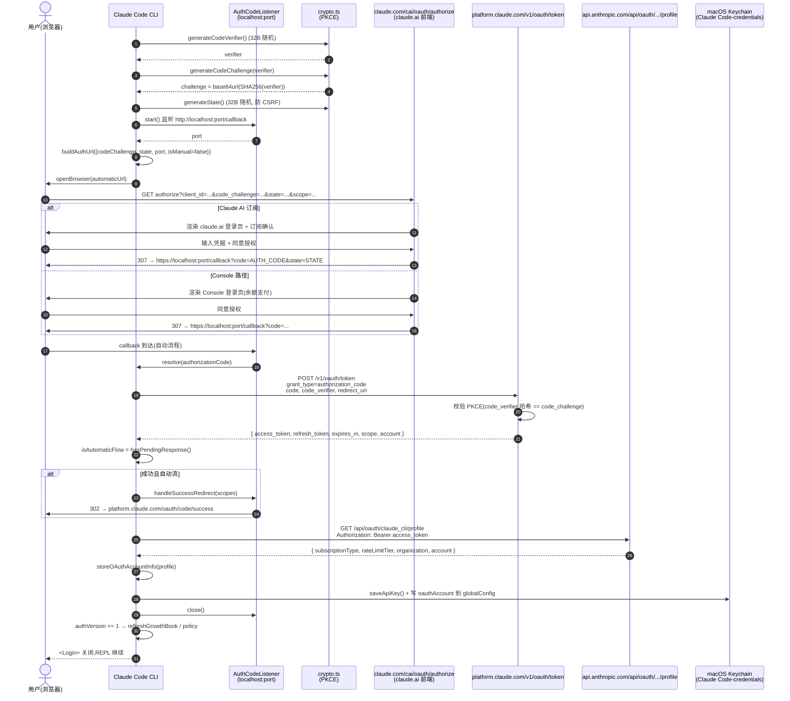
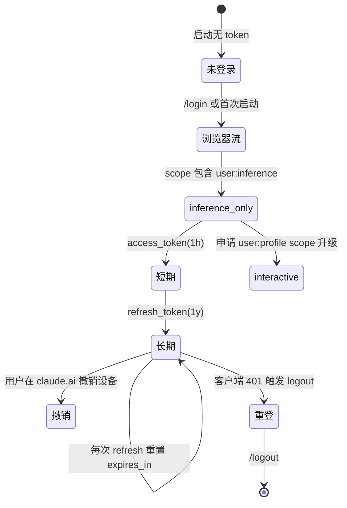

# 第 4b 章 OAuth 浏览器流的完整技术内幕

> **本章定位**:`04a` 的姐妹章。**协议层视角**,讲清"那个 localhost 端口、那个 PKCE 流程、那个 Keychain 槽位"到底在做什么。所有调用点都用 `file:line` 锚定到真实源码,涵盖 token 类型、刷新机制、故障模式。

## 摘要

Claude Code CLI 的 OAuth 实现是一个**标准的 Authorization Code Flow + PKCE**:CLI 启动本地回调监听 → 浏览器跳转到 `claude.com/cai/oauth/authorize` 或 `platform.claude.com/oauth/authorize` → 用户在 claude.ai 同意 → 授权服务器 307 回 `localhost:<port>/callback?code=...&state=...` → CLI 用 `code_verifier` 换 `access_token` + `refresh_token`。Token 区分 `inference-only`(1 年期)和 `interactive`(短命带 profile),macOS 写入 Keychain(`service=Claude Code-credentials`),其他平台 plaintext。所有 OAuth 调用走 `https://platform.claude.com/v1/oauth/token`,refresh 复用同一个 endpoint。

## 速赢

- **Token 类型**:
  - `user:inference`(`CLAUDE_AI_INFERENCE_SCOPE`)→ 长命 inference-only token,**1 年有效**,只能用模型推理。
  - `user:profile` + `user:sessions:claude_code` + `user:mcp_servers` + `user:file_upload` → interactive token,短命,**带 profile 读取权限**。
  - 登录时一次性请求全部 scope(`ALL_OAUTH_SCOPES`),refresh 时同样复用,后端 `ALLOWED_SCOPE_EXPANSIONS` 允许 scope 扩增。
- **PKCE 三件套**:`code_verifier`(32B 随机)→ `code_challenge = base64url(SHA256(verifier))` + `state`(32B 随机,防 CSRF)。
- **Token 落盘**:macOS 写 Keychain;Linux / Windows 写 `~/.claude/.credentials.json`(chmod 600)。
- **刷新窗口**:`isOAuthTokenExpired()` 提前 5 分钟判定过期(`src/services/oauth/client.ts:344-353`),触发 `refreshOAuthToken()`。
- **并发安全**:同一端口的 `AuthCodeListener` 是单实例,第二次启动会冲突(预期行为,登录流程唯一)。

## 关键图(1 张必画 + 1 张辅助)

### 4b.1 OAuth 全链路时序图(必画)



### 4b.2 Token 生命周期(辅助)



## 详细机制

### 4b.1 配置常量(`src/constants/oauth.ts`)

OAuth 全局配置由 `getOauthConfig()` 返回,生产环境值:

```typescript
const PROD_OAUTH_CONFIG = {
  BASE_API_URL: 'https://api.anthropic.com',
  CONSOLE_AUTHORIZE_URL: 'https://platform.claude.com/oauth/authorize',
  CLAUDE_AI_AUTHORIZE_URL: 'https://claude.com/cai/oauth/authorize',
  CLAUDE_AI_ORIGIN: 'https://claude.ai',
  TOKEN_URL: 'https://platform.claude.com/v1/oauth/token',
  API_KEY_URL: 'https://api.anthropic.com/api/oauth/claude_cli/create_api_key',
  ROLES_URL: 'https://api.anthropic.com/api/oauth/claude_cli/roles',
  CLIENT_ID: '9d1c250a-e61b-44d9-88ed-5944d1962f5e',
  ...
}
```

关键设计点:

- `CLAUDE_AI_AUTHORIZE_URL` 走 `claude.com/cai/*` 中转 → 307 → `claude.ai/oauth/authorize`,**为了 attribution**(`oauth.ts:88` 的注释)。
- `CLAUDE_AI_ORIGIN` 单独存(`https://claude.ai`),因为 authorize URL 的 origin 是 `claude.com`,但内部链接需要 `claude.ai`(`/code`、`/settings/connectors`)。
- Staging 配置**仅在 `USER_TYPE=ant` build 中存在**,生产 build 直接 DCE(`oauth.ts:118-142` 用 `process.env.USER_TYPE === 'ant' ? {...} : undefined`,利用字面量 DCE 优化)。
- FedStart / PubSec 部署可覆盖 `CLAUDE_CODE_CUSTOM_OAUTH_URL`,但仅允许白名单中的 3 个 base URL(`oauth.ts:179-183`),**任何非白名单 URL 都会抛错**,防 token 泄漏。

### 4b.2 Scope 设计(`oauth.ts:33-58`)

```typescript
export const CLAUDE_AI_INFERENCE_SCOPE = 'user:inference'
export const CLAUDE_AI_PROFILE_SCOPE  = 'user:profile'
const   CONSOLE_SCOPE                = 'org:create_api_key'

export const CLAUDE_AI_OAUTH_SCOPES = [
  CLAUDE_AI_PROFILE_SCOPE,                  // 读 profile
  CLAUDE_AI_INFERENCE_SCOPE,               // 调模型(长命 1y)
  'user:sessions:claude_code',             // 绑 session
  'user:mcp_servers',                      // 装 MCP
  'user:file_upload',                      // 上传附件
] as const

export const CONSOLE_OAUTH_SCOPES = [
  CONSOLE_SCOPE,                           // 创建 API key
  CLAUDE_AI_PROFILE_SCOPE,
] as const

export const ALL_OAUTH_SCOPES = Array.from(
  new Set([...CONSOLE_OAUTH_SCOPES, ...CLAUDE_AI_OAUTH_SCOPES]),
)
```

设计动机(`oauth.ts:55-58`):

> 当登录时,请求**所有** scope,以处理 `Console → Claude.ai` 的跳转回退。同源 `OAuthConsentPage`(apps repo)必须保持同步。

`inferenceOnly: true` 选项(`src/services/oauth/client.ts:81-84`)会缩减为只请求 `user:inference`,产生**纯推理 token**——常用于 SDK / 第三方集成,不需要 profile 信息。

### 4b.3 PKCE 生成(`src/services/oauth/crypto.ts`)

```typescript
import { createHash, randomBytes } from 'crypto'

function base64URLEncode(buffer: Buffer): string {
  return buffer.toString('base64')
    .replace(/\+/g, '-')
    .replace(/\//g, '_')
    .replace(/=/g, '')  // URL-safe,无 padding
}

export function generateCodeVerifier(): string {
  return base64URLEncode(randomBytes(32))   // 32 bytes → 43 字符
}

export function generateCodeChallenge(verifier: string): string {
  const hash = createHash('sha256')
  hash.update(verifier)
  return base64URLEncode(hash.digest())      // SHA256 → 43 字符
}

export function generateState(): string {
  return base64URLEncode(randomBytes(32))
}
```

完全遵循 RFC 7636:

- `code_verifier`:43 字符 base64url,熵 = 32 × 8 = 256 bit
- `code_challenge`:`base64url(SHA256(code_verifier))`
- `code_challenge_method`:`S256`
- `state`:43 字符随机串,防 CSRF

### 4b.4 授权 URL 构建(`src/services/oauth/client.ts:46-105`)

`buildAuthUrl()` 输出完整 URL,关键参数:

```
https://claude.com/cai/oauth/authorize?
  code=true                                   # 显示 Claude Max upsell
  &client_id=9d1c250a-e61b-44d9-88ed-5944d1962f5e
  &response_type=code
  &redirect_uri=http://localhost:54872/callback   # 自动流;手动流改 MANUAL_REDIRECT_URL
  &scope=user%3Aprofile+user%3Ainference+...     # URL-encoded
  &code_challenge=<43-char base64url>
  &code_challenge_method=S256
  &state=<43-char base64url>
  &orgUUID=<可选>                                  # 多 org 切换
  &login_hint=<可选>                              # 预填邮箱
  &login_method=sso|google|magic_link             # 指定登录方式
```

`redirect_uri` 在自动流是 `http://localhost:<port>/callback`,手动流是 `https://platform.claude.com/oauth/code/callback`(用户复制 code 后回到 CLI 粘贴)。

### 4b.5 Token 交换(`client.ts:107-144`)

```typescript
const requestBody = {
  grant_type: 'authorization_code',
  code: authorizationCode,
  redirect_uri: useManualRedirect
    ? getOauthConfig().MANUAL_REDIRECT_URL
    : `http://localhost:${port}/callback`,
  client_id: getOauthConfig().CLIENT_ID,
  code_verifier: codeVerifier,         // PKCE 校验
  state,
}
if (expiresIn !== undefined) requestBody.expires_in = expiresIn

await axios.post(getOauthConfig().TOKEN_URL, requestBody, {
  headers: { 'Content-Type': 'application/json' },
  timeout: 15000,
})
```

`expiresIn` 是 SDK / 程序化场景的可选参数,普通用户流程不传,使用服务端默认。

### 4b.6 Token 刷新(`client.ts:146-274`)

```typescript
export async function refreshOAuthToken(refreshToken, { scopes }) {
  const requestBody = {
    grant_type: 'refresh_token',
    refresh_token: refreshToken,
    client_id: getOauthConfig().CLIENT_ID,
    scope: (requestedScopes?.length ? requestedScopes : CLAUDE_AI_OAUTH_SCOPES).join(' '),
  }
  ...
}
```

要点:

- **复用 TOKEN_URL**:refresh 和 exchange 走同一 endpoint(`platform.claude.com/v1/oauth/token`)。
- **scope 允许扩增**:服务端 `ALLOWED_SCOPE_EXPANSIONS` 允许 refresh 时申请比初始授权更多 scope,所以即使最初没要 `user:mcp_servers`,后端 refresh 时可以补上。
- **profile 缓存**:若 config 中已有 `subscriptionType` / `rateLimitTier`,refresh 路径**跳过** `/api/oauth/profile` 调用(`client.ts:200-211`),节省 ~7M req/day(`client.ts:188-190` 注释)。

### 4b.7 Profile 读取(`client.ts:355-420`)

`fetchProfileInfo(accessToken)` 返回:

```typescript
{
  subscriptionType,        // 'max' | 'pro' | 'team' | 'enterprise' | null
  displayName,
  rateLimitTier,           // 'default' | 'high' 等
  hasExtraUsageEnabled,    // 余额计费
  billingType,             // 'subscription' | 'api_credit'
  accountCreatedAt,
  subscriptionCreatedAt,
  rawProfile,              // 完整响应
}
```

Profile 信息会写入 `globalConfig.oauthAccount`,**前端 UI 不再二次请求**——`/status`、计费提示、模型选择都从内存读这个对象。

### 4b.8 写入 Keychain(`src/utils/secureStorage/`)

存储实现由 `getSecureStorage()`(`src/utils/secureStorage/index.ts:9-17`)平台分发:

| 平台 | 实现 | 文件 |
|---|---|---|
| macOS | `macOsKeychainStorage`(`security` CLI) | `macOsKeychainStorage.ts` |
| Linux | `plainTextStorage`(`~/.claude/.credentials.json`,chmod 600) | `plainTextStorage.ts` |
| Windows | `plainTextStorage`(暂无 DPAPI / libsecret) | `plainTextStorage.ts` |

macOS 启动会预取(`startKeychainPrefetch()`,`main.tsx:914` 调度),把首次 `getSecureStorage()` 的 ~65ms 同步耗时提前到 module load,UI 起来后再消费。

Service 名称(区分 ant / external / 自定义):

```
Claude Code-credentials                       # 默认生产
Claude Code-credentials-staging-oauth         # staging build
Claude Code-credentials-local-oauth           # 本地 dev
Claude Code-credentials-custom-oauth          # FedStart 覆盖
```

(`macOsKeychainHelpers.ts:29-51` 中的 `getMacOsKeychainStorageServiceName` 函数)

### 4b.9 注销清理(`src/commands/logout/logout.tsx:16-48`)

```typescript
export async function performLogout({ clearOnboarding = false }): Promise<void> {
  await flushTelemetry()                       // 先 flush,避免 org 数据泄漏
  await removeApiKey()                          // 清 secureStorage
  const secureStorage = getSecureStorage()
  secureStorage.delete()                        // 兜底
  await clearAuthRelatedCaches()               // 清 9 类缓存
  saveGlobalConfig(current => ({
    ...current,
    oauthAccount: undefined,                   // 抹掉 profile
    ...(clearOnboarding && {
      hasCompletedOnboarding: false,
      subscriptionNoticeCount: 0,
      hasAvailableSubscription: false,
    }),
  }))
}
```

注意**顺序很重要**:必须先 `flushTelemetry()` 再清 token,否则飞行中的遥测事件还带着旧 org 标识。

### 4b.10 故障模式

| 故障 | 现象 | 排查路径 |
|---|---|---|
| **网络受限** | `authorize` 域名不可达 | ① `curl https://claude.com` 验证 ② 配 `HTTPS_PROXY` ③ FedStart:`CLAUDE_CODE_CUSTOM_OAUTH_URL=https://claude.fedstart.com` |
| **回调超时** | 浏览器开了但一直转圈 | `AuthCodeListener.start()` 可能端口被占,看 stderr `EADDRINUSE`;Linux 上 `ip6tables` 可能屏蔽 `::1` 回环 |
| **state mismatch** | `400 Bad Request` | 系统时间漂移 > 5 分钟会触发;`timedatectl status` |
| **设备信任失败** | 远程控制 10 分钟窗口未生效 | `clearTrustedDeviceToken()` + `enrollTrustedDevice()` 重试;检查 bridge token |
| **token 撤销** | `/status` 显示已登录但调模型 401 | 服务端在 claude.ai 撤销;`/logout && claude` 重登 |
| **macOS Keychain 弹窗** | 每次启动要求密码 | 系统设置 → 钥匙串 → 信任 `Claude Code-credentials` 项 |
| **CLI 自定义 OAuth URL 不被允许** | `CLAUDE_CODE_CUSTOM_OAUTH_URL is not an approved endpoint` | 仅 3 个白名单(`oauth.ts:179-183`),FedStart 部署直接联系 Anthropic |
| **重复端口冲突** | 第二个 `claude` 进程 | 设计上禁止两个 OAuth 流并存,先完成或取消前一个 |

### 4b.11 Bridge / Remote Control 与 OAuth 关系

Bridge 信任设备(`/login` 成功后会调用 `enrollTrustedDevice()`,`src/commands/login/login.tsx:42`)是一个独立机制:

- 调用 `https://api.anthropic.com/v1/auth/trusted_device`(伪代码,实际 endpoint 在 `src/bridge/trustedDevice.ts`)
- 返回 10 分钟有效期的 device token,缓存到 `secureStorage` 的另一槽位
- 该 token 用于 Bridge 连接后保持"会话在线",**与 OAuth token 独立**
- 注销时调用 `clearTrustedDeviceTokenCache()`(`logout.tsx:54`),两端都清

## 反模式

1. **直接读 `~/.claude/.credentials.json`**(macOS):绕过 Keychain,在 Apple Silicon 上可能拿到加密 blob 的二进制残片。**只走 `getSecureStorage()` API**。
2. **自己写 `axios.post(TOKEN_URL)`**:refresh 路径有 7M req/day 的 profile-skip 优化,自己写的版本会每次都拉 profile,把服务端打挂。
3. **在生产 build 中启用 staging OAuth**:`oauth.ts:118-142` 的 `process.env.USER_TYPE === 'ant'` 是 build-time 常量,普通用户 build 里**整个 STAGING_OAUTH_CONFIG 都被 DCE**,运行期不可开启。
4. **把 `CLAUDE_CODE_OAUTH_TOKEN` 写到 `.envrc`**:direnv 会把整个项目目录复制一份到镜像仓库,token 泄漏。改用系统级 Keychain / `pass` / 1Password CLI。
5. **同时启用 OAuth 和 3P(Bedrock / Vertex / Foundry)**:`getAPIProvider()`(`src/utils/model/providers.ts:6-14`)会优先返回 3P,OAuth token 不会用来发模型请求,但 `/status` 仍显示 OAuth 账户,造成困惑。

## 引用

- 前置:`00-front/03-glossary.md` (OAuth / PKCE / scope / Keychain)
- 前置:`02-user/04a-claudeai-auth.md` (产品视角的命令与状态)
- 平行:`02-user/04c-3p-providers.md` (绕过 OAuth 的 3P 路径)
- 后继:`02-user/04d-onboarding.md` (登录后的 5 件事)
- 后继:`03-developer/...` (开发视角如何扩展 OAuth scope)

## 源码定位

- `src/services/oauth/index.ts:21-198` — `OAuthService` 类,`startOAuthFlow()` 主入口
- `src/services/oauth/client.ts:46-105` — `buildAuthUrl` 构造授权 URL
- `src/services/oauth/client.ts:107-144` — `exchangeCodeForTokens` token 交换
- `src/services/oauth/client.ts:146-274` — `refreshOAuthToken` 刷新逻辑
- `src/services/oauth/client.ts:344-353` — `isOAuthTokenExpired` 过期判定(5 分钟缓冲)
- `src/services/oauth/client.ts:311-342` — `createAndStoreApiKey` Console 路径生成 API key
- `src/services/oauth/crypto.ts:11-23` — PKCE + state 生成
- `src/services/oauth/auth-code-listener.ts` — localhost 回调监听器
- `src/services/oauth/getOauthProfile.ts` — `/api/oauth/profile` 调用
- `src/constants/oauth.ts:33-58` — Scope 常量定义
- `src/constants/oauth.ts:84-104` — 生产 OAuth 配置
- `src/constants/oauth.ts:179-234` — FedStart / 自定义 URL 覆盖 + 白名单
- `src/utils/secureStorage/index.ts:9-17` — 平台分发
- `src/utils/secureStorage/macOsKeychainStorage.ts` — Keychain 适配层
- `src/utils/secureStorage/plainTextStorage.ts` — Linux / Windows 兜底
- `src/commands/login/login.tsx:25-55` — 登录成功后 13 个刷新动作
- `src/commands/logout/logout.tsx:16-48` — `performLogout` 清理顺序