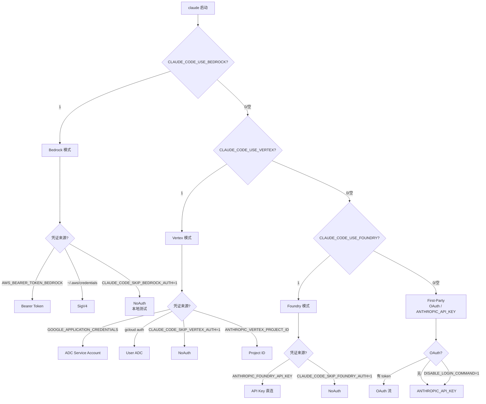
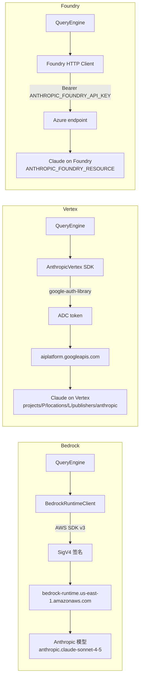

# 第 4c 章 第三方云(3P)提供商:Bedrock / Vertex / Foundry

> **本章定位**:`04a/04b` 都假定走 Anthropic 自己的 OAuth / API。本章讲企业 / 合规用户如何把推理路由到 AWS Bedrock / GCP Vertex / Azure Foundry,以及和 OAuth 路径的关键差异。

## 摘要

Claude Code CLI 用三个互斥的环境变量选择 3P 提供商:`CLAUDE_CODE_USE_BEDROCK=1` → AWS Bedrock(SigV4)、`CLAUDE_CODE_USE_VERTEX=1` → GCP Vertex(ADC)、`CLAUDE_CODE_USE_FOUNDRY=1` → Azure Foundry(API key)。**三选一,不并存**;一旦设置,OAuth token 不会被用来发模型请求,但 `/status` 仍按 OAuth 账户显示。`getAPIProvider()`(`src/utils/model/providers.ts:6-14`)的优先级:Bedrock > Vertex > Foundry > firstParty。Bedrock 走 `~/.aws/credentials` 或 `AWS_BEARER_TOKEN_BEDROCK`,Vertex 走 Application Default Credentials,Foundry 走 `ANTHROPIC_FOUNDRY_API_KEY`。**与 OAuth 路径最大的差异:不写 Keychain,token 由各自云平台 SDK 管理。**

## 速赢

- **一行启用 Bedrock**:`export CLAUDE_CODE_USE_BEDROCK=1 && export AWS_REGION=us-east-1`,然后 `claude`。
- **Vertex 同样简单**:`export CLAUDE_CODE_USE_VERTEX=1 && export CLOUD_ML_REGION=us-east5 && export ANTHROPIC_VERTEX_PROJECT_ID=<gcp-project>`。
- **Foundry 三件套**:`CLAUDE_CODE_USE_FOUNDRY=1` + `ANTHROPIC_FOUNDRY_API_KEY` + `ANTHROPIC_FOUNDRY_RESOURCE`。
- **跳过 Bedrock auth(本地测试)**:`CLAUDE_CODE_SKIP_BEDROCK_AUTH=1`,用 `NoAuthSigner`(`src/utils/model/bedrock.ts:67-78`)。
- **模型 ID 映射**:`modelOverrides`(settings.json)把 `sonnet` 别名映射到 Bedrock 的 `us.anthropic.claude-sonnet-4-5-20250929-v1:0`。
- **不写 Keychain**:3P 路径下 `secureStorage` 不会保存 OAuth token;`getClaudeAIOAuthTokens()` 返回 undefined,`isClaudeAISubscriber()` 也会因 scope 缺失返回 false。
- **企业安全管控**:`CLAUDE_CODE_PROVIDER_MANAGED_BY_HOST=1` 让宿主进程锁定 provider,用户 settings.json 改不动(`src/utils/managedEnvConstants.ts:14-70`)。

## 关键图(1 张必画 + 1 张辅助)

### 4c.1 提供商决策流程(必画)



### 4c.2 三种 3P 的请求路径(辅助)



## 详细机制

### 4c.1 何时使用 3P

| 场景 | 推荐 |
|---|---|
| 企业合同要求数据不出 AWS 区域 | Bedrock |
| GCP-only 的合规 / 数据驻留要求 | Vertex |
| Azure 内部 AI 服务目录 | Foundry |
| 个人开发者、想用 `Max` 订阅 | **不要用 3P**,first-party OAuth 更便宜 |
| 已经在 Bedrock 上跑 `InvokeModel` | Bedrock(熟悉度) |
| 需要跨区域推理 profile(Bedrock) | Bedrock cross-region inference |
| 模型微调 / provisioned throughput | Bedrock(`provisioned` / `system_defined` profile) |

3P 路径**不影响** claude.md / 工具 / MCP / 设置,只是把 `QueryEngine → API` 的最后一跳替换成各家云的 endpoint。

### 4c.2 AWS Bedrock

#### 启用

```bash
export CLAUDE_CODE_USE_BEDROCK=1
export AWS_REGION=us-east-1           # 必填,Anthropic 模型在该区域可用
# 或
export AWS_DEFAULT_REGION=us-east-1
```

#### 凭证(三种互斥)

```bash
# 方式 1:Bearer Token(短期,适合临时测试)
export AWS_BEARER_TOKEN_BEDROCK=<iam_bearer_token>

# 方式 2:AWS Profile(SDK 自动刷新)
aws configure                        # 写 ~/.aws/credentials
export AWS_PROFILE=work

# 方式 3:跳过 auth(本地 proxy / 测试)
export CLAUDE_CODE_SKIP_BEDROCK_AUTH=1
```

`createBedrockClient()`(`src/utils/model/bedrock.ts:50-94`)对凭证的处理逻辑:

```typescript
const skipAuth = isEnvTruthy(process.env.CLAUDE_CODE_SKIP_BEDROCK_AUTH)
...
if (!skipAuth && !process.env.AWS_BEARER_TOKEN_BEDROCK) {
  const cachedCredentials = await refreshAndGetAwsCredentials()
  if (cachedCredentials) {
    clientConfig.credentials = {
      accessKeyId: cachedCredentials.accessKeyId,
      secretAccessKey: cachedCredentials.secretAccessKey,
      sessionToken: cachedCredentials.sessionToken,
    }
  }
}
```

也就是说:**Bearer Token 优先**于 AWS profile,`CLAUDE_CODE_SKIP_BEDROCK_AUTH` 是最末端的兜底(强制 NoAuth)。

#### 自定义 endpoint

```bash
export ANTHROPIC_BEDROCK_BASE_URL=https://bedrock-proxy.example.com
```

(`bedrock.ts:62-64`)——当 Anthropic SDK 的标准 endpoint 不够用时(例如公司内部 proxy / VPC endpoint),可以指向自建 URL。**该字段属于"危险 env var"**,在远程 managed settings 加载前需要走 trust dialog(`src/utils/managedEnvConstants.ts:94-107`)。

#### 区域与 cross-region inference

```bash
# Bedrock cross-region inference 前缀
us.anthropic.claude-sonnet-4-5-20250929-v1:0   # 美国区域
eu.anthropic.claude-sonnet-4-5-20250929-v1:0   # 欧洲
apac.anthropic.claude-sonnet-4-5-20250929-v1:0 # 亚太
global.anthropic.claude-opus-4-6-v1            # 全局(仅 Opus)
```

`getBedrockRegionPrefix()`(`bedrock.ts:222-235`)从 model ID 提取前缀,`applyBedrockRegionPrefix()`(`bedrock.ts:248-265`)做替换 / 补齐。`BEDROCK_REGION_PREFIXES = ['us', 'eu', 'apac', 'global']`(`bedrock.ts:189`)。

#### 推理 profile(动态发现)

```typescript
export const getBedrockInferenceProfiles = memoize(async (): Promise<string[]> => {
  const [client, { ListInferenceProfilesCommand }] = await Promise.all([
    createBedrockClient(),
    import('@aws-sdk/client-bedrock'),
  ])
  // ListInferenceProfilesCommand(typeEquals='SYSTEM_DEFINED')
  // → 过滤 inferenceProfileId.includes('anthropic')
})
```

`SystemDefined` profile 由 AWS 预置,自动包含 cross-region 路由。CLI 启动时缓存一次(`memoize`),避免每次发请求都列一遍。

### 4c.3 GCP Vertex

#### 启用

```bash
export CLAUDE_CODE_USE_VERTEX=1
export CLOUD_ML_REGION=us-east5                  # 默认 region
export ANTHROPIC_VERTEX_PROJECT_ID=my-gcp-project
```

#### ADC(Application Default Credentials)

CLI 用 `@anthropic-ai/vertex-sdk`,内部走 `google-auth-library` 解析 ADC。优先级:

1. `GOOGLE_APPLICATION_CREDENTIALS` 环境变量指向 JSON 文件
2. `gcloud auth application-default login`(用户态)
3. GCE / GKE metadata server(自动,无需 env)
4. Workload Identity(K8s ServiceAccount 绑定)

`src/services/api/client.ts:224-286` 处理 ADC:

```typescript
if (!isEnvTruthy(process.env.CLAUDE_CODE_SKIP_VERTEX_AUTH)) {
  // ...refreshAndGetAwsCredentials 之外的等价逻辑
  const googleAuth = isEnvTruthy(process.env.CLAUDE_CODE_SKIP_VERTEX_AUTH)
    ? /* NoAuth */
    : new GoogleAuth({ scopes: ['https://www.googleapis.com/auth/cloud-platform'] })

  const projectId = process.env.ANTHROPIC_VERTEX_PROJECT_ID
  const location = process.env.CLOUD_ML_REGION || 'us-east5'
  // ...client 构造
}
```

#### 模型 region 覆盖

某些模型只在特定 region 可用,通过 `VERTEX_REGION_CLAUDE_*` env var 按前缀匹配:

```typescript
const VERTEX_REGION_OVERRIDES = [
  ['claude-haiku-4-5',     'VERTEX_REGION_CLAUDE_HAIKU_4_5'],
  ['claude-3-5-haiku',     'VERTEX_REGION_CLAUDE_3_5_HAIKU'],
  ['claude-3-5-sonnet',    'VERTEX_REGION_CLAUDE_3_5_SONNET'],
  ['claude-3-7-sonnet',    'VERTEX_REGION_CLAUDE_3_7_SONNET'],
  ['claude-opus-4-1',      'VERTEX_REGION_CLAUDE_4_1_OPUS'],
  ['claude-opus-4',        'VERTEX_REGION_CLAUDE_4_0_OPUS'],
  ['claude-sonnet-4-6',    'VERTEX_REGION_CLAUDE_4_6_SONNET'],
  ['claude-sonnet-4-5',    'VERTEX_REGION_CLAUDE_4_5_SONNET'],
  ['claude-sonnet-4',      'VERTEX_REGION_CLAUDE_4_0_SONNET'],
] as const
```

(`src/utils/envUtils.ts:155-165`)

例如 Sonnet 4.6 默认推 `us-east5`,但你部署在 `europe-west4`,可以:

```bash
export VERTEX_REGION_CLAUDE_4_6_SONNET=europe-west4
```

### 4c.4 Azure Foundry

#### 启用

```bash
export CLAUDE_CODE_USE_FOUNDRY=1
export ANTHROPIC_FOUNDRY_API_KEY=<your_key>
export ANTHROPIC_FOUNDRY_RESOURCE=<azure_resource_name>
export ANTHROPIC_FOUNDRY_BASE_URL=https://<resource>.services.ai.azure.com   # 可选
```

Foundry 是 Azure 提供的"Claude 部署"服务,**直接 API key**,不走 OAuth,不走 ADC。

#### 跳过 auth

```bash
export CLAUDE_CODE_SKIP_FOUNDRY_AUTH=1
```

与 Bedrock 一样,NoAuth 模式用于内部 proxy / 测试。

### 4c.5 环境变量清单

下表列出所有 3P 相关 env var(综合 `src/utils/managedEnvConstants.ts:14-62`):

| 类别 | 变量 | 用途 |
|---|---|---|
| **选择** | `CLAUDE_CODE_USE_BEDROCK` | 启用 Bedrock |
| | `CLAUDE_CODE_USE_VERTEX` | 启用 Vertex |
| | `CLAUDE_CODE_USE_FOUNDRY` | 启用 Foundry |
| **Endpoint** | `ANTHROPIC_BASE_URL` | first-party 自定义(危险) |
| | `ANTHROPIC_BEDROCK_BASE_URL` | Bedrock 自定义 endpoint |
| | `ANTHROPIC_VERTEX_BASE_URL` | Vertex 自定义 endpoint |
| | `ANTHROPIC_FOUNDRY_BASE_URL` | Foundry 自定义 endpoint |
| **资源标识** | `ANTHROPIC_VERTEX_PROJECT_ID` | GCP 项目 ID(Vertex) |
| | `ANTHROPIC_FOUNDRY_RESOURCE` | Azure 资源名(Foundry) |
| | `CLOUD_ML_REGION` | Vertex 主 region,默认 `us-east5` |
| | `VERTEX_REGION_CLAUDE_*` | 按模型前缀的 region 覆盖 |
| **凭证** | `ANTHROPIC_API_KEY` | first-party API key(危险) |
| | `ANTHROPIC_AUTH_TOKEN` | first-party auth token(危险) |
| | `CLAUDE_CODE_OAUTH_TOKEN` | OAuth refresh/access token(危险) |
| | `AWS_BEARER_TOKEN_BEDROCK` | Bedrock IAM Bearer |
| | `AWS_REGION` / `AWS_DEFAULT_REGION` | Bedrock region(默认 `us-east-1`) |
| | `AWS_PROFILE` | Bedrock AWS profile 名 |
| | `ANTHROPIC_FOUNDRY_API_KEY` | Foundry API key |
| | `GOOGLE_APPLICATION_CREDENTIALS` | GCP Service Account JSON |
| **跳过** | `CLAUDE_CODE_SKIP_BEDROCK_AUTH` | 强制 NoAuth(本地测试) |
| | `CLAUDE_CODE_SKIP_VERTEX_AUTH` | 同上 |
| | `CLAUDE_CODE_SKIP_FOUNDRY_AUTH` | 同上 |
| **模型** | `ANTHROPIC_MODEL` | 默认模型 ID |
| | `ANTHROPIC_DEFAULT_OPUS_MODEL` | Opus 默认(模型启动时改) |
| | `ANTHROPIC_DEFAULT_SONNET_MODEL` | Sonnet 默认 |
| | `ANTHROPIC_DEFAULT_HAIKU_MODEL` | Haiku 默认 |
| | `ANTHROPIC_SMALL_FAST_MODEL` | 小模型别名 |
| | `ANTHROPIC_SMALL_FAST_MODEL_AWS_REGION` | 小模型 region(Bedrock) |
| | `CLAUDE_CODE_SUBAGENT_MODEL` | 子代理模型 |
| **宿主管控** | `CLAUDE_CODE_PROVIDER_MANAGED_BY_HOST` | 锁定 provider,settings 不可覆盖 |

> **"危险"标记**:这些 env var 可被远程 managed settings 加载,涉及**重定向到攻击者控制的 server / 切换到攻击者项目**(`managedEnvConstants.ts:94-107` 的注释),首次加载会触发 trust dialog。

### 4c.6 模型覆盖(`modelOverrides`)

`settings.json` 中的 `modelOverrides` 把标准别名映射到 3P 模型 ID:

```json
{
  "modelOverrides": {
    "sonnet": "us.anthropic.claude-sonnet-4-5-20250929-v1:0",
    "opus":   "anthropic.claude-opus-4-1-v1:0",
    "haiku":  "anthropic.claude-haiku-4-5-20251001-v1:0"
  }
}
```

读取路径:`src/utils/model/modelStrings.ts:64` `const overrides = getInitialSettings().modelOverrides`。

`applyBedrockRegionPrefix()`(`bedrock.ts:248-265`)在用户写了 `anthropic.claude-sonnet-4-5-20250929-v1:0`(无 prefix)时,根据 region 自动补前缀成 `us.anthropic.claude-sonnet-4-5-20250929-v1:0`;已有 prefix 则替换。

### 4c.7 与 OAuth 路径的差异

| 维度 | OAuth / First-Party | Bedrock | Vertex | Foundry |
|---|---|---|---|---|
| Token 存储 | macOS Keychain / plaintext | AWS SDK 凭证链 | ADC | 环境变量 |
| 刷新机制 | OAuth refresh_token | AWS SDK v3 自动 | google-auth 自动 | 手动 |
| `/status` 显示 | 订阅 / rate limit | AWS profile / region | GCP project / region | Foundry resource |
| 计费 | claude.ai 订阅 | AWS bill | GCP bill | Azure bill |
| 模型选择 UI | 含 `1M context` 等高级版 | 仅 3P 支持的 ID | 仅 Vertex 支持的 ID | 仅 Foundry 支持的 ID |
| `subscriptionType` | `max`/`pro`/... | `null`(无订阅) | `null` | `null` |
| OAuth scope 校验 | 严格 | 跳过 | 跳过 | 跳过 |
| Keychain 槽位 | `Claude Code-credentials` | 不写 | 不写 | 不写 |

### 4c.8 故障排查

| 现象 | 原因 | 解决 |
|---|---|---|
| `Could not load credentials from any provider` | AWS profile 未配置 | `aws configure`;或设 `AWS_BEARER_TOKEN_BEDROCK` |
| `AccessDeniedException` on Bedrock | IAM 缺 `bedrock:InvokeModel` 权限 | 加 IAM policy;或检查 model ID 与 region 匹配 |
| `Failed to obtain ADC` on Vertex | `gcloud auth application-default login` 未执行 | 跑该命令;或设 `GOOGLE_APPLICATION_CREDENTIALS` |
| `404 Model not found` on Vertex | region 没有该模型 | 设 `VERTEX_REGION_CLAUDE_<model>=<region>` |
| `AnthropicFoundry: 401 Unauthorized` | API key 错或过期 | 重生成 Foundry key |
| `region us-east-1 does not have model anthropic.X` | 模型不在该 region | 改 region 或用 cross-region profile(`us.` / `eu.` / `apac.`) |
| CLI 默认模型仍是 Sonnet 但 3P 没该模型 | 未设 `modelOverrides` | 在 settings.json 写 modelOverrides |
| 远程 managed settings 改不动 provider | `CLAUDE_CODE_PROVIDER_MANAGED_BY_HOST=1` | 这是预期行为;非托管用户可 unset |
| `InvalidClientTokenId` on Bedrock | access key 错 / 临时凭证过期 | `aws sso login` 或换永久凭证 |
| Vertex `403 PERMISSION_DENIED` | Service Account 缺 `aiplatform.endpoints.predict` | 加 `roles/aiplatform.user` |

### 4c.9 宿主托管(`CLAUDE_CODE_PROVIDER_MANAGED_BY_HOST`)

企业容器 / Web 终端常需要"用户不能改 provider":

```bash
# 在宿主 spawn 子进程前
export CLAUDE_CODE_PROVIDER_MANAGED_BY_HOST=1
export CLAUDE_CODE_USE_BEDROCK=1
# 子进程启动后,~/.claude/settings.json 里的 provider 字段被忽略
```

实现机制(`src/utils/managedEnvConstants.ts:14-70`):

```typescript
const PROVIDER_MANAGED_ENV_VARS = new Set([
  'CLAUDE_CODE_PROVIDER_MANAGED_BY_HOST',
  'CLAUDE_CODE_USE_BEDROCK',
  'CLAUDE_CODE_USE_VERTEX',
  'CLAUDE_CODE_USE_FOUNDRY',
  'ANTHROPIC_BASE_URL', 'ANTHROPIC_BEDROCK_BASE_URL',
  'ANTHROPIC_VERTEX_BASE_URL', 'ANTHROPIC_FOUNDRY_BASE_URL',
  'ANTHROPIC_FOUNDRY_RESOURCE', 'ANTHROPIC_VERTEX_PROJECT_ID',
  // ... 凭证 / 模型 ID / region
])

export function isProviderManagedEnvVar(key: string): boolean {
  const upper = key.toUpperCase()
  return PROVIDER_MANAGED_ENV_VARS.has(upper) ||
         PROVIDER_MANAGED_PREFIXES.some(p => upper.startsWith(p))
}
```

当 `CLAUDE_CODE_PROVIDER_MANAGED_BY_HOST=1` 时,settings.json 加载的 env 不会覆盖这些值(`src/utils/managedEnv.ts`)。

## 反模式

1. **3P 路径下保留 OAuth token**:`getAPIProvider() !== 'firstParty'` 时调模型仍走 3P,但 `/status` 显示 OAuth 订阅,造成计费困惑。明确切换,要么纯 OAuth 要么纯 3P。
2. **使用未 modelOverrides 的 sonnet 别名**:Bedrock 上 `sonnet` 默认指 first-party ID,会 404。**3P 必须配 modelOverrides**。
3. **Vertex 忘记设 `ANTHROPIC_VERTEX_PROJECT_ID`**:CLI 兜底用 env var,但若 env var 缺失,`googleAuth.getProjectId()` 异步探测,首次请求会延迟 ~500ms。
4. **Foundry 误用 Bearer Token**:Bedrock 才支持 Bearer,Foundry 只认 API key。`AWS_BEARER_TOKEN_BEDROCK` 不会在 Foundry 路径生效。
5. **远程 managed settings 改 `ANTHROPIC_BASE_URL`**:危险 env,会触发 trust dialog。生产环境建议用 Bedrock/Vertex/Foundry 的官方 SDK 端点,不要自建 proxy。
6. **混用 `CLAUDE_CODE_USE_BEDROCK=1` 和 `ANTHROPIC_API_KEY`**:`getAPIProvider()` 选 Bedrock 后,`ANTHROPIC_API_KEY` 被忽略,但环境变量在 process 表里仍可见,容易审计失败。

## 引用

- 前置:`00-front/03-glossary.md` (Bedrock / Vertex / Foundry / SigV4 / ADC)
- 前置:`01-foundation/03-feature-flags.md` (3P 相关 GrowthBook 开关)
- 前置:`02-user/04a-claudeai-auth.md` (OAuth 路径)
- 平行:`02-user/04b-oauth-flow.md` (OAuth token 落 Keychain)
- 后继:`02-user/04d-onboarding.md` (登录/3P 后建议的 5 件事)
- 后继:`02-user/05-daily-use.md` (日常命令)

## 源码定位

- `src/utils/model/providers.ts:6-14` — `getAPIProvider()` 优先级解析
- `src/utils/model/bedrock.ts:50-94` — `createBedrockClient`(凭证处理)
- `src/utils/model/bedrock.ts:96-139` — `createBedrockRuntimeClient`
- `src/utils/model/bedrock.ts:189-265` — 区域前缀 + ARN 解析
- `src/services/api/client.ts:222-289` — Vertex 客户端(ADC + region + project)
- `src/utils/envUtils.ts:96-106` — `getAWSRegion()` / `getDefaultVertexRegion()`
- `src/utils/envUtils.ts:155-183` — `VERTEX_REGION_OVERRIDES` 矩阵
- `src/utils/managedEnvConstants.ts:14-62` — `PROVIDER_MANAGED_ENV_VARS` 全集
- `src/utils/managedEnvConstants.ts:94-107` — 危险 env 分类(redirect / trust)
- `src/utils/model/modelStrings.ts:58-87` — `modelOverrides` 加载层
- `src/utils/managedEnv.ts` — 宿主托管逻辑(`CLAUDE_CODE_PROVIDER_MANAGED_BY_HOST`)