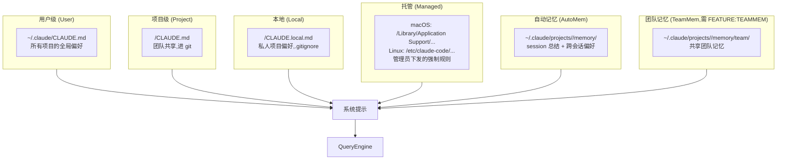

# 第 4d 章 首次体验:/init、/memory 与 5 件事

> **本章定位**:从"装好 + 登录"过渡到"开始高效使用"的桥梁。重点是 `/init`(生成项目 CLAUDE.md)、`/memory`(管理 6 类记忆文件)、`/init-verifiers`(初始化校验器),以及首次会话推荐的 5 个动作。

## 摘要

Claude Code CLI 的"onboarding"由 4 部分构成:① `/init` 命令扫描代码库生成 `CLAUDE.md`;② `/init-verifiers` 初始化一组校验任务;③ `/memory` 命令打开 6 类 CLAUDE.md 的选择 UI(User/Project/Local/Managed/AutoMem/TeamMem);④ `/review`、`/commit` 等内置 skill 加速常见工作流。本章按"5 件事"清单展开。

## 速赢

- **第一步**:`/init` —— 20 秒生成项目级 CLAUDE.md,基于 manifest + README + 现有规则文件。
- **第二步**:`/memory` —— 一次性打开所有 6 类记忆,选一个写个人偏好。
- **第三步**:`/review` —— 内置代码评审 skill,无需配置。
- **第四步**:`/commit` —— 根据暂存 diff 自动写 commit message。
- **第五步(可选)**:`/mcp` 配置 MCP servers、`/config` 调整主题 / 模型 / effort。
- **不必做**:`/init-verifiers` 是内部基础设施,普通用户用不到。

## 关键图(1 张)

### 4d.1 6 类 CLAUDE.md 的内存拓扑



## 详细机制

### 4d.1 `/init` 命令:扫描项目,生成 CLAUDE.md

#### 命令注册

`src/commands/init.ts` 定义 slash 命令,`/init` 触发 `NEW_INIT_PROMPT`(长 prompt,多 Phase 流程)或旧版 `OLD_INIT_PROMPT`(单 Phase)。

`NEW_INIT_PROMPT`(截选,`src/commands/init.ts:28-119`)的 4 个 Phase:

- **Phase 1 — Ask what to set up**:`AskUserQuestion` 让用户选"Project CLAUDE.md / Personal CLAUDE.local.md / 两者"以及"Skills + Hooks / 仅 Skills / 仅 Hooks / 仅 CLAUDE.md"。
- **Phase 2 — Explore the codebase**:启动子代理,扫 `package.json` / `Cargo.toml` / `pyproject.toml` / `README.md` / `Makefile` / CI 配置 / 现有 `CLAUDE.md` / `.claude/rules/` / `AGENTS.md` / `.cursor/rules` / `.cursorrules` / `.github/copilot-instructions.md` / `.windsurfrules` / `.clinerules` / `.mcp.json`。
- **Phase 3 — Fill in the gaps**:再次 `AskUserQuestion`,收集代码里看不出来的东西(团队角色、个人偏好)。
- **Phase 4-7 — Write CLAUDE.md + skills + hooks**:合成偏好队列,按用户 Phase 1 选择逐个落地。

#### 关键判断准则

`NEW_INIT_PROMPT` 的 "every line must pass this test"(`init.ts:97`):

> "Would removing this cause Claude to make mistakes?"

不通过就砍。这是 `OLD_INIT_PROMPT` 的"避免清单"升级版(`init.ts:11-18`)。

#### 必排除项(`init.ts:111-118`)

- 文件级结构或组件清单(可发现)
- 标准语言惯例
- 通用建议("写干净的代码"、"处理错误")
- 详细 API 文档 / 长引用(用 `@path/to/import` 引用代替)
- 频繁变化的信息(同上)
- 长教程 / walkthrough(独立文件 + `@path` 引用)
- manifest 里看得到的命令(标准 `npm test` / `cargo test`)

#### 必包含项(`init.ts:103-108`)

- 非标准的构建 / 测试 / lint 命令
- 与语言默认不同的代码风格规则
- 测试怪癖(`pytest -k 'test_name'`)
- 仓库礼仪(分支命名、PR 约定、commit 风格)
- 必要的环境变量 / 设置步骤
- 非显而易见的 gotcha / 架构决定
- 现有 AI 工具配置的关键部分(AGENTS.md / Cursor / Copilot 等)

#### 项目级 onboarding 完成度

`getSteps()`(`src/projectOnboardingState.ts:19-41`)返回两步 checklist:

```typescript
[
  { key: 'workspace', text: 'Ask Claude to create a new app or clone a repository',
    isComplete: false, isCompletable: true, isEnabled: isWorkspaceDirEmpty },
  { key: 'claudemd', text: 'Run /init to create a CLAUDE.md file ...',
    isComplete: hasClaudeMd, isCompletable: true, isEnabled: !isWorkspaceDirEmpty },
]
```

`isProjectOnboardingComplete()` 判定所有 enabled + completable 都完成,触发 `hasCompletedProjectOnboarding = true` 持久化。`shouldShowProjectOnboarding`(`projectOnboardingState.ts:63-76`)用 `memoize` 缓存,且在看到 4 次后强制不显示(`projectOnboardingSeenCount >= 4`)。

### 4d.2 `/init-verifiers`:初始化校验器

`/init-verifiers`(`src/commands/init-verifiers.ts`)在 LLM 流程之外运行一组**确定性校验任务**,常用于 CI 或 PR 流水线触发前的本地预检。它:

1. 探测 `package.json` scripts 中的 lint / test 命令。
2. 收集 git hook(`.husky/`、`lefthook.yml`)的子集。
3. 把每个 task 注册成可单独 `/verify` 触发的命令。

普通用户**第一次启动不必调用**——它面向"想严格自动化"的高级用户,等团队实践后再回头配置。

### 4d.3 `/memory` UI:管理 6 种 CLAUDE.md

#### 6 种类型(`src/utils/memory/types.ts:1-11`)

```typescript
export const MEMORY_TYPE_VALUES = [
  'User',     // ~/.claude/CLAUDE.md
  'Project',  // <cwd>/CLAUDE.md
  'Local',    // <cwd>/CLAUDE.local.md
  'Managed',  // /Library/.../CLAUDE.md (admin)
  'AutoMem',  // ~/.claude/projects/<sanitized>/memory/MEMORY.md
  ...(feature('TEAMMEM') ? (['TeamMem'] as const) : []),
] as const
```

#### 命令入口(`src/commands/memory/memory.tsx:14-89`)

`MemoryCommand` 组件挂载 `<MemoryFileSelector>`,后者渲染一个**带 toggle 开关**的选择列表:

```tsx
// MemoryFileSelector.tsx 片段
<Select
  options={memoryFiles.map(f => ({
    label: typeToLabel(f.type),     // "User memory" / "Project memory" / ...
    value: f.path,
    description: f.path,
  }))}
  onSelect={handleSelectMemoryFile}
/>
{isAutoMemoryEnabled() && <Toggle ... />}
{feature('TEAMMEM') && teamMemPaths.isTeamMemoryEnabled() && <Toggle ... />}
```

选中后:

1. `mkdir ~/.claude` 如果不存在。
2. `writeFile(path, '', { flag: 'wx' })` 创建空文件(`wx` 是 O_EXCL,已存在则跳过)。
3. 调用 `editFileInEditor(path)` 启动 `$VISUAL` / `$EDITOR`(`memory.tsx:42`)。
4. 提示 "Opened memory file at ..." + 当前 editor 来源。

#### 6 种类型的实际路径与典型内容

| 类型 | 路径 | 作用域 | 共享? |
|---|---|---|---|
| **User** | `~/.claude/CLAUDE.md` | 所有项目 | 否 |
| **Project** | `<cwd>/CLAUDE.md` | 当前项目 | 是(进 git) |
| **Local** | `<cwd>/CLAUDE.local.md` | 当前项目 | 否(.gitignore) |
| **Managed** | macOS: `/Library/Application Support/ClaudeCode/CLAUDE.md`<br>Linux: `/etc/claude-code/managed/CLAUDE.md` | 整台机器 | 是(管理员) |
| **AutoMem** | `~/.claude/projects/<sanitized-cwd>/memory/MEMORY.md` | 当前项目 + 跨会话 | 否 |
| **TeamMem** | `~/.claude/projects/<sanitized-cwd>/memory/team/MEMORY.md` | 当前项目 + 团队成员 | 是(需 GrowthBook) |

#### AutoMem 行为

`isAutoMemoryEnabled()`(`src/memdir/paths.ts:30-55`)的优先级:

1. `CLAUDE_CODE_DISABLE_AUTO_MEMORY=1` → 禁用
2. `CLAUDE_CODE_DISABLE_AUTO_MEMORY=0` → 启用
3. `CLAUDE_CODE_SIMPLE=1`(即 `--bare`) → 禁用
4. `CLAUDE_CODE_REMOTE=1` 且无 `CLAUDE_CODE_REMOTE_MEMORY_DIR` → 禁用
5. `settings.autoMemoryEnabled`(settings.json 可关)
6. 默认:`true`

启用后,`extractMemories` 后台子代理会在每个 turn 结束时判断"这一轮有没有值得记住的事",自动追加到当日 `memory/<date>.md`。`MEMORY.md` 是入口,平时通过 `/remember` 强制录入。

### 4d.4 首次会话建议的 5 件事

#### 1. 配置认证

详见 `04a` / `04b` / `04c`。

```bash
# OAuth 路径
claude    # 自动触发 /login
# 或
/login

# API key 路径
export ANTHROPIC_API_KEY=sk-ant-...
claude

# 3P 路径
export CLAUDE_CODE_USE_BEDROCK=1
export AWS_REGION=us-east-1
claude
```

#### 2. 设置项目级 CLAUDE.md

```bash
/init
```

回答 Phase 1-3 的问题(各 1-3 分钟),完成后 `<cwd>/CLAUDE.md` 自动生成。提交到 git 让团队共享。

**手动版本**(跳过 init 对话):

```bash
cat > CLAUDE.md <<'EOF'
# CLAUDE.md

## Build / Test
- pnpm install
- pnpm test:single -- <name>
- pnpm lint

## Code style
- 2-space indent, no semicolons
- Prefer `type` over `interface`

## Gotchas
- 不要修改 `src/legacy/`
- env 必须在 `pnpm dev` 前 source `.envrc`
EOF
```

#### 3. 启用 auto memory(可选)

```bash
# 默认开启;若想关闭
/memory    # 打开 UI,把 AutoMem toggle 关掉
```

或者在 `~/.claude/settings.json`:

```json
{
  "autoMemoryEnabled": true
}
```

启用后,Claude 会自动从长会话里提炼"用户偏好 / 项目约定"到 AutoMem,下次会话自动 recall。

#### 4. 配置 MCP servers(可选)

```bash
# /mcp 列出当前可用的 MCP server
/mcp
# 或在 settings.json 里加
```

详见后续章节(开发向 / 架构向)。

#### 5. 尝试 `/review`、`/commit`

```bash
# /review:对未提交 / 提交 / 分支做评审
/review
/review HEAD~3
/review main..feature/auth

# /commit:根据暂存区自动写 commit message
git add -p
/commit
# 输出: "feat(auth): add OAuth callback handler with state validation"
```

`/review`(`src/commands/review/`)+ `/commit`(`src/commands/commit.ts`)是内置的 slash command,自带 prompt,直接可用。

### 4d.5 Onboarding 状态持久化

| 字段 | 位置 | 含义 |
|---|---|---|
| `hasCompletedOnboarding` | `globalConfig` | OAuth 流程完成 |
| `hasCompletedProjectOnboarding` | `projectConfig` | 当前项目的 2 步 checklist 完成 |
| `projectOnboardingSeenCount` | `projectConfig` | 已看到 onboarding 屏的次数,≥4 后强制不显示 |
| `subscriptionNoticeCount` | `globalConfig` | 订阅提示出现次数 |
| `customApiKeyResponses.approved` | `globalConfig` | 用户对自定义 API key 的回答 |

`saveGlobalConfig()`(`src/utils/config.ts:797-866`)对 `oauthAccount` + `hasCompletedOnboarding` 做了**写保护**:`wouldLoseAuthState()` 检查避免 GH #3117 类的 bug——重新读 config 缺失认证字段时不写回,避免把现有 auth 抹掉。

## 反模式

1. **/init 后立即 /init 再来一遍**:`init.ts` 是单次扫描 + 增量更新,不幂等。每次跑都重新生成。修改完手工加 `additional notes` 比重跑更稳。
2. **把 API key 写到 Project CLAUDE.md**:Project CLAUDE.md 进 git,API key 一旦 push 永远泄漏。API key 只放 `User` / `Local` 或环境变量。
3. **禁用 AutoMem 想"保护隐私"**:AutoMem 只写到本地 `~/.claude/projects/`,**不上传**。禁用它反而失去跨会话的偏好记忆。
4. **Managed CLAUDE.md 期望用户能改**:Managed 是管理员下发的**只读**(`isInstructionsMemoryType` 排除在外,`getClaudeMds` 的 filter 行为不同),改本地 CLAUDE.md 不会覆盖 Managed。
5. **Local CLAUDE.md 不 `.gitignore`**:`Local` 文件按设计应被忽略;若你提交了,所有团队成员都会继承你的个人偏好,违反 Local 的隐私语义。

## 引用

- 前置:`00-front/03-glossary.md` (MemoryType / settings / projectConfig)
- 前置:`02-user/04-install.md` (装好)
- 前置:`02-user/04a-claudeai-auth.md` (登录)
- 前置:`02-user/04c-3p-providers.md` (3P 凭证)
- 平行:`03-developer/...(MCP / settings.json 详解)`
- 后继:`02-user/05-daily-use.md` (日常命令)
- 后继:`04-architect/25-layered-arch.md` (CLAUDE.md 在分层架构里的位置)

## 源码定位

- `src/commands/init.ts:28-119` — `NEW_INIT_PROMPT` 4 Phase 流程
- `src/commands/init-verifiers.ts` — 校验器初始化
- `src/commands/memory/memory.tsx:14-89` — `/memory` 命令入口
- `src/components/memory/MemoryFileSelector.tsx:44-260` — 选择 UI + AutoMem toggle
- `src/utils/memory/types.ts:1-11` — 6 种 MemoryType 枚举
- `src/memdir/paths.ts:30-55` — `isAutoMemoryEnabled` 优先级
- `src/utils/claudemd.ts:1150-1195` — `getClaudeMds` 把多份 memory 注入 system prompt
- `src/projectOnboardingState.ts:19-83` — `getSteps` / `isProjectOnboardingComplete` / `shouldShowProjectOnboarding`
- `src/utils/config.ts:797-866` — `saveGlobalConfig` + 写保护