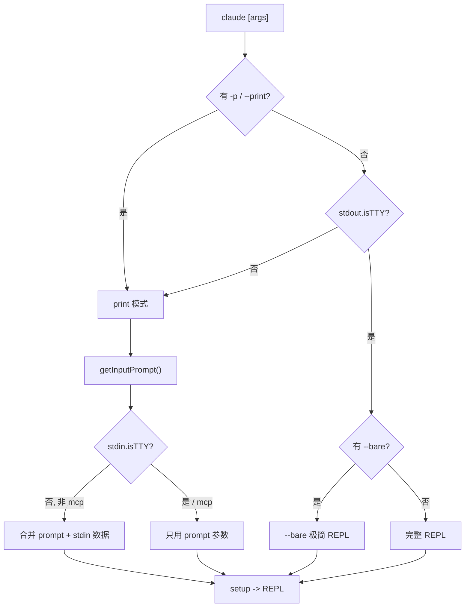
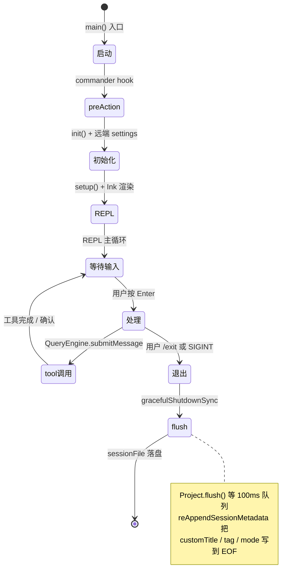

# 第 5 章 日常使用:启动、会话、退出码

> **本章定位**:完成"装 + 登 + 配"之后的"日常肌肉记忆"。覆盖三种启动模式(`claude` 交互、`claude -p` 单次、`--bare` 极简)、关键 CLI 选项、会话状态机、多会话并发与 PID 锁、退出码与异常处理。

## 摘要

`claude` 默认进交互 REPL(Ink + Ink render loop);`claude -p "prompt"` 走单次 print mode,适合脚本;`claude --bare` 是"无 CLAUDE.md、无 LSP、无 hooks、无 keychain 读"的极简模式,适合容器与 CI。选项族按"模型 / 权限 / 上下文 / 输出"四类组织。会话持久化为 `<cwd>/.claude/projects/<sanitized>/<sessionId>.jsonl`,可通过 `-c` / `-r <uuid>` 续接。多会话并发靠 PID 锁 + 锁文件,异常退出由 `gracefulShutdownSync(1)` 兜底。

## 速赢

- **交互模式**:`claude`(等效 `claude` + 空 prompt),启动后输入框 + 已加载 memory + 当前模型。
- **单次执行**:`claude -p "解释 src/utils/auth.ts"` —— 完事退出,适合脚本。
- **极简模式**:`claude --bare -p "..."` —— 跳过所有非必要的加载,启动 ~120ms 而非 ~700ms。
- **续接上次会话**:`claude -c`(无需 ID),`claude -r <uuid>`(指定)。
- **管道**:`echo "总结这个文件" | claude -p` —— stdin 自动合入 prompt。
- **后台并发**:`claude --bg "长任务"` —— 走 CCR/Worker 池,前台立刻返回(详见后续章节)。
- **退出码**:`0` 成功,`1` 严重错误,`2` 用法错误(`commander.js` 标准)。

## 关键图(2 张)

### 5.1 启动模式决策树



### 5.2 会话生命周期



## 详细机制

### 5.1 启动模式

#### 5.1.1 交互模式(默认)

```bash
claude
```

行为(`src/main.tsx:585-856` 的 `main()`):

1. 设置 Windows 反 PATH 劫持(`process.env.NoDefaultCurrentDirectoryInExePath = '1'`)。
2. 注册 SIGINT handler(`main.tsx:598-606`):print 模式下不立即退出,留给 print.ts 自己的处理。
3. 处理 deep link URI(`cc://`)和 SSH 远端(`claude ssh host`)的特殊 argv 重写。
4. 判定 `isNonInteractive`(`main.tsx:799-803`):
   - 有 `-p` / `--print` / `--init-only` / `--sdk-url` → 非交互
   - 或者 `!process.stdout.isTTY`(被管道) → 非交互
5. `setIsInteractive(!isNonInteractive)`。
6. `eagerLoadSettings()` → 同步加载 settings。
7. `await run()` —— commander 派发到 action handler。

最终进入 `action(prompt, options)`(`main.tsx:1006+`),做大量初始化后启动 Ink REPL(`src/screens/REPL.tsx`)。

#### 5.1.2 单次 print 模式

```bash
claude -p "解释 CLAUDE.md 在这个项目里的角色"
```

特点:

- **跳过工作区信任对话框**(`-p` 模式 doc:`main.tsx:976` 注明"workspace trust dialog is skipped")。
- **支持结构化输出**:`--output-format json` / `stream-json`,适合 CI。
- **可叠加预算**:`--max-turns 10` / `--max-budget-usd 5` / `--max-thinking-tokens 8000`。
- **prompt 来源**:
  - 命令行参数:`claude -p "..."` —— `prompt` 即 argv[0]。
  - stdin:`echo "..." | claude -p`(自动拼接到 prompt 末尾,见 `getInputPrompt()` `main.tsx:857-883`)。
  - `claude -p` 无参数 + stdin → stdin 内容即 prompt。

#### 5.1.3 极简模式(`--bare`)

```bash
claude --bare -p "..."
```

由 `main.tsx:1012-1016` 处理,设置 `process.env.CLAUDE_CODE_SIMPLE = '1'`。`isBareMode()`(`src/utils/envUtils.ts:60-65`)在 ~30 处 guard,跳过:

- Hooks(`executeHooks` 内 SIMPLE early-return)
- LSP(server startup)
- Plugin sync
- Attribution(遥测关联)
- Auto memory(extractMemories + autoDream + /remember + /dream)
- Background prefetches
- Keychain reads(`getSecureStorage()` 永远走 plainText 兜底)
- CLAUDE.md auto-discovery(向上递归)
- Skills 自动目录扫描

**仍然支持**:

- 显式 `--plugin-dir`、`--mcp-config`、`--settings`、`--agents`、`--add-dir`
- Skills via `/skill-name`(slash 显式触发,不目录扫描)
- 模型 `--model` / `--effort`
- `--system-prompt[-file]` / `--append-system-prompt[-file]`

适用:

- CI / 流水线(`-p` + `--bare`,启动 ~120ms)
- 容器无 Keychain 的环境
- 严格 sandbox 测试

### 5.2 关键 CLI 选项

下表摘自 `src/main.tsx:968-1006` 的 commander 注册(精选):

| 选项 | 类别 | 行为 |
|---|---|---|
| `-d, --debug [filter]` | 调试 | 启用调试模式,可加过滤(`api,hooks` / `!1p,!file`) |
| `--debug-to-stderr` | 调试 | 调试输出到 stderr |
| `--debug-file <path>` | 调试 | 调试日志到文件 |
| `--verbose` | 调试 | 覆盖 config 的 verbose |
| `-p, --print` | 输出 | print 模式 |
| `--bare` | 行为 | 极简模式 |
| `--init` / `--init-only` / `--maintenance` | 行为 | Setup 钩子触发 |
| `--output-format <text\|json\|stream-json>` | 输出 | print 模式输出格式 |
| `--json-schema <schema>` | 输出 | 结构化校验 |
| `--include-hook-events` | 输出 | 流式输出包含 hook 事件 |
| `--include-partial-messages` | 输出 | 流式部分消息 |
| `--input-format <text\|stream-json>` | 输入 | print 模式输入格式 |
| `--replay-user-messages` | 输出 | 把 stdin 回显到 stdout |
| `--dangerously-skip-permissions` | 权限 | 绕过所有权限检查 |
| `--allow-dangerously-skip-permissions` | 权限 | 允许绕过但默认关 |
| `--thinking <enabled\|adaptive\|disabled>` | 推理 | 思考模式 |
| `--max-thinking-tokens <N>` | 推理 | 旧版 max thinking |
| `--max-turns <N>` | 行为 | 非交互模式最大轮数 |
| `--max-budget-usd <N>` | 行为 | API 美元预算 |
| `--task-budget <N>` | 行为 | API token 预算 |
| `--allowedTools <...>` | 权限 | 允许的工具列表 |
| `--tools <...>` | 行为 | 可用工具集 |
| `--disallowedTools <...>` | 权限 | 禁止的工具列表 |
| `--mcp-config <...>` | 上下文 | 加载 MCP server 配置 |
| `--strict-mcp-config` | 行为 | 只用 `--mcp-config`,忽略其他 |
| `--permission-prompt-tool <name>` | 权限 | 权限确认走 MCP 工具 |
| `--system-prompt <text>` | 上下文 | 替换 system prompt |
| `--system-prompt-file <file>` | 上下文 | 从文件读 system prompt |
| `--append-system-prompt <text>` | 上下文 | 追加到默认 system prompt |
| `--append-system-prompt-file <file>` | 上下文 | 从文件读并追加 |
| `--permission-mode <default\|acceptEdits\|plan\|bypassPermissions\|dontAsk>` | 权限 | 权限模式 |
| `-c, --continue` | 会话 | 续接 cwd 下最近会话 |
| `-r, --resume [value]` | 会话 | 按 ID / 交互选择器续接 |
| `--fork-session` | 会话 | 续接时建新 sessionId |
| `--from-pr [value]` | 会话 | 按 PR 续接 |
| `--no-session-persistence` | 会话 | 不写 jsonl(只 print) |
| `--resume-session-at <msgId>` | 会话 | 续接到指定消息 |
| `--rewind-files <userMsgId>` | 会话 | 回滚文件到指定消息 |
| `--model <model>` | 模型 | 临时切模型 |
| `--effort <low\|medium\|high\|max>` | 模型 | 推理 effort |
| `--agent <agent>` | 模型 | 用指定 agent(覆盖 settings) |
| `--betas <...>` | API | beta headers |
| `--fallback-model <model>` | 模型 | 主模型过载时降级 |
| `--workload <tag>` | 计费 | 计费归属 tag |
| `--settings <file-or-json>` | 上下文 | 加载额外 settings |
| `--add-dir <paths...>` | 上下文 | 允许访问的额外目录 |
| `--ide` | 集成 | 自动连 IDE |
| `--session-id <uuid>` | 会话 | 指定 sessionId |
| `-n, --name <name>` | 会话 | 显示名(终端 title) |
| `--agents <json>` | 上下文 | 内联定义 agents |
| `--setting-sources <csv>` | 上下文 | 限定 sources |
| `--plugin-dir <path>` | 扩展 | 加载插件(可重复) |
| `--disable-slash-commands` | 行为 | 关掉所有 skills |
| `--chrome` / `--no-chrome` | 集成 | Chrome 集成开关 |
| `--file <specs...>` | 上下文 | 启动下载文件(`file_id:path`) |

> `--help` 由 commander 的 `compareOptions` 排序,按 long option 字母序输出,机器友好。

### 5.3 会话状态

#### 5.3.1 输入

```bash
# 单行输入 + Enter 提交
claude
> 帮我写一个 Python 解析器

# 多行输入:三引号 / 反斜杠延续
> """
> print("hello")
> """

# 图片附件(剪贴板 / 文件)
# TUI 模式下用 ctrl+v / 命令面板
```

#### 5.3.2 确认

每次 Claude 调用工具时,REPL 弹出 `<PermissionDialog>`(`src/components/permissions/`),选项包括:

- **Yes**:接受一次(`accept-once`)
- **Yes, allow all ... during this session**:接受整个 session(`accept-session`)
- **Yes, allow Claude to edit its own settings ...**:对 `.claude/` 目录的特殊会话级
- **No, and tell Claude what to do differently**:拒绝 + 反馈

`PermissionMode`(默认 / `acceptEdits` / `plan` / `bypassPermissions` / `dontAsk`)改变确认策略:`acceptEdits` 自动接受 Edit/Write,`bypassPermissions` 全接受(配合 `--dangerously-skip-permissions`)。

#### 5.3.3 退出

| 触发 | 行为 |
|---|---|
| 输入 `/exit` | 优雅退出 |
| `Ctrl+C` (SIGINT) | 交互模式 `process.exit(0)`;print 模式走 `print.ts` 自己的 SIGINT |
| `Ctrl+D` (EOF on stdin) | 退出 |
| 自然结束(non-interactive) | 命令完成自动退出 |

`gracefulShutdownSync(exitCode, reason)`(`src/utils/gracefulShutdown.ts`)统一收尾:

1. `Project.flush()` 等 100ms 内的写队列排空(`sessionStorage.ts:567` 的 `FLUSH_INTERVAL_MS`)。
2. `reAppendSessionMetadata()` 把 `customTitle` / `tag` / `mode` / `agentName` / `agentColor` / `agentSetting` / `prLink` / `worktreeState` 写到 EOF,保证 `--resume` 能从 tail 64KB 窗口读到。
3. 调用 `cleanupRegistry` 注册的所有 handler。
4. `process.exit(exitCode)`。

### 5.4 多会话并发

#### 5.4.1 PID 锁

`localInstallationExists()`(`src/utils/localInstaller.ts:144-151`)和 `pidLock.ts` 维护一个**进程锁**,避免两个 `claude` 同时改 `~/.claude/local/`。

锁的字段(伪代码):

```
LOCK_FILE = ~/.claude/local/install.lock
内容: { pid: 12345, startedAt: <epoch_ms> }
STALE_THRESHOLD = 7 天(防止崩溃后永久锁死)
```

`acquireProcessLifetimeLock()` 用 `flock` 语义(原子创建)+ PID 校验;`isPidBasedLockingEnabled()` 控制是否做 PID 检查(早期版本仅依赖 mtime)。

#### 5.4.2 后台模式(`--bg`)

```bash
claude --bg "修复所有 TODO"
```

后台模式把任务交给 CCR / Worker 池(详见后续章节)。**前台 CLI 立即返回**,但任务在远端持续运行;用户用 `/tasks` 或 `claude tasks` 查看进度。

#### 5.4.3 并发 REPL

两个 `claude` 进程可同时跑,**互不干扰**——各自有独立 sessionId,jsonl 写到不同文件。**只共享** `~/.claude/settings.json` 的全局配置(写时 mtime 校验,避免覆盖)。

### 5.5 退出码与异常处理

| 退出码 | 含义 | 来源 |
|---|---|---|
| `0` | 正常退出 | `gracefulShutdownSync(0, ...)` |
| `1` | 错误(运行时崩溃、auth 失败、远端持久化失败) | `gracefulShutdownSync(1, 'other')` |
| `2` | 用法错误(未知选项) | `commander.js` 默认 |
| 其他 | 子进程 exit code | 透传(Bash 工具退出码) |

#### 异常处理路径

```typescript
// src/services/api/sessionIngress.ts 内的远端持久化
const success = await sessionIngress.appendSessionLog(...)
if (!success) {
  logEvent('tengu_session_persistence_failed', {})
  gracefulShutdownSync(1, 'other')
}

// 工具调用 timeout / OOM
// 由 StreamingToolExecutor 捕获,转换为 error message 注入到 transcript
// 不立刻退出,等下一轮用户输入决定
```

### 5.6 输入捕获与 stdin 处理

`getInputPrompt()`(`main.tsx:857-883`)是 print 模式的"prompt 拼接器":

```typescript
async function getInputPrompt(prompt, inputFormat) {
  if (!process.stdin.isTTY && !process.argv.includes('mcp')) {
    if (inputFormat === 'stream-json') return process.stdin
    process.stdin.setEncoding('utf8')
    let data = ''
    process.stdin.on('data', chunk => { data += chunk })
    const timedOut = await peekForStdinData(process.stdin, 3000)
    process.stdin.off('data', onData)
    if (timedOut) process.stderr.write('Warning: no stdin data received in 3s...\n')
    return [prompt, data].filter(Boolean).join('\n')
  }
  return prompt
}
```

要点:

- **3 秒 peek**(`peekForStdinData`)避免父进程没写 stdin 时无限等。
- **`mcp` 进程不接管 stdin**(避免 MCP 协议字节被吞掉)。
- **`stream-json` 模式直接返回 stdin**,让上层解析 JSONL。

### 5.7 会话持久化目录

每个 session 写到:

```
~/.claude/projects/<sanitized-cwd>/<sessionId>.jsonl
```

`<sanitized-cwd>`(`src/utils/path.ts` 的 `sanitizePath`)是把 `/Users/foo/proj` 替换为 `-Users-foo-proj` 的形式(所有 `/` 变 `-`,首字符若是 `-` 加前缀)。

例:`/Users/alice/code/api` → `-Users-alice-code-api`,完整路径 `~/.claude/projects/-Users-alice-code-api/<uuid>.jsonl`。

文件按 JSONL 追加,每个 entry 一行,类型有 `user` / `assistant` / `attachment` / `system` / `progress` / `summary` / `custom-title` / `ai-title` / `tag` / `mode` / `pr-link` / `file-history-snapshot` / `marble-origami-commit` 等。

`/resume`(`src/commands/resume/`)扫描 `~/.claude/projects/<cwd>/` 列出最近会话,支持按标题、模型、时间过滤。

### 5.8 快速参考

| 任务 | 命令 |
|---|---|
| 启动交互 | `claude` |
| 单次回答 | `claude -p "问题"` |
| 管道 | `cat file.txt \| claude -p "总结"` |
| 续接最近 | `claude -c` |
| 续接指定 | `claude -r <uuid>` |
| 切模型 | `claude --model opus` |
| 切 effort | `claude --effort max` |
| 跳权限(慎) | `claude --dangerously-skip-permissions` |
| 多目录 | `claude --add-dir ../shared-lib --add-dir ./tests` |
| 自定义 MCP | `claude --mcp-config ./mcp.json` |
| 指定 agent | `claude --agent reviewer -p "评审这段"` |
| 命名会话 | `claude -n "auth-refactor"` |
| 极简模式 | `claude --bare -p "..."` |
| 流式 JSON 输出 | `claude -p "..." --output-format stream-json` |
| 后台运行 | `claude --bg "长任务"` |
| 退出 | `Ctrl+C` 或 `/exit` |

## 反模式

1. **`claude -p` 期待交互**:print 模式不渲染 REPL,任何依赖 UI 的命令(`/login`、`/init` 交互)都会失败或挂起。
2. **`--bare` + 期望记忆**:bare 跳过 CLAUDE.md 自动加载,必须显式 `--system-prompt-file` 提供上下文。
3. **`--dangerously-skip-permissions` 在能上网的环境**:CLI 会执行任意 bash、读写任意文件、装任意 MCP。**只在 sandbox**。
4. **同一 cwd 两个 REPL 同时 `-c`**:它们都会续接"最近"会话,可能写到同一个 jsonl 的不同行,**导致 chain 混乱**。用 `-r <uuid>` 明确指定。
5. **忽略 SIGINT**:print 模式的 SIGINT 走 `print.ts` 自己的 handler,可能在请求飞行中被中断;CI 用 `--max-turns` / `--max-budget-usd` 兜底超时。
6. **长会话不退出**:`Project.flush()` 的 100ms 间隔意味着 jsonl 写入有延迟;长会话不退出,最后那条消息可能丢失 100ms。**显式 `/exit`** 让 flush 完整跑完。

## 引用

- 前置:`00-front/03-glossary.md` (CLI flag / REPL / session / permission)
- 前置:`02-user/04-install.md` (装好)
- 前置:`02-user/04a-claudeai-auth.md` (登录)
- 前置:`02-user/04c-3p-providers.md` (3P 凭证)
- 前置:`02-user/04d-onboarding.md` (`/init` + `/memory`)
- 平行:`03-developer/...(自定义命令 / skill 开发)`
- 后继:`02-user/...(高级 slash 命令)`

## 源码定位

- `src/main.tsx:585-856` — `main()` 总入口
- `src/main.tsx:968-1006` — commander 选项注册(本表数据源)
- `src/main.tsx:857-883` — `getInputPrompt()` prompt + stdin 拼接
- `src/main.tsx:799-803` — `isNonInteractive` 判定
- `src/utils/envUtils.ts:60-65` — `isBareMode()` 极简模式判定
- `src/utils/sessionStorage.ts:198-258` — `getProjectsDir` / `getTranscriptPath`
- `src/utils/sessionStorage.ts:530-868` — `Project` 类写盘逻辑
- `src/utils/sessionStorage.ts:1553-1585` — `flushSessionStorage`
- `src/utils/gracefulShutdown.ts` — `gracefulShutdownSync()` 收尾
- `src/utils/localInstaller.ts:97-138` — `installOrUpdateClaudePackage`(PID 锁内)
- `src/utils/nativeInstaller/pidLock.ts` — 进程锁实现
- `src/screens/REPL.tsx` — 交互 REPL 组件