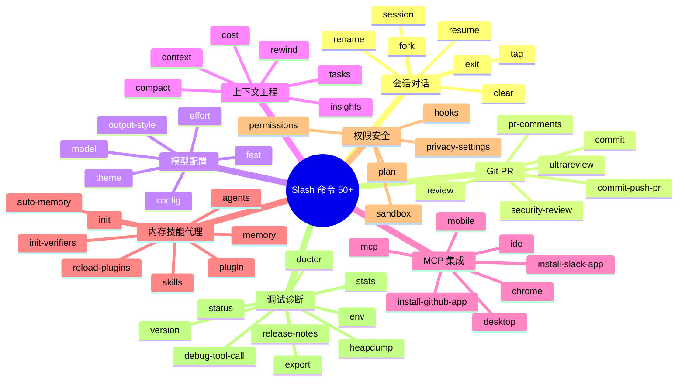
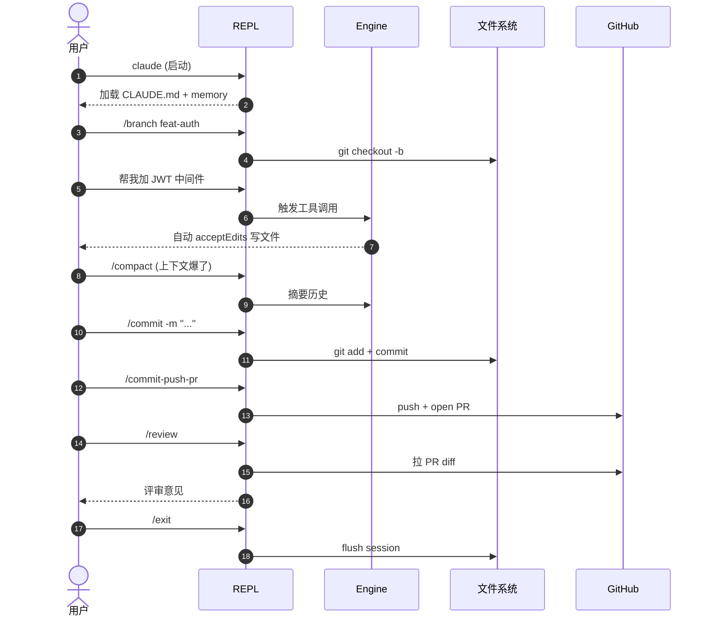

# 第 6 章 Slash 命令速查 —— 50+ 命令、8 大分类、5 个工作流剧本

> **本章定位**:`claude` REPL 中所有 `/` 前缀命令的速查手册。每个命令给一句话功能 + 关键参数 + 来源文件,不展开 INTERNAL_ONLY_COMMANDS(留给开发者章节)。命令注册中枢在 `src/commands.ts:258-346`(`COMMANDS` 数组),分发与编排见 [第 25 章](../04-architect/25-layered-arch.md) L4。

## 摘要

Slash 命令是用户在 REPL 内**绕过模型**直接触发的本地操作 —— `parseSlashCommand` 解析(`slashCommandParsing.ts:25`),`processSlashCommand` 派发(`processSlashCommand.tsx:309`),未匹配则降级为普通 prompt。命令按"会话管理、Git 工作流、模型配置、上下文工程、MCP 集成、内存技能代理、权限与安全、调试诊断"8 大类分组,共 50+ 用户可见命令 + 1 份 INTERNAL_ONLY 列表(ant-only)。5 个角色剧本展示真实一天怎么用。

## 速赢

- **命令注册中枢**:`src/commands.ts:258-346` 的 `COMMANDS` 数组,`memoize` 包裹保证单次求值。
- **类型有 4 种**:`local` / `local-jsx` / `prompt` / `resume`,分发逻辑走 `processSlashCommand.tsx` 的 switch。
- **别名生效**:`builtInCommandNames`(`commands.ts:348-351`)展开每个命令的 `name + aliases`。
- **未知命令**:若输入形如 `/xxx` 但 `hasCommand(xxx) === false`,且看起来不是文件路径,则回显 "Unknown skill: xxx" 并保留 args(gh-32591)。
- **Forked command**:`context:fork` 标记的命令(`/commit`、`/security-review` 等)在子代理中跑,不阻塞主线程;`kairosEnabled` 时改为 fire-and-forget。
- **插件命令**:`/plugin:skill-name`(`parsePluginIdentifier`)与内置命令一起注册,但通过 `pluginInfo.repository` 区分统计。

## 关键图(2 张)

### 6.1 命令分类树



### 6.2 一天工作时序(后端工程师剧本)



## 详细机制

### 6.1 命令注册原理

`COMMANDS` 数组(`src/commands.ts:258-346`)是**用户可见命令的唯一来源**:

```ts
// src/commands.ts:258-346 (摘录)
const COMMANDS = memoize((): Command[] => [
  addDir, advisor, agents, branch, btw, chrome, clear, color, compact,
  config, copy, desktop, context, contextNonInteractive, cost, diff,
  doctor, effort, exit, fast, files, heapDump, help, ide, init,
  keybindings, installGitHubApp, installSlackApp, mcp, memory, mobile,
  model, outputStyle, remoteEnv, plugin, pr_comments, releaseNotes,
  reloadPlugins, rename, resume, session, skills, stats, status,
  statusline, stickers, tag, theme, feedback, review, ultrareview,
  rewind, securityReview, terminalSetup, upgrade, extraUsage,
  extraUsageNonInteractive, rateLimitOptions, usage, usageReport, vim,
  ...(webCmd ? [webCmd] : []),           // CCR_REMOTE_SETUP
  ...(forkCmd ? [forkCmd] : []),         // FORK_SUBAGENT
  ...(buddy ? [buddy] : []),             // BUDDY
  ...(proactive ? [proactive] : []),     // PROACTIVE / KAIROS
  ...(briefCommand ? [briefCommand] : []),  // KAIROS / KAIROS_BRIEF
  ...(assistantCommand ? [assistantCommand] : []), // KAIROS
  ...(bridge ? [bridge] : []),           // BRIDGE_MODE
  ...(remoteControlServerCommand ? [remoteControlServerCommand] : []), // DAEMON+BRIDGE
  ...(voiceCommand ? [voiceCommand] : []),  // VOICE_MODE
  thinkback, thinkbackPlay, permissions, plan, privacySettings, hooks,
  exportCommand, sandboxToggle,
  ...(!isUsing3PServices() ? [logout, login()] : []),
  passes,
  ...(peersCmd ? [peersCmd] : []),       // UDS_INBOX
  tasks,
  ...(workflowsCmd ? [workflowsCmd] : []),  // WORKFLOW_SCRIPTS
  ...(torch ? [torch] : []),             // TORCH
  ...(process.env.USER_TYPE === 'ant' && !process.env.IS_DEMO
    ? INTERNAL_ONLY_COMMANDS : []),
])
```

**关键点**:

- `memoize` 来自 `lodash-es/memoize.js`,保证多次读取 `getCommands()` 只求值一次。
- 条件命令通过 `feature('XXX')` 门控(`bun:bundle` 静态消除),未启用的 bundle 不会包含该命令文件。
- 内部命令通过 `process.env.USER_TYPE === 'ant'` 守卫,外部 build 完全没有。
- 命令优先级:同名校验靠 `hasCommand` + 位置优先级(数组顺序不重要,但插件后注册的可覆盖)。
- 命令类型分布:`local`(本地操作,如 `/clear`)、`local-jsx`(带 React 渲染,如 `/release-notes`)、`prompt`(拼成 system prompt 走模型,如 `/init`)、`resume`(打开 session 选择器)。

### 6.2 命令分类速查(8 大类)

#### 6.2.1 会话/对话管理(7 个)

| 命令 | 一句话 | 关键参数 / 行为 |
|---|---|---|
| `/clear` | 清空当前对话,保留 sessionId | 等同于"新开会话但保留 resume 上下文",`commands/clear/` |
| `/resume [id]` | 按 ID 或交互选择器续接 | `-c` CLI flag 等价;`-r` 不带 ID 弹选择器(`commands/resume/`) |
| `/session` | 会话管理(列出/重命名/打标/删除) | 子命令式,UI 走 React(`commands/session/`) |
| `/rename <name>` | 重命名当前会话,写 EOF metadata | 也更新 terminal title(若 `terminalTitleFromRename: true`) |
| `/tag <tag>` | 给会话打 tag,方便搜索 | 多个 tag 空格分隔,写 jsonl EOF |
| `/fork` | 把当前对话状态 fork 成子代理(USER_TYPE 限定) | `FOR_SUBAGENT` flag,见 `commands/fork/` |
| `/exit` | 优雅退出 | 走 `gracefulShutdownSync(0)`,见 [第 5 章](./05-daily-use.md) |

#### 6.2.2 Git / PR 工作流(6 个)

| 命令 | 一句话 | 关键参数 |
|---|---|---|
| `/commit` | 暂存 + 写 conventional commit message | 可选 `-m <msg>`(`commands/commit.js`) |
| `/commit-push-pr` | commit + push + `gh pr create` 一气呵成 | 需要 `gh` CLI + 已配置 remote |
| `/review` | 评审当前 PR 改动 | 拉 diff + 评论,`commands/review.js` |
| `/ultrareview` | 深度评审(多轮,带 reviewer subagent) | `review` 导出 named export,`commands/review.js` |
| `/pr-comments` | 列出 PR 上未解决的 review comments | `commands/pr_comments/` |
| `/security-review` | 安全视角评审(SAST-like) | `context:fork`,在子代理里跑,`commands/security-review.js` |

#### 6.2.3 模型与配置(6 个)

| 命令 | 一句话 | 关键参数 |
|---|---|---|
| `/model <name>` | 切换模型 | 可选 `opus` / `sonnet` / `haiku` / 完整 ID;`commands/model/` |
| `/effort <level>` | 调整推理 effort | `low` / `medium` / `high` / `max`(ant only);`commands/effort/` |
| `/config` | 打开交互式 settings 编辑器 | TUI 内嵌,改 `userSettings` |
| `/theme` | 切换主题 | 内部用 `theme` 状态机,`commands/theme/` |
| `/output-style <name>` | 切换输出风格(默认/explanatory 等) | 写 `outputStyle` 到 userSettings |
| `/fast` | 切到 fast 模式(快速模型 + 短 context) | 写 `fastMode: true`,`commands/fast/` |

#### 6.2.4 上下文工程(7 个)

| 命令 | 一句话 | 关键参数 |
|---|---|---|
| `/compact` | 摘要历史 + 释放 context | 走 `compact/index.ts`,可强制全量 |
| `/context` | 可视化当前 context window 占用 | `commands/context/`,带 progress bar |
| `/cost` | 显示当前会话累计 USD + token | `commands/cost/` |
| `/insights` | 跨 session 生成使用报告 | lazy 加载 `insights.ts`(113KB),`commands.ts:188-202` |
| `/tasks` | 查看后台任务(CCR / Worker) | `commands/tasks/` |
| `/bashes` | 查看历史 bash 命令(项目内审计) | `commands/bashes/`(部分 build) |
| `/rewind <msgId>` | 回滚文件到指定消息(可整轮或文件级) | `--rewind-files` CLI 等价 |

#### 6.2.5 MCP / 集成(7 个)

| 命令 | 一句话 | 关键参数 |
|---|---|---|
| `/mcp` | MCP server 管理(添加/移除/重连) | 子命令式,`commands/mcp/` |
| `/ide` | IDE 集成配置(VS Code / JetBrains) | 写 `ide` 字段,启动时连接 |
| `/install-github-app` | 引导安装 GitHub App(PR 评论触发) | 走 OAuth flow,`commands/install-github-app/` |
| `/install-slack-app` | 引导安装 Slack App(团队用) | `commands/install-slack-app/` |
| `/chrome` | Chrome 浏览器集成(用 chrome-devtools-mcp) | 启用 `--chrome` flag,`commands/chrome/` |
| `/desktop` | Claude Desktop 互连 | 配 desktop 协议,`commands/desktop/` |
| `/mobile` | Claude Mobile 互连(扫码) | 走 `cc://` deep link,`commands/mobile/` |

#### 6.2.6 内存/技能/代理(8 个)

| 命令 | 一句话 | 关键参数 |
|---|---|---|
| `/memory` | 查看/编辑 `CLAUDE.md` 各级 | `User` / `Project` / `Local`,`commands/memory/` |
| `/skills` | 列出已加载 skill | 包含 builtin + plugin + user,`commands/skills/` |
| `/init` | 引导生成项目级 `CLAUDE.md` | 走 prompt 类型,`commands/init.js` |
| `/init-verifiers` | 引导生成 verifier hook(ant only) | `commands/init-verifiers.js` |
| `/agents` | 管理自定义 agent(查看/编辑) | `commands/agents/` |
| `/plugin` | 插件管理(安装/卸载/启用) | 走 marketplace,`commands/plugin/` |
| `/reload-plugins` | 热重载插件(开发用) | `commands/reload-plugins/` |
| `/auto-memory` | 切换 auto memory 开关 | 写 `autoMemoryEnabled`,`commands/memory/` |

#### 6.2.7 权限与安全(5 个)

| 命令 | 一句话 | 关键参数 |
|---|---|---|
| `/permissions` | 可视化 rules 增删 | `add` / `remove` 子命令,`commands/permissions/` |
| `/plan` | 切到 Plan Mode(只读规划) | 等价 `--permission-mode plan`,`commands/plan/` |
| `/privacy-settings` | 隐私设置(遥测/数据共享) | `commands/privacy-settings/` |
| `/hooks` | Hook 可视化编辑 | 子命令式,`commands/hooks/` |
| `/sandbox` | 切到 sandbox 模式(Mac seatbelt) | `commands/sandbox-toggle/` |

#### 6.2.8 调试与诊断(9 个)

| 命令 | 一句话 | 关键参数 |
|---|---|---|
| `/doctor` | 诊断环境(MCP/网络/权限) | 走 `commands/doctor/` |
| `/debug-tool-call` | 手工触发一次 tool call(ant only) | INTERNAL_ONLY |
| `/heapdump` | 抓 V8 heap snapshot | 写到 `~/.claude/debug/`,`commands/heapdump/` |
| `/version` | 输出版本 + build hash | ant only |
| `/release-notes` | 显示当前版本 release notes | 渲染 markdown,`commands/release-notes/` |
| `/status` | 当前 session 状态(模型/权限/上下文) | `commands/status/` |
| `/stats` | 本周/今日使用统计(USD + turn 数) | `commands/stats/` |
| `/env` | 显示生效的 env vars(ant only) | INTERNAL_ONLY |
| `/export` | 导出当前 session 为 markdown | `commands/export/` |

#### 6.2.9 其他(辅助 + 登录 + UI + 升级)

| 类别 | 命令 | 一句话 |
|---|---|---|
| 工作流 | `/btw` | 旁注问题(不打断主对话) |
| 工作流 | `/color` | 切换 ANSI 颜色 |
| 工作流 | `/copy` | 复制最后一条 assistant 回复 |
| 工作流 | `/diff` | 显示未提交改动 |
| 工作流 | `/files` | 列出 session 读过的文件 |
| 工作流 | `/add-dir <path>` | 添加额外工作目录(可读) |
| 工作流 | `/passes` | 显示订阅 pass / 余额(Pro 用户) |
| 登录 | `/login` | 走 OAuth(仅非 3P 用户) |
| 登录 | `/logout` | 清空 keychain + 远端 session |
| UI | `/vim` | 切到 vim 键位 |
| UI | `/keybindings` | 键位编辑器(`commands/keybindings/`) |
| UI | `/voice` | 启用语音输入(VOICE_MODE) |
| UI | `/theme` | 主题切换 |
| 升级 | `/upgrade` | 检查更新 + 引导升级 |
| 升级 | `/usage` | 本月用量 |
| 升级 | `/extra-usage` | 购买额外额度 |
| 升级 | `/rate-limit-options` | 配置限流策略 |
| 升级 | `/reset-limits` | 重置限流(ant only) |
| UI | `/statusline` | 自定义 status line 配置 |
| UI | `/stickers` | 显示彩蛋贴纸 |

### 6.3 5 个角色剧本

#### 剧本 1:后端工程师一天的工作流

早上 9:00,小张(后端工程师)开始工作:

1. 终端里输入 `claude`,进入 REPL;模型自动加载昨天最后一个 session(用 `claude -c`)。
2. `/branch feat-user-avatar` —— 让 Claude 帮你建分支(其实是调 `git checkout -b`)。
3. 粘贴 issue 链接,说"帮我实现头像上传到 S3"。
4. Claude 用了大约 15 次工具调用(读文件、写文件、Bash 跑测试)完成实现。`acceptEdits` 模式下,`modeValidation.ts:7-21,38-50` 把 mkdir/touch/rm/mv/cp/sed 自动放行。
5. 写到一半 context 满了,按 `Shift+Tab` 切到 `plan`,或直接 `/compact`。
6. 写完 `/commit -m "feat(avatar): add S3 upload"`,Claude 自动写 conventional 格式。
7. `/commit-push-pr` 一气呵成,自动 `gh pr create`。
8. 下午 3 点,同事在 PR 留了 review,`/pr-comments` 拉评论,逐条回复。
9. 5 点准备收工,`/review` 自己审一遍(让 Claude 扮 reviewer),`/stats` 看今天用了多少钱。
10. `/exit` 退出,明天 `claude -c` 续接。

#### 剧本 2:全栈新人 onboarding

新人小王第一天到岗:

1. `claude`,看到 `Welcome!` 提示。
2. `/memory` 看了下本项目 CLAUDE.md,发现"项目使用 pnpm + turborepo,所有 PR 必须有测试"。
3. `/init` 让 Claude 帮他加深 CLAUDE.md(原来太短)。
4. `/skills` 看可用 skill,发现团队装了 `commit-message-helper@team-marketplace`。
5. 拉代码后 `/doctor` 跑一遍,Claude 提示"未配置 `gh` CLI,无法 `/commit-push-pr`",小王装好。
6. 第一次提交:`/commit`,Claude 按团队 commit 规范写。
7. 老员工 review,小王看 `/review` 的输出(其他 session 的评审),学风格。
8. 第二天小王自己写代码,Claude 提示他遵循 CLAUDE.md 里的规范。

#### 剧本 3:调试老项目

老李接手 3 年前的 Node.js 项目:

1. `claude`,没看到 CLAUDE.md(老项目没建),`/init` 让他生成。
2. 跑 `npm test` 全红,问"为什么这些测试失败?"
3. Claude 用 Read/Bash 调研,发现是 Node 版本太新导致 deprecated API。
4. `/context` 看 context 占用,然后 `/compact` 摘要。
5. 让 Claude 修,`acceptEdits` 自动放行。
6. 写到一半想撤回,`/rewind <msgId>` 回滚到之前。
7. 修好后 `/commit`,`/security-review` 让 Claude 跑一遍安全视角(用子代理,不阻塞)。

#### 剧本 4:准备 release

release 经理小赵做 v2.0 发布:

1. `claude`,`/release-notes` 看看本版本说明。
2. `/doctor` 检查环境,确认 MCP / 远端 OK。
3. `/status` 看当前 session 状态,确认是 `opus` 模型 + `default` 权限。
4. 写 changelog:`/context` 看 context 占用,确认有空间。
5. `/compact` 清理,准备总结。
6. `/stats` 看本周用量(给老板汇报)。
7. `/upgrade` 看看有没有新版(团队用 stable channel)。
8. `/exit` 退出,正式发版。

#### 剧本 5:团队多人协作

团队 5 个人同时改一个 monorepo:

1. 项目根有 `.claude/settings.json`(project),`/memory` 看到"项目约定"。
2. 每人本地 `.claude/settings.local.json` 放个人偏好(走 gitignore,自动加入)。
3. 新人用 `/plugin install formatter@team-marketplace` 装团队插件(项目根 `extraKnownMarketplaces` 已配)。
4. CI 里跑 `claude --bare -p "review this diff"` 评审 PR,启动 ~120ms。
5. 有人误改 `.claude/settings.json` 提交,Claude 拒绝(项目有 hook `PreToolUse: Edit(.claude/settings.json) → ask`)。
6. 团队用 `MCP Slack App`,`/install-slack-app` 后可在 Slack 里召唤 Claude。

### 6.4 命令发现机制

用户在 REPL 输入 `/` 时,会弹出**补全列表**:

- 内置命令(本节列出)+ 插件命令 + 动态 skill。
- 来源是 `builtInCommandNames()` + 插件 manifest + skill discovery。
- 优先级:内置 > 插件(按 marketplace 顺序)> skill。

### 6.5 Forked command 详解

带 `context:fork` 标记的命令(`/commit`、`/security-review`、`/init` 等)在**子代理**中执行:

- 主线程不阻塞,显示子代理进度(`processSlashCommand.tsx:62-295` 的 `executeForkedSlashCommand`)。
- 子代理有独立 system prompt、model(可覆盖)、tool 集。
- `kairosEnabled` 时改为 fire-and-forget(`processSlashCommand.tsx:102-183`),后台跑,完成后用 `enqueuePendingNotification` 回到主队列。

### 6.6 INTERNAL_ONLY 命令(ant-only)

`src/commands.ts:225-254` 列出 25 个内部命令,**不向外部用户暴露**:

- `backfillSessions` `breakCache` `bughunter` `commit` `commitPushPr` `ctx_viz`
- `goodClaude` `issue` `initVerifiers` `forceSnip` `mockLimits`
- `bridgeKick` `version` `ultraplan` `subscribePr`
- `resetLimits` `resetLimitsNonInteractive`
- `onboarding` `share` `summary` `teleport`
- `antTrace` `perfIssue` `env` `oauthRefresh`
- `debugToolCall` `agentsPlatform` `autofixPr`

外部 build 通过 `process.env.USER_TYPE === 'ant' && !process.env.IS_DEMO` 守卫过滤(`commands.ts:343-345`)。

## 反模式

- **不要在 print 模式用 `/` 命令**:print 模式(`-p`)一次性执行,Slash 命令的 UI 渲染会被截断,改用 CLI flag。
- **不要把 INTERNAL_ONLY 命令写到用户文档**:它们是 ant 内部工具,外部 build 根本不存在。
- **不要假设命令顺序**:数组顺序对用户可见性无影响,`builtInCommandNames` 用 `Set` 展开。
- **不要 fork 太多**:forked command 开子代理,资源消耗大,优先用 `acceptEdits` + Bash 即可。
- **`/init` 不要在已有 CLAUDE.md 的项目里跑**:会覆盖你的定制内容。先 `/memory` 看现状。

## 引用

- 命令注册中枢:`src/commands.ts:258-346`
- 命令解析:`src/utils/slashCommandParsing.ts:25`(`parseSlashCommand`)
- 命令派发:`src/utils/processUserInput/processSlashCommand.tsx:309`(`processSlashCommand`)
- Forked 执行:`src/utils/processUserInput/processSlashCommand.tsx:62`(`executeForkedSlashCommand`)
- INTERNAL_ONLY 列表:`src/commands.ts:225-254`
- 类型定义:`src/types/command.ts`
- Shift+Tab 模式切换:`src/utils/permissions/getNextPermissionMode.ts:34`
- 权限模式对话:`src/components/BypassPermissionsModeDialog.tsx:12-79`
- 模式优先级:`src/utils/permissions/permissionSetup.ts:689-811`
- Plan 模式实现:[第 29 章](../04-architect/29-permission.md)
- 会话管理:[第 5 章](./05-daily-use.md)
