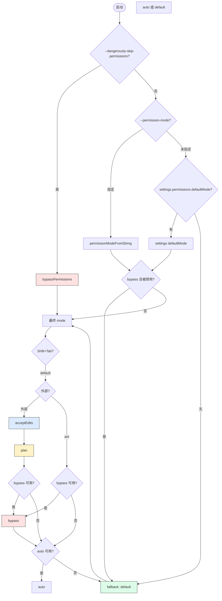
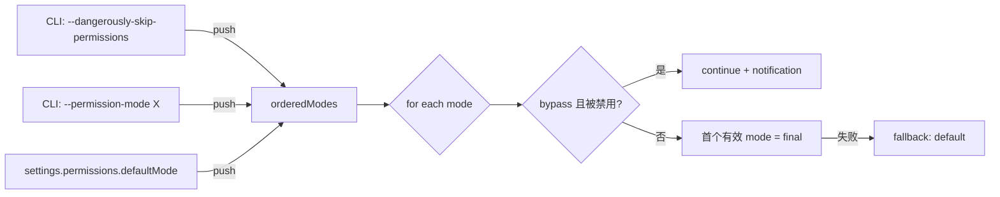

# 第 7 章 权限系统(用户视角)—— 7 种模式、优先级链、Shift+Tab 切换

> **本章定位**:`claude` 的 7 种 `PermissionMode` 及它们对工具调用的影响。架构细节(五阶段检查链、11 种 `PermissionDecisionReason` 变体)见 [第 29 章](../04-architect/29-permission.md),本章只看**用户行为**层面:怎么选模式、什么时候选、被谁禁用、规则怎么写。

## 摘要

`PermissionMode` 是当前会话的"信任级别"开关。**用户可见 5 种**(`default` / `acceptEdits` / `bypassPermissions` / `plan` / `dontAsk`)+ 内部 2 种(`auto` 仅 ant 用、`bubble` 是类型层不可选)。`Shift+Tab` 循环切换(`defaultBindings.ts:30-69` + `getNextPermissionMode.ts:34`)。优先级链 4 层:CLI flag → `permissionModeFromString` → settings.permissions.defaultMode → fallback `default`(`permissionSetup.ts:689-811`)。规则引擎有 3 张白/黑/灰名单(allow/deny/ask),由 5 阶段检查链消费。

## 速赢

- **5 种用户可见模式**:`default`(每次弹窗)、`acceptEdits`(自动放行文件命令)、`bypassPermissions`(全放行,危险)、`plan`(只读规划)、`dontAsk`(失败即终止)。
- **2 种内部模式**:`auto`(TRANSCRIPT_CLASSIFIER 启用 + opt-in + circuit breaker 闭合才出现)、`bubble`(类型层占位)。
- **Shift+Tab 切换**:外部用户走 `default → acceptEdits → plan → bypass → default` 循环,ant 用户跳过 `acceptEdits` 直接 `default → bypass → auto → default`。
- **优先级链**:`--dangerously-skip-permissions` > `--permission-mode` > `settings.permissions.defaultMode` > `default`。
- **bypass 可被禁用**:`disableBypassPermissionsMode: "disable"`(settings)或 Statsig gate `tengu_disable_bypass_permissions_mode`。
- **规则三色**:allow(放行)/ deny(拒绝)/ ask(弹窗),分别存在 `settings.permissions.{allow,deny,ask}` 数组里。
- **过度宽泛检测**:`findOverlyBroadBashPermissions` 在保存时检查 `Bash(*)` 这种危险规则并提示用户。
- **平台差异**:CCR(`CLAUDE_CODE_REMOTE`)只支持 `acceptEdits` / `plan` / `default`,其他 settings.defaultMode 会被忽略(`permissionSetup.ts:746-758`)。

## 关键图(1 张)

### 7.1 权限模式决策与切换流程



> **图例**:红色 = 高风险(bypass);绿色 = 最安全(default);蓝色 = 自动放行(acceptEdits);黄色 = 规划模式(plan)。

## 详细机制

### 7.1 7 种 PermissionMode 详解

#### 7.1.1 `default`(基础)

```ts
// src/utils/permissions/PermissionMode.ts:45-51
default: {
  title: 'Default',
  shortTitle: 'Default',
  symbol: '',
  color: 'text',
  external: 'default',
},
```

- **行为**:每次工具调用都**弹 PermissionDialog**,用户选 Yes / No / Yes-for-session。
- **适用**:日常 dev、对项目结构不熟、需要审慎。
- **是 fallback**:所有未通过更高优先级指定时,落到 `default`。

#### 7.1.2 `acceptEdits`(自动放行文件命令)

```ts
// src/utils/permissions/PermissionMode.ts:59-65
acceptEdits: {
  title: 'Accept edits',
  shortTitle: 'Accept',
  symbol: '⏵⏵',
  color: 'autoAccept',
  external: 'acceptEdits',
},
```

- **行为**:Bash 工具的 7 个文件系统子命令 + Edit/Write 工具**自动放行**:
  - `mkdir` `touch` `rm` `rmdir` `mv` `cp` `sed`(`BashTool/modeValidation.ts:7-21` 的 `ACCEPT_EDITS_ALLOWED_COMMANDS`)
  - PowerShell 模式对应:Remove-Item / New-Item / Set-Content / Copy-Item / Move-Item / Rename-Item / Set-Item / Clear-Content / Add-Content 等(`PowerShellTool/modeValidation.ts`)
- **判定逻辑**:`validateCommandForMode()` 在 `modeValidation.ts:23-50` 检查 baseCmd 是否在白名单,命中则返回 `allow` + reason `mode: 'acceptEdits'`。
- **绕过守卫**:`modeValidation.ts:38-40` 用 `toolPermissionContext.mode === 'acceptEdits' && isFilesystemCommand(baseCmd)`。
- **安全保护**:
  - 复合命令 + `cd` 改变 cwd → 拒绝自动放行(`PowerShellTool/modeValidation.ts:218-224` 的 cwd desync guard)
  - 符号链接创建 → 拒绝自动放行(`modeValidation.ts:235-242`)
  - 表达式源(`/etc/passwd | Remove-Item`)→ 拒绝(`modeValidation.ts:249-269`)
  - 路径化命令名(`scripts\Remove-Item`)→ 拒绝(`modeValidation.ts:271-278`)
- **适用**:改文件密集的 feature 开发(写完代码还要自己跑 git,需要再确认)。

#### 7.1.3 `bypassPermissions`(危险:全放行)

```ts
// src/utils/permissions/PermissionMode.ts:66-72
bypassPermissions: {
  title: 'Bypass Permissions',
  shortTitle: 'Bypass',
  symbol: '⏵⏵',
  color: 'error',
  external: 'bypassPermissions',
},
```

- **行为**:**所有工具调用都自动 allow**,不再弹窗。
- **启用方式**:
  1. CLI: `claude --dangerously-skip-permissions`
  2. CLI: `claude --permission-mode bypassPermissions`
  3. 切换:`Shift+Tab` 直到看到红色 ⏵⏵(如果可用)
- **启动对话框**:`BypassPermissionsModeDialog.tsx:12-79` 弹出红色警告,文字:
  > "In Bypass Permissions mode, Claude Code will not ask for your approval before running potentially dangerous commands. This mode should only be used in a sandboxed container/VM that has restricted internet access and can easily be restored if damaged."
- **持久化**:用户点 "Yes, I accept" 后,写 `userSettings.skipDangerousModePermissionPrompt = true`(`BypassPermissionsModeDialog.tsx:32-34`)。
- **重要:bypass 免疫点**:即使在 bypass 模式下,有些点**仍会弹窗**:
  - `safetyCheck` 决策原因(`permissions.ts:1252-1260`,最高优先级)
  - 内容级 `ask` 规则(`permissions.ts:1244-1250`)
  - 工具 `requiresUserInteraction && ask`(`permissions.ts:1230`)
- **可被禁用**:
  - settings: `"permissions": { "disableBypassPermissionsMode": "disable" }`
  - 远程:Statsig gate `tengu_disable_bypass_permissions_mode`
  - 见 `permissionSetup.ts:699-711`、`778-792`
- **适用**:CI / 流水线、容器内、有完整备份的环境。

#### 7.1.4 `plan`(只读规划)

```ts
// src/utils/permissions/PermissionMode.ts:52-58
plan: {
  title: 'Plan Mode',
  shortTitle: 'Plan',
  symbol: PAUSE_ICON,
  color: 'planMode',
  external: 'plan',
},
```

- **行为**:
  - 模型必须用 `ExitPlanMode` 工具提交计划
  - 期间只允许**只读工具**(Read/Grep/Glob),写操作会被拒绝
  - 用户在 `ExitPlanModePermissionRequest` 对话框批准后,模式切回上一档
- **批准时副作用**(`ExitPlanModePermissionRequest.tsx:56-76` 的 `buildPermissionUpdates`):
  - `setMode` 切回 `acceptEdits` 或 `default`
  - 可选:`addRules` 添加 `allowedPrompts` 转换的规则(ant-only `isClassifierPermissionsEnabled`)
- **UI**:左下角显示 `⏸ Plan` 标记。
- **适用**:复杂任务(实现多文件),先看方案再批准。

#### 7.1.5 `dontAsk`(失败即终止)

```ts
// src/utils/permissions/PermissionMode.ts:73-79
dontAsk: {
  title: "Don't Ask",
  shortTitle: 'DontAsk',
  symbol: '⏵⏵',
  color: 'error',
  external: 'dontAsk',
},
```

- **行为**:遇到 `ask` 决策时**直接 deny**,不弹窗(`permissions.ts:508` 的 mode 转换)。
- **场景**:无人值守自动化、批处理。
- **不在 UI 循环**:`getNextPermissionMode.ts:70-72` 标注 "Not exposed in UI cycle yet",只有 CLI 可设。

#### 7.1.6 `auto`(TRANSCRIPT_CLASSIFIER 启用,ant-only)

```ts
// src/utils/permissions/PermissionMode.ts:80-90
...(feature('TRANSCRIPT_CLASSIFIER') ? {
  auto: {
    title: 'Auto mode',
    shortTitle: 'Auto',
    symbol: '⏵⏵',
    color: 'warning',
    external: 'default',  // 注意:对外仍然映射为 default
  },
} : {}),
```

- **行为**:用 transcript classifier(LLM 评判器)对工具调用做二次判定,有信心就 `allow`,否则降级为 `ask`。
- **三道闸**:
  1. **circuit breaker**(远端控制):`getAutoModeEnabledStateIfCached() === 'disabled'` → 强制 fallback 到 default(`permissionSetup.ts:717-719`)
  2. **opt-in dialog**:用户必须先接受 `AutoModeOptInDialog`(写 `skipAutoPermissionPrompt: true`)
  3. **gate check**:`isAutoModeGateEnabled()` + `ctx.isAutoModeAvailable`(`getNextPermissionMode.ts:17-29` 双查)
- **入口**:`Shift+Tab` 在 ant 用户循环里(`getNextPermissionMode.ts:42-49`)可切到。
- **自定义规则**:`settings.autoMode.{allow, soft_deny, environment}` 数组控制分类器 prompt。

#### 7.1.7 `bubble`(类型层占位,不可选)

- **来源**:`InternalPermissionMode` 类型定义里有这个值,但运行时**没有任何分支处理它**。
- **作用**:`isExternalPermissionMode` 用 `mode !== 'auto' && mode !== 'bubble'` 过滤。
- **不存在 UI/CLI 入口**。

### 7.2 优先级链

来源:`src/utils/permissions/permissionSetup.ts:689-811` 的 `initialPermissionModeFromCLI`。



**4 个信号源**(从高到低):

1. **CLI `--dangerously-skip-permissions`**:`boolean`,直接 push `'bypassPermissions'`(`permissionSetup.ts:725-727`)。
2. **CLI `--permission-mode <X>`**:`permissionModeFromString` 解析(`permissionSetup.ts:728-742`)。CCR(remote)只支持 `acceptEdits` / `plan` / `default`,其他被忽略。
3. **`settings.permissions.defaultMode`**:`getSettings_DEPRECATED().permissions?.defaultMode`(`permissionSetup.ts:743-773`)。
4. **fallback**:`'default'`(`permissionSetup.ts:798-800`)。

**bypass 双重守卫**(`permissionSetup.ts:698-711`):

- **Statsig 门**:`tengu_disable_bypass_permissions_mode` —— 远程 kill switch。
- **settings**:`disableBypassPermissionsMode === 'disable'`。
- 两者任一为真,bypass 就被跳到 fallback。

### 7.3 Shift+Tab 模式切换

**键位定义**:`src/keybindings/defaultBindings.ts:30` 与 `:69`:

```ts
// src/keybindings/defaultBindings.ts:30
const MODE_CYCLE_KEY = SUPPORTS_TERMINAL_VT_MODE ? 'shift+tab' : 'meta+m'
// ...
[MODE_CYCLE_KEY]: 'chat:cycleMode',
```

**平台差异**(`defaultBindings.ts:17-30`):

- 终端支持 VT 模式(macOS / Linux / Win+新版 Node 22.17+/Bun 1.2.23+):`shift+tab`
- 老的 Windows Terminal:`meta+m`(`shift+tab` 不可靠)

**循环逻辑**:`src/utils/permissions/getNextPermissionMode.ts:34-79`

| 当前模式 | 外部用户下一步 | ant 用户下一步 |
|---|---|---|
| `default` | `acceptEdits` | `bypass` → `auto` → `default` |
| `acceptEdits` | `plan` | (跳过) |
| `plan` | `bypass`(若可用)→ `auto` → `default` | `bypass` → `auto` → `default` |
| `bypass` | `auto`(若可用)→ `default` | `auto` → `default` |
| `dontAsk` | `default`(未在 UI) | `default` |
| `auto` | `default` | `default` |

**前置副作用**:`cyclePermissionMode()`(`getNextPermissionMode.ts:88-101`)调 `transitionPermissionMode()`,处理 dangerous permission 的"剥离/恢复":

- 进 `auto`:strip 掉 `bypass`-only 规则(它们在 auto 模式下没意义)
- 退 `auto` → `default`:restore 规则

### 7.4 规则引擎(`allow` / `deny` / `ask`)

**Schema**:`src/utils/settings/types.ts:42-85` 的 `PermissionsSchema`:

```json
{
  "permissions": {
    "allow": [
      "Bash(npm test*)",
      "Read(~/.zshrc)"
    ],
    "deny": [
      "Bash(rm -rf /*)"
    ],
    "ask": [
      "Bash(git push*)"
    ],
    "defaultMode": "acceptEdits",
    "disableBypassPermissionsMode": "disable",
    "additionalDirectories": ["/tmp/shared"]
  }
}
```

**规则语法**(permission rule 形式):

- 工具名: `Bash` / `Read` / `Edit` / `Write` / `WebFetch` / ...
- 工具括号: `Bash(<command-pattern>)` / `Read(<glob>)`
- 示例:
  - `"Bash(git status)"` —— 精确匹配
  - `"Bash(npm *)"` —— 前缀匹配
  - `"Bash(*)"` —— **危险**:匹配所有 bash,会被 `findOverlyBroadBashPermissions` 警告
  - `"Read(~/.claude/**)"` —— 路径 glob

**5 阶段消费**(详见 [第 29 章](../04-architect/29-permission.md)):

1. **整工具 deny** 规则命中 → `deny`
2. **整工具 ask** 规则命中 → `ask`(沙箱可穿透)
3. 工具自身 `checkPermissions` → `deny` / `allow` / `passthrough`
4. **内容级 ask** 规则 → `ask`(bypass 免疫)
5. `safetyCheck` → `ask`(bypass 免疫,最高优先级)
6. bypass 模式 → `allow`
7. 工具 always-allowed 规则 → `allow`

### 7.5 Bypass 禁用机制

**3 个开关**(可叠加):

1. **Statsig 远端门**:`tengu_disable_bypass_permissions_mode`
   - 远程 kill switch,管理员可在 Statsig 控制台一键关闭全公司用户的 bypass。
   - 代码:`permissionSetup.ts:699-702`
2. **Settings 标记**:`"permissions": { "disableBypassPermissionsMode": "disable" }`
   - 用户/企业可在 `settings.json` 显式禁用。
   - 代码:`permissionSetup.ts:705-706`
3. **CCR 限制**:`CLAUDE_CODE_REMOTE=1` 时,settings.defaultMode 只能是 `acceptEdits` / `plan` / `default`,即使是 `bypass` 也会被忽略。
   - 代码:`permissionSetup.ts:746-758`

**优先级**:Statsig > settings(`permissionSetup.ts:709-711`)。

**当 bypass 被禁用时**:
- `Shift+Tab` 循环里**跳过** `bypassPermissions`(`getNextPermissionMode.ts:42-43,56-57` 都有 `isBypassPermissionsModeAvailable` 守卫)。
- CLI `--dangerously-skip-permissions` 不会生效。
- 用户看到通知 `"Bypass permissions mode was disabled by your organization policy"`(`permissionSetup.ts:783-789`)。

### 7.6 过度宽泛规则检测

**入口**:`findOverlyBroadBashPermissions()` 在 `AddPermissionRules` 保存时跑。

**危险模式**(会被警告):

- `Bash(*)` —— 全部 bash
- `Bash(*  *)` —— 含两个空格的 glob
- 极长 prefix(超过 50 字符)

**用户体验**:`/permissions` 添加规则时,UI 高亮警告;不是"硬阻止",用户可继续保存。

### 7.7 平台差异速查

| 平台 | mode 限定 |
|---|---|
| Claude.ai Pro/Max 登录 | 所有外部 5 种 |
| Claude Console / 第三方 API | 所有外部 5 种(部分跳过 `bypass` dialog) |
| CCR(remote 环境) | 只 `acceptEdits` / `plan` / `default` |
| CI 容器(`--bare`) | 同外部,可用 `bypass` |
| ant(USER_TYPE=ant) | 含 `auto`,Shift+Tab 跳过 `acceptEdits` |

## 反模式

- **不要在生产服务用 `bypassPermissions`**:即使有备份,误删数据库也是事故。
- **不要写 `Bash(*)` 这种规则**:等价于关掉权限系统,`/permissions` 会警告。
- **不要混用 `disableBypassPermissionsMode` 与 `bypassPermissions`**:前者会"静默"忽略后者,容易困惑。
- **不要相信 `dontAsk` 是"安全模式"**:它是"失败模式",把"忘了加规则"的工具调用变成 silent deny,debug 困难。
- **Plan mode 不是写代码模式**:它是只读,ExitPlanMode 必须用。
- **不要在 `plan` 模式下用 Bash 装包**:只能读,改用 `acceptEdits`。

## 引用

- 模式定义:`src/types/permissions.ts:14-40`
- 模式 UI 配置:`src/utils/permissions/PermissionMode.ts:42-91`
- 优先级链:`src/utils/permissions/permissionSetup.ts:689-811`
- 模式切换逻辑:`src/utils/permissions/getNextPermissionMode.ts:34-101`
- Shift+Tab 键位:`src/keybindings/defaultBindings.ts:30,69`
- Bypass 对话框:`src/components/BypassPermissionsModeDialog.tsx:12-79`
- acceptEdits Bash 白名单:`src/tools/BashTool/modeValidation.ts:7-21,38-50`
- acceptEdits PowerShell 守卫:`src/tools/PowerShellTool/modeValidation.ts:218-242`
- 规则 schema:`src/utils/settings/types.ts:42-85`
- 5 阶段检查链:[第 29 章](../04-architect/29-permission.md)
