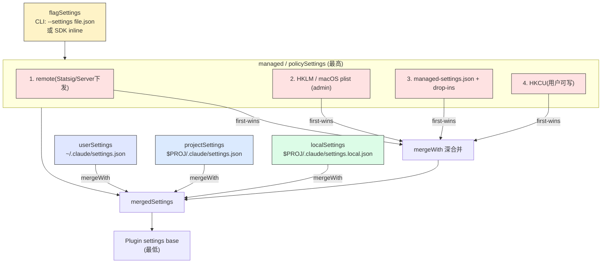
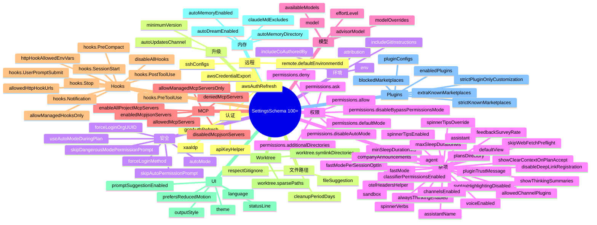

# 第 8a 章 settings.json 字段全解 —— 4 层加载源 + 100+ 字段参考

> **本章定位**:`.claude/settings.json` 100+ 字段的完整参考手册。从 4 层加载源讲起,逐一介绍每个字段的类型、默认值、典型场景。Schema 唯一真源是 `src/utils/settings/types.ts:255-1073` 的 `SettingsSchema()`(用 zod 校验)。

## 摘要

`settings.json` 是 Claude Code 的**主配置载体**。有 4 层加载源(managed / user / project / local),通过 `loadSettingsFromDisk` (`settings.ts:645-796`)按优先级合并。还有第 5 层 `flagSettings`(CLI `--settings` 或 SDK 内联)作为最高优先级。**全部 100+ 字段**按功能分为:认证、文件/路径、环境、权限、模型、MCP、Hooks、Worktree、UI、内存、Skills/Plugins、远程、升级、安全、杂项。

## 速赢

- **4 层固定优先级**(从高到低,可被禁用):
  1. **policySettings / managed**(企业下发,优先级最高,通常只读)
  2. **userSettings**:`~/.claude/settings.json`(个人全局)
  3. **projectSettings**`<cwd>/.claude/settings.json`(项目内,可纳入 git)
  4. **localSettings**`<cwd>/.claude/settings.local.json`(本地私有,gitignore)
- **5 层实际**:再加 `flagSettings`(CLI `--settings <file>` 或 SDK inline),在 managed 之上。
- **深合并**:用 `lodash.mergeWith` + `settingsMergeCustomizer`,数组按 uniq 拼接,但**显式 `undefined` 等于删除**。
- **Schema 守门**:`SettingsSchema()` zod 校验;`.passthrough()` 保留未识别字段不丢失。
- **加载性能**:`parseSettingsFile`(`settings.ts:178-199`)有 LRU 缓存,重复读不重复 IO。
- **典型场景**:
  - 个人偏好 → `userSettings`
  - 团队规范 → `projectSettings` 进 git
  - 个人对项目的覆盖 → `localSettings` gitignore
  - 企业强制 → managed(系统/IT 下发)
  - 临时测试 → `flagSettings`

## 关键图(2 张)

### 8a.1 4+1 层加载源与优先级



> **红色** = managed(企业下发,通常只读) **黄色** = flag(临时) **绿色** = local(私有) **蓝色** = project(团队共享) **紫色** = user(个人全局)

### 8a.2 字段分类树



## 详细机制

### 8a.1 加载顺序详解

**入口**:`src/utils/settings/settings.ts:645-796` 的 `loadSettingsFromDisk()`。

**合并顺序**(从低到高覆盖):

1. **Plugin settings base**(`getPluginSettingsBase()`):最低,只含 allowlist 字段(如 `agent`)。
2. **policySettings**(`getEnabledSettingSources()` 列表,first-wins):
   - **remote** 优先(`getRemoteManagedSettingsSyncFromCache()`)
   - 然后 **MDM**:`getMdmSettings()`(Windows HKLM / macOS plist)
   - 然后 **file-based**:`loadManagedFileSettings()` 合并 `managed-settings.json` + `managed-settings.d/*.json`
   - 最后 **HKCU**:`getHkcuSettings()`(Windows 注册表用户区)
3. **userSettings**:`~/.claude/settings.json`
4. **projectSettings**:`<cwd>/.claude/settings.json`
5. **localSettings**:`<cwd>/.claude/settings.local.json`
6. **flagSettings**:`<CLI --settings>` + SDK inline(`getFlagSettingsInline()`)

**关键代码片段**(`settings.ts:660-668`):

```ts
const pluginSettings = getPluginSettingsBase()
let mergedSettings: SettingsJson = {}
if (pluginSettings) {
  mergedSettings = mergeWith(
    mergedSettings,
    pluginSettings,
    settingsMergeCustomizer,
  )
}
```

**source 路径解析**(`settings.ts:274-307` 的 `getSettingsFilePathForSource`):

| source | 文件路径 |
|---|---|
| `userSettings` | `~/.claude/settings.json`(cowork 模式时为 `cowork_settings.json`) |
| `projectSettings` | `$PROJ/.claude/settings.json` |
| `localSettings` | `$PROJ/.claude/settings.local.json` |
| `policySettings` | `managed-settings.json` + drop-ins |
| `flagSettings` | `getFlagSettingsPath()`(由 `--settings` 决定) |

**去重 + 错误去重**(`settings.ts:670-671, 746-758`):

```ts
const seenFiles = new Set<string>()
const seenErrors = new Set<string>()
// ...
if (!seenFiles.has(resolvedPath)) {
  seenFiles.add(resolvedPath)
  // ...
}
```

防止同一文件被加载多次 + 错误去重。

**policySettings 的 first-wins**(`settings.ts:677-739`):

```ts
if (source === 'policySettings') {
  // 1. Remote 优先
  const remoteSettings = getRemoteManagedSettingsSyncFromCache()
  if (remoteSettings && Object.keys(remoteSettings).length > 0) {
    return remoteSettings  // 整个 source 用 remote
  }
  // 2. MDM
  if (!policySettings) { /* ... */ }
  // 3. file
  // 4. HKCU
}
```

注意 policySettings 是**整源替换**而非字段级合并 —— 这是 enterprise 管理语义,保证 admin 改了 1 个字段不会让其他源意外"补回"。

### 8a.2 字段全解

> 字段顺序按"使用频率 + 重要性"组织。每个字段给:类型、默认值、典型场景、文件:行号。

#### 8a.2.1 认证(5 个)

| 字段 | 类型 | 用途 | 源 |
|---|---|---|---|
| `apiKeyHelper` | `string?` | 脚本路径,输出 auth 值(stdout) | `types.ts:262-265` |
| `awsCredentialExport` | `string?` | AWS 凭证导出脚本 | `types.ts:266-269` |
| `awsAuthRefresh` | `string?` | AWS auth 刷新脚本 | `types.ts:270-273` |
| `gcpAuthRefresh` | `string?` | GCP ADC 刷新(`gcloud auth application-default login`) | `types.ts:274-279` |
| `xaaIdp` | `{issuer, clientId, callbackPort?}` | SEP-990 IdP 连接,需 `CLAUDE_CODE_ENABLE_XAA=1` | `types.ts:284-310` |

**典型场景**:

- `apiKeyHelper` 用于企业代理 token(每次 401 自动跑脚本换新)。
- `awsAuthRefresh` 用于 Bedrock 长期运行(凭证快过期时刷新)。

#### 8a.2.2 文件/路径(3 个)

| 字段 | 类型 | 默认 | 用途 | 源 |
|---|---|---|---|---|
| `fileSuggestion` | `{type:'command', command}` | — | 自定义 `@` 提及的文件补全(从脚本拉候选) | `types.ts:311-317` |
| `respectGitignore` | `boolean?` | `true` | 文件选择器是否尊重 `.gitignore`(注:`.ignore` 总被尊重) | `types.ts:318-324` |
| `cleanupPeriodDays` | `number?` (>=0) | `30` | chat transcript 保留天数,`0` 关闭持久化 | `types.ts:325-332` |

#### 8a.2.3 环境(4 个)

| 字段 | 类型 | 用途 | 源 |
|---|---|---|---|
| `env` | `Record<string,string>?` | session 启动时注入 env vars | `types.ts:333-335` |
| `attribution.commit` | `string?` | git commit 尾部的 attribution;空字符串隐藏 | `types.ts:337-358` |
| `attribution.pr` | `string?` | PR description 里的 attribution | `types.ts:346-352` |
| `includeCoAuthoredBy` | `boolean?` | **deprecated**,用 `attribution` 替代 | `types.ts:359-365` |
| `includeGitInstructions` | `boolean?` | 是否在 system prompt 加 commit/PR workflow | `types.ts:366-371` |

#### 8a.2.4 权限(7 个)

| 字段 | 类型 | 用途 | 源 |
|---|---|---|---|
| `permissions.allow` | `PermissionRule[]?` | 自动放行规则 | `types.ts:45-48` |
| `permissions.deny` | `PermissionRule[]?` | 拒绝规则 | `types.ts:49-52` |
| `permissions.ask` | `PermissionRule[]?` | 必弹窗规则 | `types.ts:53-58` |
| `permissions.defaultMode` | `PermissionMode?` | 启动模式 | `types.ts:59-66` |
| `permissions.disableBypassPermissionsMode` | `'disable'?` | 禁用 bypass | `types.ts:67-70` |
| `permissions.disableAutoMode` | `'disable'?` | (TRANSCRIPT_CLASSIFIER)禁用 auto | `types.ts:71-78` |
| `permissions.additionalDirectories` | `string[]?` | 额外工作目录(突破 cwd 限制) | `types.ts:79-82` |

详见 [第 7 章](./07-permissions.md)。

#### 8a.2.5 模型(5 个)

| 字段 | 类型 | 用途 | 源 |
|---|---|---|---|
| `model` | `string?` | 主模型 ID 或 alias | `types.ts:375-378` |
| `availableModels` | `string[]?` | 企业允许的模型白名单;`undefined`=全部,`[]`=仅默认 | `types.ts:380-390` |
| `modelOverrides` | `Record<string,string>?` | 模型 ID 映射(Anthropic→Bedrock ARN) | `types.ts:391-398` |
| `advisorModel` | `string?` | advisor tool 用的模型 | `types.ts:712-715` |
| `effortLevel` | `'low'\|'medium'\|'high'\|'max'?` | 持久化推理 effort(ant 含 max) | `types.ts:703-711` |

**alias 解析**:`opus` / `sonnet` / `haiku` 接受 family,`opus-4-5` 接受 version prefix,完整 ID 直通。

#### 8a.2.6 MCP(6 个)

| 字段 | 类型 | 用途 | 源 |
|---|---|---|---|
| `enableAllProjectMcpServers` | `boolean?` | 全部项目内 MCP server 自动批准 | `types.ts:400-405` |
| `enabledMcpjsonServers` | `string[]?` | `.mcp.json` 中允许的 server 名 | `types.ts:407-410` |
| `disabledMcpjsonServers` | `string[]?` | `.mcp.json` 中拒绝的 server 名 | `types.ts:412-415` |
| `allowedMcpServers` | `AllowedMcpServerEntry[]?` | 企业 allowlist;按 `serverName`/`serverCommand`/`serverUrl` 三选一匹配 | `types.ts:417-425` |
| `deniedMcpServers` | `DeniedMcpServerEntry[]?` | 企业 denylist | `types.ts:427-434` |
| `allowManagedMcpServersOnly` | `boolean?` | allowlist 只读 managed,denylist 仍合并 | `types.ts:509-516` |

详见 [第 8c 章](./08c-mcp-config.md)。

#### 8a.2.7 Hooks(11 个)

| 字段 | 类型 | 用途 | 源 |
|---|---|---|---|
| `hooks.PreToolUse` | `HookMatcher[]?` | 工具调用前 | `schemas/hooks.ts:212` |
| `hooks.PostToolUse` | `HookMatcher[]?` | 工具调用成功 | 同上 |
| `hooks.PostToolUseFailure` | `HookMatcher[]?` | 工具失败 | 同上 |
| `hooks.Stop` / `StopFailure` | `HookMatcher[]?` | 主 agent 停止 | 同上 |
| `hooks.UserPromptSubmit` | `HookMatcher[]?` | 用户按 Enter 后 | 同上 |
| `hooks.SessionStart` / `SessionEnd` | `HookMatcher[]?` | session 边界 | 同上 |
| `hooks.PreCompact` / `PostCompact` | `HookMatcher[]?` | 摘要前后 | 同上 |
| `hooks.Notification` | `HookMatcher[]?` | 系统通知 | 同上 |
| `disableAllHooks` | `boolean?` | 全局禁用(连 statusLine 一起) | `types.ts:459-462` |
| `allowManagedHooksOnly` | `boolean?` | 只跑 managed 里的 hooks | `types.ts:472-478` |
| `allowedHttpHookUrls` | `string[]?` | HTTP hook URL allowlist(`*` 通配) | `types.ts:480-489` |
| `httpHookAllowedEnvVars` | `string[]?` | HTTP hook 头里允许的 env var 名 | `types.ts:491-499` |
| `allowManagedPermissionRulesOnly` | `boolean?` | permission rules 只读 managed | `types.ts:501-507` |

详见 [第 8d 章](./08d-hooks.md)。

#### 8a.2.8 Worktree(2 个)

| 字段 | 类型 | 用途 | 源 |
|---|---|---|---|
| `worktree.symlinkDirectories` | `string[]?` | 软链到 worktree(避免 node_modules 重复) | `types.ts:438-447` |
| `worktree.sparsePaths` | `string[]?` | git sparse-checkout cone 模式,只写指定路径 | `types.ts:448-454` |

#### 8a.2.9 UI(7 个)

| 字段 | 类型 | 用途 | 源 |
|---|---|---|---|
| `statusLine` | `{type:'command', command, padding?}` | 自定义 status line | `types.ts:550-557` |
| `outputStyle` | `string?` | 输出风格名(默认/explanatory 等) | `types.ts:639-642` |
| `language` | `string?` | 偏好语言(响应 + 语音听写) | `types.ts:643-648` |
| `theme` | `string?` | 主题 | (运行期) |
| `prefersReducedMotion` | `boolean?` | 减少动画(无障碍) | `types.ts:932-937` |
| `promptSuggestionEnabled` | `boolean?` | 输入建议开关 | `types.ts:728-734` |
| `showClearContextOnPlanAccept` | `boolean?` | 计划批准时给"清空上下文"选项 | `types.ts:735-740` |
| `showThinkingSummaries` | `boolean?` | 在 transcript 显示思考摘要 | `types.ts:956-961` |
| `syntaxHighlightingDisabled` | `boolean?` | 关掉 diff 语法高亮 | `types.ts:686-689` |
| `terminalTitleFromRename` | `boolean?` | `/rename` 是否更新 terminal title | `types.ts:690-695` |

#### 8a.2.10 内存(3 个)

| 字段 | 类型 | 用途 | 源 |
|---|---|---|---|
| `autoMemoryEnabled` | `boolean?` | 启用 auto memory(读 + 写) | `types.ts:938-943` |
| `autoMemoryDirectory` | `string?` | 自定义 memory 目录(`~/` 展开);project 设置里**忽略**(安全) | `types.ts:944-949` |
| `autoDreamEnabled` | `boolean?` | 启用后台 memory 整合(dream) | `types.ts:950-955` |
| `claudeMdExcludes` | `string[]?` | 排除 CLAUDE.md 加载(glob/picomatch) | `types.ts:1053-1061` |

详见 [第 8b 章](./08b-claudemd.md)。

#### 8a.2.11 Skills / Plugins(6 个)

| 字段 | 类型 | 用途 | 源 |
|---|---|---|---|
| `enabledPlugins` | `Record<pluginId, true\|string[]>?` | 启用的插件(`formatter@marketplace: true`) | `types.ts:559-567` |
| `extraKnownMarketplaces` | `Record<name, {source, installLocation?, autoUpdate?}>` | 项目额外 marketplace | `types.ts:569-600` |
| `strictKnownMarketplaces` | `MarketplaceSource[]?` | 企业:只允许的 marketplace 源(check before download) | `types.ts:603-612` |
| `blockedMarketplaces` | `MarketplaceSource[]?` | 企业:blocklist(同前) | `types.ts:615-622` |
| `pluginConfigs` | `Record<pluginId, {mcpServers?, options?}>` | 插件的 user config | `types.ts:754-794` |
| `strictPluginOnlyCustomization` | `boolean\|string[]?` | 锁定 skills/agents/hooks/mcp 来源(LinkedIn ask) | `types.ts:518-548` |

**strictPluginOnlyCustomization 详解**(`types.ts:518-548`):

- `true` = 锁全部 4 个 surface
- `["skills", "hooks"]` = 锁指定
- 阻塞 `~/.claude/{surface}/`、`.claude/{surface}/`、settings.json hooks、`.mcp.json`
- 不阻塞 managed / plugin 提供
- 与 `strictKnownMarketplaces` 组合 = 完整 admin 控制

#### 8a.2.12 远程(2 个)

| 字段 | 类型 | 用途 | 源 |
|---|---|---|---|
| `remote.defaultEnvironmentId` | `string?` | 远程 session 默认 env | `types.ts:795-803` |
| `sshConfigs` | `SSHConfig[]?` | SSH 远端连接配置(企业预置) | `types.ts:1013-1052` |

#### 8a.2.13 升级(2 个)

| 字段 | 类型 | 用途 | 源 |
|---|---|---|---|
| `autoUpdatesChannel` | `'latest'\|'stable'?` | 自动升级通道 | `types.ts:804-807` |
| `minimumVersion` | `string?` | 最低版本(切 stable 时不下沉) | `types.ts:818-823` |

#### 8a.2.14 安全(7 个)

| 字段 | 类型 | 用途 | 源 |
|---|---|---|---|
| `skipDangerousModePermissionPrompt` | `boolean?` | 用户已接受 bypass 警告 | `types.ts:962-967` |
| `skipAutoPermissionPrompt` | `boolean?` | (TRANSCRIPT_CLASSIFIER)用户已接受 auto 警告 | `types.ts:970-975` |
| `useAutoModeDuringPlan` | `boolean?` | plan mode 里用 auto 语义 | `types.ts:976-981` |
| `autoMode.{allow,soft_deny,environment}` | `string[][]?` | auto classifier 自定义规则 | `types.ts:982-1007` |
| `forceLoginMethod` | `'claudeai'\|'console'?` | 强制登录方式 | `types.ts:624-629` |
| `forceLoginOrgUUID` | `string?` | OAuth 时强制 org UUID | `types.ts:631-634` |
| `classifierPermissionsEnabled` | `boolean?` | (ant)启用 Bash(prompt:...) 分类器 | `types.ts:833-839` |
| `pluginTrustMessage` | `string?` | 插件安装警告后追加的文案(只读 managed) | `types.ts:1062-1070` |

#### 8a.2.15 杂项

| 字段 | 用途 | 源 |
|---|---|---|
| `forceLoginMethod` / `forceLoginOrgUUID` | 强制 OAuth 方式 | `types.ts:624-634` |
| `otelHeadersHelper` | OTLP 头注入脚本 | `types.ts:635-638` |
| `spinnerTipsEnabled` | spinner 提示开关 | `types.ts:664-667` |
| `spinnerVerbs` | 自定义 spinner 动词(append/replace) | `types.ts:668-676` |
| `spinnerTipsOverride` | 自定义提示文本 | `types.ts:677-685` |
| `alwaysThinkingEnabled` | 强制 thinking(支持模型) | `types.ts:696-702` |
| `fastMode` | 启用 fast mode | `types.ts:716-721` |
| `fastModePerSessionOptIn` | fast mode 不跨 session 持久 | `types.ts:722-727` |
| `agent` | 主线程用指定 agent | `types.ts:741-747` |
| `companyAnnouncements` | 启动公告(数组,随机一条) | `types.ts:748-753` |
| `channelsEnabled` | 团队 channel 通知 opt-in | `types.ts:896-903` |
| `allowedChannelPlugins` | channel 插件 allowlist | `types.ts:908-921` |
| `feedbackSurveyRate` | 0-1,会话调查出现概率 | `types.ts:656-663` |
| `skipWebFetchPreflight` | 跳过 WebFetch 块列表检查(企业) | `types.ts:649-654` |
| `sandbox` | sandbox 配置(seatbelt) | `types.ts:655` |
| `plansDirectory` | plan 文件目录 | `types.ts:824-830` |
| `minSleepDurationMs` / `maxSleepDurationMs` | (PROACTIVE/KAIROS)Sleep 限速 | `types.ts:843-862` |
| `voiceEnabled` | (VOICE_MODE)启用语音 | `types.ts:864-871` |
| `assistant` / `assistantName` | (KAIROS)assistant 模式 | `types.ts:872-887` |
| `defaultView` | (KAIROS)默认视图 chat/transcript | `types.ts:922-931` |
| `disableDeepLinkRegistration` | (LODESTONE)阻止 `cc://` 注册 | `types.ts:808-817` |
| `defaultShell` | `!` 命令的 shell(bash/powershell) | `types.ts:463-470` |

### 8a.3 数组字段的合并语义

`settingsMergeCustomizer` 用 `lodash.mergeWith` 自定义:

- **非数组**:深合并(普通对象递归)
- **数组**:**uniq 拼接**(`uniq([...target, ...source])`,`settings.ts:529-532` 的 `mergeArrays`)
- **`undefined` 显式删除**:`updateSettingsForSource` 中 `if (srcValue === undefined) delete object[key]`(`settings.ts:482-486`)

**含义**:
- `permissions.allow: ["Bash(npm *)"]` 在 user 里 + `["Bash(git *)"]` 在 project 里 → 合并后两条都在
- 想**删除**某条规则:在更高优先级 source 里写 `"Bash(npm *)": undefined`?其实不行,这是 JSON,需要用 key 的方式。

### 8a.4 反直觉的优先级

- **CCR(remote)忽略某些 defaultMode**:`permissionSetup.ts:746-758` 把 `bypassPermissions` 静默丢成 `default`,记 `tengu_ccr_unsupported_default_mode_ignored` 事件。
- **policySettings 是"first-wins 整源替换"**,不是字段合并(`settings.ts:677-739`)。这意味着如果 remote 下发 1 个字段,本地其他 3 个 policy 源都作废。
- **`.passthrough()`** 保留未识别字段 —— 旧 settings.json 加新版本字段不会丢,但会被 logger warn。

### 8a.5 高频组合配方

#### 配方 1:个人 Pro 用户 + 项目级策略

`~/.claude/settings.json`:
```json
{
  "model": "sonnet",
  "outputStyle": "explanatory",
  "language": "zh-CN"
}
```

`<proj>/.claude/settings.json`:
```json
{
  "permissions": {
    "defaultMode": "acceptEdits",
    "allow": ["Bash(npm test*)", "Bash(git status)"]
  },
  "enabledPlugins": {
    "pr-review@team-marketplace": true
  }
}
```

#### 配方 2:CI 流水线

`--settings ./ci.json`:
```json
{
  "permissions": {
    "defaultMode": "bypassPermissions"
  },
  "telemetry": {
    "disabled": true
  },
  "cleanupPeriodDays": 7
}
```

配合 `claude --bare -p "..."` 使用。

#### 配方 3:企业强制

managed-settings.json:
```json
{
  "permissions": {
    "disableBypassPermissionsMode": "disable",
    "defaultMode": "default",
    "allowManagedPermissionRulesOnly": true
  },
  "allowedMcpServers": [...],
  "deniedMcpServers": [...],
  "strictKnownMarketplaces": [...],
  "pluginTrustMessage": "所有插件已由安全团队审核。"
}
```

## 反模式

- **不要把 secret 写在 settings.json**:用 `apiKeyHelper` 指向脚本,从 keychain 读。
- **不要在 `localSettings` 里放团队规则**:`localSettings` 进 gitignore,别人看不到。
- **不要写 `Bash(*)` 在 `permissions.allow`**:等于关权限,会被 `findOverlyBroadBashPermissions` 警告。
- **不要用 `attribution` 写敏感信息**:commit 记录可被外部看到。
- **不要在 `autoMemoryDirectory` 用项目内路径**:`projectSettings` 里这个字段被忽略(安全),要在 `userSettings` 设。
- **不要假设数组"覆盖"**:数组是 uniq 拼接,不是替换。要替换需先在更高优先级源里显式 `undefined` 删。
- **不要混用 `enableAllProjectMcpServers: true` 与 `disabledMcpjsonServers`**:后者被前者吞。

## 引用

- 主 schema:`src/utils/settings/types.ts:255-1073`
- 4 层加载:`src/utils/settings/settings.ts:645-796` 的 `loadSettingsFromDisk`
- 优先级链:`src/utils/permissions/permissionSetup.ts:689-811`
- 数组合并:`src/utils/settings/settings.ts:527-532` 的 `mergeArrays`
- 删除语义:`src/utils/settings/settings.ts:482-486`
- MDM 加载:`src/utils/settings/mdm/settings.ts:50-150`
- 远程管理:`src/utils/settings/settings.ts:319-407` 的 `getSettingsForSourceUncached`
- Schema URL:`src/utils/settings/constants.ts` 的 `CLAUDE_CODE_SETTINGS_SCHEMA_URL`
- 兼容性策略:`src/utils/settings/types.ts:209-241` 的注释
- 权限模式:[第 7 章](./07-permissions.md)
- CLAUDE.md 加载:[第 8b 章](./08b-claudemd.md)
