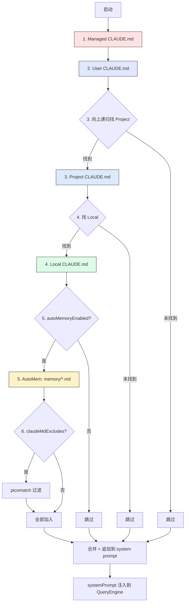

# 第 8b 章 CLAUDE.md 6 种类型详解 —— 加载顺序、frontmatter、@import 语法

> **本章定位**:`CLAUDE.md` 是 Claude Code 项目的"宪法"。有 6 种类型(User / Project / Local / Managed / AutoMem / TeamMem),从全局到项目,再到自动提取,层层覆盖。本章讲清加载顺序、frontmatter 语法、`@`-import、排除规则。

## 摘要

`CLAUDE.md` 是**纯文本记忆文件**,注入到 system prompt。共 6 种来源:**User** 全局、**Project** 项目内、**Local** 本地私有、**Managed** 企业下发、**AutoMem** 自动从对话提取、**TeamMem**(可选)团队共享。加载顺序按"由远及近":Managed → User → Project → Local,后者**追加**到 system prompt(不替换)。`@path` 语法可在 CLAUDE.md 内引用其他文件;`claudeMdExcludes` 用 picomatch glob 排除;`autoMemoryEnabled` / `autoDreamEnabled` 控制自动提取。

## 速赢

- **6 种类型**:
  - **User**:`~/.claude/CLAUDE.md` —— 个人全局
  - **Project**`<cwd>/CLAUDE.md` 或 `<cwd>/.claude/CLAUDE.md` —— 团队可纳入 git
  - **Local**`<cwd>/.claude/CLAUDE.md` 或 `settings.local.json` —— 本地私有
  - **Managed**`managed-CLAUDE.md` —— IT 下发
  - **AutoMem**`~/.claude/projects/<sanitized>/memory/*.md` —— 自动提取
  - **TeamMem**(可选)团队共享
- **加载顺序**:Managed → User → Project → Local(后者追加,不覆盖)。
- **frontmatter**:`description` + `type` 字段(`MemoryFileSelector.tsx:206-237` 解析)。
- **`@path` 引用**:`@./docs/style.md` —— 引用其他文件,加载时内联。
- **排除**:`claudeMdExcludes` 用 picomatch glob,只对 User/Project/Local 生效(`claudemd.ts:547-573`)。
- **自动提取**:`autoMemoryEnabled` 决定是否读 + 写;`autoDreamEnabled` 决定是否后台整合(dream)。
- **目录搜索**:`.claude/rules/` 下的子目录会自动聚合。

## 关键图(1 张)

### 8b.1 CLAUDE.md 加载顺序



> 颜色:**红** Managed **紫** User **蓝** Project **绿** Local **黄** AutoMem

## 详细机制

### 8b.1 6 种类型详解

#### 8b.1.1 User(全局个人)

- **位置**:`~/.claude/CLAUDE.md`
- **作用域**:所有项目
- **典型内容**:个人编码风格、常用别名、偏好语言。
- **提交**:不进 git(在 home 目录)
- **示例**:
  ```markdown
  # 我的偏好
  - 总是用单引号
  - 不要写注释除非我让你写
  - 写中文回复
  ```

#### 8b.1.2 Project(项目级,可入 git)

- **位置**:`<cwd>/CLAUDE.md` 或 `<cwd>/.claude/CLAUDE.md`
- **作用域**:当前项目
- **典型内容**:项目架构、构建命令、代码规范、必读文档指针。
- **提交**:可纳入 git,所有协作者共享。
- **示例**:
  ```markdown
  # 项目: MyApp
  ## 技术栈
  - pnpm + turborepo
  - TypeScript strict
  - PostgreSQL + Prisma

  ## 必跑命令
  - `pnpm test` 跑测试
  - `pnpm typecheck` 类型检查
  - `pnpm lint` ESLint

  ## 架构
  - 入口 `apps/web/app.tsx`
  - 数据库 schema 在 `packages/db/prisma/`
  ```

#### 8b.1.3 Local(项目本地私有)

- **位置**:`<cwd>/.claude/CLAUDE.md` 或写到 `settings.local.json` 的内存部分
- **作用域**:当前项目,只你一个人
- **典型内容**:本机特殊路径、个人 TODO、不想让团队看到的。
- **提交**:**不进 git**(`settings.local.json` 自动加 `.gitignore`).
- **注意**:`.claude/CLAUDE.md` 也算 local —— 由 .gitignore 控制。

#### 8b.1.4 Managed(企业下发)

- **位置**:`managed-CLAUDE.md`(由 IT 下发,系统级路径)
- **作用域**:全公司用户
- **典型内容**:安全策略、合规要求、企业编码规范。
- **可写性**:**只读**(用户不可修改)。
- **优先级**:**最高**(最先加载,最先被看到)。

#### 8b.1.5 AutoMem(自动提取的内存)

- **位置**:`~/.claude/projects/<sanitized-cwd>/memory/*.md`
  - `<sanitized-cwd>` 是 cwd 的安全化(`/` 替换为 `-`)。
  - 例:`/Users/alice/proj` → `-Users-alice-proj`
- **作用域**:当前项目
- **典型内容**:从历史对话自动提取的"经验":
  - "用户喜欢用 zod 验证"
  - "这个项目的迁移用 prisma migrate dev,不要 db push"
  - "不要在 CI 里跑 lint:fix,会改文件"
- **frontmatter**:每条都有 `description` + `type`(可被 `MemoryFileSelector` 筛选)。
- **启用**:`autoMemoryEnabled: true`
- **后台整合**:`autoDreamEnabled: true` 会在空闲时合并 / 去重。
- **读取机制**:`scanMemoryFiles` (`memoryScan.ts:21-77`)扫目录,返回 mtime 排序的 header 列表(最多 200 个)。

#### 8b.1.6 TeamMem(可选,团队共享)

- **位置**:由团队配置决定(可能走 S3 / Gist / 公司内 Git)
- **作用域**:团队共享(类似 Project 但更多动态)
- **典型内容**:团队最新约定、共享 playbook。

### 8b.2 加载顺序与合并策略

**顺序**(从先到后追加到 system prompt):

1. **Managed**(最高,最先读)
2. **User**(`~/.claude/CLAUDE.md`)
3. **Project**(向上递归找)
4. **Local**(`.claude/CLAUDE.md` 或 settings.local.json 中的 memory)
5. **AutoMem**(若 `autoMemoryEnabled`)
6. **TeamMem**(若配置)

**关键点**:**后加载的追加在前面的后面**,模型能看到所有,但顺序可能影响其关注度(通常 Managed 最重要,在最前)。

**Project 递归查找**(从 `getOriginalCwd()` 向上):

- 找 `CLAUDE.md` 或 `.claude/CLAUDE.md`
- 一直走到 home 目录
- 找到第一个就用,后面的跳过?实际是**聚合**所有匹配的(直到 `/` 根目录)。

### 8b.3 Frontmatter 语法

每条 memory 可有 YAML frontmatter:

```markdown
---
description: 用户偏好 zod 验证
type: preference
---

用户喜欢用 zod 验证所有 API 输入。
```

**字段**:

- `description: string` —— 简述,用于 `MemoryFileSelector` 列表展示(`MemoryFileSelector.tsx:206-237`)。
- `type: 'preference' | 'fact' | 'context' | 'rule' | ...` —— 分类,影响优先级。
- 其他字段会被 zod schema 忽略。

**典型 type**(决定被 model 关注的权重):

- `preference` —— 用户偏好,高权重
- `fact` —— 项目事实
- `context` —— 上下文(短期)
- `rule` —— 规则(强约束)

### 8b.4 @-import 引用语法

在 CLAUDE.md 内部引用其他文件:

```markdown
# 项目约定

## 编码风格
@import ./docs/style-guide.md

## API 设计
@import ./docs/api-conventions.md

## 数据库
@import ./docs/db-style.md
```

**加载时机**:`@path` 在 CLAUDE.md 加载时**内联展开**(把被引用文件内容插入到当前位置)。

**路径**:
- 相对 CLAUDE.md 所在目录
- 绝对路径也支持
- `@` 后必须是有效文件路径,否则会警告

**循环引用**:检测到循环会报错(防止死循环)。

### 8b.5 排除规则(claudeMdExcludes)

**位置**:`settings.json` 的顶层 `claudeMdExcludes` 数组。

**类型**:`string[]`,每条是 picomatch glob 或绝对路径。

**示例**:

```json
{
  "claudeMdExcludes": [
    "/home/user/monorepo/CLAUDE.md",
    "**/code/CLAUDE.md",
    "**/some-dir/.claude/rules/**"
  ]
}
```

**逻辑**(`src/utils/claudemd.ts:547-573` 的 `isClaudeMdExcluded`):

```ts
function isClaudeMdExcluded(filePath: string, type: MemoryType): boolean {
  if (type !== 'User' && type !== 'Project' && type !== 'Local') {
    return false  // Managed / AutoMem / TeamMem 不可排除
  }
  const patterns = getInitialSettings().claudeMdExcludes
  if (!patterns || patterns.length === 0) return false
  // ...
  return picomatch.isMatch(normalizedPath, expandedPatterns, { dot: true })
}
```

**关键点**:

- **只对 User/Project/Local 生效**,Managed/AutoMem/TeamMem 永远不被排除(企业策略和自动提取不能被用户挡)。
- **路径匹配**用 picomatch,支持 `**`、`*`、绝对路径。
- **符号链接处理**:`resolveExcludePatterns` (`claudemd.ts:581+`)对绝对路径做 realpath 解析(处理 macOS /tmp -> /private/tmp 这种)。

### 8b.6 AutoMem 机制详解

**目录**:`~/.claude/projects/<sanitized-cwd>/memory/`

**文件结构**:

```
memory/
├── MEMORY.md            # 主索引(由 system 自动维护)
├── zod-validation.md
├── prisma-migrations.md
└── dont-use-cf-clear.md
```

**写入触发**:

- 用户输入某些对话后,`extractMemories` 异步调用(对话期间不阻塞)
- 写入走 `~/.claude/projects/<sanitized>/memory/`
- `autoMemoryEnabled: false` 时**完全禁用**读写

**读取触发**:

- session 启动时
- `MemoryFileSelector` (`MemoryFileSelector.tsx:206-237`)按 mtime 排序
- 头部 + 关联记忆被注入 system prompt
- 最多 200 个文件(`memoryScan.ts:21` 的 `MAX_MEMORY_FILES`)

**Dream 后台整合** (`autoDreamEnabled`):

- 空闲时跑
- 合并相似条目
- 删除过时条目
- 写 `MEMORY.md` 索引

### 8b.7 切换开关

| 开关 | 字段 | 行为 |
|---|---|---|
| 完全禁用 auto memory | `autoMemoryEnabled: false` | 不读 + 不写 |
| 自定义目录 | `autoMemoryDirectory: "~/my-mem"` | 改路径;`projectSettings` 里此字段**被忽略**(安全) |
| 启用 dream | `autoDreamEnabled: true` | 后台合并 |
| 排除某些 CLAUDE.md | `claudeMdExcludes: [...]` | 见 8b.5 |

### 8b.8 路径布局示例

```
/Users/alice/
├── .claude/
│   ├── CLAUDE.md           ← User(全局)
│   ├── settings.json       ← userSettings
│   ├── memory/             ← 全局 memory(?)
│   └── projects/
│       └── -Users-alice-myapp/
│           ├── sessions/   ← 持久化 session jsonl
│           └── memory/     ← AutoMem(项目级)
│               ├── MEMORY.md
│               └── *.md

/Users/alice/myapp/           ← cwd
├── CLAUDE.md                 ← Project(纳入 git)
├── .claude/
│   ├── CLAUDE.md             ← Local(gitignore)
│   ├── settings.json         ← projectSettings(纳入 git)
│   ├── settings.local.json   ← localSettings(gitignore)
│   └── rules/                ← 子目录聚合
│       ├── style.md
│       └── testing.md
└── ...
```

## 反模式

- **不要在 Project CLAUDE.md 写个人偏好**:别人 pull 下来会困惑。
- **不要在 Local 写团队规范**:local 不进 git,团队看不到。
- **不要把 secret 写进 CLAUDE.md**:CLAUDE.md 全文进 system prompt,可能被回显。
- **不要用 `@` 引用大文件**:每次加载都内联,会占 context。建议引用 + 部分展开。
- **不要在 `autoMemoryEnabled: true` 时手动维护 memory**:会和自动提取打架。
- **不要在 project CLAUDE.md 写动态信息**:"当前 sprint 是 #5"——会过期,放在 AutoMem 或 issue tracker。
- **不要用 `claudeMdExcludes` 排除 Managed**:Managed 永远不可排除。

## 引用

- 排除逻辑:`src/utils/claudemd.ts:547-573` 的 `isClaudeMdExcluded`
- 符号链接处理:`src/utils/claudemd.ts:581+` 的 `resolveExcludePatterns`
- AutoMem 扫描:`src/memdir/memoryScan.ts:21-77` 的 `scanMemoryFiles`
- Frontmatter 解析:`src/utils/frontmatterParser.ts`
- 字段定义:`src/utils/settings/types.ts:938-955, 1053-1061`
- Memory 选择器:`src/components/MemoryFileSelector.tsx:206-237`
- 加载入口:由 QueryEngine 启动时调,见 [第 27 章](../04-architect/27-query-engine.md)
- Settings 加载:[第 8a 章](./08a-settings.md)
