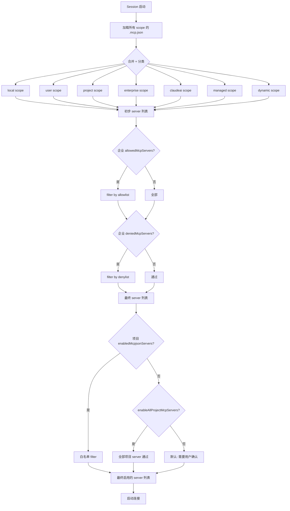

# 第 8c 章 MCP 配置(.mcp.json)详解 —— transport、scope、allowlist/denylist

> **本章定位**:`.mcp.json` 是 MCP(Model Context Protocol)server 的声明式配置。讲清 5 种 transport、项目/用户/企业 3 个 scope、`enabledMcpjsonServers` / `disabledMcpjsonServers` 控制矩阵、`allowedMcpServers` / `deniedMcpServers` 企业级 allowlist / denylist 语义。

## 摘要

`.mcp.json` 声明**项目级** MCP server。每个 server 描述如何连接:stdio(子进程)、sse/http(网络)、ws(socket)、sdk(进程内)。**3 个 scope**:`local` / `user` / `project` / `dynamic` / `enterprise` / `claudeai` / `managed`,可在不同 `.mcp.json` 位置覆盖。`enabledMcpjsonServers` 是"白名单",`disabledMcpjsonServers` 是"黑名单"—— 两者结合控制项目内 server 实际启用哪些。**企业级**`allowedMcpServers` / `deniedMcpServers` 用 wildcard URL + 命令匹配,做跨 scope 强制。

## 速赢

- **2 个 `.mcp.json` 位置**:
  - `<cwd>/.mcp.json` —— 项目级(可入 git)
  - `~/.claude/.mcp.json` —— 用户全局
- **5 种 transport**:
  - `stdio` —— 子进程(stdin/stdout JSON-RPC)
  - `sse` —— Server-Sent Events(HTTP 长连接)
  - `http` —— 可流式 HTTP
  - `ws` —— WebSocket
  - `sdk` —— 进程内(SDK 集成)
- **7 种 ConfigScope**:`local` / `user` / `project` / `dynamic` / `enterprise` / `claudeai` / `managed`
- **项目级控制**:
  - `enableAllProjectMcpServers: true` —— 全开(危险)
  - `enabledMcpjsonServers: ["git", "fs"]` —— 白名单
  - `disabledMcpjsonServers: ["web"]` —— 黑名单
- **企业级 allowlist/denylist**:
  - `allowedMcpServers: [{serverName}, {serverCommand}, {serverUrl}]` —— 允许集合
  - `deniedMcpServers: [...]` —— 拒绝集合(优先)
  - `allowManagedMcpServersOnly: true` —— allowlist 只读 managed

## 关键图(1 张)

### 8c.1 MCP server 加载与控制矩阵



## 详细机制

### 8c.1 .mcp.json 位置

| Scope | 文件路径 | 典型用途 |
|---|---|---|
| `project` | `<cwd>/.mcp.json` | 项目内,团队共享,可入 git |
| `user` | `~/.claude/.mcp.json` | 个人全局(其他项目也能用) |
| `enterprise` | `managed-mcp.json`(IT 下发) | 公司统一 server |
| `claudeai` | 远端代理(claude.ai 后台) | Pro/Max 用户的预置 server |
| `managed` | MDM / plist / HKLM | 系统级,只读 |
| `local` | `<cwd>/.claude/.mcp.json`(可选) | 本地私有 |
| `dynamic` | 运行时通过 `mcp` 命令添加 | 临时 |

**优先级**:scope 之间是"合并"而非"覆盖"——同名 server 高优先级 scope 替换低优先级。

### 8c.2 .mcp.json 完整 schema

```json
{
  "mcpServers": {
    "git": {
      "type": "stdio",
      "command": "uvx",
      "args": ["mcp-server-git", "--repository", "."],
      "env": {
        "GIT_AUTHOR_NAME": "Claude"
      }
    },
    "fetch": {
      "type": "http",
      "url": "https://mcp.example.com/fetch",
      "headers": {
        "Authorization": "Bearer ${API_TOKEN}"
      },
      "headersHelper": "~/.claude/helpers/fetch-headers.sh"
    },
    "ws-server": {
      "type": "ws",
      "url": "wss://mcp.example.com/ws",
      "headers": { ... }
    },
    "sdk-server": {
      "type": "sdk",
      "name": "anthropic-built-in"
    },
    "github": {
      "type": "stdio",
      "command": "gh",
      "args": ["mcp", "serve"],
      "env": {}
    }
  }
}
```

### 8c.3 5 种 transport 详解

#### 8c.3.1 stdio(最常见)

```json
{
  "type": "stdio",
  "command": "npx",
  "args": ["-y", "@modelcontextprotocol/server-filesystem", "/tmp"],
  "env": {
    "LOG_LEVEL": "debug"
  }
}
```

- **机制**:Claude Code fork 子进程,stdin/stdout 跑 JSON-RPC。
- **何时用**:本地工具(npx、uvx、go run、Python 脚本)。
- **注意**:`type` 字段可选(向后兼容),缺省默认 stdio(`types.ts:30`)。

**实际例子**(filesystem server):

```json
{
  "mcpServers": {
    "fs": {
      "command": "npx",
      "args": ["-y", "@modelcontextprotocol/server-filesystem", "/Users/me/work"]
    }
  }
}
```

#### 8c.3.2 sse(Server-Sent Events)

```json
{
  "type": "sse",
  "url": "https://mcp.example.com/sse",
  "headers": {
    "X-API-Key": "secret"
  },
  "headersHelper": "~/.claude/helpers/sse-headers.sh",
  "oauth": {
    "clientId": "...",
    "callbackPort": 8080,
    "authServerMetadataUrl": "https://idp.example.com/.well-known/oauth-authorization-server"
  }
}
```

- **机制**:HTTP 长连接,服务器推 events。
- **何时用**:远端 MCP server、SaaS 集成。
- **OAuth**:可选 `oauth` 块,支持 RFC 8414(authorization server metadata)。

#### 8c.3.3 http(可流式)

```json
{
  "type": "http",
  "url": "https://mcp.example.com/http",
  "headers": { ... }
}
```

- **机制**:HTTP,可流式响应。
- **何时用**:支持 streamable HTTP 的 server。

#### 8c.3.4 ws(WebSocket)

```json
{
  "type": "ws",
  "url": "wss://mcp.example.com/ws"
}
```

- **机制**:WebSocket 全双工。
- **何时用**:实时双向通信。

#### 8c.3.5 sdk(进程内)

```json
{
  "type": "sdk",
  "name": "anthropic-built-in"
}
```

- **机制**:同进程 SDK 调用(不是独立 server)。
- **何时用**:官方预置的 server,无需启动子进程。

### 8c.4 项目级控制矩阵

`settings.json` 的 3 个字段组合:

| 字段 | 行为 |
|---|---|
| `enableAllProjectMcpServers: true` | `.mcp.json` 里**所有** server 都自动启用,跳过用户确认 |
| `enabledMcpjsonServers: ["a", "b"]` | 白名单:只启用这几个,其他忽略 |
| `disabledMcpjsonServers: ["x"]` | 黑名单:永远不启用这几个 |

**判断逻辑**(伪代码):

```ts
function shouldStartServer(name: string, scope: ConfigScope) {
  if (scope === 'project') {
    if (disabledMcpjsonServers.includes(name)) return false
    if (enabledMcpjsonServers?.includes(name)) return true
    if (enableAllProjectMcpServers === true) return true
    return false  // 默认:需要用户手动启用
  }
  return true  // 非 project scope 默认开
}
```

**典型场景**:

- 新人 clone 项目:看到 `.mcp.json` 列出 5 个 server,但默认都不开(避免误启不安全工具)。
- 高级用户:`enableAllProjectMcpServers: true` 一键全开。
- 团队约定:在 `projectSettings.enabledMcpjsonServers` 列出"团队批准"的 server,新人自然就用这几个。

### 8c.5 企业级 allowlist / denylist

**Schema**(`types.ts:115-207` 的 `AllowedMcpServerEntrySchema` / `DeniedMcpServerEntrySchema`):

```ts
{
  serverName: "github",         // 或
  serverCommand: ["npx", "-y", "..."],  // 或
  serverUrl: "https://*.example.com/*"  // 通配
}
```

**3 种匹配模式**(每个 entry 三选一):

- `serverName`:精确匹配 server 名(只允许 `[a-zA-Z0-9_-]+`)
- `serverCommand`:精确匹配 stdio 命令数组
- `serverUrl`:通配匹配(`*` 一个段)

**优先级**:

1. **denied 优先**:在 denylist 的,即使在 allowlist 也被拒
2. **allow 过滤**:在 allowlist(或 allowlist 未定义),才允许
3. **`allowManagedMcpServersOnly: true`**:allowlist 只读 managed(denylist 仍合并所有源)

**典型企业场景**:

```json
// managed-settings.json
{
  "allowedMcpServers": [
    { "serverName": "github" },
    { "serverUrl": "https://*.trusted-vendor.com/*" }
  ],
  "deniedMcpServers": [
    { "serverUrl": "*" }  // 禁止所有未明确允许的 URL
  ]
}
```

效果:只允许 `github` server + trusted-vendor.com 域名的 URL。

### 8c.6 OAuth / XAA(SEP-990)

**OAuth 字段**(`types.ts:43-56`):

```json
{
  "oauth": {
    "clientId": "...",
    "callbackPort": 8080,
    "authServerMetadataUrl": "https://..."
  }
}
```

**XAA 字段**(Cross-App Access, SEP-990):

```json
{
  "oauth": {
    "xaa": true
  }
}
```

XAA 需要 `settings.xaaIdp` 全局配 IdP(issuer / clientId / callbackPort):

```json
// settings.json
{
  "xaaIdp": {
    "issuer": "https://idp.example.com",
    "clientId": "claude-code",
    "callbackPort": 8080
  }
}
```

需设置 `CLAUDE_CODE_ENABLE_XAA=1` 才能用(SDK generator 不导出)。

### 8c.7 IDE 内部 transport(开发用)

- `sse-ide`:IDE 扩展用(`types.ts:69-76`,需要 `ideName` 字段)
- `ws-ide`:IDE WebSocket 桥接(`types.ts:79-87`,需要 `ideName` + `authToken?`)

外部用户**不应**直接配这些,IDE 集成会自动管理。

### 8c.8 配置与连接生命周期

1. **读取**:`loadMcpConfig` 读所有 scope 的 `.mcp.json` + 合并。
2. **过滤**:企业 allow/deny + 项目 enabled/disabled 矩阵过滤。
3. **连接**:`McpClientManager` 启动每个 server 的 transport(stdio fork / HTTP connect / WS connect)。
4. **握手**:`initialize` JSON-RPC 握手,获取 server capabilities。
5. **工具注册**:server 暴露的 tool 加入 model 的 tool 列表。
6. **断连重试**:连不上时按指数退避重试,最终进入 `mcp.clients[].type === 'pending'` 状态。
7. **MCP settle 等待**:forked slash command(`/commit` 等)会等所有 `pending` server 解决(最多 10s,`processSlashCommand.tsx:56-57`)。

### 8c.9 完整 .mcp.json 实战

**项目级最小配置**(`<cwd>/.mcp.json`):

```json
{
  "mcpServers": {
    "filesystem": {
      "command": "npx",
      "args": ["-y", "@modelcontextprotocol/server-filesystem", "."]
    }
  }
}
```

**用户全局**(`~/.claude/.mcp.json`):

```json
{
  "mcpServers": {
    "github": {
      "type": "stdio",
      "command": "gh",
      "args": ["mcp", "serve"]
    },
    "fetch": {
      "type": "http",
      "url": "https://mcp.fetch.com/http"
    }
  }
}
```

**项目 settings 配合**(`<cwd>/.claude/settings.json`):

```json
{
  "enableAllProjectMcpServers": true,
  "allowedMcpServers": [
    { "serverName": "filesystem" },
    { "serverName": "github" }
  ]
}
```

## 反模式

- **不要在 `.mcp.json` 写 secret**:用 `headersHelper` 指向脚本,从 keychain 读。
- **不要在 `command` 里写 `npm` 启动脚本**:`npx -y @xxx/...` 才是标准做法,直接 `npm start` 难管理。
- **不要在生产环境的 `.mcp.json` 用 `enableAllProjectMcpServers: true`**:把决策权交给项目内的 `.mcp.json` 是危险的。
- **不要混用 allowlist 和 `enableAllProjectMcpServers: true`**:allowlist 是企业级(managed 才有意义),项目级用 `enabledMcpjsonServers` 白名单。
- **不要写循环依赖的 OAuth 配置**:`authServerMetadataUrl` 必须是 https,callbackPort 必须唯一。
- **不要假设 stdio server 立即启动**:慢启动的 server(下载依赖)会进入 `pending` 状态,等 10s。
- **不要在 `.mcp.json` 用 `sse-ide` / `ws-ide`**:这些是 IDE 集成专用,用户配没用。

## 引用

- MCP transport schema:`src/services/mcp/types.ts:23-113`
- AllowedMcpServerEntry schema:`src/utils/settings/types.ts:115-158`
- DeniedMcpServerEntry schema:`src/utils/settings/types.ts:164-207`
- 项目级控制字段:`src/utils/settings/types.ts:400-434`
- MCP config 加载:`src/services/mcp/config.ts`(merge / 过滤 / scope)
- Settings 字段总览:[第 8a 章](./08a-settings.md)
- 工具调用整体流程:[第 26 章](../04-architect/26-data-flow.md)
