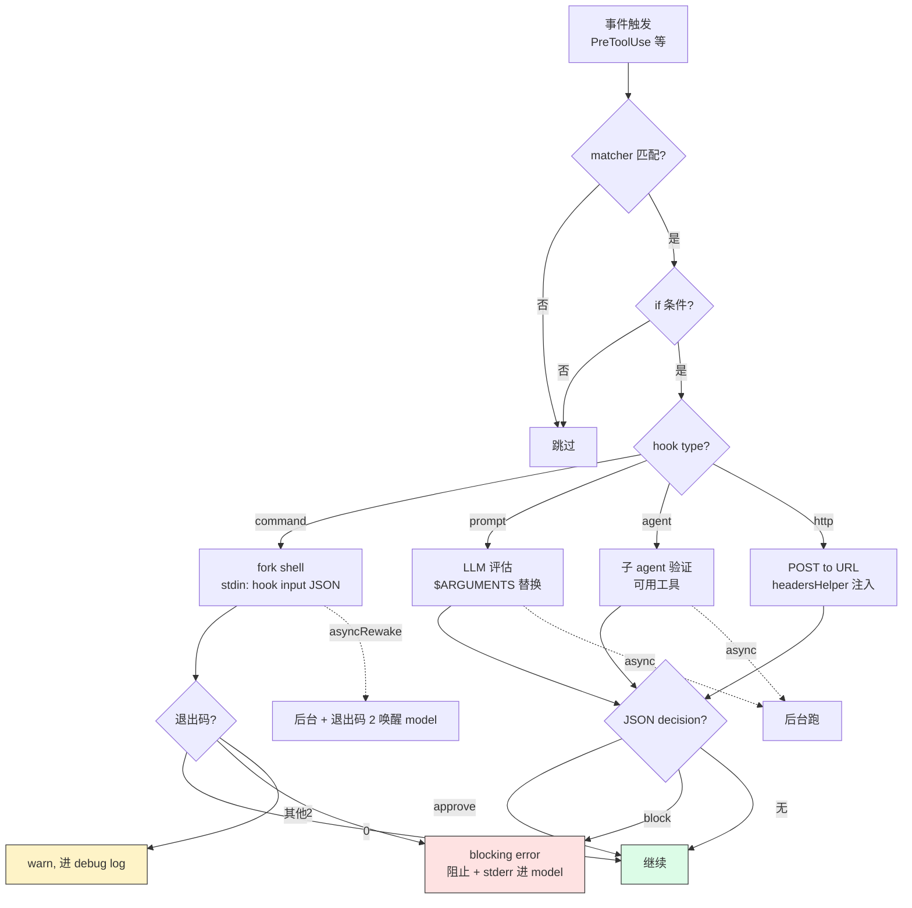

# 第 8d 章 Hooks 系统详解 —— 26 个事件、4 种类型、安全配置

> **本章定位**:Hooks 是用户在工具调用 / session 生命周期 / 各种事件点上**插入自定义逻辑**的机制。本章讲清 26 种 hook 事件、4 种 hook 类型(command / prompt / agent / http)、安全配置(allowlist / env allowlist)、典型实战。

## 摘要

Hooks 允许用户在特定事件触发时执行**外部逻辑**。26 个 hook 事件(`HOOK_EVENTS` 数组)覆盖工具调用全周期(PreToolUse / PostToolUse / PostToolUseFailure / PermissionRequest / PermissionDenied)、session 边界(SessionStart / SessionEnd / Setup)、对话节点(UserPromptSubmit / Stop / StopFailure)、摘要(PreCompact / PostCompact)、agent 与子 agent(SubagentStart / SubagentStop / TeammateIdle / TaskCreated / TaskCompleted)、通知(Notification / Elicitation / ElicitationResult)、其他(ConfigChange / WorktreeCreate / WorktreeRemove / InstructionsLoaded / CwdChanged / FileChanged)。**4 种类型**:`command`(shell)/ `prompt`(LLM 评估)/ `agent`(agentic verifier)/ `http`(POST URL)。`allowedHttpHookUrls` / `httpHookAllowedEnvVars` 提供 HTTP hook 的安全护栏。

## 速赢

- **26 个事件**(见 `coreSchemas.ts:355-384` 的 `HOOK_EVENTS`)。
- **4 种 hook 类型**(见 `schemas/hooks.ts:31-189`):
  - `command` —— shell 命令(最常用)
  - `prompt` —— LLM 评估(用 $ARGUMENTS 引用输入)
  - `agent` —— agentic verifier(子 agent 跑验证)
  - `http` —— POST 到 URL
- **`if` 条件**:permission rule 语法过滤(如 `Bash(git *)`)。
- **退出码语义**:
  - `0` —— 成功,继续
  - `2` —— **blocking error**(阻止工具调用,stderr 进 assistant)
  - 其他 —— non-blocking error(stderr 进 debug log)
- **JSON 输出**:`{"decision": "approve|block", "reason": "..."}` 可影响 tool 决策。
- **async / asyncRewake**:后台跑 + 必要时唤醒 model。
- **once**:跑一次后自动移除。
- **安全配置**:`allowedHttpHookUrls` / `httpHookAllowedEnvVars`(HTTP hook only)。
- **全局开关**:`disableAllHooks: true`(连 statusLine 一起关)。
- **企业锁定**:`allowManagedHooksOnly: true`(只跑 managed 里的 hooks)。

## 详细机制

### 8d.1 26 个 hook 事件

来源:`src/entrypoints/sdk/coreSchemas.ts:355-384` 的 `HOOK_EVENTS` 数组。

| 事件 | 触发时机 | 典型用途 |
|---|---|---|
| `PreToolUse` | 工具调用前(权限检查后) | lint 前置、备份文件 |
| `PostToolUse` | 工具调用成功 | 自动跑测试、生成 changelog |
| `PostToolUseFailure` | 工具调用失败 | 清理临时文件 |
| `Notification` | 系统通知(权限弹窗等) | 推送到 Slack |
| `UserPromptSubmit` | 用户按 Enter 提交后 | 注入额外上下文、敏感词过滤 |
| `SessionStart` | session 启动 | 加载项目状态、打印 banner |
| `SessionEnd` | session 退出 | 清理资源、上传日志 |
| `Stop` | 主 agent 停止(正常) | 跑最终 lint |
| `StopFailure` | 主 agent 异常停止 | 报警 |
| `SubagentStart` | 子 agent 启动 | 资源配额 |
| `SubagentStop` | 子 agent 停止 | 子 agent 审计 |
| `PreCompact` | 摘要前 | 备份 context |
| `PostCompact` | 摘要后 | 注入摘要补充 |
| `PermissionRequest` | 权限弹窗时 | 自动决策 |
| `PermissionDenied` | 用户拒绝工具 | 记录 / 报警 |
| `Setup` | (始终发出) | 初始化检查 |
| `TeammateIdle` | teammate agent 空闲 | 任务分配 |
| `TaskCreated` | task 创建 | 通知 |
| `TaskCompleted` | task 完成 | 通知 |
| `Elicitation` | 用户输入询问 | UI 渲染 |
| `ElicitationResult` | 用户输入结果 | 接收答案 |
| `ConfigChange` | settings 改变 | 审计 |
| `WorktreeCreate` | git worktree 创建 | 依赖安装 |
| `WorktreeRemove` | git worktree 删除 | 清理 |
| `InstructionsLoaded` | CLAUDE.md 加载 | 审计 |
| `CwdChanged` | cwd 改变 | 状态同步 |
| `FileChanged` | 文件监视触发 | 增量操作 |

**`Setup` 与 `SessionStart`**:**始终发出**(`hookEvents.ts:18` 的 `ALWAYS_EMITTED_HOOK_EVENTS`)。

### 8d.2 Hook 配置结构

```json
{
  "hooks": {
    "PreToolUse": [
      {
        "matcher": "Write|Edit|MultiEdit",
        "hooks": [
          {
            "type": "command",
            "command": "eslint --stdin --stdin-filename $CLAUDE_FILE_PATH",
            "if": "Write(*.ts)|Edit(*.ts)",
            "timeout": 30
          }
        ]
      }
    ],
    "PostToolUse": [
      {
        "matcher": "Bash",
        "hooks": [
          {
            "type": "command",
            "command": "~/.claude/hooks/auto-test.sh",
            "async": true
          }
        ]
      }
    ],
    "SessionStart": [
      {
        "hooks": [
          {
            "type": "command",
            "command": "echo 'Welcome!'"
          }
        ]
      }
    ]
  }
}
```

**字段说明**:

- **顶层 key**:事件名(`PreToolUse` / `PostToolUse` / ...)
- **`matcher`**:可选,过滤工具名(`Write|Edit`)或事件值
- **`if`**:可选,permission rule 语法(`Bash(git *)`),只对匹配的工具调用执行
- **`hooks`**:要执行的具体 hook 列表

### 8d.3 Hook 执行流程



> **红色** = 阻断 **绿色** = 继续 **黄色** = 仅警告

### 8d.4 4 种 hook 类型

#### 8d.3.1 command(最常用)

**Schema**(`schemas/hooks.ts:32-65`):

```json
{
  "type": "command",
  "command": "eslint --stdin",
  "if": "Write(*.ts)",
  "shell": "bash",
  "timeout": 30,
  "statusMessage": "Linting...",
  "once": false,
  "async": false,
  "asyncRewake": false
}
```

**字段**:

- `command` —— shell 命令
- `shell` —— bash/powershell(默认 bash)
- `timeout` —— 秒数(默认?)
- `statusMessage` —— spinner 显示文本
- `once` —— 跑一次后移除
- `async` —— 后台跑,不阻塞
- `asyncRewake` —— async + 退出码 2 唤醒 model

**输入**:stdin 是 JSON 字符串,含 `session_id`、`transcript_path`、`cwd`、`hook_event_name`、`tool_name`、`tool_input` 等。

**输出语义**(退出码):

- `0` —— 成功,继续
- `2` —— **blocking error**:工具被阻止,stderr 进 assistant message
- 其他 —— non-blocking error,只进 debug log

**JSON 输出**(可写 stdout):

```json
{"decision": "approve", "reason": "OK"}
{"decision": "block", "reason": "Don't push to main"}
```

`approve` / `block` 影响 tool 决策。

#### 8d.3.2 prompt(LLM 评估)

**Schema**(`schemas/hooks.ts:67-95`):

```json
{
  "type": "prompt",
  "prompt": "Is this command safe? $ARGUMENTS",
  "if": "Bash(*)",
  "timeout": 30,
  "model": "claude-haiku-4-5",
  "once": false
}
```

**字段**:

- `prompt` —— 用 `$ARGUMENTS` 占位 hook 输入
- `model` —— 评估用模型(默认 haiku)
- `timeout` —— 默认?

**行为**:用指定模型评估 prompt,模型说"safe"则继续,说"unsafe"则 block。

**适用**:轻量决策(比 command 慢,但能处理复杂判断)。

#### 8d.3.3 agent(agentic verifier)

**Schema**(`schemas/hooks.ts:128-163`):

```json
{
  "type": "agent",
  "prompt": "Verify that unit tests ran and passed. $ARGUMENTS",
  "if": "Bash(npm test*)",
  "timeout": 60,
  "model": "claude-sonnet-4-6"
}
```

**字段**:

- `prompt` —— 描述要验证什么
- `model` —— 跑 agent 用的模型(默认 haiku)
- `timeout` —— 默认 60s

**行为**:启动一个**子 agent** 验证,agent 可以用工具(读文件、跑命令)。比 prompt 强大很多。

**注意**(schemas/hooks.ts:130-138 注释):schema 上**不能**加 `.transform()`,否则 `parseSettingsFile` 解析后 `updateSettingsForSource` 写回时会被静默丢弃(gh-24920, CC-79)。

**适用**:复杂验证(测试结果、构建产物、API 响应内容)。

#### 8d.3.4 http(POST URL)

**Schema**(`schemas/hooks.ts:97-126`):

```json
{
  "type": "http",
  "url": "https://hooks.example.com/claude-event",
  "if": "PostToolUse",
  "timeout": 30,
  "headers": {
    "Authorization": "Bearer $MY_TOKEN"
  },
  "allowedEnvVars": ["MY_TOKEN"],
  "statusMessage": "Notifying...",
  "once": false
}
```

**字段**:

- `url` —— 必须是 https URL
- `headers` —— 额外 header,值支持 `$VAR` 引用 env
- `allowedEnvVars` —— **必须**,列出允许引用的 env var 名(其他 var 留空字符串)
- `timeout` —— 秒数

**安全**:`allowedEnvVars` 是**显式白名单**——防止 secret 意外泄漏。

**响应**:支持 `decision` 字段(approve/block)。

### 8d.5 `if` 条件语法

`if` 用 permission rule 语法(`schemas/hooks.ts:19-27` 的 `IfConditionSchema`):

| 模式 | 匹配 |
|---|---|
| `Bash(git status)` | 精确 |
| `Bash(npm *)` | 前缀 |
| `Bash(*.json)` | 任意 npm + .json |
| `Write(*.ts)` | Write 工具 + .ts 文件 |
| `Read(**)` | Read 工具所有文件 |

**多条件用 `|`**:

```json
{ "if": "Write(*.ts)|Edit(*.ts)|MultiEdit(*.ts)" }
```

**作用**:减少不必要 hook 启动 —— 模型产出 1 个 Write(.md) 调用,`if: Write(*.ts)` 的 hook 不会跑。

### 8d.6 async / asyncRewake 详解

**async**:

```json
{
  "type": "command",
  "command": "long-task.sh",
  "async": true
}
```

- hook 后台跑
- 不阻塞模型继续工作
- 输出在 hook 完成后追加到 transcript(下次 user turn 看到)

**asyncRewake**:

```json
{
  "type": "command",
  "command": "check-deploy.sh",
  "asyncRewake": true
}
```

- async + 退出码 2 时**唤醒 model**(模型重新被调用看结果)
- 适用:异步监控,出错时让模型知道

**注意**:`asyncRewake` 隐含 `async: true`,不要重复写。

### 8d.7 安全配置(企业级)

#### 8d.7.1 `allowedHttpHookUrls`

```json
{
  "allowedHttpHookUrls": [
    "https://hooks.example.com/*",
    "https://*.internal.com/hook"
  ]
}
```

- **作用**:HTTP hook URL 白名单,只允许匹配的 URL 跑。
- **匹配**:`*` 通配(一个段)。
- **`undefined`**:允许所有 URL。
- **`[]`(空数组)**:**禁止所有** HTTP hook。
- **合并语义**:跨 settings 源**数组合并**(同 `allowedMcpServers`)。

**典型企业用法**:`[]` 完全禁用 HTTP hook,降低数据外泄风险。

#### 8d.7.2 `httpHookAllowedEnvVars`

```json
{
  "httpHookAllowedEnvVars": ["API_TOKEN", "WEBHOOK_SECRET"]
}
```

- **作用**:HTTP hook 头里允许引用的 env var 名。
- **交集语义**:`effective_allowedEnvVars = perHook_allowedEnvVars ∩ settings.httpHookAllowedEnvVars`。
- **`undefined`**:不限制。
- **必须**:如果 hook 在 `headers` 里写了 `$VAR` 引用,就必须列在 `allowedEnvVars` 里(否则留空字符串)。

**典型用法**:避免 secret 泄漏到未授权的 URL。

#### 8d.7.3 `allowManagedHooksOnly`

```json
{
  "allowManagedHooksOnly": true
}
```

- **位置**:managed settings(企业下发)
- **作用**:只跑 managed 里的 hooks,user / project / local 的 hook 全部忽略。
- **适用**:企业锁定(用户不能加自己的 hook 绕过审计)。

#### 8d.7.4 `disableAllHooks`

```json
{
  "disableAllHooks": true
}
```

- **作用**:**完全禁用**所有 hooks(也禁用 statusLine,见 `types.ts:458-462` 注释)。
- **适用**:调试 / 安全模式 / 极简 CI。

#### 8d.7.5 `disableAllHooks` vs `allowManagedHooksOnly`

| 字段 | 行为 |
|---|---|
| `disableAllHooks: true` | 全关 |
| `allowManagedHooksOnly: true` | 只跑 managed |

**叠加**:同时设,managed 的 hook 也不跑。

### 8d.8 实际例子:自动 lint

**目标**:Write/Edit TypeScript 文件后自动跑 ESLint。

`.claude/settings.json`:

```json
{
  "hooks": {
    "PostToolUse": [
      {
        "matcher": "Write|Edit|MultiEdit",
        "hooks": [
          {
            "type": "command",
            "command": "npx eslint --stdin --stdin-filename $CLAUDE_FILE_PATH",
            "if": "Write(*.ts)|Edit(*.ts)|MultiEdit(*.ts)",
            "timeout": 30,
            "statusMessage": "ESLint..."
          }
        ]
      }
    ]
  }
}
```

**`$CLAUDE_FILE_PATH`**:Claude Code 注入的环境变量,被编辑的文件路径。

### 8d.9 实际例子:危险命令拦截

**目标**:拦截 `rm -rf`。

```json
{
  "hooks": {
    "PreToolUse": [
      {
        "matcher": "Bash",
        "hooks": [
          {
            "type": "command",
            "command": "cat | jq -e '.tool_input.command | test(\"rm -rf /|rm -rf ~|rm -rf \\\\\\$\") | not' > /dev/null",
            "timeout": 5
          }
        ]
      }
    ]
  }
}
```

- 退出码 `0` = 通过(`test` 返回 true,`not` 翻成 false,`jq -e` 退出 0)
- 退出码 `1` = 拒绝 → blocking error 进 model

### 8d.10 实际例子:HTTP hook + Slack

```json
{
  "hooks": {
    "PostToolUse": [
      {
        "matcher": "Bash",
        "hooks": [
          {
            "type": "http",
            "url": "https://hooks.slack.com/services/T.../B.../X...",
            "headers": {
              "Content-Type": "application/json"
            },
            "timeout": 10
          }
        ]
      }
    ]
  },
  "allowedHttpHookUrls": ["https://hooks.slack.com/*"],
  "httpHookAllowedEnvVars": []
}
```

### 8d.11 实际例子:agent verifier(测试后验证)

```json
{
  "hooks": {
    "PostToolUse": [
      {
        "matcher": "Bash",
        "hooks": [
          {
            "type": "agent",
            "prompt": "Verify that $ARGUMENTS.tool_input.command was a test command and that tests passed by checking exit code 0 in the tool result.",
            "if": "Bash(npm test*)|Bash(pnpm test*)",
            "timeout": 60,
            "model": "claude-haiku-4-5"
          }
        ]
      }
    ]
  }
}
```

**行为**:跑完测试后,子 agent 验证测试结果,如果有失败的 case,会反馈给 model。

## 反模式

- **不要在 hook 里 sleep 太长**:即使 async,也会占进程。考虑用 `at` / cron 替代。
- **不要在 hook 里写 secret**:`http.headers` 里的 `$VAR` 必须显式列 `allowedEnvVars`,而且值就在请求里。
- **不要在 command hook 写循环 while true**:会无限跑,拖死 CLI。
- **不要忘记 `timeout`**:默认超时很短,长任务要显式给 30+ 秒。
- **不要把 hook 写在 user 级别做团队规范**:user 级别不进 git,别人看不到,放 project 级别。
- **不要用 `disableAllHooks: true` 调试一个 hook**:用 `if` 条件缩范围,或加 log 调试。
- **不要在 http hook 暴露所有 env vars**:`httpHookAllowedEnvVars` 严格白名单,默认拒所有。
- **不要在 `command` hook 里 expect 0 退出码是 block**:`0` 是成功(继续),`2` 是 block(其他错是 warn)。

## 引用

- HOOK_EVENTS 列表:`src/entrypoints/sdk/coreSchemas.ts:355-384`
- 4 种 hook schema:`src/schemas/hooks.ts:31-189`
- 字段定义:`src/utils/settings/types.ts:435-499`(hooks + disable + allowManaged + http allowlist)
- 命令执行实现:由 `executeHooks` 调度,见 [第 28 章](../04-architect/28-streaming.md)
- 退出码语义:见 [第 26 章](../04-architect/26-data-flow.md)
- Async / reWake 模式:[第 28 章](../04-architect/28-streaming.md)
- Settings 总览:[第 8a 章](./08a-settings.md)
