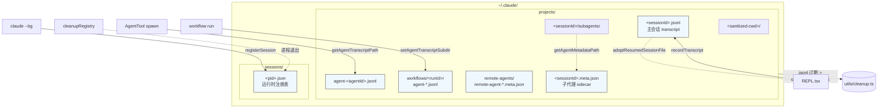
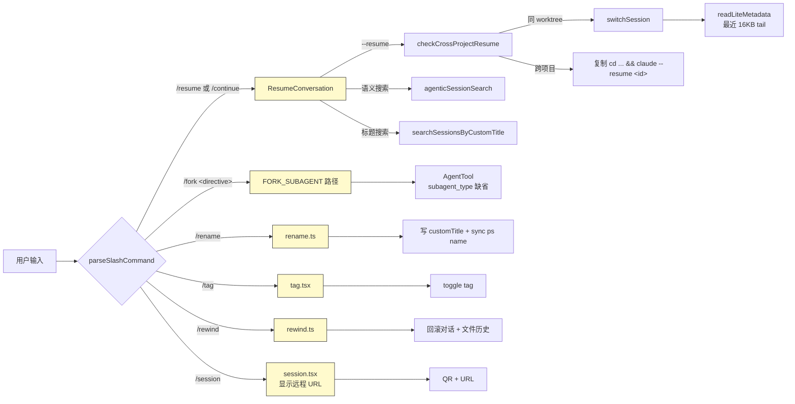

# 第 9 章 会话管理、历史与并发

> 本章从用户视角描述 Claude Code CLI 的会话生命周期。术语以 [`00-front/03-glossary.md`](../00-front/03-glossary.md) 为准;分层引用参见 [`04-architect/25-layered-arch.md`](../04-architect/25-layered-arch.md)。本章不涉及 QueryEngine 内部状态机(见 [`04-architect/27-query-engine.md`](../04-architect/27-query-engine.md))和压缩子系统(见 [`02-user/09b-compact.md`](09b-compact.md))。

---

## 摘要

一次"会话"是 Claude Code CLI 最基础的恢复单位。每条会话由一个 UUID `sessionId` 标识,以 JSONL 文件形式落盘在 `~/.claude/projects/<sanitized-cwd>/<sessionId>.jsonl`(`sessionStorage.ts:198-205`)。子代理(`Agent` 工具派生的 worker)的 transcript 落在同一目录的 `<sessionId>/subagents/agent-<agentId>.jsonl`(`sessionStorage.ts:247-258`)。CLI 同时维护一个并行的"会话注册表"——`<configHome>/sessions/<pid>.json`(`concurrentSessions.ts:21-23, 59-109`),让 `claude ps` 能枚举所有正在运行的进程。

会话可通过 4 个 slash 命令操控:`/resume [id|search]`(或别名 `/continue`)恢复旧会话,`/fork <directive>` 在子代理上下文中运行,`/session` 打印远程会话的 URL 与二维码,`/rename [name]` 改自定义标题,`/tag <name>` 切换可搜索的 tag 元数据。`/rewind`(别名 `/checkpoint`)则回滚对话与文件状态到某个历史点。

---

## 速赢

1. **每条会话一个 JSONL 文件**:`<configHome>/projects/<sanitized-cwd>/<sessionId>.jsonl`。`getTranscriptPath()`(`sessionStorage.ts:202-205`)的拼装是会话文件系统的唯一入口。
2. **路径 sanitize 是单点**:`sanitizePath()`(`sessionStoragePortable.ts:311-319`)把所有非字母数字字符替换为 `-`,长路径截断后追加 36 进制哈希,所以 `/Users/foo/my-project` 会变成 `-Users-foo-my-project`。
3. **子代理 transcript 在子目录**:`<projectDir>/<sessionId>/subagents/agent-<agentId>.jsonl`(`sessionStorage.ts:247-258`),工作流运行还会进一步落到 `subagents/workflows/<runId>/`(`sessionStorage.ts:234-241`)的 `agentTranscriptSubdirs` 注册表里。
4. **关掉持久化的两条开关**:`settings.json` 中 `cleanupPeriodDays: 0`(`sessionStorage.ts:966`)+ `--no-session-persistence`(`isSessionPersistenceDisabled` `bootstrap/state.ts:1329`),任一启用都直接跳 `shouldSkipPersistence()`,不写任何 JSONL。
5. **后台 session 通过 PID 锁文件声明**:`claude --bg` 派生的子进程写 `<configHome>/sessions/<pid>.json`(`concurrentSessions.ts:59-109`),主进程退出时通过 `cleanupRegistry` 自动 `unlink`。
6. **跨 worktree 恢复是默认行为**:`checkCrossProjectResume()`(`crossProjectResume.ts:30-74`)对同仓库的 git worktree 直接放行,跨仓库则把 `cd <project> && claude --resume <id>` 复制到剪贴板。
7. **标题/tag 都进 JSONL 元数据**:`/rename` 写入 `customTitle` 字段(`/tag` 写入 `tag`),`--resume` 列表读取时优先用它们。

---

## 关键图:磁盘存储与命令关系





---

## 详细机制

### 9.1 `sessionId` 与 JSONL 文件

每次 CLI 启动时,`bootstrap/state.ts:431` 的 `getSessionId()` 返回启动时随机生成的 UUID v4。`STATE.sessionId` 是单例;`regenerateSessionId({setCurrentAsParent: true})`(`bootstrap/state.ts:435`)用于 plan→implement 链路——子会话把父 sessionId 记下,父 `parentSessionId` 字段指向祖父。

JSONL 文件路径的拼装在 `getTranscriptPath()`(`sessionStorage.ts:202-205`):

```ts
export function getTranscriptPath(): string {
  const projectDir = getSessionProjectDir() ?? getProjectDir(getOriginalCwd())
  return join(projectDir, `${getSessionId()}.jsonl`)
}
```

`getProjectsDir()`(`sessionStorage.ts:198-200`)返回 `~/.claude/projects`,`getProjectDir(cwd)`(`sessionStoragePortable.ts:329-331`)再把 cwd 经过 `sanitizePath()`(`sessionStoragePortable.ts:311-319`)哈希成目录名。`getSessionProjectDir()`(`bootstrap/state.ts:496-498`)是 `--resume` 切到的项目目录——`switchSession()` 把它和 sessionId 原子地一起更新,确保 `getTranscriptPath()` 在 resume 之后指向旧文件而非新 cwd 的目录。

> ⚠️ 反模式:不要让 `getProjectDir`/`sanitizePath` 在 `recordTranscript` 路径上每条消息重算。`Project` 类实例会缓存 `sessionFile`(`adoptResumedSessionFile` 在 resume 时刷新一次)。

### 9.2 子代理 transcript 路径

`getAgentTranscriptPath(agentId)`(`sessionStorage.ts:247-258`)生成的相对路径是 `<projectDir>/<sessionId>/subagents/agent-<agentId>.jsonl`。当工作流场景下多个 worker 属于同一个 run,会先 `setAgentTranscriptSubdir(agentId, 'workflows/<runId>')`(`sessionStorage.ts:236-241`),从而落到 `subagents/workflows/<runId>/agent-<aid>.jsonl`,在 `--resume` 时不会污染主目录。

子代理的元数据(类型、worktree path、原始任务描述)走 sidecar `<agentId>.meta.json`(`sessionStorage.ts:260-262`)。`writeAgentMetadata`(`sessionStorage.ts:283-291`)在 spawn 时写入,resume 时读取用来恢复 `agentType`(因为 fork 模式下用户不会重复填 `subagent_type`)。

### 9.3 关闭持久化

`Project.shouldSkipPersistence()`(`sessionStorage.ts:960-970`)是统一的"不写 JSONL"开关:

```ts
return (
  (getNodeEnv() === 'test' && !allowTestPersistence) ||
  getSettings_DEPRECATED()?.cleanupPeriodDays === 0 ||
  isSessionPersistenceDisabled() ||
  isEnvTruthy(process.env.CLAUDE_CODE_SKIP_PROMPT_HISTORY)
)
```

四条触发:
- 测试环境(`getNodeEnv() === 'test'`)且未显式 `TEST_ENABLE_SESSION_PERSISTENCE=true`。
- `settings.json` 的 `cleanupPeriodDays` 字段被设为 `0`(`utils/settings/types.ts:325` 的 zod schema 校验)。
- CLI 标志 `--no-session-persistence`(被 `bootstrap/state.ts:1329` 的 `isSessionPersistenceDisabled()` 包装)。
- `CLAUDE_CODE_SKIP_PROMPT_HISTORY` 环境变量(由 `tmuxSocket.ts` 在 Tungsten-spawned 测试会话里设置)。

`/exit-plan-mode` 组件里也有同样的判定(`ExitPlanModePermissionRequest.tsx:84`),用来在 plan 模式拒绝持久化。

### 9.4 子代理 transcript 文件夹布局

```
projects/-Users-foo-my-project/
├── 1bf3a2b6-...-sessionId.jsonl     ← 主会话
├── 1bf3a2b6-...-sessionId.meta.json  ← (若 main thread 需要元数据)
└── 1bf3a2b6-...-sessionId/           ← sessionId 命名的子目录
    ├── subagents/
    │   ├── agent-a12b34cd....jsonl
    │   ├── agent-a12b34cd....meta.json
    │   └── workflows/
    │       └── run-2026-08-08-001/
    │           └── agent-ff9900....jsonl
    └── remote-agents/
        └── remote-agent-task-42.meta.json
```

### 9.5 `/resume` 与跨 worktree

`/resume [id|search]` 的入口在 `src/commands/resume/resume.tsx`,支持三种参数形态:
- **直接 sessionId**:`/resume 1bf3a2b6-...`,直接走 `loadConversationForResume`。
- **裸数字**:`/resume 2`,被解释为"最近第 2 条"。
- **搜索词**:`/resume "react hooks"`,先调 `agenticSessionSearch()`(`agenticSessionSearch.ts:146`)做语义搜索;若用户提供了 `tengu_*_agentic_search` GrowthBook kill-switch 则降级到 `searchSessionsByCustomTitle()`(`sessionStorage.ts:3065-3099`),它只对 `customTitle` 字段做大小写不敏感子串匹配。
- **PR 标识符**:`/resume https://github.com/.../pull/123` 解析成 PR 编号,搭配 `filterByPr` 过滤。

跨项目 resume 在 `checkCrossProjectResume()`(`crossProjectResume.ts:30-74`)里判断:

```ts
if (!showAllProjects || !log.projectPath || log.projectPath === currentCwd) {
  return { isCrossProject: false }
}
// ant-only: 看 worktreePaths 是否覆盖
if (process.env.USER_TYPE !== 'ant') {
  const command = `cd ${quote([log.projectPath])} && claude --resume ${sessionId}`
  return { isCrossProject: true, isSameRepoWorktree: false, command, projectPath }
}
const isSameRepo = worktreePaths.some(wt => log.projectPath === wt || log.projectPath!.startsWith(wt + sep))
return isSameRepo
  ? { isSameProject: true, projectPath }
  : { ..., command: `cd ${quote([log.projectPath])} && claude --resume ${sessionId}`, projectPath }
```

跨项目时 UI 用 OSC 52 把 `cd ... && claude --resume <id>` 复制到剪贴板(`ResumeConversation.tsx:11` 引用 `setClipboard`),并在终端里渲染 `<CrossProjectMessage>`(`ResumeConversation.tsx:340-391`)。

`/resume` 还支持 `--worktree`,会通过 `restoreWorktreeForResume()` 恢复 worktree 元数据,详见 [`02-user/05-daily-use.md`](05-daily-use.md) 中关于 git worktree 的章节。

### 9.6 `/fork`

`/fork <directive>` 由 `FORK_SUBAGENT` 构建闸门(`commands.ts:113-117`)控制——它在 `forkSubagent.ts:32-39` 的 `isForkSubagentEnabled()` 里又和 `COORDINATOR_MODE` 互斥(coordinator 已经有自己的 delegation 模型)。

启用后效果是 `Agent` 工具的 `subagent_type` 变可选,缺省时走隐式 fork——子代理继承父对话的完整 context 和 system prompt(`forkSubagent.ts:42-60` 的 `FORK_AGENT` 配置:`tools: ['*']` + `useExactTools` 保证工具池与父一致,`model: 'inherit'` 保持上下文长度对齐,`permissionMode: 'bubble'` 让权限对话框回到父终端)。fork 的 systemPrompt 是从 `toolUseContext.renderedSystemPrompt` 字节透传,避免重新 `getSystemPrompt()` 时 GrowthBook 冷热切换导致 cache bust。

> ⚠️ 反模式:不要在 fork 模式下手动 `subagent_type: 'general-purpose'`,否则 fork 的语义就丢了——明确类型会绕开 inheritance。

### 9.7 `/rename` 与 `/tag`

`/rename [name]`(`commands/rename/rename.ts`)把 `customTitle` 写入 JSONL,同时 `updateSessionName()`(`concurrentSessions.ts:131-136`)把名字同步到 `<pid>.json` 让 `claude ps` 显示。`generateSessionName`(`commands/rename/generateSessionName.ts`)是别名,用于 ExitPlanMode 自动起名(`permissions/ExitPlanModePermissionRequest.tsx:84`)。

`/tag <name>`(`commands/tag/tag.tsx`)toggle 一个 tag(`tags` 数组里加/减)。`searchSessionsByCustomTitle` 在 search 时也把 tag 列入候选。

### 9.8 并发 session 与 PID 锁文件

`claude --bg` 派生的子进程在 `registerSession()`(`concurrentSessions.ts:59-109`)里写 `<configHome>/sessions/<pid>.json`:

```json
{
  "pid": 12345,
  "sessionId": "1bf3a2b6-...",
  "cwd": "/Users/foo/my-project",
  "startedAt": 1723075200000,
  "kind": "bg",                              // SessionKind
  "entrypoint": "claude-cli",
  "name": "my-worker",                       // BG_SESSIONS feature
  "logPath": "/tmp/claude-bg-12345.log",
  "agent": "general-purpose"
}
```

四个 `SessionKind`(`concurrentSessions.ts:18`):
- `interactive` —— 交互式 REPL(默认)
- `bg` —— `claude --bg` 后台会话,通过 `CLAUDE_CODE_SESSION_KIND` 环境变量声明(`envSessionKind()` `concurrentSessions.ts:31-37`)
- `daemon` —— daemon 监督者
- `daemon-worker` —— daemon 派生的 worker

`registerCleanup()`(`utils/cleanupRegistry.ts`)注册退出回调,主进程退出时 `unlink(pidFile)`(`concurrentSessions.ts:67-72`),`ENOENT` 被吞掉。`onSessionSwitch(id => updatePidFile({sessionId: id}))`(`concurrentSessions.ts:101-103`)监听 `--resume` 切换并更新 sessionId 字段,否则 `claude ps` 的 sparkline 会读到错误的 transcript。

`countConcurrentSessions()`(`concurrentSessions.ts:168-203`)扫 `<configHome>/sessions/` 下所有 `<pid>.json`,把还活着的 `process.pid` 计 1,把死掉的(除非 WSL 共享盘)直接 `unlink`。**严格文件名守卫**(`/^\d+\.json$/`)防止 `2026-03-14_notes.md` 被误识别为 PID 2026 导致 `claude ps` 误删用户笔记(`concurrentSessions.ts:184-186`,`anthropics/claude-code#34210`)。

### 9.9 `/rewind`(`/checkpoint`)

`/rewind`(`/checkpoint`)是 plan→implement 与长任务流的关键能力。命令在 `commands/rewind/rewind.ts`,核心是:
- 从 `getCurrentMessages()` 拿到当前 `messages[]`。
- 在某条历史 assistant/user 边界上调用 `partialCompactConversation(pivotIndex, ...)`(`compact.ts:772-...`),`direction: 'from'` 模式汇总 pivot 之后的消息,保留 pivot 之前的完整对话;`'up_to'` 模式反过来。
- 同时调用 `fileHistory` 的 `restoreSnapshot()`(`utils/fileHistory.ts`)把工作区文件回滚到该 turn 的 snapshot。
- `reAppendSessionMetadata()`(`sessionStorage.ts:1530-1534`)把 customTitle/tag 重写到当前 transcript 的尾窗口里,避免被 `--resume` 错误丢弃。

`/rewind` 不修改 `sessionId`(还是同一条 JSONL),所以 `--resume` 会看到一棵带分叉的 tree——`getMessageChain()`(`utils/messages.ts`)会按 leaf 选择最近一次分支。

### 9.10 会话搜索的两种引擎

| 引擎 | 触发 | 实现 | 限制 |
|------|------|------|------|
| `searchSessionsByCustomTitle` | `/resume <keyword>` 字面量 | `sessionStorage.ts:3065-3099` | 只看 `customTitle` 字段,大小写不敏感子串 |
| `agenticSessionSearch` | `/resume <自然语言>` | `agenticSessionSearch.ts:146` | 调 LLM 做语义相似度排序,需要 GrowthBook 启用且 OAuth |

`searchSessionsByCustomTitle` 在跨 worktree 时调用 `getWorktreePaths(getOriginalCwd())` + `getStatOnlyLogsForWorktrees(worktreePaths)` 做轻量扫——只读 `.jsonl` 尾部 16 KB(`MAX_TRANSCRIPT_READ_BYTES = 50MB` `sessionStorage.ts:229` 是硬上限),避免 OOM(`utils/statsCache.ts:103` 注释)。

---

## 反模式

- ❌ **手工编辑 `<sessionId>.jsonl`**:消息 chain 是 UUID-PKI 链(每条带 `parentUuid`),任何写入错位都会让 `--resume` 显示空屏或 fork 出孤儿分支(`#14373`/`#23537`)。
- ❌ **`--no-session-persistence` + 期望 `--resume` 工作**:`isSessionPersistenceDisabled()` 直接走 `shouldSkipPersistence`,`--resume` 找不到文件。
- ❌ **跨项目调用时不传 cwd**:`checkCrossProjectResume` 期望 `showAllProjects=true` 时用户已经切换目录到目标项目;否则会复制"cd + claude --resume"命令但不自动切换。
- ❌ **在 session 切换后忘记更新 PID 文件**:`onSessionSwitch`(`concurrentSessions.ts:101-103`)已经自动接好,不需要自己写。
- ❌ **子代理 transcript 直接放在 `projects/<sanitized-cwd>/`**:`getAgentTranscriptPath` 走的是 session 子目录,扁平放会让 `loadAllLogsFromSessionFile`(`sessionStorage.ts:4598`)把它误识别为主会话 leaf。

---

## 引用

- `src/utils/sessionStorage.ts:198-205` — `getTranscriptPath` 的路径拼装
- `src/utils/sessionStorage.ts:247-258` — `getAgentTranscriptPath` 子代理路径
- `src/utils/sessionStorage.ts:960-970` — `shouldSkipPersistence` 四条触发条件
- `src/utils/sessionStorage.ts:3065-3099` — `searchSessionsByCustomTitle`
- `src/utils/sessionStorage.ts:1530-1534` — `adoptResumedSessionFile` resume 时的缓存同步
- `src/utils/sessionStoragePortable.ts:311-319` — `sanitizePath` 文件名 sanitize
- `src/utils/concurrentSessions.ts:18` — `SessionKind` 联合类型
- `src/utils/concurrentSessions.ts:59-109` — `registerSession` 写 PID 锁文件
- `src/utils/concurrentSessions.ts:168-203` — `countConcurrentSessions` 扫进程并清理 stale 文件
- `src/utils/crossProjectResume.ts:30-74` — `checkCrossProjectResume` 跨 worktree / 跨仓库判定
- `src/utils/agenticSessionSearch.ts:146` — `agenticSessionSearch` 语义搜索
- `src/tools/AgentTool/forkSubagent.ts:32-39` — `isForkSubagentEnabled` 闸门
- `src/commands/rewind/rewind.ts` — `/rewind` 实现入口
- `src/commands/rename/rename.ts` — `/rename` 实现
- `src/commands/tag/tag.tsx` — `/tag` 实现
- `src/bootstrap/state.ts:1329` — `isSessionPersistenceDisabled`(`--no-session-persistence`)
- 相关章节:[`02-user/09b-compact.md`](09b-compact.md)(5 阶段压缩)/ [`04-architect/25-layered-arch.md`](../04-architect/25-layered-arch.md)(五层模型)/ [`00-front/03-glossary.md`](../00-front/03-glossary.md) §C.4 sessionId、§C.5 transcript