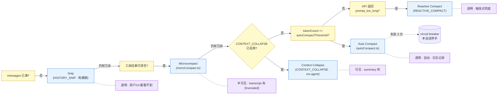
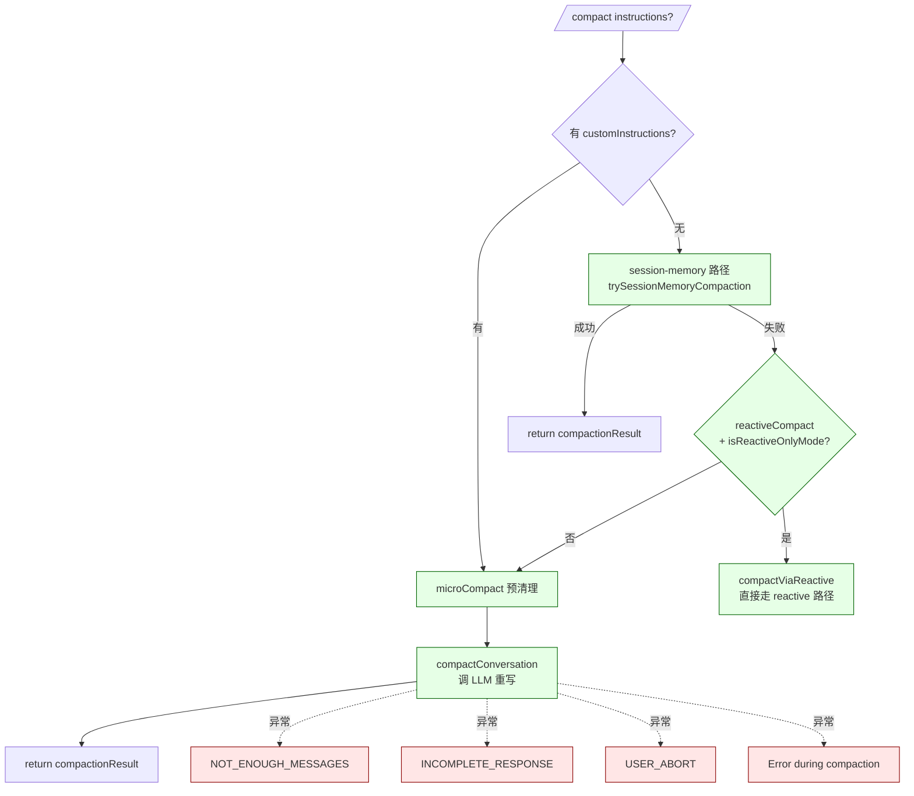

# 第 9b 章 上下文压缩 —— 5 阶段级联与 token 预算

> 本章是 [`02-user/09-session-history.md`](09-session-history.md) 的姊妹篇,聚焦 Claude Code CLI 的上下文压缩机制。术语以 [`00-front/03-glossary.md`](../00-front/03-glossary.md) §D.8 Compact subsystem 为准。压缩触发条件/失败兜底涉及 [`04-architect/27-query-engine.md`](../04-architect/27-query-engine.md) 的 query 循环。

---

## 摘要

Claude Code 的压缩不是单一函数,而是 **5 个阶段按"轻 → 重"级联**的流水线:**Snip → Microcompact → Context Collapse → Auto Compact → Reactive Compact**。每一阶段都试图在不调用 LLM 的前提下释放 token,只有走到最后两个阶段才触发一次"模型重写历史"。`/compact [instructions]`(用户显式触发)采用三级 fallback:`session-memory` → `microCompact` → `compactConversation`(`compact.ts:57-100`)。Token 预算由 `checkTokenBudget`(`tokenBudget.ts:45-93`)追踪,默认 `COMPLETION_THRESHOLD = 0.9`(90%),`DIMINISHING_THRESHOLD = 500`(收益递减阈值)。

Auto Compact 的失败熔断:`MAX_CONSECUTIVE_AUTOCOMPACT_FAILURES = 3`(`autoCompact.ts:70`),连续 3 次失败后停手——之前曾观察到 1279 个 session 累计 50+ 连续失败、消耗 ~25 万次 API/天。

---

## 速赢

1. **5 阶段级联**:从最便宜的"切孤儿 tool 对"到最贵的"调 LLM 重写历史",逐步升级,见 §9b.1。
2. **Snip 用户看不见**:它直接在内存里切掉孤儿的 `tool_use`/`tool_result` 对,transcript 里也不留痕(`HISTORY_SNIP` 构建闸门)。
3. **Microcompact 留痕**:把 `tool_result` 的 `content` 替换成 `"[truncated]"` 占位符,transcript 里看得到。
4. **Context Collapse 用户能看见 summary 块**:由 ctx-agent(marble_origami)分块提交到 summary chain,生成 `<compact_boundary>` 系统消息。
5. **Auto Compact 默认开**,失败 3 次熔断——3 次失败后整个 turn 静默继续,直到下一次预算压力才重新尝试。
6. **Reactive Compact 是兜底**:API 返回 `prompt_too_long` 时被动触发(`prompt_too_long` 错误前缀)。
7. **`+500k` 语法是 Escape hatch**:临时告诉 LLM"下面 500k token 是预算,自己看着办"。
8. **预算完成度 90% 触发**:当 turn 用量达到 `budget * 0.9` 时,`checkTokenBudget` 返回 `continue`,并注入 nudge 消息。

---

## 关键图:5 阶段压缩级联





---

## 详细机制

### 9b.1 阶段 1 · Snip(`HISTORY_SNIP`)

构建闸门 `HISTORY_SNIP`(`HANDBOOK/01-foundation/03-feature-flags.md:148`)。当 LLM 收到的 `tool_result` 没有对应的 `tool_use`(孤儿),或者 `tool_use` 没有 `tool_result`,Snip 把它们从内存消息数组里切除。**用户看不见**——snip 后 transcript 也不会留痕,因为它直接操作 `mutableMessages` 而非磁盘 JSONL。

> 为什么可以这么干:API 协议要求每个 `tool_use` 必须有对应 `tool_result`,少一个就 400。Snip 切掉的恰好是这种孤儿对。

代码路径参考 `autoCompact.ts:164-167`(注释解释 snip 与 token 估算的耦合):

```ts
// Snip removes messages but the surviving assistant's usage still reflects
// pre-snip context, so tokenCountWithEstimation can't see the savings.
// Subtract the rough-delta that snip already computed.
snipTokensFreed = 0,
```

即 `shouldAutoCompact()`(`autoCompact.ts:160-239`)接收 `snipTokensFreed` 参数,从 `tokenCount` 中减去,避免双重计数。

### 9b.2 阶段 2 · Microcompact(`microCompact.ts`)

`microcompactMessages()`(`microCompact.ts:530` 入口)遍历 `messages`,把 `tool_result` 的 `content` 字段清空为 `"[Old tool result content cleared]"`,**transcript 里看得到**这段占位文本。这是按工具白名单(`COMPACTABLE_TOOLS`,`microCompact.ts:41-50`):

```ts
const COMPACTABLE_TOOLS = new Set<string>([
  FILE_READ_TOOL_NAME,
  ...SHELL_TOOL_NAMES,
  GREP_TOOL_NAME,
  GLOB_TOOL_NAME,
  WEB_SEARCH_TOOL_NAME,
  WEB_FETCH_TOOL_NAME,
  FILE_EDIT_TOOL_NAME,
  FILE_WRITE_TOOL_NAME,
])
```

不在白名单里的工具结果(比如 Bash 的非退出码结果、Task 工具派发结果)不清理——它们的 content 通常很短。

时间触发版本 `maybeTimeBasedMicrocompact()`(`microCompact.ts:446-530`)有一个"对话间隔"启发式:`gapMinutes > gapThresholdMinutes`(默认 30 分钟)后,清掉最近 `keepRecent` 个工具结果之外的所有结果,把 token 立刻腾给"长间隔后重启"的用户。

清空后会调 `resetMicrocompactState()`(`microCompact.ts:130-135`)清掉 cached-MC 的工具 ID 注册表,避免下次 microcompact 拿脏数据重写;若启用了 `PROMPT_CACHE_BREAK_DETECTION`,还会调 `notifyCacheDeletion(querySource)` 让 cache break detector 把这次下降识别为"我们自己删的",而不是"prompt 变了"。

### 9b.3 阶段 3 · Context Collapse(`CONTEXT_COLLAPSE`)

由一个 ctx-agent(代号 `marble_origami`,见 `autoCompact.ts:174-182`)以"块"为单位独立归档旧消息,生成 `<compact_boundary>` 系统消息,并把每块摘要写入 commit log。90% 阈值触发 commit-start,95% 阈值触发 blocking-spawn。

设计意图:不要等累积到"必须调 LLM 总结"才动手,而是让 ctx-agent 在 90% 阈值附近就分批把旧消息扔进 commit;每块 5k–10k token,块越多越细粒度,避免"一个大 summary 把所有信息糊在一起"。

与 Auto Compact 的互斥:`autoCompact.ts:215-223` 检测到 `isContextCollapseEnabled()` 时**直接返回 false**(不触发 auto-compact),理由是 collapse 已经接管了 headroom 管理,autocompact 介入会 race 掉 collapse 正在做的精细归档。

**用户视角**:在 transcript 里能直接看到 `<compact_boundary>` 块,以及"上一段被总结到 `transcriptPath`"的指引文本(`compact.ts:616-623`)。

### 9b.4 阶段 4 · Auto Compact(`autoCompact.ts`)

最常见、最自动的阶段。`shouldAutoCompact()`(`autoCompact.ts:160-239`)判定:

```ts
const tokenCount = tokenCountWithEstimation(messages) - snipTokensFreed
const threshold = getAutoCompactThreshold(model)
return isAboveAutoCompactThreshold  // tokenCount >= effectiveContextWindow - 13_000
```

`AUTOCOMPACT_BUFFER_TOKENS = 13_000`(`autoCompact.ts:62`)是阈值缓冲——剩 13k token 才触发,留给后续 turn 的 system prompt/tools 增量。环境变量 `CLAUDE_AUTOCOMPACT_PCT_OVERRIDE`(百分比)与 `CLAUDE_CODE_BLOCKING_LIMIT_OVERRIDE`(绝对值)允许测试时压低阈值。

`autoCompactIfNeeded()`(`autoCompact.ts:241-351`)的执行流程:
1. 熔断器:若 `consecutiveFailures >= 3`,返回 `{wasCompacted: false}` 直接退出。
2. 调 `shouldAutoCompact()`,为 false 则返回。
3. **优先尝试 `trySessionMemoryCompaction()`**——session-memory 路径把对话快照写入 `services/SessionMemory/` 的持久层,而非丢弃消息。失败则 fallback 到 `compactConversation()`(传统 LLM 总结)。
4. 成功路径:`setLastSummarizedMessageId(undefined)` + `runPostCompactCleanup()` + `notifyCompaction()`(让 cache break detector 把"post-compact token 下降"识别为我们自己删的)+ `markPostCompaction()`。

**用户可见性**:Auto Compact 在 UI 上表现为一个 spinner 提示 + 一段 `userDisplayMessage`(来自 `executePostCompactHooks` `compact.ts:723-734`),内容通常是 hook 注入的"我刚压缩了 N 条消息"。

**统计回流**:`compactConversation` 在 `compact.ts:650-695` 上报 `tengu_compact` 事件,字段包括 `preCompactTokenCount`、`postCompactTokenCount`、`truePostCompactTokenCount`、`willRetriggerNextTurn`(如果 summary 之后还超阈值,则下一 turn 仍会触发)、`isRecompactionInChain`(本次 compact 是否是上一 compact 之后)、`turnsSincePreviousCompact` 等。

### 9b.5 阶段 5 · Reactive Compact(`REACTIVE_COMPACT`)

被动触发:当 LLM API 返回 `prompt_too_long`(Anthropic API 的特定错误前缀,见 `compact.ts:460` 检查 `summary.startsWith(PROMPT_TOO_LONG_ERROR_MESSAGE)`),`query.ts` 的循环捕获并调 `compactViaReactive()`(`compact.ts:139-205`)。

Reactive Compact 不走标准 `compactConversation`,而是 **逐组回退**——把最早的几组 API messages 扔掉,重新请求一次。这避免一次"全量压缩"的延迟,直接进入"减少输入"的应急模式。

`compact.ts:243-296` 定义了 5 个 `ERROR_MESSAGE_*`:
- `ERROR_MESSAGE_PROMPT_TOO_LONG = 'Prompt is too long'`(`compact.ts:293`)
- `ERROR_MESSAGE_USER_ABORT = 'API Error: Request was aborted.'`(`compact.ts:295`)
- `ERROR_MESSAGE_NOT_ENOUGH_MESSAGES = 'No messages to compact'`(`compact.ts:225-227`)
- `ERROR_MESSAGE_INCOMPLETE_RESPONSE = 'Error during compaction: Conversation has no messages to compact'`(`compact.ts:296`)
- `NOT_ENOUGH_MESSAGES`(`compact.ts:225-227`)

### 9b.6 `/compact` 的三级 fallback(`compact.ts:57-100`)

```ts
// 1. session-memory 优先(无 custom instructions 时)
if (!customInstructions) {
  const sessionMemoryResult = await trySessionMemoryCompaction(...)
  if (sessionMemoryResult) return { type: 'compact', compactionResult: sessionMemoryResult, ... }
}

// 2. reactive-only 模式路由
if (reactiveCompact?.isReactiveOnlyMode()) {
  return await compactViaReactive(messages, context, customInstructions, reactiveCompact)
}

// 3. 传统压缩:先 microcompact 再 compactConversation
const microcompactResult = await microcompactMessages(messages, context)
const result = await compactConversation(messagesForCompact, context, ..., false, customInstructions, false)
```

**custom instructions 与 session-memory 互斥**(`compact.ts:57-58`):session-memory 路径不支持 custom instructions(只能直接摘要)。

### 9b.7 Token 预算跟踪(`tokenBudget.ts`)

`checkTokenBudget(tracker, agentId, budget, globalTurnTokens)`(`tokenBudget.ts:45-93`):

```ts
const COMPLETION_THRESHOLD = 0.9  // 90%
const DIMINISHING_THRESHOLD = 500 // tokens

const isDiminishing =
  tracker.continuationCount >= 3 &&
  deltaSinceLastCheck < DIMINISHING_THRESHOLD &&
  tracker.lastDeltaTokens < DIMINISHING_THRESHOLD

if (!isDiminishing && turnTokens < budget * COMPLETION_THRESHOLD) {
  // continue:注入 nudge message("还剩 X%,继续吗?")
  return { action: 'continue', nudgeMessage: ..., continuationCount: ... }
}
if (isDiminishing || tracker.continuationCount > 0) {
  return { action: 'stop', completionEvent: { ..., diminishingReturns: isDiminishing } }
}
return { action: 'stop', completionEvent: null }
```

`isDiminishing = (连续 ≥3 轮 + 两次 delta 都 < 500)`——说明再继续也是浪费钱/时间,主动停手。

**只在主线程、非子代理模式下生效**(`tokenBudget.ts:51-53`:`agentId` 非空或 `budget <= 0` 都直接 stop)。子代理有自己的 budget,主线程不干预。

`+500k` 语法是 Escape hatch:用户输入 `+500k` 后,REPL 把它当成"预算增加到 500000 tokens"的提示,而不是普通 prompt。具体的解析在 `bootstrap/state.ts` 的 `parseTokenBudget`(`REPL.tsx:6` 引用),支持 `+200k`、`+500k`、`+1m` 等量级。预算用完后,`tokenWarning` 组件会在输入框上方展示"X% used"红条。

### 9b.8 内存整合 · Session Memory vs Auto Memory

两类持久化记忆:
- **Session memory**(`services/SessionMemory/sessionMemory.ts`):每条 turn 把"模型学到的用户偏好/项目规则"写到一个长期文件,作为下一 turn 的优先上下文注入(在 system prompt 之前)。`/compact` 第一优先级就是它。
- **Auto memory**(`memdir/autoMem.ts`,Ant-only):全自动生成,不需要用户参与;只在 system prompt 中作为"读这里"指引。

两者关系:session memory 是用户**显式参与**的(比如"项目里用 pnpm 而不是 npm"),auto memory 是系统**自动归纳**的(比如"项目里 React 是 17.x");两者内容不重复。`getMemoryFiles()`(`utils/claudemd.ts`)把两者合并到 system prompt。

### 9b.9 PTL 重试(Recompaction within Compact)

`compact.ts:450-491` 的 for-loop 处理"compact 自己也 prompt_too_long"的递归场景:
```ts
for (;;) {
  summaryResponse = await streamCompactSummary(...)
  if (!summary?.startsWith(PROMPT_TOO_LONG_ERROR_MESSAGE)) break
  ptlAttempts++
  const truncated = ptlAttempts <= MAX_PTL_RETRIES
    ? truncateHeadForPTLRetry(messagesToSummarize, summaryResponse) : null
  if (!truncated) { logEvent('tengu_compact_failed', {reason: 'prompt_too_long', ptlAttempts}); throw new Error(ERROR_MESSAGE_PROMPT_TOO_LONG) }
  logEvent('tengu_compact_ptl_retry', { attempt: ptlAttempts, droppedMessages: ..., remainingMessages: ... })
  messagesToSummarize = truncated
  retryCacheSafeParams = { ...retryCacheSafeParams, forkContextMessages: truncated }
}
```

`MAX_PTL_RETRIES = 3`(`compact.ts:...`, 在 prompt 中),超过就 `tengu_compact_failed` 事件并抛错,REPL 捕获后 `addErrorNotificationIfNeeded`(自动压缩不通知用户,手动 `/compact` 通知)。

### 9b.10 hook 集成:PreCompact / PostCompact / SessionStart

`compactConversation()` 触发 3 类 hook:
- `PreCompact`(事件 `PreCompact`,`compact.ts:413-419`):压缩前的预处理,user message 注入"hint"给模型。
- `SessionStart`(事件 `SessionStart`,trigger `'compact'`,`compact.ts:592-594`):压缩完成后的 system 初始化。
- `PostCompact`(事件 `PostCompact`,`compact.ts:723-733`):压缩完成后的通知,可向用户输出额外文本。

这些 hook 都可以由用户在 `settings.json` 配置,例如 `PreCompact` 可以注入"压缩时记得保留 database schema 相关的讨论"。

### 9b.11 缓存保活

压缩完成后 `compactConversation()` 立即:
- `notifyCompaction()`(`compact.ts:699-703`,feature `PROMPT_CACHE_BREAK_DETECTION`)告诉 cache break detector:"这次下降是我干的,别报警。"
- `reAppendSessionMetadata()`(`compact.ts:711`)把 customTitle/tag 重写到 transcript 的 16KB tail 窗口,防止 `--resume` 显示老标题。

### 9b.12 TokenWarning UI 组件

`components/TokenWarning.tsx` 是输入框上方的红条/黄条:
- `isAboveWarningThreshold`(`autoCompact.ts:113-117`,buffer 20k):黄色 "X% used"。
- `isAboveErrorThreshold`(buffer 20k,同样,只是分类不同):红条。
- `isAboveAutoCompactThreshold`(effective - 13k):"正在自动压缩…"
- `isAtBlockingLimit`(effective - 3k):"无法继续,执行 /compact"

这些阈值是 Auto Compact 的"软报警",不会阻断输入,但会渲染红条 + spinner。

---

## 反模式

- ❌ **关闭 Auto Compact 后期望微 compact 自动工作**:`DISABLE_AUTO_COMPACT=1` 关掉的是 Auto Compact;`/compact` 与 Microcompact 仍然工作,但 Reactive 兜底不再触发。
- ❌ **把 custom instructions 喂给 session-memory 路径**:`compact.ts:57-58` 显式排除,会被忽略。
- ❌ **在子代理模式下给主线程设 budget**:`tokenBudget.ts:51-53` 主线程见 `agentId != null` 就 stop,子代理不继承主线程预算。
- ❌ **让 Context Collapse 与 Auto Compact 同时跑**:`autoCompact.ts:215-223` 已经互斥;试图手动禁用 collapse 让 Auto Compact 接管 90%–95% 区间,会因为 race 而丢总结粒度。
- ❌ **依赖 `+500k` 长期跑**:`+500k` 是单次 escape hatch,每次输入都得重新写;真要做长上下文任务应该用 `/resume` 切到独立 session。

---

## 引用

- `src/services/compact/autoCompact.ts:62` — `AUTOCOMPACT_BUFFER_TOKENS = 13_000`
- `src/services/compact/autoCompact.ts:70` — `MAX_CONSECUTIVE_AUTOCOMPACT_FAILURES = 3`
- `src/services/compact/autoCompact.ts:147` — `isAutoCompactEnabled` 检查
- `src/services/compact/autoCompact.ts:160-239` — `shouldAutoCompact` 主判定
- `src/services/compact/autoCompact.ts:241-351` — `autoCompactIfNeeded` 执行 + 熔断
- `src/services/compact/compact.ts:57-100` — `/compact` 三级 fallback
- `src/services/compact/compact.ts:139-205` — `compactViaReactive` reactive 路径
- `src/services/compact/compact.ts:225-296` — `ERROR_MESSAGE_*` 5 个常量
- `src/services/compact/compact.ts:387-763` — `compactConversation` 核心
- `src/services/compact/microCompact.ts:41-50` — `COMPACTABLE_TOOLS` 白名单
- `src/services/compact/microCompact.ts:130-135` — `resetMicrocompactState`
- `src/services/compact/microCompact.ts:446-530` — `maybeTimeBasedMicrocompact` 时间触发
- `src/query/tokenBudget.ts:1-93` — 完整预算跟踪器
- `src/services/compact/prompt.ts` — 压缩时给 LLM 的 prompt(说明要保留什么)
- `src/services/compact/sessionMemoryCompact.ts`(原路径 `src/services/SessionMemory/` 为父目录误标) — session-memory 路径
- 相关章节:[`02-user/09-session-history.md`](09-session-history.md)(transcript 持久化)/ [`04-architect/27-query-engine.md`](../04-architect/27-query-engine.md)(query 循环)/ [`04-architect/26-data-flow.md`](../04-architect/26-data-flow.md)(端到端数据流)/ [`00-front/03-glossary.md`](../00-front/03-glossary.md) §D.8 Compact subsystem