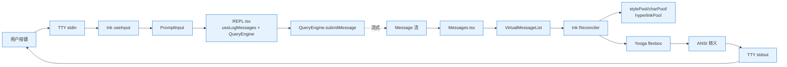

# 第 10 章 UI 总览 —— Ink 渲染栈与组件图谱

> 本章从用户视角描述 Claude Code CLI 的 UI 结构。术语以 [`00-front/03-glossary.md`](../00-front/03-glossary.md) §F.1 REPL、§F.2 Ink 为准;分层引用见 [`04-architect/25-layered-arch.md`](../04-architect/25-layered-arch.md)。

---

## 摘要

Claude Code 的整个视觉层由 **React + Ink + Yoga + TTY** 四层栈组成。React 写组件,Ink 提供 reconciler 把 React 树翻译成 flexbox 节点,Yooga 做布局计算,最终输出 ANSI 转义序列到 TTY。整个 UI 的"主屏"是 `src/screens/REPL.tsx`(`5005` 行,文件最大),它内部又派生出数十个组件:`PromptInput`、`Messages`、`StatusLine`、`HelpV2`、`ThemePicker`、`OutputStylePicker`、`ModelPicker`、`LanguagePicker`、`SessionPreview`、`ResumeTask`、`StructuredDiff`、`FileEditToolDiff`、`mcp/`、`permissions/`、`skills/`、`memory/MemoryFileSelector`、`tasks/TaskListV2` 等等。所有内置主题、颜色、字体由 `src/utils/theme.ts` 与 `src/components/design-system/` 提供。

UI 渲染与 [`04-architect/26-data-flow.md`](../04-architect/26-data-flow.md) 中的 L2 交互传输层紧密耦合:用户的按键先到 `PromptInput`,再经 `REPL` 的 effect 推给 QueryEngine,QueryEngine 的消息流回来后由 `REPL` 把消息分发到 `Messages.tsx`。

---

## 速赢

1. **REPL 是单一入口**:`src/screens/REPL.tsx` 是 CLI 主屏,几乎所有 UI 都从这里挂载。
2. **`Screen = 'prompt' | 'transcript'`**(`REPL.tsx:571`):首次按 Enter 切换到 transcript 屏。
3. **Ink 是自定义 reconciler**:`src/ink/render-to-screen.ts:38` 是核心,包含 stylePool/charPool/hyperlinkPool。
4. **Yooga 做 flexbox 布局**:Ink 在浏览器外做了与浏览器一致的 flexbox 引擎。
5. **设计系统组件在 `design-system/`**:`Pane`、`Tabs`、`Tab`、`Tag`、`Box`、`Text` 等统一渲染原语。
6. **组件总数**:约 150+ 个 `.tsx` 文件,集中在 `src/components/`(约 130)与 `src/screens/`(3)。
7. **截图/录制工具**:`src/utils/exportRenderer.tsx` 把任意 messages 渲染成可导出的纯文本,`/export` 命令调用。

---

## 关键图:UI 组件依赖

```mermaid
%% 图 1:REPL 主屏的组件树(简化)
flowchart TB
    REPL["screens/REPL.tsx<br/>(5005 行 · L2)"]
    APP["components/App.tsx"]
    PI["PromptInput/PromptInput.tsx<br/>(2338 行)"]
    PIF["PromptInput/PromptInputFooter.tsx"]
    MSGS["components/Messages.tsx<br/>(833 行)"]
    SL["components/StatusLine.tsx"]
    HV2["HelpV2/HelpV2.tsx"]
    HELP["components/HelpV2/<br/>Tabs + General + Commands"]

    SP["SessionPreview.tsx"]
    RT["ResumeTask.tsx"]
    FD["FileEditToolDiff.tsx"]
    SD["StructuredDiff.tsx"]
    SDL["StructuredDiffList.tsx"]
    MCP["mcp/ (MCP 选择器)"]
    PERM["permissions/<br/>(PermissionRequest 家族)"]
    MEM["memory/MemoryFileSelector.tsx"]
    TASK["tasks/TaskListV2.tsx"]
    SKL["skills/"]
    TP["ThemePicker.tsx"]
    OSP["OutputStylePicker.tsx"]
    MP["ModelPicker.tsx"]
    LP["LanguagePicker.tsx"]

    APP --> REPL
    REPL --> PI
    REPL --> MSGS
    REPL --> SP
    REPL --> RT
    REPL --> HELP
    PI --> PIF
    PIF --> SL
    REPL -.permissions.-> PERM
    REPL -.MCP server 选择.-> MCP
    REPL -.任务列表.-> TASK
    REPL -.记忆文件选择.-> MEM
    REPL -.diff 展示.-> SD
    SD --> SDL
    REPL -.切换主题.-> TP
    REPL -.切换 output style.-> OSP
    REPL -.切换模型.-> MP
    REPL -.切换语言.-> LP
    HELP --> HV2
    MSGS --> MR["MessageRow.tsx"]
    MSGS --> VML["VirtualMessageList.tsx<br/>(1081 行 · 虚拟滚动)"]
    MR --> MSG["Message.tsx"]
    MR --> FR["FileEditToolDiff.tsx<br/>+ MessageResponse.tsx"]
    REPL -.会话预览.-> SP
    REPL -.任务恢复.-> RT

    classDef screen fill:#ffe6e6,stroke:#8b0000;
    classDef comp fill:#e6f3ff,stroke:#0066cc;
    classDef pick fill:#fffacd,stroke:#b8860b;
    class REPL,APP screen;
    class PI,PIF,MSGS,MR,MSG,MR,SD,SDL,VML,SL,PERM,MCP,MEM,TASK,SKL,SP,RT,FD comp;
    class HV2,HELP,TP,OSP,MP,LP pick;
```

---

## 详细机制

### 10.1 `src/screens/REPL.tsx`(`5005` 行)

REPL 是 CLI 主屏。它的核心职责:
- 维护 `commands`、`messages`、`toolUseContext`、`agentDefinitions`、`abortController`、`queryGuard`、`notifications`。
- 渲染 `Screen = 'prompt' | 'transcript'`,首次按 Enter 切换。
- 把用户的输入转发给 `QueryEngine.submitMessage`,把引擎产出的 `Message[]` 流喂给 `Messages.tsx`。
- 监听 `KeyboardEvent` 与 `useInput` hook。
- 触发权限对话框(`PermissionRequest`)、MCP 选择器、主题/模型/语言 picker。

REPL 用到的关键 hooks/库(`REPL.tsx:1-120` 区域):
- `useTerminalSize`(`hooks/useTerminalSize.ts`)——终端尺寸变化
- `useInput`(`ink/`)——按键流
- `useSearchInput`(`hooks/useSearchInput.ts`)—— transcript 内搜索
- `useLogMessages`(`hooks/useLogMessages.ts`)——日志加载与滚动
- `useReplBridge`(`hooks/useReplBridge.ts`)—— Bridge 模式
- `useSSHSession`(`hooks/useSSHSession.ts`)—— SSH 模式
- `useRemoteSession`(`hooks/useRemoteSession.ts`)—— Remote 模式
- `useDirectConnect`(`hooks/useDirectConnect.ts`)—— CCR Direct
- `useAssistantHistory`(`hooks/useAssistantHistory.ts`)—— 历史 assistant 列表
- `useSkillImprovementSurvey`—— 调研弹窗
- `useFrustrationDetection`—— (Ant-only) frustration 探测
- `useVoiceIntegration`、`VoiceKeybindingHandler`—— (feature `VOICE_MODE`)语音
- `useAntOrgWarningNotification`—— (Ant-only) 组织警告

`REPL` 也用 `getCoordinatorUserContext`(`coordinator/coordinatorMode.ts`) 注入 coordinator 模式的 system context。

### 10.2 `PromptInput/PromptInput.tsx`(`2338` 行)

CLI 的输入框全集。子组件:
- `PromptInputFooter.tsx`——输入框下方的 footer,内嵌 `StatusLine`、vim 模式提示、`!` 警告。
- `PromptInputQueuedCommands.tsx`——队列中的待发命令。
- `inputModes.ts`——prepend mode character(`!`、`@`、`/`)。
- `vim.ts`——Vim 模式实现。
- `utils.ts`——`isVimModeEnabled`、`statusLineShouldDisplay` 等。

`PromptInput` 的 props 包含 `onTextPaste`、`onImagePaste`、`handleHistoryUp/Down`、`mode`、`vimMode` 等,接收 IME 输入 + 剪贴板图片 + 拖放文件。

### 10.3 `Messages.tsx`(`833` 行) + `MessageRow.tsx` + `Message.tsx` + `VirtualMessageList.tsx`(`1081` 行)

- `VirtualMessageList.tsx` 是虚拟滚动实现:只在视口内渲染 message row,滚动到边缘时换页(类似 react-window,但为 TTY 适配)。
- `Messages.tsx` 是顶层,接收 `messages: Message[]`,按 UUID 排序,把每条 message 委托给 `MessageRow`。
- `MessageRow.tsx` 根据 `message.type` 渲染:user text → `<UserMessage>`、assistant text → `<AssistantText>`、tool_use → `<ToolUse>` + `<ToolUseLoader>`、tool_result → `<ToolResult>`、system → `<SystemMessage>`、attachment → `<AttachmentMessage>`、progress → `<ProgressMessage>`。
- `Message.tsx` 是单个 message 的渲染(可能含 markdown 解析、syntax highlight、tool 反馈)。

### 10.4 `StatusLine.tsx`(`323` 行)

状态栏。`buildStatusLineCommandInput()`(`utils/statusLine/...`)收集当前上下文:
- `model`、`cwd`、`cost`(总成本、总 API 耗时、添加/移除行数)
- `outputStyle.name`、`sessionId`、`sessionName`(自定义标题)
- `worktree`(worktree session 元数据)
- `rate_limits`(5h/7d 配额)
- `vim.mode`、`permissionMode`、`agent.type`、`remote.session_id`、`context_window`(总 input/output tokens、used/remaining 百分比)

用户可在 `settings.json` 配置自定义 shell 命令输出 status line;`executeStatusLineCommand` 调 shell,把 stdout 渲染成一行 ANSI 文本。`StatusLine` 用 `memo` 包裹,只有 `lastAssistantMessageId` 变化才重新渲染(`StatusLine.tsx:320-323` 注释)。

### 10.5 `HelpV2/`

新版帮助屏。`HelpV2.tsx` 提供 3 个 Tab:`general`(`<General>`)、`commands`(`<Commands commands={builtin}>`)、`custom-commands`(`<Commands commands={custom}>`)。`external === 'ant'` 时还会多一个 `[ant-only]` Tab 显示 ant 内部命令。高度上限取 `Math.floor(rows / 2)`,在 modal 内部让 modal 控制(避免高度 clip,见 `HelpV2.tsx:30-32`)。

### 10.6 Picker 系列

- `ThemePicker.tsx`(`components/ThemePicker.tsx`)——选择内置/自定义主题,持久化到 `settings.json`。
- `OutputStylePicker.tsx`——三档 output style(default / Explanatory / Concise),写到 `settings.outputStyle`。
- `ModelPicker.tsx`——主线程模型切换(`opus`/`sonnet`/`haiku`),同步 `settings.model`。
- `LanguagePicker.tsx`—— CLI 语言(影响错误提示本地化、`/voice` 的 STT 语言)。

### 10.7 `SessionPreview.tsx` + `ResumeTask.tsx`

- `SessionPreview.tsx` 是单条历史会话的预览卡,出现在 `/resume` 列表里。显示 firstPrompt、messageCount、gitBranch、customTitle、tag、PR 链接。
- `ResumeTask.tsx` 是 `/resume --task <taskId>` 路径专用,展示异步 task 的进度与状态。

### 10.8 `StructuredDiff.tsx` + `StructuredDiffList.tsx` + `diff/`

`diff/` 目录包含多个 Diff 变体(`fileEdit`、`notebook`、`pr`、`workspace` 等),每个支持 4 种粒度:
- **Word diff**(`DiffSegment.tsx`):行内逐词高亮(`diffAddedWord`、`diffRemovedWord` 颜色,`utils/theme.ts:39-40`)。
- **Line diff**(`StructuredDiff.tsx`):逐行追加/删除(`diffAdded`、`diffRemoved`)。
- **File diff**(`StructuredDiffList.tsx`):多文件并列。
- **Workspace diff**:整个 git 工作区的 diff。

`FileEditToolDiff.tsx`(`components/FileEditToolDiff.tsx`)是 Edit 工具调用的实时渲染。

### 10.9 `mcp/` + `permissions/`

- `mcp/` 包含 MCP 选择器(`MCPServerMultiselectDialog.tsx`、`MCPServerApprovalDialog.tsx`、`ElicitationDialog.tsx`、`MCPServerDialogCopy.tsx` 等),处理"启用/禁用/审批/复制对话"四种交互。
- `permissions/` 是权限对话框家族,`PermissionRequest.tsx` 是顶层,下面派生出 `ExitPlanModePermissionRequest`、`WorkerPendingPermission`、`BypassPermissionsModeDialog` 等。
- `mcp/ElicitationDialog.tsx` 处理 MCP 1.0 elicitation——服务端发起的"请用户提供信息"对话。

### 10.10 `memory/`、`skills/`、`tasks/`

- `memory/MemoryFileSelector.tsx`——让用户从 `claudeMdExcludes` 中挑选要排除的 CLAUDE.md 路径。
- `skills/`——技能相关的对话框(`SkillImprovementSurvey.tsx`、`MemoryUsageIndicator.tsx`)。
- `tasks/TaskListV2.tsx`——任务列表(TodoList 模式)。

### 10.11 设计系统 `components/design-system/`

- `Box`、`Text`、`Pane`(`Pane.tsx`)——渲染原语。
- `Tabs`、`Tab`、`Tabs.tsx`——多 Tab 容器。
- `Tag`(`TagTabs.tsx`)——彩色 label。
- `StatusIcon`(`StatusIcon.tsx`)——状态图标(spinner/checkmark/error)。
- `Markdown`、`MarkdownTable`(`Markdown.tsx`、`MarkdownTable.tsx`)——内联 markdown 渲染。

### 10.12 Ink 渲染栈细节

`src/ink/render-to-screen.ts:38` 是根渲染入口。流程:
1. `createContainer()` 创建一个 Ink container,内部用 React Reconciler。
2. React 把组件树转换为"node + props + children",每个 node 包含 `style`、`text`、`hyperlink`。
3. Yoga 做 flexbox 布局,产出每个节点的 `x/y/width/height`。
4. `stylePool`、`charPool`、`hyperlinkPool` 复用样式串与字符,避免反复分配。
5. 最终 ANSI 转义序列写到 TTY stdout。

`src/ink/termio/tokenize.ts` 是 tokenizer,把 ANSI 字符串解析成 token 树。`useTabStatus`、`useTerminalTitle`(`ink/hooks/`)是 hook 形式的辅助。

### 10.13 虚拟滚动

`VirtualMessageList.tsx`(`1081` 行)实现消息虚拟化:
- 维护一个滚动偏移 `scrollTop`,只渲染 `scrollTop + viewportHeight` 范围内的 row。
- 每行的高度通过 `useElementSize` 测量后缓存。
- 支持搜索高亮(`useSearchHighlight`)——匹配的 row 强制可见。
- 支持键盘滚动(上下/PgUp/PgDn/`g`/`G`)。

### 10.14 其它常用组件

- `Spinner.tsx`、`SpinnerWithVerb`(`components/Spinner.tsx`)——加载指示器,根据 `SpinnerMode` 切换"Requesting" / "Thinking" / "Compacting" / "Searching" / 等文案。
- `SearchBox.tsx`、`HistorySearchDialog.tsx`——内嵌搜索。
- `MessageSelector.tsx`——`/rewind` 时让用户选择 pivot message。
- `QuickOpenDialog.tsx`——`Ctrl+P` 快速打开文件/命令。
- `GlobalSearchDialog.tsx`——`Ctrl+Shift+F` 全局搜索。
- `Feedback.tsx`、`FeedbackSurvey/`——用户反馈。
- `NotebookEditToolUseRejectedMessage.tsx`、`FileEditToolUpdatedMessage.tsx`、`FileEditToolUseRejectedMessage.tsx`——工具结果的特殊展示。
- `DevBar.tsx`、`DevChannelsDialog.tsx`——(Ant-only)开发通道切换。
- `Teleport*`(5 个文件)——远程 teleport 流程。

---

## 反模式

- ❌ **在 React 组件里直接读 process.env**:会破坏 SSR 测试。用 `useAppState` 读 React state。
- ❌ **直接渲染完整 messages 数组**:超过 200 条 message 时会让 Ink 的虚拟 diff 退化,务必走 `VirtualMessageList`。
- ❌ **新组件绕过 design-system**:`<Box>`、`<Text>`、`<Pane>` 都是为 TTY 性能优化过的;手写 `
` 会被 Ink 拒绝渲染。
- ❌ **在 `StatusLine` 组件里读 `messages`**:会被父组件的每次 setMessages 触发重渲染,务必只读 `lastAssistantMessageId`(`StatusLine.tsx:320-323` 注释)。
- ❌ **`useInput` 在 Modal 嵌套时不指定 `isActive`**:会拦截其他 modal 的按键,导致焦点卡死。

---

## 引用

- `src/screens/REPL.tsx:5005` 行长度,主屏
- `src/screens/REPL.tsx:571` — `Screen = 'prompt' | 'transcript'`
- `src/components/PromptInput/PromptInput.tsx:194` — PromptInput 函数组件
- `src/components/StatusLine.tsx:323` — StatusLine memo 包装
- `src/components/Messages.tsx:741` — Messages 组件
- `src/components/VirtualMessageList.tsx:1081` 行长度
- `src/components/HelpV2/HelpV2.tsx:20` — HelpV2 函数组件
- `src/ink/render-to-screen.ts:38` — Ink 自定义 reconciler
- `src/ink/termio/tokenize.ts:16` — State 类型,ANSI tokenizer
- `src/utils/theme.ts` — 主题颜色定义(`Theme` 类型)
- `src/components/design-system/Pane.tsx` — 设计系统 Pane 组件
- `src/components/design-system/Tabs.tsx` — 设计系统 Tabs 组件
- 相关章节:[`02-user/10b-voice.md`](10b-voice.md)(Voice Mode)/ [`02-user/10c-buddy.md`](10c-buddy.md)(Buddy)/ [`02-user/10d-output-styles.md`](10d-output-styles.md)(Output Styles)/ [`02-user/10e-theming.md`](10e-theming.md)(主题)/ [`00-front/03-glossary.md`](../00-front/03-glossary.md) §F.1–F.5