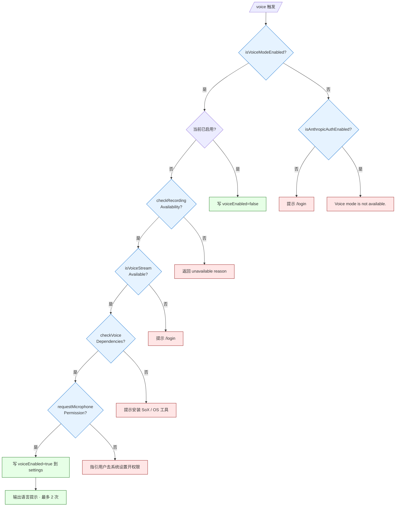
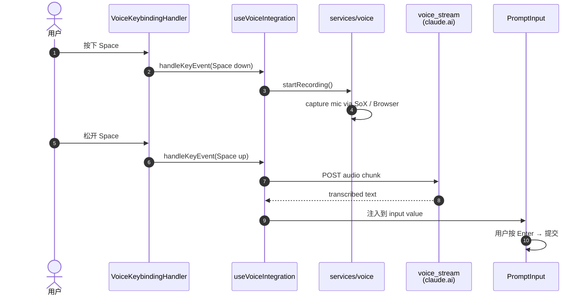

# 第 10b 章 Voice Mode —— 语音输入模式

> 本章从用户视角描述 Claude Code CLI 的语音输入能力。Voice Mode 是 feature(`VOICE_MODE`)门控的能力,位于 [`00-front/03-glossary.md`](../00-front/03-glossary.md) §F 的 UI 交互大类,与 [`02-user/10-ui.md`](10-ui.md) 中描述的 `REPL`、`PromptInput`、`useVoiceIntegration` hook 紧密相关。

---

## 摘要

Voice Mode 让用户按住 `Space` 键(可自定义)进行 push-to-talk,捕获麦克风音频,转写(STT)后注入主对话流。它**只在 Claude.ai OAuth 登录**(非 API key / Bedrock / Vertex / Foundry)下可用,因为 STT 走的是 claude.ai 的 `voice_stream` 端点。启用流程在 `/voice` 命令(`commands/voice/voice.ts`)中完成 4 步 pre-flight:OAuth 校验、麦克风权限预热、SoX 等录制工具探测、`voice_stream` 可用性。运行期由 `useVoiceIntegration`(`hooks/useVoiceIntegration.tsx`)hook 与 `VoiceKeybindingHandler`(`REPL.tsx:103`)在 `REPL.tsx` 中调用,把 STT 结果合并到 PromptInput。

权限与可见性由两层闸门控制:`feature('VOICE_MODE')`(构建期,`voice/voiceModeEnabled.ts:20-22`)+ GrowthBook `tengu_amber_quartz_disabled` kill-switch(运行期)。OAuth 校验是 `hasVoiceAuth()`(`voice/voiceModeEnabled.ts:32-44`),检查 `isAnthropicAuthEnabled()` + 实际 token 存在。

---

## 速赢

1. **`/voice` 命令 toggle**:`commands/voice/voice.ts` 是入口,首次开启时跑 4 步 pre-flight,失败立即返回 human-readable 错误。
2. **Push-to-talk 默认 Space**:`keybindings/defaultBindings.ts:96` 中 `space: 'voice:pushToTalk'` 仅在 `feature('VOICE_MODE')` 时注入。
3. **STT 走 `voice_stream` 端点**:`services/voiceStreamSTT.ts`(`voice.ts:58-60` 引用),不是 Anthropic Messages API——只能 claude.ai OAuth 用户用。
4. **三层启用条件**:feature + GrowthBook `tengu_amber_quartz_disabled = false` + `isAnthropicAuthEnabled()` + `accessToken` 存在(`voiceModeEnabled.ts:53`)。
5. **运行期 hook**:`useVoiceIntegration`(`hooks/useVoiceIntegration.tsx`)返回 `{stripTrailing, handleKeyEvent, resetAnchor}`,`VoiceKeybindingHandler` 拦截 Space 键。
6. **语言提示**:首启与切换语言时,REPL 提示"Dictation language: <code>"(`voice.ts:139-148`),最多展示 2 次。
7. **权限预热**:`requestMicrophonePermission()`(`voice.ts:99`)在 `/voice` 启用时立即触发 OS 权限弹窗,避免第一次 PTT 时卡顿。

---

## 关键图:Voice Mode 启用与运行路径





---

## 详细机制

### 10b.1 三层闸门

`isVoiceModeEnabled()`(`voice/voiceModeEnabled.ts:52-54`)是顶层检查:

```ts
export function isVoiceModeEnabled(): boolean {
  return hasVoiceAuth() && isVoiceGrowthBookEnabled()
}
```

- `hasVoiceAuth()`(`voiceModeEnabled.ts:32-44`):
  - `isAnthropicAuthEnabled()` 必须 true(检查 `~/.claude.json` 中的 `oauthAccount`)。
  - 必须有 `accessToken`(`getClaudeAIOAuthTokens()?.accessToken`)——`isAnthropicAuthEnabled` 只检查 provider,token 可能未刷新。
- `isVoiceGrowthBookEnabled()`(`voiceModeEnabled.ts:16-23`):
  - `feature('VOICE_MODE')` 必须 true(构建期)。
  - `getFeatureValue_CACHED_MAY_BE_STALE('tengu_amber_quartz_disabled', false)` 必须 false。**默认 false**——新建安装没等 GrowthBook 初始化就"可用"。

### 10b.2 `/voice` 命令的 pre-flight

`commands/voice/voice.ts:16-150` 的执行顺序:

1. `isVoiceModeEnabled()` 早退,失败分两种文案:
   - 无 OAuth → 提示 `/login`。
   - OAuth 但被 kill-switch 关掉 → "Voice mode is not available."
2. **当前已启用 toggle OFF**:`updateSettingsForSource('userSettings', {voiceEnabled: false})`(`voice.ts:38-54`),无需 pre-flight。
3. **当前未启用 toggle ON**,跑 4 步:
   - `checkRecordingAvailability()`(`services/voice.ts`):检查平台是否支持麦克风捕获。
   - `isVoiceStreamAvailable()`(`services/voiceStreamSTT.ts`):OAuth token 能用 `voice_stream` 端点。
   - `checkVoiceDependencies()`(`services/voice.ts`):系统是否装了 SoX(macOS/Linux)或能用浏览器捕获(Windows fallback)。
   - `requestMicrophonePermission()`(`services/voice.ts`):**预热** OS 权限弹窗,失败时按平台指引用户去系统设置。

`requestMicrophonePermission` 在启用时调用,而不是等到首次 PTT,是为了避免首次按键时的权限卡顿。

4. 写入 `settings.json` 的 `voiceEnabled: true`,emit `tengu_voice_toggled` 事件。

### 10b.3 Push-to-Talk 键绑定

`keybindings/defaultBindings.ts:93-96`:
```ts
// add a voice:pushToTalk entry (last wins); to disable, use /voice
...(feature('VOICE_MODE') ? { space: 'voice:pushToTalk' } : {}),
```

也就是说 Space → `voice:pushToTalk` action 只在 `feature('VOICE_MODE')` 启用时存在。用户可以用 `~/.claude/keybindings.json` 自定义其他键(chord 也支持)。

### 10b.4 运行期集成

`hooks/useVoiceIntegration.tsx` 是核心 hook,被 `REPL.tsx:98-103` 通过 feature-gated `require()` 引入(外部构建 DCE):

```ts
const useVoiceIntegration = feature('VOICE_MODE')
  ? require('../hooks/useVoiceIntegration.js').useVoiceIntegration
  : () => ({ stripTrailing: () => 0, handleKeyEvent: () => {}, resetAnchor: () => {} })
const VoiceKeybindingHandler = feature('VOICE_MODE')
  ? require('../hooks/useVoiceIntegration.js').VoiceKeybindingHandler
  : () => null
```

`useVoiceIntegration` 返回:
- `stripTrailing(): number` —— 删掉音频捕获后的尾静音样本数。
- `handleKeyEvent(event)`:Space down 开始录音,Space up 停止并把转写结果注入到 `PromptInput`。
- `resetAnchor()`:清除转写 anchor(用于打断时的状态复位)。

`VoiceKeybindingHandler` 是 React 组件,监听全局 Space 事件(在 modal 之外也响应)。

### 10b.5 STT 与 `voice_stream` 端点

`services/voiceStreamSTT.ts` 走 claude.ai 的 `voice_stream` 端点,不是 Anthropic Messages API。该端点:
- 接收 WebM/Opus 音频流。
- 服务端分片转写(streaming response)。
- 返回 `{text, isFinal}` 增量。

OAuth-only 是因为:
- `voice_stream` 是 claude.ai 的内部能力,API key / Bedrock / Vertex 用户没有 endpoint。
- `services/voiceStreamSTT.ts` 用 OAuth access token 做 Bearer auth,API key 走不通。

### 10b.6 STT 语言配置

`voice.ts:126-148` 处理语言提示:
- `normalizeLanguageForSTT(currentSettings.language)`(`hooks/useVoice.js`)把用户配置的语言归一化到 STT 支持的子集。
- `fellBackFrom` 非空 → 提示用户"X 不支持,已切换到 English"。
- 否则展示"Dictation language: <code>(/config to change)",最多 2 次(LANG_HINT_MAX_SHOWS = 2)。
- 计数器保存在 `cfg.voiceLangHintShownCount` 与 `voiceLangHintLastLanguage`(global config)。

### 10b.7 与主对话流的集成

转写完成后,文本不是直接发到 LLM,而是**注入到 PromptInput 的 value**——用户可以在视觉上看到转写结果,可以编辑后再按 Enter 提交。这避免了"语音错误立刻发给模型"导致的反复 retry。

`stripTrailing()` 用来清理转写结果末尾的"(trailing silence)"之类的填充词,提升首字命中率。

### 10b.8 状态切换时的边界

Voice Mode 与多个状态切换交互:
- **`/voice` toggle**:在 Permission Request 弹窗或 Modal 打开时也能 toggle,但 modal 不消失。
- **重连 OAuth**:`getClaudeAIOAuthTokens` 缓存每小时清一次,清掉后需要重新 probe,失败会强制 disable。
- **环境迁移**(如 SSH 隧道变化):`requestMicrophonePermission` 重新触发。

---

## 反模式

- ❌ **用 API key 跑 `/voice`**:会失败,提示 `/login`。Voice Mode 仅 OAuth。
- ❌ **绕过 `requestMicrophonePermission` 直接录音**:首次 PTT 时会卡顿甚至失败,务必在 `/voice` 启用时预热。
- ❌ **把 STT 结果直接发到 LLM**:必须先注入 PromptInput,让用户审核;语音识别错误率(尤其中文/小语种)显著高于键盘输入。
- ❌ **用自定义 binding 把 Space 绑定到非 voice 动作**:会与默认 `voice:pushToTalk` 冲突,last-wins 规则下自定义会生效但失去 PTT。
- ❌ **在外部构建中引用 `voice_stream`**:DCE 后 `useVoiceIntegration` 是空实现,引用了也无法工作。
- ❌ **依赖 GrowthBook 启动延迟**:`isVoiceGrowthBookEnabled` 默认 false 表示"未 kill",所以新建安装立即可用;但若 GrowthBook 后续切到 true,Voice Mode 会即时关掉(不需重启)。

---

## 引用

- `src/voice/voiceModeEnabled.ts:16-23` — `isVoiceGrowthBookEnabled` 构建 + GrowthBook kill
- `src/voice/voiceModeEnabled.ts:32-44` — `hasVoiceAuth` OAuth + token 双检
- `src/voice/voiceModeEnabled.ts:52-54` — `isVoiceModeEnabled` 顶层
- `src/commands/voice/voice.ts:16-150` — `/voice` 命令完整 pre-flight
- `src/commands/voice/voice.ts:38-54` — toggle off 路径
- `src/commands/voice/voice.ts:99` — `requestMicrophonePermission` 预热
- `src/commands/voice/voice.ts:125-148` — STT 语言提示(2 次上限)
- `src/keybindings/defaultBindings.ts:93-96` — Space → `voice:pushToTalk` 绑定
- `src/hooks/useVoiceIntegration.tsx` — `useVoiceIntegration` 与 `VoiceKeybindingHandler`
- `src/hooks/useVoice.ts` — STT 语言归一化
- `src/services/voiceStreamSTT.ts` — `voice_stream` 端点封装
- `src/services/voice.ts` — 麦克风捕获、依赖探测
- `src/screens/REPL.tsx:98-103` — Voice hook 与 keybinding handler 的 feature-gated 引入
- 相关章节:[`02-user/10-ui.md`](10-ui.md)(UI 总览)/ [`00-front/03-glossary.md`](../00-front/03-glossary.md) §C.8 feature flag / [`01-foundation/03-feature-flags.md`](../01-foundation/03-feature-flags.md) `VOICE_MODE` 闸门