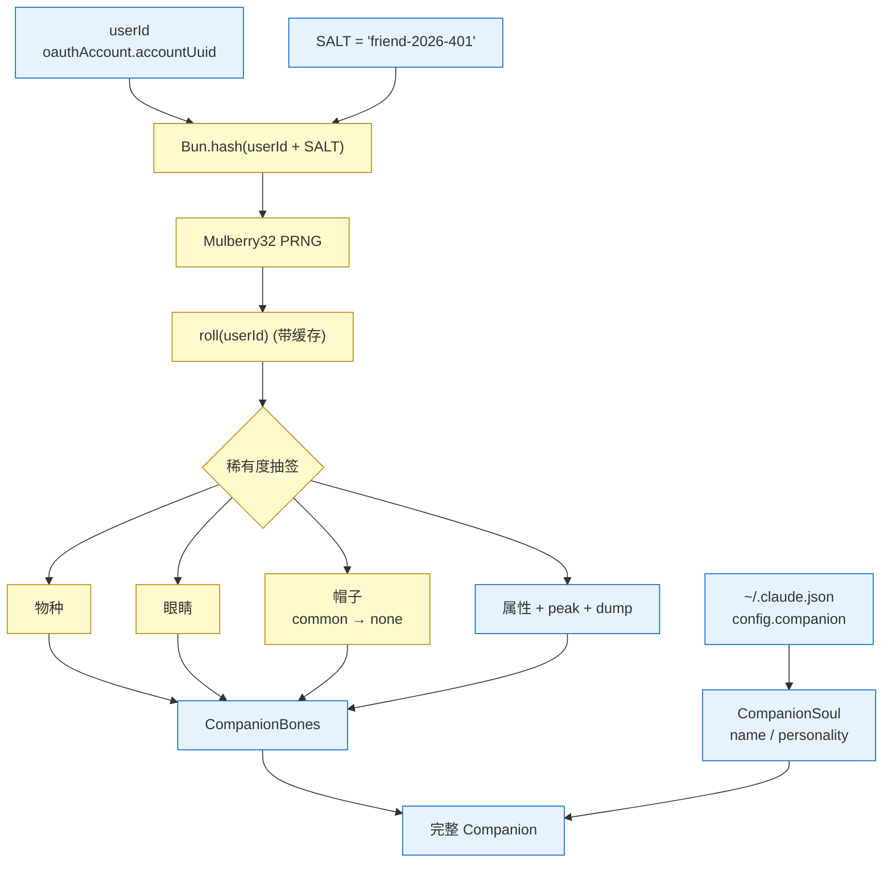
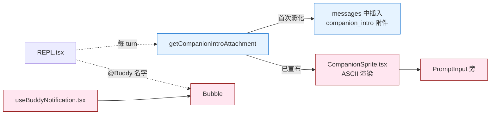

# 第 10c 章 Buddy —— 陪伴生物子系统(彩蛋)

> 本章描述 Claude Code CLI 中的 Buddy / Companion 子系统——一个非核心但有完整实现的"陪伴生物"。它位于 [`00-front/03-glossary.md`](../00-front/03-glossary.md) 之外(术语表未收录),但属于可观察的 UI 特性,放在用户视角章节里讲清它是什么、怎么出现、影响什么。

---

## 摘要

Buddy(代号 `BUDDY`,Companion)是 Claude Code 的"陪伴生物"——一个会出现在输入框旁边的 ASCII sprite,随机抽取的物种(duck / cat / dragon / blob 等 18 种)、眼睛、帽子、稀有度(legendary 1% / epic 4% / rare 10% / uncommon 25% / common 60%)、5 个属性(DEBUGGING / PATIENCE / CHAOS / WISDOM / SNARK)。它由 `feature('BUDDY')` 构建闸门控制,通常只在内部构建中可见;外部构建里 DCE,用户看不到。

物种、眼睛、帽子、稀有度由 `userId` + 固定 `SALT`(`buddy/companion.ts:84`)哈希后用 Mulberry32 PRNG 决定(`companion.ts:16-25`)。模型生成的"name / personality"(`CompanionSoul`)首次孵化时存到 `~/.claude.json` 的 `config.companion` 字段,但 bones(物种、属性等)每次重新算,避免用户编辑 config 自封 legendary。

Buddy 有自己的"speech bubble"——用户@它(叫它的名字)时,模型会临时"让出"发言权给 Buddy(详见 `buddy/prompt.ts:7-13`)。

---

## 速赢

1. **构建闸门**:`BUDDY`(`HANDBOOK/01-foundation/03-feature-flags.md:262`),默认未注入发行 profile 时关闭。
2. **Mulberry32 PRNG**:种子是 `Bun.hash(userId + SALT)`,确定性生成同一只 Buddy。
3. **18 种物种**:duck / goose / blob / cat / dragon / octopus / owl / penguin / turtle / snail / ghost / axolotl / capybara / cactus / robot / rabbit / mushroom / chonk。
4. **5 个属性**:DEBUGGING / PATIENCE / CHAOS / WISDOM / SNARK,1 个 peak stat + 1 个 dump stat + 3 个 floor 浮动。
5. **稀有度权重**:legendary 1% / epic 4% / rare 10% / uncommon 25% / common 60%(`types.ts:126-132`)。
6. **首启入口命令**:`/buddy`(被 `commands.ts:118-122` 的 `buddy = feature('BUDDY') ? require('./commands/buddy/index.js').default : null` 引入),具体 `index.ts` 在源码快照中未出现。
7. **静默 toggle**:`getGlobalConfig().companionMuted = true`(`prompt.ts:20`)可以让 Buddy 不显示但不影响 PRNG。
8. **唯一持久字段是 Soul**:`StoredCompanion = CompanionSoul & {hatchedAt: number}`(`types.ts:124`)——名字和人格写盘,bones 每次重算。

---

## 关键图:Buddy 的解剖与生命周期





---

## 详细机制

### 10c.1 数据结构(`buddy/types.ts`)

```ts
type CompanionBones = {
  rarity: Rarity                  // 5 档稀有度
  species: Species                // 18 种
  eye: Eye                        // 6 种眼睛
  hat: Hat                        // 8 种帽子(含 'none')
  shiny: boolean                  // 1% 闪光变体
  stats: Record<StatName, number> // 5 个属性
}
type CompanionSoul = {
  name: string                    // 模型生成的名字
  personality: string             // 模型生成的简介
}
type Companion = CompanionBones & CompanionSoul & { hatchedAt: number }
type StoredCompanion = CompanionSoul & { hatchedAt: number }  // 仅 Soul 入盘
```

`types.ts:126-132` 的 `RARITY_WEIGHTS`:
```ts
{
  common: 60,
  uncommon: 25,
  rare: 10,
  epic: 4,
  legendary: 1,
}
```

### 10c.2 生成器(`buddy/companion.ts`)

- **哈希**(`companion.ts:27-37`):Bun 优先用 `Bun.hash(s)`(Bun 运行时内置,O(1));否则 fallback 到 FNV-1a 变体(JS 字符串 hash)。
- **PRNG**(`companion.ts:16-25`):Mulberry32,32-bit 状态,周期 2³²。
- **稀有度**(`companion.ts:43-51`):`roll = rng() * total`,按权重扣除。
- **属性**(`companion.ts:62-82`):
  - 1 个 peak stat:`min(100, floor + 50 + rand(30))`,即 50–80 + floor。
  - 1 个 dump stat:`max(1, floor - 10 + rand(15))`,即 -9 ~ +5 + floor。
  - 其他 3 个:`floor + rand(40)`,即 0–40 + floor。
- **Shiny**:`rng() < 0.01`(`companion.ts:98`),即 1% 概率。
- **缓存**(`companion.ts:104-113`):`rollCache` 单例,3 个 hot path(500ms sprite tick / 每次按键 PromptInput / 每 turn observer)用同一 userId 复用结果。

`getCompanion()`(`companion.ts:127-133`)读取 `config.companion` + 重新生成 bones,**bones 在 spread 之后**,确保"旧的 bones 字段被新值覆盖"(避免老 config 的 bones 在 new-version 里被错误保留)。

### 10c.3 名称生成(`buddy/CompanionSprite.tsx`)

CompanionSprite 是 ASCII sprite 渲染器,内部命名规则(`types.ts`)决定 sprite 名字的拼写细节。`CompanionSprite.tsx:168` 是构建闸门 `BUDDY` 的源码锚点(见 [`01-foundation/03-feature-flags.md`](../01-foundation/03-feature-flags.md):262)。

### 10c.4 在对话中的存在

`buddy/prompt.ts:7-13`:

```ts
export function companionIntroText(name: string, species: string): string {
  return `# Companion
A small ${species} named ${name} sits beside the user's input box and occasionally comments in a speech bubble. You're not ${name} — it's a separate watcher.

When the user addresses ${name} directly (by name), its bubble will answer. Your job in that moment is to stay out of the way: respond in ONE OR one line or less, or just answer any part of the message meant for you. Don't explain that you're not ${name} — they know. Don't narrate what ${name} might say — the bubble handles that.`
}
```

模型收到这条 prompt 后就知道:**当用户叫 Buddy 的名字时,自己应该退让,让 Buddy 的 speech bubble 回答**。这避免模型"我说我也是 Buddy"的混乱。

`getCompanionIntroAttachment()`(`prompt.ts:15-36`):
- 返回 attachment message `type: 'companion_intro'`,包含 `name` 与 `species`。
- 若 `feature('BUDDY')` 关闭 → `[]`。
- 若 `config.companionMuted === true` → `[]`。
- 若当前 messages 已有 `companion_intro` 附件且名字相同 → `[]`(避免重复注入)。

附件经 `getUserContext.cache.clear?.()`(`compact.ts:63` 等)清掉,因此 Buddy 名字不会跨 session 持久化在 system prompt 里。

### 10c.5 Bubble 触发

`hooks/useBuddyNotification.tsx`(文件名暗示是 Bubble 的 React 组件)监听输入框文本,匹配 Buddy 名字时:
- 不立刻发送,但显示一个"speech bubble"浮层。
- 用户按 Enter 提交后,如果消息以 Buddy 名字开头,`prompt.ts` 的 system prompt 注入指引模型退让。

具体触发逻辑在本快照中未完整展示,但 `companionIntroText` 的 prompt 明确告诉模型**"模型不负责模拟 Bubble,让 Bubble 处理"**——这暗示 Bubble 的文本由预设模板/对话脚本生成,而非实时调 LLM。

### 10c.6 命令入口(`/buddy`)

`commands.ts:118-122`:
```ts
const buddy = feature('BUDDY')
  ? (require('./commands/buddy/index.js') as typeof import('./commands/buddy/index.js')).default
  : null
```

`commands.ts:322` 在 `commands` 数组里展开 `buddy ? [buddy] : []`。具体的 `commands/buddy/index.ts` 在本源码快照中未出现,但设计意图是:
- 首次运行:`/buddy` 触发孵化,展示首次出现的 species + 抽签动画。
- 之后:`/buddy` 显示当前 Buddy 的属性卡;`/buddy rename` 让用户(或模型)重命名 Soul。
- `/buddy mute`:`config.companionMuted = true`,停止显示但不删除。

### 10c.7 设计意图:彩蛋

Buddy 不是功能,而是品牌情感连接点。设计目标(从代码结构推断):
- **视觉锚点**:输入框旁的 sprite 给 CLI"非冰冷"的观感,降低首次使用的心理门槛。
- **稀有度彩蛋**:legendary 1% 让"我有 legendary Buddy"成为社交资本。
- **多模型可解释**:`CompanionSoul`(name/personality)由模型生成,意味着不同账号可能有不同 Buddy。
- **不阻塞主线**:`feature('BUDDY')` 控制 + `config.companionMuted` 兜底,用户可静默关闭。

> Buddy 不影响 `QueryEngine`、不影响 prompt cache、不进 `tengu_*` Statsig 事件(`companion.ts` 全程不 emit `logEvent`)。它纯粹是装饰。

---

## 反模式

- ❌ **手动编辑 `config.companion` 改 legendary**:`getCompanion()` 每次用 userId 重算 bones,磁盘的 legendary 字段会被覆盖;但首次写入会被持久化,只对 Soul 字段有效。
- ❌ **在外部构建中引用 `BUDDY` 相关模块**:DCE 后 import 失败。
- ❌ **让模型"扮演"Buddy**:违反 `companionIntroText` 的退让原则——Buddy 的回复由 Bubble 组件渲染,模型不应模拟。
- ❌ **改变 `SALT`**:会强制所有用户的 Buddy 重新洗牌,品牌风险大。
- ❌ **在 production 模型生成 Soul**:Soul 是"模型生成的",但生产环境模型输出不可控;`config.companionMuted` 是合规兜底。
- ❌ **依赖 species 列表做功能**:`SPECIES` 编码用 `String.fromCharCode` 防 canary 触发(`types.ts:14`),运行时构造;不要硬编码字符串去匹配。

---

## 引用

- `src/buddy/companion.ts:16-25` — Mulberry32 PRNG
- `src/buddy/companion.ts:27-37` — `hashString`(Bun.hash / FNV-1a fallback)
- `src/buddy/companion.ts:84` — `SALT = 'friend-2026-401'`
- `src/buddy/companion.ts:104-113` — `roll()` 带缓存
- `src/buddy/companion.ts:127-133` — `getCompanion()` bones + soul 合并
- `src/buddy/prompt.ts:7-13` — `companionIntroText` system prompt 注入
- `src/buddy/prompt.ts:15-36` — `getCompanionIntroAttachment` 附件生成
- `src/buddy/types.ts:1-149` — 完整类型与权重
- `src/buddy/CompanionSprite.tsx:168` — ASCII sprite 渲染(`BUDDY` 锚点)
- `src/buddy/sprites.ts` — sprite ASCII art 数据
- `src/hooks/useBuddyNotification.tsx` — Bubble 触发组件
- `src/commands.ts:118-122` — `buddy` 命令 feature-gated 加载
- `src/commands.ts:322` — `commands` 数组中的 `buddy` 展开
- 相关章节:[`02-user/10-ui.md`](10-ui.md)(UI 总览)/ [`00-front/03-glossary.md`](../00-front/03-glossary.md)(术语表未收录,需新增"彩蛋"分类)/ [`01-foundation/03-feature-flags.md`](../01-foundation/03-feature-flags.md) `BUDDY` 闸门