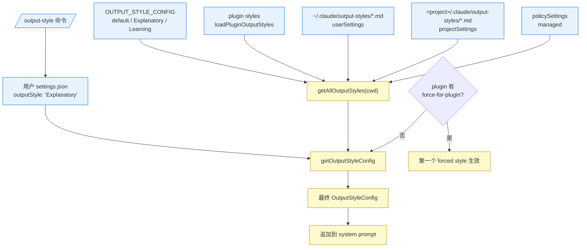
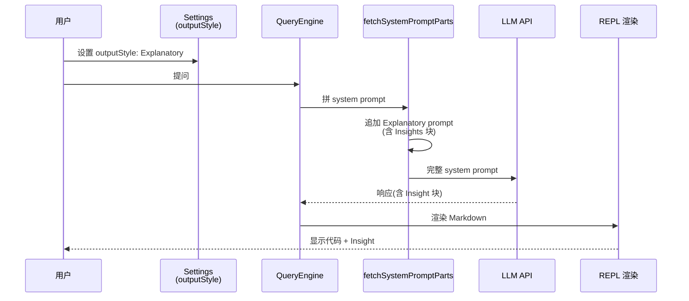

# 第 10d 章 Output Styles —— LLM 输出样式

> 本章描述 Claude Code CLI 的 Output Styles 模块。术语以 [`00-front/03-glossary.md`](../00-front/03-glossary.md) §F.5 Output Style 为准。

---

## 摘要

Output Style 是 Claude Code CLI 中切换 LLM "输出形态"的功能,本质是 **替换/扩展 system prompt 中的样式指令**。三种内置:`default`(常规,无 prompt)、`Explanatory`(对代码块插入 Insights 解释,`keepCodingInstructions: true`)、`Learning`(让用户实际写代码,产生"Learn by Doing"请求,`keepCodingInstructions: true`)。用户可在 `settings.json` 写 `outputStyle: 'Explanatory'` 启用,或通过 `/output-style` 命令切换。自定义 styles 是放在 `~/.claude/output-styles/*.md` 或 `<project>/.claude/output-styles/*.md` 的 markdown 文件,frontmatter 含 `name`、`description`、`keep-coding-instructions`(可选)字段。

加载优先级(`constants/outputStyles.ts:158-159`):
1. **built-in**(`OUTPUT_STYLE_CONFIG`)
2. **plugin** styles
3. **user** styles(`~/.claude/output-styles/*.md`)
4. **project** styles(`<project>/.claude/output-styles/*.md`)
5. **managed** styles(`policySettings`)

`getAllOutputStyles(cwd)`(`outputStyles.ts:137-175`)合并所有来源,但项目级覆盖用户级,managed 覆盖项目级——managed 用于企业锁定。

---

## 速赢

1. **三个内置**:`default`、`Explanatory`、`Learning`(`outputStyles.ts:39-135`)。
2. **切换方式**:`/output-style`(命令)+ `settings.json` 的 `outputStyle` 字段。
3. **自定义路径**:`~/.claude/output-styles/*.md` 或 `<project>/.claude/output-styles/*.md`。
4. **frontmatter 字段**:`name`、`description`、`keep-coding-instructions`(布尔)。
5. **加载顺序**:built-in → plugin → user → project → managed;后写覆盖前写(`outputStyles.ts:160-172`)。
6. **强制 plugin style**:`force-for-plugin: true` 让插件启用时自动切换;多个插件强制同一名,debug log 输出警告。
7. **keepCodingInstructions**:为 true 时保留 coding-instructions 上下文,适合工程任务;为 false 时更纯粹的"教学/解释"风格。

---

## 关键图:Output Style 加载链





---

## 详细机制

### 10d.1 三种内置 style(`constants/outputStyles.ts`)

```ts
export const OUTPUT_STYLE_CONFIG: OutputStyles = {
  [DEFAULT_OUTPUT_STYLE_NAME]: null,  // 'default'
  Explanatory: { name, source: 'built-in', description, keepCodingInstructions: true, prompt: `...含 ${figures.star} Insight 块...` },
  Learning:   { name, source: 'built-in', description, keepCodingInstructions: true, prompt: `...Learn by Doing 流程...` }
}
```

#### Explanatory(`outputStyles.ts:43-55`)

在每个代码块前后插入 `Insight` 块,用 `─` 字符画横线(`EXPLANATORY_FEATURE_PROMPT`,`outputStyles.ts:30-37`):

```
★ Insight ─────────────────────────────────────
[2-3 key educational points]
─────────────────────────────────────────────────
```

Insight 是放在对话里的"教学性注解",**不在代码库里**。模型被指引"关注代码库或刚写的代码的特定洞见,而非泛编程概念"。

#### Learning(`outputStyles.ts:56-134`)

让模型在生成 20+ 行代码(涉及设计决策、商业逻辑、关键算法)时,主动留 2–10 行 `TODO(human)` 给用户写。`Learn by Doing` 请求模板:

```
• **Learn by Doing**
**Context:** [what's built and why this decision matters]
**Your Task:** [specific function/section in file, mention file and TODO(human)]
**Guidance:** [trade-offs and constraints to consider]
```

模型被要求:**写完 TODO(human) 后停止动作**,等待用户实现。这意味着 Learning 模式不适合"快速完成编码任务"——它是教学向的。

### 10d.2 自定义 Style 文件

`outputStyles/loadOutputStylesDir.ts:26-92` 是加载器:

```ts
export const getOutputStyleDirStyles = memoize(
  async (cwd: string): Promise<OutputStyleConfig[]> => {
    const markdownFiles = await loadMarkdownFilesForSubdir('output-styles', cwd)
    return markdownFiles.map(({ filePath, frontmatter, content, source }) => {
      const fileName = basename(filePath)
      const styleName = fileName.replace(/\.md$/, '')
      const name = (frontmatter['name'] || styleName) as string
      const description = coerceDescriptionToString(frontmatter['description'], styleName) ?? extractDescriptionFromMarkdown(content, `Custom ${styleName} output style`)
      const keepCodingInstructionsRaw = frontmatter['keep-coding-instructions']
      const keepCodingInstructions = keepCodingInstructionsRaw === true || keepCodingInstructionsRaw === 'true' ? true : keepCodingInstructionsRaw === false || keepCodingInstructionsRaw === 'false' ? false : undefined
      return { name, description, prompt: content.trim(), source, keepCodingInstructions }
    })
  }
)
```

支持的 frontmatter:
- `name`(默认 = 文件名去 `.md`)
- `description`(默认 = markdown 中提取的第一段)
- `keep-coding-instructions`(布尔,或 `'true'`/`'false'` 字符串)

**示例:`~/.claude/output-styles/researcher.md`**:
```yaml
---
name: Researcher
description: Deep research with citations
keep-coding-instructions: false
---
You are a meticulous researcher. Always cite sources using [^1] footnotes
and respond in three sections: Background / Analysis / Conclusion.
```

### 10d.3 合并与优先级(`outputStyles.ts:137-175`)

```ts
const allStyles = { ...OUTPUT_STYLE_CONFIG }  // 1. built-in
const styleGroups = [pluginStyles, userStyles, projectStyles, managedStyles]
for (const styles of styleGroups) {
  for (const style of styles) {
    allStyles[style.name] = { ... }  // 后写覆盖前写
  }
}
```

按加载顺序(低→高优先级)逐层覆盖,所以最终生效的是 managed。**强制 plugin style 例外**:`getOutputStyleConfig()`(`outputStyles.ts:181-211`)先看是否有 plugin style 带 `forceForPlugin: true`,有则无视 `settings.outputStyle` 直接用该 plugin style;多个则取第一个并 warn(`outputStyles.ts:193-203`)。

### 10d.4 在 prompt 中的注入

`getOutputStyleConfig()` 返回 `OutputStyleConfig | null`。`null` 表示 `default`——不注入任何 style prompt。

当非 null 时,`fetchSystemPromptParts`(`utils/queryContext.ts`)把 style 的 `prompt` 拼到 system prompt 的尾部(通常在 user context 之后):

```
[系统默认值] + [用户自定义] + [explanatory prompt] + [mcp / tools / memory]
```

`keepCodingInstructions` 决定 style prompt 注入时是否**保留** 默认的 coding-instructions 段落(否则会被 style prompt 完全替代)。

### 10d.5 切换命令(`/output-style`)

命令实现位于 `components/OutputStylePicker.tsx` —— 它是一个 JSX 命令,在用户输入 `/output-style` 后弹一个 picker UI,列出所有 `getAllOutputStyles(cwd)` 的名字。点击后写入 `settings.json.outputStyle` 并 reload。

**picker 显示策略**:
- 内置(`default` / `Explanatory` / `Learning`)永远显示。
- 用户/项目自定义 style 显示对应 source label(`User` / `Project`)。
- Plugin style 显示插件名。
- Managed style 标记为 locked(用户不可改)。

### 10d.6 与 brief 模式的关系

`outputStyle` 与 `brief` 模式是两个独立开关(`settings.json` 的 `outputStyle` + `brief` 字段)。`isBriefOnly`(`REPL.tsx:695`)在两个条件满足时为 true:`outputStyle === 'Concise'`(不存在)或 `brief` 模式开启。两者都启用 `BriefTool`(`tools/BriefTool/`),模型可以发"我不再展开细节"的信号。

> ⚠️ 注意:`Concise` style 在 `OUTPUT_STYLE_CONFIG` 里**不存在**——它是 brief 模式的别名,**不是**真正的 output style。当 `isBriefOnly` 为 true 时,REPL 的 status line 加 "(brief)"。

### 10d.7 缓存清理

`clearAllOutputStylesCache()`(`outputStyles.ts:177-179`)在 settings 变更时调用,清掉 `getAllOutputStyles` 的 memoize 缓存。`clearOutputStyleCaches()`(`loadOutputStylesDir.ts:94-98`)清掉 markdown loader 的缓存与 plugin style 缓存。

### 10d.8 与 compact 的交互

当 `/compact` 触发时(`compact.ts:117`),旧的 style prompt 不变,新 turn 的 system prompt 仍然包含当前 style。所以"切换 style + 压缩"是顺序安全的。

### 10d.9 企业托管(managed)

`policySettings` 来源是 `/etc/claude-code/managed-settings.json` 中的 `outputStyle` 字段,优先级最高(覆盖一切)。设计上:
- 用户看不见 picker 里的 managed 选项(只看见 builtin + user + project)。
- 用户手动改 `settings.outputStyle` 会被 managed 覆盖。
- 这是企业锁定 AI 输出风格的能力。

---

## 反模式

- ❌ **在 `keepCodingInstructions: false` 的 style 里写完整代码**:模型可能被引导跳过工具调用——Learning 模式就是这种 trade-off。
- ❌ **创建多个 force-for-plugin plugin style**:只生效第一个,且 debug log 输出警告(`outputStyles.ts:193-203`)。
- ❌ **依赖 `OUTPUT_STYLE_CONFIG` 的 key 做 switch**:key 是名字字符串,新增/重命名内置 style 时会破坏兼容性;用 `style.name === DEFAULT_OUTPUT_STYLE_NAME` 判断 default。
- ❌ **style prompt 里要求 LLM 调内部工具**:style 是 system prompt 的扩展,模型可能错误地调工具;style 应只描述"如何说话"。
- ❌ **修改 `cachedOutputStyles` 而不调 `clearAllOutputStylesCache`**:会让 user 在 picker 看到旧列表。
- ❌ **混淆 `outputStyle` 与 `brief`**:两者是独立开关,前者改 style prompt,后者加 BriefTool。

---

## 引用

- `src/constants/outputStyles.ts:30-37` — `EXPLANATORY_FEATURE_PROMPT`
- `src/constants/outputStyles.ts:39` — `DEFAULT_OUTPUT_STYLE_NAME = 'default'`
- `src/constants/outputStyles.ts:41-135` — `OUTPUT_STYLE_CONFIG`(三个内置)
- `src/constants/outputStyles.ts:137-175` — `getAllOutputStyles` 合并
- `src/constants/outputStyles.ts:181-211` — `getOutputStyleConfig` 选择 + plugin 强制
- `src/outputStyles/loadOutputStylesDir.ts:26-92` — 自定义 markdown 加载
- `src/outputStyles/loadOutputStylesDir.ts:94-98` — `clearOutputStyleCaches`
- `src/components/OutputStylePicker.tsx` — picker UI
- `src/screens/REPL.tsx:695` — `isBriefOnly` brief 模式判定
- `src/utils/queryContext.ts:44` — `fetchSystemPromptParts` 注入点
- 相关章节:[`02-user/10-ui.md`](10-ui.md)(UI 总览,Picker 家族)/ [`02-user/10e-theming.md`](10e-theming.md)(主题,color 与 style 互不相关)/ [`00-front/03-glossary.md`](../00-front/03-glossary.md) §F.5 Output Style / [`00-front/03-glossary.md`](../00-front/03-glossary.md) §C.1 settings.json