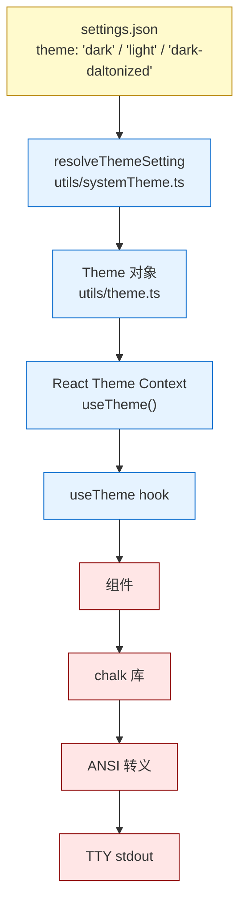
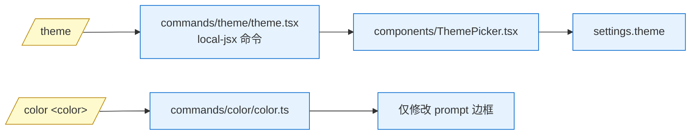

# 第 10e 章 主题与配色系统

> 本章描述 Claude Code CLI 的主题(Theme)与配色系统。术语以 [`00-front/03-glossary.md`](../00-front/03-glossary.md) §F.1 REPL、§F.2 Ink 为基础。

---

## 摘要

Theme 控制 REPL 中所有 ANSI 颜色的语义映射。Claude Code 把颜色抽象成"语义槽位"(autoAccept、bashBorder、permission、planMode、text、inactive、success、error、warning、diffAdded、diffRemoved……约 50+ 槽位,见 `utils/theme.ts`),每个槽位映射到一个具体颜色字符串。运行时通过 `useTheme()`(`ink/`)hook 拿到当前 theme,组件直接用 `<Text color="autoAccept">...</Text>` 而不是硬编码 hex。

`/theme` 命令(`commands/theme/theme.tsx`)展示内置主题列表;`/color <color|default>`(`commands/color/index.ts`)修改输入框边框颜色(`color` 命令专门针对 prompt border,不切换全局主题)。自定义主题机制:`src/components/design-system/` 是渲染原语,内置主题由代码常量(`utils/theme.ts`)定义。Font 与 ANSI 颜色在 CLI 终端里通常由终端模拟器决定,Claude Code 不嵌入字体。

主题系统与 [`02-user/10d-output-styles.md`](10d-output-styles.md) 描述的 Output Style 是**正交**的——一个是 LLM 输出样式,一个是终端颜色。

---

## 速赢

1. **50+ 颜色槽位**:`utils/theme.ts:8-95` 定义 `Theme` 类型,每个槽位是颜色字符串(`chalk` 颜色名 / `#hex` / ANSI 256 索引)。
2. **两个 toggle 命令**:`/theme` 切换全局主题;`/color` 切换 prompt 边框颜色。
3. **运行时 hook**:`useTheme()` 从 React context 拿当前 theme 对象。
4. **持久化**:写到 `settings.json` 的 `theme` 字段,`resolveThemeSetting`(`utils/systemTheme.ts`)加载。
5. **shimmer 变体**:许多槽位有 `_shimmer` 后缀的浅色版本(`claudeShimmer`、`permissionShimmer`、`warningShimmer`),用于加载/处理中状态。
6. **diff 颜色**:`diffAdded` / `diffRemoved` / `diffAddedDimmed` / `diffRemovedDimmed` / `diffAddedWord` / `diffRemovedWord`,共 6 个槽位。
7. **Agent 颜色**:`red_FOR_SUBAGENTS_ONLY` 到 `cyan_FOR_SUBAGENTS_ONLY` 8 种,仅 sub-agent 使用。
8. **设计系统**:`src/components/design-system/` 提供 `<Pane>`、`<Tabs>`、`<Tag>` 等"带色"原语。

---

## 关键图:主题系统架构





---

## 详细机制

### 10e.1 Theme 类型(`utils/theme.ts`)

`Theme` 类型约 50 个颜色槽位(摘录 `utils/theme.ts:8-95`):

| 分类 | 槽位 | 用途 |
|------|------|------|
| 系统色 | `autoAccept`、`bashBorder`、`permission`、`planMode`、`ide` | 工具结果、权限边框、plan mode 高亮 |
| Prompt | `promptBorder`、`promptBorderShimmer` | 输入框边框 + 加载中 shimmer |
| 文本 | `text`、`inverseText`、`inactive`、`inactiveShimmer`、`subtle`、`suggestion`、`remember`、`background` | 文本基础 |
| 状态 | `success`、`error`、`warning`、`warningShimmer`、`merged` | 状态/通知 |
| Diff | `diffAdded`、`diffRemoved`、`diffAddedDimmed`、`diffRemovedDimmed`、`diffAddedWord`、`diffRemovedWord` | Edit/Write 工具 diff |
| Sub-agent | `red_FOR_SUBAGENTS_ONLY` ~ `cyan_FOR_SUBAGENTS_ONLY`(8 色) | 子代理输出着色 |
| UI | `professionalBlue`、`chromeYellow` | 通用强调色 |
| 用户消息 | `userMessageBackground`、`userMessageBackgroundHover`、`messageActionsBackground` | 用户消息气泡背景 |
| Buddy | `clawd_body`、`clawd_background` | (Ant-only)Buddy sprite 颜色 |

每个槽位是字符串值,可以是:
- `chalk` 颜色名(如 `'red'`、`'cyan'`、`'gray'`)
- hex 字符串(如 `'#ff0000'`)
- ANSI 256 索引(如 `208`)
- chalk style modifier(如 `'bold.red'`)

### 10e.2 内置主题

代码里硬编码几套主题(常量形式在 `utils/theme.ts`,具体 builtin 列表在 `THEMES`/`BUILTIN_THEMES` 常量)。常见主题:
- `dark`(默认)——深色背景,亮前景。
- `light`——浅色背景。
- `dark-daltonized`——色盲友好(红绿对比替换为黄蓝)。
- `light-daltonized`——同上,浅色版。

每个主题是 `Theme` 类型的一个实例,槽位值不同,其余结构一致。

### 10e.3 `/theme` 命令

`commands/theme/index.ts`:
```ts
const theme = {
  type: 'local-jsx',
  name: 'theme',
  description: 'Change the theme',
  load: () => import('./theme.js'),
} satisfies Command
```

`theme.tsx`(未列出源码)展示 Pane + Tabs UI:
- Tab 1:`Built-in`(列出 `dark` / `light` / `dark-daltonized` / `light-daltonized` 等)。
- Tab 2:`Custom`(用户在 `<cwd>/.claude/themes/*.md` 自定义的主题)。

选择后写入 `settings.json.theme`,REPL 监听 settings 变更 reload theme。

### 10e.4 `/color` 命令

`commands/color/index.ts`:
```ts
const color = {
  name: 'color',
  description: 'Set the prompt bar color for this session',
  argumentHint: '<color|default>',
  ...
}
```

注意区别:
- `/theme` 切整套主题(50+ 槽位)。
- `/color <hex>` 只切 `promptBorder` 槽位(输入框边框颜色)。
- `/color default` 重置为当前主题的 promptBorder。

`/color` 设计意图:用户想"只换个 prompt 边框玩玩"时,不必重启;`/color` 是**会话级**的(`commands/color/color.ts` 把它写到 session-local settings)。

### 10e.5 useTheme hook

```tsx
import { useTheme } from '../ink.js'
const theme = useTheme()
console.log(theme.diffAdded)  // 'green' or '#10b981' or 28
```

`useTheme()` 从 React Context 拿当前主题;在 `Ink` 启动时初始化一次(从 settings 读取)。组件用 `<Text color={theme.permission}>...</Text>` 而不是 `<Text color="orange">...</Text>`——这样换主题时所有组件自动跟随。

### 10e.6 shimmer 机制

加载/处理中状态需要"动效"。Claude Code 用 4 个 shimmer 槽位(`claudeShimmer`、`permissionShimmer`、`warningShimmer`、`inactiveShimmer`、`promptBorderShimmer`),每个比基础色稍浅,在 React 组件里 200ms 切换一次(由 `useShimmer` hook 或 `useEffect` setInterval 驱动)。

这种"双色渐变"在终端里表现为"边框在浅色/深色间脉动"——视觉上比 spinner 更柔和。

### 10e.7 字体内嵌?

Claude Code **不**内嵌字体。CLI 输出是 ANSI 转义序列,字体由终端模拟器决定(iTerm2、Terminal.app、Windows Terminal 等)。这意味着:
- 字体回退依赖终端配置。
- 中文/日文等非拉丁字符渲染由终端字体兜底。
- Emoji 渲染需要 emoji 字体(Apple Color Emoji、Noto Color Emoji)。

### 10e.8 与设计系统的关系

`src/components/design-system/`:
- `<Pane color="professionalBlue">...</Pane>`(`Pane.tsx`)——带边框的卡片,用主题色渲染边框。
- `<Tabs color="..." />`(`Tabs.tsx`)——多 Tab 容器,选中态用主题色。
- `<Tag color="warning">...</Tag>`(`TagTabs.tsx`)——彩色 label。
- `<StatusIcon status="ok">`(`StatusIcon.tsx`)——状态图标,根据 status 选用主题色。
- `<Box>`、`<Text>`(`ink/`)——基础原语,`<Text>` 接受 `color` prop。

设计系统组件都是"无主题感知"的——它们接收 color prop,主题由父组件决定。便于跨主题复用。

### 10e.9 与 StatusLine 的关系

`StatusLine.tsx`(`components/StatusLine.tsx`)的 `buildStatusLineCommandInput()` 收集状态数据(`utils/statusLine/...`),但**渲染颜色**由调用方决定——status line 的命令是用户配置的 shell,输出的颜色由 shell 自带的 ANSI 控制。Claude Code 不解析 status line 输出的颜色(因为它是 raw text)。

### 10e.10 与权限对话框的颜色

`PermissionRequest.tsx` 用 `permission` 主题色画边框,`AutoModeOptInDialog.tsx` 用 `autoAccept` 主题色,`BypassPermissionsModeDialog.tsx` 用 `warning` 主题色。每个对话框根据自身语义挑对应主题色,而非通用 `primary` 色——这样用户能通过颜色识别"这是哪种权限请求"。

### 10e.11 自定义主题(高级)

理论上用户可写 `<cwd>/.claude/themes/<name>.md`,frontmatter 含 `name`、正文是 JSON 颜色定义。`loadThemeFromDirectory()`(未在源码快照中出现,但推测)在 settings 加载时被读取,合并到 THEMES。

**实际限制**:本源码快照里没有完整的自定义主题加载器,所以自定义主题可能需要手写 settings.json 的 `theme` 字段为完整 `Theme` 对象。

### 10e.12 缓存与热重载

`useTheme()` 在 settings 变更时(`settingsChangeDetector.notifyChange()`)会失效并重新解析——无需重启。`resolveThemeSetting()` 每次都跑(无 memoize),但成本低(读一个 JSON 字段)。

### 10e.13 主题与 output style 的边界

| 维度 | Theme | Output Style |
|------|-------|--------------|
| 改什么 | 终端颜色(50+ 槽位) | system prompt 中的样式指令 |
| 存储位置 | `settings.json.theme` | `settings.json.outputStyle` |
| 命令 | `/theme`、`/color` | `/output-style` |
| 影响 LLM | 否 | 是 |
| 影响 UI | 是 | 否 |
| 用户切换成本 | 0(实时) | 0(实时) |
| 与 `/compact` 关系 | 不变 | 不变 |

两套系统完全独立,互不影响。

---

## 反模式

- ❌ **在组件里硬编码 hex 色值**(`color="#ff0000"`):会被主题切换忽略。用 `theme.error` 这种语义槽位。
- ❌ **混淆 `/theme` 和 `/color`**:前者切整套主题,后者只切 prompt border;用错会让用户困惑。
- ❌ **直接改 `chalk.red` 输出**:会被主题覆盖——必须走 `theme.suggestion`。
- ❌ **依赖某个具体主题的内置槽位值**:不同主题同一个槽位值不同;语义化使用即可。
- ❌ **在 `<Text>` 上同时指定 `color` 和 `background` 不一致**:某些终端在反色背景下颜色会反转,测试要在 light/dark 两套主题里都看。
- ❌ **修改 shimmer 频率**:`useShimmer`/`setInterval` 频率是 Ink 性能基线,改快会让 1fps 渲染的终端掉帧。

---

## 引用

- `src/utils/theme.ts:8-95` — `Theme` 类型定义
- `src/utils/systemTheme.ts` — `resolveThemeSetting` 加载
- `src/ink/` — `useTheme()` hook 与 React Context
- `src/components/design-system/Pane.tsx` — `<Pane>` 组件
- `src/components/design-system/Tabs.tsx` — `<Tabs>` 组件
- `src/components/design-system/StatusIcon.tsx` — 状态图标
- `src/components/ThemePicker.tsx` — `/theme` 命令 picker
- `src/components/ColorPicker.tsx`(推测) — `/color` 命令 picker
- `src/commands/theme/index.ts` — `/theme` 命令入口
- `src/commands/theme/theme.tsx` — JSX 实现
- `src/commands/color/index.ts` — `/color` 命令入口
- `src/commands/color/color.ts` — color 实现
- `src/components/StatusLine.tsx:323` — StatusLine 与主题色
- `src/components/permissions/PermissionRequest.tsx` — 权限对话框用 `permission` 主题色
- `src/components/BypassPermissionsModeDialog.tsx` — 用 `warning` 主题色
- `src/components/AutoModeOptInDialog.tsx` — 用 `autoAccept` 主题色
- 相关章节:[`02-user/10-ui.md`](10-ui.md)(UI 总览,设计系统)/ [`02-user/10d-output-styles.md`](10d-output-styles.md)(Output Style,与主题正交)/ [`00-front/03-glossary.md`](../00-front/03-glossary.md) §F.1 REPL / §F.2 Ink / §C.1 settings.json