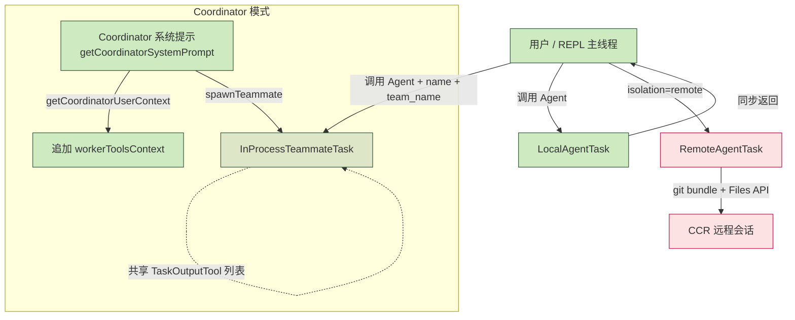

# 第 11 章 多 Agent 与团队协作

> 用户视角深入剖析 Claude Code 的 Agent 子代理、Task 系统、消息桥接与 Coordinator 模式。

## 摘要

Claude Code 把"并发协作"做成了 **一等公民**,而不是把多 agent 当成 demo 玩具。本章围绕五个互相关联的能力展开:

1. **`AgentTool`** —— 主线程里跑出的子代理(同步或后台)
2. **Task 系统** —— 三种 Task 实现:`LocalAgentTask`、`InProcessTeammateTask`、`RemoteAgentTask`
3. **消息层** —— `SendMessageTool` + 邮箱(mailbox)做队友通信
4. **Coordinator 模式** —— 多 Agent 协调者(`/loop`、CCR、CCR UltraPlan)
5. **`/tasks` / `/bashes`** —— 后台任务管理面板

读者画像:**有经验的 claude-code 用户,想搞清楚"fork agent"、"spawn teammate"、"SendMessage"、"plan_approval_response" 这些到底在做什么**。

## 速赢

| 想做这件事 | 用这个 | 见 |
|---|---|---|
| 让一个 worker 同步干一件事 | `Agent` 工具 + `subagent_type: "general-purpose"` | §11.1 |
| 长任务丢后台继续跑 | `Agent` + `run_in_background: true` | §11.2 |
| 同时跑 N 个 worker,合并结果 | Coordinator 模式 | §11.5 |
| 给已存在的 worker 发补充指令 | `SendMessage` tool | §11.3 |
| 把一堆 worker 编成团队,共享 inbox | `name + team_name` 参数 | §11.2 |
| 看到所有后台 agent / bash | `/tasks` 或 `/bashes` | §11.4 |

## 关键图

### Agent 协调树



## 详细机制

### 11.1 `AgentTool` —— 子代理的入口

子代理的能力都被收敛到 **一个工具**: `AgentTool`(`src/tools/AgentTool/AgentTool.tsx:196`)。

#### 关键路径

- **Prompt 生成**:`getPrompt(filteredAgents, isCoordinator, allowedAgentTypes)`(`src/tools/AgentTool/prompt.ts`)
- **执行**:`runAgent()`(`src/tools/AgentTool/runAgent.ts`)
- **分支判定**(`AgentTool.tsx:282-316`):
  - 传 `team_name` + `name` → 走 `spawnTeammate()`(见 §11.2)
  - 否则走普通 subagent(fork 或非 fork)

#### 子代理类型

```ts
// src/tools/AgentTool/agentToolUtils.ts:62
export type ResolvedAgentTools = {
  hasWildcard: boolean
  validTools: string[]
  invalidTools: string[]
  resolvedTools: Tools
  allowedAgentTypes?: string[]
}
```

- **`hasWildcard = true`**:工具列表为 `undefined` 或 `['*']`,给 worker 用全部工具
- **`allowedAgentTypes`**:嵌套 Agent 调用时(`Agent(worker, researcher)`)做类型白名单
- **`filterToolsForAgent`**(`agentToolUtils.ts:70`):过滤掉禁止工具(`ALL_AGENT_DISALLOWED_TOOLS`、`CUSTOM_AGENT_DISALLOWED_TOOLS`)

#### fork 子代理(ant-only 实验特性)

`AgentTool.tsx:322-336` 的 `effectiveType` 判断:

```ts
const effectiveType = subagent_type ?? (isForkSubagentEnabled() ? undefined : GENERAL_PURPOSE_AGENT.agentType);
const isForkPath = effectiveType === undefined;
```

fork 路径下,worker **继承父会话的 system prompt** 用于缓存命中(`buildForkedMessages()`)。禁止在 fork 子代理里再 fork:`AgentTool.tsx:332-333`。

#### 必备 MCP 等待

子代理可能依赖某些 MCP server 才能跑(`requiredMcpServers`)。`AgentTool.tsx:371-410` 的逻辑:

1. 看是否有 required server 还在 `pending`
2. 如果有,最长等 30 秒(`MAX_WAIT_MS = 30_000`,每 500ms poll 一次)
3. 检测到 failed server 立即跳出

> 这是处理"MCP 连接还没就绪,worker 已经 spawn"的 race condition。

### 11.2 Task 系统:三种 Task

Claude Code 把所有长跑任务都抽象成 **Task**(`src/Task.ts:6` 的 `TaskType`),UI/管理层无需知道细节。

#### `LocalAgentTask` —— 普通后台 agent

`src/tasks/LocalAgentTask/LocalAgentTask.tsx:270`:

```ts
export const LocalAgentTask: Task = {
  name: 'LocalAgentTask',
  type: 'local_agent',
  async kill(taskId, setAppState) {
    killAsyncAgent(taskId, setAppState)
  }
};
```

状态机字段(`LocalAgentTask.tsx:116-148`):

- `status: 'running' | 'completed' | 'failed' | 'killed'`
- `agentId / prompt / selectedAgent / agentType / model`
- `messages: Message[]`:worker 自己的消息流
- `pendingMessages: string[]`:**队列中的 SendMessage,等 round boundary 再注入**
- `retain: boolean`:**UI 在持有此任务**(防止被驱逐,允许 stream-append)
- `diskLoaded: boolean`:从 JSONL bootstrap 过一次

**关键 API**:

- `killAsyncAgent(taskId, setAppState)`(`LocalAgentTask.tsx:281`):发 `abortController.abort()`,触发 `evictTaskOutput` 清理磁盘
- `completeAgentTask(result, setAppState)`(`LocalAgentTask.tsx:412`):标记完成,设置 `evictAfter = Date.now() + PANEL_GRACE_MS`

#### `InProcessTeammateTask` —— 进程内队友

这是 **lead 同进程** 的队友(`src/tasks/InProcessTeammateTask/types.ts:101`)。

约束:

- 不能 spawn background agent(生命周期绑定到 leader 进程),`AgentTool.tsx:278-280`
- 共享父进程的 TaskOutputTool 列表(协作任务清单)
- 通过 mailbox 通信(同进程内 `Map<agentName, Mailbox>`)

#### `RemoteAgentTask` —— 远程代理

`src/tasks/RemoteAgentTask/RemoteAgentTask.tsx:808`,支持 5 种 `RemoteTaskType`(`types.ts:60`):

```ts
const REMOTE_TASK_TYPES = ['remote-agent', 'ultraplan', 'ultrareview',
                            'autofix-pr', 'background-pr'] as const;
```

每个 task 都关联一个 **CCR 会话**(`sessionId`),本地通过 `pollRemoteSessionEvents` 持续拉事件流(`RemoteAgentTask.tsx:19`)。

#### **TEAMMATE_MESSAGES_UI_CAP = 50** 的设计

为避免"队友连环轰炸主线程"导致 UI 内存爆炸,`InProcessTeammateTask/types.ts` 限制了 **每队 50 条 UI 可见消息**:

```ts
// InProcessTeammateTask/types.ts:101
export const TEAMMATE_MESSAGES_UI_CAP = 50;
```

超出后丢弃最旧的,保留最近 50 条。**这是隐藏的内存护栏**,不是文档里写的。

### 11.3 `SendMessageTool` —— 队友消息总线

`src/tools/SendMessageTool/SendMessageTool.ts:520-602`。消息 schema 接受 **union of 5 类**:

```ts
// SendMessageTool.ts:82
message: z.union([
  z.string().describe('Plain text message content'),
  StructuredMessage(),   // JSON-encoded structured message
]),
```

**5 类结构化消息**(由 `StructuredMessage()` schema 定义):

| 消息类型 | 触发场景 | 见 |
|---|---|---|
| `message` | 普通文本消息(默认) | |
| `broadcast` | 群发(把 `to: "*"`)| mailbox fan-out |
| `shutdown_request` | lead → teammate 的优雅关闭请求 | §11.3.1 |
| `shutdown_response` | teammate → lead 的"同意/拒绝"回复 | §11.3.2 |
| `plan_approval_response` | teammate ExitPlanMode 工具的 plan 审批结果 | §11.3.3 |

**输出 schema**(`SendMessageTool.ts:127-131`):

```ts
export type SendMessageToolOutput =
  | MessageOutput
  | BroadcastOutput
  | RequestOutput
  | ResponseOutput;
```

#### 11.3.1 跨机桥接 `behavior: 'ask'` + `safetyCheck`

**所有跨机通信的 permission decision 永远是 `ask` + `safetyCheck`**,绝不 auto-allow。 这是 CCR / 远程 coordinator 的安全铁律,见 `SendMessageTool.ts` 中 `handleBroadcast` / `sendShutdownRequestToMailbox` 的 permission 处理分支:

- 用户消息走 `toolUseContext` 的 `toolPermissionContext`
- 跨机消息 → 强制走 `behavior: 'ask'`
- 自动接受会被 `safetyCheck` 拦截(`safeToAutoAccept === false`)

#### 11.3.2 Shutdown 流

Lead 调 `sendShutdownRequestToMailbox()`(`src/utils/teammateMailbox.ts:831`):

```ts
export async function sendShutdownRequestToMailbox(
  targetName: string, teamName?: string, reason?: string
): Promise<{ requestId: string; target: string }> {
  ...
  await writeToMailbox(targetName, {
    from: senderName,
    text: jsonStringify(createShutdownRequestMessage({
      requestId, from: senderName, reason,
    })),
    ...
  }, resolvedTeamName);
}
```

Teammate 收到 → `isShutdownRequest()` 解析 → 用户确认 → `ShutdownApprovedMessage` 或 `ShutdownRejectedMessage` 回 lead。

#### 11.3.3 Plan Approval Response

Teammate 在 plan mode 调 `ExitPlanModeTool` 后,lead 通过 plan_approval_response 授权/拒绝。schema 在 `teammateMailbox.ts:933+`。

### 11.4 `/tasks` 与 `/bashes` —— 后台任务管理

打开 `/tasks` 进入 `BackgroundTasksDialog`(`src/components/tasks/BackgroundTasksDialog.tsx`)。

支持的快捷键(`BackgroundTasksDialog.tsx:253-279`):

- `x` —— kill 当前选中(running 状态)
- `f` —— foreground(本地 agent 切回主视图)
- `right` / `left` —— 进出详情/列表
- `ctrl+x ctrl+k` —— `chat:killAgents` 全杀(`BackgroundTasksDialog.tsx:136`)

任务列表排序:

```
running > pending > 时间倒序
```

特别地,**`local_workflow` 和 `monitor_mcp`** 这两类 ant-only 任务在外部构建里会被 `feature()` DCE 掉,见 `BackgroundTasksDialog.tsx:108-120`。

### 11.5 Coordinator 模式(`COORDINATOR_MODE`)

> 这是 Claude Code 多 Agent 协作的 **高阶形态**,默认关闭,需 feature flag + 环境变量开启。

#### 启用条件

`src/coordinator/coordinatorMode.ts:36-41`:

```ts
export function isCoordinatorMode(): boolean {
  if (feature('COORDINATOR_MODE')) {
    return isEnvTruthy(process.env.CLAUDE_CODE_COORDINATOR_MODE)
  }
  return false
}
```

要 **两个条件同时满足**:
1. 构建包含 `COORDINATOR_MODE` feature(ant-only)
2. 环境变量 `CLAUDE_CODE_COORDINATOR_MODE=1`

#### `getCoordinatorUserContext`

`coordinatorMode.ts:80-109`,返回一个对象 `{ workerToolsContext: string }`,这个 context 会被 **注入到主线程 system prompt** 里。

注入点在 `QueryEngine.ts:302-308`(详见 28-streaming 章节),实际内容是 **把 worker 能用的工具清单 + 可用的 MCP server + scratchpad 路径告诉 coordinator**,让 coordinator 知道该把什么任务派出去:

```
Workers spawned via the Agent tool have access to these tools: Bash, Read, Edit, ...

Workers also have access to MCP tools from connected MCP servers: foo, bar

Scratchpad directory: /tmp/claude-scratchpad-xxxx
Workers can read and write here without permission prompts.
```

#### `matchSessionMode` —— `/resume` 时同步模式

如果用户 `/resume` 一个曾以 coordinator 模式运行的会话,`matchSessionMode()`(`coordinatorMode.ts:49-78`)会 **重设 env 变量** 以匹配历史模式,并发 `tengu_coordinator_mode_switched` 事件。

#### Coordinator 的工作流(摘自 `getCoordinatorSystemPrompt`)

1. **Research**:并行 worker `subagent_type: "worker"` 做探索
2. **Synthesis**:**Coordinator 自己** 读 worker 报告,**不允许用"基于你的发现"这种话糊弄**(`coordinatorMode.ts:258-259`)
3. **Implementation**:派 worker 实现
4. **Verification**:派新 worker 验证(独立上下文)

每个阶段有明确分工——见 `coordinatorMode.ts:200-213` 的并发表。

## 反模式

1. **不要在 fork 子代理里再 fork** —— `AgentTool.tsx:332` 显式 throw。Fork 是用来"分叉独立任务"的,不是用来嵌套的。
2. **不要让 teammate 试图 spawn background agent** —— `AgentTool.tsx:278-280` 显式 throw,生命周期会乱。
3. **不要用 `SendMessage` 给没注册过的 teammate 发消息** —— 会丢到虚空;先用 `team_name + name` 注册。
4. **不要用"基于你的发现"作为 worker prompt** —— `getCoordinatorSystemPrompt` 显式列为 anti-pattern,worker 没你的会话上下文。
5. **不要把 teammate 的 `behavior` 设成 `allow`** —— 跨机 / 跨会话的 permission **永远 `ask`**。

## 引用

| 主题 | 文件 | 关键行 |
|---|---|---|
| AgentTool 主体 | `src/tools/AgentTool/AgentTool.tsx` | 196, 282-316, 322-336 |
| 子代理工具过滤 | `src/tools/AgentTool/agentToolUtils.ts` | 62-116 |
| Prompt 生成 | `src/tools/AgentTool/prompt.ts` | |
| Fork 实验 | `src/tools/AgentTool/forkSubagent.ts` | 32 |
| Local Task 状态机 | `src/tasks/LocalAgentTask/LocalAgentTask.tsx` | 116-148, 270-303 |
| Teammate types | `src/tasks/InProcessTeammateTask/types.ts` | 101 (CAP) |
| Remote Task 状态 | `src/tasks/RemoteAgentTask/RemoteAgentTask.tsx` | 22-59, 808 |
| SendMessage tool | `src/tools/SendMessageTool/SendMessageTool.ts` | 64-131, 520-602 |
| Mailbox 协议 | `src/utils/teammateMailbox.ts` | 717-870 |
| Coordinator 模式 | `src/coordinator/coordinatorMode.ts` | 36-109, 116-369 |
| 后台任务 UI | `src/components/tasks/BackgroundTasksDialog.tsx` | 127-249 |
| QueryEngine 注入点 | `src/query/engine.ts` | 302-308 (context 注入) |