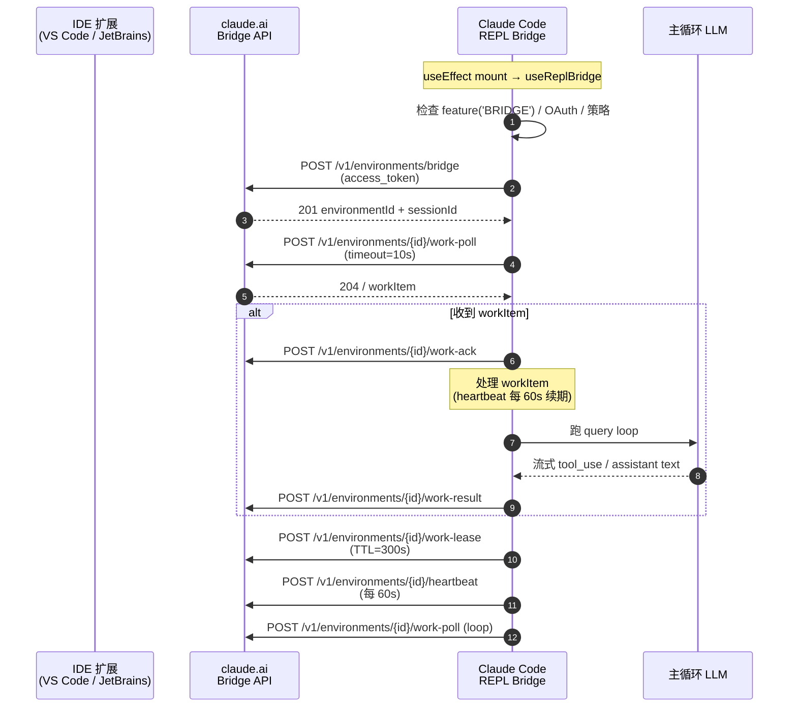
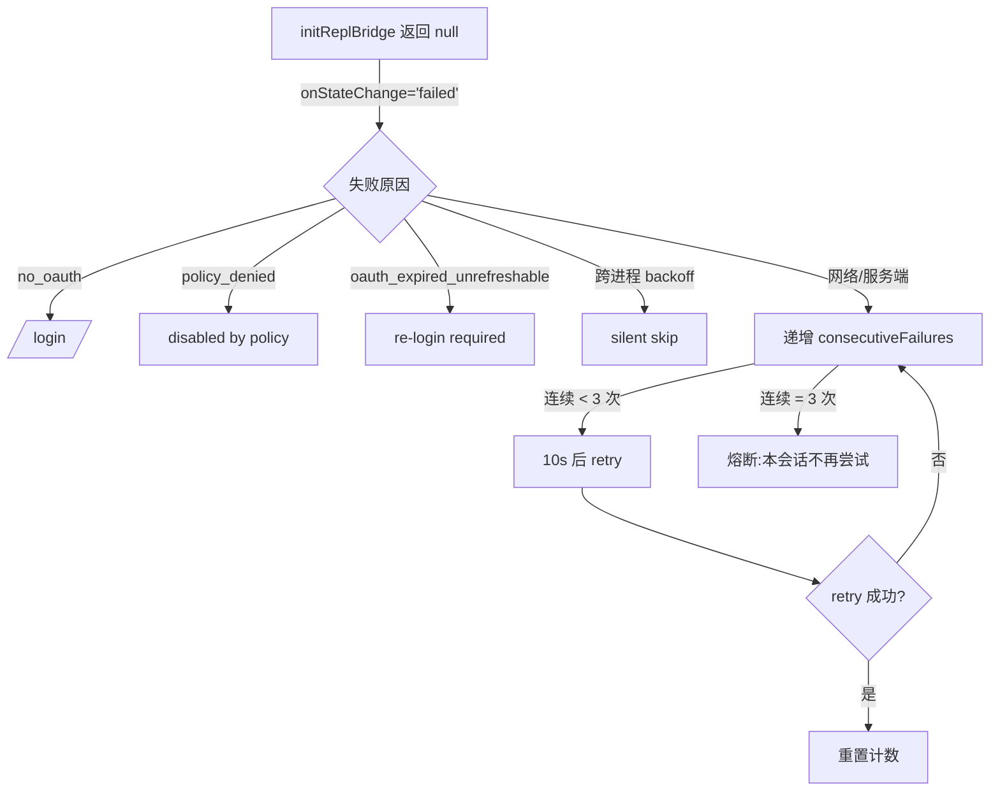
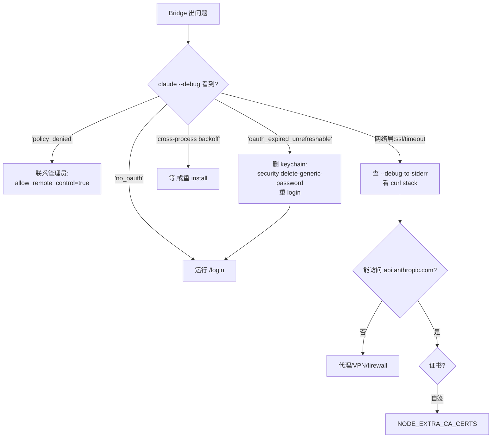

# 第 12 章 IDE Bridge(VS Code / JetBrains 集成)

> 用户视角解析 Claude Code 与 IDE 的桥接协议、Assistant Mode 与故障排查。

## 摘要

Claude Code 与 IDE 的集成走 **三层架构 + 一个 hook** 的设计,围绕 **反向通道**(IDE → CLI)和 **正向事件流**(CLI → IDE)双向工作。本章覆盖:

1. **`src/bridge/` 三层**:HTTP client(`bridgeApi.ts`)、核心 transport(`replBridge.ts`)、REPL 入口包装(`initReplBridge.ts`)
2. **`useReplBridge` hook**(`src/hooks/useReplBridge.tsx:53-127`):失败熔断、消息 redaction
3. **Assistant Mode**(KAIROS feature):perpetual 持久会话
4. **故障排查**:bridge 失败、网络、token 过期

读者画像:**想要把 Claude Code 嵌入 VS Code / JetBrains 的开发者,或者 IDE 集成出问题时需要排查**。

## 速赢

| 现象 | 怎么查 |
|---|---|
| IDE 里看不到 Claude | `/ide` 命令选 IDE |
| 配对好了但连不上 | `claude --debug [bridge:repl]` 看日志 |
| OAuth token 过期反复 401 | `BRIDGE_FAILURE_DISMISS_MS = 10s` 自动清除,运行 `/login` 重连 |
| Assistant 模式不响应 | 检查 `feature('KAIROS')` 是否开、`perpetual` 是否传 |

## 关键图

### Bridge 协议时序



## 详细机制

### 12.1 三层架构

#### `bridgeApi.ts`(HTTP client)—— `src/bridge/bridgeApi.ts:212`

```ts
type BridgeApiDeps = {
  baseUrl: string
  getAccessToken: () => string | undefined
  runnerVersion: string
  onDebug?: (msg: string) => void
  onAuth401?: (staleAccessToken: string) => Promise<boolean>
  getTrustedDeviceToken?: () => string | undefined
}
```

- **`BETA_HEADER = 'environments-2025-11-01'`**(`bridgeApi.ts:38`)—— 所有请求必带的 beta header
- **`validateBridgeId(id, label)`**(`bridgeApi.ts:48`)—— 路径段白名单 `/^[a-zA-Z0-9_-]+$/`,防 path traversal
- **`BridgeFatalError`**(`bridgeApi.ts:55+`)—— 致命错误类(401 等),不可重试
- **`onAuth401` 回调**:外部注入 OAuth 刷新逻辑,daemon/SDK 路径跳过(避免 1300+ module 依赖链)

> 设计要点:**bridgeApi 是 stateless HTTP 客户端**,所有状态在调用方。

#### `replBridge.ts`(transport 核心)—— `src/bridge/replBridge.ts:119-125`

`replBridge.ts:260` 的 `initBridgeCore()` 是 REPL bridge 的入口。

- **`replBridge.ts:119-125`** 是 `setMaxListeners` 调高(默认 10 不够用,bridge 上很多 listener)
- 维护 `ReplBridgeHandle`(`src/bridge/replBridge.ts`),暴露 `disconnect / send / onMessage` 等

**核心事件类型**:`replBridge.ts` 的 `BridgeState` 枚举 `'connecting' | 'connected' | 'disconnected' | 'failed'`。

#### `initReplBridge.ts`(REPL 入口包装)—— `src/bridge/initReplBridge.ts:110`

7 步守卫链(`initReplBridge.ts:135-241`):

1. **runtime gate**:`isBridgeEnabledBlocking()`
2. **最低版本检查**(v1/v2 各有 floor)
3. **OAuth 必须有 token**:`getBridgeAccessToken()`,否则 onStateChange('failed', '/login')
4. **组织策略**:`isPolicyAllowed('allow_remote_control')`
5. **跨进程 backoff**(`initReplBridge.ts:168-187`):如果上次有 3 次 dead token,跳过
6. **主动 refresh**:`checkAndRefreshOAuthTokenIfNeeded()`
7. **过期直接 skip**:refresh 仍失败 → 持久化 dead token,下次进程跳过

**关键洞察**:第 5 步的 cross-process backoff 用的是 **expiresAt 作为 content-address key**,新 token 自然失效旧计数,无需显式 clear。

### 12.2 `useReplBridge` hook

`src/hooks/useReplBridge.tsx:53-127`,被 `screens/REPL.tsx` 挂载。

#### 关键常量

```ts
// useReplBridge.tsx:29
export const BRIDGE_FAILURE_DISMISS_MS = 10_000;

// useReplBridge.tsx:40
const MAX_CONSECUTIVE_INIT_FAILURES = 3;
```

- **`BRIDGE_FAILURE_DISMISS_MS`** —— 失败后 10 秒自动清掉 `replBridgeEnabled`,停止重试
- **`MAX_CONSECUTIVE_INIT_FAILURES = 3`** —— **关键熔断**!连续 3 次初始化失败后,本会话不再尝试

注释里明确说,这是为了阻止"settings sync / /remote-control / config tool 等路径会把 `replBridgeEnabled` 翻回去"导致的 **反复 401 风暴**(Datadog 2026-03-08 数据:一个 stuck client 单日生成 2,879 × 401)。

#### 失败处理决策树



#### 消息 Redaction

`useReplBridge.tsx` 在转发 inbound message 之前会 **redact** 两类敏感信息:

- **MCP tool 名**:`mcp__<server>__<tool>` 中的 server 名可能暴露组织内部命名
- **Plugin 路径**:绝对路径暴露文件位置

这是 bridge 独有的隐私防护,REPL 本地不走这条。

### 12.3 Assistant Mode(`feature('KAIROS')`)

> "Perpetual" 模式:CLI 始终与同一个 IDE 会话保持配对。

#### 核心:复用 `{environmentId, sessionId}`

`initReplBridge.ts:110` 的签名:

```ts
export async function initReplBridge(
  options?: InitBridgeOptions,
): Promise<ReplBridgeHandle | null> {
  const { perpetual, ...rest } = options ?? {}
  ...
}
```

`perpetual: true` 时:

- **不重新注册** environment,直接复用已存在的 `{environmentId, sessionId}`
- 标题保留(`getCurrentSessionTitle`),不重新生成 slug
- token 失败时 **不主动 close**,等 IDE 端取消

#### feature flag 矩阵

| Feature | 含义 | 默认 |
|---|---|---|
| `BRIDGE` | bridge 总开关 | 开 |
| `KAIROS` | Assistant Mode 主开关 | ant-only |
| `KAIROS_CHANNELS` | 推送 channel(MCP)集成 | ant-only |
| `BRIDGE_REPL_V2` | env-less bridge(跳过 Environments API) | ant-only |
| `PROACTIVE` | 主动模式(类似 KAIROS 但更激进) | ant-only |

### 12.4 `/ide` 命令

打开 IDE 选择菜单(`src/commands/ide.ts`)。选项:

- **VS Code**
- **JetBrains**(IntelliJ / WebStorm / PyCharm / GoLand ...)
- **Cursor**(基于 VS Code fork)
- **Sublime / Vim / etc.**(可能不支持)
- **None** —— 关闭 bridge

`/ide` 把所选 IDE 的扩展 ID 写到 `~/.claude/ide-config.json`,下次启动自动配对。

### 12.5 故障排查决策树



#### 典型故障

**症状 A**:`--debug` 里反复出现 `401 from POST /v1/environments/bridge`

- **原因**:OAuth refresh token 死了(密码改了、组织离开了、token 被 GC)
- **诊断**:看 `bridgeOauthDeadExpiresAt` 是否被持久化(`initReplBridge.ts:230-238`)
- **修复**:`/login`,拿到新 token → expiresAt 变 → backoff 自动失效

**症状 B**:Bridge 连上但 IDE 看不到消息

- **原因**:`messages` 队列被 redact 丢光 / 反向通道断开
- **诊断**:看 `useReplBridge.tsx` 的 `handleInboundMessage` 是否抛错
- **修复**:重启 CLI + IDE

**症状 C**:`BRIDGE_FAILURE_DISMISS_MS` 后无法重连

- **原因**:`replBridgeEnabled` 被自动清了
- **修复**:运行 `/remote-control`(CLI 里)或 `/ide` 重配对

### 12.6 配置文件位置速查

| 平台 | 配置文件 | 路径 |
|---|---|---|
| macOS | Keychain entry | `claude-code-oauth` |
| Linux | Keychain entry | `secret-tool service claude-code` |
| Windows | Credential Manager | `claude-code-oauth` |
| 共用 | Global config | `~/.claude/global.json`(含 `bridgeOauthDeadExpiresAt`) |
| 共用 | IDE 配对 | `~/.claude/ide-config.json` |

### 12.7 关键安全铁律

- **可信设备令牌** (`getTrustedDeviceToken`):当 `tengu_sessions_elevated_auth_enforcement` 开时,JWT-issuance 阶段需要(`bridgeApi.ts:30-34`)
- **路径白名单**:所有从 server 拿到的 ID 都过 `validateBridgeId`(`bridgeApi.ts:48-53`)
- **redaction**:outbound 给 IDE 的消息会洗掉内部 tool 名和绝对路径
- **最小权限**:`allow_remote_control` 策略默认拒绝,管理员显式开

## 反模式

1. **不要在 OAuth 刷新失败时手动重试** —— `MAX_CONSECUTIVE_INIT_FAILURES` 会让你陷入 401 风暴。删 token + 重新 `/login`。
2. **不要把 `accessToken` 直接传给第三方日志** —— 走 `redactMessage`。
3. **不要在 IDE 扩展里直接 `eval` 来自 bridge 的消息** —— 当作不可信文本渲染,不要 `innerHTML`。
4. **不要关闭 `BRIDGE_FAILURE_DISMISS_MS` 熔断** —— 它是 sticky failure 的最后防线。
5. **不要在 bridge session 里手动改 `global.json` 的 `bridgeOauthDeadExpiresAt`** —— 让 process 自然走完 retry 周期。

## 引用

| 主题 | 文件 | 关键行 |
|---|---|---|
| HTTP client | `src/bridge/bridgeApi.ts` | 12-53, 212 |
| Transport 核心 | `src/bridge/replBridge.ts` | 119-125, 260 |
| REPL 入口包装 | `src/bridge/initReplBridge.ts` | 110, 135-241, 311-378 |
| REPL hook | `src/hooks/useReplBridge.tsx` | 29-40, 53-127, 387-415 |
| Bridge 状态工具 | `src/bridge/bridgeStatusUtil.ts` | |
| JWT 工具 | `src/bridge/jwtUtils.ts` | |
| Trusted device | `src/bridge/trustedDevice.ts` | |
| Session ID 兼容 | `src/bridge/sessionIdCompat.ts` | |
| IDE 命令 | `src/commands/ide.ts` | |
| KAIROS feature | `src/proactive/index.ts`(推测,泄露中不存在;`proactive/` 目录未出现) | (feature flag 主入口) |