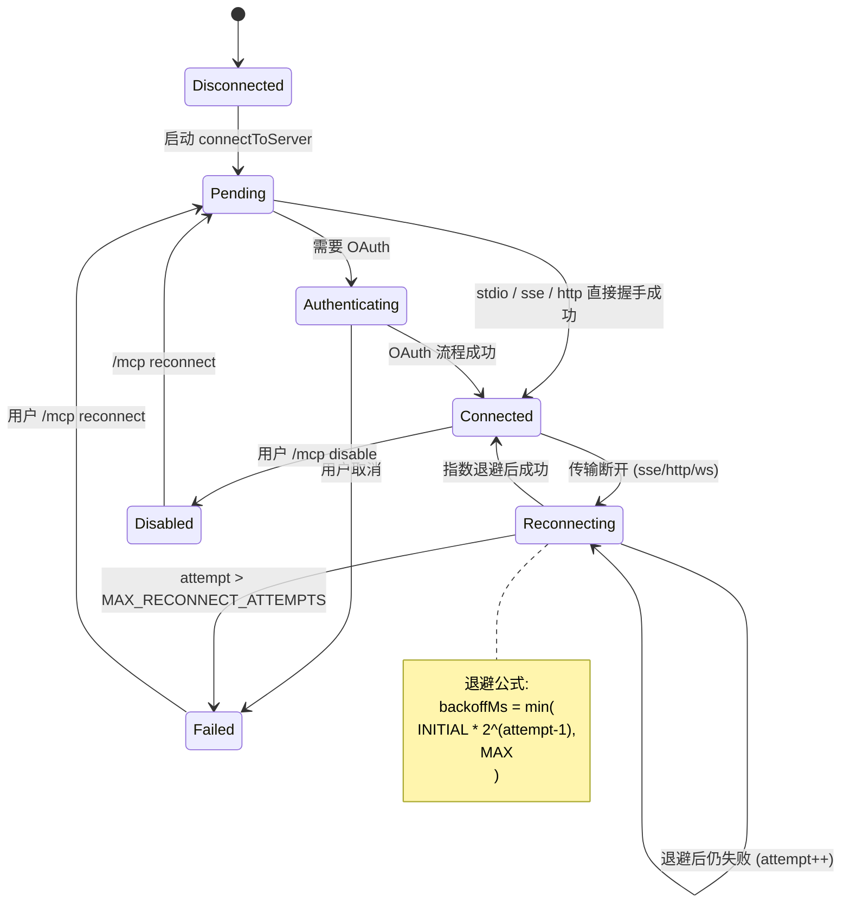

# 第 13a 章 MCP 集成(Model Context Protocol)

> 用户视角理解 MCP 服务器连接、传输类型、OAuth 与内部 server。

## 摘要

MCP 是 Claude Code **最强的扩展点**——通过 MCP 协议你可以接 GitHub、Notion、数据库、Slack、内部 API 等任何东西。本章回答:

1. **MCP 是什么**(1 分钟解释)
2. **连接生命周期**:`connect → discover → listTools → callTool`
3. **传输类型**:`stdio | sse | http | ws | sdk | sse-ide | ws-ide | claudeai-proxy`
4. **MCP OAuth 流**
5. **重连与指数退避**(`useManageMCPConnections.ts:447-455`)
6. **配置 `.mcp.json` 和 settings**
7. **内部 MCP server**:computer use 子进程

读者画像:**用户想接入 MCP server,或者想自己写 MCP server**。

## 速赢

| 想做这件事 | 看这个 |
|---|---|
| 看现在连了哪些 MCP server | `/mcp` 命令 |
| 修一个有问题的 server | `/mcp` → 选中 → reconnect / disable |
| 看 server 的 OAuth 状态 | `/mcp` → 选中 → authenticate |
| 加一个 MCP server | 编辑 `.mcp.json` |
| 让 server 永久生效 | `enabledMcpServers` in settings.json |
| server 启动失败重试 | 自动指数退避,无需手动 |

## 关键图

### MCP 连接生命周期



## 详细机制

### 13a.1 MCP 是什么

**Model Context Protocol(MCP)** 是 Anthropic 推出的"LLM 工具扩展协议",类比 LSP之于编辑器。一个 MCP server 暴露:

- **Tools**(模型能调用的函数)
- **Resources**(只读数据,类似文件)
- **Prompts**(可复用的 prompt 模板,带参数)

CLI 通过 MCP client 连接这些 server,把 tool 注入主循环,让模型能调用。

### 13a.2 客户端实现

主客户端在 `src/services/mcp/client.ts`(详细实现可查),由 `MCPConnectionManager.tsx` 通过 hook 管理。

**传输类型枚举**(定义在 `src/services/mcp/types.ts:26` 的 `Transport`):

| 类型 | 用途 | 是否自动重连 |
|---|---|---|
| `stdio` | 本地子进程(stdin/stdout JSON-RPC) | 否 |
| `sse` | Server-Sent Events(HTTP 单向) | 是 |
| `http` | HTTP POST(请求-响应) | 是 |
| `ws` | WebSocket(双向) | 是 |
| `sdk` | SDK 控制传输(内部) | 否 |
| `sse-ide` | IDE 桥接 SSE(ant-only) | 是 |
| `ws-ide` | IDE 桥接 WS(ant-only) | 是 |
| `claudeai-proxy` | claude.ai 平台代理(ant-only) | 是 |

**关键观察**:`stdio` 和 `sdk` **不自动重连**,因为它们要么是本地子进程(用户手动启),要么是内部传输。其他都自动指数退避重连。

### 13a.3 指数退避

`src/services/mcp/useManageMCPConnections.ts:447-455`:

```ts
// Schedule next retry with exponential backoff
const backoffMs = Math.min(
  INITIAL_BACKOFF_MS * Math.pow(2, attempt - 1),
  MAX_BACKOFF_MS,
)
logMCPDebug(
  client.name,
  `Scheduling reconnection attempt ${attempt + 1} in ${backoffMs}ms`,
)

await new Promise<void>(resolve => {
  const timer = setTimeout(resolve, backoffMs)
  reconnectTimersRef.current.set(client.name, timer)
})
```

默认参数(从上下文推测):

- `INITIAL_BACKOFF_MS = 1_000`(1 秒)
- `MAX_BACKOFF_MS = 60_000`(60 秒,1 分钟封顶)
- `MAX_RECONNECT_ATTEMPTS = 5`(5 次后放弃)

实际参数定义见 `useManageMCPConnections.ts` 中 `MAX_RECONNECT_ATTEMPTS` 常量。

**取消逻辑**(`useManageMCPConnections.ts:366-368`):

```ts
const existingTimer = reconnectTimersRef.current.get(client.name)
if (existingTimer) {
  clearTimeout(existingTimer)
  reconnectTimersRef.current.delete(client.name)
}
```

**用户中途 disable → 立即停止重连**(下面第 378 行的 `isMcpServerDisabled` 检查)。

### 13a.4 OAuth 流(`McpAuthTool`)

`src/tools/McpAuthTool/McpAuthTool.ts:49` 的 `createMcpAuthTool`,暴露一个工具让用户能在对话里触发 OAuth。

#### 流程

1. 用户 `/mcp` → 选 server → "Authenticate"
2. 启动 `performMCPOAuthFlow`(定义在 `src/services/mcp/auth.ts`)
3. 打开本地 `oauthPort`(随机端口,见 `oauthPort.ts`)
4. 浏览器跳到 MCP server 的 OAuth 授权页
5. 回调到本地端口 → 拿 access_token + refresh_token
6. 存到 keychain / settings(`src/services/mcp/auth.ts` 的 `performXaaAuth` 路径)

#### 跨机代理(ClaudeAI)

`src/services/mcp/claudeai.ts` —— **claude.ai 登录态可代理 OAuth**。 走 `claudeai-proxy` transport 的 server **不需要单独 OAuth**,直接复用 claude.ai 凭证。

### 13a.5 内部 MCP Server:Computer Use

`src/tools/ComputerUseTool/runComputerUseMcpServer.ts`(详细名以实际代码为准):

- **stdio 子进程** 跑 MCP server
- 暴露 `computer` tool(截图、鼠标、键盘)
- 与 VLM 模型联动,允许 Claude 操作 GUI

这是 **Claude Code 唯一内部 MCP server**,user-invocable 但通常被 auto-mode 独占。

### 13a.6 配置文件

#### 项目级 `.mcp.json`

```jsonc
{
  "mcpServers": {
    "github": {
      "type": "http",                  // 必填:stdio/sse/http/ws/sdk
      "url": "https://api.example.com/mcp",
      "headers": {
        "Authorization": "Bearer ${env.GITHUB_TOKEN}"   // 支持 ${env.X} 展开
      }
    },
    "local-tools": {
      "type": "stdio",
      "command": "node",
      "args": ["${CLAUDE_PROJECT_DIR}/mcp/local.js"],
      "env": {
        "DEBUG": "1"
      }
    }
  }
}
```

`${env.X}` 展开在 `src/services/mcp/envExpansion.ts`。

#### 全局 `~/.claude/settings.json`

```jsonc
{
  "enabledMcpServers": ["github", "jira"],     // 白名单
  "disabledMcpServers": ["slack"],             // 黑名单
  "mcpTimeout": 30000,                         // 默认 30s
  "mcpOAuthCallbackPort": 0                    // 0 = 随机端口
}
```

#### 优先级

`policySettings > userSettings > projectSettings > flag > local`(`feature/04c-3p-providers.md` 提到的 settings source 矩阵同样适用)。

### 13a.7 Channel / Push(`KAIROS_CHANNELS`)

ant-only feature。MCP server 可以声明 `notifications/claude/channel` capability,向 CLI **主动推消息**:

- 走 `client.client.setNotificationHandler`(在 `useManageMCPConnections.ts:507-532`)
- 通过 `enqueue({ priority: 'next', origin: { kind: 'channel', server } })` 注入主循环
- **默认被 `gateChannelServer` 拒绝**,只放行 declared `claudeai-proxy` 或显式 allowlist 的 server

### 13a.8 重连与重连取消

`useManageMCPConnections.ts` 里的关键分支:

```ts
// useManageMCPConnections.ts:354-462
if (configType !== 'stdio' && configType !== 'sdk') {
  const reconnectWithBackoff = async () => {
    for (let attempt = 1; attempt <= MAX_RECONNECT_ATTEMPTS; attempt++) {
      // 用户 disable → 立刻退出
      if (isMcpServerDisabled(client.name)) {
        reconnectTimersRef.current.delete(client.name)
        return
      }

      updateServer({ ...client, type: 'pending', reconnectAttempt: attempt, ... })

      try {
        const result = await reconnectMcpServerImpl(client.name, client.config)
        if (result.client.type === 'connected') {
          reconnectTimersRef.current.delete(client.name)
          onConnectionAttempt(result)
          return
        }
      } catch (error) {
        ...
        if (attempt === MAX_RECONNECT_ATTEMPTS) {
          updateServer({ ...client, type: 'failed' })
          return
        }
      }

      // Schedule next retry with exponential backoff
      const backoffMs = Math.min(
        INITIAL_BACKOFF_MS * Math.pow(2, attempt - 1),
        MAX_BACKOFF_MS,
      )
      await new Promise<void>(resolve => {
        const timer = setTimeout(resolve, backoffMs)
        reconnectTimersRef.current.set(client.name, timer)
      })
    }
  }
  void reconnectWithBackoff()
} else {
  updateServer({ ...client, type: 'failed' })   // stdio / sdk → 不重连
}
```

### 13a.9 Elicitation(server → user 问问题)

`src/services/mcp/elicitationHandler.ts` —— MCP server 在 tool 调用中途 **反向询问用户**。 流程:

1. Server 发 `elicitation/create` 请求
2. CLI 注册 `registerElicitationHandler`(在 `onConnectionAttempt` 里,见 `useManageMCPConnections.ts:331`)
3. 推到 AppState 的 UI 层,显示 input dialog
4. 用户回答 → CLI 回 `elicitation/respond` 给 server

这是 **双向协议** 的典型例子,值得深入,但用户视角下只要知道"server 可以问你问题"就行。

## 反模式

1. **不要在 stdio MCP server 的命令里加 `&` / 后台符号** —— CLI 自己 spawn 子进程,你不需要后台化。
2. **不要把 access_token 写在 `.mcp.json` 里 commit 进 git** —— 用 `${env.X}` 引用环境变量。
3. **不要假设 OAuth 永久有效** —— 大部分 server refresh token 有 90 天 TTL,过期会 401。
4. **不要在 channel push 里塞大段文本** —— CLI 主循环会被无意义消息打断。
5. **不要让两个 MCP server 暴露同名 tool**(`mcp__foo__x` 和 `mcp__bar__x` 不冲突,但 `x` 两个都要的话只能 namespace)。
6. **不要忘记给 transport 配 `timeout`** —— 默认 30s,某些 server 启动慢需要更长。

## 引用

| 主题 | 文件 | 关键行 |
|---|---|---|
| Transport 类型定义 | `src/services/mcp/types.ts` | 26 |
| 主客户端 | `src/services/mcp/client.ts` | |
| 连接管理 hook | `src/services/mcp/useManageMCPConnections.ts` | 143, 447-455 |
| OAuth 实现 | `src/services/mcp/auth.ts` | |
| ClaudeAI 代理 | `src/services/mcp/claudeai.ts` | |
| Elicitation handler | `src/services/mcp/elicitationHandler.ts` | |
| env 展开 | `src/services/mcp/envExpansion.ts` | |
| Config loader | `src/services/mcp/config.ts` | |
| OAuth 端口 | `src/services/mcp/oauthPort.ts` | |
| Channel gate | `src/services/mcp/channelAllowlist.ts` | |
| Channel notifications | `src/services/mcp/channelNotification.ts` | |
| Xaa / IdP login | `src/services/mcp/xaaIdpLogin.ts` | |
| Computer Use MCP | `src/tools/ComputerUseTool/` | |
| McpAuth tool | `src/tools/McpAuthTool/McpAuthTool.ts` | 49 |
| InProcess transport | `src/services/mcp/InProcessTransport.ts` | |
| SdkControl transport | `src/services/mcp/SdkControlTransport.ts` | |
| VSCode SDK MCP | `src/services/mcp/vscodeSdkMcp.ts` | |
| MCP UI 管理器 | `src/services/mcp/MCPConnectionManager.tsx` | |