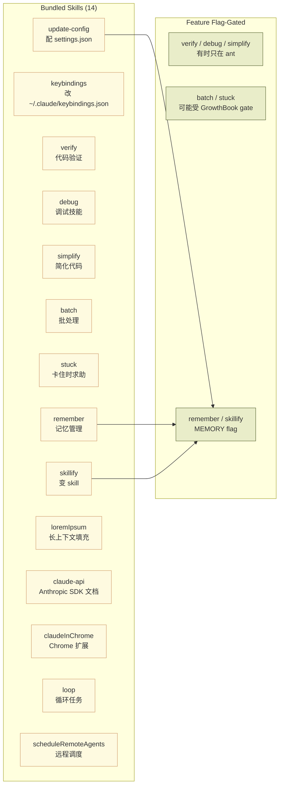
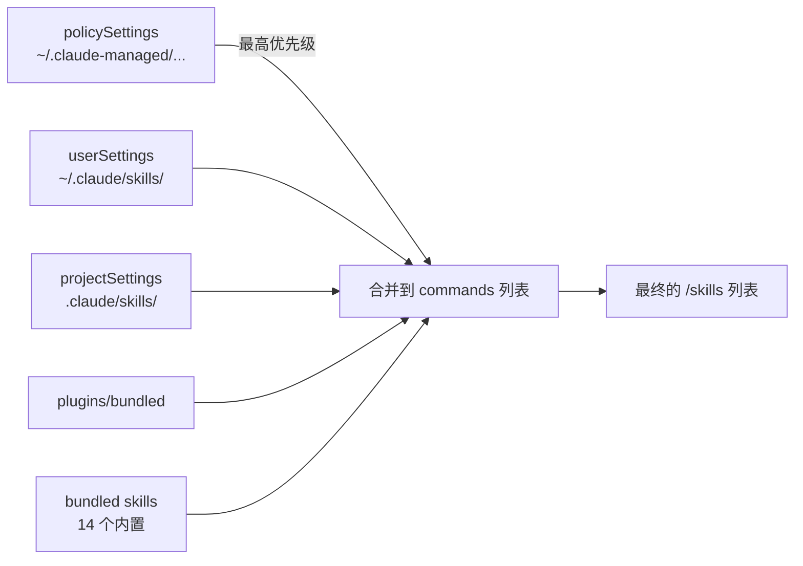

# 第 13b 章 Skills 系统(含 14 个 Bundled Skills)

> 用户视角理解 Claude Code Skills 的定义、来源与 14 个内置 Skill 全景。

## 摘要

**Skill 是 Claude Code 的"可复用工作流片段"**——比 slash command 更灵活,可以挂 hooks、改 model、限定 tools。本章覆盖:

1. **Skill 是什么**(`SKILL.md` + frontmatter)
2. **Bundled Skills 全景**(`src/skills/bundled/`):14 个内置 skill
3. **User/Project/Policy Skills** 三层
4. **加载与注册**(`loadSkillsDir.ts`、`bundledSkills.ts:113`)
5. **`/skills` UI**

读者画像:**想用好已有 skill 或写自定义 skill**。

## 速赢

| 想做这件事 | 看这里 |
|---|---|
| 列所有可用 skill | `/skills` |
| 自己写一个 | `.claude/skills/<name>/SKILL.md` |
| 改 skill 默认 model | frontmatter `model: opus` |
| 限制 skill 用什么工具 | frontmatter `allowedTools: [Read, Grep]` |
| 跑一次性的 skill | `/<skill-name> <args>` |
| 找 claude-api 文档 | `/claude-api`(bundled) |

## 关键图

### Bundled Skills 全景



## 详细机制

### 13b.1 Skill 的本质

Skill 在内部就是 **带元数据的 `Command`**(`src/skills/loadSkillsDir.ts:127-130`):

```ts
type SkillWithPath = {
  skill: Command
  filePath: string
}
```

而 `BundledSkillDefinition`(`src/skills/bundledSkills.ts:15-41`)的核心字段:

```ts
export type BundledSkillDefinition = {
  name: string                  // 必填,作为 / 命令名
  description: string
  aliases?: string[]
  whenToUse?: string
  argumentHint?: string
  allowedTools?: string[]
  model?: string                // 覆盖默认 model
  disableModelInvocation?: boolean
  userInvocable?: boolean       // 是否对用户可见
  isEnabled?: () => boolean     // 运行时 gate
  hooks?: HooksSettings         // skill 局部 hook!
  context?: 'inline' | 'fork'   // inline = 在主对话里 / fork = 新会话
  agent?: string                // 强制用某个 agent 类型
  files?: Record<string, string>  // 参考文件,自动解压到磁盘
  getPromptForCommand: (args, ctx) => Promise<ContentBlockParam[]>
}
```

### 13b.2 SKILL.md 与 Frontmatter

最常见的 skill 形式是 `SKILL.md`(YAML frontmatter + Markdown body):

```markdown
---
description: 分析代码并给出简化建议
allowedTools: ["Read", "Grep", "Glob"]
model: opus
hooks:
  PostToolUse:
    - matcher: "Read"
      hooks:
        - type: command
          command: "echo $TOOL_RESULT | wc -l"
---

# Simplify Skill

阅读以下代码并找出 3 个最值得简化的部分...
```

`parseSkillFrontmatterFields` 和 `parseHooksFromFrontmatter` 在 `src/skills/loadSkillsDir.ts` 里负责解析。

### 13b.3 14 个 Bundled Skills 全景

源码:`src/skills/bundled/`

#### 通用 productivity

| Skill | 命令 | 作用 |
|---|---|---|
| `update-config` | `/update-config [request]` | 改 `settings.json`(hook、permission、env)。**走 generateSettingsSchema() 拿最新 schema**,确保不漂移。 |
| `keybindings` | `/keybindings` | 改 `~/.claude/keybindings.json`,把键位/chord 解释给用户。 |
| `verify` | `/verify` | "真验证"——跑测试 + typecheck + 调查错误,不是橡皮图章。 |
| `debug` | `/debug` | 调试辅助:看日志、看 hook 执行。 |
| `simplify` | `/simplify` | 找代码中可简化的部分。 |
| `batch` | `/batch` | 批处理非延迟敏感任务。 |
| `stuck` | `/stuck` | "我卡住了,需要帮助"——触发专门诊断流程。 |

#### 记忆 / 知识

| Skill | 命令 | 作用 |
|---|---|---|
| `remember` | `/remember` | 显式触发记忆保存(配合 `MEMORY` feature)。 |
| `skillify` | `/skillify` | 把对话里的一段流程 **变成 SKILL.md**——自举利器。 |

#### 测试 / 填充

| Skill | 命令 | 作用 |
|---|---|---|
| `loremIpsum` | `/lorem-ipsum <count>` | 生成指定 token 数的 lorem ipsum,ant-only,`src/skills/bundled/loremIpsum.ts:234-282`。有 500k token 上限保护。 |
| `claude-api` | `/claude-api [request]` | Anthropic SDK / Claude API 完整文档。**247KB 文档**(`claudeApiContent.ts`),lazy-load(`claudeApi.ts:190`),语言自动检测。 |
| `claudeInChrome` | `/chrome` | Claude-in-Chrome 浏览器扩展集成。 |
| `loop` | `/loop` | 循环执行任务(`/loop <interval> <prompt>`)。 |
| `scheduleRemoteAgents` | `/schedule` | 调度远程 CCR agent。 |

#### 注册入口

每个 skill 有自己的 `registerXxxSkill()` 函数,在启动时(`setup.ts`)批量注册:

```ts
// src/setup.ts(伪代码)
registerUpdateConfigSkill();
registerKeybindingsSkill();
registerVerifySkill();
// ... 共 14 个
```

### 13b.4 三层来源



**优先级**:`policySettings > userSettings > projectSettings > flag > local`(高优先级覆盖低优先级同名 skill)。

### 13b.5 加载流程(`loadSkillsDir.ts`)

1. **`loadSkillsFromCommandsDir`**(`loadSkillsDir.ts:566`)—— 兼容老的 `commands/` 目录
2. **`loadSkillsFromSkillsDir`** —— 加载 `skills/<name>/SKILL.md`
3. 每个 skill 解析 frontmatter,挂 hooks,生成 `Command` 对象
4. **dedup** —— 同名 skill 高优先级覆盖低优先级

### 13b.6 注册测试 Hook

`bundledSkills.ts:113`:

```ts
/**
 * Clear bundled skills registry (for testing).
 */
export function clearBundledSkills(): void {
  bundledSkills.length = 0
}
```

> **注意**:生产代码不调用它,只测试 `beforeEach` 用。

### 13b.7 文件系统提取(files 字段)

BundledSkillDefinition 里的 `files` 字段会被 **运行时解压到磁盘**:

```ts
// bundledSkills.ts:53-73
if (files && Object.keys(files).length > 0) {
  skillRoot = getBundledSkillExtractDir(definition.name)
  let extractionPromise: Promise<string | null> | undefined
  const inner = definition.getPromptForCommand
  getPromptForCommand = async (args, ctx) => {
    extractionPromise ??= extractBundledSkillFiles(definition.name, files)
    const extractedDir = await extractionPromise
    const blocks = await inner(args, ctx)
    if (extractedDir === null) return blocks
    return prependBaseDir(blocks, extractedDir)
  }
}
```

**关键洞察**:`extractionPromise` 只启动一次,后续调用共享 promise(避免并发解压竞态)。

### 13b.8 Inline vs Fork

`context?: 'inline' | 'fork'`:

- **`inline`** —— skill 在主对话里跑(模型继续看上下文)
- **`fork`** —— skill 启动 **新会话**(clean context,适合独立任务如 `verify`)

默认值是 inline。**`fork` 的 skill 看不到主对话历史**——这一点和 `Agent(worker)` 类似,但更轻量(没有 spawn overhead)。

### 13b.9 与 Slash Command 的区别

| | Slash Command | Skill |
|---|---|---|
| 定义 | `.claude/commands/foo.md` | `.claude/skills/foo/SKILL.md` |
| 复杂度 | 单文件 prompt | prompt + frontmatter + files + hooks + agent |
| 触发 | `/foo` 或 `/foo <args>` | 同上 |
| 复用性 | 弱(只是个 prompt) | 强(可挂 hooks、改 model) |
| 文件夹 | 不支持 | 支持 `foo/` 多文件 |

## 反模式

1. **不要把 secrets 写在 SKILL.md 里** —— 它会被加载到 model 上下文,token 浪费且不安全。
2. **不要让 `context: 'fork'` 的 skill 假设它看得到主对话** —— 它是隔离的,需要把必要信息写在 prompt 里。
3. **不要在 skill 里写巨大 README** —— `files` 字段是 lazy 的;body 越短 cache 命中越高。
4. **不要给 `disableModelInvocation: true` 的 skill 设 `whenToUse`** —— 它只会用户手动触发,模型不知道。
5. **不要在 user-level skill 写 privileged 操作**(auto-allow bash) —— 用 policy settings。

## 引用

| 主题 | 文件 | 关键行 |
|---|---|---|
| BundledSkillDefinition 类型 | `src/skills/bundledSkills.ts` | 15-41 |
| 注册 API | `src/skills/bundledSkills.ts` | 53-100 |
| 测试 hook | `src/skills/bundledSkills.ts` | 113-115 |
| 加载目录 | `src/skills/loadSkillsDir.ts` | 78-94, 127-153, 566+ |
| update-config skill | `src/skills/bundled/updateConfig.ts` | 445-475 |
| lorem-ipsum skill | `src/skills/bundled/loremIpsum.ts` | 234-282 |
| claude-api skill | `src/skills/bundled/claudeApi.ts` | 1-195 |
| claude-in-chrome | `src/skills/bundled/claudeInChrome.ts` | |
| SkillsMenu UI | `src/components/skills/SkillsMenu.tsx` | 16-46 |
| Skills 命令 | `src/commands/skills/index.ts` | 3-9 |