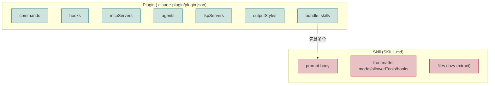
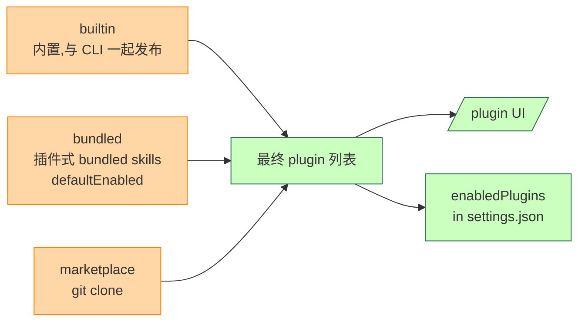
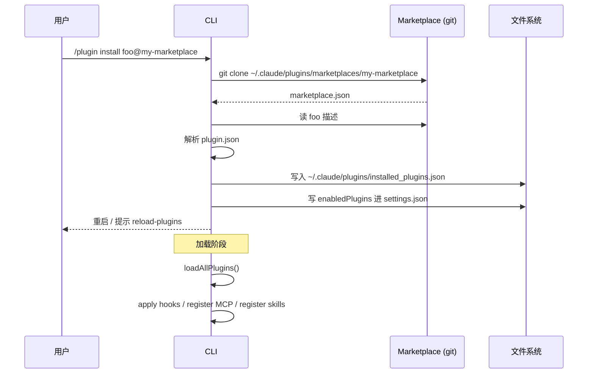
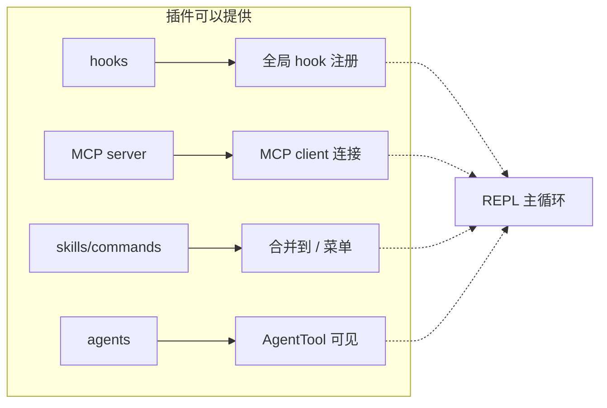

# 第 13c 章 Plugins 系统

> 用户视角理解 Plugin 与 Skill 的区别、Plugin 来源、Marketplace 与安装流程。

## 摘要

**Plugin 是比 Skill 更重的扩展单元**。Skill 只是一段可复用 prompt;Plugin 是 **完整扩展包**,可以包含 commands、skills、hooks、MCP servers、agents。本章覆盖:

1. **Plugin vs Skill**(关键区别)
2. **3 种 Plugin 来源**:`builtin` / `bundled` / `marketplace`
3. **Marketplace**(`marketplaceManager.ts`)
4. **启用**:`enabledPlugins` in settings.json
5. **内置 plugin**(`builtinPlugins.ts:23`)
6. **安装流程**

读者画像:**想用 marketplace 装 plugin,或者想发布自己的 plugin**。

## 速赢

| 想做这件事 | 看这里 |
|---|---|
| 列已装 plugin | `/plugin` |
| 加 marketplace | `/plugin marketplace add <url>` |
| 装 plugin | `/plugin install <name>@<marketplace>` |
| 启用 / 禁用 | `/plugin enable` / `disable` |
| 写自己的 plugin | `mkdir my-plugin &&` 创建 `.claude-plugin/plugin.json` |

## 关键图

### Plugin vs Skill 对比



## 详细机制

### 13c.1 关键区别

| 维度 | Skill | Plugin |
|---|---|---|
| 复杂度 | 单个 prompt | 完整扩展包 |
| 目录结构 | `skills/<name>/SKILL.md` | `<plugin>/.claude-plugin/plugin.json + 其他` |
| MCP server | 不直接支持 | **可以**(`mcpServers` 字段) |
| Hooks | 局部 hook | 全局 hook(`plugin.json` 配置) |
| 用户视角命令 | `/<skill-name>` | plugin 内的 command 出现在 `/` 菜单 |
| 来源 | disk-based + bundled | builtin + bundled + marketplace |

**一句话总结**:Skill 是 **可复用 prompt 片段**,Plugin 是 **可以打包 MCP server 的扩展**。

### 13c.2 三种来源



#### Builtin(`builtinPlugins.ts:23`)

```ts
// src/plugins/builtinPlugins.ts:23
export const BUILTIN_MARKETPLACE_NAME = 'builtin'
```

- 内置 plugin ID 永远以 `@builtin` 结尾
- 由 CLI 发布时捆绑
- 用户**可以禁用**(`enabledPlugins` 设为 false),但不能"删除"

**注册**(`builtinPlugins.ts:28-32`):

```ts
export function registerBuiltinPlugin(
  definition: BuiltinPluginDefinition,
): void {
  BUILTIN_PLUGINS.set(definition.name, definition)
}
```

**当前状态**(`bundled/index.ts:20-23`):

```ts
export function initBuiltinPlugins(): void {
  // No built-in plugins registered yet — this is the scaffolding for
  // migrating bundled skills that should be user-toggleable.
}
```

> 当前还没有 builtin plugin 注册——是预留脚手架。

#### Bundled

`bundled` 不是 builtin 的同义词——它指的是 **作为 plugin 形式打包但本质是 bundled skill** 的内容。见 `builtinPlugins.ts:144-148`:

```ts
// 'bundled' not 'builtin' — 'builtin' in Command.source means hardcoded
// slash commands (/help, /clear). Using 'bundled' keeps these skills in
// the Skill tool's listing, analytics name logging, and prompt-truncation
// exemption. The user-toggleable aspect is tracked on LoadedPlugin.isBuiltin.
source: 'bundled',
loadedFrom: 'bundled',
```

#### Marketplace(`marketplaceManager.ts`)

`src/utils/plugins/marketplaceManager.ts` 管理 marketplace。

- **Marketplace 本身**是一个 git 仓库(有 `marketplace.json`)
- **`git clone` 到本地**:`~/.claude/plugins/marketplaces/<name>/`
- **plugin 安装** = 在 marketplace 目录里找到 plugin 子目录,登记到 `installed_plugins.json`

### 13c.3 配置文件

#### `enabledPlugins`(settings.json)

```jsonc
{
  "enabledPlugins": {
    "code-review@anthropic-marketplace": true,
    "github@anthropic-marketplace": false,    // 装了但禁用
    "internal-tooling@builtin": true
  }
}
```

#### `extraKnownMarketplaces`(settings.json)

```jsonc
{
  "extraKnownMarketplaces": {
    "internal-tools": {
      "source": "github",
      "repo": "myorg/claude-plugins"
    }
  }
}
```

#### `installed_plugins.json`(`~/.claude/plugins/`)

```jsonc
{
  "version": 2,
  "plugins": {
    "code-review@anthropic-marketplace": [
      {
        "scope": "user",
        "installPath": "/Users/me/.claude/plugins/...",
        "version": "1.2.3",
        "installedAt": "2026-08-01T..."
      }
    ]
  }
}
```

**关键**:V2 格式(`InstalledPluginsFileV2`),从 V1 迁移时用 `migrateV1ToV2`(`installedPluginsManager.ts`)。

### 13c.4 安装流程



### 13c.5 plugin.json 格式

```jsonc
{
  "name": "code-review",
  "version": "1.0.0",
  "description": "Automated code review helpers",
  "author": {
    "name": "Anthropic",
    "email": "..."
  },
  "commands": "./commands",
  "hooks": "./hooks.json",
  "mcpServers": "./mcp.json",
  "lspServers": "./lsp.json",
  "agents": "./agents",
  "skills": "./skills"
}
```

`commands/agents/skills` 是 **目录**;`hooks/mcpServers/lspServers` 是 **文件**。

### 13c.6 作用域(scope)

`PluginScope`:

- `user` —— 全用户级,写到 `~/.claude/`
- `project` —— 仅本项目,写到 `.claude/`
- `local` —— 仅本机本项目,写到 `.claude/settings.local.json`
- `policy` —— 管理员强推,写到 managed settings
- `flag` —— 临时 `--plugin-dir` 加载(不持久化)

### 13c.7 与其他 system 的关系



### 13c.8 Marketplace.json

marketplace 自身也有 manifest:

```jsonc
{
  "name": "anthropic-marketplace",
  "owner": {
    "name": "Anthropic",
    "email": "..."
  },
  "plugins": [
    {
      "name": "code-review",
      "source": "./plugins/code-review",
      "description": "..."
    }
  ]
}
```

`marketplaceManager.ts:2238` 的 `getPluginById()` 用于查找。

### 13c.9 已知 pitfall

- **marketplace URL 改了就 break** —— `installed_plugins.json` 的 `installPath` 是绝对路径,搬迁后需要 re-install
- **plugin 升级不会自动迁移 settings** —— 用户手动重写 `enabledPlugins`
- **bundled plugin 不在 `installed_plugins.json` 里**(用 `LoadedPlugin.isBuiltin = true` 区分)
- **builtin plugin ID 永远带 `@builtin`**(`builtinPlugins.ts:38`),从 marketplace plugin 区分

## 反模式

1. **不要把 plugin 路径硬编码到 settings** —— 用 `installPath` 机制。
2. **不要在 plugin 里 include 大体积 binary** —— git clone 会很慢;plugin 是 metadata + scripts 的组合。
3. **不要假设 plugin 用户的 settings.json 包含特定 key** —— plugin 应该用 `getSettingsForSource` 拉取,不要 `fs.readFileSync`。
4. **不要在 plugin 里 spawn daemon** —— MCP server 已经是正确的进程边界,plugin 本身不该自己 fork。
5. **不要忘记把 `mcpServers` 标 `type`** —— `stdio` / `sse` / `http` / `ws` 必填。
6. **不要混淆 `bundled` 和 `builtin`** —— `builtin` 是 CLI 内置,`bundled` 是 plugin 形态的 skill 集。

## 引用

| 主题 | 文件 | 关键行 |
|---|---|---|
| 内置 plugin 注册 | `src/plugins/builtinPlugins.ts` | 23, 28-32, 57-102 |
| Builtin plugin init | `src/plugins/bundled/index.ts` | 20-23 |
| Marketplace 管理 | `src/utils/plugins/marketplaceManager.ts` | 2238 |
| 已装 plugin 元数据 | `src/utils/plugins/installedPluginsManager.ts` | 78-103, 115-182, 488-524 |
| Plugin 启动检查 | `src/utils/plugins/pluginStartupCheck.ts` | 39-72, 197-209 |
| Add-dir plugin 读取 | `src/utils/plugins/addDirPluginSettings.ts` | 34-48 |
| 验证 plugin manifest | `src/utils/plugins/validatePlugin.ts` | 24-49 |
| Plugin schema | `src/utils/plugins/schemas.ts` | 1482-1673 |
| Settings 中的 enabledPlugins | `src/utils/settings/types.ts` | 1104 |
| 类型定义 | `src/types/plugin.ts` | 18-48 |