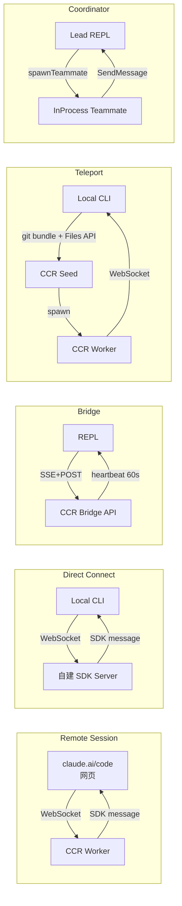
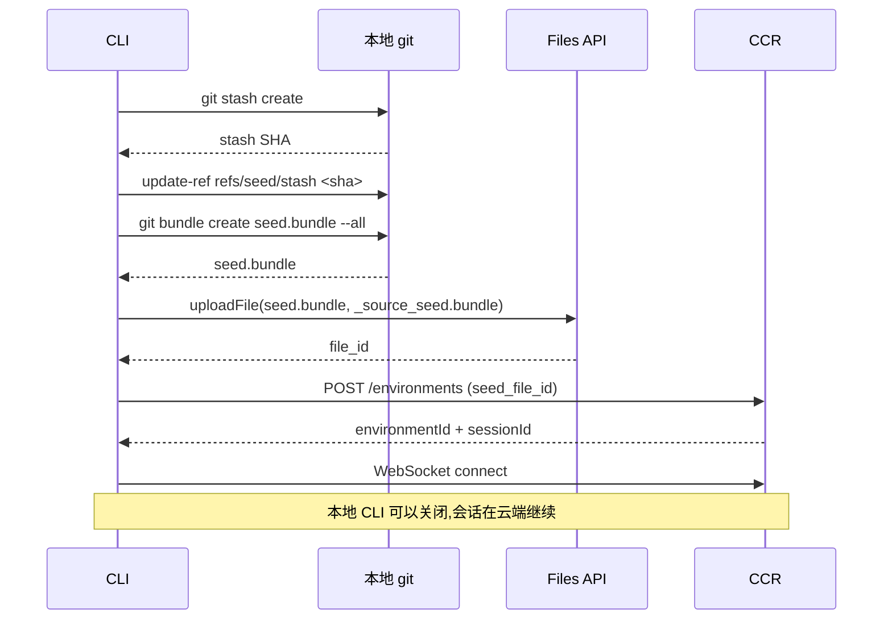
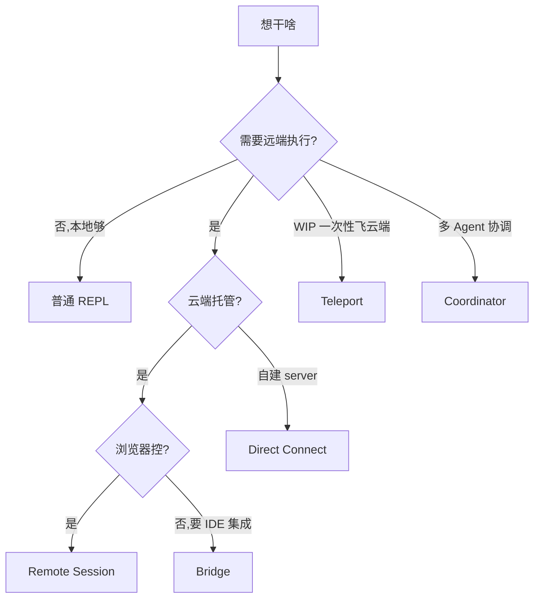

# 第 13d 章 Runtime Modes:5 种远程 / 拓扑模式详解

> 用户视角深度对比 Claude Code 的 5 种"远程执行"拓扑:Remote Session / Direct Connect / Bridge / Teleport / Coordinator。

## 摘要

**Claude Code 不止是本地 CLI**。同一份代码能在 5 种完全不同的"运行时拓扑"里跑,各自有完全不同的协议栈、故障模式和使用场景。本章是手册的 **核心对比章节**:

1. **Remote Session** —— 托管会话(claude.ai/code)
2. **Direct Connect** —— 用户自建 SDK server,本地连过去
3. **Bridge** —— IDE 反向通道
4. **Teleport** —— 打包 git bundle 飞到 claude.ai/code
5. **Coordinator** —— 多 Agent 协调

读者画像:**架构师 / 高级用户**,选错了拓扑常常是几小时调试时间的根源。

## 速赢

| 场景 | 用哪种 |
|---|---|
| 我想从浏览器控制 CLI | **Remote Session**(`/remote-session` 或 claude.ai/code) |
| 我有自建 SDK server | **Direct Connect**(`/connect <url>`) |
| 我用 VS Code / JetBrains | **Bridge**(自动,无需配置) |
| 我想把当前 WIP 丢给云端跑 | **Teleport**(`/teleport`) |
| 我想让多个 Agent 并行协调 | **Coordinator**(`COORDINATOR_MODE`) |

## 关键图

### 5 种拓扑对比表



### 5 种 Runtime Mode 总览表

| 维度 | Remote Session | Direct Connect | Bridge | Teleport | Coordinator |
|---|---|---|---|---|---|
| **核心文件** | `src/remote/RemoteSessionManager.ts` + `SessionsWebSocket.ts:82` | `src/server/directConnectManager.ts:50` | `src/bridge/replBridge.ts:119-125` | `src/utils/teleport/` + `commands/teleport/` | `src/coordinator/coordinatorMode.ts` |
| **协议** | WebSocket(双向)| WebSocket(双向)| SSE + POST + CCR | git bundle + Files API + WS | 进程内 mailbox |
| **触发** | claude.ai/code 启动 | `/connect <url>` 或 `--sdk-url` | 自动(BRIDGE feature) | `/teleport` | `CLAUDE_CODE_COORDINATOR_MODE=1` |
| **本地进程** | 否(纯云端)| 是(本地 CLI + 远端 SDK)| 是(本地 REPL)| 一时,seed 上传后退出 | 是(lead + teammate) |
| **状态持久** | 服务端 | 服务端 | 服务端 + 本地 settings | 服务端 + git bundle | 进程内存 |
| **OAuth 来源** | claude.ai 登录态 | 用户自配(server 自定)| claude.ai OAuth | claude.ai OAuth | 跟随主进程 |
| **超时控制** | WebSocket ping | WebSocket ping | work-poll 10s / heartbeat 60s / lease 300s | git bundle max bytes | n/a(同进程)|
| **断线行为** | 重连 + 重订阅事件 | 重连 | BRIDGE_FAILURE_DISMISS_MS 10s 后熔断 | 不适用(单向 seed)| 不适用 |
| **并发模型** | 单 session | 单 session | 单 session | 单 session | **多 worker(lead + teammates)** |
| **用户场景** | 浏览器远控 | 自托管部署 | IDE 集成 | 推送 WIP 到云端 | 多 Agent 协调 |
| **feature flag** | 默认开 | 默认开 | `BRIDGE` | 默认开 | `COORDINATOR_MODE` (ant) |
| **故障排查难度** | 中 | 高(自建 server)| 中 | 中 | 低 |

## 详细机制

### 13d.1 Remote Session(托管会话)

#### 核心组件

- **`RemoteSessionManager`**(`src/remote/RemoteSessionManager.ts:95`)—— 持有 WebSocket + pending permission requests
- **`SessionsWebSocket`**(`src/remote/SessionsWebSocket.ts:82`)—— 底层 WS 客户端,带 `onConnected / onClose / onReconnecting / onError`
- **`sdkMessageAdapter`**(`src/remote/sdkMessageAdapter.ts`)—— 把 server SDK message 适配到本地

#### 协议

```
Local CLI                          CCR (claude.ai)
   | --WS connect (session_id) --->
   |                                [订阅 session events]
   |<----- SDK messages -----------  (model output, tool_use, ...)
   | --WS ping (30s) ------------->
   |<----- WS pong ----------------
   | --sendMessage (HTTP POST) ---->  (用户输入)
   | <--- control_request (WS) ---  (permission prompt from CCR)
   | --control_response (WS) ----->  (allow/deny)
```

**关键代码**(`RemoteSessionManager.ts:108-141`):

```ts
connect(): void {
  this.websocket = new SessionsWebSocket(
    this.config.sessionId,
    this.config.orgUuid,
    this.config.getAccessToken,
    wsCallbacks,
  )
  void this.websocket.connect()
}
```

#### 用户故事

Alice 在 claude.ai/code 上启动会话 → 在家电脑上的 CLI 自动连接 → 同一个会话可以从两边控制。

#### 故障排查

| 现象 | 排查方向 |
|---|---|
| WS 反复重连 | 看 `onReconnecting` 日志,检查 `orgUuid` 是否对 |
| 权限请求收不到 | `onPermissionRequest` 没注册 |
| 消息不同步 | `sdkMessageAdapter` 版本不匹配(server 端) |

### 13d.2 Direct Connect(自建 SDK)

#### 核心组件

- **`DirectConnectSessionManager`**(`src/server/directConnectManager.ts:50`)
- **`createDirectConnectSession`**(`src/server/createDirectConnectSession.ts`)
- **`useDirectConnect`**(hook)

#### 协议

同 Remote Session(WebSocket),但 **server 是用户自己跑**:

```bash
# Server 端
node my-sdk-server.js --port 8080
# Client 端
claude --sdk-url ws://my-server:8080/sessions/abc
# 或交互式
/connect ws://my-server:8080/sessions/abc
```

#### 用户故事

公司内部有 SDK wrapper(封装内部工具),开发者在本地 CLI 连过去,所有请求走自家 server。

#### 故障排查

| 现象 | 排查方向 |
|---|---|
| 握手失败 | server `Sec-WebSocket-Protocol` 处理 |
| 消息乱序 | server 没按 SDK message schema 序列化 |
| 权限 prompt 卡住 | server 不识别 `control_request` |

### 13d.3 Bridge(IDE 反向通道)

详见 **12-ide-bridge.md**。这里对比角度提一下:

#### 与 Remote Session 的关键区别

| | Remote Session | Bridge |
|---|---|---|
| 协议 | WS 单连接 | SSE + POST + CCR |
| 角色 | CLI ↔ 云端 | CLI ↔ IDE 扩展(再上 claude.ai) |
| 心跳 | WS ping | `POST /heartbeat` 每 60s |
| 超时模型 | ping/pong | work-poll 10s / lease 300s |
| 失败兜底 | 重连 | `BRIDGE_FAILURE_DISMISS_MS` 熔断 |

#### 何时用 Bridge

- IDE 集成(VS Code / JetBrains 扩展)
- Assistant Mode(`feature('KAIROS')`)—— perpetual,复用 environmentId

### 13d.4 Teleport(打包 + 飞 + 启动)

> 这是 "我本地 WIP,丢给云端跑" 的工具。

#### 三步流程



#### 关键文件

- **`src/utils/teleport/gitBundle.ts`**(`createAndUploadGitBundle`,line 152)—— 核心打包上传
- **`src/utils/teleport/api.ts`** —— 调用 Files API
- **`src/utils/teleport/environments.ts`** —— 创建 environment
- **`src/utils/teleport/environmentSelection.ts`** —— 让用户选 org/project
- **`src/commands/teleport/index.js`** —— `/teleport` 命令入口

#### `git bundle create --all` 的三段式 fallback

`gitBundle.ts:225` 的 `_bundleWithFallback` 实现:

1. `--all` —— 包含所有 refs
2. `HEAD` —— 只当前 commit
3. `squashed-root` —— 没有 commit 时建空 squashed root

**前置检查**(`gitBundle.ts:174-189`):

```ts
const refCheck = await execFileNoThrowWithCwd(
  gitExe(), ['for-each-ref', '--count=1', 'refs/'], { cwd: gitRoot },
)
if (refCheck.code === 0 && refCheck.stdout.trim() === '') {
  return { success: false, error: 'Repository has no commits yet',
           failReason: 'empty_repo' }
}
```

**WIP capture**(`gitBundle.ts:193-213`):`stash create` → `refs/seed/stash`,退出码非 0 时继续(非致命)。

#### 用户故事

Bob 在飞机上写代码,落地后想丢给云端跑(网络更稳 / 模型更强)。运行 `/teleport` → git bundle 飞到 CCR → 新会话在 claude.ai 上跑起来 → 本地 CLI 可以关。

#### 失败模式

| 错误 | 原因 |
|---|---|
| `Not in a git repository` | cwd 不在 git 仓库 |
| `Repository has no commits yet` | 空 repo |
| `failed` | upload / API 失败 |
| `max_bytes` | bundle 超过 `tengu_ccr_bundle_max_bytes`(默认 50MB) |

### 13d.5 Coordinator(多 Agent 协调)

详见 **11-multi-agent.md**。这里从拓扑角度对比:

#### 与其他模式的本质区别

| | 其他模式 | Coordinator |
|---|---|---|
| 主体 | 单 agent / 单 worker | lead + N teammate |
| 通信 | 网络协议 | 进程内 mailbox |
| 并发 | 顺序 / 后台 | **真并行**(worker fan-out)|
| 状态 | 服务端 | 进程内存 + scratchpad |

#### 关键差异

- **不需要网络** —— teammate 在同一进程,通过 `AsyncLocalStorage` 拿 agentName
- **scratchpad directory** —— 多 worker 共享的"草稿区",无需权限
- **`getCoordinatorUserContext` 注入** —— 把"worker 能用什么工具"告诉 lead

### 13d.6 何时用哪种(决策树)



### 13d.7 故障排查差异

| 模式 | 最常见故障 | 排查命令 |
|---|---|---|
| Remote Session | WS 鉴权失败 | `claude --debug [remote]` |
| Direct Connect | server SDK schema 不匹配 | server 日志 |
| Bridge | OAuth 401 风暴 | `claude --debug [bridge:repl]` |
| Teleport | git bundle 超大 / 空 repo | `claude --debug [teleport]` |
| Coordinator | teammate spawn 失败 / mailbox 满 | `claude --debug [swarm]` |

## 反模式

1. **不要用 Remote Session 做"本地 IDE 集成"** —— 该用 Bridge。
2. **不要用 Teleport 跑长期任务** —— Teleport 是 seed,跑完就结束了;要长期跑用 Remote Session。
3. **不要在 Direct Connect 里让 server 阻塞** —— server 端必须异步处理 SDK message。
4. **不要在 Bridge 里手动调 OAuth refresh** —— `useReplBridge` 的 `MAX_CONSECUTIVE_INIT_FAILURES` 会让你陷入 401 风暴。
5. **不要把 Coordinator 用于串行任务** —— Lead + teammate 有 spawn 开销,小任务直接 subagent。
6. **不要混用 Bridge 和 Remote Session** —— 同一会话同时被两端控制会冲突。

## 引用

| 主题 | 文件 | 关键行 |
|---|---|---|
| Remote Session 主体 | `src/remote/RemoteSessionManager.ts` | 95, 108-141 |
| SessionsWebSocket | `src/remote/SessionsWebSocket.ts` | 40-65, 82-100 |
| Direct Connect 管理 | `src/server/directConnectManager.ts` | 50 |
| Direct Connect 入口 | `src/server/createDirectConnectSession.ts` | |
| Bridge 核心 | `src/bridge/replBridge.ts` | 119-125, 260 |
| Bridge 入口 | `src/bridge/initReplBridge.ts` | 110, 135-241 |
| Teleport git bundle | `src/utils/teleport/gitBundle.ts` | 152-292 |
| Teleport API | `src/utils/teleport/api.ts` | |
| Teleport environments | `src/utils/teleport/environments.ts` | |
| Teleport 命令 | `src/commands/teleport/index.js` | |
| Files API 客户端 | `src/services/api/filesApi.ts` | 57-67 |
| Coordinator 模式 | `src/coordinator/coordinatorMode.ts` | 36-109, 116-369 |
| SDK 消息适配 | `src/remote/sdkMessageAdapter.ts` | |