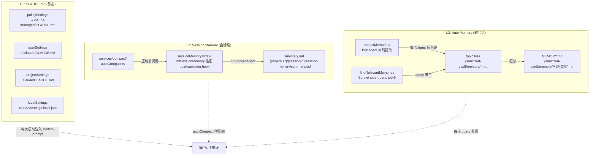
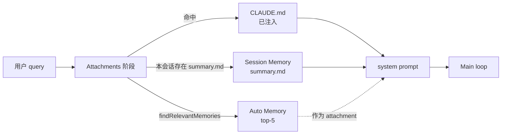

# 第 14 章 持久记忆系统(扩展 08b-claudemd)

> 用户视角解析 Claude Code 的 **3 层记忆体系**:CLAUDE.md / Session Memory / Auto Memory。

## 摘要

Claude Code 不是一个"无状态"的 CLI——它有 **3 层独立的持久记忆**。本章把这 3 层讲透:

1. **CLAUDE.md**(静态记忆)—— `08b-claudemd.md` 已覆盖,此处简短引用
2. **Session Memory**(`src/services/SessionMemory/`)—— 自动压缩时生成的 `summary.md`
3. **Auto Memory**(`src/memdir/` + `services/extractMemories/`)—— 后台从对话里挖出来的"事实"

读者画像:**想让 Claude 真正"记住"项目的用户**。

## 速赢

| 想做这件事 | 用这个 |
|---|---|
| 写项目规则 / 偏好 | `CLAUDE.md` |
| 让压缩后保留关键信息 | Session Memory(`autoCompact` 自动触发) |
| 让 Claude 自动发现"事实" | Auto Memory(`autoMemoryEnabled`) |
| 关闭 Session Memory | `DISABLE_AUTO_COMPACT=1` 或 `settings.json: autoCompactEnabled: false` |
| 关闭 Auto Memory | settings: `autoMemoryEnabled: false` |
| 调整 Session Memory 配置 | remote(`/memory` UI 或 settings) |

## 关键图

### 3 层记忆体系



## 详细机制

### 14.1 CLAUDE.md(静态记忆)

详见 `08b-claudemd.md`。本章只点出关键点:

- **4 层 source**:`policySettings > userSettings > projectSettings > localSettings`
- **每次启动** 注入到 system prompt 的开头
- **优先级高的覆盖低的**
- **team memory**(ant-only,`feature('TEAMMEM')`):team-wide CLAUDE.md 共享

### 14.2 Session Memory(会话级)

#### 概念

每次 `/compact` 或自动压缩时,生成一个 `summary.md` 描述本次会话的关键状态。下次在同一 session 启动时,**先读 summary.md 再读消息历史**——这样老的 compact summary 能延续。

#### 文件位置

`src/utils/permissions/filesystem.ts:261-271`:

```ts
export function getSessionMemoryDir(): string {
  return join(getProjectDir(getCwd()), getSessionId(), 'session-memory') + sep
}

export function getSessionMemoryPath(): string {
  return join(getSessionMemoryDir(), 'summary.md')
}
```

**格式**:`{projectDir}/{sessionId}/session-memory/summary.md`

#### 初始化

`src/services/SessionMemory/sessionMemory.ts:357`:

```ts
export function initSessionMemory(): void {
  if (getIsRemoteMode()) return
  // Session memory is used for compaction, so respect auto-compact settings
  const autoCompactEnabled = isAutoCompactEnabled()
  ...
  if (!autoCompactEnabled) {
    return
  }
  // Register hook unconditionally - gate check happens lazily when hook runs
  registerPostSamplingHook(extractSessionMemory)
}
```

在 `src/setup.ts` 启动时调用。

#### 提取流程

`sessionMemory.ts:272-350` 的 `extractSessionMemory`(wrapped in `sequential`):

1. **Gate check**:`isSessionMemoryGateEnabled()`(GrowthBook flag)
2. **shouldExtractMemory**:检查消息数 / token / 时间
3. **markExtractionStarted**
4. **setupSessionMemoryFile**:准备隔离上下文
5. **buildSessionMemoryUpdatePrompt**:生成 "update this summary" prompt
6. **runForkedAgent**:用 fork agent 改写 `summary.md`(隔离上下文,不污染主对话)
7. **recordExtractionTokenCount**(记录下次阈值)
8. **updateLastSummarizedMessageIdIfSafe**

**关键洞察**:用 **fork agent** 而不是主对话——既隔离上下文,又利用 prompt caching(`createCacheSafeParams`)。

#### 触发时机

`src/services/compact/autoCompact.ts:241-310` 的 `autoCompactIfNeeded`:

1. **`shouldAutoCompact`** 检查阈值(token 数 / `effectiveWindow`)
2. **优先** 尝试 Session Memory Compact(`trySessionMemoryCompaction`)
3. **失败/不可用** 才走传统 `compactConversation`

#### Session Memory vs 传统 Compact

| 维度 | Session Memory | 传统 Compact |
|---|---|---|
| 输出 | 增量更新 `summary.md` | 替换整个 messages |
| 保留粒度 | 滚动 summary(全历史) | 只保留最近 N 轮 |
| 上下文 | fork agent | fork agent |
| Cache 复用 | 高(增量更新)| 低(完全替换)|
| 适合 | 长会话连续性 | 短会话一次性 |

### 14.3 Auto Memory(跨会话,事实级)

> 这是 Claude Code **最强的记忆特性**——它会自己"挖掘"对话里值得记住的事实。

#### 文件位置

`<sanitized-cwd>/memory/`:

- `MEMORY.md` —— 索引文件,列出所有 topic memory + 简介
- `<topic>.md` —— 每个事实/主题一个文件

`sanitized-cwd` = 把 `/Users/foo/proj` 变成 `_Users_foo_proj`(防路径泄露)。

#### 提取(extractMemories)

`src/services/extractMemories/extractMemories.ts:296` 的 `initExtractMemories()`:

1. **gate check**:`getFeatureValue_CACHED_MAY_BE_STALE('tengu_passport_quail', false)`
2. **`isAutoMemoryEnabled`** —— settings.json 开关
3. **跳过远程模式**:`getIsRemoteMode()`(远程不挖)
4. **节流**:`tengu_bramble_lintel`(默认每 N=1 turns 跑一次)
5. **`runExtraction`**:
   - **`runForkedAgent`** 用 `querySource: 'extract_memories'` fork 出 worker
   - **`maxTurns: 5`** —— 硬上限,防止 verification rabbit-holes
   - 提示词来自 `prompts.ts` 的 `buildExtractAutoOnlyPrompt`
   - worker 自己 **写文件** 到 `memory/`
6. **cursor 推进**:`lastMemoryMessageUuid` 只前移,避免重复处理

**关键设计**:

```ts
// extractMemories.ts:557-564
if (inProgress) {
  // If an extraction is already in progress, stash this context for a
  // trailing run (overwrites any previously stashed context — only the
  // latest matters since it has the most messages).
  pendingContext = { context, appendSystemMessage }
  return
}
```

**避免并发跑**:进行中的 extraction 会把新 context 缓存,等当前跑完再跑一次 trailing(用最新 context)。

#### 召回(`findRelevantMemories`)

`src/memdir/findRelevantMemories.ts:39`:

```ts
export async function findRelevantMemories(
  query: string,
  memoryDir: string,
  signal: AbortSignal,
  recentTools: readonly string[] = [],
  alreadySurfaced: ReadonlySet<string> = new Set(),
): Promise<RelevantMemory[]>
```

**流程**:

1. `scanMemoryFiles(memoryDir, signal)` —— 扫 `memory/` 下所有 .md 读 frontmatter
2. **side-query 到 Sonnet**(`selectRelevantMemories`,`findRelevantMemories.ts:77-141`):
   - system prompt 让 Sonnet 选 top-5
   - **过滤已展示的**(`alreadySurfaced`)
   - **过滤最近用过的工具的参考文档**(避免噪音)
3. **返回** `{path, mtimeMs}` 给主循环

`SELECT_MEMORIES_SYSTEM_PROMPT` 的关键点(`findRelevantMemories.ts:18-24`):

```
Only include memories that you are certain will be helpful
If you are unsure, do not include
Recently-used tools → skip reference docs, but KEEP gotchas/warnings
```

**为什么用 Sonnet side-query**:Sonnet 选 memory 比 main loop 模型(可能 Opus)便宜,而且 selector 模型也希望选得保守——这就避开了"过拟合到当前 query 的所有 memory"。

#### 注入到主循环

`findRelevantMemories` 的结果通过 `getRelevantMemoryAttachments`(`src/utils/attachments.ts`)传到主循环。 主模型在 system prompt 里看到 "Relevant memories attached" 提示,然后用 `Read` 工具按需读取。

**`alreadySurfaced` 跨轮维护**:避免重复塞同一批 memory,给 selector 腾出 top-5 预算。

### 14.4 切换:UI 与 settings

#### `/memory` UI

`/memory` 打开记忆管理菜单(`src/commands/memory.ts`,具体名以实际代码为准)。可以:

- 看当前 Session Memory 的 `summary.md`
- 切换 `autoMemoryEnabled` / `autoDreamEnabled`
- 看 Auto Memory 文件列表
- 强制 `/extract-memories` 立即跑一次

#### settings.json 字段

```jsonc
{
  "autoCompactEnabled": true,         // 默认 true;false → 不自动 compact,Session Memory 不跑
  "autoMemoryEnabled": true,          // 默认看 gate;Auto Memory 提取
  "autoDreamEnabled": false,          // 实验性,Dream task 后台跑
  "sessionMemory": {
    "minimumMessageTokensToInit": 10000,
    "minimumTokensBetweenUpdate": 5000,
    "toolCallsBetweenUpdates": 10
  }
}
```

`sessionMemory` 配置可在 `getSessionMemoryConfig()` 里读到(`sessionMemoryUtils.ts:18`)。

### 14.5 3 层之间的关系



**关键**:**3 层互相独立**:

- CLAUDE.md 改了立即生效
- Session Memory 是 session 内的"压缩后保留"
- Auto Memory 是跨 session 的"事实库"

### 14.6 何时用哪层

| 需求 | 用哪层 |
|---|---|
| 强制遵守项目规则 | CLAUDE.md |
| 不让长会话丢失上下文 | Session Memory |
| 反复出现的事实(API quirk / team 约定) | Auto Memory |
| 一次性的对话上下文 | 不需要任何记忆 |
| 团队的共享规则 | team CLAUDE.md(`TEAMMEM`) |

### 14.7 Team Memory(`feature('TEAMMEM')`)

`src/memdir/teamMemPaths.ts` 管理 team 级 memory:

- **路径**:`{sanitized-cwd}/.claude/team-memory/`
- **同步**:通过 git push/pull 团队成员共享
- **prompt**:用 `buildExtractCombinedPrompt` 同时提取 auto + team
- **计数**:在 `extractMemories.ts:468-470` 区分 team / auto memory

## 反模式

1. **不要把"项目规则"放进 Auto Memory** —— 应该 CLAUDE.md。Auto Memory 是 Claude 自动发现的,放规则会污染。
2. **不要关 Session Memory 但开着 Auto Memory** —— Auto Memory 可能在压缩时丢上下文。
3. **不要把 secrets 写到任何 memory 文件** —— memory 会被发到 server side query(Sonnet)。
4. **不要假设 Auto Memory 100% 准确** —— 它是 "best-effort",关键决策自己 review。
5. **不要在 3 个层级里写重复信息** —— 改起来要改三遍,容易 drift。
6. **不要把 `summary.md` 手工编辑** —— 会被下一次 autoCompact 覆盖。

## 引用

| 主题 | 文件 | 关键行 |
|---|---|---|
| Session Memory 初始化 | `src/services/SessionMemory/sessionMemory.ts` | 272-350, 357 |
| Session Memory 配置 | `src/services/SessionMemory/sessionMemoryUtils.ts` | 18-39 |
| Auto Compact 触发 | `src/services/compact/autoCompact.ts` | 147-239, 241-351 |
| SM Compact 实现 | `src/services/compact/sessionMemoryCompact.ts` | 47-86, 514 |
| Auto Memory 提取 | `src/services/extractMemories/extractMemories.ts` | 296-588 |
| 提取 prompt | `src/services/extractMemories/prompts.ts` | |
| 召回 selector | `src/memdir/findRelevantMemories.ts` | 18-24, 39-141 |
| 扫描文件 | `src/memdir/memoryScan.ts` | |
| 记忆路径 | `src/memdir/paths.ts` | |
| Team memory | `src/memdir/teamMemPaths.ts` | |
| 启动注册 | `src/setup.ts` | (initExtractMemories / initSessionMemory) |
| 注入 attachment | `src/utils/attachments.ts` | (getRelevantMemoryAttachments) |
| 路径权限 | `src/utils/permissions/filesystem.ts` | 261-278 |