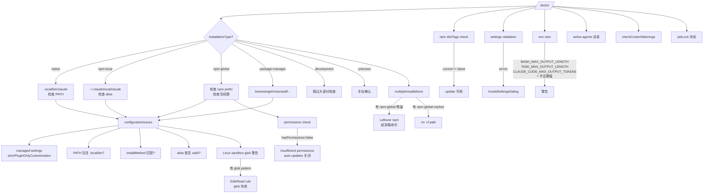

# 第 15 章 故障排查:`/doctor` 与常见错误

> 用户视角的"修 bug 第一站"——从 `/doctor` 命令到各类错误对话框。

## 摘要

CLI 出问题,90% 的答案在 `/doctor` 里。本章覆盖:

1. **`/doctor` 命令详解**(`getDoctorDiagnostic`,`utils/doctorDiagnostic.ts:514`)
2. **10+ 诊断项**:installation / version / path / multiple / warnings / permissions / distTags / validation / env / agents / context / pidLock
3. **常见错误对话框**:`InvalidSettingsDialog` / `BypassPermissionsModeDialog` / `AutoModeOptInDialog` / `McpParsingWarnings` / `FallbackToolUseErrorMessage` / `ChannelDowngradeDialog` / `KeybindingWarnings` ...
4. **调试开关**:`--debug [filter]` / `--debug-to-stderr` / `--debug-file` / `--hard-fail`
5. **配置文件位置速查**

读者画像:**遇到任何"奇怪的" CLI 行为,需要系统化排查**。

## 速赢

| 想做这件事 | 用这个 |
|---|---|
| 看安装 / 配置健康 | `/doctor` |
| 看诊断 JSON | `claude doctor --json` |
| 单类调试日志 | `claude --debug [bridge:repl]` |
| 把日志写到 stderr | `claude --debug-to-stderr` |
| 写到文件 | `claude --debug-file /tmp/claude.log` |
| 失败立即退出 | `claude --hard-fail` |
| 校验 settings | 启动时的 `InvalidSettingsDialog` |
| 看多个 Claude 装在哪 | `/doctor` 多处 |
| 升级 / 重装 | `claude update` / `claude install` |

## 关键图

### `/doctor` 决策树



## 详细机制

### 15.1 `/doctor` 命令详解

#### 主入口

`src/utils/doctorDiagnostic.ts:514` 的 `getDoctorDiagnostic()`:

```ts
export async function getDoctorDiagnostic(): Promise<DiagnosticInfo>
```

返回结构(`doctorDiagnostic.ts:54-71`):

```ts
export type DiagnosticInfo = {
  installationType: InstallationType       // native | npm-global | npm-local | package-manager | development | unknown
  version: string                          // MACRO.VERSION
  installationPath: string
  invokedBinary: string
  configInstallMethod: InstallMethod | 'not set'
  autoUpdates: string                      // 'enabled' | 'disabled (reason)'
  hasUpdatePermissions: boolean | null
  multipleInstallations: Array<{ type: string; path: string }>
  warnings: Array<{ issue: string; fix: string }>
  recommendation?: string
  packageManager?: string                  // brew/winget/mise/asdf/pacman/deb/rpm/apk
  ripgrepStatus: {
    working: boolean
    mode: 'system' | 'builtin' | 'embedded'
    systemPath: string | null
  }
}
```

#### 安装类型识别

`getCurrentInstallationType()`(`doctorDiagnostic.ts:86-148`):

```
isInBundledMode?
  ├─ brew / winget / mise / asdf / pacman / deb / rpm / apk → 'package-manager'
  └─ 否则 → 'native'
isRunningFromLocalInstallation?
  └─ ~/.claude/local → 'npm-local'
isInStandardNpmGlobalPath? (/usr/local/lib/node_modules 等)
  └─ → 'npm-global'
fallback: 'unknown'
```

**关键检测**:`doctorDiagnostic.ts:131`:

```ts
if (invokedPath.includes('/npm/') || invokedPath.includes('/nvm/')) {
  return 'npm-global'
}
```

#### 多安装检测

`detectMultipleInstallations()`(`doctorDiagnostic.ts:205-315`):

- **npm-local**:`~/.claude/local`(本地安装)
- **npm-global**:通过 `npm -g config get prefix` 找
- **npm-global-orphan**:`node_modules/<pkg>` 存在但 `bin/claude` 不存在
- **native**:`~/.local/bin/claude`

**重复装会报警告**(在 native 上跑的全局 npm 残留):

```ts
// doctorDiagnostic.ts:538-566
if (installationType === 'native') {
  const npmInstalls = multipleInstallations.filter(...)
  for (const install of npmInstalls) {
    if (install.type === 'npm-global') {
      warnings.push({
        issue: `Leftover npm global installation at ${install.path}`,
        fix: `Run: ${uninstallCmd}`,  // npm -g uninstall @anthropic-ai/claude-code
      })
    } else if (install.type === 'npm-global-orphan') {
      warnings.push({
        issue: `Orphaned npm global package at ${install.path}`,
        fix: `Run: rm -rf ${install.path}`,
      })
    }
  }
}
```

#### 警告分类(`detectConfigurationIssues`)

`doctorDiagnostic.ts:317-485` 检查:

1. **managed-settings**:`strictPluginOnlyCustomization` 类型错(doctorDiagnostic.ts:328-364)
2. **PATH 包含 `~/.local/bin`**(native)
3. **`installMethod` 与实际类型不一致**
4. **alias 有效但指向错误目标**
5. **local 安装但不在 PATH 也没 alias**

#### Linux 沙盒 Glob 警告

`detectLinuxGlobPatternWarnings()`(`doctorDiagnostic.ts:487-512`):

```ts
if (getPlatform() !== 'linux') return []
const globPatterns = SandboxManager.getLinuxGlobPatternWarnings()
if (globPatterns.length > 0) {
  warnings.push({
    issue: `Glob patterns in sandbox permission rules are not fully supported on Linux`,
    fix: `Found ${globPatterns.length} pattern(s): ${displayPatterns}. On Linux, glob patterns in Edit/Read rules will be ignored.`,
  })
}
```

**坑**:Linux 下 Edit/Read 规则的 glob 模式 **不会生效**——这是已知限制。

#### 权限检查(npm-global)

`checkGlobalInstallPermissions()`(`doctorDiagnostic.ts:575-585`):

```ts
if (installationType === 'npm-global') {
  const permCheck = await checkGlobalInstallPermissions()
  hasUpdatePermissions = permCheck.hasPermissions
  if (!hasUpdatePermissions && !getAutoUpdaterDisabledReason()) {
    warnings.push({
      issue: 'Insufficient permissions for auto-updates',
      fix: 'Do one of: (1) Re-install node without sudo, or (2) Use `claude install` for native installation',
    })
  }
}
```

#### 上下文风险(`doctorContextWarnings.ts`)

`src/utils/doctorContextWarnings.ts:36` 的 `ContextWarnings`:

- 检查当前 session 的 token 用量
- 看是否接近 context window 上限
- 提示用户 /compact 或 /clear

### 15.2 npm distTags 检查

`src/utils/npmDistTags.ts`(可能存在):

- `current` —— 当前渠道
- `latest` —— 默认渠道
- `stable` —— 稳定渠道(部分项目)

`/doctor` 显示三者的版本号,如果 `current` 落后 `latest` 就提示升级。

### 15.3 Active Agents / Agents 目录

`/doctor` 检查 `~/.claude/agents/`(user-level)与 `.claude/agents/`(project-level):

- **数量过多**(> 50)警告 —— 性能影响
- **格式错误** —— Yaml 解析失败
- **重复定义** —— 同名 agent 覆盖

### 15.4 调试开关

#### `--debug [filter]`

```bash
claude --debug                    # 全部 debug
claude --debug [bridge:repl]      # 只看 bridge
claude --debug [mcp,bridge]       # 多个 filter
```

**filter 语法**:模块前缀匹配,`[bridge:repl]` 命中所有 `bridge:repl:*` 日志。

**实现**:`src/utils/debug.ts:104` 的 `shouldLogDebugMessage()`:

```ts
export function shouldLogDebugMessage(category: string, level: DebugLevel): boolean {
  if (getMinDebugLogLevel() > level) return false
  if (debugFilter === null) return true
  return category.includes(debugFilter)
}
```

#### `--debug-to-stderr`

debug 日志默认写文件 `~/.claude/debug/<date>.log`,这个 flag 改成 stderr。

#### `--debug-file <path>`

自定义日志文件路径。**注意**:不会自动 rotate。

#### `--hard-fail`

`isHardFailMode()`(`src/utils/debug.ts`):开了以后,**任何 `logError()` 调用都会 `process.exit(1)`**。 适合 CI / 测试。

```ts
// 伪代码
if (isHardFailMode() && level >= 'error') {
  process.exit(1)
}
```

### 15.5 常见错误对话框

#### `InvalidSettingsDialog` + `ValidationErrorsList`

`settings.json` 校验失败时(`src/utils/settings/validation.ts:48` 的 `ValidationError`):

```ts
type ValidationError = {
  path: string       // JSON path, e.g. "mcpServers.github.type"
  message: string
  code?: string
  configScope?: ConfigScope
}
```

**触发场景**:

- JSON 语法错
- Schema 不匹配(字段类型错)
- 必填字段缺失
- enum 值不在允许列表

**用户操作**:"Edit settings" 按钮 → 打开 settings.json 跳到错行 → 修正后重启。

#### `BypassPermissionsModeDialog`

**警告**(不是错误):用户切到 `--dangerously-skip-permissions` 时弹出。强调:

- 跳过所有 permission 检查
- 任何 prompt 都自动 allow
- 仅在 sandboxed environment 里推荐

#### `AutoModeOptInDialog`

`feature('AUTO_MOD')` 启用的 auto mode。**首次启用** 弹出 opt-in 对话框,确认用户理解自动模式的行为。

#### `McpParsingWarnings`

`.mcp.json` 解析警告:

- **server 重复**(`name collision`)
- **transport type 不识别**
- **`headers` 是 object 而不是 string**(老格式兼容警告)
- **env variable `${env.X}` 不存在**

#### `FallbackToolUseErrorMessage` / `FallbackToolUseRejectedMessage`

模型返回 tool_use 但**格式不正确**(缺字段、错类型)。Fallback 路径是 **不让 model 跑 tool,而是把 error 显示给用户**。

- `FallbackToolUseErrorMessage` —— 工具实际跑失败了
- `FallbackToolUseRejectedMessage` —— 工具被拒(权限或 safety)

#### `ChannelDowngradeDialog`

MCP channel 降级提示。当用户:

- channel server 被 gate 拒绝
- 或 channel capability 缺失

显示一个 dialog 解释"为什么没收到 push",并提示如何修正。

#### `NativeAutoUpdater` / `PackageManagerAutoUpdater`

升级器对话框:

- **`NativeAutoUpdater`** —— native 安装,有写权限时显示可用更新
- **`PackageManagerAutoUpdater`** —— package-manager 安装(brew 等),提示用对应命令升级

#### `KeybindingWarnings`

`~/.claude/keybindings.json` 校验失败:

- chord 顺序冲突
- action 不存在
- 多个绑定到同一个 chord(后者覆盖前者)

#### `ManagedSettingsSecurityDialog`

managed-settings(`policySettings`)里某项配置触发安全警告:

- `strictPluginOnlyCustomization` 错
- `allow_remote_control: true`(高权限)
- 某些 dangerous permission 组合

#### `resume` 多匹配

`claude --resume <session-id-prefix>` 时,前缀匹配到多个 session,弹出 picker。

### 15.6 PID Lock 状态

`/doctor` 检查 PID lock:

- 当前进程是否持有 lock
- 上次进程是否 crash 留下 stale lock
- 是否能正常 acquire

**修复**:

```bash
# 删 stale lock(如果确认没在跑)
rm ~/.claude/lock
```

### 15.7 配置文件位置速查

| 用途 | 路径 |
|---|---|
| Global config | `~/.claude/global.json`(或 `~/.claude.json` 老路径) |
| User settings | `~/.claude/settings.json` |
| Project settings | `<cwd>/.claude/settings.json` |
| Local settings(私有) | `<cwd>/.claude/settings.local.json` |
| Managed(policy) | `<platform-dependent>`,见 `getManagedFilePath()` |
| MCP servers(项目) | `<cwd>/.mcp.json` |
| 已装 plugins | `~/.claude/plugins/installed_plugins.json` |
| Debug 日志 | `~/.claude/debug/<date>.log` |
| Session memory | `<projectDir>/<sessionId>/session-memory/summary.md` |
| Auto memory | `<sanitized-cwd>/memory/` |
| Keybindings | `~/.claude/keybindings.json` |

### 15.8 升级与重装

#### `claude update`

`src/cli/update.ts`(使用 `getDoctorDiagnostic`)检查更新。

#### `claude install`

迁移到 native installation:

```bash
claude install                  # 默认 native
claude install --force           # 覆盖现有
```

迁移完成后:

- `configInstallMethod` 改成 `'native'`
- 下次启动是 native

#### 卸载残留

`/doctor` 会提示 npm-global / npm-local 残留的清理命令。

### 15.9 Context Window 检查

`getDoctorContextWarnings()`(`src/utils/doctorContextWarnings.ts`):

- 当前 session token 用量
- 是否超过有效窗口 80% / 90% / 95%
- 提示:`/compact`(reduce)、`/clear`(reset)、`/resume <old>`(切换)

## 反模式

1. **不要在 `/doctor` 报告没警告时继续瞎猜** —— 它真的覆盖了 90% 的常见问题。
2. **不要忽略 `BypassPermissionsModeDialog`** —— 它是显式的安全警告。
3. **不要在 native + npm-global 同时装** —— `/doctor` 会警告,优先 uninstall 残留。
4. **不要假设 managed-settings 永远对** —— `/doctor` 会校验 `strictPluginOnlyCustomization` 等向前兼容字段。
5. **不要在生产环境开 `--hard-fail`** —— 单次 logError 就退出,可能误杀。
6. **不要在 Linux 沙盒规则里写 glob pattern** —— 它会被忽略,改用具体路径。
7. **不要把 debug log 写到系统目录** —— 用 `--debug-file /tmp/claude.log`。

## 引用

| 主题 | 文件 | 关键行 |
|---|---|---|
| Doctor 主入口 | `src/utils/doctorDiagnostic.ts` | 514-625 |
| 安装类型检测 | `src/utils/doctorDiagnostic.ts` | 86-148 |
| 多安装检测 | `src/utils/doctorDiagnostic.ts` | 205-315 |
| 配置警告 | `src/utils/doctorDiagnostic.ts` | 317-485 |
| Linux glob 警告 | `src/utils/doctorDiagnostic.ts` | 487-512 |
| Validation 类型 | `src/utils/settings/validation.ts` | 48 |
| Plugin validation | `src/utils/plugins/validatePlugin.ts` | 40-49 |
| Context warnings | `src/utils/doctorContextWarnings.ts` | 36 |
| Doctor UI | `src/screens/Doctor.tsx` | |
| Doctor status | `src/utils/status.tsx` | |
| Debug 工具 | `src/utils/debug.ts` | 34-104, 155, 203 |
| Update CLI | `src/cli/update.ts` | |

> **注**:以下 8 个组件在源码中**实际位于 `src/components/` 根目录**(而非分类子目录),下表展示的是逻辑分组:

| InvalidSettingsDialog | `src/components/InvalidSettingsDialog.tsx`(推断) | |
| BypassPermissionsModeDialog | `src/components/permissions/BypassPermissionsModeDialog.tsx` | |
| AutoModeOptInDialog | `src/components/permissions/AutoModeOptInDialog.tsx` | |
| McpParsingWarnings | `src/components/mcp/McpParsingWarnings.tsx` | |
| FallbackToolUseErrorMessage | `src/components/tools/FallbackToolUseErrorMessage.tsx` | |
| ChannelDowngradeDialog | `src/components/mcp/ChannelDowngradeDialog.tsx` | |
| KeybindingWarnings | `src/components/keybindings/KeybindingWarnings.tsx` | |
| ManagedSettingsSecurityDialog | `src/components/settings/ManagedSettingsSecurityDialog.tsx` | |