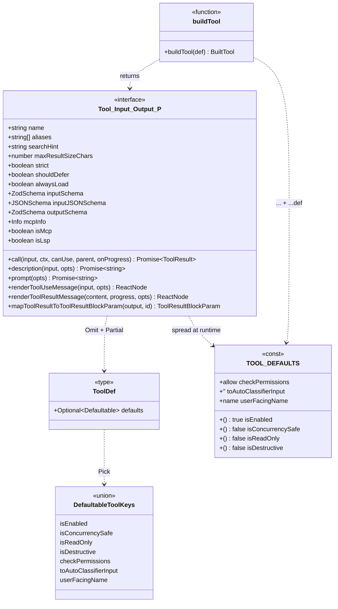
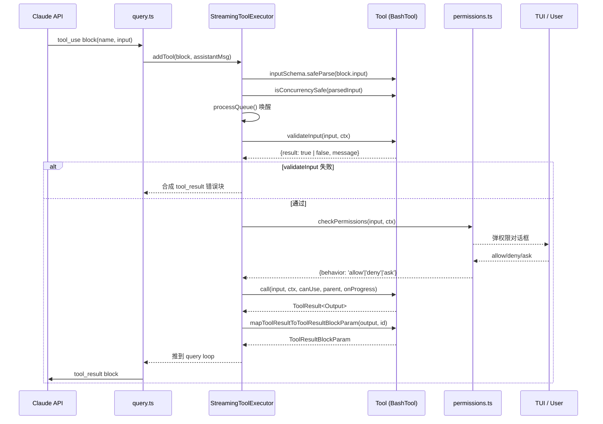

# 第 16 章 · Tool 契约 — `Tool<T, P>` 接口与 `buildTool` 工厂

> 面向**开发者**的第二视角。讲清楚: 一个工具在 Claude Code 里是怎么"被定义、被发现、被执行、被权限校验、被渲染"的。

## 摘要

Claude Code 当前注册了 **60+ 个工具**（Bash、Read、Edit、Agent、Mcp 系列...）,它们对外只暴露两种"形状": `Tool<T, P>` 接口(完整 ~50 个可选字段)和工厂 `buildTool(def)`(自动填充 7 个 fail-closed 默认值)。**所有工具的导出必须经过 `buildTool`**,直接写对象字面量会被类型系统拒绝。本章用一张 `classDiagram` 囊括全部字段语义,并以 **BashTool** 与 **FileReadTool** 两个真实例子解释工程实践。

## 速赢(TL;DR)

1. **`Tool<T, P>` 是 11 必填 + ~40 可选字段的结构化接口**,源码定义在 `src/Tool.ts:362-695`。
2. **`buildTool(def)` 工厂在 `src/Tool.ts:783-792` 自动补全 7 个 fail-closed 默认值**:`isEnabled`/`isConcurrencySafe`/`isReadOnly`/`isDestructive`/`checkPermissions`/`toAutoClassifierInput`/`userFacingName`。
3. **`maxResultSizeChars`** 是工具结果的持久化阈值,超过后写盘并返回预览;Read 设为 `Infinity` 避免"Read 自己的输出文件"死循环(`src/Tool.ts:458-465`)。
4. **`strict: true`** 让 API 更严格地校验 schema,**只在 `feature('TOOL_PEAR')` 启用时生效**(`src/Tool.ts:467-472`)。
5. **`searchHint`** 是 3-10 词的关键词短语,用于 ToolSearch 延迟工具的命中检索(`src/Tool.ts:373-377`)。
6. **`interruptBehavior()`** 决定用户在新消息到达时是 `cancel` 还是 `block` 当前工具(`src/Tool.ts:407-416`)。
7. **`isMcp`/`isLsp` markers** 让 StreamingToolExecutor 与 UI 区分工具来源,影响渲染与日志(`src/Tool.ts:436-437`)。
8. **`mapToolResultToToolResultBlockParam`** 把工具 Output 翻译成 Claude API 的 `tool_result` 块,模型永远只看这个序列化结果。
9. **`toAutoClassifierInput`** 是 Auto Mode 安全分类器的输入;"跳过"返回 `''`(`src/Tool.ts:753-755`)。
10. **`validateInput` 在 `checkPermissions` 之前**,前者同步阻断,后者才弹对话框(`src/Tool.ts:484-503`)。
11. **反模式**:直接 `{...def}`、忘记 `strict: true`、忘记 `lazySchema`、没有 `prompt()`。

## 1. 关键图

### 1.1 `Tool<T, P>` 接口 — 11 必填字段(classDiagram)



> 字段全集: `src/Tool.ts:362-695`(`Tool<Input, Output, P>`)。`BuiltTool<D>` 是 `Omit<D, DefaultableToolKeys> & { [K in DefaultableToolKeys]-?: ... }` 的类型层 spread(`src/Tool.ts:735-741`)。

### 1.2 工具生命周期 — 调用关系



> 这是 `src/services/tools/StreamingToolExecutor.ts:76-405` 的事件流。三个关键约束:
> 1. `validateInput` 失败或 `behavior === 'deny'` 都直接合成 `<tool_use_error>...</tool_use_error>`,不进 `call()`(`StreamingToolExecutor.ts:78-101`)。
> 2. `interrupted` Bash 会触发 `siblingAbortController.abort('sibling_error')` 杀掉同行进程(`StreamingToolExecutor.ts:355-364`)。
> 3. 进度消息走 `pendingProgress` 单独通道,不会和最终结果混序(`StreamingToolExecutor.ts:419-422`)。

## 2. 详细机制

### 2.1 入门 5 分钟:11 个核心字段

`Tool<T, P>` 接口里**只有 6 个字段在类型上是必填的**,但工程实践里我们关心 11 个最常用的:

| # | 字段 | 类型 | 作用 | 默认值 |
|---|---|---|---|---|
| 1 | `name` | `string` | 工具主名,模型看到的就是它 | 必填 |
| 2 | `description` | `(input, opts) => Promise<string>` | 一句话能力描述,展示在 prompt 选择面板 | 必填 |
| 3 | `inputSchema` | `ZodSchema` (z.v4) | 工具输入的结构化校验 | 必填;**使用 `lazySchema()` 包装** |
| 4 | `outputSchema` | `ZodSchema`? | 工具输出的结构化校验,**严格推荐写** | `undefined` |
| 5 | `call` | `(input, ctx, canUse, parent, onProgress) => Promise<ToolResult<Output>>` | 工具的执行入口 | 必填 |
| 6 | `prompt` | `(opts) => Promise<string>` | 工具的"自我说明书",注入到模型 system prompt | 必填 |
| 7 | `isEnabled` | `() => boolean` | 启用开关(被 `feature()` 控制) | **`true`** |
| 8 | `isConcurrencySafe` | `(input) => boolean` | 是否可与同类工具并行 | **`false`** (假设不安全) |
| 9 | `isReadOnly` | `(input) => boolean` | 是否只读,影响 Auto Mode 分类 | **`false`** (假设有写) |
| 10 | `isDestructive` | `(input) => boolean?` | 是否不可逆(删/覆盖/发送) | **`false`** |
| 11 | `checkPermissions` | `(input, ctx) => Promise<PermissionResult>` | 工具特定权限策略 | **`{behavior: 'allow', updatedInput: input}`** (默认放行) |

> 出处: `src/Tool.ts:362-503`(接口定义),`src/Tool.ts:757-769`(`TOOL_DEFAULTS` 表)。

#### 11 个字段的真实例子:BashTool

```tsx
// src/tools/BashTool/BashTool.tsx:420-540
export const BashTool = buildTool({
  name: BASH_TOOL_NAME,                              // ① name
  searchHint: 'execute shell commands',              // ② (11+ 高级字段)
  maxResultSizeChars: 30_000,                        // ③ 30K 字符阈值
  strict: true,                                      // ④ 严格 schema
  async description({ description }) {               // ⑤ description
    return description || 'Run shell command';
  },
  async prompt() {                                   // ⑥ prompt
    return getSimplePrompt();
  },
  isConcurrencySafe(input) {                         // ⑦ 默认 false,这里覆盖
    return this.isReadOnly?.(input) ?? false;
  },
  isReadOnly(input) {                                // ⑧ 用解析器判定
    const compoundCommandHasCd = commandHasAnyCd(input.command);
    return checkReadOnlyConstraints(input, compoundCommandHasCd).behavior === 'allow';
  },
  toAutoClassifierInput(input) {                     // ⑨ 分类器只关心命令
    return input.command;
  },
  isSearchOrReadCommand(input) { ... },              // 10) UI 折叠控制
  async preparePermissionMatcher({ command }) { ... }, // 11) Hook 模式匹配
  async validateInput(input: BashToolInput) { ... }, // ①validate 前置拦截
  async checkPermissions(input, context) {           // ⑩ 权限策略
    return bashToolHasPermission(input, context);
  },
  get inputSchema(): InputSchema { return inputSchema(); },   // 必填
  get outputSchema(): OutputSchema { return outputSchema(); },
  userFacingName(input) { ... },                     // 历史面板显示名
  renderToolUseMessage, renderToolResultMessage,
  extractSearchText({ stdout, stderr }) { ... },
  mapToolResultToToolResultBlockParam(...) { ... },  // 关键:对模型的最终字符串
  async call(input, toolUseContext, ...) {
    // 真正的执行:runShellCommand 是 async generator,把进度推到 onProgress
    // 最终返回 { data: { stdout, stderr, interrupted, ... } }
  },
});
```

> `BashTool` 是规模最大的实现,完整文件 1200+ 行。

#### 简短参照:FileReadTool 的 5 个最小字段

```ts
// src/tools/FileReadTool/FileReadTool.ts:337-417
export const FileReadTool = buildTool({
  name: FILE_READ_TOOL_NAME,                          // ①
  searchHint: 'read files, images, PDFs, notebooks',  // ②
  maxResultSizeChars: Infinity,                       // ③ 不持久化(避免循环)
  strict: true,                                       // ④
  async description() { return DESCRIPTION; },        // ⑤
  async prompt() { /* renderPromptTemplate(...) */ }, // ⑥
  get inputSchema(): InputSchema { return inputSchema(); },   // 必填
  get outputSchema(): OutputSchema { return outputSchema(); },
  isConcurrencySafe() { return true; },               // 只读 → 并发安全
  isReadOnly() { return true; },                      // 只读
  toAutoClassifierInput(input) { return input.file_path; },
  renderToolUseMessage, renderToolUseTag,
  renderToolResultMessage,
  async validateInput({ file_path, pages }, ctx) {
    // 纯路径检查,无 I/O:UNC/二进制扩展/dev 文件
    if (isBlockedDevicePath(expandPath(file_path))) {
      return { result: false, message: '...', errorCode: 9 };
    }
    return { result: true };
  },
  async checkPermissions(input, context) {
    return checkReadPermissionForTool(FileReadTool, input, context.toolPermissionContext);
  },
  async call({ file_path, offset = 1, limit, pages }, context) {
    // 实际读取 + token 上限校验 + 缓存去重
  },
} satisfies ToolDef<InputSchema, Output>);
```

注意结尾的 **`satisfies ToolDef<InputSchema, Output>`**(在 `FileReadTool.ts:718`、`AgentTool.tsx:1387`、`ExitPlanModeV2Tool.ts:493` 等处可见)——这是**第二个断言**,在 `buildTool` 之外再校验形状,确保未来加字段不会被忽略。

### 2.2 高级 30 分钟

#### 2.2.1 `buildTool` 与 `TOOL_DEFAULTS`

```ts
// src/Tool.ts:757-792
const TOOL_DEFAULTS = {
  isEnabled: () => true,                                              // 1) 假设启用
  isConcurrencySafe: (_input?: unknown) => false,                     // 2) 假设不安全(并行会炸)
  isReadOnly: (_input?: unknown) => false,                            // 3) 假设有写
  isDestructive: (_input?: unknown) => false,                         // 4) 假设不破坏
  checkPermissions: (input, _ctx?) =>                                 // 5) 默认放行(由通用权限系统兜底)
    Promise.resolve({ behavior: 'allow', updatedInput: input }),
  toAutoClassifierInput: (_input?: unknown) => '',                    // 6) 跳过分类器
  userFacingName: (_input?: unknown) => '',                           // 7) 由 buildTool 覆盖为 name
}

export function buildTool<D extends AnyToolDef>(def: D): BuiltTool<D> {
  return {
    ...TOOL_DEFAULTS,
    userFacingName: () => def.name,         // ⚠ 在 ...def 之前,确保 def 可覆盖
    ...def,
  } as BuiltTool<D>
}
```

> "Fail-closed" 的默认安全姿态 — 任何字段不写,工具就被视作**有写、有破坏、独占执行**。这种设计让新加的字段不需要下游全部补丁。
> `BuiltTool<D>` 用 mapped types 在类型层镜像 `{...TOOL_DEFAULTS, ...def}`(`src/Tool.ts:735-741`)。

#### 2.2.2 `mapToolResultToToolResultBlockParam` — 模型的"视图"

这是模型**唯一看见的工具输出**。例如 BashTool 把 `{stdout, stderr, persistedOutputPath, backgroundTaskId, ...}` 拍平成:

```ts
// src/tools/BashTool/BashTool.tsx:555-623
return {
  tool_use_id: toolUseID,
  type: 'tool_result',
  content: [processedStdout, errorMessage, backgroundInfo].filter(Boolean).join('\n'),
  is_error: interrupted,
};
```

- **结构化内容** (`structuredContent`) — 优先,直接给 API;
- **图像数据** (`isImage`) — 走 `buildImageToolResult`;
- **超大输出** (`persistedOutputPath`) — 替换为 `<persisted-output filepath size="N">preview...</persisted-output>`,**UI 看不到**这点(`BashTool.tsx:589-595`)。

#### 2.2.3 `toAutoClassifierInput` — Auto Mode 安全分类器

只有**写动作 + 网络效应**的工具需要返回真实输入;其他返回 `''`(跳过)。**典型模式**:

```ts
// BashTool.tsx:442-444
toAutoClassifierInput(input) { return input.command; }

// FileReadTool.ts:379-381
toAutoClassifierInput(input) { return input.file_path; }
```

返回 `string` 时,分类器把它当"一行命令预览";返回 `object` 时(可选)避免 JSON 重编码的精度损失(`src/Tool.ts:551-556`)。

#### 2.2.4 `searchHint` — ToolSearch 的索引

```ts
// src/Tool.ts:373-377
/**
 * One-line capability phrase used by ToolSearch for keyword matching.
 * Helps the model find this tool via keyword search when it's deferred.
 * 3–10 words, no trailing period.
 */
searchHint?: string
```

> 用 3-10 词,无末尾句号,选不与 `name` 重叠的术语(例如 NotebookEdit 用 `'jupyter'`,BashTool 用 `'execute shell commands'`)。

#### 2.2.5 `maxResultSizeChars` — 持久化阈值

```ts
// src/Tool.ts:458-466
maxResultSizeChars: number  // 超过则落盘并返回 <persisted-output>
```

- BashTool: `30_000`(30K 字符,因为 Bash 输出可能巨大)
- FileReadTool: **`Infinity`** — 因为持久化后模型用 Read 读它,**会引发 Read → file → Read 死循环**(`FileReadTool.ts:340-342`)。Read 工具**自己**通过 maxTokens 上界控大小,不需要外层兜底。

#### 2.2.6 `interruptBehavior()` — 用户新消息到达时怎么办

```ts
// src/Tool.ts:407-416
interruptBehavior?(): 'cancel' | 'block'
```

- `'cancel'` — 用户按 ESC 或打新消息时停止工具
- `'block'` — 等待工具完成,新消息排队

默认 `'block'`(`StreamingToolExecutor.ts:235`)—— 长任务(Bash、Agent)一般愿意等。

#### 2.2.7 `isMcp`/`isLsp` markers — 来源识别

```ts
// src/Tool.ts:436-437
isMcp?: boolean
isLsp?: boolean
```

这些 marker 在 `MCPTool.ts` 与 `LSPTool.ts` 设置后,UI 与日志能识别工具来自外部服务(MCP 服务器 / LSP 客户端)。同时它们也影响 **DCE 打包** — MCP/LSP 路径可能整体被 `feature()` 排除出 `bun:bundle` 之外的客户端构建。

#### 2.2.8 `shouldDefer` / `alwaysLoad` — ToolSearch 延迟加载

```ts
// src/Tool.ts:438-449
readonly shouldDefer?: boolean    // 配合 defer_loading: true; 必须 ToolSearch 才可调用
readonly alwaysLoad?: boolean     // 强制首轮带全 schema(CCR MCP 工具用)
```

参见 `ExitPlanModeV2Tool.ts:167` — `shouldDefer: true` 让 ExitPlanMode 在初轮 prompt 中不出现,模型只能通过 ToolSearch 拿到。

#### 2.2.9 `validateInput` vs `checkPermissions` — 两条不同的拦截线

| 阶段 | 方法 | 失败时 |
|---|---|---|
| 1 | `inputSchema.safeParse` | 直接 `<tool_use_error>Invalid input</tool_use_error>` |
| 2 | `validateInput(input, ctx)` | 同步阻断,带结构化 `errorCode`(`Tool.ts:489-492`) |
| 3 | `checkPermissions(input, ctx)` | 弹对话框 / 走分类器 |
| 4 | `call(...)` | 执行 |

> **关键**: `validateInput` 在 `checkPermissions` 之前,所以不需要权限就能拒绝坏输入(快路径,无 I/O)。

### 2.3 工具注册表: `src/tools.ts`

```ts
// src/tools.ts:1-50
import { BashTool } from './tools/BashTool/BashTool.js'
import { FileReadTool } from './tools/FileReadTool/FileReadTool.js'
// ... 60+ 工具
const REPLTool = process.env.USER_TYPE === 'ant' ? require(...).REPLTool : null
const MonitorTool = feature('MONITOR_TOOL') ? require('./tools/MonitorTool/...').MonitorTool : null
// ...
export const allTools = [
  AgentTool, BashTool, FileEditTool, FileReadTool,
  // ... + 条件 require 进来的
  ...(REPLTool ? [REPLTool] : []),
  ...(MonitorTool ? [MonitorTool] : []),
]
```

> `src/tools.ts:389` 行,几乎是 `buildTool` 反向的"组装点": 标准工具直接 import,带 `feature()` 守门的高级工具走**条件 require + 数组 spread**。

## 3. 反模式(常见错误)

### 3.1 ❌ 直接用对象字面量,不经过 `buildTool`

```ts
// 错误:类型会被推导成 ToolDef(缺字段),StreamingToolExecutor 会炸
export const MyTool = {
  name: 'MyTool',
  async call(...) { ... },
  // 漏掉 prompt / description / renderToolUseMessage / etc.
};
```

正确做法是 **永远 `buildTool({ ... } satisfies ToolDef<I, O>)`**。`buildTool` 帮你填全 7 个 fail-closed 默认值,绕过即失效。

### 3.2 ❌ 忘记 `strict: true`

`strict` 让 API 更严地校验 schema(只读、拒绝多余字段、未定义字段报错)。当前**只在 `feature('TOOL_PEAR')` 启用时生效**(`src/Tool.ts:467-472`),但工具作者仍然应该**显式声明**,因为这是开关打开后的正确姿态(BashTool、FileReadTool 都写了)。

### 3.3 ❌ 忘记 `prompt()`

`prompt()` 是工具的"自我说明书",Claude 在规划阶段会读它。不写的话,Claude 不知道何时该调用你的工具。当前所有 60+ 工具都**有** `prompt()`,这是事实标准。

### 3.4 ❌ `inputSchema` 不是 lazy

```ts
// 错误:模块加载时执行 z 校验
const inputSchema = z.strictObject({ ... });
```

正确做法 — `lazySchema` 是 `bun:bundle` 友好的延迟求值包装:

```ts
import { lazySchema } from '../../utils/lazySchema.js';
const inputSchema = lazySchema(() => z.strictObject({ ... }));
type InputSchema = ReturnType<typeof inputSchema>;

get inputSchema(): InputSchema { return inputSchema(); }
```

> 60+ 工具都遵循这条(`BashTool.tsx:478-480`、`FileReadTool.ts:361-363`、`ExitPlanModeV2Tool.ts:157-162`)。

### 3.5 ❌ 错误处理太宽容

`call()` 里所有异常都会被 `StreamingToolExecutor` 捕获并转成 `<tool_use_error>` 块。**不要**把所有错误吞掉 — 让真实异常冒泡到 executor 才好诊断。**也不要**把 `console.error` 当作工具的"成功信号"。

### 3.6 ❌ 没有 `userFacingName`

UI 在历史面板、TODO 列表会显示工具名。**不提供 `userFacingName` 时**,`buildTool` 默认填 `() => def.name`,所以这条**实际安全** —— 但你应该**显式写**来控制展示文案(BashTool 会根据环境变量返回 `'SandboxedBash'`,`BashTool.tsx:484-502`)。

### 3.7 ❌ `checkPermissions` 默认放行却无说明

`TOOL_DEFAULTS.checkPermissions` 是 `{behavior: 'allow', updatedInput: input}` —— 通用权限系统(`permissions.ts`)会兜底,**但工具作者必须显式表达意图**,否则权限规则无法精准匹配工具。

### 3.8 ❌ 假定工具 `isConcurrencySafe: true` 而不证明

`TOOL_DEFAULTS.isConcurrencySafe = false`。覆盖时必须证明 —

- **Read 类的纯读工具**可以直接 `true`
- **Bash 类的副作用工具**必须用 `isReadOnly` 的解析结果(`BashTool.tsx:434-436`)
- **写工具**绝对不能 `true`

否则两个并行写调用会**互相覆盖**(已被 `StreamingToolExecutor.ts:128-150` 的 `canExecuteTool` 拒绝)。

## 4. 引用与下一步

### 前置
- `00-front/03-glossary.md` — 术语表,定义 `Tool`/`MCP`/`DCE`/`lazySchema` 等
- `01-foundation/03-feature-flags.md` — 188 个特性开关,影响多个 `shouldDefer`/`alwaysLoad`
- `04-architect/25-layered-arch.md` — 5 层架构里 Tools 层的位置

### 平行
- `03-developer/16a-conditional-commands.md` — 命令注册表与 `bun:bundle` 守门
- `03-developer/17-build-a-tool.md` — 手把手从空白目录写一个 FileHashTool

### 后继
- `03-developer/18-permission-system.md` — `checkPermissions` 与 `permissions.ts` 的详细交互

### 源码定位
- `src/Tool.ts:362-695` `Tool<Input, Output, P>` 接口
- `src/Tool.ts:707-726` `DefaultableToolKeys` 与 `ToolDef`
- `src/Tool.ts:735-741` `BuiltTool<D>` 类型 spread
- `src/Tool.ts:757-792` `TOOL_DEFAULTS` 与 `buildTool` 工厂
- `src/tools/BashTool/BashTool.tsx:420-540` 完整 BashTool 例子
- `src/tools/FileReadTool/FileReadTool.ts:337-417` FileReadTool 入口定义
- `src/tools/FileReadTool/FileReadTool.ts:227-243` `lazySchema` + `strictObject` 模式
- `src/services/tools/StreamingToolExecutor.ts:76-405` 工具执行/并发/中断生命周期
- `src/tools.ts` 所有工具的注册表(389 行)
