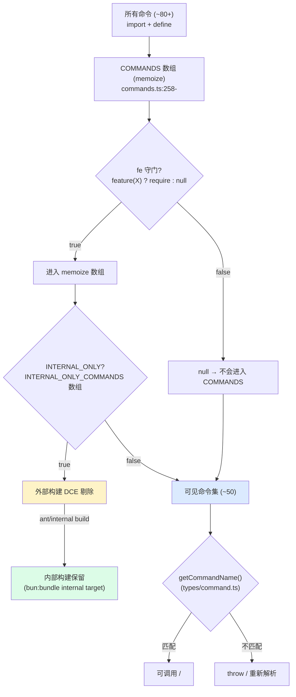
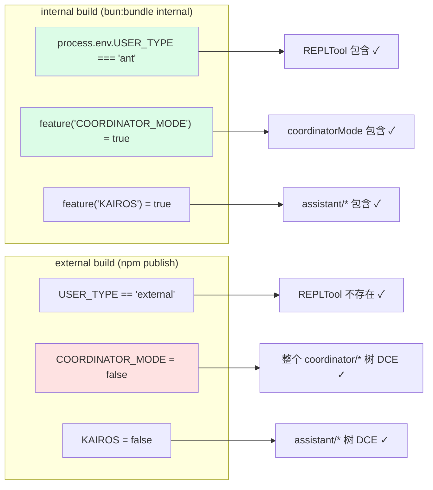

# 第 16a 章 · 条件命令与 `bun:bundle` 守门机制

> 面向**开发者**的补充章节。解答一个具体问题:**为什么有些 `/` 命令在公开版看不到?**

## 摘要

Claude Code 的命令列表(`/agents`、`/commit`、`/share`、`/bughunter`...)**不是单一数组**,而是被 **3 层守门**过滤后的结果:**(1)** `INTERNAL_ONLY_COMMANDS` 黑名单(`commands.ts:225-254`)、**(2)** `bun:bundle` 构建时的 `feature()` 条件 require、**(3)** 用户层 `/<cmd>` 调用时 `getCommandName()` 二次校验。本章列出 ~25 个内部命令名(仅索引),并分析 `main.tsx`、`QueryEngine.ts` 中 `feature()` 守门如何在编译期 DCE(dead code elimination)出精简构建。

## 速赢(TL;DR)

1. **`INTERNAL_ONLY_COMMANDS`** 是一个常量数组,在外部构建里整体被剔除(`src/commands.ts:225-254`)。
2. **`feature('XYZ')`** 是 build-time 守卫,DCE 决定代码是否进入 `bun:bundle`(`01-foundation/03-feature-flags.md` 已详述)。
3. **三条 DCE 约束**(基于 buildtool 注释): 必须是**正条件** `feature(X) ? require(...) : null`;常量字符串字面量只能出现在**真分支**;不能包进 `if` 块。
4. **公开用户看不到的命令示例**: `/bughunter`、`/commit`、`/share`、`/goodclaude`、`/commitPushPr`、`/ctx_viz` 等。
5. **`/share`、`/agentsPlatform`、`/autofixPr` 等**写在 `INTERNAL_ONLY_COMMANDS` 数组里,但**本身仍在 `COMMANDS` memoize 里注册** —— 这条黑名单不是注册入口,而是**过滤出口**。
6. **`COORDINATOR_MODE`、`HISTORY_SNIP`、`BRIDGE_MODE`、`KAIROS`、`AGENT_TRIGGERS`、`MONITOR_TOOL`** 等 feature 名各自守门不同的代码路径。
7. **负条件 `if (!feature(X)) return` 不会 DCE 字符串字面量**(`bridgeEnabled.ts:162-163` 注释明示)。

## 1. 关键图

### 1.1 命令可见性的三层过滤



> 来源: `src/commands.ts:225-254` + `src/commands.ts:256-...`(`COMMANDS = memoize(...)`)+ `src/types/command.ts` 的 `getCommandName()`。

### 1.2 build-time feature() DCE 模式



> `bun:bundle` 在 build-time 静态分析 `process.env.USER_TYPE === 'ant'` 这种字符串字面量,以及 `feature('XXX')` 调用;false 分支不打包。运行时仍有 `getFeatureValue_CACHED_MAY_BE_STALE` 二次校验。

## 2. 详细机制

### 2.1 第一层: `INTERNAL_ONLY_COMMANDS`

```ts
// src/commands.ts:225-254
export const INTERNAL_ONLY_COMMANDS = [
  backfillSessions,
  breakCache,
  bughunter,
  commit,
  commitPushPr,
  ctx_viz,
  goodClaude,
  issue,
  initVerifiers,
  ...(forceSnip ? [forceSnip] : []),
  mockLimits,
  bridgeKick,
  version,
  ...(ultraplan ? [ultraplan] : []),
  ...(subscribePr ? [subscribePr] : []),
  resetLimits,
  resetLimitsNonInteractive,
  onboarding,
  share,
  summary,
  teleport,
  antTrace,
  perfIssue,
  env,
  oauthRefresh,
  debugToolCall,
  agentsPlatform,
  autofixPr,
].filter(Boolean)
```

**这 25+ 命令名** → 本章**仅列出名称,不在 handbook 中展开**;它们的 `@-description`、UI、参数均属于内部构建。

设计意图:
- 内部构建里这些命令**仍被注册**(在 `COMMANDS` memoize 数组里)。
- 外部构建通过 `bun:bundle` DCE 整体剔除 **`INTERNAL_ONLY_COMMANDS` 数组本身的引用** ,从而它们就不进入 COMMANDS 数组。
- 这是 "黑名单 + DCE" 而非 "条件 import",因为这些命令仍需要在 ant 内部被人与人/Agent 用到。

### 2.2 第二层: `feature()` 守门的编译期 DCE

`feature()` 是 `01-foundation/03-feature-flags.md` 已展开的 188 个开关的标准访问函数。本节强调它**对命令注册表的影响**。

#### 真实例子 1:`COORDINATOR_MODE` 让 coordinator 模式进入/不进入 build

```ts
// src/main.tsx:74-77
/* eslint-disable @typescript-eslint/no-require-imports */
const coordinatorModeModule = feature('COORDINATOR_MODE')
  ? require('./coordinator/coordinatorMode.js') as typeof import('./coordinator/coordinatorMode.js')
  : null;
/* eslint-enable @typescript-eslint/no-require-imports */
```

注释明示:**"Dead code elimination: conditional import for COORDINATOR_MODE"**(`src/main.tsx:74`)。`bun:bundle` 在 build 时静态分析 `feature('COORDINATOR_MODE')` 的返回,如果是 `false`,整个 `./coordinator/coordinatorMode.js` 模块图都不进 bundle。

#### 真实例子 2:`HISTORY_SNIP` 与 compaction 算法

```ts
// src/QueryEngine.ts:120-128
// Dead code elimination: conditional import for snip compaction
/* eslint-disable @typescript-eslint/no-require-imports */
const snipModule = feature('HISTORY_SNIP')
  ? (require('./services/compact/snipCompact.js') as typeof import('./services/compact/snipCompact.js'))
  : null;
const snipProjection = feature('HISTORY_SNIP')
  ? (require('./services/compact/snipProjection.js') as typeof import('./services/compact/snipProjection.js'))
  : null;
/* eslint-enable @typescript-eslint/no-require-imports */
```

> `HISTORY_SNIP` 是 compaction(压缩)算法的"基于历史的回溯裁剪"开关。

#### 真实例子 3:`BRIDGE_MODE` 与 Remote Control

```ts
// src/bridge/bridgeEnabled.ts:71-87
if (feature('BRIDGE_MODE')) {       // ← 注意这是反例
  if (!isClaudeAISubscriber()) {
    return 'Remote Control requires a claude.ai subscription...'
  }
  ...
}
return 'Remote Control is not available in this build.'
```

> 这条注释**特别强调**,见 `src/bridge/bridgeEnabled.ts:161-163`:
> ```ts
> // Positive pattern — see docs/feature-gating.md.
> // Negative pattern (if (!feature(...)) return) does not eliminate
> // inline string literals from external builds.
> ```
> **DCE 只对正条件有效** — 字符串 `'Remote Control requires...'` 字面量必须在 `feature(...)` 真分支里,才能在 false 分支里被剔除。

#### 真实例子 4:`tools.ts` 中的多层条件

```ts
// src/tools.ts:18-58 (节选)
const REPLTool =
  process.env.USER_TYPE === 'ant'
    ? require('./tools/REPLTool/REPLTool.js').REPLTool
    : null
const SleepTool =
  feature('PROACTIVE') || feature('KAIROS')
    ? require('./tools/SleepTool/SleepTool.js').SleepTool
    : null
const cronTools = feature('AGENT_TRIGGERS')
  ? [
      require('./tools/ScheduleCronTool/CronCreateTool.js').CronCreateTool,
      require('./tools/ScheduleCronTool/CronDeleteTool.js').CronDeleteTool,
      require('./tools/ScheduleCronTool/CronListTool.js').CronListTool,
    ]
  : []
const RemoteTriggerTool = feature('AGENT_TRIGGERS_REMOTE')
  ? require('./tools/RemoteTriggerTool/RemoteTriggerTool.js').RemoteTriggerTool
  : null
const MonitorTool = feature('MONITOR_TOOL')
  ? require('./tools/MonitorTool/MonitorTool.js').MonitorTool
  : null
```

> `process.env.USER_TYPE === 'ant'` 与 `feature(...)` 在 `bun:bundle` build-time 是同等效力 — 字面量比较结果是确定的,bundler 可以静态判断分支。

### 2.3 第三层:运行时二次校验 `getCommandName`

`/命令` 字符串最终由 `getCommandName()` 解析,见 `src/types/command.ts:222` 的导出:

```ts
export { getCommandName, isCommandEnabled } from './types/command.js'
```

`isCommandEnabled` 检查 feature(`statsig` / `growthbook`)和设置(`settings.json`)双向条件,这是**运行时**的双重保险 — 即便 build 时某命令被错误地包含了进来,settings 也会禁掉它。

### 2.4 三条 DCE 约束(具体可证)

> 来自 `01-foundation/03-feature-flags.md` 与 `src/bridge/bridgeEnabled.ts:161-163` 的提示:

1. **必须用正条件**:`feature(X) ? include : null`,而不是 `if (!feature(X)) return early`。
2. **字符串字面量必须在真分支**:`feature(X) ? 'available' : ''` ✅;`if (!feature(X)) throw 'not available'` ❌。
3. **避免把 require 包进 IIFE / 动态路径**: `feature(X) && require(...)` 是允许的;`feature(X) ? (() => require(...))() : null` ❌(bundler 无法穿透)。

## 3. 反模式

### 3.1 ❌ 用 `if (!feature(X)) return ...`

```ts
// 错误:DCE 失败,字符串会留在 bundle 里
function getTools() {
  if (!feature('MONITOR_TOOL')) {
    return []    // ← 字符串字面量还是被打包了
  }
  return require('./MonitorTool...').MonitorTool
}
```

正确:

```ts
// 正确:bundler 看到字面量 false,会把整个真分支剔除
const MonitorTool = feature('MONITOR_TOOL')
  ? require('./MonitorTool...').MonitorTool
  : null
```

### 3.2 ❌ 用 `if (process.env.NODE_ENV === 'production')` 当 feature

`process.env.X` 只有 `=== 'ant'` / `=== 'external'` 这样的字面量比较才能 DCE,因为 build 时 bundler 用同样的字面量去 DAG。`NODE_ENV === 'production'` 实际上**两个分支都会进入 bundle**,bundler 不会自动剔除它们。

### 3.3 ❌ 把 feature check 抽到独立函数

```ts
// 错误:bundler 无法穿透函数边界
function isBridgeOn() { return feature('BRIDGE_MODE') }
if (isBridgeOn()) require('./bridge.js')
```

`bun:bundle` 的静态分析是纯本地的;一旦把 feature call 藏到函数里,优化就丢了。**保持 `feature(X)` 调用贴近 `require(...)` 表达式**。

### 3.4 ❌ 用 `INTERNAL_ONLY_COMMANDS` 当权限列表

`INTERNAL_ONLY_COMMANDS` 是 build-time DCE 提示符,不是运行时的 ACL。运行时拦截命令请用:

- `getCommandName()` + `isCommandEnabled()` 做用户层 ACL
- `permissions.ts` 做权限规则匹配(参见 `05-appendices/...`)
- `feature()` 在 `isEnabled()` / `getCommandName()` 路径内做最终拒绝

### 3.5 ❌ 直接修改公开版 CLI 来"暴露"内部命令

公开版构建是用 `bun:bundle` 静态链接进一个**字面量 false** 的 `feature()` 调用。即使你 fork 源码改了 `commands.ts`,这些命令还需要它们的 `require` 模块不打 DCE — 这意味着还要把它们的 feature 全部开启,并修改 `INTERNAL_ONLY_COMMANDS` 移除。这**通常违反内部分发协议**。

## 4. 用户视角:为什么看不到某个 `/xyz` 命令

最常见的原因(按概率):

| 原因 | 表现 | 怎么验证 |
|---|---|---|
| 1. 命令在 `INTERNAL_ONLY_COMMANDS` 里 | 公开版根本没注册 | `grep -E "name:.*'(xyz)'" src/commands/` 看是否有定义 |
| 2. 命令被 `feature(X)` 守门 | 当前 build 里 `X=false` | `grep -A2 "feature('X')" src/commands.ts` 查守门 |
| 3. 命令被 `settings.json` deny | 注册了但禁用 | `cat ~/.claude/settings.json \| jq '.permissions.deny'` |
| 4. 你的订阅不支持该命令 | e.g. `/share` 仅 ant | 命令的 `isEnabled()` 返回 false |
| 5. 你不在 plan mode / 不在 bypass 模式 | 与权限模式有关 | `Tool.ts:493-503` 的 `checkPermissions` 路径 |

诊断脚本:

```bash
# 列当前 build 注册的所有命令
grep -E "name:.*'/" src/commands.ts | head -40

# 看某命令是否被 feature 守门
grep -B3 -A8 "name: 'btw'" src/commands/btw/index.ts 2>/dev/null | head -20

# 看是否在 INTERNAL_ONLY 名单
grep -n "<command_name>" src/commands.ts
```

## 5. 引用与下一步

### 前置
- `00-front/03-glossary.md` — DCE / feature flag / bundle / CCB / 内部构建 术语
- `01-foundation/03-feature-flags.md` — 188 个特性开关的注册表(必读)
- `04-architect/25-layered-arch.md` — 命令如何在 Commands 层注册

### 平行
- `03-developer/16-tool-contract.md` — `Tool<T, P>` 接口里也有 `isEnabled()` 用 feature 守门
- `03-developer/17-build-a-tool.md` — walkthrough 里我们用一个 fake feature `MY_TOOL_HASH` 守门

### 后继
- `03-developer/18-permission-system.md` — `permissions.ts` 的 deny/allow 规则与命令的关系

### 源码定位
- `src/commands.ts:225-254` `INTERNAL_ONLY_COMMANDS` 黑名单
- `src/commands.ts:256-...` `COMMANDS = memoize(...)` 注册表
- `src/main.tsx:74-77` `COORDINATOR_MODE` feature() 守门
- `src/QueryEngine.ts:120-128` `HISTORY_SNIP` feature() 守门
- `src/bridge/bridgeEnabled.ts:161-163` 正/负条件 DCE 差异注释
- `src/tools.ts:1-58` 多 feature 组合的 REPLTool/SleepTool/cronTools 注册
- `src/types/command.ts:222` 运行时 `getCommandName` / `isCommandEnabled`
- `src/bridge/bridgeEnabled.ts:25-87` 三段 feature 守门模式(`if/return` + 后续条件)
