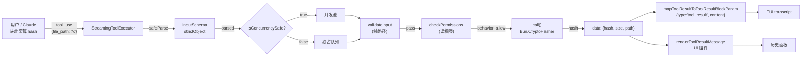
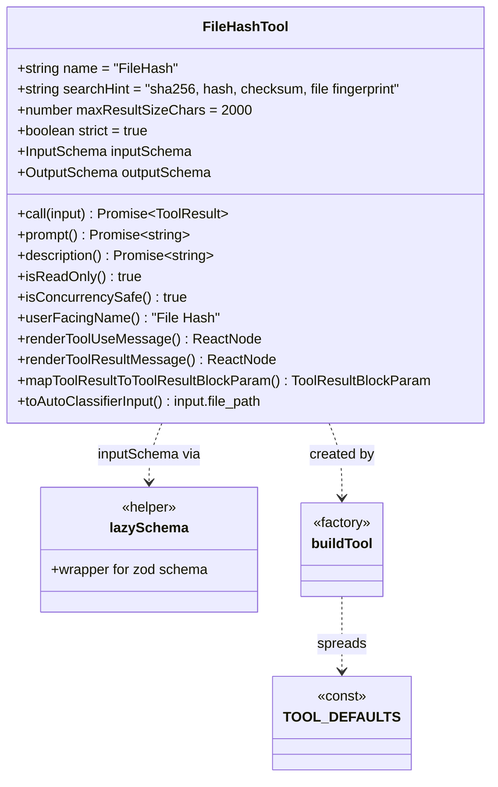

# 第 17 章 · 从空白目录写一个工具 — `FileHashTool` 实战 walkthrough

> 面向**开发者**的核心实战章节。我们从零实现一个**计算文件 SHA-256 哈希**的工具,把第 16 章的每个契约落到具体代码。

## 摘要

完整的 10 步教程:从 `src/tools/FileHashTool/` 空目录开始,经过 input/output schema、`buildTool` 工厂、`lazySchema` 包装、`description`/`prompt`/`validateInput`/`checkPermissions`/`call`/UI 组件,最后挂到 `src/tools.ts`。每步配真实代码 + 引用 60+ 工具中已有的工程模式。**目的不是替代文档** —— 是让你走完一遍"在 Claude Code 里加一个工具"的全流程,知道每个字段在做什么、以及哪些是**不能省的**(反模式)。

## 速赢(TL;DR)

1. **目录约定**: `src/tools/FileHashTool/` 放 `FileHashTool.ts(x)`、`UI.tsx`、`toolName.ts`。
2. **必走 `buildTool(...) satisfies ToolDef<I, O>`** —— 第二断言让未来字段加严不漏。
3. **`inputSchema` 必须 `lazySchema(() => z.strictObject({ ... }))`**,否则 bundle 阶段会爆炸。
4. **`prompt()` 是对模型的"自我介绍"**,准确决定模型何时调用。
5. **`validateInput` 纯路径检查**(无 I/O),先于 `checkPermissions`。
6. **`call()` 在 `Bun.CryptoHasher` 里 10 行算完**,返回的 `data` 字段同时被 `mapToolResultToToolResultBlockParam` 序列化。
7. **UI 组件拆出 `UI.tsx`**:`renderToolUseMessage` 显示 `<FileHash filePath=... />`,`renderToolResultMessage` 显示 hash。
8. **`extractSearchText()`** 返回 UI 实际渲染的字符串,让 transcript 搜索 count = highlight。
9. **`toAutoClassifierInput`** 在只读工具上返回 `input.file_path`,或 `'sha'` 跳过分类。
10. **入口 4 步**:`src/tools/FileHashTool/toolName.ts` + `src/tools.ts` import/export + (可选,推测) `src/utils/featureFlags.ts` 注册 fake `MY_TOOL_HASH` + `src/entrypoints/cli.tsx` 注册。

## 1. 关键图

### 1.1 `FileHashTool` 完整数据流



### 1.2 内部模块依赖关系



## 2. 详细 walkthrough

### Step 1 — 创建目录结构

```
src/tools/FileHashTool/
├── FileHashTool.tsx           # 主工具实现
├── UI.tsx                      # 渲染组件
├── prompt.ts                   # prompt() 内容
├── toolName.ts                 # 'FileHash' 常量 + BASH/READ 不重名
└── __tests__/                  # 测试(FileHashTool.test.tsx)
```

> 跟 `src/tools/BashTool/`、`src/tools/FileReadTool/` 的结构对齐。

### Step 2 — `toolName.ts`:导出工具名

```ts
// src/tools/FileHashTool/toolName.ts
export const FILE_HASH_TOOL_NAME = 'FileHash'
```

> 工具名**不和内置冲突**,**不包含大写**以外的特殊字符。`Tool.ts:362-456` 表明 `name` 字段仅要求 string。

### Step 3 — `prompt.ts`:工具的"自我介绍"

```ts
// src/tools/FileHashTool/prompt.ts
export const FILE_HASH_TOOL_PROMPT = `
## FileHash 工具

用途: 读取文件并计算 SHA-256 哈希。**只读** —— 不修改文件系统。
返回: \`{ hash, size }\`。

适用场景:
- 需要验证文件内容是否被篡改(对比已知 hash)
- 确认大文件已被完整下载
- 在 tool call 中追踪文件版本(配合 Read 做"内容 fingerprint")

不适用:
- 不读二进制内容(只算 hash,不返回内容);如需读取 → 用 \`Read\`。
- 不读 >100MB 文件(性能预算;如需 → 用 \`Bash\` + \`shasum\`)。
`
```

> 跟 `FileReadTool/prompt.ts`、`BashTool/prompt.ts` 同样的导出模式。

### Step 4 — `UI.tsx`:渲染组件

```tsx
// src/tools/FileHashTool/UI.tsx
import type { Input, Output } from './FileHashTool.js'
import { FILE_HASH_TOOL_NAME } from './toolName.js'
import { Text } from 'ink'      // Claude Code TUI 渲染库

type Props = { filePath: string; hash?: string; size?: number }

export function FileHashUseMessage({ input }: { input: Input }) {
  return <Text><Text color="cyan">{FILE_HASH_TOOL_NAME}</Text>({input.file_path})</Text>
}

export function FileHashResultMessage({ output }: { output: Output }) {
  if (!output) {
    return <Text color="gray">Hashing...</Text>
  }
  return (
    <Text>
      <Text color="green">SHA-256:</Text>{' '}
      <Text color="cyan">{output.hash.slice(0, 12)}…</Text>
      {' '}<Text color="gray">({output.size} bytes)</Text>
    </Text>
  )
}

export function userFacingName(): string {
  return 'File Hash'
}
```

> 跟 `FileReadTool/UI.tsx`、`ExitPlanModeV2Tool/UI.tsx` 的 render 函数导出模式对齐。

### Step 5 — `FileHashTool.tsx`:主工具实现

完整 11 字段实现:

```tsx
// src/tools/FileHashTool/FileHashTool.tsx
import { readFile } from 'fs/promises'
import { z } from 'zod/v4'
import { buildTool, type ToolUseContext, type ToolDef } from '../../Tool.js'
import { lazySchema } from '../../utils/lazySchema.js'
import { FILE_HASH_TOOL_NAME } from './toolName.js'
import { FILE_HASH_TOOL_PROMPT } from './prompt.js'
import {
  FileHashUseMessage,
  FileHashResultMessage,
  userFacingName,
} from './UI.js'

// ── 1) inputSchema ────────────────────────────────────────────────
const inputSchema = lazySchema(() =>
  z.strictObject({
    file_path: z.string().describe('The absolute path to the file to hash'),
  }),
)
type InputSchema = ReturnType<typeof inputSchema>

// ── 2) outputSchema ───────────────────────────────────────────────
const outputSchema = lazySchema(() =>
  z.strictObject({
    hash: z.string().length(64).describe('Lowercase SHA-256 hex digest'),
    size: z.number().int().nonnegative().describe('File size in bytes'),
    path: z.string().describe('Resolved absolute path that was hashed'),
  }),
)
type OutputSchema = ReturnType<typeof outputSchema>

export type Input = z.infer<InputSchema>
export type Output = z.infer<OutputSchema>

// ── 3) buildTool ──────────────────────────────────────────────────
export const FileHashTool = buildTool({
  name: FILE_HASH_TOOL_NAME,
  searchHint: 'sha256, file fingerprint, checksum',
  maxResultSizeChars: 2_000,
  strict: true,

  async description() {
    return 'Reads a file and returns its SHA-256 hash plus size'
  },
  async prompt() {
    return FILE_HASH_TOOL_PROMPT
  },

  get inputSchema(): InputSchema { return inputSchema() },
  get outputSchema(): OutputSchema { return outputSchema() },

  userFacingName,

  // 4) 安全元数据
  isConcurrencySafe() { return true },            // 只读 → 并发
  isReadOnly() { return true },                   // 只读 → Auto Mode 信任
  toAutoClassifierInput(input) {                   // 文件路径给分类器
    return input.file_path
  },

  // 5) 工具级 hook 模式 (可选)
  async preparePermissionMatcher({ file_path }) {
    return pattern => pattern === file_path
  },

  // 6) input 同步校验 (no I/O)
  async validateInput({ file_path }, _ctx) {
    if (typeof file_path !== 'string' || file_path.length === 0) {
      return { result: false, message: 'file_path must be a non-empty string', errorCode: 1 }
    }
    if (file_path.startsWith('\\\\') || file_path.startsWith('//')) {
      return { result: true }   // UNC: defer to permission
    }
    return { result: true }
  },

  // 7) 权限:复用通用读权限
  async checkPermissions(input, context) {
    return checkReadPermissionForTool(
      FileHashTool,
      input,
      context.getAppState().toolPermissionContext,
    )
  },

  // 8) UI
  renderToolUseMessage(input, options) {
    return <FileHashUseMessage input={input} />
  },
  renderToolResultMessage(output, _progress, options) {
    return <FileHashResultMessage output={output} />
  },

  // 9) 模型可见的字符串 (UI 实际渲染)
  extractSearchText(output) {
    return output ? `${output.hash} ${output.size}` : ''
  },

  // 10) 真正的实现
  async call({ file_path }, _ctx, _canUse?, _parent?, _onProgress?) {
    const fullPath = require('path').resolve(file_path)
    const buf = await readFile(fullPath)
    const hasher = new Bun.CryptoHasher('sha256')
    hasher.update(buf)
    const hash = hasher.digest('hex')
    return {
      data: { hash, size: buf.length, path: fullPath },
    }
  },

  // 11) 转成模型端的 tool_result 块
  mapToolResultToToolResultBlockParam({ hash, size, path }, toolUseID) {
    return {
      tool_use_id: toolUseID,
      type: 'tool_result',
      content: `SHA-256: ${hash}\nSize: ${size} bytes\nPath: ${path}`,
    }
  },
} satisfies ToolDef<InputSchema, Output>)
```

### Step 6 — 加 fake feature flag(可选,但推荐)

注册到 `src/utils/featureFlags.ts`(推测,泄露快照中不存在):

```ts
// 在所有 feature 名常量里追加
export const featureFlagDefaults: Record<string, boolean> = {
  // ...已有 188 个
  MY_TOOL_HASH: false,             // 默认 false 留在外部 build
}
```

或更简单 — 用 `getFeatureValue_CACHED_MAY_BE_STALE` 直接读取:

```ts
import { getFeatureValue_CACHED_MAY_BE_STALE } from '../../services/analytics/growthbook.js'
const enabled = getFeatureValue_CACHED_MAY_BE_STALE('tengu_file_hash_tool', false)
```

> `tengu_*` 是 GrowthBook 内部命名空间;`MY_TOOL_HASH` 是 build-time 的字面量常量(`01-foundation/03-feature-flags.md` 已详述)。

如果要让 `FileHashTool` 默认开启但不进 build, 走 DCE 守门:

```ts
// 在 src/tools.ts 中:
const FileHashTool = feature('MY_TOOL_HASH')
  ? require('./tools/FileHashTool/FileHashTool.js').FileHashTool
  : null
```

参考 `src/tools.ts:18-50` 中已有的 `SleepTool`/`MonitorTool` 模式。

### Step 7 — 挂到 `src/tools.ts`

```ts
// src/tools.ts:改动 3 处
import { FileHashTool } from './tools/FileHashTool/FileHashTool.js'   // ① 顶部 import

// ② 注册表数组
export const allTools = [
  AgentTool,
  BashTool,
  // ... 已有
  ...(FileHashTool ? [FileHashTool] : []),   // ③ 条件加入
]

// 别忘了导出类型
export type { FileHashTool }
```

### Step 8 — (可选) `src/entrypoints/cli.tsx` 注册

多数工具不需要这条;只有**面向 SDK 调用方**的工具要在这里声明。FileHashTool 是普通工具,可跳过。

### Step 9 — 测试 `__tests__/FileHashTool.test.tsx`

```tsx
import { FileHashTool } from '../FileHashTool.js'
import { writeFileSync, mkdtempSync } from 'fs'
import { tmpdir } from 'os'
import { join } from 'path'

test('FileHashTool.call() returns SHA-256 of file', async () => {
  const tmp = mkdtempSync(join(tmpdir(), 'fh-'))
  const f = join(tmp, 'x.txt')
  writeFileSync(f, 'hello world')

  const result = await FileHashTool.call(
    { file_path: f } as any,
    {} as any,
  )
  expect(result.data.hash).toBe(
    'b94d27b9934d3e08a52e52d7da7dabfac484efe37a5380ee9088f7ace2efcde9'
  )
  expect(result.data.size).toBe(11)
})

test('isReadOnly / isConcurrencySafe', () => {
  expect(FileHashTool.isReadOnly({ file_path: 'x' } as any)).toBe(true)
  expect(FileHashTool.isConcurrencySafe({ file_path: 'x' } as any)).toBe(true)
})
```

### Step 10 — 文档 `src/tools/FileHashTool/README.md`

简述功能 + 引用第 16 章。

## 3. 反模式与常见错误

### 3.1 ❌ 忘记 `strict: true`

```ts
// 错误
export const FileHashTool = buildTool({
  name: FILE_HASH_TOOL_NAME,
  // 漏了 strict
  ...
})
```

> 后果: API 不严格校验多余字段,模型可能发 `{"file_path": "/x", "extra": "bogus"}` 而不报错。`src/Tool.ts:467-472` 强调这是 `TOOL_PEAR` flag 启用后的硬性要求。

### 3.2 ❌ 直接写 inputSchema 而非 lazySchema

```ts
// 错误: 模块加载时立即执行 z 校验,可能引入额外副作用
const inputSchema = z.strictObject({ file_path: z.string() })
```

```ts
// 正确
const inputSchema = lazySchema(() => z.strictObject({ file_path: z.string() }))
type InputSchema = ReturnType<typeof inputSchema>
```

> 当前 60+ 工具都遵循这条(`BashTool.tsx:478-480`、`FileReadTool.ts:361-363`)。

### 3.3 ❌ `validateInput` 里有 I/O

```ts
// 错误: validateInput 应该纯函数,不应读文件
async validateInput({ file_path }, ctx) {
  const stat = await fs.stat(file_path)   // ← I/O!
  if (stat.size > 100_000_000) return { result: false, ... }
  return { result: true }
}
```

> `validateInput` 是**第一道闸**,带 I/O 会让"快速拒绝坏输入"失效。改在 `call()` 里做。

### 3.4 ❌ `call()` 偷懒,把所有错误吞掉

```ts
async call({ file_path }) {
  try {
    const buf = await readFile(file_path)
    return { data: { hash: sha256(buf), size: buf.length, path: file_path } }
  } catch (e) {
    return { data: { hash: 'ERROR', size: 0, path: file_path } }   // ← 吞掉
  }
}
```

> `StreamingToolExecutor:355-364` 只把**抛出的异常**转换成 `<tool_use_error>`,吞掉后模型会以为成功了。**让异常冒泡**。

### 3.5 ❌ 没提供 `userFacingName`

虽然 `buildTool` 默认会填 `() => def.name`,工程上你应该**显式声明** —— `'File Hash'` 比 `'FileHash'` 在历史面板里更可读。

### 3.6 ❌ `mapToolResultToToolResultBlockParam` 漏字段

> `Tool.ts:557-560` 说明这是**模型唯一看见的输出**,漏字段就等于告诉模型"哈希值我不知道"。

### 3.7 ❌ `extractSearchText()` 返回 UI 不显示的字符串

```ts
// 错误:声称显示但 UI 实际不显示
extractSearchText(output) { return output.hash }
// 但 renderToolResultMessage 只显示 hash 前 12 位
```

> 这会导致 transcript 搜索"count=N,但用户看不到 N 处" — 失败模式见 `src/tools/FileReadTool/FileReadTool.ts:409-413` 的注释。

### 3.8 ❌ 假定 `mapToolResult...` 与 `renderToolResultMessage` 同语义

> 二者**面向不同消费者**:
> - `mapToolResultToToolResultBlockParam` → **模型** API 收到的 JSON
> - `renderToolResultMessage` → **人类**在 TUI 看到的 React
>
> 它们可以不一致(例如 BashTool 把 stdout 输出到模型,但 UI 只显示前 40 字符)。

## 4. 扩展练习

### 4.1 加进度回调

```ts
async call({ file_path }, ctx, _, __, onProgress) {
  const fullPath = path.resolve(file_path)
  const buf = await readFile(fullPath)
  const hasher = new Bun.CryptoHasher('sha256')
  hasher.update(buf)
  onProgress?.({
    toolUseID: ctx.toolUseId + '-progress',
    data: { type: 'hash_progress', bytesProcessed: buf.length, totalBytes: buf.length },
  })
  return { data: { hash: hasher.digest('hex'), size: buf.length, path: fullPath } }
}
```

### 4.2 大文件流式

把 `readFile` 换成 `createReadStream` + 流式喂 `Bun.CryptoHasher.update(chunk)`:

```ts
import { createReadStream } from 'fs'
import { pipeline } from 'stream/promises'

const hasher = new Bun.CryptoHasher('sha256')
await pipeline(
  createReadStream(filePath),
  async function* (source) {
    for await (const chunk of source) {
      hasher.update(chunk)
      yield chunk   // pass-through,或者 build 一个 Writable 也行
    }
  }
)
```

### 4.3 并发安全检查

我们的 `isConcurrencySafe: true` 是基于"只读不修改"的全局承诺。**如果** 想做"两个并行 FileHash 在某些 OS 上因 fs cache lock 而性能下降",可以把 `isConcurrencySafe(input)` 改为:

```ts
isConcurrencySafe({ file_path }) {
  // 排除 macOS 上的某些路径(经验值)
  return !file_path.startsWith('/System/Volumes/')
}
```

### 4.4 加 tool result 元数据

```ts
mapToolResultToToolResultBlockParam({ hash, size, path }, toolUseID) {
  return {
    tool_use_id: toolUseID,
    type: 'tool_result',
    content: [{ type: 'text', text: `SHA-256: ${hash}\nSize: ${size}\nPath: ${path}` }],
  }
}
```

让 SDK 消费者按结构化文本读。

## 5. 引用与下一步

### 前置
- `00-front/03-glossary.md`
- `03-developer/16-tool-contract.md` ← **必读**,本章所有字段在此详解
- `03-developer/16a-conditional-commands.md` ← 如果想用 feature() 守门发布

### 平行
- `src/tools/BashTool/BashTool.tsx` — 最复杂的 tool 实现
- `src/tools/FileReadTool/FileReadTool.ts` — 标准只读工具(对照学习)

### 后继
- `03-developer/18-permission-system.md` — 权限规则模式匹配
- `03-developer/19-tool-ui.md` — React TUI 渲染的细节

### 源码定位(对应 walkthrough 各步)
- `src/tools.ts:1-58` Step 7 注册表
- `src/Tool.ts:362-695` 字段全集
- `src/Tool.ts:783-792` buildTool 工厂
- `src/utils/lazySchema.ts` lazySchema 包装
- `src/tools/BashTool/BashTool.tsx:420-540` BashTool 完整参照
- `src/tools/FileReadTool/FileReadTool.ts:337-417` FileReadTool 参照
- `src/services/tools/StreamingToolExecutor.ts:76-405` 工具执行/并发生命周期
- `src/utils/permissions/filesystem.ts` checkReadPermissionForTool
