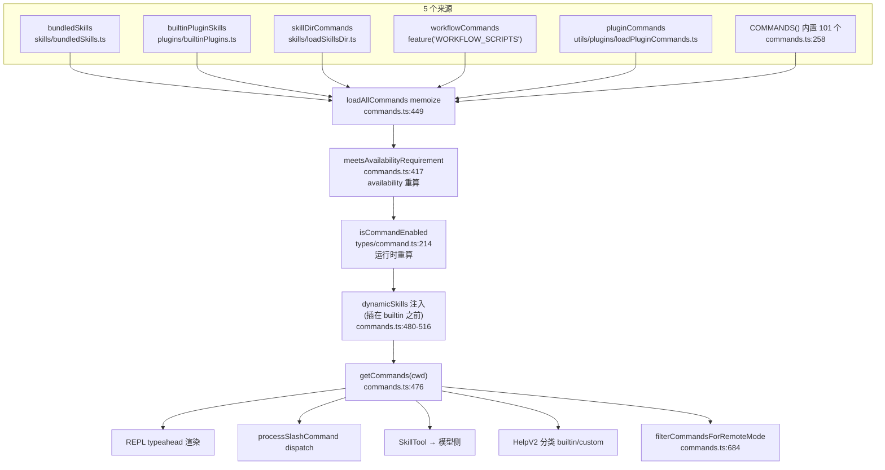

# 第 18 章 · 命令系统 —— 注册、解析、调度与 fork 编排

> 本章面向**开发者**,聚焦命令的内部机制:**注册中心、类型契约、解析层、调度核心、forked subagent、可观测性**。不重复用户视角的命令速查(`02-user/06-commands.md`)。术语以 [`00-front/03-glossary.md`](../00-front/03-glossary.md) 为准;分层坐标见 [`04-architect/25-layered-arch.md`](../04-architect/25-layered-arch.md) L2/L3 边界。

## 摘要

Claude Code 的命令系统分四层:**注册中心**(`src/commands.ts`,5 来源合并 + 缓存分层)、**类型契约**(`src/types/command.ts`,`Command = CommandBase & (PromptCommand | LocalCommand | LocalJSXCommand)`)、**解析层**(`src/utils/slashCommandParsing.ts:25-60`,返回 `{commandName, args, isMcp}`)、**调度核心**(`src/utils/processUserInput/processSlashCommand.tsx:309-524`,`switch (command.type)` 三分支)。forked subagent 走 `executeForkedSlashCommand`(`:62-295`),支持 KAIROS 助理模式的 fire-and-forget 重入队列。远端/桥模式安全白名单由 `REMOTE_SAFE_COMMANDS`(`commands.ts:619-637`,17 项)与 `BRIDGE_SAFE_COMMANDS`(`:651-660`,6 项)控制。命令 telemetry 用 `_PROTO_plugin_name`/`_PROTO_marketplace_name` 携带 plugin metadata,经 `stripProtoFields` 剥离后才上报。

## 速赢

1. **命令类型联合**:`Command = CommandBase & (PromptCommand | LocalCommand | LocalJSXCommand)`(`src/types/command.ts:205-206`)。
2. **3 种执行模型**:`prompt`(展开文本到对话)、`local`(本地函数)、`local-jsx`(异步 Promise + 渲染 JSX)。
3. **5 来源合并**(`src/commands.ts:449-516`):bundledSkills / builtinPluginSkills / skillDirCommands / workflowCommands / pluginCommands + 内置 `COMMANDS()`。
4. **缓存三层**:加载 memo / availability 重算 / isEnabled 重算(`commands.ts:528` 注释)。
5. **解析**:`parseSlashCommand` 返回 `{commandName, args, isMcp}`(`slashCommandParsing.ts:25-60`)。
6. **未知命令**:`looksLikeCommand`(`/[^a-zA-Z0-9:\-_]/`)判定;含特殊字符按普通 prompt 处理。
7. **`local-jsx immediate` 抢跑**:`handlePromptSubmit.ts:227-311` 在 `queryGuard` 占用时同步 setToolJSX。
8. **Forked subagent**:KAIROS 模式下 fire-and-forget,`enqueuePendingNotification` 重入队列。
9. **远端/桥安全**:REMOTE_SAFE(17 项)+ BRIDGE_SAFE(6 项)+ `isBridgeSafeCommand` 永禁 local-jsx。
10. **命令 telemetry**:`_PROTO_*` 字段 + `AnalyticsMetadata_I_VERIFIED_THIS_IS_NOT_CODE_OR_FILEPATHS` marker。

## 关键图

```mermaid
flowchart LR
  U["用户在 PromptInput<br/>输入 '/foo bar'"] --> PI["PromptInput.onSubmit<br/>REPL.tsx:3142"]
  PI --> HPS["handlePromptSubmit<br/>handlePromptSubmit.ts:120"]
  HPS --> EIT{"input.startsWith('/')<br/>且 cmd.immediate?"}
  EIT -- 是 --> EX["同步 setToolJSX<br/>handlePromptSubmit.ts:296-309"]
  EIT -- 否 --> QG{"queryGuard.isActive?"}
  QG -- 是 --> ENQ["enqueue 入队<br/>handlePromptSubmit.ts:336"]
  QG -- 否 --> EUI["executeUserInput<br/>handlePromptSubmit.ts:396"]
  ENQ --> EUI
  EUI --> PU["processUserInput<br/>processUserInput.ts:85"]
  PU --> PUB["processUserInputBase<br/>processUserInput.ts:281"]
  PUB --> SC{"input.startsWith('/')?"}
  SC -- 是 --> PSC["processSlashCommand<br/>processSlashCommand.tsx:309"]
  SC -- 否 --> NRM["普通 prompt 提交"]
  PSC --> PCP["parseSlashCommand<br/>slashCommandParsing.ts:25"]
  PCP --> HC{"hasCommand?"}
  HC -- 否,LLC --> UK["Unknown skill 错误<br/>processSlashCommand.tsx:347"]
  HC -- 是 --> GMS["getMessagesForSlashCommand<br/>processSlashCommand.tsx:525"]
  GMS --> CT{{"command.type"}}
  CT -- local-jsx --> LJX["load().then(mod.call)<br/>setToolJSX({isLocalJSXCommand:true})<br/>processSlashCommand.tsx:609-636"]
  CT -- local --> LOC["load() + mod.call(args, ctx)<br/>LocalCommandResult: text|compact|skip<br/>processSlashCommand.tsx:657-722"]
  CT -- prompt --> PRM["getMessagesForPromptSlashCommand<br/>processSlashCommand.tsx:827"]
  PRM --> FK{"command.context==='fork'?"}
  FK -- 是 --> FKD["executeForkedSlashCommand<br/>processSlashCommand.tsx:62-295"]
  FK -- 否 --> GT["getPromptForCommand(args, ctx)<br/>types/command.ts:53"]
  FKD -.KAIROS.-> ENQP["enqueuePendingNotification<br/>重入为 isMeta prompt"]
```





## 详细机制

### 18.1 三种执行模型

`src/types/command.ts:205-206`:

```ts
export type Command = CommandBase & (
  | PromptCommand
  | LocalCommand
  | LocalJSXCommand
)
```

#### 18.1.1 `PromptCommand`

- `type: 'prompt'`(`:25-57`)
- 关键字段:`progressMessage`、`contentLength`、`allowedTools`、`model`、`source`、`pluginInfo`、`hooks`、`context: 'inline' | 'fork'`、`agent`、`effort`、`paths`(glob gating)、`getPromptForCommand(args, context)`
- **执行流程**:`getMessagesForPromptSlashCommand`(`processSlashCommand.tsx:827-921`)→ `command.getPromptForCommand(args, ctx)` → 把返回的 `ContentBlockParam[]` 作为 user message 注入对话 → 下一轮 model turn 自动看到 skill 内容。
- **`context: 'fork'`**:触发 `executeForkedSlashCommand`(`processSlashCommand.tsx:62-295`),开子 agent。

#### 18.1.2 `LocalCommand`

- `type: 'local'`(`:74-78`)
- `supportsNonInteractive` + `load()` 返回 `LocalCommandModule`
- **执行流程**(`processSlashCommand.tsx:657-722`):
  ```ts
  const mod = await command.load()
  const result = await mod.call(args, context)
  // result.type: 'text' | 'compact' | 'skip'
  ```
- 三种结果:
  - `text` → `<local-command-stdout>` 用户消息
  - `compact` → `buildPostCompactMessages` 加 slash-command 消息到保留集
  - `skip` → 空消息
- **`isSensitive && args.trim()`**:`displayArgs = '***'`(`:659`),args 不进对话历史。

#### 18.1.3 `LocalJSXCommand`

- `type: 'local-jsx'`(`:144-152`)
- `LocalJSXCommandCall = (onDone, context, args) => Promise<ReactNode>`(`:131-135`)
- **执行流程**(`processSlashCommand.tsx:551-655`):
  ```ts
  new Promise<SlashCommandResult>(resolve => {
    const onDone = (result, options) => {
      // display: 'skip' | 'system' | 'user'
      // options: { shouldQuery, metaMessages, nextInput, submitNextInput }
      resolve(...)
    }
    command.load().then(mod => mod.call(onDone, context, args))
      .then(jsx => setToolJSX({
        jsx,
        shouldHidePromptInput: true,
        isLocalJSXCommand: true,
        isImmediate: cmd.immediate,
      }))
  })
  ```
- **doneWasCalled 防重入**(`processSlashCommand.tsx:622-654`):`onDone` 与 `setToolJSX` 顺序敏感,缺一则 `queryGuard` 卡死。

### 18.2 注册中心 `src/commands.ts`

#### 18.2.1 缓存分层

| 层 | 函数 | 是否 memo | 失效时机 |
|---|---|---|---|
| 加载 | `loadAllCommands(cwd)` | **memoize**(按 cwd) | `clearCommandMemoizationCaches()` |
| 可用性 | `meetsAvailabilityRequirement(cmd)` | 不 memo | 每次重算 |
| 启用 | `isCommandEnabled(cmd)` | 不 memo | 每次重算 |

`commands.ts:528` 注释解释为何分两层缓存:加载慢(skill 目录扫描、plugin manifest 解析),但 availability/enable 是动态的(GrowthBook、settings 实时变化)。

#### 18.2.2 `COMMANDS` 数组

`commands.ts:258-346`:

```ts
const COMMANDS = memoize((): Command[] => [
  addDir, advisor, agents, branch, btw, chrome, clear, color,
  compact, config, copy, desktop, context, ..., tasks,
  ...(workflowsCmd ? [workflowsCmd] : []),
  ...(process.env.USER_TYPE === 'ant' && !process.env.IS_DEMO
    ? INTERNAL_ONLY_COMMANDS
    : []),
])
```

`INTERNAL_ONLY_COMMANDS`(`:225-254`)仅在 ant 内部可见(commitPushPr、share、teleport、summary、env、oauthRefresh 等)。

#### 18.2.3 `getCommands(cwd)` 的合并顺序

`commands.ts:476-517`:
1. **bundledSkills**(Bash 启动时初始化,稳定)
2. **builtinPluginSkills**(每个 build 内置)
3. **skillDirCommands**(`~/.claude/skills/`、`<cwd>/.claude/skills/` 扫描)
4. **workflowCommands**(`feature('WORKFLOW_SCRIPTS')` 才加载)
5. **pluginCommands**(从已加载 plugin 的 manifest 提取)
6. **pluginSkills**(plugin 暴露的 prompt-type skills)
7. **COMMANDS()** 内置 101 项

合并后**动态技能插在 builtin 之前**(而非末尾)——这是为了 typeahead 时用户技能优先级高于通用命令。

#### 18.2.4 安全白名单

- **`REMOTE_SAFE_COMMANDS`**(`:619-637`):17 项,`--remote` 模式下允许的命令(session、exit、clear、help、theme、color、vim、cost、usage、copy、btw、feedback、plan、keybindings、statusline、stickers、mobile)。
- **`BRIDGE_SAFE_COMMANDS`**(`:651-660`):6 项,bridge(手机/网页)来源的 `local` 命令白名单(compact、clear、cost、summary、releaseNotes、files)。
- **`isBridgeSafeCommand(cmd)`**(`:672-676`):`prompt` 默认安全;`local-jsx` **永远禁止**;`local` 需在 `BRIDGE_SAFE_COMMANDS` 内。
- **`filterCommandsForRemoteMode(commands)`**(`:684-686`):REPL 渲染前预过滤。

#### 18.2.5 缓存失效

```ts
// src/commands.ts:523-539
export function clearCommandMemoizationCaches(): void {
  loadAllCommands.cache.clear?.()
  builtInCommandNames.cache.clear?.()
  // 同时清掉 plugin/skill 索引缓存,避免 lodash memoize 残留
  clearSkillIndexCache()
}

export function clearCommandsCache(): void {
  // 完整链路清理
}
```

触发时机:`/login` 改变 auth、`/reload-plugins` 显式刷新、settings 切换 provider。

### 18.3 解析层

#### 18.3.1 `parseSlashCommand`

`src/utils/slashCommandParsing.ts:25-60`:

```ts
export function parseSlashCommand(input: string): ParsedSlashCommand | null {
  const trimmedInput = input.trim()
  if (!trimmedInput.startsWith('/')) return null

  const withoutSlash = trimmedInput.slice(1)
  const words = withoutSlash.split(' ')

  if (!words[0]) return null

  let commandName = words[0]
  let isMcp = false
  let argsStartIndex = 1

  // 第二个 token 是 (MCP) → MCP 命令
  if (words.length > 1 && words[1] === '(MCP)') {
    commandName = commandName + ' (MCP)'
    isMcp = true
    argsStartIndex = 2
  }

  const args = words.slice(argsStartIndex).join(' ')

  return { commandName, args, isMcp }
}
```

边界:
- 不以 `/` 开头 → `null`(调用方按普通 prompt 处理)
- 只有 `/` → `null`(空命令)
- args 用单空格拼接,丢失原间距 → 高保真场景不要依赖 args 切词。

#### 18.3.2 未知命令分发

`processSlashCommand.tsx:333-381`:

```ts
if (!hasCommand(commandName, context.options.commands)) {
  let isFilePath = false
  try {
    await getFsImplementation().stat(`/${commandName}`)
    isFilePath = true
  } catch { /* 不是文件路径 */ }

  if (looksLikeCommand(commandName) && !isFilePath) {
    logEvent('tengu_input_slash_invalid', { input: commandName as AnalyticsMetadata_I_VERIFIED_THIS_IS_NOT_CODE_OR_FILEPATHS })
    return { messages: [/* Unknown skill 错误 */] }
  }
  // 看起来像文件路径 → 按普通 prompt 提交,让模型决定
}
```

`looksLikeCommand`(`:304-308`)用正则 `/[^a-zA-Z0-9:\-_]/`:
- 通过 → 用户**以为**是命令名,但系统不认识 → 显式 Unknown skill 错误;
- 不通过 → 可能是 `/etc/hosts` 这种路径 → 按普通 prompt 让模型处理。

### 18.4 调度核心 `processSlashCommand`

#### 18.4.1 入口

`src/utils/processUserInput/processSlashCommand.tsx:309`:

```ts
export async function processSlashCommand(
  inputString: string,
  precedingInputBlocks: ContentBlockParam[],
  imageContentBlocks: ContentBlockParam[],
  attachmentMessages: AttachmentMessage[],
  context: ProcessUserInputContext,
  setToolJSX: SetToolJSXFn,
  uuid?: string,
  isAlreadyProcessing?: boolean,
  canUseTool?: CanUseToolFn,
): Promise<ProcessUserInputBaseResult>
```

#### 18.4.2 关键步骤

1. `parseSlashCommand`(`:310`)→ null 返回错误。
2. `sanitizedCommandName = isMcp ? 'mcp' : !builtInCommandNames().has(name) ? 'custom' : name`(`:330`)。
3. `hasCommand` → 未命中走 18.3.2 分支。
4. `getMessagesForSlashCommand`(`:525`)分发:
   - `case 'local-jsx'`(`:551-656`):Promise 包裹异步 mod.call,setToolJSX,监听 onDone。
   - `case 'local'`(`:657-722`):sync load + call,根据 result 类型构造 messages。
   - `case 'prompt'`(`:723-760`):`context === 'fork'` 走 `executeForkedSlashCommand`;否则 `getMessagesForPromptSlashCommand`。

#### 18.4.3 空消息早退

`processSlashCommand.tsx:398-450`:local 命令 no-op 时(返回 `{type:'skip'}` 且无 nextInput),不调 `onQuery`,避免空 turn 触发 spinner。同步发送 `tengu_input_command` telemetry。

#### 18.4.4 Plugin telemetry 字段

`processSlashCommand.tsx:469-523` 在 plugin 命令的正常路径上加 `_PROTO_*` 字段:

```ts
logEvent('tengu_input_command', {
  command_name: command.name as AnalyticsMetadata_I_VERIFIED_THIS_IS_NOT_CODE_OR_FILEPATHS,
  ...(command.pluginInfo && {
    _PROTO_plugin_name: command.pluginInfo.pluginManifest.name as AnalyticsMetadata_I_VERIFIED_THIS_IS_PII_TAGGED,
    ...buildPluginCommandTelemetryFields(command.pluginInfo),
  }),
})
```

`_PROTO_*` 字段经 `stripProtoFields`(`src/services/analytics/index.ts:44-57`)剥离,只给 SDK consumer 透传,不上报 Datadog。

### 18.5 Forked subagent 编排

#### 18.5.1 `executeForkedSlashCommand`

`processSlashCommand.tsx:62-295`:
- 构造独立 `agentId`、`agentDefinition`。
- 调 `prepareForkedCommandContext` 准备独立 context + baseAgent。
- `logForDebugging('Executing forked slash command /${name} with agent ${type}')`。

#### 18.5.2 KAIROS 助理模式

`processSlashCommand.tsx:90-134`(注释详细):
- **设计原因**:N 个 cron-scheduled 任务如果全部同步等,串行执行;fire-and-forget 后并行跑,完成后才把结果重入主 agent 的 isMeta 消息。
- **生命周期**:
  1. `bgAbortController = createAbortController()`(后台子 agent 抗 ESC);
  2. `spawnTimeWorkload = getWorkload()`(从 AsyncLocalStorage 取 cron tag);
  3. `enqueuePendingNotification({ value, mode:'prompt', isMeta:true, skipSlashCommands:true, workload })` 注册回调;
  4. `void (async () => { ... runAgent(...).then(enqueueResult) })` 异步跑。

#### 18.5.3 MCP settle 等待

`processSlashCommand.tsx:140-146`:
```ts
const deadline = Date.now() + MCP_SETTLE_TIMEOUT_MS  // 10s
while (Date.now() < deadline) {
  const s = context.getAppState()
  if (!s.mcp.clients.some(c => c.type === 'pending')) break
  await sleep(MCP_SETTLE_POLL_MS)  // 200ms
}
```

> Scheduled tasks 在启动时全部 drain,如果不等待 MCP 完成,会捕获到 stale `tools` 列表。

### 18.6 上游入口

`src/utils/processUserInput/processUserInput.ts` + `src/utils/handlePromptSubmit.ts` 串联:

```
REPL.onSubmit (REPL.tsx:3142)
  → handlePromptSubmit (handlePromptSubmit.ts:120)
    → 早退:exit/quit 改写为 /exit (handlePromptSubmit.ts:204)
    → 早退:local-jsx immediate 同步 setToolJSX (handlePromptSubmit.ts:296-309)
    → queryGuard 占用 → enqueue (handlePromptSubmit.ts:336)
    → executeUserInput (handlePromptSubmit.ts:396)
      → 每次新建 AbortController
      → queryGuard.reserve() + runWithWorkload (AsyncLocalStorage)
      → processUserInput (processUserInput.ts:85)
        → processUserInputBase (processUserInput.ts:281)
          → ULTRAPLAN 关键字捕获 (processUserInput.ts:467-493)
          → slash 命令分发 (processUserInput.ts:531-551)
```

### 18.7 命令元数据

`CommandBase`(`src/types/command.ts:175-203`)字段:

| 字段 | 用途 |
|---|---|
| `name` / `aliases` | 命令名;`aliases` 用于 `/cls` ↔ `/clear` |
| `description` | 一行说明,typeahead 与 help 显示 |
| `argumentHint` | 参数提示,显示在命令名右侧灰色文本 |
| `whenToUse` | 详细使用场景(模型侧 prompt) |
| `progressMessage` | 执行期间 spinner 文案 |
| `isHidden` | 不在 typeahead/help 显示 |
| `disableModelInvocation` | 模型不能 Skill tool 调,只能用户 |
| `userInvocable` | 用户不能输入 `/`,只能模型调 |
| `immediate` | local-jsx 抢跑,绕过 queryGuard 队列 |
| `isSensitive` | args 在历史面板打码 |
| `kind: 'workflow'` | typeahead 中显示特殊 badge |
| `loadedFrom` | 来源,UI 描述后缀标注 |
| `userFacingName()` | UI 显示名(覆盖 name) |

### 18.8 添加新命令的步骤

1. **创建命令目录**:`src/commands/<name>/`,含 `index.ts` + 实现文件。
2. **声明 type 联合**:三选一。
3. **实现 `load()`**:返回 `Promise<Module>`,内部用 dynamic import 拉重型依赖。
4. **添加到 `commands.ts`**:`COMMANDS` 数组或条件 push。
5. **(可选) `feature()` 守门**:实验性命令走 `feature('YOUR_FLAG')` 模式。
6. **(可选) 命令描述 + icon + badge**。
7. **(可选) 命令 telemetry hook**。
8. **测试**:`src/commands/<name>/__tests__/`。

### 18.9 关键 telemetry 事件

| 事件名 | 触发时机 | 字段 |
|---|---|---|
| `tengu_input_slash_missing` | 输入不以 `/` 开头 | `{}` |
| `tengu_input_slash_invalid` | 未知命令名 | `input` (marker cast) |
| `tengu_input_command` | 命令成功执行 | `command_name` + `_PROTO_plugin_*` |
| `tengu_slash_command_forked` | `context: 'fork'` 启动 | 同上 + `invocation_trigger` |
| `tengu_immediate_command_executed` | local-jsx immediate 抢跑 | `command_name` |

## 反模式

### ❌ 在 `COMMANDS` 数组中直接 `require()` 重型依赖

```ts
// 错误:即使 feature 关闭,模块也会被加载
const voiceCommand = require('./commands/voice/index.js').default

// 正确:用 feature() 守门 + lazy require
const voiceCommand = feature('VOICE_MODE')
  ? require('./commands/voice/index.js').default
  : null
```

> `feature()` 必须在 if/三元条件位,否则 `bun:bundle` 无法 tree-shake。

### ❌ `local-jsx` 不监听 `onDone`

```tsx
// 错误:命令永不结束,queryGuard 永久卡在 dispatching
async function call(_onDone, ctx, args) {
  return <MyUI />
}

// 正确:完成时调 onDone
async function call(onDone, ctx, args) {
  // ... 渲染
  onDone('done', { display: 'user' })
  return <MyUI />
}
```

### ❌ Forked 命令捕获外层 AbortController

```ts
// 错误:ESC 会把 cron 子 agent 一起杀掉
async function executeForked(cmd, args, ctx) {
  return runAgent(agentDef, prompt, { abortController: ctx.abortController })
}

// 正确:用独立的 bgAbortController(ant 模式下后台任务抗 ESC)
const bgAbortController = createAbortController()
return runAgent(agentDef, prompt, { abortController: bgAbortController })
```

### ❌ 在 `local` 命令里返回复杂 React 树

```ts
// 错误:LocalCommandResult 不支持 JSX
async function call(args, ctx) {
  return { type: 'text', value: <MyUI /> }
}

// 正确:text/compact/skip 三选一;想要 JSX → 用 local-jsx
```

### ❌ 命令名含非 `[a-zA-Z0-9:_-]` 字符

```ts
// 错误:`looksLikeCommand` 会判定为非命令,按普通 prompt 处理
{ name: 'my command!' }

// 正确
{ name: 'my-command', aliases: ['mc'] }
```

### ❌ 修改 `commands.ts` 不更新 `getCommands` 缓存

```ts
// 错误:运行时新加的命令看不到
const COMMANDS = memoize((): Command[] => [...])
// 没调 clearCommandMemoizationCaches → 缓存不刷新
```

> 测试时记得在 setup/teardown 调 `clearCommandsCache()`,否则上一次测试残留的 memoize 影响下一轮。

### ❌ 远端/桥模式不预过滤命令

```tsx
// 错误:把 local-jsx 命令暴露给手机 bridge,用户点了会卡住
<PromptInput commands={allCommands} />

// 正确
<PromptInput commands={filterCommandsForRemoteMode(allCommands)} />
```

## 引用与下一步

### 前置
- `00-front/03-glossary.md`
- `02-user/06-commands.md` —— 用户视角的命令速查
- `03-developer/16a-conditional-commands.md` —— conditional command 实战

### 平行
- `03-developer/19-ui-patterns.md` —— 命令补全 typeahead 引擎
- `03-developer/20-schemas.md` —— CommandResultDisplay schema
- `03-developer/22-telemetry.md` —— _PROTO_* 字段的剥离流程

### 后继
- `03-developer/24-workflow.md` —— hook 总线与 task 编排

### 源码定位

| 主题 | 路径:行 |
|---|---|
| Command 类型联合 | `src/types/command.ts:205-206` |
| PromptCommand 定义 | `src/types/command.ts:25-57` |
| LocalCommand 定义 | `src/types/command.ts:74-78` |
| LocalJSXCommand 定义 | `src/types/command.ts:144-152` |
| LocalJSXCommandOnDone | `src/types/command.ts:117-126` |
| CommandAvailability | `src/types/command.ts:169-172` |
| `getCommandName` | `src/types/command.ts:209-211` |
| `isCommandEnabled` | `src/types/command.ts:214-216` |
| `COMMANDS` 数组 | `src/commands.ts:258-346` |
| INTERNAL_ONLY_COMMANDS | `src/commands.ts:225-254` |
| builtInCommandNames | `src/commands.ts:348-351` |
| `getSkills` | `src/commands.ts:353-398` |
| `getWorkflowCommands` | `src/commands.ts:401-406` |
| `meetsAvailabilityRequirement` | `src/commands.ts:417-443` |
| `loadAllCommands` | `src/commands.ts:449-469` |
| `getCommands(cwd)` | `src/commands.ts:476-517` |
| `clearCommandMemoizationCaches` | `src/commands.ts:523-532` |
| `clearCommandsCache` | `src/commands.ts:534-539` |
| `getMcpSkillCommands` | `src/commands.ts:547-559` |
| `getSkillToolCommands` | `src/commands.ts:563-581` |
| `getSlashCommandToolSkills` | `src/commands.ts:586-608` |
| REMOTE_SAFE_COMMANDS | `src/commands.ts:619-637` |
| BRIDGE_SAFE_COMMANDS | `src/commands.ts:651-660` |
| `isBridgeSafeCommand` | `src/commands.ts:672-676` |
| `filterCommandsForRemoteMode` | `src/commands.ts:684-686` |
| `findCommand` / `hasCommand` | `src/commands.ts:688-702` |
| `getCommand` | `src/commands.ts:704-719` |
| `formatDescriptionWithSource` | `src/commands.ts:728-754` |
| `parseSlashCommand` | `src/utils/slashCommandParsing.ts:25-60` |
| `ParsedSlashCommand` | `src/utils/slashCommandParsing.ts:5-9` |
| `executeForkedSlashCommand` | `src/utils/processUserInput/processSlashCommand.tsx:62-295` |
| `looksLikeCommand` | `src/utils/processUserInput/processSlashCommand.tsx:304-308` |
| `processSlashCommand` | `src/utils/processUserInput/processSlashCommand.tsx:309-524` |
| `getMessagesForSlashCommand` | `src/utils/processUserInput/processSlashCommand.tsx:525-777` |
| `local-jsx` case | `src/utils/processUserInput/processSlashCommand.tsx:551-656` |
| `local` case | `src/utils/processUserInput/processSlashCommand.tsx:657-722` |
| `prompt` case | `src/utils/processUserInput/processSlashCommand.tsx:723-760` |
| `formatCommandInput` | `src/utils/processUserInput/processSlashCommand.tsx:778-780` |
| `formatSlashCommandLoadingMetadata` | `src/utils/processUserInput/processSlashCommand.tsx:794-796` |
| `getMessagesForPromptSlashCommand` | `src/utils/processUserInput/processSlashCommand.tsx:827-921` |
| MCP settle 常量 | `src/utils/processUserInput/processSlashCommand.tsx:53-57` |
| `processUserInput` | `src/utils/processUserInput/processUserInput.ts:85-270` |
| `processUserInputBase` | `src/utils/processUserInput/processUserInput.ts:281-605` |
| ULTRAPLAN 关键字捕获 | `src/utils/processUserInput/processUserInput.ts:467-493` |
| slash 命令分发 | `src/utils/processUserInput/processUserInput.ts:531-551` |
| `handlePromptSubmit` | `src/utils/handlePromptSubmit.ts:120-395` |
| exit/quit 改写 | `src/utils/handlePromptSubmit.ts:204-211` |
| local-jsx immediate 早退 | `src/utils/handlePromptSubmit.ts:227-311` |
| enqueue 路径 | `src/utils/handlePromptSubmit.ts:313-351` |
| `executeUserInput` | `src/utils/handlePromptSubmit.ts:396-601` |
| `runWithWorkload` 包裹 | `src/utils/handlePromptSubmit.ts:430-472` |
| `onQuery` 调用 | `src/utils/handlePromptSubmit.ts:541-571` |
| 空消息分支 | `src/utils/handlePromptSubmit.ts:572-586` |
| `onSubmit` (REPL) | `src/screens/REPL.tsx:3142` |
| `await handlePromptSubmit` | `src/screens/REPL.tsx:3490-3519` |
