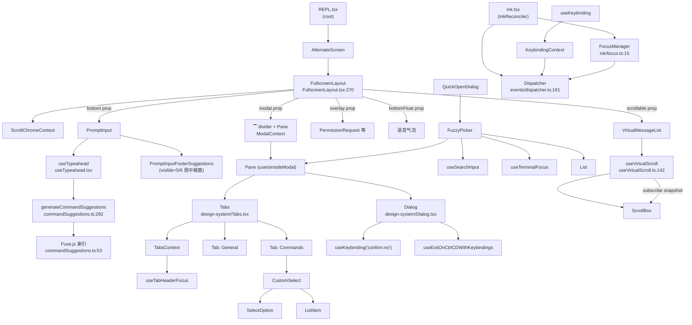

# 第 19 章 · UI 开发模式 —— 组件、焦点、Modal、虚拟列表

> 本章面向**开发者**,聚焦 Claude Code TUI 的内部开发模式:**设计系统原语、Modal/Fullscreen 框架、自定义 Select、FuzzyPicker、Typeahead、焦点管理、事件分发、键绑定、虚拟列表**。不重复用户视角的 UI 总览(`02-user/10-ui.md`)。术语以 [`00-front/03-glossary.md`](../00-front/03-glossary.md) §F.1–F.5 为准;渲染栈细节见 [`02-user/10-ui.md`](../02-user/10-ui.md)。

## 摘要

Claude Code TUI 是 React + Ink + Yoga + ANSI 四层栈,组件层分三大模块:**设计系统原语**(`src/components/design-system/`,Dialog/Pane/Tabs/Divider/ListItem/FuzzyPicker)、**CustomSelect**(`src/components/CustomSelect/`,reducer 显式 `focusedValue` 而非 DOM focus)、**Ink 内部**(`src/ink/focus.ts`、`src/ink/events/dispatcher.ts`、`src/keybindings/`)。Modal 由 `FullscreenLayout.tsx:421-434` 的 `<ModalContext>` 提供,内部 `Pane` 据 `useIsInsideModal()` 跳过 `Divider` 包装。虚拟列表 `useVirtualScroll`(`src/hooks/useVirtualScroll.ts:142`)用 5 个常量调参:`OVERSCAN_ROWS=80`、`SCROLL_QUANTUM=40`、`MAX_MOUNTED_ITEMS=300`、`SLIDE_STEP=25`、`PESSIMISTIC_HEIGHT=1`。Typeahead 引擎(`src/utils/suggestions/commandSuggestions.ts`)用 Fuse.js 多 key 加权(`commandName:3 / partKey:2 / aliasKey:2 / descriptionKey:0.5`,`threshold:0.3`)。焦点管理有三套独立机制:Ink `FocusManager.activeElement`、CustomSelect 显式 `focusedValue` reducer、Keybinding `activeContexts` —— **不要混用**。

## 速赢

1. **设计系统 7 类原语**:Dialog / Pane / Tabs / Divider / ListItem / FuzzyPicker / StatusIcon。
2. **Pane 在 modal 内跳过 Divider**:`useIsInsideModal()` 短路(`Pane.tsx:39-49`)。
3. **Modal slot 终端尺寸**:`terminalRows - MODAL_TRANSCRIPT_PEEK - 1`(`FullscreenLayout.tsx:421-434`)。
4. **CustomSelect 用 reducer**:state.focusedValue 显式字段,非 DOM focus。
5. **Typeahead Fuse.js**:多 key 加权,缓存按 commands 数组身份。
6. **FocusManager 纯 state**:挂在 root DOMElement;MAX 32 栈深(`ink/focus.ts:4`)。
7. **Dispatcher 优先级**:keydown/click/focus → Discrete;resize/scroll → Continuous(`dispatcher.ts:122-138`)。
8. **键绑定上下文**:`KeybindingContext` + `useKeybinding('action', handler, { context, isActive })`。
9. **虚拟列表常量**:OVERSCAN 80 / QUANTUM 40 / MAX_MOUNTED 300 / SLIDE 25 / PESSIMISTIC 1。
10. **Sticky 量化**:wheel tick 不触发 React 渲染;`useSyncExternalStore` snapshot 必须 Object.is 等价。

## 关键图



## 详细机制

### 19.1 设计系统原语

#### 19.1.1 `Pane`(`src/components/design-system/Pane.tsx:1-76`)

两种渲染分支:
```tsx
export function Pane({ children, color, hideBorder }) {
  if (useIsInsideModal()) {
    return <Box flexDirection="column">{children}</Box>  // 跳过 Divider
  }
  return (
    <>
      <Divider color={color} />
      <Box flexDirection="column" paddingX={2}>
        {children}
      </Box>
    </>
  )
}
```

> `Pane` 是 `/config`、`/help`、`/plugins`、`/sandbox`、`/stats`、`/permissions` 等所有模态框的容器。

#### 19.1.2 `Dialog`(`src/components/design-system/Dialog.tsx:1-137`)

- `color?: keyof Theme`(默认 `'permission'`)
- `onCancel`、`isCancelActive`(默认 true;TextInput 聚焦时设 false 让 Esc 落到输入框)
- 默认 inputGuide:`Enter confirm` + `Esc cancel`
- `hideBorder` 跳过 `<Pane>` 包装(用于嵌入已存在 frame)

```tsx
export function Dialog({ onCancel, isCancelActive = true, ... }) {
  useExitOnCtrlCDWithKeybindings(undefined, undefined, isCancelActive)
  useKeybinding('confirm:no', onCancel, { context: 'Confirmation', isActive })
  // ...
}
```

#### 19.1.3 `Tabs`(`src/components/design-system/Tabs.tsx:1-220+`)

- `TabsContext` 提供 `headerFocused / focusHeader / blurHeader / registerOptIn`
- `useTabHeaderFocus()` 暴露 `headerFocused / focusHeader`
- Tab 切换用 `key={selectedTabIndex}` 强制重挂以重置 scrollTop
- `useKeybindings({ tabs:next, tabs:previous }, { context: 'Tabs', isActive })`(`:135-150`)

#### 19.1.4 `FuzzyPicker`(`src/components/design-system/FuzzyPicker.tsx:68-217`)

通用模糊选择器:
- `CHROME_ROWS = 10`(Pane + Divider + title + gaps + SearchBox rounded border + hints)
- `visibleCount = rows - CHROME_ROWS - (matchLabel ? 1 : 0)`
- `compact = columns < 120`(窄屏简化 hint 标签)
- `useSearchInput({ isActive, onExit: NOOP, onCancel })`:注意 `onExit` 必须 no-op,因为 `return/downArrow` 已被 `handleKeyDown` 接管
- 滑动窗口:`windowStart = clamp(focusedIndex - visibleCount + 1, ...)`

```tsx
useEffect(() => {
  onQueryChange(query)
  setFocusedIndex(0)
}, [query])
```

### 19.2 CustomSelect 与多选

#### 19.2.1 显式 `focusedValue`

`src/components/CustomSelect/use-select-state.ts`、`use-select-input.ts`:
- `focusedValue` 是显式 state 字段,**而非 DOM focus**;
- 键盘导航纯 reducer 状态(`SetFocusedValue`、`StepDown`、`StepUp` 等);
- `SelectOption.isFocused` 字段决定渲染箭头。

```tsx
// select-option.tsx:6-8
type SelectOptionProps<T> = {
  value: T
  isFocused: boolean
  // ...
}

export function SelectOption<T>({ isFocused, ...rest }: SelectOptionProps<T>) {
  return (
    <ListItem isFocused={isFocused} isSelected={...} ...>
      {/* ... */}
    </ListItem>
  )
}
```

#### 19.2.2 多选变体

`SelectMulti.tsx` + `use-multi-select-state.ts`:
- 额外 `selected: Set<T>` 状态;
- Space 切换选中;
- Enter 确认所有选中。

### 19.3 焦点管理(`src/ink/focus.ts`)

#### 19.3.1 FocusManager

```ts
// ink/focus.ts:15-132
export class FocusManager {
  activeElement: DOMElement | null = null
  focusStack: DOMElement[] = []  // MAX 32
  dispatchFocusEvent: (target: DOMElement, event: FocusEvent) => void

  focus(node: DOMElement): void { /* 同步 dispatch blur + focus */ }
  blur(): void { /* ... */ }
  handleNodeRemoved(node: DOMElement, root: DOMElement): void { /* 节点删除时从栈回退 */ }
  focusNext(root: DOMElement): void { /* collectTabbable + 循环步进 */ }
  focusPrevious(root: DOMElement): void { /* 同上反向 */ }
}
```

> **栈深度限制 32**:避免 Tab 循环无界增长(`ink/focus.ts:4` 注释)。

#### 19.3.2 Tab/Shift+Tab 入口

```ts
// ink/ink.tsx:1270-1278
case 'Tab':
  if (e.shiftKey) this.focusManager.focusPrevious(this.rootNode)
  else this.focusManager.focusNext(this.rootNode)
  break
```

#### 19.3.3 删除节点回退

`ink/focus.ts:57-82`:
```ts
handleNodeRemoved(node, root) {
  // 从 focusStack 剔除 node 及其后代
  // 若 activeElement 在子树内,回退到栈顶最近仍 mounted 元素
}
```

### 19.4 事件分发与优先级

#### 19.4.1 Dispatcher

`src/ink/events/dispatcher.ts`:
- `DispatchListener = { node, handler, phase }`
- `collectListeners`:从 target 上行至 root;capture 用 unshift,bubble 用 push
- `processDispatchQueue`:依次调用;`event._isPropagationStopped()` 控制

#### 19.4.2 优先级

`dispatcher.ts:122-138`:
```ts
function getEventPriority(type: string): EventPriority {
  switch (type) {
    case 'keydown':
    case 'keyup':
    case 'click':
    case 'focus':
    case 'blur':
    case 'paste':
      return 'discrete'
    case 'resize':
    case 'scroll':
    case 'mousemove':
      return 'continuous'
  }
}
```

`dispatchDiscrete` 立即处理;`dispatchContinuous` 可合并到下一帧。

### 19.5 键绑定(`src/keybindings/`)

#### 19.5.1 Schema

`src/keybindings/schema.ts:11-228`:
- `KEYBINDING_CONTEXTS`:所有上下文名
- `KEYBINDING_ACTIONS`:所有 action 名
- `KeybindingBlockSchema`、`KeybindingsSchema`

```ts
const actionSchema = z.union([
  z.enum(KEYBINDING_ACTIONS),
  z.string().regex(/^command:[a-zA-Z0-9:\-_]+$/),
  z.null(),
])
```

#### 19.5.2 Context + Handler

```ts
// KeybindingContext.tsx:7-12
type HandlerRegistration = { action: string, context: string, handler: () => void }

// KeybindingContext.tsx:83-107
function registerHandler(action, context, handler) {
  let set = handlers.get(action)
  if (!set) handlers.set(action, set = new Set())
  set.add({ action, context, handler })
  return () => set.delete(...)  // unsub
}
```

#### 19.5.3 `useKeybinding`

```ts
useKeybinding('confirm:no', onCancel, { context: 'Confirmation', isActive })
useKeybindings({ 'tabs:next': next, 'tabs:previous': previous }, { context: 'Tabs', isActive })
```

`isActive: false` 时不消费事件;多个 modal 嵌套时,只最里层 modal `isActive=true`。

#### 19.5.4 Chord 等待

`KeybindingContext` 支持多键组合:`pendingChord` ref 持有第一键,等下一键。

### 19.6 Modal 框架

#### 19.6.1 FullscreenLayout

`src/components/FullscreenLayout.tsx:270-459`:

```tsx
<FullscreenLayout
  scrollable={<Messages />}
  bottom={<PromptInput />}
  overlay={<PermissionRequest />}
  bottomFloat={<VoiceBubble />}
  modal={<Dialog />}
/>
```

modal slot 渲染:
```tsx
<ModalContext.Provider value={{
  rows: terminalRows - MODAL_TRANSCRIPT_PEEK - 1,  // 20
  columns: columns - 4,
  scrollRef: modalScrollRef ?? null,
}}>
  <Text>▔</Text>
  <Box position="absolute" paddingX={2}>
    {modal}
  </Box>
</ModalContext.Provider>
```

#### 19.6.2 ModalContext

`src/context/modalContext.tsx:22-57`:
- `ModalCtx = { rows, columns, scrollRef }`
- `useIsInsideModal()`:`useContext(ModalContext) !== null`
- `useModalOrTerminalSize(fallback)`:modal 内用 modal 大小,外用 terminal
- `useModalScrollRef()`:取出 modal 内的 ScrollBox ref

#### 19.6.3 隐藏的 transcript 行

`MODAL_TRANSCRIPT_PEEK = 2`(`FullscreenLayout.tsx:20`):modal 上方保留 2 行 transcript 行,避免完全遮蔽上下文。

### 19.7 Typeahead 引擎

#### 19.7.1 Fuse.js 索引

`src/utils/suggestions/commandSuggestions.ts:24-80`:
```ts
function getCommandFuse(commands: Command[]) {
  return new Fuse(commands.map(c => ({
    commandName: c.name,
    partKey: c.name.replace(/[:_-]/g, ' '),
    aliasKey: (c.aliases ?? []).join(' '),
    descriptionKey: c.description,
  })), {
    keys: [
      { name: 'commandName', weight: 3 },
      { name: 'partKey', weight: 2 },
      { name: 'aliasKey', weight: 2 },
      { name: 'descriptionKey', weight: 0.5 },
    ],
    threshold: 0.3,
    location: 0,
    distance: 100,
    useExtendedSearch: false,
  })
}
```

> 缓存按 `commands` 数组身份:相同引用不重建索引。

#### 19.7.2 中输入 slash 命令

`commandSuggestions.ts:99-114`:`MidInputSlashCommand` —— 输入中(非开头)的 `/xxx`,例如 `git log /clear`。

#### 19.7.3 建议项

`src/components/PromptInput/PromptInputFooterSuggestions.tsx:9-18`:
```ts
type SuggestionItem = {
  id: string
  displayText: string
  tag?: string
  description?: string
  metadata?: unknown
  color?: string
}
type SuggestionType = 'command' | 'file' | 'directory' | 'agent' | 'shell' | 'custom-title' | 'slack-channel' | 'none'
```

`OVERLAY_MAX_ITEMS = 5`(浮层上限)。
居中裁窗:`startIndex = clamp(selected - floor(visible/2), 0, len - visible)`。

#### 19.7.4 useTypeahead

`src/hooks/useTypeahead.tsx:33-42`:
```ts
const SEPARATORS = /[:_-]/g
const TOKEN_REGEX = /[\p{L}\p{N}\p{M}]+/u  // Unicode-aware
```

返回:
```ts
type UseTypeaheadResult = {
  suggestions: SuggestionItem[]
  selectedSuggestion: number
  suggestionType: SuggestionType
  maxColumnWidth: number
  commandArgumentHint: string | undefined
  inlineGhostText: string | undefined
  handleKeyDown: (key: string) => boolean
}
```

> `TextInput` 自身处理 onSubmit;`useTypeahead` 仅负责候选导航。

### 19.8 虚拟列表

#### 19.8.1 五个常量

`src/hooks/useVirtualScroll.ts:24-57`:

| 常量 | 值 | 含义 |
|---|---|---|
| `OVERSCAN_ROWS` | 80 | 视口外预渲染行数 |
| `SCROLL_QUANTUM` | 40 | `OVERSCAN >> 1`;useSyncExternalStore 量化阈值 |
| `MAX_MOUNTED_ITEMS` | 300 | 单次 mount 上限 |
| `SLIDE_STEP` | 25 | 单 commit 新 mount 上限(避免 290ms 阻塞) |
| `PESSIMISTIC_HEIGHT` | 1 | 未测量条目的最小假设高度 |
| `COLD_START_COUNT` | 30 | viewportHeight=0 时渲染尾部条目数 |

#### 19.8.2 sticky 路径

```ts
// useVirtualScroll.ts:228-244
subscribe(() => {
  const next = Math.floor((scrollTop + pendingDelta) / SCROLL_QUANTUM)
  const sticky = isSticky ? ~next : next  // sticky 折进 snapshot 符号位
  if (!Object.is(lastSnapshot, sticky)) {
    lastSnapshot = sticky
    forceUpdate()
  }
})
```

> **sticky 量化技巧**:sticky 模式下 scrollTop 始终 ≈ listBottom,snapshot 用 `~bin` 区分;否则每个 wheel tick 都 commit + Yoga + Ink。

#### 19.8.3 resize 路径

`useVirtualScroll.ts:193-202`:
```ts
// 列宽变化时按 ratio 缩放缓存,避免 600ms 重建黑屏
if (newColumns !== oldColumns) {
  const ratio = newColumns / oldColumns
  for (let i = 0; i < heightCache.length; i++) {
    heightCache[i] = Math.max(1, heightCache[i] * ratio)
  }
}
```

#### 19.8.4 VirtualMessageList

`src/components/VirtualMessageList.tsx:289-600+`:
- `keysRef`:增量 key 数组,流式 append O(1);compaction /clear 才全量重建
- `JumpHandle`:`{ jumpToIndex, setSearchQuery, nextMatch, prevMatch, setAnchor, warmSearchIndex, disarmSearch }`
- `useImperativeHandle(cursorNavRef, ...)`:`enterCursor/navigatePrev/navigateNext/navigatePrevUser/navigateNextUser/navigateTop/navigateBottom`
- `targetFor(i) = max(0, getItemTop(i) - HEADROOM)`(`HEADROOM = 3`)

### 19.9 Fullscreen 与未读分割线

#### 19.9.1 Fullscreen vs Inline

`src/utils/fullscreen.ts`:`isFullscreenEnvEnabled()` 控制。

`FullscreenLayout.tsx:469`:非 fullscreen 时只走 `<>{scrollable}{bottom}{overlay}{modal}</>` 顺序渲染,保持旧主屏 scrollback 行为。

#### 19.9.2 未读分割线

`useUnseenDivider(messageCount)`(`FullscreenLayout.tsx:86-190`):
- `dividerYRef`:scrollHeight snapshot(ref-only)
- `onScrollAway`:仅在 `dividerYRef.current === null` 时快照
- `jumpToNew`:用 `scrollToBottom()` 而非 `scrollTo(dividerY)` —— stickyScroll flag 关键
- `countUnseenAssistantTurns`(`:200-216`):只数 text-bearing assistant turns
- `computeUnseenDivider`(`:239-256`):跳过 progress 和 null-rendering 附件

### 19.10 设计 token 与 Byline

`src/utils/theme.ts`:
- `Theme` 类型 + 颜色常量
- `diffAdded` / `diffRemoved` / `diffAddedWord` / `diffRemovedWord`(`theme.ts:39-40`)

Byline 模式:
```tsx
<Byline>
  <Kbd>Enter</Kbd> confirm · <Kbd>Esc</Kbd> cancel · <Kbd>↑↓</Kbd> navigate
</Byline>
```

`<Kbd>` 组件负责方括号 + 灰色样式,统一键提示视觉。

## 反模式

### ❌ 三套焦点机制混用

```tsx
// 错误:CustomSelect 用 DOM focus,会和 FocusManager 冲突
useEffect(() => {
  selectRef.current?.focus()  // ← 触发 Ink focus 事件,污染栈
}, [])

// 正确:CustomSelect 用 state.focusedValue
const { focusedValue } = useSelectState()
return <SelectOption isFocused={focusedValue === option.value} ... />
```

### ❌ 在 `useInput` 不指定 `isActive`

```tsx
// 错误:嵌套 modal 时,底层 useInput 也会拦键
function MyModal() {
  useInput((input, key) => {
    if (key.escape) onClose()
  })
  return ...
}

// 正确
function MyModal({ isActive }) {
  useInput((input, key) => {
    if (key.escape) onClose()
  }, { isActive })
  return ...
}
```

### ❌ 直接渲染完整 messages 数组

```tsx
// 错误:超过 200 条时,Ink 虚拟 diff 退化
return messages.map(m => <MessageRow key={m.uuid} message={m} />)

// 正确:用 VirtualMessageList
return <VirtualMessageList messages={messages} cursorNavRef={cursorNavRef} />
```

### ❌ StatusLine 读 messages

```tsx
// 错误:每次 setMessages 都会重渲染 StatusLine
function StatusLine({ messages }) {
  const lastAssistant = messages.filter(m => m.type === 'assistant').pop()
  return <Text>{lastAssistant?.content}</Text>
}

// 正确:StatusLine 只读 lastAssistantMessageId
function StatusLine({ lastAssistantMessageId }) {
  return <Text>{lastAssistantMessageId}</Text>
}
```

> `StatusLine.tsx:320-323` 注释明确这条约束。

### ❌ 新组件绕过 design-system

```tsx
// 错误:手写 div 会被 Ink 拒绝渲染
return <div style={{ color: 'red' }}>Error</div>

// 正确
return (
  <Text color="red">
    Error
  </Text>
)
```

### ❌ 虚拟列表冷启动假设所有行高

```tsx
// 错误:假设所有 message 都是 5 行高
const items = messages.map((m, i) => ({ ...m, height: 5 }))

// 正确:未测量条目用 PESSIMISTIC_HEIGHT = 1,边滚边测量
```

### ❌ Modal 内组件自己读 terminal size

```tsx
// 错误:modal 内还是用终端 size,会越界
function Dialog() {
  const { rows } = useTerminalSize()
  return <Box height={rows - 2}>...</Box>
}

// 正确:用 useModalOrTerminalSize
function Dialog() {
  const { rows } = useModalOrTerminalSize()
  return <Box height={rows - 2}>...</Box>
}
```

### ❌ 命令 typeahead 不缓存

```tsx
// 错误:每次 keystroke 都重建 Fuse 索引
function Suggestion({ input }) {
  const fuse = new Fuse(commands, fuseOptions)  // ← O(N) per keystroke
  return ...
}

// 正确:缓存按 commands 数组身份
const fuseRef = useRef<Map<Command[], Fuse>>()
const fuse = useMemo(() => new Fuse(commands, fuseOptions), [commands])
```

### ❌ 列宽变化时清空 heightCache

```ts
// 错误:tmux 拉宽时重建 ~300 条高度,黑屏 600ms
if (newColumns !== oldColumns) heightCache.length = 0

// 正确:按 ratio 缩放
```

## 引用与下一步

### 前置
- `00-front/03-glossary.md` §F.1–F.5 —— REPL/Ink/焦点
- `02-user/10-ui.md` —— UI 总览(组件清单)

### 平行
- `03-developer/16-tool-contract.md` —— 工具的 UI 渲染
- `03-developer/17-build-a-tool.md` —— `renderToolUseMessage`/`renderToolResultMessage` 实战
- `03-developer/18-commands.md` —— Typeahead 来源

### 后继
- `03-developer/20-schemas.md` —— design-system props 的类型
- `04-architect/26-data-flow.md` —— 渲染流位置

### 源码定位

| 主题 | 路径:行 |
|---|---|| `Pane` 在 modal 内跳过 Divider | `src/components/design-system/Pane.tsx:33-49` |
| `Pane` 注释(/config/help/plugins) | `src/components/design-system/Pane.tsx:16-23` |
| `Dialog` 入口 | `src/components/design-system/Dialog.tsx:1-137` |
| `Dialog` useExitOnCtrlCDWithKeybindings | `src/components/design-system/Dialog.tsx:45` |
| `Dialog` useKeybinding confirm:no | `src/components/design-system/Dialog.tsx:57` |
| `Dialog` hideBorder | `src/components/design-system/Dialog.tsx:124-129` |
| `Tabs` TabsContext | `src/components/design-system/Tabs.tsx:48-65` |
| `Tabs` key={selectedTabIndex} | `src/components/design-system/Tabs.tsx:66-220+` |
| `Tabs` tabs:next keybinding | `src/components/design-system/Tabs.tsx:135-150` |
| `Tabs` navFromContent | `src/components/design-system/Tabs.tsx:170-191` |
| `useTabHeaderFocus` | `src/components/design-system/Tabs.tsx:307+` |
| `FuzzyPicker` | `src/components/design-system/FuzzyPicker.tsx:64-217` |
| `FuzzyPicker` CHROME_ROWS | `src/components/design-system/FuzzyPicker.tsx:64-67` |
| `FuzzyPicker` visibleCount | `src/components/design-system/FuzzyPicker.tsx:100` |
| `FuzzyPicker` compact | `src/components/design-system/FuzzyPicker.tsx:104` |
| `FuzzyPicker` handleKeyDown | `src/components/design-system/FuzzyPicker.tsx:123-155` |
| `FuzzyPicker` windowStart | `src/components/design-system/FuzzyPicker.tsx:169-170` |
| `FuzzyPicker` Pane + Byline | `src/components/design-system/FuzzyPicker.tsx:197-216` |
| `SelectOption` isFocused | `src/components/CustomSelect/select-option.tsx:6-8, 44-55` |
| `use-select-state` / `use-select-input` | `src/components/CustomSelect/use-select-state.ts`, `use-select-input.ts` |
| `use-multi-select-state` | `src/components/CustomSelect/use-multi-select-state.ts` |
| `SelectMulti` | `src/components/CustomSelect/SelectMulti.tsx` |
| `FocusManager` | `src/ink/focus.ts:15-132` |
| `focusStack` MAX 32 | `src/ink/focus.ts:4` |
| `FocusManager.focus` | `src/ink/focus.ts:27-42` |
| `FocusManager.handleNodeRemoved` | `src/ink/focus.ts:57-82` |
| `FocusManager.focusNext/Previous` | `src/ink/focus.ts:102-131` |
| Ink Tab/Shift+Tab | `src/ink/ink.tsx:1270-1278` |
| Ink focusManager 实例 | `src/ink/ink.tsx:234` |
| `Dispatcher` 接口 | `src/ink/events/dispatcher.ts:13-17` |
| `collectListeners` | `src/ink/events/dispatcher.ts:46-79` |
| `processDispatchQueue` | `src/ink/events/dispatcher.ts:87-114` |
| `getEventPriority` | `src/ink/events/dispatcher.ts:122-138` |
| `Dispatcher` 类 | `src/ink/events/dispatcher.ts:161-232` |
| `KeybindingContextValue` | `src/keybindings/KeybindingContext.tsx:13-43` |
| `registerHandler` | `src/keybindings/KeybindingContext.tsx:83-107` |
| `invokeAction` | `src/keybindings/KeybindingContext.tsx:108-133` |
| `useKeybinding` | `src/keybindings/useKeybinding.ts` |
| `useKeybindings` | `src/keybindings/useKeybindings.ts` |
| `KEYBINDING_CONTEXTS` | `src/keybindings/schema.ts:11-31` |
| action schema | `src/keybindings/schema.ts:63-171` |
| `KeybindingBlockSchema` | `src/keybindings/schema.ts:176-207` |
| `KeybindingsSchema` | `src/keybindings/schema.ts:213-228` |
| `FullscreenLayout` | `src/components/FullscreenLayout.tsx:270-459` |
| `MODAL_TRANSCRIPT_PEEK` | `src/components/FullscreenLayout.tsx:20` |
| `ScrollChromeContext` | `src/components/FullscreenLayout.tsx:26-30` |
| `useUnseenDivider` | `src/components/FullscreenLayout.tsx:86-190` |
| `jumpToNew` (scrollToBottom) | `src/components/FullscreenLayout.tsx:147-157` |
| `countUnseenAssistantTurns` | `src/components/FullscreenLayout.tsx:200-216` |
| `computeUnseenDivider` | `src/components/FullscreenLayout.tsx:239-256` |
| Modal slot | `src/components/FullscreenLayout.tsx:421-434` |
| 非 fullscreen fallback | `src/components/FullscreenLayout.tsx:469` |
| `ModalContext` | `src/context/modalContext.tsx:22-27` |
| `useIsInsideModal` | `src/context/modalContext.tsx:28-30` |
| `useModalOrTerminalSize` | `src/context/modalContext.tsx:38-54` |
| `useModalScrollRef` | `src/context/modalContext.tsx:55-57` |
| `generateCommandSuggestions` | `src/utils/suggestions/commandSuggestions.ts:292+` |
| `CommandSearchItem` | `src/utils/suggestions/commandSuggestions.ts:11-20` |
| `getCommandFuse` | `src/utils/suggestions/commandSuggestions.ts:24-80` |
| `isCommandMetadata` | `src/utils/suggestions/commandSuggestions.ts:86-94` |
| `MidInputSlashCommand` | `src/utils/suggestions/commandSuggestions.ts:99-112` |
| `isCommandInput` | `src/utils/suggestions/commandSuggestions.ts:200-202` |
| `hasCommandArgs` | `src/utils/suggestions/commandSuggestions.ts:208-216` |
| `formatCommand` | `src/utils/suggestions/commandSuggestions.ts:221-223` |
| `getCommandId` | `src/utils/suggestions/commandSuggestions.ts:233-244` |
| `useTypeahead` hook | `src/hooks/useTypeahead.tsx` |
| `UseTypeaheadResult` | `src/hooks/useTypeahead.tsx:108-116` |
| `extractSearchToken` | `src/hooks/useTypeahead.tsx:123-135` |
| `useTypeahead` 调用 | `src/components/PromptInput/PromptInput.tsx:1112` |
| `PromptInputFooterSuggestions` | `src/components/PromptInput/PromptInputFooterSuggestions.tsx:213-288` |
| `SuggestionItem` / `OVERLAY_MAX_ITEMS` | `src/components/PromptInput/PromptInputFooterSuggestions.tsx:9-18` |
| 居中裁窗 | `src/components/PromptInput/PromptInputFooterSuggestions.tsx:213-288` |
| `useVirtualScroll` 签名 | `src/hooks/useVirtualScroll.ts:142-162` |
| `DEFAULT_ESTIMATE` | `src/hooks/useVirtualScroll.ts:24` |
| `OVERSCAN_ROWS` | `src/hooks/useVirtualScroll.ts:24-37` |
| `SCROLL_QUANTUM` | `src/hooks/useVirtualScroll.ts:37` |
| `PESSIMISTIC_HEIGHT` | `src/hooks/useVirtualScroll.ts:45` |
| `MAX_MOUNTED_ITEMS` | `src/hooks/useVirtualScroll.ts:47` |
| `SLIDE_STEP` | `src/hooks/useVirtualScroll.ts:57` |
| `VirtualScrollResult` | `src/hooks/useVirtualScroll.ts:61-118` |
| 列宽按 ratio 缩放 | `src/hooks/useVirtualScroll.ts:193-202` |
| listOriginRef | `src/hooks/useVirtualScroll.ts:217-218` |
| sticky 量化 | `src/hooks/useVirtualScroll.ts:228-244` |
| GC itemKeys 缓存 | `src/hooks/useVirtualScroll.ts:272-285` |
| cold-start 与 sticky 路径 | `src/hooks/useVirtualScroll.ts:314-340` |
| 非 sticky MAX_SPAN_ROWS | `src/hooks/useVirtualScroll.ts:341-399` |
| `VirtualMessageList` | `src/components/VirtualMessageList.tsx:289-600+` |
| `JumpHandle` | `src/components/VirtualMessageList.tsx:1-113` |
| `keysRef` | `src/components/VirtualMessageList.tsx:312-324` |
| `cursorNavRef` useImperativeHandle | `src/components/VirtualMessageList.tsx:345-381` |
| `targetFor(i)` | `src/components/VirtualMessageList.tsx:472-475` |
| `isFullscreenEnvEnabled` | `src/utils/fullscreen.ts` |
| `theme` 颜色 | `src/utils/theme.ts` |
| `Theme` 类型 | `src/utils/theme.ts` |
| `diffAdded/Removed` 等 | `src/utils/theme.ts:39-40` |
