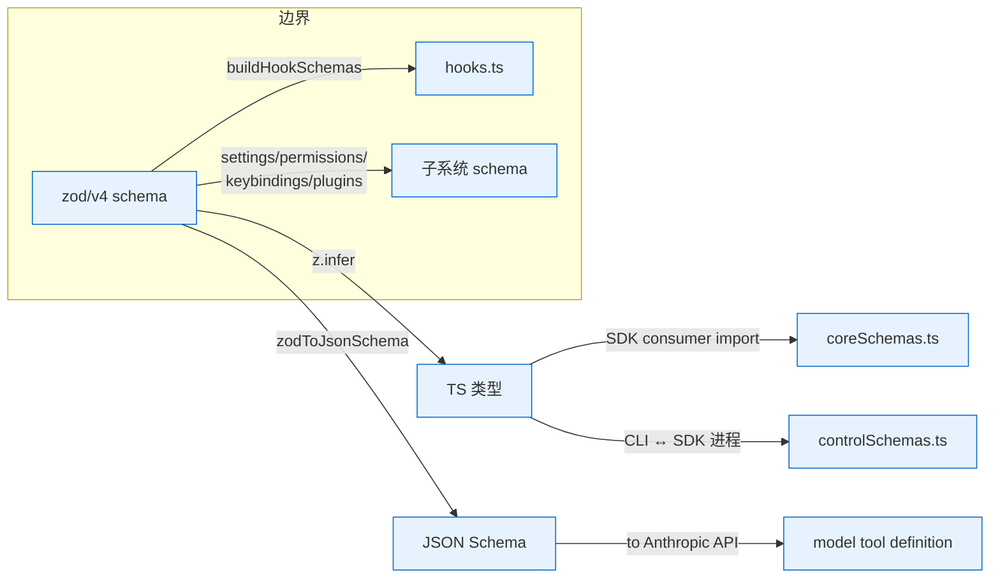
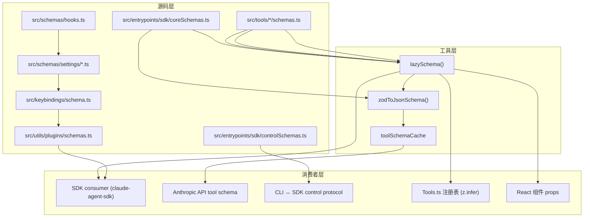
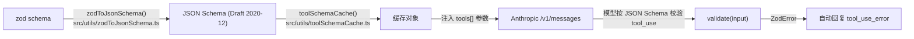

# 第 20 章 · Schema 契约 —— Zod v4 单一事实源

> 本章面向开发者,系统描述 Claude Code 的 schema-first 风格:SDK core schemas、控制协议 schemas、settings/hooks/keybindings/plugins 等子系统的 schema,以及 schema → JSON Schema → TS 类型的传递路径。术语以 [`00-front/03-glossary.md`](../00-front/03-glossary.md) 为准;分层坐标见 [`04-architect/25-layered-arch.md`](../04-architect/25-layered-arch.md) L4 契约层。

## 摘要

Claude Code 全面采用 **schema-first**:所有跨进程契约、工具输入输出、设置项、按键绑定、插件元数据都先用 `zod/v4` 描述,再把 TS 类型 `z.infer` 出去,运行时再用 `zodToJsonSchema` 转成给 Anthropic API 的 JSON Schema 表述。核心工具是 `lazySchema(() => ...)`(`src/utils/lazySchema.ts:5-8`),把 zod schema 构造从模块加载期推迟到第一次访问,既避免循环依赖,又把 bundle 阶段副作用压到最小。SDK 侧拆为 `coreSchemas.ts`(可序列化类型)和 `controlSchemas.ts`(SDK ↔ CLI 的进程控制协议),两者**严格区分** —— SDK consumer 只应 import `coreSchemas.ts`。Settings、hooks、permissions、keybindings、plugins 各自拥有自己的 schema,`buildHookSchemas`(`src/schemas/hooks.ts:30-170`) 完整覆盖 command/prompt/http/agent 四类 hook。Schema 反模式集中在**`AgentHook` 上加 `.transform()`**——`src/schemas/hooks.ts:127-136` 的注释明确警告:round-trip 后函数值被 `JSON.stringify` 静默丢弃,用户 prompt 会消失。

## 速赢

1. **单一事实源 = Zod schema**:SDK 类型、工具输入输出、设置项都以 `zod/v4` 描述;TS 类型 `z.infer` 出去。
2. **`lazySchema(() => ...)` 是基础设施**:`src/utils/lazySchema.ts:5-8`,8 行,所有 Tool 的 input/output schema 必须经它。
3. **SDK 两套 schema**:`coreSchemas.ts`(可序列化)+ `controlSchemas.ts`(进程控制),SDK 用户只引用前者。
4. **`z.strictObject` 是默认值**:多 1 个字段立刻报错,避免模型悄悄带额外参数。
5. **`z.discriminatedUnion` 优于 `z.union`**:报错路径短、字段名/类型被静态验证;Tool result、permission update 都用它。
6. **生成 JSON Schema → API**:走 `src/utils/zodToJsonSchema.ts`,再过 `src/utils/toolSchemaCache.ts` 缓存到 Anthropic API 调用处。
7. **`buildHookSchemas` 工厂**:`src/schemas/hooks.ts:30-170`,140 行覆盖 4 种 hook 类型。
8. **Hooks schema 的反模式**:`AgentHook` 上加 `.transform()` 会让用户 prompt 在 settings round-trip 后消失。

## 关键图





## 详细机制

### 20.1 `lazySchema`:把 schema 构造推迟到第一次访问

文件:`src/utils/lazySchema.ts`(8 行)。

```ts
export function lazySchema<T>(factory: () => T): () => T {
  let cached: T | undefined
  return () => (cached ??= factory())
}
```

- **为什么需要它**?Zod 在 `.strictObject(...)` 构造期会**立即**校验、冻结、生成内部 cache。如果在模块顶层 `const inputSchema = z.strictObject({...})`,会在导入时执行,而 bundle 阶段并不一定把所有模块都用到,等于无谓的初始化开销。
- **惯用法**:
  ```ts
  const inputSchema = lazySchema(() => z.strictObject({ file_path: z.string() }))
  type InputSchema = ReturnType<typeof inputSchema>
  ```
- **type 推导**:`ReturnType<typeof inputSchema>` 解开 lazy,拿到 `ZodObject<...>`,再 `z.infer` 出 TS 类型。
- **Bundle 友好**:被 `feature('XXX')` 守门关闭时,`lazySchema` 闭包整个被裁掉,不会触发 zod 副作用。

> 工具章节(第 16/17 章)已经反复使用本模式;本章后续不再赘述。

### 20.2 SDK 双套 schema:core vs control

文件:
- `src/entrypoints/sdk/coreSchemas.ts`(SDK 公开 API 的可序列化类型)
- `src/entrypoints/sdk/controlSchemas.ts`(SDK ↔ CLI 之间的进程控制协议)

`coreSchemas.ts` 文件头明确:
> SDK serializable types 的 Zod schemas。Schema 是 single source of truth,TS 类型从 schema 生成。

`controlSchemas.ts` 文件头明确:
> SDK implementation 与 CLI 之间的 control protocol。SDK consumer 应使用 coreSchemas.ts。

这两条注释是**契约文件**,开发者必须遵守 —— 任何 SDK consumer 引用 `controlSchemas.ts` 都会被 SDK 维护者拒绝。

#### 20.2.1 `coreSchemas.ts` 主要条目

| 条目 | 行号 | 用途 |
|---|---|---|
| `ModelUsageSchema` | `:16-27` | 模型用量统计(input_tokens/output_tokens/cache_*) |
| `OutputFormatSchema` | `:33-50` | 文本/JSON/stream-json 输出 |
| `ThinkingConfigSchema` | `:68-103` | 思考模式配置(`adaptive`/`enabled`/`disabled`) |
| `MCP config/status` | `:109-235` | MCP 服务器配置与运行时状态 |
| `Permission schema` | `:241-347` | SDK 暴露的 permission update 类型 |
| `Hook events` | `:354-384` | 27 个 hook event 名字常量 |
| `Base hook input` | `:386-410` | hook 回调入参的基类 |

`ThinkingConfigSchema` 是判别联合的范例:
```ts
export const ThinkingConfigSchema = lazySchema(() =>
  z.union([
    ThinkingAdaptiveSchema(),
    ThinkingEnabledSchema(),
    ThinkingDisabledSchema(),
  ]),
)
```

> 注意:这里用 `z.union` 而非 `z.discriminatedUnion`,因为三个 variant 都是**空对象**,没有可作 discriminator 的字段。`discriminatedUnion` 要求每个 variant 都有一个公共字面量字段。

#### 20.2.2 `controlSchemas.ts` 主要条目

| 条目 | 行号 | 用途 |
|---|---|---|
| `SDKControlInitializeRequestSchema` | `:56-74` | 初始化握手 |
| `Initialize response` | `:76-94` | 握手响应 |
| `Interrupt` | `:96-102` | 中断当前 turn |
| `Can-use-tool permission request` | `:105-121` | 权限询问 |
| `Permission mode` | `:123-134` | default/acceptEdits/bypassPermissions/plan |
| `Model/thinking` | `:136-154` | 切换模型/thinking |
| `MCP status` | `:156-172` | MCP 状态查询/更新 |
| `Context usage` | `:174-305` | 上下文窗口用量 |
| `Hook callback` | `:362-371` | hook 触发回调 |
| `Plugin reload` | `:404-432` | 插件热加载 |
| `Stop task` | `:454-461` | 停止后台任务 |
| `Settings request/response` | `:463+` | 设置同步 |

> 控制协议 schema 与公开 API schema 是两个**互不重叠**的关注点:`coreSchemas.ts` 描述 SDK 用户输入/输出;`controlSchemas.ts` 描述 SDK 实现与 CLI 之间的进程通信。

### 20.3 Hook schema 工厂 `buildHookSchemas`

文件:`src/schemas/hooks.ts`(210+ 行)。

文件头注释解释了它的存在原因:
> 该文件用于打破 settings/types 与 plugins/schemas 的 import cycle。

`buildHookSchemas`(`:30-170`)集中构造 4 类 hook:
- `command` —— shell 命令 hook(白名单子进程执行)
- `prompt` —— 触发 LLM 推理 hook
- `http` —— 远程 webhook hook(过 SSRF guard)
- `agent` —— 子代理 hook

返回值:
```ts
HookCommandSchema   // src/schemas/hooks.ts:175-188
HookMatcherSchema   // :193-203
HooksSchema         // :210-212
```

#### 20.3.1 `AgentHook` 的反模式

`src/schemas/hooks.ts:127-136` 是**最重要的警告**:

```
// 不要在 AgentHook schema 上加 .transform()
// transform 后的函数值在 settings JSON round-trip 时会被 JSON.stringify 静默丢弃
// 导致用户 prompt 被删除
```

原因:`settings.json` 是磁盘文件,读取时只能拿回 JSON 兼容类型(对象、数组、字符串、数字、布尔、null)。如果 `AgentHook` 形如 `z.object({ prompt: z.string().transform(s => parseFn(s)) })`,`parseFn` 落地后第二次启动就丢了。

正确做法是:
1. Schema 只描述**持久化形态**(全部是 JSON 兼容类型);
2. 运行时从持久化形态**派生**需要的函数(用 `getMemoizedParseFn()` 包一层 memoize)。

### 20.4 settings/permissions/keybindings/plugins 的 schema 拆分

| 子系统 | 主要 schema | 文件锚点 |
|---|---|---|
| Settings | `SettingsSchema` | `src/utils/settings/schemaOutput.ts`(原推断 `schema.ts` 在泄露中不存在;schema 实际由 `validation.ts`/`types.ts` 共同构成,可由 CodeGraph 查得) |
| Permissions | `PermissionUpdateSchema` | `src/utils/permissions/PermissionUpdateSchema.ts` |
| Keybindings | `KEYBINDING_CONTEXTS`、`KEYBINDING_ACTIONS`、`KeybindingBlockSchema`、`KeybindingsSchema` | `src/keybindings/schema.ts:11-228` |
| Plugins | plugin 元数据 + manifest | `src/utils/plugins/schemas.ts` |
| LSP | LSP 工具 schema | `src/tools/LSPTool/schemas.ts` |
| Tool schemas | 每个工具各自的 input/output | `src/tools/<ToolName>/<ToolName>.ts(x)` |

#### 20.4.1 Keybinding schema 示例

`src/keybindings/schema.ts` 是 `z.string().regex()` + `z.union` 的经典组合:

```ts
const actionSchema = z.union([
  z.enum(KEYBINDING_ACTIONS),                              // 已知 action
  z.string().regex(/^command:[a-zA-Z0-9:\-_]+$/),          // 用户自定义 /command 触发
  z.null(),                                                // 解绑
])
```

这意味着按键配置既可以是**枚举字符串**(`'confirm:yes'`),也可以是**指向 slash 命令的引用**(`'command:clear'`),也可以是 `null`(禁用)。这种 `string | regex-matched | null` 的 union 设计允许键绑定上下文向后兼容新增命令。

### 20.5 zod → JSON Schema → API 的传递路径



#### 20.5.1 `zodToJsonSchema` 的存在意义

- zod 的 `.strictObject` 不会直接转成 Anthropic API 认识的 `additionalProperties: false`;`zodToJsonSchema` 显式翻译每个关键字(`z.string()` → `{type:'string'}`、`z.enum` → `{enum:[...]}`)。
- 工具 schema 经常嵌套 6+ 层,直接手写 JSON Schema 维护成本极高;由 schema 推导是单一事实源。

#### 20.5.2 `toolSchemaCache` 的存在意义

- 同一 session 内,模型调用同一个工具 100+ 次,但其 schema 不会改变;每次都重新转换是浪费。
- `toolSchemaCache` 以 `(toolName, schemaHash)` 为 key 缓存,只有 `lazySchema` 返回新引用时才重新生成。

### 20.6 工具 schema 的实战模式

```ts
// 来自第 17 章 FileHashTool
const inputSchema = lazySchema(() =>
  z.strictObject({
    file_path: z.string().describe('The absolute path to the file to hash'),
  }),
)
type InputSchema = ReturnType<typeof inputSchema>

const outputSchema = lazySchema(() =>
  z.strictObject({
    hash: z.string().length(64).describe('Lowercase SHA-256 hex digest'),
    size: z.number().int().nonnegative().describe('File size in bytes'),
    path: z.string().describe('Resolved absolute path that was hashed'),
  }),
)
type OutputSchema = ReturnType<typeof outputSchema>

export type Input = z.infer<InputSchema>
export type Output = z.infer<OutputSchema>
```

要点:
1. **两层类型**:`InputSchema`(zod 类型)→ `Input`(纯 TS 类型);前者用于运行时校验,后者用于代码内引用。
2. **`strictObject` 而非 `object`**:模型多带字段会被 Zod 拒收 → `<tool_use_error>`。
3. **`.describe(...)`** 是 prompt:它会**同时**进入 JSON Schema 的 `description` 字段,告诉模型每个字段的含义。

### 20.7 `z.discriminatedUnion` 的典型场景

工具结果是判别联合(`success` / `error`),用 `discriminatedUnion` 强制要求每个 variant 有 `type` 字段:

```ts
const FileHashResultSchema = lazySchema(() =>
  z.discriminatedUnion('type', [
    z.object({
      type: z.literal('success'),
      hash: z.string(),
      size: z.number(),
    }),
    z.object({
      type: z.literal('error'),
      code: z.enum(['ENOENT', 'EACCES']),
      message: z.string(),
    }),
  ]),
)
```

`z.discriminatedUnion('type', [...])` 比 `z.union([...])` 的优势:
- 错误信息直接指向**具体 variant**(`"Invalid discriminator value: expected 'success' | 'error'"`);
- TS 推导时 `if (r.type === 'success')` 会自动 narrow 到 success variant 的字段。

### 20.8 schema-first 的迁移与兼容性

#### 20.8.1 添加字段

```ts
// v1
z.strictObject({ file_path: z.string() })

// v2 — 必须用 .optional() + 默认值,否则旧 settings.json 读不出来
z.strictObject({
  file_path: z.string(),
  algorithm: z.enum(['sha256', 'sha1']).optional().default('sha256'),
})
```

> `strictObject` 不允许 unknown 字段,但允许已声明字段标 `optional`。

#### 20.8.2 弃用字段

不要直接删,先标 deprecated,然后在解析时迁移:

```ts
const inputSchema = lazySchema(() =>
  z.strictObject({
    path: z.string(),
    // 弃用 → 解析时把 path 复制到 file_path
    file_path: z.string().optional(),
  }).transform((input) => ({
    ...input,
    file_path: input.file_path ?? input.path,
  })),
)
```

注意:`.transform()` 用在**输入** schema 上是安全的(运行时解析后即丢弃);用在**持久化** schema(settings/hooks)上则会丢字段(见 20.3.1)。

#### 20.8.3 跨进程协议的破坏性升级

`coreSchemas.ts` 与 `controlSchemas.ts` 一旦发布,字段**只加不删**,且新增字段必须 `optional()`。跨大版本时可同步在 `package.json` 标 SDK major bump。

## 反模式

### ❌ 在模块顶层直接构造 schema

```ts
// 错误:模块加载期立即执行 zod 构造
const inputSchema = z.strictObject({ file_path: z.string() })
```

```ts
// 正确
const inputSchema = lazySchema(() => z.strictObject({ file_path: z.string() }))
```

> 直接顶层构造会让被 `feature()` 守门关闭的分支也付出 zod 初始化开销;且在某些 import cycle 中导致模块求值顺序错误。

### ❌ 在 `AgentHook` 等持久化 schema 上加 `.transform()`

见 20.3.1。**settings.json round-trip 会让函数值消失**。

### ❌ 用 `z.object` 而非 `z.strictObject`

```ts
// 错误:模型可带任意额外字段
z.object({ file_path: z.string() })
```

```ts
// 正确:多余字段直接报错
z.strictObject({ file_path: z.string() })
```

### ❌ 引用 `controlSchemas.ts` 当 SDK 公开 API

SDK 用户只能 import `coreSchemas.ts`。`controlSchemas.ts` 是 SDK 实现 ↔ CLI 的私有协议,跨小版本可能不兼容。

### ❌ 把 `z.infer` 出来的类型再二次声明

```ts
// 错误:把 input 和 type 双声明,以后改 schema 容易漏
const inputSchema = lazySchema(() => z.strictObject({ file_path: z.string() }))
type Input = { file_path: string }   // ← 冗余且危险
```

```ts
// 正确
type Input = z.infer<ReturnType<typeof inputSchema>>
```

### ❌ 在 React 组件 props 中直接用 zod 类型

```tsx
// 错误:Zod 类型携带运行时元数据,会让 props 序列化失败
function MyComponent({ input }: { input: InputSchema }) { ... }
```

```tsx
// 正确:用 z.infer 推导的纯 TS 类型
function MyComponent({ input }: { input: Input }) { ... }
```

## 引用与下一步

### 前置
- `00-front/03-glossary.md` —— Zod / JSON Schema 术语
- `03-developer/16-tool-contract.md` —— Tool 的 input/output schema 必读
- `03-developer/17-build-a-tool.md` —— `lazySchema` 实战

### 平行
- `03-developer/18-commands.md` —— Command 的 `argumentHint`/`allowedTools`/`paths` 等元数据也是 schema
- `03-developer/19-ui-patterns.md` —— design-system props 用 z.infer 推导
- `04-architect/25-layered-arch.md` —— L4 契约层

### 后继
- `03-developer/22-telemetry.md` —— telemetry event schema 同样 zod-first
- `04-architect/26-data-flow.md` —— schema 在消息流中的位置

### 源码定位

| 主题 | 路径:行 |
|---|---|
| `lazySchema` 工厂 | `src/utils/lazySchema.ts:5-8` |
| SDK core schemas 入口 | `src/entrypoints/sdk/coreSchemas.ts:1-410` |
| SDK control schemas 入口 | `src/entrypoints/sdk/controlSchemas.ts:1-461+` |
| `ThinkingConfigSchema` | `src/entrypoints/sdk/coreSchemas.ts:68-103` |
| MCP config/status schema | `src/entrypoints/sdk/coreSchemas.ts:109-235` |
| Hook schema 工厂 | `src/schemas/hooks.ts:30-170` |
| Hook schema 反模式警告 | `src/schemas/hooks.ts:127-136` |
| Hook command/matcher/Hooks schema | `src/schemas/hooks.ts:175-212` |
| Keybinding action schema | `src/keybindings/schema.ts:11-228` |
| zod → JSON Schema 转换 | `src/utils/zodToJsonSchema.ts` |
| Tool schema 缓存 | `src/utils/toolSchemaCache.ts` |
| Permission update schema | `src/utils/permissions/PermissionUpdateSchema.ts` |
| Plugin manifest schema | `src/utils/plugins/schemas.ts` |
| Settings schema 输出 | `src/utils/settings/schemaOutput.ts` |
| LSP tool schema | `src/tools/LSPTool/schemas.ts` |
| Tool input/output 实战 | `src/tools/FileHashTool/FileHashTool.tsx:181-196`(第 17 章) |
| Hook 27 个 event 常量 | `src/entrypoints/sdk/coreTypes.ts:25-53` |
